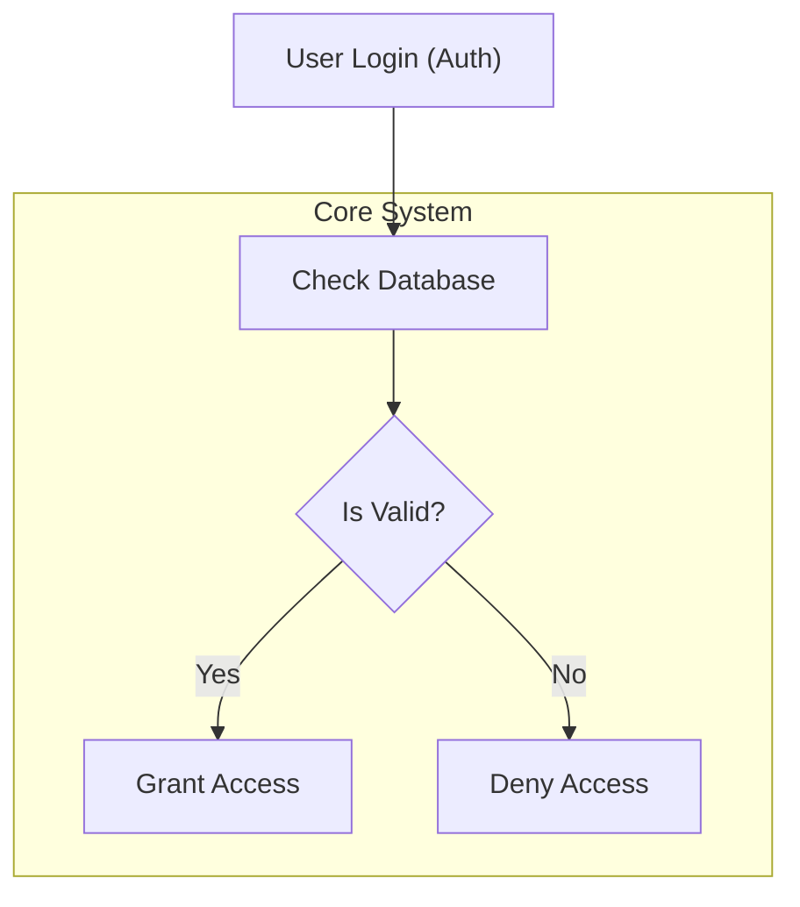

# Mermaid Diagram Standards

When asked to create a diagram or visualize architecture, you MUST use Mermaid JS. However, you must adhere to the following strict formatting rules to prevent rendering failures in the user's specific markdown environment.

## 1. Banned Diagram Types
- **DO NOT USE `sequenceDiagram`**. The user finds them hard to read and visually cluttered.
- Instead of a sequence diagram, use a `flowchart TD` (Top-Down) or `flowchart LR` (Left-Right) to represent sequential flow, state machines, or architecture. You can easily represent time or sequences by linking nodes from top to bottom.

## 2. Syntax and Rendering Rules (CRITICAL)
The markdown parser is very fragile regarding special characters in Mermaid blocks. You must follow these escaping rules perfectly to prevent the diagram from failing to render:

- **No Unescaped Ampersands (`&`)**: Never use an unescaped `&` inside a node label or an edge label. Always replace it with the word "and".
- **No Multi-Edge Shortcuts**: Never use the `&` operator to connect multiple nodes on a single line (e.g., `A --- B & C`). Some renderers reject this. Always write out explicit 1-to-1 connections on new lines:
  ```mermaid
  A --- B
  A --- C
  ```
- **Quote All Complex Labels**: If a node label contains spaces, parentheses, brackets, or special characters, you MUST wrap the label text in double quotes. 
  - INCORRECT: `NodeA[This is a (test)]`
  - CORRECT: `NodeA["This is a (test)"]`
- **Quote Subgraph Titles**: If a subgraph title contains spaces or parentheses, you must wrap the title in double quotes.
  - INCORRECT: `subgraph DB1 [Database (SQL)]`
  - CORRECT: `subgraph DB1 ["Database (SQL)"]`
- **No HTML Tags**: Do not use `<br/>`, `<b>`, or other HTML tags inside node labels. Use `\n` inside quoted strings to denote line breaks.
  - INCORRECT: `NodeA[Line 1<br/>Line 2]`
  - CORRECT: `NodeA["Line 1\nLine 2"]`

## Example of a Perfect Diagram

