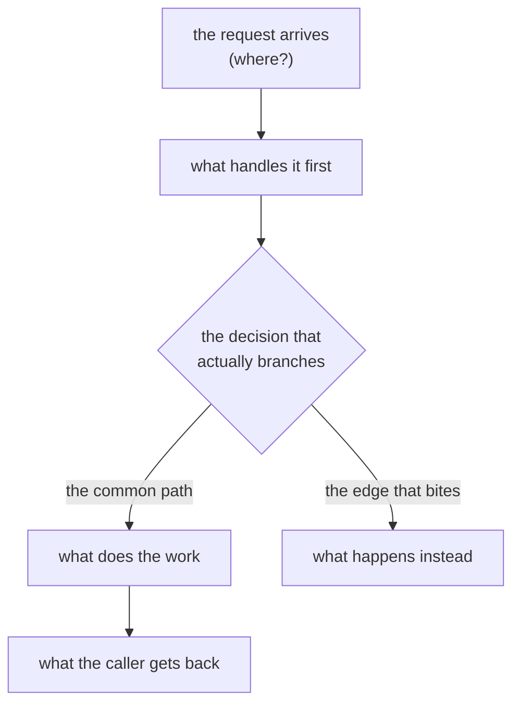

# <Project> — Project Overview Guide

<!--
  ⛔ COPY THIS FILE TO `docs/project_overview_guide.md` IN THE PROJECT. It is a template, not
  a page anybody reads here.

  WHAT THIS PAGE IS, AND WHAT IT IS NOT — the distinction is the whole design:

    this page   what was BUILT, and how a request actually flows through it, for a HUMAN
    the PRD     what was WANTED

  They are different documents with different lifetimes and this one is NEVER the source for
  rewriting the other. A story changes behaviour → this page moves. An epic ships → the PRD is
  RECONCILED against this page's delta for that epic (`/cicd-push-e2e --after-merge`), which
  either produces a sprint-change-proposal through `/bmad-correct-course` or records
  `PRD: unchanged`. Feeding this page back into the PRD wholesale turns the requirements
  document into a second, more expensive copy of this one.

  HOW IT STAYS CURRENT: `/cicd-update-sprint-memory` Step 3.5 runs at every story save. Either
  the story changed a flow, a part, a contract or where something lives — then this page moves
  on the story branch — or the walkthrough carries
  `Project overview guide: unchanged - <reason>`. `closeout_preflight.py`'s `overview` check
  reads one or the other; neither is an ERROR that blocks the close-out.

  DIAGRAMS: `flowchart TD` or `flowchart LR` ONLY. ⛔ Never `sequenceDiagram` — the operator has
  ruled it unreadable (`.agents/rules/mermaid-diagram-preferences.md`). A multi-actor hand-off is
  a node in a flowchart, not a lifeline.

  LINKS: every path is a clickable relative Markdown link, never a bare path
  (`.agents/rules/constitution.md` §Always).

  LENGTH: aim for something a new engineer reads in fifteen minutes. It POINTS at the repo map,
  the PRD and the architecture folder; it does not restate them.
-->

## 1. What this is

<!-- One paragraph. What does this system DO, for whom, and what would break for them if it
     stopped? Lead with the consequence, not the mechanism. No architecture here. -->

## 2. How a request flows

<!-- One `flowchart TD` per major entry point — the chat turn, the voice session, the admin
     action, the scheduled job. Draw what actually happens today, including the failure edges
     that matter. If a diagram and the code disagree, the code is right and this page is stale. -->

## 3. The parts, and what each one owns

<!-- The contract table. A part earns a row when it can be changed independently of the others.
     "Talks to" is what it CALLS, not what calls it — the reader follows the arrows in §2. -->

| Part | Owns | Talks to | Lives at |
| --- | --- | --- | --- |
| | | | [`path/`](path/) |

## 4. Where things live

<!-- POINTERS ONLY. The navigation index is `docs/repo-map.md` and it is generated; do not copy
     its tree here or the two rot apart. This section answers "which document do I open for X",
     where X is a KIND of question — requirements, architecture, sprint state, secrets. -->

| I need… | Read |
| --- | --- |
| the folder map | [`docs/repo-map.md`](repo-map.md) |
| what was asked for | the PRD |
| the invariants | the architecture folder |
| what is running now | the active-context |

## 5. What changed, per epic

<!-- One row per SHIPPED epic, newest first, written at `/cicd-push-e2e --after-merge`. This is
     the column the PRD reconcile reads: the diff of this section across an epic is the index
     into which PRD sections to open. Say what changed in the SYSTEM, not which tickets closed. -->

| Epic | What changed in the system | Shipped |
| --- | --- | --- |
| | | |

## 6. Glossary

<!-- Every coined term, with a five-word gloss, defined once. If a term appears above and is not
     here, the reader has to hold it from memory — which is the failure this section prevents. -->

| Term | Means |
| --- | --- |
| | |
