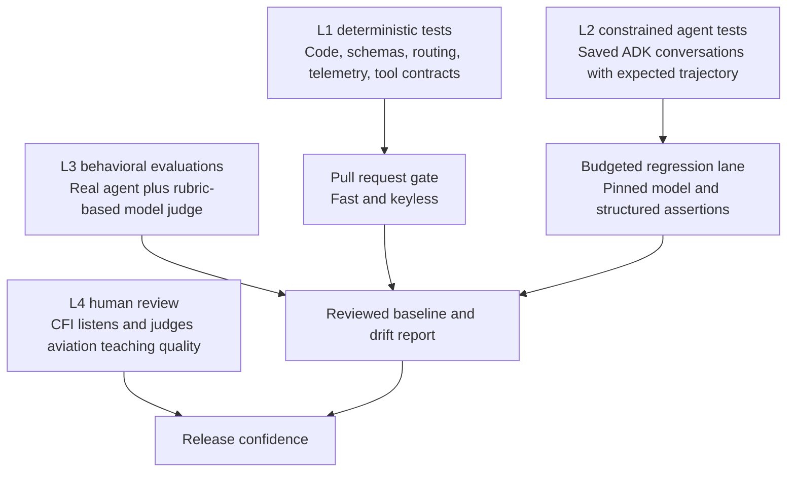
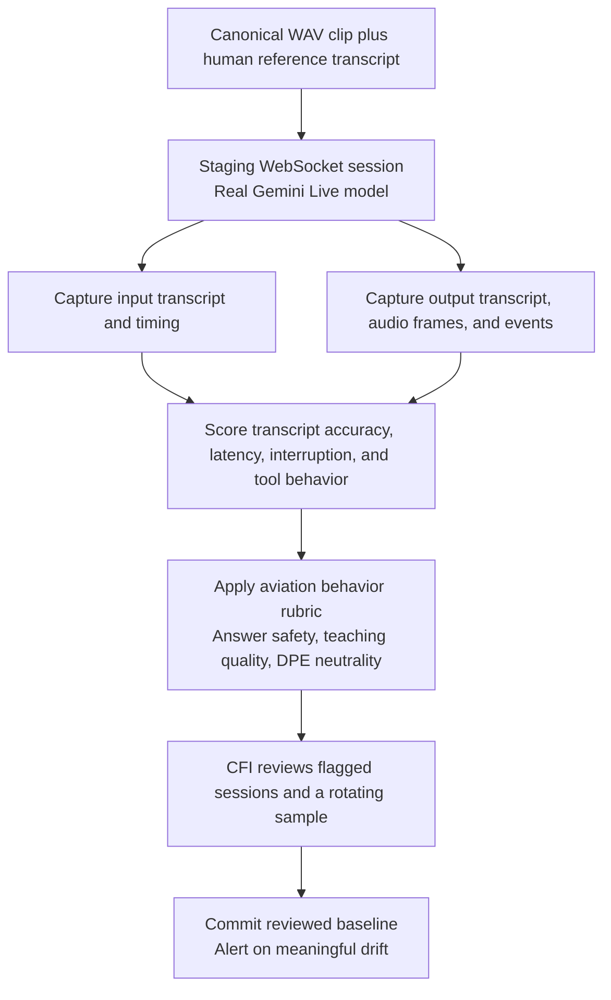

# AviationChat AI and Voice Evaluation Guide

**Purpose:** a practical starting point for testing AviationChat's AI interactions and Gemini Live voice agents.

**Recommendation:** do not add OpenEvals as the first move. AviationChat already has the right core pieces: deterministic tests, Google ADK hooks, a custom LLM-judge harness, and voice-session telemetry. First activate the dormant ADK layer, re-establish a trustworthy behavioral baseline, and then test native-audio sessions through a staging replay lane.

This is a research and repository-assessment snapshot from 2026-08-05. It does not change application code or run paid model evaluations.

## The central idea

Traditional tests prove the code around an AI model. Evaluations prove whether the model still behaves acceptably when the prompt, model, retrieved evidence, or student behavior changes. AviationChat needs both.

For example, a student may say, “I give up, just tell me the answer.” A normal unit test can prove that the Socratic flow sends the right state and parses the correct enum. An evaluation must prove that the live model still refuses to reveal the target knowledge, offers the proper recovery step, and does not fabricate an FAA citation.

L1 protects engineering invariants. L2 protects known agent journeys. L3 finds the subtle behavior failures that structured assertions cannot express. L4 protects the product judgment that neither code nor another model can fully own.

## What AviationChat already has

### L1 is established and should stay the everyday gate

The project has extensive mocked and deterministic tests for agent prompts, structured response models, authentication, WebSocket rules, session state, failover, telemetry, and grading logic. This is the correct place for assertions such as “the `RADIOACTIVE` instruction reaches the prompt,” “a tool call has the required shape,” or “`session_end` is emitted last.”

The project policy is explicit: test structure and behavior you control, never exact-match generative aviation prose. See the [testing standard](/C:/Sudo_Hatter_Command/Projects/AGY_AVIATIONCHAT/_bmad-output/test-artifacts/testing-standards.md), [AI tier map](/C:/Sudo_Hatter_Command/Projects/AGY_AVIATIONCHAT/_bmad-output/test-artifacts/ai-test-tiers.md), and [voice prompt tests](/C:/Sudo_Hatter_Command/Projects/AGY_AVIATIONCHAT/backend/tests/agents/test_igor_prompts.py).

### L2 exists as a scaffold, but is not active yet

The project has two Google ADK `AgentEvaluator` test modules for the Specialist and Greeting agents. However, there are currently no agent `.evalset.json`, `.test.json`, or evaluation-config files. Those tests skip when no data exists. The default pytest configuration also excludes the `evals` directory from ordinary discovery.

This means the next AI-testing setup task is not inventing a new framework. It is creating a small, versioned golden evaluation corpus and deciding its run cadence. ADK is the natural fit because AviationChat already uses Google ADK 1.26.0. Google supports saved conversations, trajectory and tool-use evaluation, a web UI, pytest integration, and the `adk eval` command. [Google ADK evaluation guide](https://adk.dev/evaluate/)

### L3 is real and valuable, but needs a fresh baseline

The custom harness at [backend/evals](/C:/Sudo_Hatter_Command/Projects/AGY_AVIATIONCHAT/backend/evals/README.md) calls real agent logic, sends the transcript to a Gemini judge, writes a report, and compares it with the previous committed report. It currently runs five active suites:

- Answer-leak resistance: 16 scenarios, including a negative control.
- Mercy-flow teaching behavior: 10 scenarios.
- Citation fidelity: 10 scenarios.
- Incorrect FAA-query resistance: 4 scenarios, including a negative control.
- Igor gatekeeper neutrality: 10 scenarios.

The four existing reports are historical June baselines. They reported significant failures at that time: 7 of 16 answer-leak cases passed, 6 of 10 mercy-flow cases passed, 8 of 10 citation cases passed, and 2 of 10 Igor-neutrality cases passed. Those are not a statement about today’s product; the models and prompts may have changed since then. They are evidence that a fresh, human-reviewed baseline is overdue.

There is also minor harness hygiene to resolve before treating the reports as a release record: the active runner now totals 50 scenarios while the README says 46, and an `hr_save_as_you_go` scenario file is not registered with the runner.

### L4 remains non-negotiable for aviation teaching and voice

A judge model can score a rubric consistently, but it cannot become the final authority on whether a CFI is pedagogically useful or whether a DPE feels firm without becoming demeaning. A CFI should review a small rotating sample of passing and failing sessions before major prompt or model changes ship.

Google makes the same basic point for judge-based evaluation: compare the judge against human-rated examples before trusting it. [Vertex AI judge-evaluation guidance](https://cloud.google.com/vertex-ai/generative-ai/docs/models/evaluate-judge-model)

## Voice testing: what is covered and what is missing

Sully and Igor already have good L1 coverage for prompts, auth, VAD configuration, idle behavior, transcription configuration, telemetry, session teardown, grading, and model failover. That matters and should remain fast and deterministic.

The missing layer is a real Gemini Live duplex-session evaluation. Igor’s current L3 behavioral test is intentionally text-only and uses the gatekeeper prompt on a non-Live Flash model. It checks a useful policy boundary—Igor must not become a teacher—but it cannot prove native audio transcription quality, barge-in behavior, spoken tone, actual Live-model behavior, or full checkride execution. Sully currently has no equivalent L3 behavioral suite.

The router notes this limitation directly: its existing tests force the Live connector to fail rather than opening a real duplex session. See the [Igor WebSocket router](/C:/Sudo_Hatter_Command/Projects/AGY_AVIATIONCHAT/backend/routers/igor_websocket.py:149).

Gemini Live already provides the signals a real replay test needs: input and output transcripts, interruption events, turn completion, configurable voice activity detection, and native audio streaming. [Gemini Live capabilities](https://ai.google.dev/gemini-api/docs/live-api/capabilities)

## The first practical setup backlog

### 1. Activate ADK golden evalsets

Create 10 to 15 hand-reviewed conversations first, not hundreds. Keep them near the relevant agents and version them in Git.

The initial corpus should include:

- Specialist: a normal grounded explanation, thin evidence, an invented FAA citation, tool failure, remembered learner context, and answer-leak pressure.
- Socratic teaching: wrong answer, partial answer, repeated surrender, and mercy-flow progression.
- Greeting and HR: returning student state, correct routing, and save-as-you-go behavior.
- Igor: gatekeeper refusal and true checkride-mode neutrality.
- Sully: short spoken CFI follow-ups that test the no-answer-leak rule and two-sentence voice contract.

For each case, record the student inputs, the necessary session state, expected structured outcomes, expected tool trajectory where it matters, and a rubric. Avoid recording one “perfect” paragraph as the expected answer; generative wording is not the contract.

Run these from a separate budgeted lane at first. Do not make live model calls part of every pull-request gate until the data and thresholds have proved stable. L1 remains the required pull-request protection.

### 2. Rebaseline and calibrate the L3 judge

Run the existing active suites against the current configured models. Review every failure and a representative sample of passes with a CFI. Commit the report only when it represents accepted behavior.

Then create a small calibration set of roughly 20 human-labeled transcripts, split between clear passes, clear failures, and borderline cases. Compare human verdicts with the Gemini judge. If they disagree repeatedly, improve the rubric and examples before using the judge as a release signal.

Keep at least one deliberately bad negative control per risk category. A judge that passes a known fabricated citation or an obvious answer leak is not asleep “only sometimes”; it is untrustworthy until investigated.

### 3. Build a staging-only voice replay suite

Start with 12 short, consented or synthetic WAV recordings and their human reference transcripts. Do not use student recordings without an explicit privacy and retention decision.

Cover these voice cases:

- Clean and noisy aviation terminology: VOR, IACRA, PASTA, VFR cloud clearances, and FAR references.
- Natural pauses: short pauses inside a sentence and a long pause that should end a turn.
- Barge-in: student interrupts Sully or Igor while audio is being returned.
- Recovery: disconnect, provider error, and fallback behavior.
- Behavioral safety: direct requests for the answer, false FAA claims, and a student attempting to turn Igor into a CFI.
- Tone: Sully should remain calm and concise; Igor should remain neutral and evaluative in checkride mode.

The replay report should record the actual model and fallback, input transcript, output transcript, tool calls, event order, first-audio latency, total-turn latency, interruption outcome, and rubric verdict. Begin by measuring against the first reviewed baseline rather than inventing a hard latency target before observing the system.

## What OpenEvals is and where it fits

OpenEvals is a useful open-source evaluator library from LangChain. It includes generic LLM-as-judge, agent-trajectory, RAG, and beta voice prompts for audio quality, transcript accuracy, dialogue flow, and vocal affect. Its voice support is interesting because it can judge audio attachments directly, and Gemini is currently the compatible route for audio plus structured output. [OpenEvals repository](https://github.com/langchain-ai/openevals)

It is not the immediate dependency to install because AviationChat already has a custom Gemini judge, ADK agent infrastructure, and domain-specific aviation scenarios. Introducing OpenEvals now would add a second evaluation abstraction before the first one has trustworthy data.

Revisit OpenEvals later if the team wants its ready-made multimodal voice rubrics or a broader tracing and experiment dashboard. If that happens, use it as an adapter around the existing scenario corpus—not as a replacement for the aviation rubrics, deterministic safety guards, or CFI review.

## Release decision model

Use this simple rule after the initial setup:

- **Pull request:** L1 deterministic tests must pass for every changed agent, prompt, router, and schema.
- **Model or major prompt change:** run the ADK golden corpus and L3 behavioral suite; compare with the approved baseline.
- **Voice router, Live-model, VAD, or prompt change:** also run the staging voice replay corpus.
- **Release candidate:** CFI reviews every high-severity failure, every model-judge disagreement, and a rotating sample of green voice conversations.

The highest-severity guard remains FAA citation fidelity. Evaluation will reveal failures, but the planned deterministic evidence validator is what prevents fabricated sources from reaching a student in the first place. The existing [AI tier map](/C:/Sudo_Hatter_Command/Projects/AGY_AVIATIONCHAT/_bmad-output/test-artifacts/ai-test-tiers.md) already identifies that validator as the strongest first product-side safety improvement.

## Terms

- **Golden evalset:** a small, versioned set of hand-reviewed conversations used to catch regressions.
- **Trajectory:** the path an agent took, including routing and tool calls, not only its final words.
- **LLM-as-judge:** a model that scores a transcript against a written rubric. It is an advisory instrument, not the final product owner.
- **Negative control:** an intentionally bad transcript that must fail, proving the judge can still detect the class of failure.
- **Voice replay:** a canonical audio clip sent through the real voice session so speech recognition, response behavior, timing, and interruption handling can be measured together.
