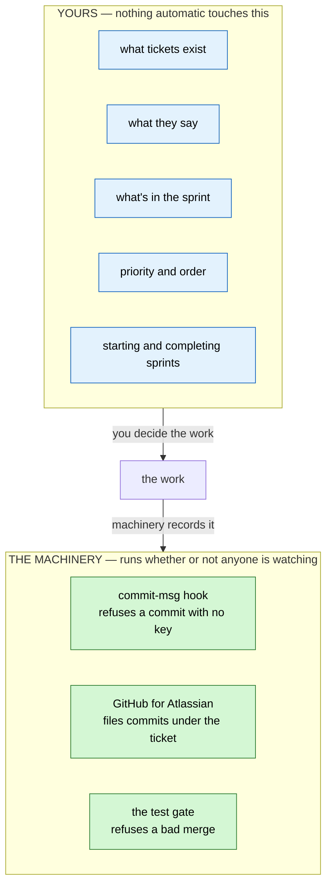
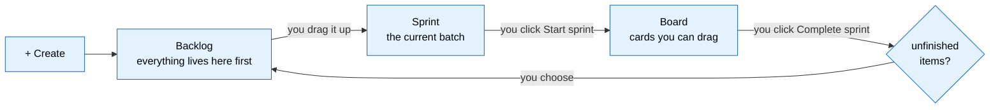
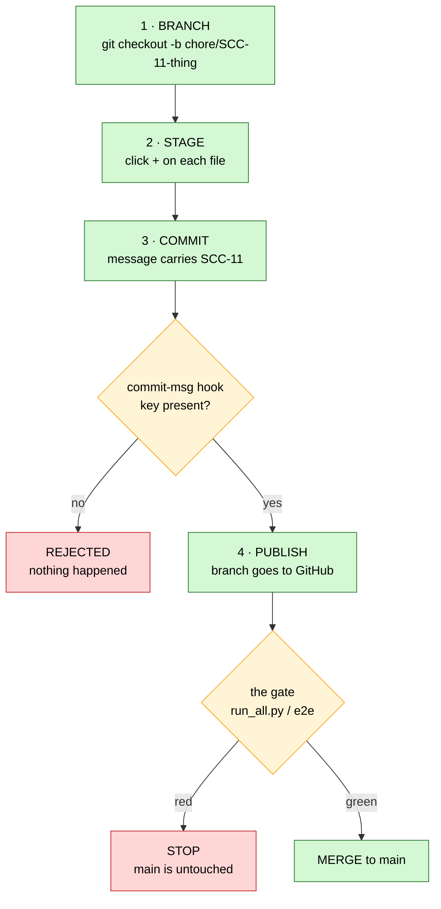
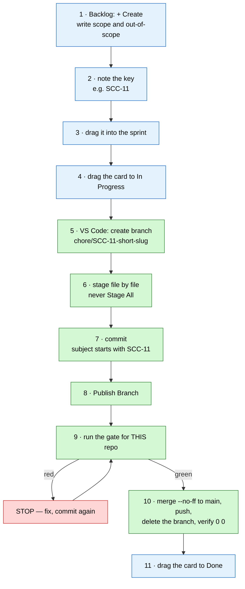

# Jira — The Manual Process

> **What this is.** Every step *you* perform by hand: creating work in Jira, moving it through a sprint,
> and pushing code through the VS Code Source Control panel. No commands, no agents, no terminal.
> Written 2026-08-07 from an actual run — including the parts that went wrong.
>
> **Companion doc:** [jira_integration_guide.md](../diagrams_guides/system/jira_integration_guide.md) explains *why* the system is
> built this way. This one is *how you drive it*.

---

## 1. Who touches what

The single most useful thing to hold in your head: **the planning layer is yours.** Nothing automatic
writes to it.



**The machinery never creates a ticket, never moves a card, never decides a priority.** It links commits
to tickets and refuses bad ones. That's the whole of its authority.

An agent *can* create or move tickets — but only when you ask it to, in that moment, the same way it
would edit a file. Left alone, it does nothing to your board. If you never spoke to a model again,
every mechanism in §3 below would keep working unchanged.

---

## 2. The Jira side — all by hand

### 2.1 Three places, and why the board looks empty

This trips up everyone once:

| Place | What it holds | URL |
|---|---|---|
| **Backlog** | everything not in the active sprint | `…/boards/2/backlog` |
| **Sprint** | the batch you've committed to right now | lives on the Backlog page |
| **Board** | **only the active sprint**, as draggable cards | `…/boards/2` |

**A Scrum board renders only the active sprint.** If your sprint is empty or unstarted, the board is
blank and nothing is wrong. Your work is one page over, in the Backlog.



Every arrow in that diagram is **you clicking something**. None of it happens on its own.

### 2.2 Create a backlog item

1. Open the **Backlog**.
2. **+ Create** — the button in the top bar, or the `+ Create` at the bottom of the Backlog list.
3. **Work type** — `Task` for plumbing, `Story` for user-facing, `Epic` for a container. The Story/Task
   line is soft; pick one and stay consistent. `Epic` is the one that genuinely behaves differently.
4. **Summary** — one line, what it is. This becomes the branch slug later, so keep it plain.
5. **Description** — what's in scope, what's explicitly *out* of scope, and which repos it touches.
   Out-of-scope is the half people skip and then argue about later.
6. Leave assignee, sprint and epic blank. It lands in the Backlog.

**Write down the key it gives you** — `SCC-11`, `AVCH-12`. That string is now the name of this piece of
work everywhere: branch, commits, PR title.

### 2.3 Move it into the sprint

On the Backlog page, **drag the card up** from the *Backlog* section into the *Sprint* section. Or
right-click → **Move to** → the sprint name.

That's the entire mechanism. There's no approval, no state change — the item's status is untouched.
You've only moved it into a different bucket.

### 2.4 Start and complete a sprint

**Start:** with at least one item in it, a **Start sprint** button appears on the sprint header. Name,
dates and goal are all optional. Once started, the Board comes alive.

**Jira never ends a sprint for you.** Past the end date it simply shows as overdue until you act.

**Complete:** the **Complete sprint** button appears while a sprint is active. Jira looks at what's
unfinished and asks where it should go:

- back to the **Backlog**
- into an **existing future sprint**
- into a **new sprint**

> **Completing a sprint never changes an item's status.** Something at `In Progress` stays `In Progress`;
> it just moves out of the box. Nothing is silently marked done.

**One thing to check on your board:** Jira counts an item as finished once it sits in the **last column**
— that's column *position*, not status name. If `Deferred` is the rightmost column, deferred work gets
counted as finished at sprint close and won't carry over. Drag the columns so `Done` is last.

### 2.5 Moving a card across the board = changing its status

Dragging a card from `To Do` to `In Progress` **is** a status change. That's all a status change is.

Three doors, one result — use whichever is in front of you:

| Door | How |
|---|---|
| **The board** | drag the card |
| **The terminal** | `acli jira workitem transition --key SCC-11 --status "In Progress"` |
| **A commit message** | a Smart Commit `#transition` directive |

Your statuses, and what each means here:

| Status | Meaning | Category |
|---|---|---|
| `To Do` | not started | To Do |
| `In Progress` | branch cut, work happening | In Progress |
| `In Review` | code landed on the epic branch, awaiting the gate | In Progress |
| `Done` | merged to `main` | Done |
| `Deferred` | descoped or parked — **still open**, deliberately | **To Do** |

`Deferred` sits in the `To Do` category on purpose. A `Done`-category status would auto-resolve the
ticket and make descoped work read as *shipped*. Add the `descoped` label when that's the reason.

---

## 3. The source control side — all in VS Code

### 3.1 "Push" is four separate actions

This is the unlock. Most people think it's one button.



**Only step 3 involves Jira**, and only because that's the moment the message is written.

### 3.2 Step 1 — the branch, and what to call it

**Always branch before you touch anything.** Git will happily let you commit straight onto `main` and
nothing will stop you — there is no lock on `main`, only an alarm. (See §4.)

Bottom-left of the VS Code window shows your current branch. Click it → **Create new branch…** → type
the name → Enter.

**The name is not decoration.** Atlassian's GitHub app finds a ticket by searching for the key as a
literal string, and it searches the *branch name* too. A correctly-named branch links **every commit on
it** — even one whose message forgot the key. The message is the belt; the branch name is the suspenders.

```
<prefix>/<JIRA-KEY>-<short-slug>
```

| Prefix | Use it for | Example |
|---|---|---|
| `chore/` | one-off work, fixes, toolkit changes | `chore/SCC-11-acli-wrapper` |
| `epic/` | an epic's integration branch | `epic/AVCH-40-graph-rag` |
| `claude/` | one story inside an epic (worktree lane) | `claude/AVCH-57-firestore-singleton` |

Rules that matter:

- **The key comes immediately after the prefix.** `chore/SCC-11-…`, never `chore/fix-SCC-11`.
- **Use the key for the repo you're standing in.** `SCC` in the lobby, `AVCH` in AviationChat. An `SCC`
  key inside AviationChat is now **rejected** — that repo is bound to `AVCH` by `.agents/jira.conf`.
- **Slug: lowercase, hyphens, 2–4 words.** It's for humans skimming `git branch`.

### 3.3 Step 2 — stage exactly what belongs

Source Control panel (**⌃⇧G** / **⌘⇧G**). Hover a file row → click **+** → it moves to *Staged Changes*.

**Stage file by file. Never "Stage All Changes".** A working tree usually holds more than one piece of
work — a parallel task, a config edit, an unrelated fix. One commit carries one ticket, so a blanket
stage silently drags someone else's work into your ticket's history.

Click a filename first to see its diff. Staging something you haven't looked at is how surprises ship.

### 3.4 Step 3 — the commit message

The big box at the top of the panel. **The first line is the subject, and the subject is what the hook
reads.**

```
SCC-11 feat(jira): acli wrapper for all four platforms

- one command surface, synced via .agents/scripts/
- no per-tool MCP config to drift

Co-Authored-By: Claude Opus 5 (1M context) <noreply@anthropic.com>
```

| Part | Rule |
|---|---|
| **Key first** | `SCC-11 ` — anywhere in the subject works, but first is easiest to scan |
| **Type** | `feat` · `fix` · `docs` · `chore` · `refactor` · `test` |
| **Scope** | `(jira)`, `(sync)`, `(db)` — the area touched |
| **Subject** | imperative, lowercase, no trailing period |
| **Body** | the *why*. Bullets are fine. Blank line after the subject |

In that box **Enter makes a new line** — it does not commit. Commit with **⌘Enter** or the **✓ Commit**
button.

### 3.5 What the hook does at that moment — and where VS Code hides it

The gate is **armed** (ENFORCE, 2026-08-07). No valid key for this repo → **the commit is rejected**.

A rejected commit is a **no-op**: your staged files are exactly as they were, nothing to undo. This is
why it's safe to just try.

> ### ⚠️ VS Code hides hook output
>
> The panel does not show what a hook prints. It goes to **View → Output → `Git`** in the dropdown.
>
> In ENFORCE mode a rejection also raises a notification with a *Show Command Output* button, so you
> won't miss a block. But **anything a hook merely warns about is invisible** in the UI.
>
> This is not hypothetical — it's exactly how a commit with the wrong key reached AviationChat's `main`
> on 2026-08-07. The hook caught it and said so, into a panel nobody had open.

Success is **silence**. The *Staged Changes* section empties and the panel goes quiet. Hooks only speak
when something is wrong.

### 3.6 Step 4 — publish the branch

For a brand-new branch the button reads **Publish Branch**, not *Sync Changes*. Click it.

**This does not touch `main`.** You have put a branch on GitHub. Production is untouched.

> If it fails with an authentication error, that's a stale `GITHUB_TOKEN` authenticating you as the wrong
> identity. One terminal command fixes it:
> ```bash
> env -u GITHUB_TOKEN git push -u origin <branch-name>
> ```

Now open the ticket. If the GitHub app is connected, a **Development** panel appears on the right
showing your branch and commits. You never told Jira anything — it found the key in the text.

### 3.7 The merge to `main`

The one step with a gate in front of it, and **the gate is different per repo**:

| Repo | Gate | Command |
|---|---|---|
| Sudo Command Center (lobby) | `run_all.py` — **no E2E exists, by design** | `python3 .agents/scripts/tests/run_all.py` |
| AviationChat | full suite + build + the E2E harness | `/sudo-push-e2e` runs all of it |

The lobby has no `frontend/`. There is no browser journey to drive, so there is no E2E suite and there
never will be. Don't go looking for one, and never improvise a substitute and call it the gate.

Green, then:

```bash
git checkout main
env -u GITHUB_TOKEN git pull --ff-only origin main
git merge <branch> --no-ff -m "merge: <branch> -> main (gated: <evidence>)"
env -u GITHUB_TOKEN git push origin main
git branch -d <branch> && env -u GITHUB_TOKEN git push origin --delete <branch>
git rev-list --left-right --count origin/main...main    # must print: 0  0
```

`--no-ff` forces a merge commit so the branch reads as one reviewable unit in `main`'s history. Then
drag the ticket to **Done**.

---

## 4. What is actually stopping you from breaking `main`

Read this once and be honest with yourself about it.

| Layer | Status |
|---|---|
| `commit-msg` hook | ✅ **armed** — no key, no commit |
| The test gate | ⚠️ **only when invoked.** `/sudo-e2e` is a command someone types. Nothing triggers it on a push |
| Server-side branch protection | ❌ **does not exist** — GitHub Free can't put rulesets on private repos (`403`) |

**You have an alarm, not a lock.** Nothing physically prevents a push to `main`. The discipline in §3 is
the control; the hook is the backstop; branch protection is the piece you don't own yet.

GitHub Pro (~$4/mo) buys the lock: `main` becomes unpushable except through a PR that passed its checks.
Until then, §3.2 — *always branch first* — is doing real work and is not ceremony.

---

## 5. The whole manual loop



Steps 1–4 and 11 are Jira, in a browser. Steps 5–10 are VS Code. Nothing else is required, and no model
has to be involved at any point.

---

## 6. Mistakes already made, so you can skip them

| What happened | Why | The fix |
|---|---|---|
| Committed straight to `main` in AviationChat | no branch was cut first, and nothing prevents it | §3.2 — branch first, every time |
| Used `SCC-10` inside AviationChat | that repo is bound to `AVCH` | §3.2 — the key must match the repo |
| Hook complained and nobody saw it | committed from the VS Code panel, which hides hook output | §3.5 — `View → Output → Git`; the gate is now armed so it rejects rather than warns |
| A commit swept in 15 files instead of 6 | blanket staging pulled in a parallel task | §3.3 — stage file by file |
| Looked for an E2E suite for the lobby | there isn't one and never was | §3.7 — the lobby's gate is `run_all.py` |

---

## 7. The card

```
JIRA
  Backlog   …/boards/2/backlog     everything not in the sprint
  Board     …/boards/2             ONLY the active sprint
  Sprint = a planning bucket. Status = the actual state. Unrelated.
  Completing a sprint never changes a status.

BRANCH
  chore/SCC-11-short-slug     one-off work
  epic/AVCH-40-slug           an epic
  claude/AVCH-57-slug         one story
  Key goes right after the prefix. Key must match the repo.

COMMIT
  SCC-11 feat(jira): short imperative subject
  <blank>
  why, in bullets

REPO → KEY
  Sudo_Hatter_Command  → SCC       gate: run_all.py   (no E2E, by design)
  AGY_AVIATIONCHAT     → AVCH      gate: /sudo-push-e2e

WHEN SOMETHING IS SILENT
  View → Output → Git
```

---

## 8. Related reading

- [jira_integration_guide.md](../diagrams_guides/system/jira_integration_guide.md) — why it's built this way; the two-channel model;
  the BMAD-number ↔ Jira-key join; Smart Commits; the live-vs-not-built ledger
- [git_walkthrough_settings.md](git_walkthrough_settings.md) — git setup and settings
- [sudo_workflows_testing.md](sudo_workflows_testing.md)
  — the command lanes and the test gate in full

<!-- CHECKPOINT id="ckpt_msjiy0kp_e3v0cw" time="2026-08-07T22:36:33.001Z" note="auto" fixes=0 questions=0 highlights=0 sections="" -->
