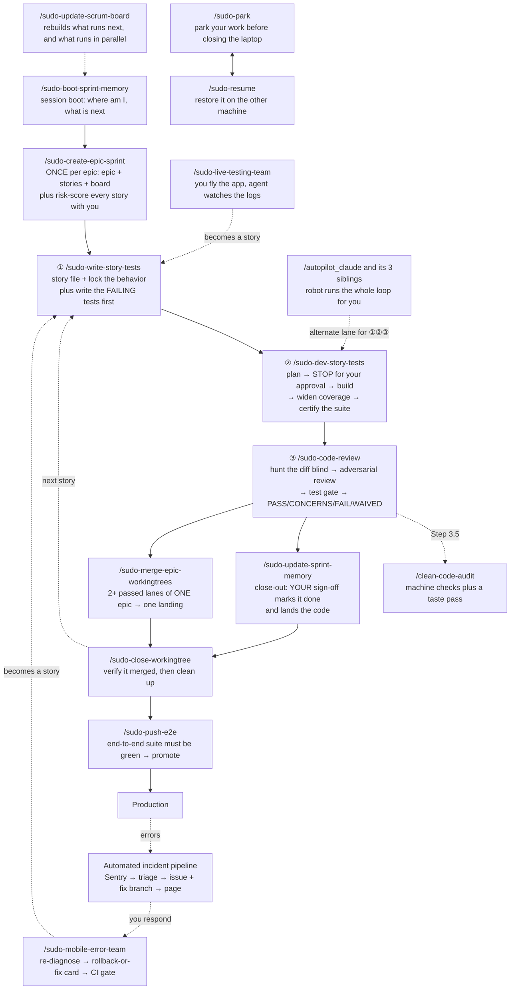
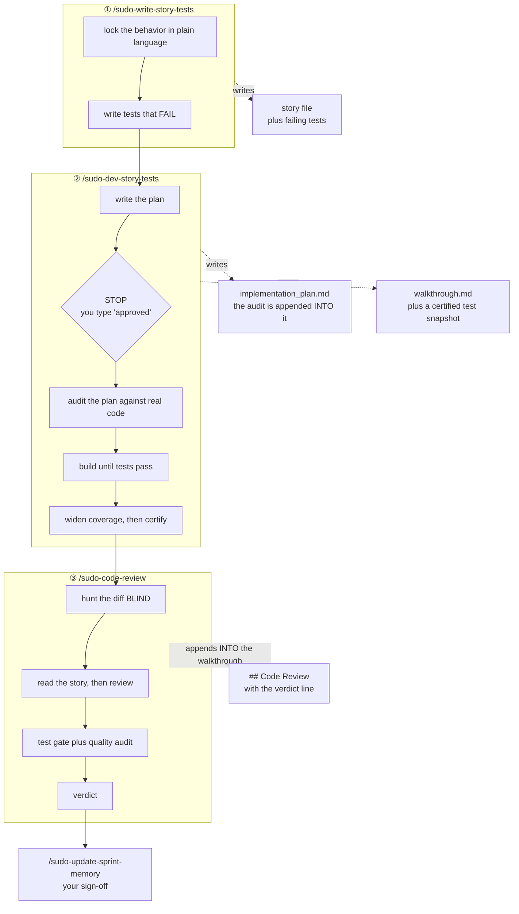
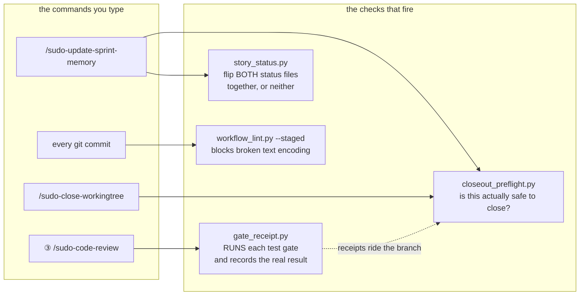
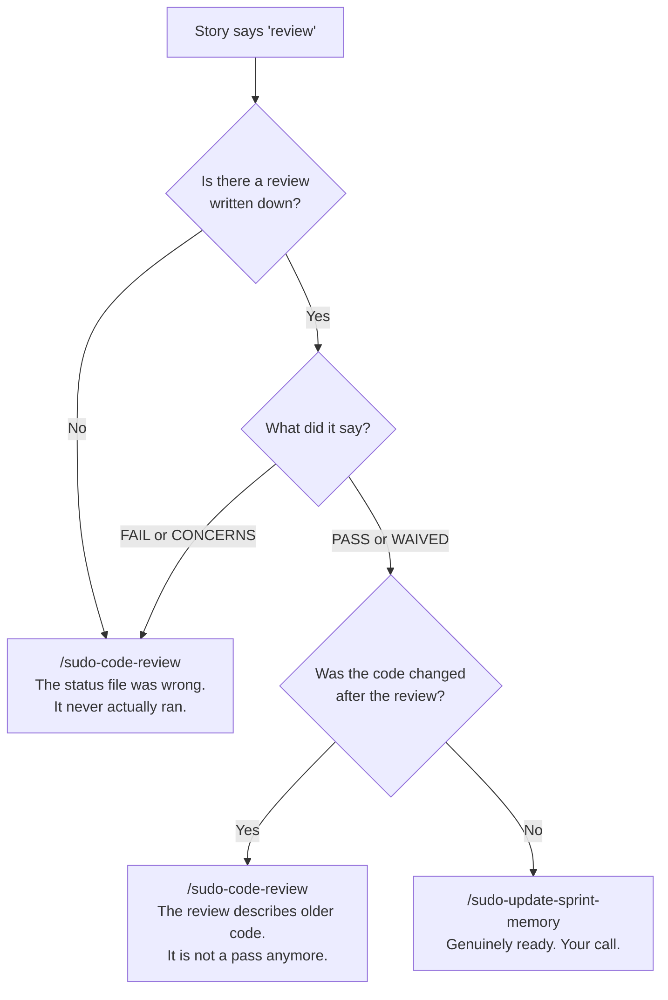
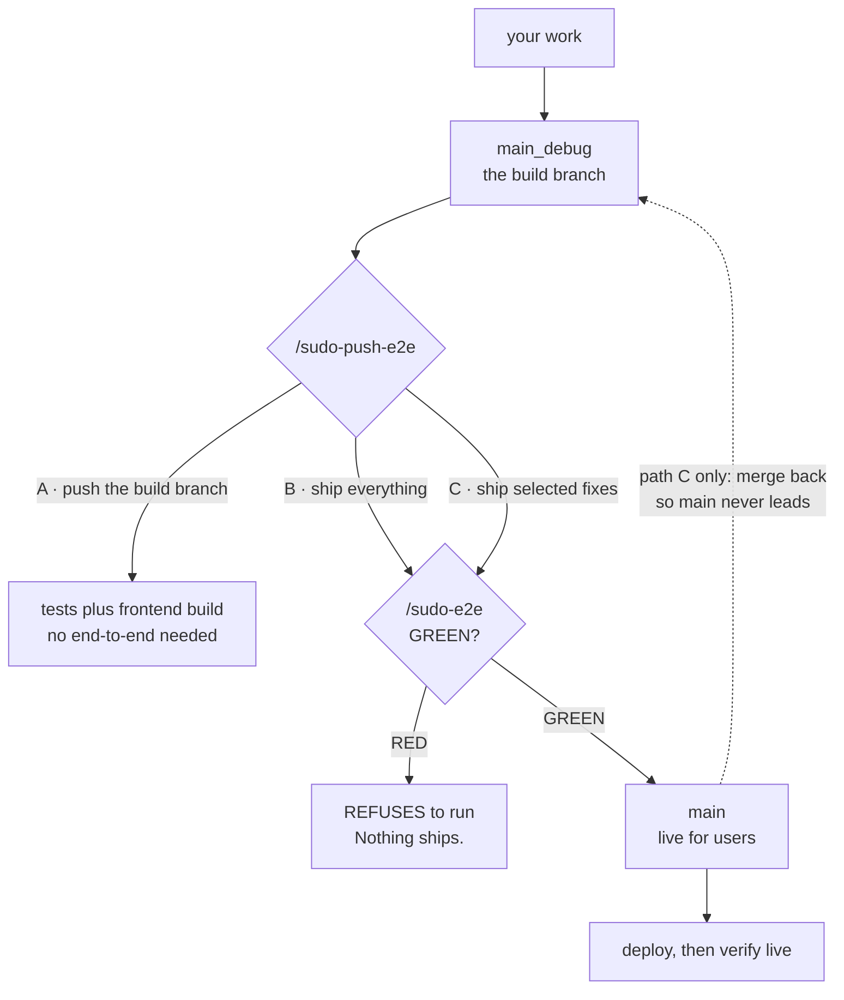
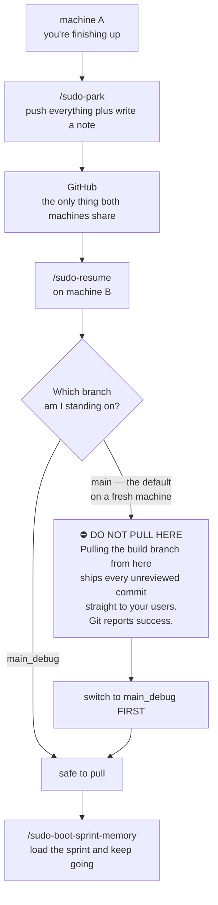
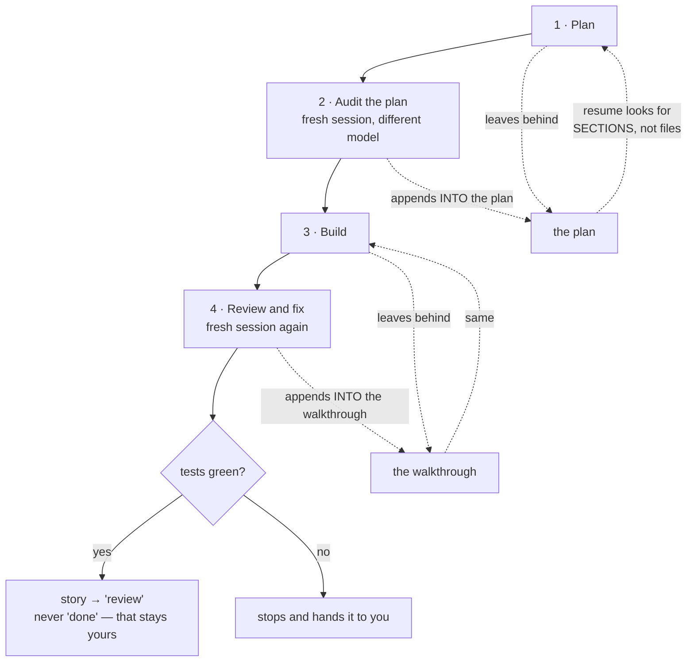
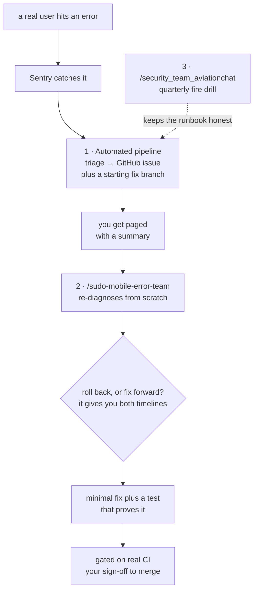

# The Sudo Dev System — Quick Reference

> **How we build, and what you type.** Current as of **2026-08-03**, after Waves 1–5.
> Read once start-to-finish, then jump in. Every technical term gets explained the first time it shows
> up — you shouldn't need to know git plumbing to run this system.

## In this workspace

You're in the **command center (lobby)**. It holds the master toolkit and drives the child projects
under `Projects/`; it has no sprint of its own.

| | |
|---|---|
| The master toolkit | [`.agents/`](../../.agents/) — commands, rules, scripts. Edit here, never the copies. |
| Long-form depth | [`../diagrams_guides/`](../diagrams_guides/) |
| Projects this drives | the [maintained list](../../.agents/maintained-projects.txt) — AGY_AVIATIONCHAT · Fresh_Workspace_BMAD · NEXgen-VR-Director |

Each project keeps its own copy of this page. **The body below is identical everywhere** — only this
block and §13 differ, so there's one thing to learn, not three.

---

## Start here

**I want to…**

| …do this | → run / read |
|---|---|
| know what to work on | `/sudo-boot-sprint-memory` — reads the sprint and tells you the next move |
| refresh the board | `/sudo-update-scrum-board` (§11) |
| start the next story | ① `/sudo-write-story-tests <id>` |
| build a story that has failing tests waiting | ② `/sudo-dev-story-tests <id>` |
| review code that's written | ③ `/sudo-code-review <id>` |
| land a story that passed review | `/sudo-update-sprint-memory` — it pre-flights everything first (§5) |
| land every lane of one epic at once | `/sudo-merge-epic-workingtrees <epic>` |
| fix something small | `/sudo-quick-dev <slug>` — **low-risk work only** |
| know whether a review still counts | §5's decision tree — a review of old code is not a review |
| ship to production | `/sudo-push-e2e` (§6) |
| switch machines | `/sudo-park` before, `/sudo-resume` after — **§7 has a warning worth reading once** |
| chase a production error | `/sudo-mobile-error-team` (§12) |
| free up a heavy session | `/sudo-prune-context` |

**Sections:** 1 the map · 2 the two rules · 3 commands · 4 the loop · **5 the safety net** ·
6 shipping · 7 machine handoff · 8 how we test · 9 TEA tools · 10 autopilot · 11 the board ·
12 incidents · 13 depth

---

## 1. The map — how everything connects

*What you're looking at: every command in the system and what hands off to what. Solid lines are the
main road; dotted lines are the on-ramps.*

---

## 2. How this works — the two rules above every command

**Test-first, human-gated, story-driven.** Work is a **story**: it starts with tests that *fail*, code
exists only to make them pass, and an adversarial review stands between "coded" and "done."

- **Plan first.** No agent touches a project file until you type the literal word **`approved`** on an
  `implementation_plan.md`. "ok" / "looks good" / "continue" are deliberately **not** approval — the
  gate only means something if it's one specific word.
  (→ [000-PLAN-FIRST-GATE](../../.agents/rules/000-PLAN-FIRST-GATE.md))
- **You alone mark a story `done`.** Agents may set it to `review`. Close-out is your signature, and
  running the close-out command *is* the signature — there's nothing else to sign.

Everything else in this document is a consequence of those two.

---

## 3. Your `/` commands (the human lane)

### The story loop — the ones you'll type daily

| Command | What it does for you |
|---|---|
| `/sudo-boot-sprint-memory` | Start of session. Reads the sprint, tells you the next story and exactly which command it needs. It **reads the review verdict from the artifact** rather than trusting the status file — so it won't send you to close out something that hasn't really passed. |
| `/sudo-update-scrum-board` | Rebuilds the board — what's next, what can run in parallel, what's waiting on you (§11). |
| `/sudo-create-epic-sprint` | **Once per epic.** Writes the epic and its stories, generates the board, then risk-scores every story with you. That score decides how much testing each story earns. |
| ① `/sudo-write-story-tests` | Creates the story, locks the intended behavior in plain language, then writes the **failing** tests. Failing is the point — a test that never failed proves nothing. |
| ② `/sudo-dev-story-tests` | Plans, **stops for your `approved`**, builds until the tests pass, widens coverage, then records a signed-off snapshot of the results. |
| ③ `/sudo-code-review` | Hunts the diff cold, runs an adversarial review, audits code quality, runs the test gate, issues a verdict. |
| `/clean-code-audit` | Dead code, duplication, drift. Runs inside ③; also runs solo across a whole area. |
| `/sudo-update-sprint-memory` | Close-out. Pre-flights everything mechanically (§5), marks the story done on **your** word, saves what was learned, lands the code. |
| `/sudo-merge-epic-workingtrees` | Lands **all** of one epic's finished lanes in a single reviewed pass — instead of closing out four stories one at a time. |
| `/sudo-close-workingtree` | Confirms the branch really merged, then removes the workspace and deletes the branch. |
| `/sudo-bdd-tests` | Locks behavior in plain language, standalone (① does this for you). |
| `/sudo-self-audit` | Pressure-tests a plan against the real code before anyone writes anything (② does this for you). |
| `/sudo-quick-dev` | Fast lane for genuinely small fixes. **Low-risk only** — anything touching login, permissions, or user data takes the full loop no matter how small the change looks. |
| `/sudo-prune-context` | Trims the running session notes back under budget so sessions start fast. |

### Machine handoff

| Command | What it does for you |
|---|---|
| `/sudo-park` | Before you close the laptop: commits and pushes everything in flight, and writes a note to your other machine about where you left off. |
| `/sudo-resume` | On the machine you just opened: pulls everything back down and rebuilds your working setup. **Read §7 once.** |

### Shipping

| Command | What it does for you |
|---|---|
| `/sudo-e2e` | Runs the real end-to-end suite — a complete stand-in for the live app, with test users. Green means safe to ship. |
| `/sudo-push-e2e` | The one shipping command. Three paths (§6); two of them **refuse to run** until the end-to-end suite is green. |
| `/merge_main_debug` | Approves and merges a reviewed pull request into the build branch. Never into production. |

### Debugging and incidents

| Command | What it does for you |
|---|---|
| `/sudo-live-testing-team` | Boots the app and watches the logs while **you** click around. Files researched bug reports. Writes no code. |
| `/sudo-mobile-error-team` | Live incident responder, works from your phone. Re-diagnoses independently, gives you a rollback-vs-fix decision, writes the fix and a test that proves it. |

### Thinking

| Command | What it does for you |
|---|---|
| `/sudo-adviser-board` | Historical minds in challenge teams that flip your assumptions and surface what people *need* rather than what they asked for. Advances only on your word. |

### Autopilot — the robot lane

| Command | Runs on | Notes |
|---|---|---|
| `/autopilot_claude` | the `claude` CLI | The canonical robot loop: Plan → Audit → Build → Review, four separate sessions. |
| `/autopilot_mobile` | the in-app Workflow engine | Same pipeline from web or phone — no terminal needed. |
| `/autopilot_opencode` | the `opencode` binary | Port of the same loop. |
| `/autopilot_deepseek4` | `claude` CLI plus a flag | Runs the token-heavy building half on a cheaper model, keeps review on Claude. A *lane* of `/autopilot_claude`, not a fourth engine. |

> There is **no** `/autopilot-claude` with a hyphen. Every launcher uses an underscore.

### Toolkit upkeep

| Command | What it does for you |
|---|---|
| `/update-maps-indexes` | Reconciles the repo maps, every index, and every cross-reference across the lobby and the maintained projects. |
| `/sync-agents` | Pushes the master toolkit to all four platforms; add `-Maintained` to reach every project. |
| `/new-project` · `/webm-alpha-video` | Scaffold a new workspace · green-screen video to transparent WebM. |

### Not in your menu, on purpose

| Name | Why |
|---|---|
| `sudo-*_AP` | **Robot-only.** The autopilot engines call these. Never typed by a human, deliberately kept out of your menus. |
| `/security_team_aviationchat` | A fire-drill harness that rehearses the incident runbook. The *live* responder is `/sudo-mobile-error-team`. |

---

## 4. The story loop, step by step

*What you're looking at: the same three steps as the map, but showing what each one leaves behind. The
documents on the right are how the next step knows what happened — they are the system's memory.*

**Why ③ hunts the diff before reading ②'s notes:** opening the builder's write-up first imports the
builder's framing — the exact blind spot the review exists to remove. Order is always *hunt cold, then
read the story.*

**Two documents, not ten.** Everything a story produces lives in exactly two files: the **plan** (the
pre-build audit gets appended into it) and the **walkthrough** (the review gets appended into it). If
you're hunting for what an audit or a review said, it is inside one of those two — never a separate file.

---

## 5. The safety net — what runs the checks for you

This is the newest part of the system and the least visible. **Six small programs** now do the checking
that used to be a person holding eight rules in their head. You almost never run them; the commands run
them for you. What matters to you is *what they refuse to let happen.*

*What you're looking at: which safety check fires inside which command.*

| The check | What it refuses to let happen |
|---|---|
| `gate_receipt.py` | **A claimed test result that never ran.** It *executes* the gate and writes down the real exit code. There is deliberately **no way to hand it a verdict** — a receipt existing means the thing actually ran. It also separates *"the tool is missing"* from *"the tests failed"*, because a missing tool is a finding, not a free pass. |
| `closeout_preflight.py` | **Closing out a story that didn't really land.** One command answers: did the code merge · is every repo clean and in sync · does the review verdict exist and does it still apply · do the files the story claims it changed actually exist. **Exit 2 means blocked.** A warning that says *"landing was NOT verified"* means exactly that — it is not a pass. |
| `story_status.py` | **A story marked done in one place and not the other.** Status lives in two files; this flips both together or neither. |
| `workflow_lint.py` | **Broken characters quietly entering a document** — the `—` that turns into `â€"`. Runs on every commit, staged files only, so it stays fast enough that nobody disables it. |
| `split_sprint_status.py` | The one-time migration that shrank the board (§11). |
| `wf_common.py` | Shared plumbing the others import. You'll never call it. |

**Two design decisions worth knowing**, because they look like bugs until you know why:

- **"Did this change?" compares *content*, not commit IDs.** When a branch lands via a merge it gets a
  brand-new commit ID but identical content. Calling that "stale" would make an honest gate cry wolf
  until someone disabled it permanently — so the check asks whether the *content* moved.
- **The encoding check can be told to stand down** on a file that legitimately contains those broken-
  looking characters as data — the checker's own test fixtures, a doc quoting them. Without that escape
  hatch, the gate would block every commit that touches the gate itself.

Run all their tests any time: `python .agents/scripts/tests/run_all.py` — **94 checks, about a second.**
Full detail in [`.agents/scripts/INDEX.md`](../../.agents/scripts/INDEX.md).

### Is this review still valid?

A review is a statement about *specific code*. If the code changed afterward, the review describes
something that no longer exists. So every verdict is stamped with the exact version it examined.

*What you're looking at: how the system decides whether a story marked "review" is genuinely ready.*

**Why this exists:** for a while the boot command answered "is this ready?" from the status file alone —
which reads `review` whether the review passed, failed, or never happened. It cheerfully pointed at
close-out for work nobody had reviewed. It now reads the actual verdict and checks the version stamp.
Close-out still lets you land a stale verdict deliberately, because that call is yours — it just won't
let you make it *unknowingly*.

---

## 6. Shipping — the end-to-end gate

**Two branches.** `main_debug` is where everything is built. `main` is what your users are running. Code
flows one direction only, and `main` must **never** get ahead of `main_debug`.

*What you're looking at: the three ways code ships, and which ones are gated.*

Path **C** ships selected fixes rather than everything — useful when one thing is urgent and the rest
isn't ready. It finishes by merging `main` back into `main_debug`, which is what keeps the "never ahead"
rule true.

`/sudo-e2e` also runs solo any time you want end-to-end confidence without shipping.

**Where each check runs:**

| Gate | Where | When |
|---|---|---|
| Pull-request checks | GitHub Actions | every PR into the build branch |
| Test-selection gate | local, before push | picks the affected tests; falls back to the full suite when unsure |
| **End-to-end gate** | local, via `/sudo-push-e2e` | **before anything reaches production** |
| Deploy | hosting CI/CD | on push to `main` |
| Incident pipeline | GitHub Action | when a real user hits an error (§12) |

---

## 7. Switching machines — and the one dangerous mistake

You work one sprint across desktop, laptop, and phone. **Branches travel between machines; your local
working setup does not.** That gap is the entire reason this pair exists.

*What you're looking at: the handoff, and the trap waiting on the far side.*

**The trap, plainly.** Every repo's default branch is `main` — deliberate, so anyone cloning lands on
production code. But it means a machine you just set up is *standing on production*. Pulling the build
branch while standing there doesn't "get the latest" — it fast-forwards **production itself** to
everything unshipped. For a mature project that's 160+ commits nobody reviewed, live, and **git reports
success**, because technically it is a clean fast-forward.

`/sudo-resume` now checks which branch you're on and switches before pulling. That check is the whole
defense. Promotion to production happens through `/sudo-push-e2e` and nowhere else — never as a side
effect of picking your work back up.

Two smaller things it handles: a fresh machine shows **no** work in progress even when plenty exists
(it's all on GitHub, not yet on disk), and resuming never deletes anything on your other machine — both
boxes legitimately end up on the same branch.

---

## 8. How we test

Deterministic code — same input, same output — gets exact tests. AI-generated output gets **soft**
checks that look for meaning rather than exact wording, because demanding exact wording from a language
model produces a test that fails for no real reason. Anything critical is covered at more than one level.

Three things worth carrying in your head:

- **Failing first is the point.** A test that has never failed hasn't proven it can detect anything.
- **Tests added to already-working code pass immediately** — that's correct. Don't manufacture a failure
  to feel better about it.
- **A test fed a value the real system never produces is a false green.** It passes and proves nothing.

**How much testing a story earns** is set by its risk score at epic kickoff — not by how the work feels
once you're in it.

---

## 9. TEA tools — when to reach for one

You rarely call these directly; §4's steps fire them in the right order. Reach for one solo only when
you want that single piece:

| Solo use | Why |
|---|---|
| `/tea` | Activates the Test Architect persona for a strategy conversation. |
| `/testarch-trace` | Shows which requirements have tests, without running a whole review. |
| `bmad-teach-me-testing` | Structured lessons, if you want to go deeper on method. |

One-time setup only: `/testarch-framework` (stand up a test bench) · `/testarch-ci` (scaffold the
automated pipeline).

---

## 10. The autopilot lane

*What you're looking at: the robot running the same loop you'd run by hand — and how it picks back up if
it dies halfway.*

Each stage runs in a **fresh session** so none inherits the previous one's assumptions — the same reason
③ hunts blind in the human lane.

**It's resumable.** Re-run the launcher and it works out which stages finished by looking for their
*sections inside* those two documents, not for the files themselves. A half-written plan doesn't count
as a finished plan.

It never marks anything `done` and never pushes to production. Both stay yours.

The engines live **per-project** and have drifted between projects — a behavior fix has to land in each
one.

---

## 11. The board — what runs next

Rebuilt by `/sudo-update-scrum-board`, and **only** by that command — no background process ever edits
it. Five zones, same order every time, hard-capped so it stays readable:

| Zone | Answers |
|---|---|
| 🎯 **Right now** | the goal, the one command to run next, what's in flight, what's waiting on you |
| 🧵 **Parallel Approved** | the verified set — being listed here means safe to run alongside every other item in it |
| 🛠 **Work queue** | one row per ticket, each with the exact command to type |
| 👤 **Your actions** | what agents can't do. Shows **None.** when empty — that emptiness is information |
| 📚 **Reference** | epic status, settled decisions, sources of truth |

**Two things to trust about it:**

- **It shows the answer, never the math.** No cross-referencing, no notation to decode.
- **A story with nothing written down is never marked safe-to-parallelize.** Deciding two stories won't
  collide means knowing which files each one touches, and that's only knowable once the story exists.
  Its answer for a vague ticket is *"write the story first"* — never a guess. **So if you want an epic
  developed in parallel, write its stories first.** That's the lever.

**The board got 6× smaller.** It had grown past 363,000 characters — too big to read in one pass. The
running commentary moved out to a **history file per story**, leaving the board carrying each story's
status plus a **short note on live rows only**. Finished rows carry no note at all, and the linter
treats one as an error. The migration was proven by rebuilding the original from the split pieces and
confirming it came back **character-for-character identical** — nothing was summarized away.

**One override worth knowing:** if a story has a live working folder on disk, it is in flight no matter
what the status file says. The status file lags by design — only close-out writes it.

---

## 12. Incidents

*What you're looking at: three layers, from fully automatic to fully yours.*

The responder **re-diagnoses independently** rather than trusting the automated triage — an automated
first guess is a lead, not a diagnosis. It stops twice for you and never merges on its own initiative.

---

## 13. Where the depth lives

This page is the how-to. Everything longer lives elsewhere.

| Want | Go to |
|---|---|
| What a command does, step by step | [`.agents/commands/`](../../.agents/commands/) — one file per `/command` |
| The rules themselves — the authority for everything above | [`.agents/rules/`](../../.agents/rules/) |
| The safety-net scripts in detail | [`.agents/scripts/INDEX.md`](../../.agents/scripts/INDEX.md) |
| Testing method in depth | [tea_deep_reference.md](../diagrams_guides/workflows_tea_testing/tea_deep_reference.md) |
| The long-form testing field guide | [tea_testing_guide.md](../diagrams_guides/workflows_tea_testing/tea_testing_guide.md) |
| The incident system in full, with diagrams | [sentry_error_response_team.md](../diagrams_guides/security/sentry_error_response_team.md) |
| The Adviser Board in full | [sudo-adviser-board-REFERENCE.md](../diagrams_guides/workflows_tea_testing/sudo-adviser-board-REFERENCE.md) |
| Workspace layout plus artifact rules | [docs/workspace-standard.md](../../docs/workspace-standard.md) |
| The toolkit's front door | [AGENTS.md](../../AGENTS.md) |
