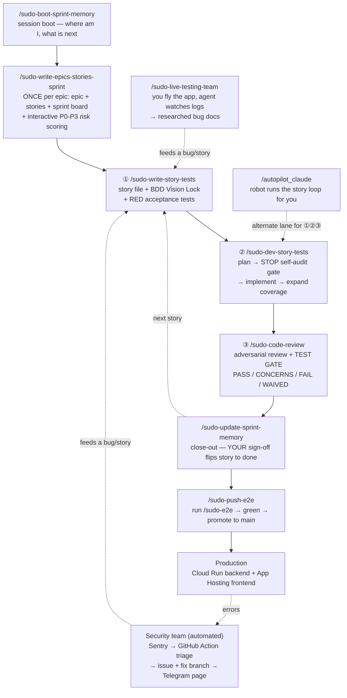
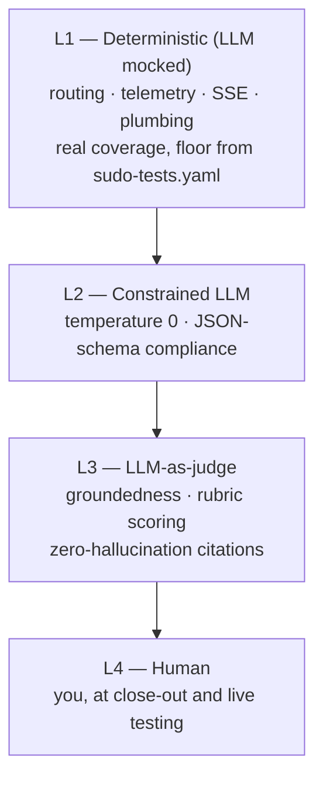

# The Sudo Dev System — Quick Reference

> One page: how we build, the commands you type, and how we test. Updated **2026-07-14** (the
> command rename — the story flow is `sudo-*`; upkeep keeps plain names like `/update-maps-indexes`). Deep material lives in
> [tea_deep_reference.md](tea_deep_reference.md) — go there for full call-graphs, the method
> curriculum, and the TEA fragment library.

---

## 1. The map — how everything connects



---

## 2. The development style in 60 seconds

**Test-first, human-gated, story-driven.** Every piece of work is a BMAD **story**. A story starts
with **failing acceptance tests** (the contract), code exists only to turn them green, and an
**adversarial review + test gate** stands between "coded" and "done". You are the only one who can
flip a story to `done` — agents flip to `review`, close-out is your sign-off.

Two lanes run the same loop:
- **Manual lane** — you type the ①②③ commands and steer each gate.
- **Autopilot lane** — `/autopilot_claude` runs the same stages headlessly (Dev plans/implements,
  QA audits/reviews) and stops at `review` for you.

Bugs found outside the loop (live testing, production Sentry errors) are turned into **researched
bug docs** first, then enter the same story loop. Nothing ships to `main` without the **e2e gate**.

---

## 3. Your `/` commands (the human lane)

### The story loop (daily drivers)
| Command | What it does |
|---|---|
| `/sudo-boot-sprint-memory` | Session boot — reads sprint + context, tells you the next story and which command to run. |
| `/sudo-write-epics-stories-sprint` | **Once per epic**: writes the epic + stories, builds the sprint board, then risk-scores every story P0–P3 with you. |
| ① `/sudo-write-story-tests` | Creates the next story + locks behaviors (BDD Vision Lock) + writes the RED acceptance tests. |
| ② `/sudo-dev-story-tests` | Plans, **stops at the self-audit gate** (you pick: run here / other model / fresh team), implements to green, expands coverage. |
| ③ `/sudo-code-review` | Adversarial code review, then the test gate (suite + trace + NFR + test-review) → verdict. |
| `/sudo-update-sprint-memory` | Close-out: flips the story to `done` (your sign-off — only red tests block), saves learnings, prunes context. |
| `/sudo-bdd-tests` | Standalone BDD Vision Lock session (① runs it for you; use solo to re-lock behaviors). |
| `/sudo-self-audit` | Standalone pre-dev plan audit (② runs it for you; use solo to pressure-test any plan). |
| `/sudo-quick-dev` | Fast lane for small fixes — story + direct dev + light sanity audit. Skips the heavy gates. |

### Shipping
| Command | What it does |
|---|---|
| `/sudo-e2e` | Runs the real end-to-end suite (emulator-backed, seeded users). Green = safe to promote. |
| `/sudo-push-e2e` | The one shipping command: push `main_debug` (path A), full merge → `main` (B), or cherry-pick features → `main` (C). **B and C refuse to run until `/sudo-e2e` is green.** Then Cloud Run deploy + live verify + ledger. |
| `/merge_main_debug` | Approve + squash-merge the active PR into `main_debug` (never `main`). |

### Debugging
| Command | What it does |
|---|---|
| `/sudo-live-testing-team` | Boots backend+frontend, watches backend logs while **you fly the app**, coaches you through DevTools checks, files researched bug docs that feed the story loop. Writes no code. |

### Autopilot (robot lane launchers)
| Command | What it does |
|---|---|
| `/autopilot_claude` | The 4-stage Dev/QA robot loop on the claude CLI (Plan → Audit → Implement → Review+Fix). |
| `/autopilot_mobile` | Same pipeline on the Workflow engine — works from Claude Code web/mobile. |
| `/autopilot_opencode` / `glm` | Engine variants (opencode binary / GLM dev lane). |

### Toolkit upkeep
| Command | What it does |
|---|---|
| `/update-maps-indexes` | Reconciles repo-maps, every INDEX.md, every AGENTS.md + README reference (dead paths, renamed commands, stale contents-lists), context hygiene, and the open-tasks list across the lobby + maintained projects. |
| `/sync-agents` | Pushes the master `.agents` toolkit to all 4 platforms (Claude, opencode, Antigravity, Codex) + the maintained projects (`-Maintained`). |
| `/slash_command_updating` | Thin alias: refresh just the machine-global command caches. |
| `/new-project` | Scaffold a new project workspace under `Projects/`. |
| `/webm-alpha-video` | Green-screen MP4 → transparent WebM utility. |

### Not in your menu (on purpose)
| Name | Why you don't see it |
|---|---|
| `sudo-*_AP` (three of them) | **Robot-only** — the autopilot engines invoke these inside each project. Never human-typed; excluded from the lobby menus and global caches. |
| `/security_team_aviationchat` | The **incident-drill harness** (was `sudo-incident-response`). Used maybe once a quarter to fire-drill the runbook; lives on the opencode/Antigravity/Codex surfaces only. The *real* incident response is the always-on pipeline (§9) — it never uses this command. |

---

## 4. The story loop, step by step

| # | Step | Command | Under the hood |
|---|------|---------|----------------|
| — | Orient | `/sudo-boot-sprint-memory` | reads active-context + sprint-status |
| 1 | Epic kickoff (once) | `/sudo-write-epics-stories-sprint` | create-epics → sprint-planning → `testarch-test-design` (interactive P0–P3, one story at a time) |
| 2 | Write RED tests | ① `/sudo-write-story-tests` | create-story → BDD Vision Lock (**mandatory** — contract or recorded waiver) → `testarch-atdd` |
| 3 | Plan + audit + build | ② `/sudo-dev-story-tests` | BDD gate → plan → **⛔ STOP: self-audit** (you choose the lane) → implement → `testarch-automate` |
| 4 | Review + gate | ③ `/sudo-code-review` | adversarial review → full suites (pytest + vitest) → `testarch-trace` → `testarch-nfr` → `testarch-test-review` |
| 5 | Close out | `/sudo-update-sprint-memory` | reads ③'s verdict; the ONLY thing that flips `review` → `done` |

**Status contract:** dev/orchestrator set `review`; only your close-out sets `done`.

### The test gate (heart of ③)
Opt-in per project and baseline-diff aware — legacy red is grandfathered; only **NEW** regressions fail:

```yaml
# _bmad-output/sudo-tests.yaml  (a project that turns the gate on)
required_tiers: [L1, L2, L3]   # which pyramid tiers must be present
l1_coverage_min: 85            # deterministic coverage floor
agent_bearing: true            # story touches agent behavior → L3 judge required
nfr: false                     # also run the NFR audit
waive: false                   # hard override (force WAIVED)
```

| Verdict | Means |
|---|---|
| **PASS** | all required tiers green |
| **CONCERNS** | soft issues only |
| **FAIL** | NEW regression OR a required tier missing |
| **WAIVED** | no baseline — gate off for this project |

---

## 5. Shipping — the e2e gate

**Branch model:** `main_debug` is where we build; `main` is live. `main` only ever receives from
`main_debug` and must **never end up ahead** of it.

| `/sudo-push-e2e` path | Ships | Gate |
|---|---|---|
| **A · debug** | push `main_debug` | pytest + frontend build |
| **B · main** | merge everything → `main` | A's gate **+ `/sudo-e2e` green** |
| **C · cherry** | picked commits → `main` | A's gate **+ `/sudo-e2e` green**, then back-merge `main` → `main_debug` (keeps the branch model true) |

`/sudo-e2e` is also a solo command — run it any time you want end-to-end confidence without shipping.

---

## 6. How we test — the method (the learning section)

### 6.1 Risk first: P0–P3 decides how much testing a story earns
**Risk = Probability × Impact.** Scored interactively at epic kickoff, one story at a time.

| Priority | Meaning | Example |
|---|---|---|
| **P0 — Critical** | business fails if broken | auth/tenancy walls, privacy defaults, payments |
| **P1 — High** | core workflow pain | grading events, admin role enforcement |
| **P2 — Medium** | workaround exists | pagination, overlays |
| **P3 — Low** | cosmetic | tooltips, hover states |

| Priority | Unit | Integration | E2E | Manual | Coverage target |
|---|:---:|:---:|:---:|:---:|:---:|
| **P0** | ✅ | ✅ | ✅ | ✅ | **100%** |
| **P1** | ✅ | ✅ | ✅ | — | **80%** |
| **P2** | — | ✅ | — | ✅ | **50%** |
| **P3** | — | — | — | ✅ | **20%** |

> The review question is always: *"what P-level is the decision this test pins?"* A PR with 0% P0
> and 100% P3 coverage is a red flag regardless of line count.

### 6.2 Test levels: what each layer catches
| Level | Covers | Speed | Example shape |
|---|---|---|---|
| **Unit** | one function/class, no external deps | ms | schema defaults |
| **Integration** | components together (DB/service mocked at the edge) | medium | writer + `mock_db` |
| **E2E** | the full running stack — real HTTP, real browser, emulator auth | slow | seeded learner logs in and completes a flow |

A P0 behavior is deliberately covered at **all three** levels. Testability order: isolated first
(schema), full-stack last (API/browser).

### 6.3 The L1–L4 pyramid (how we test *AI* code specifically)
Deterministic code gets real coverage; generative LLM output gets **soft assertions** — never
string-matching.



| Tier | Written in | Checked at |
|---|---|---|
| L1 deterministic | ① `atdd` + ② `automate` | ③ suite run |
| L2 constrained | ② `automate` | ③ gate |
| L3 judge | ①/② (agent-bearing stories) | ③ `trace` / `nfr` |
| L4 human | — | close-out + `/sudo-live-testing-team` |

### 6.4 ATDD · BDD · Automate — the three words, plainly
- **ATDD** (①): write the story's acceptance tests **before any code**, and prove they FAIL (red).
  Red-first is the point — a test that never failed proves nothing.
- **BDD Vision Lock** (inside ①): the *conversation* where we pin exact expected behaviors as
  Given/When/Then cases **inside the story's red test files** — so the contract is in the tests,
  not in a separate doc. (A standalone `.feature` file is opt-in only.)
- **Automate** (②, after green): expand coverage around the now-working code — edge cases,
  contracts, the tests ATDD didn't need yet.
- Retrofit caveat: tests added to *already-correct* code (test-debt stories) pass green-first as
  regression tripwires — don't fake a red.

### 6.5 What a good test is (the bar)
1. Deterministic — re-running to "clear" a flake is a bug, not a workaround
2. No hard sleeps — wait on conditions, never on time
3. Stateless + parallelizable — each test builds and tears down its own world
4. Self-cleaning — no manual DB resets
5. Low-maintenance — set state via APIs, not UI click-chains
6. Lives near its source — mirrored test tree
7. Mocks match the **production shape** — a mock value the backend never emits is a vacuous green

### 6.6 CI/CD — what runs where
| Gate | Where | When |
|---|---|---|
| PR check (pytest + vitest + bdd) | GitHub Actions | every PR to `main_debug` |
| TIA pre-push gate | local hook | pre-push test selection (falls back to full suite if the index is stale) |
| **E2E gate** | local, `/sudo-e2e` via `/sudo-push-e2e` | **before anything lands on `main`** |
| Deploy | App Hosting CI/CD (frontend) + Cloud Run (backend) | on push to `main` |
| Incident pipeline | GitHub Action | on Sentry error (production, after deploy) |

---

## 7. TEA BMAD tools — when to reach for each

`/tea` activates **Murat**, the Test Architect persona, for strategy consults. The workflows:

| Workflow | Fires | Job |
|---|---|---|
| `testarch-test-design` | epic kickoff (inside `/sudo-write-epics-stories-sprint`) | risk-score P0–P3 with you → test plan |
| `testarch-atdd` | ① | write the failing acceptance tests |
| `testarch-automate` | ② | expand coverage on working code |
| `testarch-trace` | ③ | requirements → tests matrix + coverage verdict |
| `testarch-nfr` | ③ (agent/NFR stories) | perf / security / reliability evidence audit |
| `testarch-test-review` | ③ | quality + flake audit of the tests themselves |
| `testarch-framework` | one-time | initialize a test bench (Playwright/Cypress/pytest) |
| `testarch-ci` | one-time | scaffold the CI quality pipeline |
| `bmad-teach-me-testing` | on demand | the TEA academy — structured learning sessions |

You rarely call these directly — the sudo commands call them in order. Reach for them solo when you
want just one piece (e.g. `/testarch-trace` to see coverage without a full review).

---

## 8. The autopilot lane (robot runs the loop)

Four stages, two continuous chats (Dev + QA), same artifacts contract every time:

| Stage | Robot command | Produces |
|---|---|---|
| 1 Plan | `/sudo-dev-story-tests_AP plan` | `implementation_plan.md` |
| 2 Audit | `/sudo-self-audit_AP` | `self-audit-stress-test.md` |
| 3 Implement | `/sudo-dev-story-tests_AP implement` | code + tests + `walkthrough.md` |
| 4 Review+Fix | `/sudo-code-review_AP` | `code-review.md` + fixes |

Green regression-only gate → story flips to `review` (never `done` — that's still you). Resumable:
re-run and finished stages auto-detect. The engines live per-project in `scripts/`; the `_AP`
commands live only inside the projects where the robots run.

---

## 9. The security / error team (automated incident response)

Production watches itself: **Sentry error → GitHub Action runs the triage runbook → GitHub issue
(full report) + `claude/incident-*` fix branch → Telegram page with a TL;DR + Error-Team prompt.**
You review the issue, and merging the fix is your call. The runbook
(`.github/claude/incident-triage.md` in the project) is the product.

`/security_team_aviationchat` is only the **drill harness** — run it occasionally to prove the
runbook still works. Full picture + diagrams:
[security/sentry_error_response_team.md](../security/sentry_error_response_team.md).

---

## 10. Where the depth lives

| Want | Go to |
|---|---|
| Full call-graphs, method curriculum, worked examples, 42 TEA fragments | [tea_deep_reference.md](tea_deep_reference.md) |
| Incident/security system in full | [security/sentry_error_response_team.md](../security/sentry_error_response_team.md) |
| Workspace layout + artifact rules | `docs/workspace-standard.md` |
| This system's front door | `AGENTS.md` (lobby root) |
