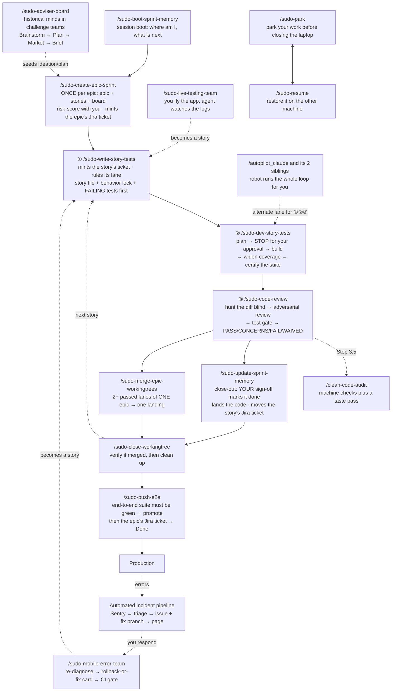
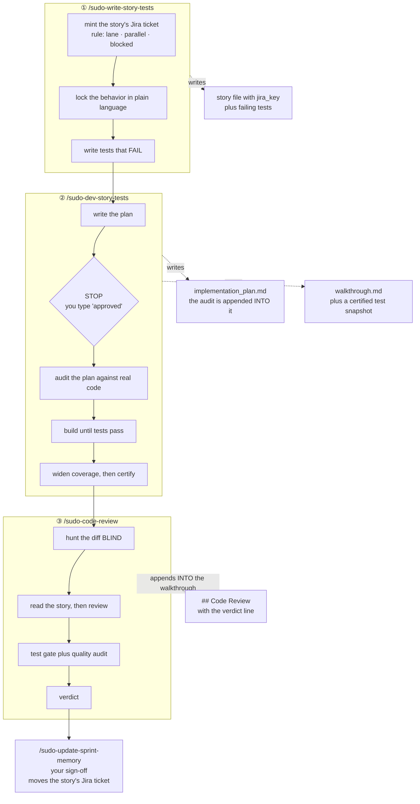
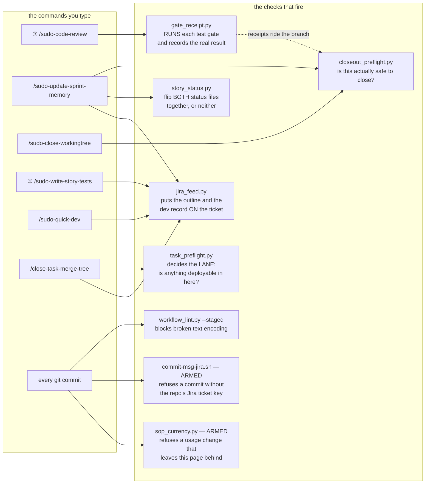
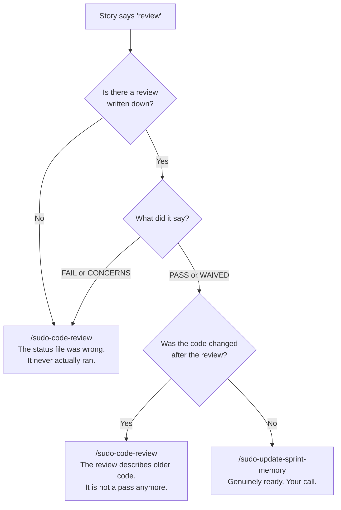
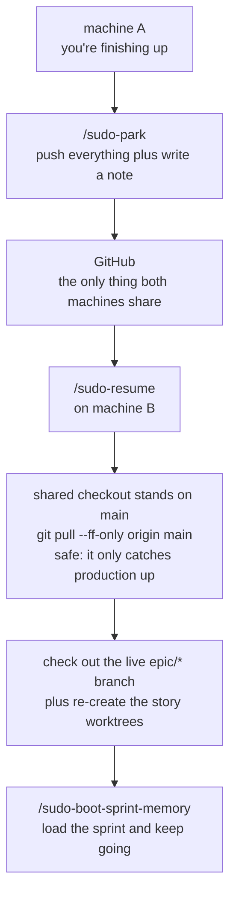
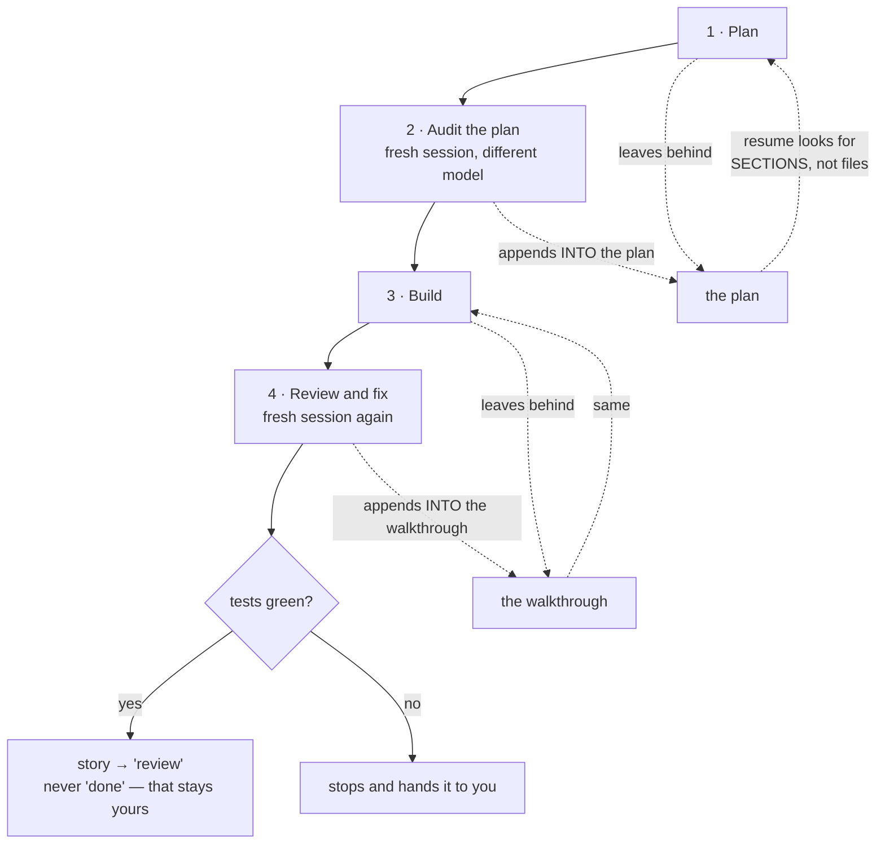
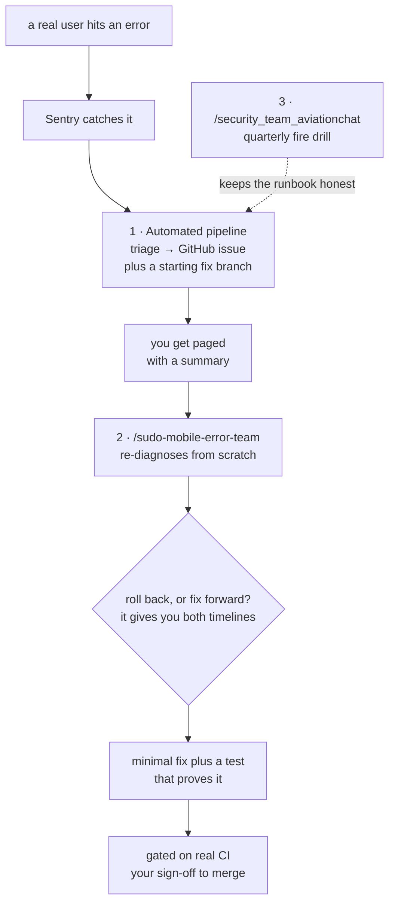

# The Sudo Dev System — Quick Reference

> **How we build, and what you type.** Current as of **2026-08-08**, after Waves 1–5, the
> epic-branch migration (`main` is the only long-lived branch), the **Jira integration** — every branch
> and every commit now carries the repo's ticket key, enforced by an armed git hook — and the
> **toolkit centralization** (SCC-31/32/45 · AVCH-23), which moved every shared rule, command, skill,
> and workflow to one home. Read once start-to-finish, then jump in. Every technical term gets explained
> the first time it shows up — you shouldn't need to know git plumbing to run this system.
>
> **This page is kept current by a gate, not by good intentions.** Change a `/` command, a rule, a
> safety-net script, or a commit hook, and the commit is **rejected** unless this file moves with it
> (`[sop-ok]` in the message opts out and is logged). The law:
> [`sop-currency.md`](../../.agents/rules/sop-currency.md).

## In this workspace

You're in the **command center (lobby)**. It has no sprint of its own — it holds the toolkit and drives
the child projects under `Projects/`.

**One home, since 2026-08-07.** Every shared rule, `/` command, skill, workflow, and the BMAD machinery
lives here and *only* here. Nothing is copied into a project any more. A project carries just its own
law — its `rules/`, its `skills/`, and the `.agents/INDEX.md` that routes them — plus the enforcement
that has to sit in the repo to work at all (its git hooks and its `jira.conf`). Two consequences worth
holding: **you edit a shared rule in exactly one place and every project has it instantly**, and
**binding a project means reading its `.agents/INDEX.md` first**, because that file is now the only
thing that tells you what's local.

| | |
|---|---|
| What runs next | the [SCC Jira board](https://sudo-command.atlassian.net/jira/software/projects/SCC/boards/2) — sprint view (§11) |
| The shared toolkit — the only copy | [`.agents/`](../../.agents/) — commands, rules, skills, workflows, scripts |
| What a project owns vs. what it reads from here | [`project-law.md`](../../.agents/rules/project-law.md) |
| Long-form depth | [`../diagrams_guides/`](../diagrams_guides/) |
| Projects this **lints** (`/update-maps-indexes`) | the [maintained list](../../.agents/maintained-projects.txt) — AGY_AVIATIONCHAT · NEXgen-VR-Director. It is a lint worklist, **not** a sync target: nothing is pushed into a project. |

AGY_AVIATIONCHAT keeps its own copy of this page, localized in the header block, §11 and §13. **The body
is meant to be identical** — if the two disagree, this one is canonical.

---

## Start here

**I want to…**

| …do this | → run / read |
|---|---|
| know what to work on | `/sudo-boot-sprint-memory` — reads the sprint and tells you the next move |
| see or move the sprint board | ask any agent — the live board answers via `acli` (§11) |
| start the next story | ① `/sudo-write-story-tests <id>` |
| build a story that has failing tests waiting | ② `/sudo-dev-story-tests <id>` |
| review code that's written | ③ `/sudo-code-review <id>` |
| land a story that passed review | `/sudo-update-sprint-memory` — it pre-flights everything first (§5) |
| land every lane of one epic at once | `/sudo-merge-epic-workingtrees <epic>` |
| fix something small, or change docs/config | `/sudo-quick-dev <slug>` — **low-risk work only**; still gets ACs up front and a review gate after |
| close out a **Task** (toolkit/rules/IDE work with no story) | `/close-task-merge-tree` — the non-BMAD close-out: gate, merge to `main`, Dev Record, prune (§6) |
| know whether a review still counts | §5's decision tree — a review of old code is not a review |
| ship to production | `/sudo-push-e2e` (§6) |
| switch machines | `/sudo-park` before, `/sudo-resume` after — §7 shows the handoff end to end |
| chase a production error | `/sudo-mobile-error-team` (§12) |
| brainstorm or solve hard problems | `/sudo-adviser-board` — historical minds in challenge teams (§3) |
| free up a heavy session | `/sudo-prune-context` |
| **change the system itself** — a command, a rule, a gate | edit it in `.agents/` (the only copy), then **update this page in the same commit** — a gate enforces it (§5) |

**Sections:** 1 the map · 2 the two rules · 3 commands · 4 the loop · **5 the safety net** ·
6 shipping · 7 machine handoff · 8 how we test · 9 TEA tools · 10 autopilot · 11 the board ·
12 incidents · 13 depth

---

## 1. The map — how everything connects

*What you're looking at: every command in the system and what hands off to what. Solid lines are the
main road; dotted lines are the on-ramps.*

---

## 2. How this works — the two rules above every command

**Test-first, human-gated, story-driven.** Work is a **story**: it starts with tests that *fail*, code
exists only to make them pass, and an adversarial review stands between "coded" and "done."

- **Plan first.** No agent touches a project file until you type the literal word **`approved`** on an
  `implementation_plan.md`. "ok" / "looks good" / "continue" are deliberately **not** approval — the
  gate only means something if it's one specific word.
  (→ [000-PLAN-FIRST-GATE](../../.agents/rules/000-PLAN-FIRST-GATE.md))
- **You alone mark a story `done`.** Agents may set it to `review`. Close-out is your signature, and
  running the close-out command *is* the signature — there's nothing else to sign.

Everything else in this document is a consequence of those two.

**And one rule the machines hold so you don't have to:** every branch and every commit carries the
repo's **Jira ticket key** (`epic/AVCH-13-ppl-curriculum`, not `epic/ppl-curriculum`). An armed git
hook refuses a keyless commit outright — which is what keeps every ticket's Development panel honest
without anyone remembering to link anything (§6, §11).

---

## 3. Your `/` commands (the human lane)

### The story loop — the ones you'll type daily

| Command | What it does for you |
|---|---|
| `/sudo-boot-sprint-memory` | Start of session. Reads the sprint, tells you the next story and exactly which command it needs. It **reads the review verdict from the artifact** rather than trusting the status file — so it won't send you to close out something that hasn't really passed. |
| `/sudo-create-epic-sprint` | **Once per epic.** Writes the epic and its stories, then risk-scores every story with you. That score decides how much testing each story earns. Mints the epic's **Jira ticket** itself at kickoff (you're in the room) — never an invented key: it reads the key from the ticket it just created, and the branch is never cut unkeyed. |
| ① `/sudo-write-story-tests` | Creates the story, locks the intended behavior in plain language, then writes the **failing** tests. Failing is the point — a test that never failed proves nothing. Also **mints the story's Jira ticket** (child of the epic's) and rules three things onto the board as labels: `quick-dev` (may ship through the fast lane), `parallel-ok` (safe beside the epic's other lanes), `blocked` (waiting on a linked blocker). |
| ② `/sudo-dev-story-tests` | Plans, **stops for your `approved`**, builds until the tests pass, widens coverage, then records a signed-off snapshot of the results. |
| ③ `/sudo-code-review` | Hunts the diff cold, runs an adversarial review, audits code quality, runs the test gate, issues a verdict. |
| `/clean-code-audit` | Dead code, duplication, drift. Runs inside ③; also runs solo across a whole area. |
| `/sudo-update-sprint-memory` | Close-out. Pre-flights everything mechanically (§5), marks the story done on **your** word, saves what was learned, lands the code — and **moves the story's Jira ticket** to match, with the evidence attached. |
| `/sudo-merge-epic-workingtrees` | Lands **all** of one epic's finished lanes in a single reviewed pass — instead of closing out four stories one at a time. |
| `/sudo-close-workingtree` | Confirms the branch really merged, then removes the workspace and deletes the branch. |
| `/sudo-bdd-tests` | Locks behavior in plain language, standalone (① does this for you). |
| `/sudo-self-audit` | Pressure-tests a plan against the real code before anyone writes anything (② does this for you). |
| `/sudo-quick-dev` | Fast lane for genuinely small work — a fix, a docs/config change, a task that does not earn the full pipeline. **Accuracy over speed:** it drops the *pipeline* (no ATDD red phase, no full suite, no three-reviewer panel), never the rigour — it still opens a worktree, **fixes acceptance criteria before any code**, and runs a **mandatory review gate** afterwards (an independent adversarial reviewer that never saw the conversation; on code, an acceptance audit + the clean-code machine floor + scoped tests; on docs, a link/anchor + SOP-currency check). **Low-risk only** — anything touching login, permissions, payments, user data, DB schema, or a cross-service contract ejects to the full loop no matter how small it looks, and so does anything the router says needs planning. On a story it advances the row to `review` on the way out and **stops there — it never closes out**; `done` is still only yours. ① marks eligible stories with the `quick-dev` label, so the fast-lane pile is one board filter away. |
| `/sudo-prune-context` | Trims the running session notes back under budget so sessions start fast. |

### Machine handoff

| Command | What it does for you |
|---|---|
| `/sudo-park` | Before you close the laptop: commits and pushes everything in flight, and writes a note to your other machine about where you left off. |
| `/sudo-resume` | On the machine you just opened: pulls everything back down and rebuilds your working setup. **Read §7 once.** |

### Shipping

| Command | What it does for you |
|---|---|
| `/sudo-e2e` | Runs the real end-to-end suite — a complete stand-in for the live app, with test users. Green means safe to ship. |
| `/sudo-push-e2e` | The one shipping command — the only road an epic takes to `main` (§6). It **refuses to run** until the end-to-end suite is green and you sign off. After the merge it comments the evidence on the epic's Jira ticket and moves it to **Done**. |
| `/close-task-merge-tree` | **The Task lane's close-out** — the half BMAD has no answer for. A **Task** (toolkit, rules, IDE, skills work) has no epic, no story file and often no sprint board at all, so `/sudo-update-sprint-memory` has nothing to operate on and simply cannot close it. This does the same four things for it: run the gate, merge to `main` with `--no-ff`, file **one** Dev Record and move the ticket to **Done**, prune the branch. **Typing it IS your merge sign-off** — same contract `/sudo-push-e2e` carries for an epic. Your question about skipping the end-to-end tests is answered **by the repo, not by the agent**: it derives the lane and either says *this repo has nothing that deploys, so there is no E2E suite to skip* (the command centre) or *this diff touched `backend/`* — and in that second case it **refuses and hands the work to `/sudo-push-e2e`**, with no override flag. It is the one command deliberately **not** named `sudo-*`, because that family is barred from acting on the command centre and toolkit tasks live there. |

### Debugging and incidents

| Command | What it does for you |
|---|---|
| `/sudo-live-testing-team` | Boots the app and watches the logs while **you** click around. Files researched bug reports. Writes no code. |
| `/sudo-mobile-error-team` | Live incident responder, works from your phone. Re-diagnoses independently, gives you a rollback-vs-fix decision, writes the fix and a test that proves it. |

### Thinking

| Command | What it does for you |
|---|---|
| `/sudo-adviser-board` | Convene historical minds in 5 challenge teams (+ Real-World marketing squad) to flip assumptions, solve hard frontier problems, and surface what people *need*. Runs Brainstorm → Plan → Market → Brief stations; advances only on your word. Saves brief to `_my_resources/board_sessions/`. |

### Autopilot — the robot lane

| Command | Runs on | Notes |
|---|---|---|
| `/autopilot_claude` | the `claude` CLI | The canonical robot loop: Plan → Audit → Build → Review, four separate sessions. |
| `/autopilot_opencode` | the `opencode` binary | Port of the same loop. |
| `/autopilot_deepseek4` | `claude` CLI plus a flag | Runs the token-heavy building half on a cheaper model, keeps review on Claude. A *lane* of `/autopilot_claude`, not a third engine. |

> There is **no** `/autopilot-claude` with a hyphen. Every launcher uses an underscore.
>
> **`/autopilot_mobile` was deleted 2026-08-07.** There is no separate mobile engine any more — from your
> phone you drive the desktop engines through Remote Control, which is strictly better: same code, same
> gates, one thing to fix when the loop changes.

### Toolkit upkeep

| Command | What it does for you |
|---|---|
| `/update-maps-indexes` | Reconciles the repo maps, every index, and every cross-reference across the lobby and the maintained projects. |
| `/sync-agents` | Publishes the toolkit to all four platforms (Claude, opencode, Antigravity, Codex) so your `/` menu resolves everywhere. It reaches **the lobby and this machine's caches only** — the old `-Maintained` fan-out that copied the toolkit into every project was retired with centralization. Projects read from the center; there is nothing to push. |
| `/slash_command_updating` | A thin alias for the globals-only half of `/sync-agents` — refreshes the Antigravity and opencode machine caches when their menus go stale but the lobby is fine. Plain `/sync-agents` does this *and* the local dirs, so prefer it. |
| `/review` | Reviews the working diff outside the story loop — the quick read when there's no story to hang ③ on. |
| `/new-project` · `/webm-alpha-video` | Scaffold a new workspace · green-screen video to transparent WebM. |

### Not in your menu, on purpose

| Name | Why |
|---|---|
| `sudo-*_AP` | **Robot-only.** The autopilot engines call these. Never typed by a human, deliberately kept out of your menus. |
| `/security_team_aviationchat` | A fire-drill harness that rehearses the incident runbook. The *live* responder is `/sudo-mobile-error-team`. |

---

## 4. The story loop, step by step

*What you're looking at: the same three steps as the map, but showing what each one leaves behind. The
documents on the right are how the next step knows what happened — they are the system's memory.*

**Why ③ hunts the diff before reading ②'s notes:** opening the builder's write-up first imports the
builder's framing — the exact blind spot the review exists to remove. Order is always *hunt cold, then
read the story.*

**Two documents, not ten.** Everything a story produces lives in exactly two files: the **plan** (the
pre-build audit gets appended into it) and the **walkthrough** (the review gets appended into it). If
you're hunting for what an audit or a review said, it is inside one of those two — never a separate file.

**Dense, not short — and no size limit (changed 2026-08-08, SCC-51).** Those two docs used to carry hard
byte caps (8 KB / 10 KB). They are gone. The caps were set the same day the **audit** began appending into
the plan, which quietly made it a two-author document — so the only way to stay under the cap was for the
second author, the auditor, to cut findings. A plan that grew because the audit found eight real things is
working correctly. **Length is never a reason to drop a finding, an acceptance criterion, or evidence.**
What survives is the reason the caps existed: these files are re-read on every pass of the loop, so every
line has to earn it — cut restatement and filler, never substance, and never split into a third file.
(Limits that *move* content rather than destroy it all stay: the running session notes still have a size
budget, because going over there means stale state to delete, not a finding to lose.)

---

## 5. The safety net — what runs the checks for you

This is the newest part of the system and the least visible. **Nine small programs — plus two armed git
hooks** — now do the checking that used to be a person holding eight rules in their head. You almost
never run them; the commands run them for you. What matters to you is *what they refuse to let happen.*

*What you're looking at: which safety check fires inside which command.*

| The check | What it refuses to let happen |
|---|---|
| `gate_receipt.py` | **A claimed test result that never ran.** It *executes* the gate and writes down the real exit code. There is deliberately **no way to hand it a verdict** — a receipt existing means the thing actually ran. It also separates *"the tool is missing"* from *"the tests failed"*, because a missing tool is a finding, not a free pass. |
| `closeout_preflight.py` | **Closing out a story that didn't really land.** One command answers: did the code merge · is every repo clean and in sync · does the review verdict exist and does it still apply · do the files the story claims it changed actually exist. **Exit 2 means blocked.** A warning that says *"landing was NOT verified"* means exactly that — it is not a pass. |
| `story_status.py` | **A story marked done in one place and not the other.** Status lives in two files; this flips both together or neither. |
| `workflow_lint.py` | **Broken characters quietly entering a document** — the `—` that turns into `â€"`. Runs on every commit, staged files only, so it stays fast enough that nobody disables it. |
| `commit-msg-jira.sh` | **A commit with no ticket.** Each repo declares its Jira project in `.agents/jira.conf`; a commit whose message carries no valid key for *that* repo — or the wrong project's key — is refused outright. A rejected commit is a no-op: your staged files are untouched, nothing to undo. Merges, reverts, and rebases are exempt (the branch name carries the key for them). |
| `sop_currency.py` | **This page falling behind the system it describes.** Change a `/` command, a rule, a safety-net script, a commit gate, or the root `AGENTS.md`, and the commit is refused unless this file is staged with it. Say `[sop-ok]` in the message when a change genuinely alters no usage — that stays in the git log as the record of the call. It checks only that the two moved together; no program can judge whether the *edit* was right, and the point is to make you look while you still have the context. |
| `jira_feed.py` | **A Jira ticket that is only a title.** Every story ticket used to be minted with a summary and nothing else, and close-out posted one verdict line — so the board could tell you a story existed, never what it was about or what building it taught. Now ① mints the ticket with an outline rendered *from the story file* (its statement, its acceptance criteria — nothing invented; a story with no ACs says exactly that), and the close-out files a **Dev Record**: the decisions, the pitfalls, and what is still owed. Both write paths **read the ticket back** and fail if what they claimed to write is not there. **Exactly one Dev Record per ticket** — `/sudo-quick-dev` closes its own branch and files one too, and a later close-out updates that record instead of stacking a second. It also picks the ticket **type** for you: **Story** = BMAD sprint work (debug stories included), **Task** = workflow/IDE/rules/skills work under one of your grouping epics (`CI/CD Improvment`, `New Epic Feature or Fix`). *Everything* is parented, so the parent never decides it. **`Bug` is yours to raise** — your temporary flag on a story you found broken (you set the type and send it back to To Do) — and the close-out puts it back to **Story** once the fix lands, because the bug is gone. Nothing else ever touches it. `jira_feed.py audit --jira-project 
` checks a whole board and `--apply` migrates it. Full model + the AVCH worked example: [`.agents/rules/jira.md`](../../.agents/rules/jira.md) §Work-item types. |
| `task_preflight.py` | **A change to the product sneaking onto `main` labelled a "task".** `/close-task-merge-tree` is cheaper than `/sudo-push-e2e` for exactly one reason — it skips the end-to-end suite — and the only honest justification is *nothing that deploys changed.* That is the claim an agent is worst at checking about its own work, so this derives it instead of asking. Two questions, both answered from the repo: does this repo **have** anything that deploys (`backend/ · frontend/ · firebase/ · functions/ · mobile/ · .github/`), and did **this diff** touch it? No deployable surface at all is the command centre's case — there is no E2E suite there to skip, so nothing is being got away with. Touch one and it **stops dead and sends the work to `/sudo-push-e2e`. There is no override flag, on purpose.** It also checks the branch really is `chore/<KEY>-<slug>` with a key this repo owns, that the tree is clean and pushed, that `origin/main` was absorbed (so a conflict lands on your branch and never on production), and that the walkthrough the Dev Record will point at actually exists. Point it at an `epic/`, `claude/` or `incident/` branch and it names the command that IS right rather than just refusing. |
| `split_sprint_status.py` | The one-time migration that shrank the board (§11). |
| `wf_common.py` | Shared plumbing the others import. You'll never call it. |

**Two design decisions worth knowing**, because they look like bugs until you know why:

- **"Did this change?" compares *content*, not commit IDs.** When a branch lands via a merge it gets a
  brand-new commit ID but identical content. Calling that "stale" would make an honest gate cry wolf
  until someone disabled it permanently — so the check asks whether the *content* moved.
- **The encoding check can be told to stand down** on a file that legitimately contains those broken-
  looking characters as data — the checker's own test fixtures, a doc quoting them. Without that escape
  hatch, the gate would block every commit that touches the gate itself.
- **Both new gates ship armed rather than warning first**, which breaks the usual advice. The reason is
  specific to how you work: **hook output is invisible in VS Code.** A warn-only gate prints into a pane
  nobody reads, so it looks exactly like a clean success — you'd have shipped the gate and enforced
  nothing. Every one of them keeps a one-token exit instead (`[sop-ok]`, or `--no-verify`), because a
  gate with no legitimate way out gets disabled permanently, and then nothing is checked at all.

Run all their tests any time: **`python3 .agents/scripts/tests/run_all.py`** (on the PC, `python …` —
see the box below) — 202 checks across 7 files, about ten seconds. Full detail in
[`.agents/scripts/INDEX.md`](../../.agents/scripts/INDEX.md).

> **⚠ Python is named differently on your two machines.** The **Mac** has **only `python3`** — no bare
> `python`, not in a script and not in your own shell. A python.org install on the **PC** has **only
> `python`** (Microsoft Store installs have both). So there is no single spelling that works
> everywhere: commands in these docs are written `python3`, and **on the PC you drop the `3`**. If a
> documented command answers *command not found*, try the other name before assuming anything is broken.
>
> **The gates themselves are immune to this** — every hook probes `python3 → python → py` and uses
> whichever exists, so the safety net works on either machine with nothing to configure. It is only the
> commands *you type* that differ. See §7.

### Is this review still valid?

A review is a statement about *specific code*. If the code changed afterward, the review describes
something that no longer exists. So every verdict is stamped with the exact version it examined.

*What you're looking at: how the system decides whether a story marked "review" is genuinely ready.*

**Why this exists:** for a while the boot command answered "is this ready?" from the status file alone —
which reads `review` whether the review passed, failed, or never happened. It cheerfully pointed at
close-out for work nobody had reviewed. It now reads the actual verdict and checks the version stamp.
Close-out still lets you land a stale verdict deliberately, because that call is yours — it just won't
let you make it *unknowingly*.

---

## 6. Shipping — the end-to-end gate

**One long-lived branch.** `main` is what your users are running — on projects with CI/CD, a push to it
**is** a deploy. Everything else is short-lived by design: each epic gets its own
`epic/<JIRA-KEY>-<slug>` branch cut from `main` at kickoff — the key is the epic's Jira ticket, which is
how the board links every commit without anyone pasting links — stories land on that epic branch, and
the epic reaches `main` exactly one way: `/sudo-push-e2e`. Small fixes outside any epic take a
`chore/<JIRA-KEY>-<slug>` branch off `main` (every chore carries its own ticket), merged back the same
session with your sign-off — that merge is `/close-task-merge-tree`, and typing it **is** the sign-off.

*What you're looking at: the one road to production, and where the gate stands on it.*

Before the merge, `/sudo-push-e2e` pulls `origin/main` **into** the epic branch and re-gates — so `main`
never receives an unresolved conflict, and a hotfix that shipped mid-epic is already absorbed. The merge
itself is `--no-ff` (the epic stays visible as one unit in history), and the epic branch is deleted after
it lands — branches are short-lived on purpose; nothing accumulates. Because the branch name rides in the
merge message, Jira links even the merge commit to the epic's ticket; the same command then posts the
gate evidence on the ticket and moves it to **Done** — child stories already moved one at a time at their
close-outs.

`/sudo-e2e` also runs solo any time you want end-to-end confidence without shipping.

**Where each check runs:**

| Gate | Where | When |
|---|---|---|
| Pull-request checks | GitHub Actions | every PR into `main` or an epic branch |
| **Jira key check** | local, armed git hook | **every commit** (§5) |
| Test-selection gate | local, before push | picks the affected tests; falls back to the full suite when unsure |
| **End-to-end gate** | local, via `/sudo-push-e2e` | **before anything reaches production** |
| Deploy | hosting CI/CD | on push to `main` |
| Incident pipeline | GitHub Action | when a real user hits an error (§12) |

### The other road to `main` — `/close-task-merge-tree`

Epics take the road above. **Task work takes this one**, and it exists because most of what you do in
the command center — the commands, the rules, the safety-net scripts — is real work that reaches
`main` and has no epic to ride. (Story vs Task, and why close-out can't do it: §11.)

Five steps, in this order:

1. **Preflight** — `task_preflight.py` checks the branch really is `chore/<KEY>-<slug>` with a key
   this repo owns, the tree is clean and pushed, `origin/main` is absorbed, the walkthrough exists,
   and **the lane**. Exit 2 stops the command.
2. **The gate the lane picked** — in the command center that's the enforcement suite plus the toolkit
   lint, with the real output pasted, not summarized.
3. **Merge to `main`** — `--no-ff`, so the task stays one reviewable unit in history and Jira links
   the merge commit through the key in the branch name.
4. **The ticket** — one Dev Record, then Done.
5. **Prune** — branch deleted local and remote, `0 0` and clean confirmed.

**Two decisions behind it worth knowing**, because both look arbitrary until you see the failure they
avoid:

- **The merge happens before the ticket, not after.** A ticket reading `Done` while the merge actually
  failed is a lie sitting on your board that nothing will ever correct. A merge that landed while the
  record lags is one command away from right. Given a choice of which half fails, take the
  recoverable one.
- **It is deliberately not named `/sudo-…`.** Every `sudo-*` command binds one rule that says *operate
  on exactly one project — never the command center*. Toolkit tasks live **in** the command center, so
  a `sudo-` name would have needed an exception carved into that rule, and an exception is a hole
  anything can walk through later. The non-`sudo` family (`/sync-agents`, `/update-maps-indexes`,
  `/new-project`) is already the one allowed to act on the repo you're standing in. **The name carries
  the permission** — that's why it reads differently from everything else in your menu.

---

## 7. Switching machines

You work one sprint across desktop, laptop, and phone. **Branches travel between machines; your local
working setup does not.** That gap is the entire reason this pair exists.

*What you're looking at: the handoff — push on one side, pull on the other.*

**Why the pull is boring now.** The shared checkout stands on `main` and stays there — always exactly
production. `git pull --ff-only origin main` from there can only catch it up to what already shipped; it
cannot promote anything. (Under the retired two-branch model this exact spot hid a trap: pulling the
build branch while standing on `main` silently fast-forwarded production to 160+ unreviewed commits.
With one long-lived branch, the trap has nothing left to spring on.) Story work never happens in the
shared checkout anyway — it lives in worktrees on the epic branch. Promotion to production happens
through `/sudo-push-e2e` and nowhere else — never as a side effect of picking your work back up.

Two smaller things it handles: a fresh machine shows **no** work in progress even when plenty exists
(it's all on GitHub, not yet on disk), and resuming never deletes anything on your other machine — both
boxes legitimately end up on the same branch.

### What does NOT travel between the machines

Git moves branches and files. It does **not** move your local git *settings*, your environment, or your
secrets — so a few things have to be true on each box independently. This is the category that produces
"it works on the desktop but not the Mac" reports, and every item below has already cost a debug cycle.

| | What breaks if it's missing | Fix — **once per machine** |
|---|---|---|
| **The commit gates** | `core.hooksPath` is *local* config and does **not** travel with a clone. Without it git reads `.git/hooks`, which is empty — so the Jira gate, the encoding gate, and the SOP gate are all **silently off** while the repo looks identical. | `git config --global core.hooksPath .githooks` — a **relative** value resolves against each repo's own root, so this one command arms every clone you have and every one you make later. It's a harmless no-op in repos with no `.githooks/`. |
| **Python's name** | The Mac has only `python3`; a python.org PC has only `python`. Typed commands differ; the gates don't (they probe). | Nothing to install — just use the name your box answers to. |
| **Secrets / `.env` / `auth_keys/`** | All gitignored, so a fresh clone has none of them and things fail in confusing ways rather than obviously. | Restore from the hand-carried master bundle — start at the migrations `INDEX.md` in `_my_resources/`. |
| **Shell environment** | On the Mac, `.zshrc` is read **only** by interactive shells — anything an agent or script runs can't see it. Shared env belongs in `~/.zshenv`. | Put anything scripts need (e.g. `JAVA_HOME`) in `~/.zshenv`, not `.zshrc`. |

**The rule underneath all four:** anything stored *outside* the repo is per-machine by definition. When
something works on one box and not the other, check this table before suspecting the code — a
Windows-authored assumption reads as "the Mac is broken," and a Mac-authored one reads the same way in
reverse.

> **Setting up a machine?** The short version is [machine_setup_card.md](../migrations/install_guides/machine_setup_card.md) — arm the gates, check the Python name, restore what git doesn't carry. The full path for a
> genuinely fresh box (secrets, venvs, toolchains, the five test gates) is the
> [migrations kit](../migrations/INDEX.md).

---

## 8. How we test

Deterministic code — same input, same output — gets exact tests. AI-generated output gets **soft**
checks that look for meaning rather than exact wording, because demanding exact wording from a language
model produces a test that fails for no real reason. Anything critical is covered at more than one level.

Three things worth carrying in your head:

- **Failing first is the point.** A test that has never failed hasn't proven it can detect anything.
- **Tests added to already-working code pass immediately** — that's correct. Don't manufacture a failure
  to feel better about it.
- **A test fed a value the real system never produces is a false green.** It passes and proves nothing.

**How much testing a story earns** is set by its risk score at epic kickoff — not by how the work feels
once you're in it.

---

## 9. TEA tools — when to reach for one

You rarely call these directly; §4's steps fire them in the right order. Reach for one solo only when
you want that single piece:

| Solo use | Why |
|---|---|
| `/tea` | Activates the Test Architect persona for a strategy conversation. |
| `/testarch-trace` | Shows which requirements have tests, without running a whole review. |
| `bmad-teach-me-testing` | Structured lessons, if you want to go deeper on method. |

One-time setup only: `/testarch-framework` (stand up a test bench) · `/testarch-ci` (scaffold the
automated pipeline).

---

## 10. The autopilot lane

*What you're looking at: the robot running the same loop you'd run by hand — and how it picks back up if
it dies halfway.*

Each stage runs in a **fresh session** so none inherits the previous one's assumptions — the same reason
③ hunts blind in the human lane.

**It's resumable.** Re-run the launcher and it works out which stages finished by looking for their
*sections inside* those two documents, not for the files themselves. A half-written plan doesn't count
as a finished plan.

It never marks anything `done` and never pushes to production. Both stay yours.

The engines live **per-project** and have drifted between projects — a behavior fix has to land in each
one.

---

## 11. The board — what runs next

**The scrum-board map is retired (2026-08-07, SCC-13 / AVCH-10).** `sprint_scrum_board_map.md` and
`/sudo-update-scrum-board` are gone; the human-facing view of "what runs next" is the **Jira board** —
[SCC](https://sudo-command.atlassian.net/jira/software/projects/SCC/boards/2) for this command center,
[AVCH](https://sudo-command.atlassian.net/jira/software/projects/AVCH/boards/3) for AviationChat. The
sprint holds the current batch, the backlog holds everything else, and every ticket links to its
branches and commits through the key. How to drive it by hand:
[jira_manual.md](jira_manual.md); why it's built this way:
[jira_integration_guide.md](../diagrams_guides/system/jira_integration_guide.md).

**What did NOT retire: `sprint-status.yaml`** (decided in SCC-20). It remains the machine-read sprint
state — the story loop, close-outs, `/sudo-boot-sprint-memory`, `/sudo-resume` and the autopilots all
read it, and its vocabulary (`descoped` vs `deferred-v3`, `ready-for-dev`) is richer than Jira's.
The pairing between the two worlds: the Jira summary carries the BMAD number (`21.4 — School code
rotation`), the story file carries `jira_key:` in frontmatter, and the branch carries the Jira key.

**Any agent can read and write the board — live.** There is no "export it for me" step: every platform
(Claude, Gemini, opencode, Codex, Antigravity) shells out to the authenticated `acli` CLI. Ask "what's
In Progress?" and the agent queries Jira and joins each ticket back to its story file through
`jira_key:`. The rule that teaches this: [`jira.md`](../../.agents/rules/jira.md). The board fills itself:
`/sudo-create-epic-sprint` mints the **epic's** ticket at kickoff, and ① mints each **story's**
ticket at pickup — stamped with three rulings as labels: `quick-dev` (fast lane allowed),
`parallel-ok` (safe beside the epic's other lanes), `blocked` (waiting on a linked blocker).
Movement is automated at exactly three moments — close-out moves the **story's** ticket,
`/close-task-merge-tree` moves a **task's**, and `/sudo-push-e2e` moves the **epic's** to Done with
the evidence commented. Sprint and backlog *placement* stays yours; outside the two minting seams,
machinery only ever touches status.

### Two shapes of work on one board — and why it decides the command

Everything on the board is a **Story** or a **Task**, and that is not a label — **it decides which
command is able to close it.**

A **Story** is sprint work. It has a number (`19.2`), a story file, a BMAD epic above it and a row on
`sprint-status.yaml`. It runs the ①②③ loop and closes with `/sudo-update-sprint-memory`.

A **Task** is most of what you actually spend days on: the toolkit, the rules, the `/` commands, IDE
and skills work. No story file, no BMAD epic, and in this command center no sprint board at all. It
hangs under one of your grouping epics (`CI/CD Improvment`, `New Epic Feature or Fix`, `Thin toolkit`)
only because Jira offers no other container for it.

The consequence is the part worth knowing: **`/sudo-update-sprint-memory` cannot close a Task, and
never could.** It reads a sprint board, flips a story status and lands on an epic branch — a Task has
none of the three. So Task work was being closed by hand, which is exactly why the tickets stayed
empty. `/close-task-merge-tree` is that missing half, with the same four obligations.

| | Story | Task |
|---|---|---|
| Branch | `claude/<KEY>-<slug>`, off the epic branch | `chore/<KEY>-<slug>`, off `main` |
| Closes with | `/sudo-update-sprint-memory` | **`/close-task-merge-tree`** |
| The code lands on | the epic branch (then `main` via `/sudo-push-e2e`) | `main`, directly |
| Your sign-off | invoking the close-out | invoking the command |

You never pick the type by hand: `jira_feed.py` derives it when the ticket is minted, and
`jira_feed.py audit --jira-project 
` re-checks a whole board at once. **`Bug` stays yours** — your
temporary flag on a Story you found broken; the close-out puts it back to Story once the fix lands.

**The one refusal to expect.** A Task merges to `main` without the end-to-end suite, and the only
thing that justifies that is *nothing that deploys changed*. So `/close-task-merge-tree` doesn't take
anyone's word for it — it checks the diff, and if a `chore/*` branch touched `backend/`, `frontend/`,
`firebase/`, `functions/`, `mobile/` or `.github/`, it stops and sends the work to `/sudo-push-e2e`.
There is no flag to force it past. A change that reaches deployable code is a product change however
its ticket is labelled.

**One override worth knowing:** if a story has a live working folder on disk, it is in flight no matter
what the status file says. The status file lags by design — only close-out writes it.

---

## 12. Incidents

*What you're looking at: three layers, from fully automatic to fully yours.*

The responder **re-diagnoses independently** rather than trusting the automated triage — an automated
first guess is a lead, not a diagnosis. It stops twice for you and never merges on its own initiative.

---

## 13. Where the depth lives

This page is the how-to. Everything longer lives elsewhere.

| Want | Go to |
|---|---|
| What a command does, step by step | [`.agents/commands/`](../../.agents/commands/) — one file per `/command` |
| The rules themselves — the authority for everything above | [`.agents/rules/`](../../.agents/rules/) |
| Jira from an agent's seat — the cheat-sheet + guardrails | [`.agents/rules/jira.md`](../../.agents/rules/jira.md) |
| **Why this page can't go stale** — the trigger, the surfaces, the opt-out | [`.agents/rules/sop-currency.md`](../../.agents/rules/sop-currency.md) |
| What a project owns vs. what it reads from the center | [`.agents/rules/project-law.md`](../../.agents/rules/project-law.md) |
| The safety-net scripts in detail | [`.agents/scripts/INDEX.md`](../../.agents/scripts/INDEX.md) |
| Testing method in depth | [tea_deep_reference.md](../diagrams_guides/workflows_tea_testing/tea_deep_reference.md) |
| The long-form testing field guide | [tea_testing_guide.md](../diagrams_guides/workflows_tea_testing/tea_testing_guide.md) |
| The incident system in full, with diagrams | [sentry_error_response_team.md](../diagrams_guides/security/sentry_error_response_team.md) |
| The Adviser Board in full | [sudo-adviser-board-REFERENCE.md](../diagrams_guides/workflows_tea_testing/sudo-adviser-board-REFERENCE.md) |
| Workspace layout plus artifact rules | [docs/workspace-standard.md](../../docs/workspace-standard.md) |
| The toolkit's front door | [AGENTS.md](../../AGENTS.md) |
