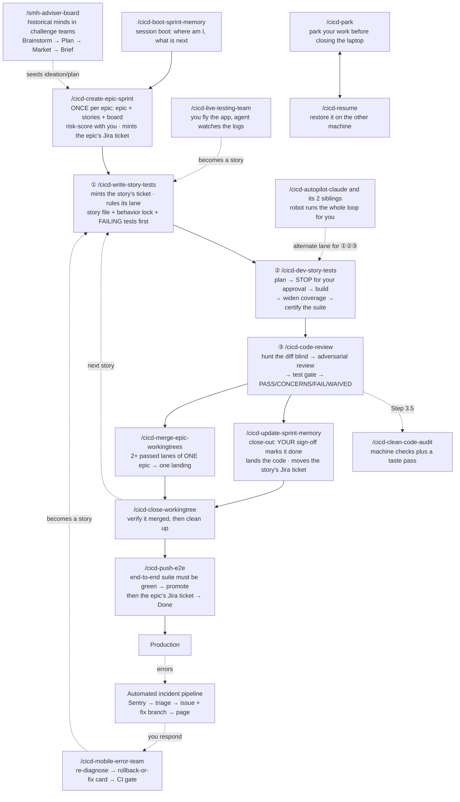
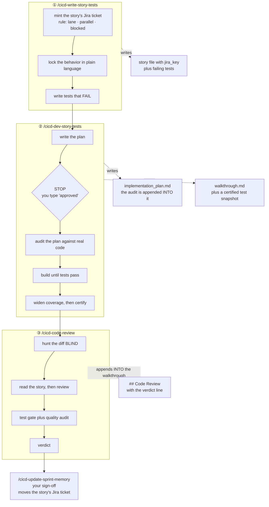
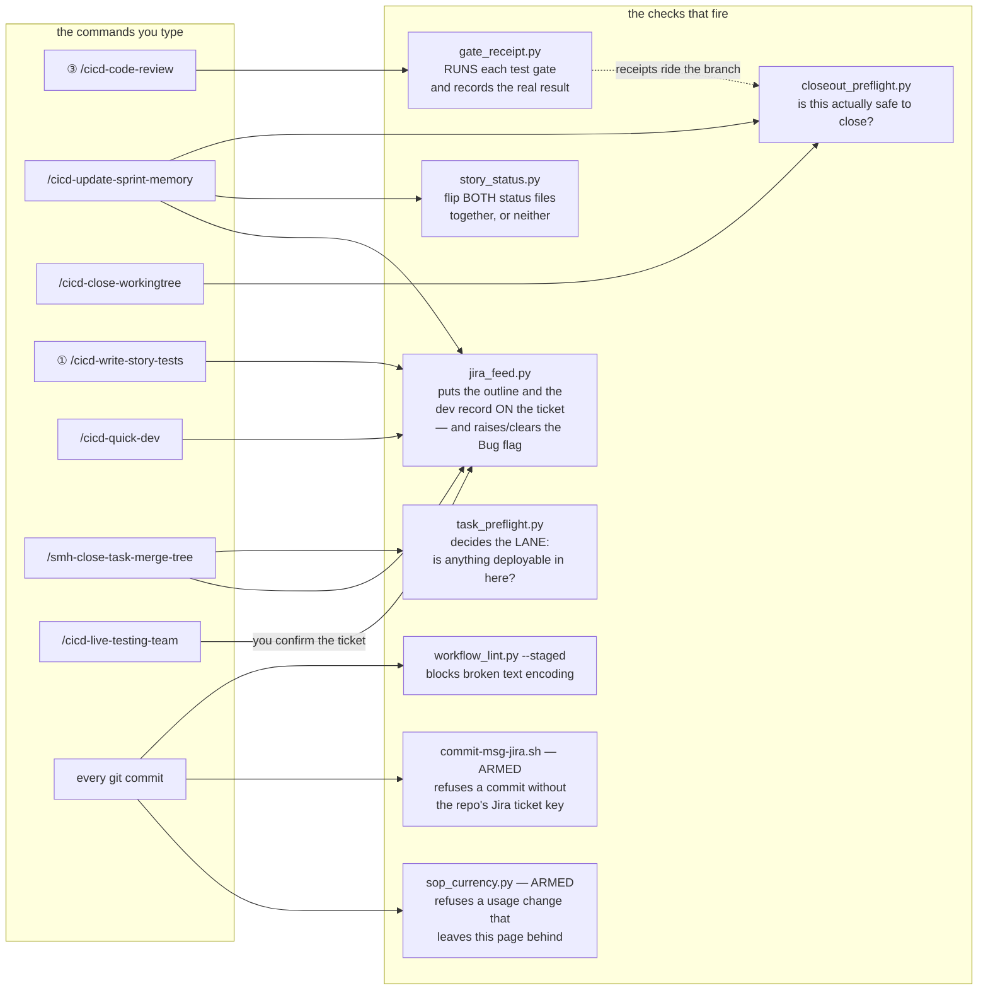
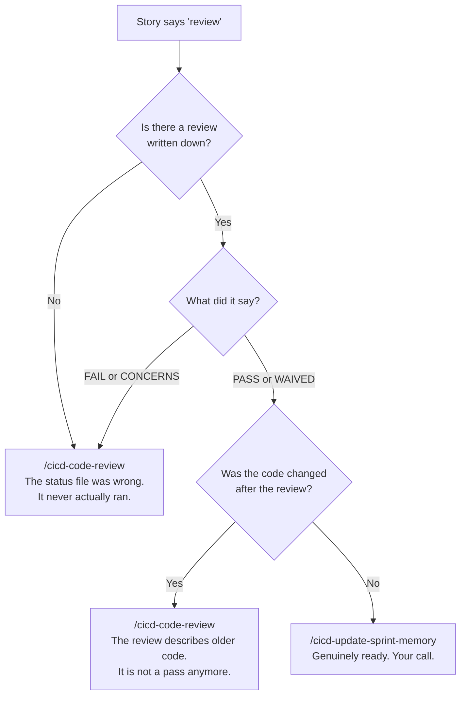
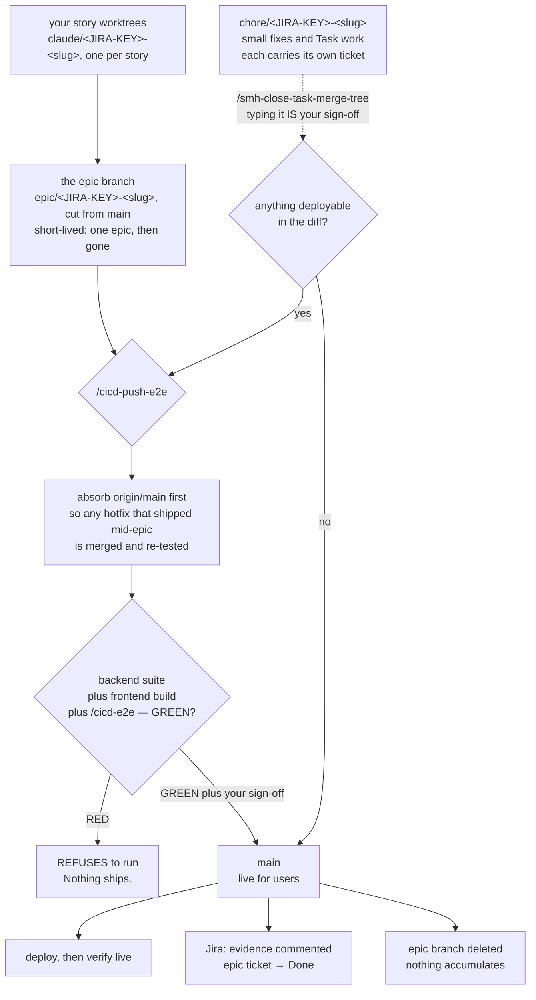
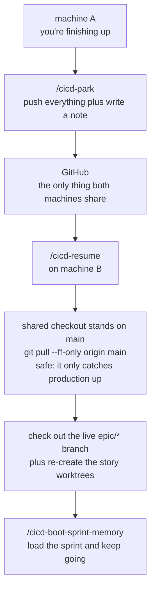
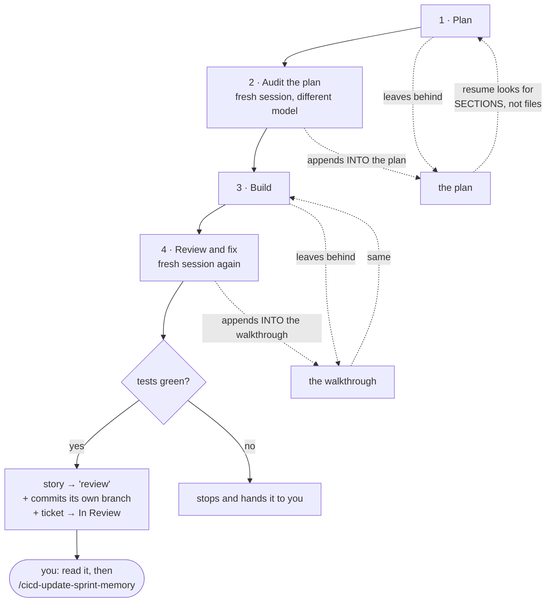
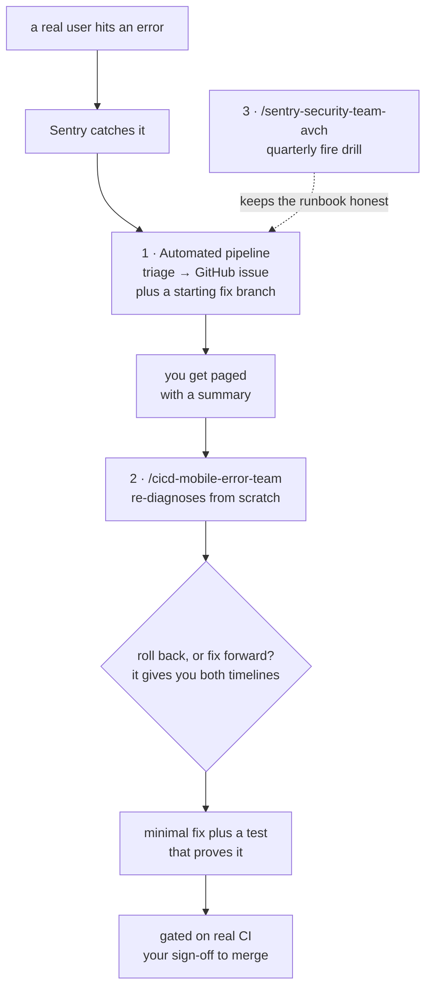

# The Sudo Dev System — Quick Reference

> **How we build, and what you type.** Current as of **2026-08-08**, after Waves 1–5, the
> epic-branch migration (`main` is the only long-lived branch), the **Jira integration** — every branch
> and every commit now carries the repo's ticket key, enforced by an armed git hook — and the
> **toolkit centralization** (SCC-31/32/45 · AVCH-23), which moved every shared rule, command, skill,
> and workflow to one home. Read once start-to-finish, then jump in. Every technical term gets explained
> the first time it shows up — you shouldn't need to know git plumbing to run this system.
>
> **This page is kept current by a gate, not by good intentions.** Change a `/` command, a rule, a
> safety-net script, or a commit hook, and the commit is **rejected** unless this file moves with it
> (`[sop-ok]` in the message opts out and is logged). The law:
> [`sop-currency.md`](../../.agents/rules/sop-currency.md).

## In this workspace

You're in the **command center (lobby)**. It has no sprint of its own — it holds the toolkit and drives
the child projects under `Projects/`.

**One home, since 2026-08-07.** Every shared rule, `/` command, skill, workflow, and the BMAD machinery
lives here and *only* here. Nothing is copied into a project any more. A project carries just its own
law — its `rules/`, its `skills/`, and the `.agents/INDEX.md` that routes them — plus the enforcement
that has to sit in the repo to work at all (its git hooks and its `jira.conf`). Two consequences worth
holding: **you edit a shared rule in exactly one place and every project has it instantly**, and
**binding a project means reading its `.agents/INDEX.md` first**, because that file is now the only
thing that tells you what's local.

| | |
|---|---|
| What runs next | the [SCC Jira board](https://sudo-command.atlassian.net/jira/software/projects/SCC/boards/2) — sprint view (§11) |
| The shared toolkit — the only copy | [`.agents/`](../../.agents/) — commands, rules, skills, workflows, scripts |
| What a project owns vs. what it reads from here | [`project-law.md`](../../.agents/rules/project-law.md) |
| Long-form depth | [`../diagrams_guides/`](../diagrams_guides/) |
| Projects this **lints** (`/smh-update-maps-indexes`) | the [maintained list](../../.agents/maintained-projects.txt) — AGY_AVIATIONCHAT · NEXgen-VR-Director. It is a lint worklist, **not** a sync target: nothing is pushed into a project. |

AGY_AVIATIONCHAT keeps its own copy of this page, localized in the header block, §11 and §13. **The body
is meant to be identical** — if the two disagree, this one is canonical.

---

## Start here

**I want to…**

| …do this | → run / read |
|---|---|
| know what to work on | **put the card in `To Do Next` on the board — that column *is* the answer** (see below). On a project: `/cicd-boot-sprint-memory`, which now leads with that column and falls back to the sprint file. In the command centre: just ask. |
| see or move the sprint board | ask any agent — the live board answers via `acli` (§11) |
| start the next story | ① `/cicd-write-story-tests <id>` |
| build a story that has failing tests waiting | ② `/cicd-dev-story-tests <id>` |
| review code that's written | ③ `/cicd-code-review <id>` |
| land a story that passed review | `/cicd-update-sprint-memory` — it pre-flights everything first (§5) |
| land every lane of one epic at once | `/cicd-merge-epic-workingtrees <epic>` |
| fix something small, or change docs/config | `/cicd-quick-dev <slug>` — **low-risk work only**; still gets ACs up front and a review gate after |
| close out a **Task** (toolkit/rules/IDE work with no story) | `/smh-close-task-merge-tree` — the non-BMAD close-out: gate, merge to `main`, Dev Record, prune (§6). **Codex:** select it with `/skills` or type `$smh-close-task-merge-tree`; Codex does not support repo-defined top-level `/name` commands. |
| know whether a review still counts | §5's decision tree — a review of old code is not a review |
| ship to production | `/cicd-push-e2e` (§6) |
| switch machines | `/cicd-park` before, `/cicd-resume` after — §7 shows the handoff end to end |
| chase a production error | `/cicd-mobile-error-team` (§12) |
| brainstorm or solve hard problems | `/smh-adviser-board` — historical minds in challenge teams (§3) |
| free up a heavy session | `/cicd-prune-context` |
| **change the system itself** — a command, a rule, a gate | edit it in `.agents/` (the only copy), then **update this page in the same commit** — a gate enforces it (§5) |

### ⭐ `To Do Next` — the column that answers "what's next?"

**Drag a card into `To Do Next` and every agent picks it up from there.** No file to edit, no command
to run — the column *is* the instruction. Ask any agent "what's next?", or boot a session, and the
answer walks three ranks and stops at the first one holding anything:

**`In Progress`** (finish what's started) → **`To Do Next`** (what *you* chose) → **`To Do`** (the
backlog). `Blocking` is reported separately as an impediment and is **never** offered as something to
start.

Two things worth knowing:

- **On a project (AVCH), this beats the sprint file.** `/cicd-boot-sprint-memory` normally computes the
  next story from `sprint-status.yaml` — but that file lags *by design*, since only close-out writes it.
  A card you placed by hand outranks a stale computed guess. If the two disagree the agent reports both
  and leads with yours.
- **The column is per board, and adding it is the whole install.** Only SCC has it today. Create the
  column in the Jira UI on any other board and it starts working there immediately — no rule change, no
  code change. A board without it is silently skipped, not an error.

⛔ **`_my_resources/open_tasks/todo_list.md` is retired as an agent source** (2026-08-09). Keep it as
personal notes if you like; agents no longer read it, and it is never quoted as "what's next".

**Sections:** 1 the map · 2 the two rules · 3 commands · 4 the loop · **5 the safety net** ·
6 shipping · 7 machine handoff · 8 how we test · 9 TEA tools · 10 autopilot · 11 the board ·
12 incidents · 13 depth

---

## 1. The map — how everything connects

*What you're looking at: every command in the system and what hands off to what. Solid lines are the
main road; dotted lines are the on-ramps.*



---

## 2. How this works — the two rules above every command

**Test-first, human-gated, story-driven.** Work is a **story**: it starts with tests that *fail*, code
exists only to make them pass, and an adversarial review stands between "coded" and "done."

- **Plan first.** No agent touches a project file until you type the literal word **`approved`** on an
  `implementation_plan.md`. "ok" / "looks good" / "continue" are deliberately **not** approval — the
  gate only means something if it's one specific word.
  (→ [000-PLAN-FIRST-GATE](../../.agents/rules/000-PLAN-FIRST-GATE.md))
  **Hardened 2026-08-09**, because it kept leaking. Four more things that are explicitly *not*
  approval, all of which had been misread as such: **clicking an option an agent wrote for you**
  (that answers *which*, never *whether*); **telling it to do the work** ("go build X", "finish Y") —
  being told to build something is the *reason* to write a plan, not permission to skip one;
  **answering its clarifying question**; and **correcting its plan** — a correction narrows the plan
  and the agent must stop and wait *again*. Agents are also now forbidden from putting the word
  "approved" in a button label, which is how the gate was actually bypassed: the agent wrote the
  word, you clicked it, and it read its own word back as your consent.
- **You alone mark a story `done`.** Agents may set it to `review`. Close-out is your signature, and
  running the close-out command *is* the signature — there's nothing else to sign.

Everything else in this document is a consequence of those two.

**And one rule the machines hold so you don't have to:** every branch and every commit carries the
repo's **Jira ticket key** (`epic/AVCH-13-ppl-curriculum`, not `epic/ppl-curriculum`). An armed git
hook refuses a keyless commit outright — which is what keeps every ticket's Development panel honest
without anyone remembering to link anything (§6, §11).

---

## 3. Your `/` commands (the human lane)

> ### ⭐ One door per command, on every tool (2026-08-09, SCC-66)
>
> **Nothing you type changes.** What changed is that each command now has exactly **one** way in per
> tool, instead of two, and the sync builds them all from the same command file:
>
> | Tool | How you invoke it |
> |---|---|
> | **Claude Code** | `/<name>` (the entry comes from a *skill* now, not a command copy — same name, same behavior) |
> | **Codex** | `/skills` → `<name>`, or `$<name>`. **Codex cannot have top-level `/name` commands at all** — that limit is Codex's, not ours, and it is why the skill is the door everywhere. |
> | **opencode** | `/<name>` |
> | **Antigravity** | `/<name>` |
>
> Two old doors are **retired and swept**: Claude's duplicate command copies and Codex's deprecated
> `/prompts:<name>`. They published the *same* command twice on those tools, which is how the menus
> drifted apart without anyone noticing.
>
> **The one thing to know:** after a `/smh-sync-agents`, **start a new Codex chat** — Codex takes its
> skill list when a chat opens, so a sync mid-chat is invisible until you open a fresh one. Restart
> opencode for the same reason. And each machine has its own caches, so a sync on the Mac does not
> reach the PC — run it once on each.

### The story loop — the ones you'll type daily

| Command | What it does for you |
|---|---|
| `/cicd-boot-sprint-memory` | Start of session. Reads the sprint, tells you the next story and exactly which command it needs. It **reads the review verdict from the artifact** rather than trusting the status file — so it won't send you to close out something that hasn't really passed. |
| `/cicd-create-epic-sprint` | **Once per epic.** Writes the epic and its stories, then risk-scores every story with you. That score decides how much testing each story earns. Mints the epic's **Jira ticket** itself at kickoff (you're in the room) — never an invented key: it reads the key from the ticket it just created, and the branch is never cut unkeyed. |
| ① `/cicd-write-story-tests` | Creates the story, locks the intended behavior in plain language, then writes the **failing** tests. Failing is the point — a test that never failed proves nothing. Also **mints the story's Jira ticket** (child of the epic's) and rules **two** things onto the board as labels: `quick-dev` (may ship through the fast lane) and `blocked` (waiting on a linked blocker). It no longer rules `parallel-ok` — see the row below for why. |
| ⭐ `/cicd-parallel-check <EPIC-KEY>` | **New, 2026-08-09.** Run it once an epic's stories are all **written**, before you start any of them: it tells you which ones you can run **side by side**. It reads every story file, works out what each one will actually *change* (as opposed to merely mention), and hands you the biggest group that touches no file in common — tagged `parallel-ok` on the board so the group is one filter away. **Why it exists as its own command:** ① used to decide this when it minted each ticket, and it could never have been right — it rules story 19.1 before 19.2 has even been written, so there is nothing to compare it against, and it never looks again. Parallel-safety is a fact about a **group at a moment**, not about one story. Proof: *zero* tickets ever carried the label. **It never guesses.** A story with no file written yet gets "write the story first", not an opinion. When two stories are ambiguous it locks them rather than approving — a wrong green puts two of your lanes on the same file, a wrong lock only costs you running them one after the other. **The answer has a shelf life, and it says so:** it stamps which stories it compared, so if you write another one afterwards the old answer reads *"re-run me"* instead of quietly lying. **It only ever tells you — it never starts anything.** |
| ② `/cicd-dev-story-tests` | Plans, **stops for your `approved`**, builds until the tests pass, widens coverage, then records a signed-off snapshot of the results. |
| ③ `/cicd-code-review` | Hunts the diff cold, runs an adversarial review, audits code quality, runs the test gate, issues a verdict. The verdict lands as a `## Code Review` section in the story's `walkthrough.md` — stories closed before 2026-08-02 keep it in the old standalone `sudo-code-review-<story>.md` file instead, and that historic filename stays under its old name on purpose: the files already exist on disk in the project trees, so anything that reads the fallback must name them as they are, not as the command is now called (SCC-63 audit). |
| `/cicd-clean-code-audit` | Dead code, duplication, drift. Runs inside ③; also runs solo across a whole area. |
| `/cicd-update-sprint-memory` | Close-out. Pre-flights everything mechanically (§5), marks the story done on **your** word, saves what was learned, lands the code — and **moves the story's Jira ticket** to match, with the evidence attached. |
| `/cicd-merge-epic-workingtrees` | Lands **all** of one epic's finished lanes in a single reviewed pass — instead of closing out four stories one at a time. |
| `/cicd-close-workingtree` | Confirms the branch really merged, then removes the workspace and deletes the branch. |
| `/cicd-bdd-tests` | Locks behavior in plain language, standalone (① does this for you). |
| `/cicd-self-audit` | Pressure-tests a plan against the real code before anyone writes anything (② does this for you). **Fixed 2026-08-09 (SCC-58):** the step where it asks the code graph "who else breaks if we change this?" had never once run. It decided whether the graph was available by looking for a section title inside `AGENTS.md` — and that title actually lives in `docs/gitnexus.md`, so the answer was always "not available" and it quietly fell back to plain text search. In AGY that meant grepping a 50,000-symbol app instead of asking a map that answers *"286 things break, 141 of them immediately, across 72 user journeys."* It now asks the tool itself which projects are indexed, so prose can't lie to it either way. Three guards came with it: it names the project on every question (three are indexed — an unnamed question gets answered about the wrong one), it **checks the map is not stale before trusting it** (the map is a local cache that goes out of date on every pull, and a stale one describes code that no longer exists while looking perfectly clean), and it treats a **"nothing breaks" answer as the one to double-check by hand** — the graph is blind to one common calling style, so "safe to change" is the answer it is most likely to get wrong. |
| `/cicd-quick-dev` | Fast lane for genuinely small work — a fix, a docs/config change, a task that does not earn the full pipeline. **Accuracy over speed:** it drops the *pipeline* (no ATDD red phase, no full suite, no three-reviewer panel), never the rigour — it still opens a worktree, **fixes acceptance criteria before any code**, and runs a **mandatory review gate** afterwards (an independent adversarial reviewer that never saw the conversation; on code, an acceptance audit + the clean-code machine floor + scoped tests; on docs, a link/anchor + SOP-currency check). **Low-risk only** — anything touching login, permissions, payments, user data, DB schema, or a cross-service contract ejects to the full loop no matter how small it looks, and so does anything the router says needs planning. On a story it advances the row to `review` on the way out and **stops there — it never closes out**; `done` is still only yours. ① marks eligible stories with the `quick-dev` label, so the fast-lane pile is one board filter away. |
| `/cicd-prune-context` | Trims the running session notes back under budget so sessions start fast. |

### Machine handoff

| Command | What it does for you |
|---|---|
| `/cicd-park` | Before you close the laptop: commits and pushes everything in flight, and writes a note to your other machine about where you left off. |
| `/cicd-resume` | On the machine you just opened: pulls everything back down and rebuilds your working setup. **Read §7 once.** |

### Shipping

| Command | What it does for you |
|---|---|
| `/cicd-e2e` | Runs the real end-to-end suite — a complete stand-in for the live app, with test users. Green means safe to ship. |
| `/cicd-push-e2e` | The one shipping command — the only road an epic takes to `main` (§6). It **refuses to run** until the end-to-end suite is green and you sign off. After the merge it comments the evidence on the epic's Jira ticket and moves it to **Done**. |
| `/smh-close-task-merge-tree` | **The Task lane's close-out** — the half BMAD has no answer for. A **Task** (toolkit, rules, IDE, skills work) has no epic, no story file and often no sprint board at all, so `/cicd-update-sprint-memory` has nothing to operate on and simply cannot close it. This does the same four things for it: run the gate, merge to `main` with `--no-ff`, file **one** Dev Record and move the ticket to **Done**, prune the branch. **Typing it IS your merge sign-off** — same contract `/cicd-push-e2e` carries for an epic. In Codex, the supported native entry is `/skills` → `smh-close-task-merge-tree` or `$smh-close-task-merge-tree`; the old prompt copy could only appear as `/prompts:smh-close-task-merge-tree`, never this top-level name, and is retired. Your question about skipping the end-to-end tests is answered **by the repo, not by the agent**: it derives the lane and either says *this repo has nothing that deploys, so there is no E2E suite to skip* (the command centre) or *this diff touched `backend/`* — and in that second case it **refuses and hands the work to `/cicd-push-e2e`**, with no override flag. It is deliberately named `smh-*` rather than `cicd-*`, because that family is barred from acting on the command centre and toolkit tasks live there. |

### Debugging and incidents

| Command | What it does for you |
|---|---|
| `/cicd-live-testing-team` | Boots the app and watches the logs while **you** click around. Files researched bug reports. Writes no code. **Now also traces each bug back to the ticket that shipped it** and shows you the candidates — it never flags one without your word (§11). |
| `/cicd-mobile-error-team` | Live incident responder, works from your phone. Re-diagnoses independently, gives you a rollback-vs-fix decision, writes the fix and a test that proves it. |

### Thinking

| Command | What it does for you |
|---|---|
| `/smh-adviser-board` | Convene historical minds in 5 challenge teams (+ Real-World marketing squad) to flip assumptions, solve hard frontier problems, and surface what people *need*. Runs Brainstorm → Plan → Market → Brief stations; advances only on your word. Saves brief to `_my_resources/board_sessions/`. |

### Autopilot — the robot lane

| Command | Runs on | Notes |
|---|---|---|
| `/cicd-autopilot-claude` | the `claude` CLI | The canonical robot loop: Plan → Audit → Build → Review, four separate sessions. |
| `/cicd-autopilot-opencode` | the `opencode` binary | Port of the same loop. |
| `/cicd-autopilot-deepseek4` | `claude` CLI plus a flag | Runs the token-heavy building half on a cheaper model, keeps review on Claude. A *lane* of `/cicd-autopilot-claude`, not a third engine. |

> There is **no** `/autopilot-claude` with a hyphen. Every launcher uses an underscore.
>
> **`/autopilot_mobile` was deleted 2026-08-07.** There is no separate mobile engine any more — from your
> phone you drive the desktop engines through Remote Control, which is strictly better: same code, same
> gates, one thing to fix when the loop changes.

### Toolkit upkeep

| Command | What it does for you |
|---|---|
| `/smh-update-maps-indexes` | Reconciles the repo maps, every index, and every cross-reference across the lobby and the maintained projects. **Changed 2026-08-09 (SCC-68):** it no longer touches the memory store — that moved to `/smh-memory-audit`. |
| `/smh-memory-audit` | **New 2026-08-09 (SCC-68).** Cleans up the shared memory store (`_artifacts/_memory/`) — the one document every model on every machine loads *before* doing any work, which is why letting it fill costs you on every session everywhere. It doesn't just trim for size: it checks each memory's claim against the live repo (the rule it names — does that file still exist? the thing it calls CLOSED — is that actually finished?), then shows you a list of *retire · merge · compress* with the bytes each frees and waits. **Nothing is deleted without your yes on that specific item**, and git is the undo either way. **You don't have to remember to run it:** the test gate that runs on every close-out watches the index and, at 90% of the 25 KB ceiling, prints `MEMORY AUDIT DUE` and requires whichever agent sees it to stop and ask you. That trigger sits *below* the ceiling on purpose — it's there to prevent a red gate, not to be one. The old home for this was `/smh-update-maps-indexes` Step 3.9, and it never once ran: nobody opens a *map* command because memory feels heavy. |
| `/smh-sync-agents` | Publishes the toolkit to all four platforms — **one door each** (see the box at the top of this section). It reaches **the lobby and this machine's caches only** — the old `-Maintained` fan-out that copied the toolkit into every project was retired with centralization. Projects read from the center; there is nothing to push. **Updated 2026-08-09 (SCC-66):** it now *generates* the Claude/Codex skill door for every command instead of publishing a second command copy beside it, and it purges the two retired doors (Claude's command mirrors, Codex's `/prompts:` cache). Hand-written skills are never overwritten. A sync still cannot create an arbitrary top-level Codex `/name` — that is Codex's limit, and the skill is the answer to it. **Fixed 2026-08-09 (SCC-56): Antigravity was missing five commands.** The Antigravity half decided what to publish by **filename** (`sudo-*` and three named files) and only then read the command's own declared reach — so `/smh-close-task-merge-tree`, `/smh-sync-agents`, `/smh-review`, `/webm-alpha-video` and `/cicd-clean-code-audit` were invisible there, silently, even though `cicd-clean-code-audit` names Antigravity outright. (`/webm-alpha-video` was later retired as a command — SCC-63 — and is now a skill only.) What a command *declares* is now the only thing that decides. If an expected entry is missing, first use that platform's syntax, then re-run this. |
| `/smh-slash-command-updating` | A thin alias for the globals-only half of `/smh-sync-agents` — refreshes the Antigravity and opencode machine caches when their menus go stale but the lobby is fine. Plain `/smh-sync-agents` does this *and* the local dirs, so prefer it. |
| `/smh-review` | Reviews the working diff outside the story loop — the quick read when there's no story to hang ③ on. |
| `/smh-new-project` | Scaffold a new workspace. |
| `webm-alpha-video` | **Skill only — not a slash command (retired SCC-63).** Green-screen video to transparent WebM; load it by intent, not by typing `/webm-alpha-video`. |

### Not in your menu, on purpose

| Name | Why |
|---|---|
| `cicd-*-AP` | **Robot-only.** The autopilot engines call these. Never typed by a human, deliberately kept out of your menus. |
| `/sentry-security-team-avch` | A fire-drill harness that rehearses the incident runbook. The *live* responder is `/cicd-mobile-error-team`. |

---

## 4. The story loop, step by step

*What you're looking at: the same three steps as the map, but showing what each one leaves behind. The
documents on the right are how the next step knows what happened — they are the system's memory.*



**Why ③ hunts the diff before reading ②'s notes:** opening the builder's write-up first imports the
builder's framing — the exact blind spot the review exists to remove. Order is always *hunt cold, then
read the story.*

**Two documents, not ten.** Everything a story produces lives in exactly two files: the **plan** (the
pre-build audit gets appended into it) and the **walkthrough** (the review gets appended into it). If
you're hunting for what an audit or a review said, it is inside one of those two — never a separate file.

**Dense, not short — and no size limit (changed 2026-08-08, SCC-51).** Those two docs used to carry hard
byte caps (8 KB / 10 KB). They are gone. The caps were set the same day the **audit** began appending into
the plan, which quietly made it a two-author document — so the only way to stay under the cap was for the
second author, the auditor, to cut findings. A plan that grew because the audit found eight real things is
working correctly. **Length is never a reason to drop a finding, an acceptance criterion, or evidence.**
What survives is the reason the caps existed: these files are re-read on every pass of the loop, so every
line has to earn it — cut restatement and filler, never substance, and never split into a third file.
(Limits that *move* content rather than destroy it all stay: the running session notes still have a size
budget, because going over there means stale state to delete, not a finding to lose.)

---

## 5. The safety net — what runs the checks for you

This is the newest part of the system and the least visible. **Nine small programs — plus two armed git
hooks** — now do the checking that used to be a person holding eight rules in their head. You almost
never run them; the commands run them for you. What matters to you is *what they refuse to let happen.*

*What you're looking at: which safety check fires inside which command.*



| The check | What it refuses to let happen |
|---|---|
| `gate_receipt.py` | **A claimed test result that never ran.** It *executes* the gate and writes down the real exit code. There is deliberately **no way to hand it a verdict** — a receipt existing means the thing actually ran. It also separates *"the tool is missing"* from *"the tests failed"*, because a missing tool is a finding, not a free pass. |
| `closeout_preflight.py` | **Closing out a story that didn't really land.** One command answers: did the code merge · is every repo clean and in sync · does the review verdict exist and does it still apply · do the files the story claims it changed actually exist. **Exit 2 means blocked.** A warning that says *"landing was NOT verified"* means exactly that — it is not a pass. |
| `story_status.py` | **A story marked done in one place and not the other.** Status lives in two files; this flips both together or neither. |
| `workflow_lint.py` | **Broken characters quietly entering a document** — the `—` that turns into `â€"`. Runs on every commit, staged files only, so it stays fast enough that nobody disables it. |
| `commit-msg-jira.sh` | **A commit with no ticket.** Each repo declares its Jira project in `.agents/jira.conf`; a commit whose message carries no valid key for *that* repo — or the wrong project's key — is refused outright. A rejected commit is a no-op: your staged files are untouched, nothing to undo. Merges, reverts, and rebases are exempt (the branch name carries the key for them). |
| `sop_currency.py` | **This page falling behind the system it describes.** Change a `/` command, a rule, a safety-net script, a commit gate, or the root `AGENTS.md`, and the commit is refused unless this file is staged with it. Say `[sop-ok]` in the message when a change genuinely alters no usage — that stays in the git log as the record of the call. It checks only that the two moved together; no program can judge whether the *edit* was right, and the point is to make you look while you still have the context. |
| `jira_feed.py` | **A Jira ticket that is only a title.** Every story ticket used to be minted with a summary and nothing else, and close-out posted one verdict line — so the board could tell you a story existed, never what it was about or what building it taught. Now ① mints the ticket with an outline rendered *from the story file* (its statement, its acceptance criteria — nothing invented; a story with no ACs says exactly that), and the close-out files a **Dev Record**: the decisions, the pitfalls, and what is still owed. Both write paths **read the ticket back** and fail if what they claimed to write is not there. **Exactly one Dev Record per ticket** — `/cicd-quick-dev` closes its own branch and files one too, and a later close-out updates that record instead of stacking a second. It also picks the ticket **type** for you: **Story** = BMAD sprint work (debug stories included), **Task** = workflow/IDE/rules/skills work under one of your grouping epics (`CI/CD Improvment`, `New Epic Feature or Fix`). *Everything* is parented, so the parent never decides it. **`Bug` is a flag, not a kind of work** — it means *this ticket turned out to be broken.* Two things raise it: an audit that finds a live bug and traces it back to the ticket that introduced it, or you, by hand. Either way the ticket comes back out of Done wearing `Bug`, and the close-out puts it back to **Story or Task** — whichever it actually is — once the fix lands, because the bug is gone. Nothing else ever touches it: a bulk pass can't tell "still broken" from "fixed", and only close-out can. `jira_feed.py audit --jira-project <P>` checks a whole board and `--apply` migrates it. **Raising a `Bug` is two commands on purpose:** `trace` reads git history and *proposes* which ticket last touched the broken line; `flag` does the flip. They stay separate because "which ticket last touched this line" is not "which ticket introduced this bug" — a later unrelated edit takes the blame — and a wrong flip drags a finished ticket back out of Done with nothing to undo it. So a machine may propose; only you may confirm. Full model + the AVCH worked example: [`.agents/rules/jira.md`](../../.agents/rules/jira.md) §Work-item types. |
| `task_preflight.py` | **A change to the product sneaking onto `main` labelled a "task".** `/smh-close-task-merge-tree` is cheaper than `/cicd-push-e2e` for exactly one reason — it skips the end-to-end suite — and the only honest justification is *nothing that deploys changed.* That is the claim an agent is worst at checking about its own work, so this derives it instead of asking. Two questions, both answered from the repo: does this repo **have** anything that deploys (`backend/ · frontend/ · firebase/ · functions/ · mobile/ · .github/`), and did **this diff** touch it? No deployable surface at all is the command centre's case — there is no E2E suite there to skip, so nothing is being got away with. Touch one and it **stops dead and sends the work to `/cicd-push-e2e`. There is no override flag, on purpose.** It also checks the branch really is `chore/<KEY>-<slug>` with a key this repo owns, that the tree is clean and pushed, that `origin/main` was absorbed (so a conflict lands on your branch and never on production) — and when it hasn't been, **which of your files the other lanes also touched** (see below) — and that the walkthrough the Dev Record will point at actually exists. Point it at an `epic/`, `claude/` or `incident/` branch and it names the command that IS right rather than just refusing. |
| `split_sprint_status.py` | The one-time migration that shrank the board (§11). |
| `wf_common.py` | Shared plumbing the others import. You'll never call it. |

**Two design decisions worth knowing**, because they look like bugs until you know why:

- **"Did this change?" compares *content*, not commit IDs.** When a branch lands via a merge it gets a
  brand-new commit ID but identical content. Calling that "stale" would make an honest gate cry wolf
  until someone disabled it permanently — so the check asks whether the *content* moved.
- **The encoding check can be told to stand down** on a file that legitimately contains those broken-
  looking characters as data — the checker's own test fixtures, a doc quoting them. Without that escape
  hatch, the gate would block every commit that touches the gate itself.
- **Both new gates ship armed rather than warning first**, which breaks the usual advice. The reason is
  specific to how you work: **hook output is invisible in VS Code.** A warn-only gate prints into a pane
  nobody reads, so it looks exactly like a clean success — you'd have shipped the gate and enforced
  nothing. Every one of them keeps a one-token exit instead (`[sop-ok]`, or `--no-verify`), because a
  gate with no legitimate way out gets disabled permanently, and then nothing is checked at all.

Run all their tests any time: **`python3 .agents/scripts/tests/run_all.py`** (on the PC, `python …` —
see the box below) — 202 checks across 7 files, about ten seconds. Full detail in
[`.agents/scripts/INDEX.md`](../../.agents/scripts/INDEX.md).

> **⚠ Python is named differently on your two machines.** The **Mac** has **only `python3`** — no bare
> `python`, not in a script and not in your own shell. A python.org install on the **PC** has **only
> `python`** (Microsoft Store installs have both). So there is no single spelling that works
> everywhere: commands in these docs are written `python3`, and **on the PC you drop the `3`**. If a
> documented command answers *command not found*, try the other name before assuming anything is broken.
>
> **The gates themselves are immune to this** — every hook probes `python3 → python → py` and uses
> whichever exists, so the safety net works on either machine with nothing to configure. It is only the
> commands *you type* that differ. See §7.

### When another lane lands while you're mid-branch (2026-08-09)

Somebody else merging to `main` is normal and mostly free. What actually costs you a session is being
behind **on a file you also edited** — and "you are 7 commits behind" tells you nothing about which case
you're in, so a 30-second catch-up and a real hand-merge read exactly the same.

Both preflights now say which. When your branch hasn't absorbed the other side, they diff the two and
either tell you:

> `no file overlap: origin/main moved on 16 file(s), none of the 8 this branch touched — the merge should be clean`

or name the ones that collide:

> `2 file(s) changed on BOTH sides — resolve by keeping both sides' facts, never by picking a winner: _my_resources/_quick_reference/sudo_workflows_testing.md, .agents/rules/jira.md`

"Keep both sides' facts" is the standing rule for these, not a suggestion — parallel lanes record
*different true things*, so picking a winner silently deletes someone's work. The `/` commands you type
don't change; `/smh-close-task-merge-tree` and `/cicd-update-sprint-memory` just tell you more when it matters.

**Why it warns you here and not the moment they merge.** A ping at merge time can't know whether it
affects you — most merges don't — and interrupting a lane mid-flight is its own hazard: absorbing `main`
early drags other people's changes into the diff your review is scoped on, and a `git merge` under a
running dev server has wedged this system before. At the gate you've already stopped, so telling you
costs nothing. And note the verb is always **merge**, never *rebase* — rewriting a branch that's been
pushed is on the never list.

### Is this review still valid?

A review is a statement about *specific code*. If the code changed afterward, the review describes
something that no longer exists. So every verdict is stamped with the exact version it examined.

*What you're looking at: how the system decides whether a story marked "review" is genuinely ready.*



**Why this exists:** for a while the boot command answered "is this ready?" from the status file alone —
which reads `review` whether the review passed, failed, or never happened. It cheerfully pointed at
close-out for work nobody had reviewed. It now reads the actual verdict and checks the version stamp.
Close-out still lets you land a stale verdict deliberately, because that call is yours — it just won't
let you make it *unknowingly*.

---

## 6. Shipping — the end-to-end gate

**One long-lived branch.** `main` is what your users are running — on projects with CI/CD, a push to it
**is** a deploy. Everything else is short-lived by design: each epic gets its own
`epic/<JIRA-KEY>-<slug>` branch cut from `main` at kickoff — the key is the epic's Jira ticket, which is
how the board links every commit without anyone pasting links — stories land on that epic branch, and
the epic reaches `main` exactly one way: `/cicd-push-e2e`. Small fixes outside any epic take a
`chore/<JIRA-KEY>-<slug>` branch off `main` (every chore carries its own ticket), merged back the same
session with your sign-off — that merge is `/smh-close-task-merge-tree`, and typing it **is** the sign-off.

> ### ⛔ One typing = ONE merge (added 2026-08-09, SCC-71)
>
> Typing `/smh-close-task-merge-tree` authorises **the one task you typed it for**. It does not authorise
> the next one, no matter how soon it follows. The same one-shot rule governs `/cicd-push-e2e` for an
> epic merge, and `/cicd-update-sprint-memory` for a story landing. Every other merge to `main` needs
> you to say so directly.
>
> **Two of those three are `main` doors; the third is not.** `/cicd-push-e2e` and
> `/smh-close-task-merge-tree` reach `main`. `/cicd-update-sprint-memory` lands a story on its **epic
> branch** and never touches production — its own body says so in as many words. Read as a door list,
> the paragraph above used to imply three doors onto `main`, and that misreading is what sent SCC-77's
> first attempt off building a gate around branches nobody pushes (ruling 2026-08-10). The canonical
> table is `.agents/rules/git-policy.md` § "The write gate"; when in doubt, that file wins.
>
> **This got broken, and it is worth knowing how.** In one long session the command was invoked
> **once** and then rode **six** merges (SCC-64 → SCC-69). Not defiance — the command's whole body
> stays sitting in the agent's context after you type it, and on task six it still looks exactly as
> valid as on task one. A permission that arrives as a *document* doesn't expire when the task does.
> Twice you typed the command to authorise the next merge and were told "already done": **the sign-off
> was arriving after the merge it was meant to authorise.**
>
> **What you should see instead.** When a task is merge-ready the agent stops with the branch pushed,
> gates green and preflight clear, and hands it back to you — then waits. If it reports a merge you
> did not authorise for *that* task, that is the bug, and the merge SHA's timestamp against your
> message is how you prove it.
>
> **Now fixed mechanically (2026-08-10, SCC-77).** `.githooks/pre-push` refuses any push landing on
> `main` without a single-use approval token, and spends the token on the way through. The two door
> commands mint it at their sign-off step, immediately before the push.
>
> **What the gate actually checks**, in order — each refusal names its own reason:
>
> | Check | Refused when |
> |---|---|
> | armed | `MAIN-PUSH-ENFORCE` deleted or `DISABLE` present → passes through, deliberately |
> | destination | only `refs/heads/main`, whole-token — `epic/main-fix` never trips it |
> | exists | no token at all |
> | fresh | minted more than **30 minutes** ago |
> | **same commit** | **the token names one sha and the push carries another** |
> | delete | anything that would delete `main`, always, no path |
>
> **The "same commit" check is the one that would have caught SCC-71.** The token records the sha it
> was minted for, so work committed *after* your sign-off is refused — that is exactly the shape of
> six merges riding one approval. Every refusal also discards the token, so a failed sign-off is spent
> rather than left lying around for the next push to match by accident.
>
> **Where it lives and why.** Pure POSIX `sh`, no Python, no PowerShell. The predecessor gate —
> `require-push-approval.py`, wired in `.claude/settings.json` — never ran once on the Mac: it was
> invoked as `powershell -Command "python ..."` and this machine has *neither* binary, only `pwsh` and
> `python3`. It exited 127 silently on every push, along with all four SessionStart hooks. A gate that
> depends on one platform's binaries is not a gate, so this one depends on nothing. The Claude-side
> hook is repaired too, but only as a nicer prompt — **the git hook is the enforcement**.
>
> **What it does not do, stated plainly.** An agent can write files, so an agent can write a token.
> This is not a security boundary against a determined agent and is not sold as one. It turns a silent
> violation into a deliberate, traceable one, and it closes the drift failure — a close-out command
> whose body sits in your agent's context still reading valid on task six. Merges through the GitHub
> web UI or `gh pr merge` never reach a local hook at all; that gap is tracked under SCC-75.
>
> **If you are legitimately stuck:** `git push --no-verify` once, or delete
> `.agents/scripts/git-hooks/MAIN-PUSH-ENFORCE` to disarm it entirely. Both are loud and neither is
> hidden — the point is that going around the gate should be a decision, not an accident.

### ⭐ Every lane now gets its own workspace — not just story lanes

**Changed 2026-08-09 (SCC-62).** The rule used to decide who got an isolated workspace by asking *what
kind of work this is*: a story lane got one, everything else was **forbidden** one and had to work in the
shared checkout. That was backwards. The thing that causes damage is **how many agents are in the repo at
once**, and a small toolkit fix running next to a story collides just as hard — except it was the one
told to sit where the collisions happen.

The old wording also made the agent work out its own category, and ended with *"unsure? you're not"* —
which sent every ambiguous case into the shared checkout, the one place it must not go. **Now: if a lane
is going to commit anything, it gets its own workspace. No classification, nothing to get wrong.**

Two things deliberately did **not** change, because changing them would break the epic model:

- **Where a lane branches FROM is untouched** — a story still branches from its epic branch (never
  `main`), Task work still branches from `main`. SCC-62 changed *who gets a workspace*, not *what they
  branch from*.
- **Each close-out still cleans up its own** — `/cicd-close-workingtree` for stories, and
  `/smh-close-task-merge-tree` now does it for Tasks. That prune step is the whole reason Task work was
  banned from having a workspace before: nothing was cleaning them up, so they piled up as orphans.

**Why this was worth doing:** on 2026-08-09 it went wrong twice in one afternoon. A close-out inspected
a *different* lane's branch and reported it clear to merge (SCC-61), and the next Task opened onto a
checkout still holding 11 of that lane's half-finished files (SCC-58).

**The one practical cost, solved.** A fresh workspace doesn't get the files git deliberately ignores —
`.env`, keys, `node_modules`. You can *see* them, but the test runner and dev server look for them in
the folder they're running in, so they fail. Run
`python3 .agents/scripts/link-worktree-assets.py <workspace>` (PC: `python`) and it points the new
workspace at the originals in seconds rather than copying gigabytes. It warns you about the two cases
that bite: a linked `.env` is **shared** — change it in one lane and every lane sees it (`--copy-env` if
that's not what you want) — and a shared `node_modules` is fine for day-to-day work but the E2E suite
needs its own. **Always `--unlink` before deleting a workspace**; both close-outs do it automatically,
because a delete that walks through a link destroys the *original*, not the shortcut.

**Same-day follow-on (2026-08-09, SCC-62 sweep).** A fresh-eyes pass before the AGY close-out caught the
flip's loose ends and closed them: the linker now finds assets **one folder down** too (`backend/.env`,
`frontend/node_modules` — the real AGY layout; before, it looked only at the repo root and would have
quietly linked almost nothing there), and four leftover copies of the OLD "no workspace for ad-hoc work"
wording were corrected where they still stood — the front door (`AGENTS.md` §8), the rule's own hard-stop
list, the rules index, and `artifacts-always-first.md`. If you see the old wording anywhere again, it's
wrong: the rule is *going to commit → own workspace*, full stop.

*What you're looking at: the one road to production, and where the gate stands on it.*



Before the merge, `/cicd-push-e2e` pulls `origin/main` **into** the epic branch and re-gates — so `main`
never receives an unresolved conflict, and a hotfix that shipped mid-epic is already absorbed. The merge
itself is `--no-ff` (the epic stays visible as one unit in history), and the epic branch is deleted after
it lands — branches are short-lived on purpose; nothing accumulates. Because the branch name rides in the
merge message, Jira links even the merge commit to the epic's ticket; the same command then posts the
gate evidence on the ticket and moves it to **Done** — child stories already moved one at a time at their
close-outs.

`/cicd-e2e` also runs solo any time you want end-to-end confidence without shipping.

**Where each check runs:**

| Gate | Where | When |
|---|---|---|
| Pull-request checks | GitHub Actions | every PR into `main` or an epic branch |
| **Jira key check** | local, armed git hook | **every commit** (§5) |
| Test-selection gate | local, before push | picks the affected tests; falls back to the full suite when unsure |
| **End-to-end gate** | local, via `/cicd-push-e2e` | **before anything reaches production** |
| Deploy | hosting CI/CD | on push to `main` |
| Incident pipeline | GitHub Action | when a real user hits an error (§12) |

### The other road to `main` — `/smh-close-task-merge-tree`

Epics take the road above. **Task work takes this one**, and it exists because most of what you do in
the command center — the commands, the rules, the safety-net scripts — is real work that reaches
`main` and has no epic to ride. (Story vs Task, and why close-out can't do it: §11.)

Five steps, in this order:

1. **Preflight** — `task_preflight.py` checks the branch really is `chore/<KEY>-<slug>` with a key
   this repo owns, that the branch carries **the ticket the agent said it meant to close**
   (`--expect-key`, required since SCC-64 — see §10 for the failure it kills), that any `task.yaml`
   manifest agrees, the tree is clean and pushed, `origin/main` is absorbed (and if not, names the
   overlapping files — see below), the walkthrough exists,
   and **the lane**. Exit 2 stops the command.
2. **The gate the lane picked** — in the command center that's the enforcement suite plus the toolkit
   lint, with the real output pasted, not summarized.
3. **Merge to `main`** — `--no-ff`, so the task stays one reviewable unit in history and Jira links
   the merge commit through the key in the branch name.
4. **The ticket** — one Dev Record, then Done.
5. **Prune** — branch deleted local and remote, `0 0` and clean confirmed.

**Two decisions behind it worth knowing**, because both look arbitrary until you see the failure they
avoid:

- **The merge happens before the ticket, not after.** A ticket reading `Done` while the merge actually
  failed is a lie sitting on your board that nothing will ever correct. A merge that landed while the
  record lags is one command away from right. Given a choice of which half fails, take the
  recoverable one.
- **It is deliberately `smh-`, not `cicd-`.** Every `cicd-*` command binds one rule that says *operate
  on exactly one project — never the command center*. Toolkit tasks live **in** the command center, so
  a `cicd-` name would have needed an exception carved into that rule. The `smh-*` family
  (`/smh-sync-agents`, `/smh-update-maps-indexes`, `/smh-new-project`) is already the one allowed to act on the repo
  you're standing in. **The prefix carries the permission** — that's why it reads differently from
  everything else in your menu.
  - **One exception now exists, and it proves the line rather than blurring it (2026-08-09).**
    `/cicd-parallel-check` is allowed to reach the command center, because it never *chooses* a target:
    you hand it a ticket key and the key decides the repo. `AVCH-13` can only mean AviationChat;
    `SCC-12` can only mean here. It follows the epic it was given. `/smh-close-task-merge-tree` is the
    opposite case — its target is *wherever you happen to be standing*, which is exactly the freedom
    the rule exists to deny. The exception is written down by name and closed; anything new needs its
    own line, deliberately added.

---

## 7. Switching machines

You work one sprint across desktop, laptop, and phone. **Branches travel between machines; your local
working setup does not.** That gap is the entire reason this pair exists.

*What you're looking at: the handoff — push on one side, pull on the other.*



**Why the pull is boring now.** The shared checkout stands on `main` and stays there — always exactly
production. `git pull --ff-only origin main` from there can only catch it up to what already shipped; it
cannot promote anything. (Under the retired two-branch model this exact spot hid a trap: pulling the
build branch while standing on `main` silently fast-forwarded production to 160+ unreviewed commits.
With one long-lived branch, the trap has nothing left to spring on.) Story work never happens in the
shared checkout anyway — it lives in worktrees on the epic branch. Promotion to production happens
through `/cicd-push-e2e` and nowhere else — never as a side effect of picking your work back up.

Two smaller things it handles: a fresh machine shows **no** work in progress even when plenty exists
(it's all on GitHub, not yet on disk), and resuming never deletes anything on your other machine — both
boxes legitimately end up on the same branch.

### What does NOT travel between the machines

Git moves branches and files. It does **not** move your local git *settings*, your environment, or your
secrets — so a few things have to be true on each box independently. This is the category that produces
"it works on the desktop but not the Mac" reports, and every item below has already cost a debug cycle.

| | What breaks if it's missing | Fix — **once per machine** |
|---|---|---|
| **The commit gates** | `core.hooksPath` is *local* config and does **not** travel with a clone. Without it git reads `.git/hooks`, which is empty — so the Jira gate, the encoding gate, and the SOP gate are all **silently off** while the repo looks identical. | `git config --global core.hooksPath .githooks` — a **relative** value resolves against each repo's own root, so this one command arms every clone you have and every one you make later. It's a harmless no-op in repos with no `.githooks/`. |
| **Python's name** | The Mac has only `python3`; a python.org PC has only `python`. Typed commands differ; the gates don't (they probe). | Nothing to install — just use the name your box answers to. |
| **Secrets / `.env` / `auth_keys/`** | All gitignored, so a fresh clone has none of them and things fail in confusing ways rather than obviously. | Restore from the hand-carried master bundle — start at the migrations `INDEX.md` in `_my_resources/`. |
| **Shell environment** | On the Mac, `.zshrc` is read **only** by interactive shells — anything an agent or script runs can't see it. Shared env belongs in `~/.zshenv`. | Put anything scripts need (e.g. `JAVA_HOME`) in `~/.zshenv`, not `.zshrc`. |
| **The Jira login** | `acli`'s API token lives in your **OS credential store**, not in the repo — and the binary isn't at the same path on both boxes either. An agent that trips over this concludes *"I have no Jira integration"* and starts improvising: inventing a key, or borrowing a closed ticket's. | `acli jira auth login`, once per machine. Then **any** agent can confirm it with `acli jira auth status` — the one command that answers identically on both boxes. Never hardcode the binary's path into a doc. |
| **The memory link** | The agent memory store lives **in the repo** (`_artifacts/_memory/`) — that part travels, and since SCC-65 *every* model on *every* machine reads it at session start. What does **not** travel is the link that lets Claude's own harness write into it: without it, Claude quietly writes memory to a machine-local folder and the shared store **stops growing** — no error, just lessons that never reach the other box or the other models. | `link-memory.ps1` (Windows) / `link-memory.sh` (Mac) — migrations kit §1, step 8. `/smh-memory-audit` checks the link on whatever machine it runs on and flags a missing one (it moved there from `/smh-update-maps-indexes` with SCC-68). |

**The rule underneath all six:** anything stored *outside* the repo is per-machine by definition. When
something works on one box and not the other, check this table before suspecting the code — a
Windows-authored assumption reads as "the Mac is broken," and a Mac-authored one reads the same way in
reverse.

> **Setting up a machine?** The short version is [machine_setup_card.md](../migrations/install_guides/machine_setup_card.md) — arm the gates, check the Python name, restore what git doesn't carry. The full path for a
> genuinely fresh box (secrets, venvs, toolchains, the five test gates) is the
> [migrations kit](../migrations/INDEX.md).

---

## 8. How we test

Deterministic code — same input, same output — gets exact tests. AI-generated output gets **soft**
checks that look for meaning rather than exact wording, because demanding exact wording from a language
model produces a test that fails for no real reason. Anything critical is covered at more than one level.

Three things worth carrying in your head:

- **Failing first is the point.** A test that has never failed hasn't proven it can detect anything.
- **Tests added to already-working code pass immediately** — that's correct. Don't manufacture a failure
  to feel better about it.
- **A test fed a value the real system never produces is a false green.** It passes and proves nothing.

**How much testing a story earns** is set by its risk score at epic kickoff — not by how the work feels
once you're in it.

---

## 9. TEA tools — when to reach for one

You rarely call these directly; §4's steps fire them in the right order. Reach for one solo only when
you want that single piece:

| Solo use | Why |
|---|---|
| `/tea` | Activates the Test Architect persona for a strategy conversation. |
| `/testarch-trace` | Shows which requirements have tests, without running a whole review. |
| `bmad-teach-me-testing` | Structured lessons, if you want to go deeper on method. |

One-time setup only: `/testarch-framework` (stand up a test bench) · `/testarch-ci` (scaffold the
automated pipeline).

---

## 10. The autopilot lane

*What you're looking at: the robot running the same loop you'd run by hand — and how it picks back up if
it dies halfway.*



Each stage runs in a **fresh session** so none inherits the previous one's assumptions — the same reason
③ hunts blind in the human lane.

**It's resumable.** Re-run the launcher and it works out which stages finished by looking for their
*sections inside* those two documents, not for the files themselves. A half-written plan doesn't count
as a finished plan.

### The robot works in its own copy of the repo now (2026-08-09)

Every autopilot run opens the story's own **worktree** first — a second, separate checkout of the same
repo on its own branch, so the robot is never typing into the same files as you or another lane. The
code and all the paperwork live in there together, and the robot moves between them as it works. It
looks like `.claude/worktrees/<story>/`, on a branch named `claude/<TICKET>-<story>`.

Two things this bought, and the second is the one that mattered:

1. **Two stories can finally run at once without poisoning each other's tests.** They used to share one
   checkout, and the only thing keeping them apart was a paragraph in the prompt asking each robot to
   please ignore files it didn't recognise. When the test suite ran, it saw everyone's half-finished
   work, so a failure belonged to nobody.
2. **Its work can now be closed out at all.** `/cicd-update-sprint-memory` refuses to land a story that
   isn't in a worktree — so before this, the robot could finish a story perfectly and the normal
   close-out would simply decline to touch it. That wasn't "close-out isn't automated for autopilot"; it
   was a dead end.

**You launch it from the epic branch.** The robot cuts the story's branch from whatever the project has
checked out, and that has to be the epic branch — so switch to it first, or pass
`-EpicBranch epic/<KEY>-<slug>`. It refuses to start rather than guess, because a story branched off
`main` can't be landed. (That branch is also where it reads the Jira key from — the BMAD epic number and
the Jira key don't match up, so there's nothing to calculate.)

**When it's green it now commits, files the ticket, and stops.** It saves the work on the story branch
with an explicit list of files and a Jira-keyed message, moves the ticket to **In Review**, and writes
the Dev Record onto it. It still **never pushes**, never touches `main`, and never marks anything
`done`. So your end of it is: read the walkthrough, the plan, and the ticket — then run
`/cicd-update-sprint-memory`, which lands the branch, flips it to `done`, and cleans up the worktree.
Nothing to commit by hand any more.

> ⚠️ **Not yet run for real.** All of the above was written and checked on the Mac, but the autopilot is
> Windows-only, so no stage of it has actually executed. First time out, use `-DryRun` (it writes
> nothing and shows you the branch and folder it *would* use), then a small story with `-MaxStage 2`,
> on each engine.

The engines live **per-project** and have drifted between projects — a behavior fix has to land in each
one. The two of them (claude and opencode) are **twins by contract**: the worktree, commit and ticket
blocks are kept identical on purpose, so a `diff` of the two files shows drift straight away.

### ⛔ A green check can be telling you the truth about the wrong branch (2026-08-09)

Worth knowing because it changes how you read a report. When several lanes run at once, the checking
scripts work out *which* repo and branch to look at by starting from wherever the agent happens to be
standing and searching upward for the repo. That starting point silently resets — a `/compact`, a new
slash command, a fresh tool call — back to the shared checkout. If a sibling lane has moved the shared
checkout onto **its** branch, the check quietly points there instead.

Nothing errors. The script has no way of knowing which ticket the agent meant, so it runs every check
properly and reports a clean result — **about the wrong branch.** It happened on 2026-08-09: a Task
close-out printed *"clear to close out and merge"* for a different lane's unfinished branch. Merging on
that would have put someone else's half-done work onto production under the wrong ticket.

What changed, so you can hold the agent to it:

- Every close-out command now has to say **which repo and which branch** it resolved — read out of `git`,
  not from what it remembers — and **name the ticket it means to close** *before* it runs the check.
- If the check comes back pointing at a different ticket, it must **stop and tell you**, not retry.
- The same trap in miniature: piping a check into `tail` to shorten the output makes the computer report
  *`tail`'s* success instead of the check's, so a failed gate prints "passed". Gates now run unpiped.

**The one thing to ask for:** if an agent reports a gate as green, ask which branch the gate named. A
report that can't answer that hasn't been verified — it's been assumed.

**Update (2026-08-09, SCC-64): the machine now enforces this instead of trusting the agent to.**
The Task-close-out check refuses to run at all unless it is told **which ticket is meant**
(`--expect-key`), and it blocks — hard — when the branch it resolved carries a different ticket's
key. The discipline above still matters for every *other* script, but for Task close-outs a drifted
agent can no longer get a clean verdict about the wrong branch; it gets an error naming both
tickets. Two more things came with it:

- Each task can carry a small `task.yaml` in its artifacts folder — the ticket, repo, and branch
  written down at task *start*, before anything can drift. The check cross-reads it, and a
  manifest that disagrees with reality blocks the close-out until one of them is corrected.
- Toolkit close-outs in the command centre now run the lint scoped to the toolkit
  (`--toolkit-only`), so a red or green about some *product project's* sprint state can no longer
  leak into a decision about toolkit work. If an agent explains away a red gate as "pre-existing,
  different project", it is using the wrong flag.

---

## 11. The board — what runs next

**The scrum-board map is retired (2026-08-07, SCC-13 / AVCH-10).** `sprint_scrum_board_map.md` and
`/sudo-update-scrum-board` are gone; the human-facing view of "what runs next" is the **Jira board** —
[SCC](https://sudo-command.atlassian.net/jira/software/projects/SCC/boards/2) for this command center,
[AVCH](https://sudo-command.atlassian.net/jira/software/projects/AVCH/boards/3) for AviationChat. The
sprint holds the current batch, the backlog holds everything else, and every ticket links to its
branches and commits through the key. How to drive it by hand:
[jira_manual.md](jira_manual.md); why it's built this way:
[jira_integration_guide.md](../diagrams_guides/system/jira_integration_guide.md).

> **The command menu kept advertising it for two days after it was deleted** — the `/` index still
> listed `/sudo-update-scrum-board` under session ops with a full description, which is what sent you
> looking for a command that wasn't there. Removed **2026-08-09**. The lesson is cheap and worth
> keeping: deleting a command is only half of retiring it — the index that dispatches to it is the
> half people actually read.

**What did NOT retire: `sprint-status.yaml`** (decided in SCC-20). It remains the machine-read sprint
state — the story loop, close-outs, `/cicd-boot-sprint-memory`, `/cicd-resume` and the autopilots all
read it, and its vocabulary (`descoped` vs `deferred-v3`, `ready-for-dev`) is richer than Jira's.
The pairing between the two worlds: the Jira summary carries the BMAD number (`21.4 — School code
rotation`), the story file carries `jira_key:` in frontmatter, and the branch carries the Jira key.

**Any agent can read and write the board — live.** There is no "export it for me" step: every platform
(Claude, Gemini, opencode, Codex, Antigravity) shells out to the authenticated `acli` CLI. Ask "what's
In Progress?" and the agent queries Jira and joins each ticket back to its story file through
`jira_key:`. The rule that teaches this: [`jira.md`](../../.agents/rules/jira.md). The board fills itself:

> **⛔ If an agent tells you the board is unreachable, ask it to re-run outside its sandbox
> (2026-08-09).** A sandboxed tool call can't reach the OS credential store, so `acli` fails there
> while working perfectly in the same repo unsandboxed. Two agents hit this on one day and both read
> a fact about *their own shell* as a fact about *the board* — one reported a ticket didn't exist,
> the other declared the CLI "no longer authenticated" and proposed committing new work under
> **SCC-54**, a ticket that had already closed. `acli jira auth status`, unsandboxed, settles it in
> one line. **And a closed ticket's key is never free to borrow:** commits link to it through the
> branch name, and a close-out would overwrite the one Dev Record belonging to the work that earned
> it. Minting a fresh ticket is one command and always available.

`/cicd-create-epic-sprint` mints the **epic's** ticket at kickoff, and ① mints each **story's**
ticket at pickup — stamped with **two** rulings as labels: `quick-dev` (fast lane allowed) and
`blocked` (waiting on a linked blocker). The third label, **`parallel-ok`, has its own writer**
(2026-08-09, SCC-56): `/cicd-parallel-check <EPIC-KEY>`, run once the epic's stories are written.
It is worth knowing *why* it moved, because the same trap catches other rules — a fact about a
**group** cannot be decided one member at a time. ① rules each story as it mints it, which is before
its siblings exist, so it had nothing to compare against and never looked again; the label was dead
on arrival, and no ticket ever carried it. The new command recomputes the whole epic and **rewrites
every child's label in one pass**, stripping it from anything that no longer qualifies — which is
what makes the answer keep itself honest instead of rotting. It also stamps which stories it
compared, so once you write another one the old answer reads *"re-run me"* rather than quietly
lying. Movement is automated at exactly three moments — close-out moves the **story's** ticket,
`/smh-close-task-merge-tree` moves a **task's**, and `/cicd-push-e2e` moves the **epic's** to Done with
the evidence commented. Sprint and backlog *placement* stays yours; outside the two minting seams,
machinery only ever touches status.

**`To Do Next` is how you express that placement to the machinery** (added 2026-08-09, SCC-57). It is
the one column an agent treats as an instruction: whatever is sitting there is what you chose to start
next, and it outranks both the `To Do` backlog and — on a project — the next story computed from
`sprint-status.yaml`. Full behavior and the exact queries: `jira.md` §The queue. **Statuses are per
board and they differ** — SCC runs `To Do · To Do Next · Blocking · In Progress · Done`, AVCH runs
`To Do · In Progress · In Review · Deferred · Done`. Note the SCC name is **`Blocking`**, not
`Blocked`; there is no `Blocked` status on either board.

### Two shapes of work on one board — and why it decides the command

Everything on the board is a **Story** or a **Task**, and that is not a label — **it decides which
command is able to close it.**

A **Story** is sprint work. It has a number (`19.2`), a story file, a BMAD epic above it and a row on
`sprint-status.yaml`. It runs the ①②③ loop and closes with `/cicd-update-sprint-memory`.

A **Task** is most of what you actually spend days on: the toolkit, the rules, the `/` commands, IDE
and skills work. No story file, no BMAD epic, and in this command center no sprint board at all. It
hangs under one of your grouping epics (`CI/CD Improvment`, `New Epic Feature or Fix`, `Thin toolkit`)
only because Jira offers no other container for it.

The consequence is the part worth knowing: **`/cicd-update-sprint-memory` cannot close a Task, and
never could.** It reads a sprint board, flips a story status and lands on an epic branch — a Task has
none of the three. So Task work was being closed by hand, which is exactly why the tickets stayed
empty. `/smh-close-task-merge-tree` is that missing half, with the same four obligations.

| | Story | Task |
|---|---|---|
| Branch | `claude/<KEY>-<slug>`, off the epic branch | `chore/<KEY>-<slug>`, off `main` |
| Closes with | `/cicd-update-sprint-memory` | **`/smh-close-task-merge-tree`** |
| The code lands on | the epic branch (then `main` via `/cicd-push-e2e`) | `main`, directly |
| Your sign-off | invoking the close-out | invoking the command |

You never pick the type by hand: `jira_feed.py` derives it when the ticket is minted, and
`jira_feed.py audit --jira-project <P>` re-checks a whole board at once. **`Bug` is the third
state** — a temporary flag meaning *this ticket turned out to be broken.* An audit raises it (finds a
live bug, traces it to the ticket that introduced it, pulls that ticket back out of Done), or you do
by hand; the close-out puts it back to **Story or Task** once the fix lands.

**How a bug actually gets flagged, end to end.** `/cicd-live-testing-team` is where this lives, because
it is the one command that flies the running app: you click, it watches, and every symptom becomes a
researched bug doc that names *where the fix lives*. Those paths feed the trace.

```
you find a bug flying the app   ->  the agent traces the paths, shows you ranked candidates
                                    "SCC-31 · blame + log · last 2026-08-04"
you say yes                     ->  the ticket goes Story|Task -> Bug, comes out of Done,
                                    and carries a comment saying what broke and how you know
the fix lands, close-out        ->  back to Story or Task. The bug is gone.
```

**The agent stops in the middle of that on purpose.** It can find the ticket; it cannot know it is the
right one. Git tells you who last *touched* a line, not who *broke* it — a typo fix a month later takes
the blame, and flagging that ticket pulls finished work back into your queue for someone else's mistake.
So the machine proposes and you confirm. If nothing is proposed, the bug has no ticket behind it: that
is new work, not a reopen.

A ticket already flagged is left alone rather than flagged twice, and a ticket that was still
`In Progress` keeps its status — it was never finished, so there is nothing to reopen.

**The one refusal to expect.** A Task merges to `main` without the end-to-end suite, and the only
thing that justifies that is *nothing that deploys changed*. So `/smh-close-task-merge-tree` doesn't take
anyone's word for it — it checks the diff, and if a `chore/*` branch touched `backend/`, `frontend/`,
`firebase/`, `functions/`, `mobile/` or `.github/`, it stops and sends the work to `/cicd-push-e2e`.
There is no flag to force it past. A change that reaches deployable code is a product change however
its ticket is labelled.

**One override worth knowing:** if a story has a live working folder on disk, it is in flight no matter
what the status file says. The status file lags by design — only close-out writes it.

---

## 12. Incidents

*What you're looking at: three layers, from fully automatic to fully yours.*



The responder **re-diagnoses independently** rather than trusting the automated triage — an automated
first guess is a lead, not a diagnosis. It stops twice for you and never merges on its own initiative.

---

## 13. Where the depth lives

This page is the how-to. Everything longer lives elsewhere.

| Want | Go to |
|---|---|
| What a command does, step by step | [`.agents/commands/`](../../.agents/commands/) — one file per `/command` |
| The rules themselves — the authority for everything above | [`.agents/rules/`](../../.agents/rules/) |
| Jira from an agent's seat — the cheat-sheet + guardrails | [`.agents/rules/jira.md`](../../.agents/rules/jira.md) |
| **Why this page can't go stale** — the trigger, the surfaces, the opt-out | [`.agents/rules/sop-currency.md`](../../.agents/rules/sop-currency.md) |
| What a project owns vs. what it reads from the center | [`.agents/rules/project-law.md`](../../.agents/rules/project-law.md) |
| The safety-net scripts in detail | [`.agents/scripts/INDEX.md`](../../.agents/scripts/INDEX.md) |
| Testing method in depth | [tea_deep_reference.md](../diagrams_guides/workflows_tea_testing/tea_deep_reference.md) |
| The long-form testing field guide | [tea_testing_guide.md](../diagrams_guides/workflows_tea_testing/tea_testing_guide.md) |
| The incident system in full, with diagrams | [sentry_error_response_team.md](../diagrams_guides/security/sentry_error_response_team.md) |
| The Adviser Board in full | [smh-adviser-board-REFERENCE.md](../diagrams_guides/workflows_tea_testing/smh-adviser-board-REFERENCE.md) |
| Workspace layout plus artifact rules | [docs/workspace-standard.md](../../docs/workspace-standard.md) |
| The toolkit's front door | [AGENTS.md](../../AGENTS.md) |
