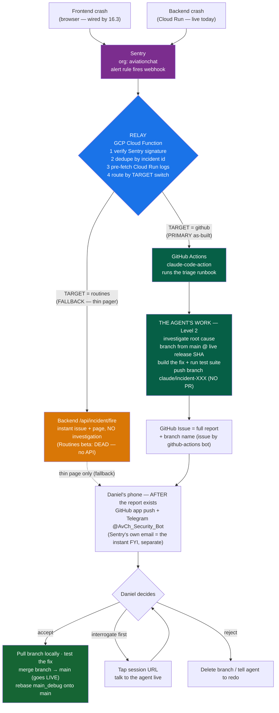
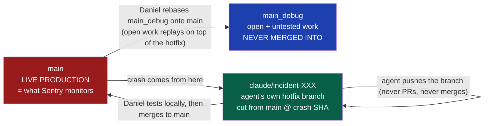
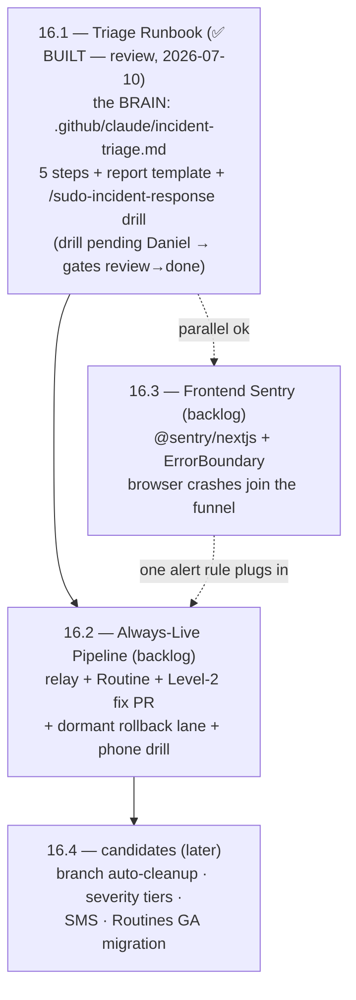

# Sentry Error-Response Team — visual overview & quick reference

> **What this is:** AviationChat's automated incident-response system (Epic 16). When production
> breaks — frontend or backend — a cloud Claude agent investigates, **builds the fix on its own
> hotfix branch**, and the full report lands on Daniel's phone. Accepting the fix = the standard
> hotfix flow: **pull the branch, test it locally, merge it into `main`, then rebase `main_debug`
> onto the released hotfix**. The investigation + build run with Daniel's desktop off; only the
> final test-merge-rebase is hands-on. `main_debug` (open, untested work) is **rebased, never
> merged into** — its unfinished work simply replays on top of the shipped fix.
>
> Designed + approved 2026-07-09. Stories: `Projects/AGY_AVIATIONCHAT/_bmad/bmm/stories/story-16-*.md` ·
> Decision record: `_artifacts/AGY_AVIATIONCHAT/2026-07-09_incident-response-story-draft/always-live-trigger-brainstorm.md`

---

## ⚠️ AS-BUILT UPDATE — 2026-07-12 (supersedes lane labels below)

**The Routines lane is dead.** Claude Routines is a claude.ai app feature with **no API to trigger
it** — nothing external can start a Routine, so the "primary" lane in the original diagrams cannot
exist. What was built in its place, and where each piece stands:

| Piece | Original plan | As-built reality |
|---|---|---|
| **Agent lane (the product)** | Routine runs the runbook | **GitHub Actions IS the primary** — `incident-response.yml` + `claude-code-action` runs the same `incident-triage.md` runbook: logs + code-at-SHA + `_artifacts` build history → full report issue + `claude/incident-*` fix branch. Trigger: relay `TARGET=github`. |
| **Fire endpoint** `/api/incident/fire` | (didn't exist) | Built as the Routines stand-in. **Demoted to fallback pager**: instant thin issue + page, no investigation. Use only if the Actions lane is down (`TARGET=routines`). |
| **Instant wake-up** | Sentry's native alert email | Unchanged — Sentry's own email fires regardless (rule "Notify sudomadhatter@gmail.com", fatal-only). **The pipeline must NOT page before the report exists** (Daniel, 2026-07-12). |
| **Report delivery** | GitHub issue → email + app push | Same, plus **Telegram** (bot `@AvCh_Security_Bot`) buzzes AFTER the agent finishes: error headline + report link + paste-prompt. Actions-lane issues come from `github-actions[bot]`, so GitHub app push works (self-created-PAT issues never notify). |
| **Session URL** ("interrogate the agent live") | Routine session link in the issue | **Not available** — an Actions run has logs, not a live session. Nearest equivalent: the issue's paste-prompt starts a fresh Claude Code session with full context. |
| **Loop guard** | (not in plan) | Added: the pipeline's own page events carry `incident_page=true`; the Sentry alert rule filters them out (prevents page→alert→fire loops). |
| **TARGET semantics** | `routines` primary / `github` rollback | **Inverted: `github` = primary (agent), `routines` = fallback (thin pager).** |

Verified live so far: relay → fire endpoint → issue + page + Telegram (thin lane, e2e ~16s).
The Actions agent lane is wired and on `main` but **needs repo Actions secrets
(`ANTHROPIC_API_KEY`, `SENTRY_AUTH_TOKEN`) and a live drill** — until that drill passes, treat
lane status as unproven.

---

## 1. The big picture — crash to merged fix

**The agent can NEVER push to `main`.** It only ever writes its own `claude/incident-*` branch;
going live is Daniel's deliberate local test → merge-to-`main` → rebase-`main_debug`, always.

---

## 2. One incident, step by step (the phone experience)

```mermaid
flowchart TD
    A["1 · AviationChat (live, main) throws a crash<br/>event carries stack trace + release SHA"]
    B["2 · Sentry receives it<br/>fires the 11.5 alert email (the wake-up) AND the webhook"]
    C["3 · Relay (GCP Fn)<br/>verify signature · dedupe · fetch ±15min logs"]
    D["4 · Relay fires the agent<br/>with issue id + log excerpt"]
    E["5 · Agent runs the triage runbook<br/>Sentry issue · logs · code path · build history IF struggling"]
    F["6 · Agent branches claude/incident-XXX from main @ live SHA<br/>builds fix · runs full test suite"]
    G["7 · Agent pushes the branch (NO PR)<br/>+ opens Issue 'incident' = full report + branch"]
    H["8 · Report lands on Daniel's phone — ONLY NOW<br/>GitHub app push + Telegram (Sentry email fired at step 2 as the FYI)"]
    I["9 · (optional) copy the issue's paste-prompt into Claude Code<br/>= fresh session with full context (no live session URL in the Actions lane)"]
    J["10 · Daniel pulls the branch locally<br/>tests the fix actually works"]
    K["11 · Daniel merges the branch into main → fix is live"]
    L["12 · Daniel rebases main_debug onto main<br/>open work replays on top of the hotfix"]

    A --> B --> C --> D --> E --> F --> G --> H --> I --> J --> K --> L

    style A fill:#7b2d8e,color:#fff
    style C fill:#1a73e8,color:#fff
    style F fill:#065f46,color:#fff
    style K fill:#166534,color:#fff
```

The incident lane **never merges into `main_debug`** — after the fix merges to `main`,
`main_debug` is *rebased* onto `main`, so its open untested work simply replays on top of the
shipped hotfix (the standard hotfix-branch sync, minus the textbook merge-into-dev).

---

## 3. Branch model — where the fix flows

✅ **The flow (Daniel, 2026-07-09) — standard hotfix pattern:** a **new hotfix branch** fixes the
problem → Daniel tests it → **merges it to `main`** (live) → **rebases `main_debug` onto `main`**.
`main_debug` (open, untested work) is only ever *rebased* — the hotfix is never merged *into* it,
so its unfinished work stays isolated and simply replays on top of the shipped fix. The agent only
ever writes its own `claude/incident-*` branch — it never PRs and never pushes to `main`, so the
standing "never PR to main" rule needs **no carve-out**; it holds as written. (Rebase assumes
`main_debug` is Daniel's to rewrite — force-push after, standard for a private integration branch.)

---

## 4. The build plan — Epic 16 story map

**Dev order:** 16.1 → 16.2, with 16.3 in parallel any time. Epic close-out live-QA = forced FE +
BE crashes → two full reports on the phone.

---

## 5. Quick reference

### Components & where they live

| Piece | Home | Job |
|---|---|---|
| Triage runbook | `.github/claude/incident-triage.md` (16.1 ✅ built) | The 5-step brain both lanes execute (preflight · guardrails · 5 steps · report template) |
| Relay | GCP Cloud Function `sentry-incident-relay`, project `aviationchat` (16.2 ✅ deployed) | Verify → dedupe → fetch logs → route |
| **Primary lane (as-built)** | `.github/workflows/incident-response.yml` (`TARGET=github`) | claude-code-action runs the runbook → full report + fix branch. Needs `ANTHROPIC_API_KEY` + `SENTRY_AUTH_TOKEN` Actions secrets |
| Fallback lane | Backend `/api/incident/fire` (`TARGET=routines`) | Thin instant pager (issue + Telegram + Sentry-fatal page), NO investigation. ~~Routines beta~~ dead — no API |
| Delivery | GitHub Issue `incident` (by github-actions bot) + ready `claude/incident-*` branch | Report → GitHub app push + Telegram, AFTER the agent finishes |
| Drill harness | `/sudo-incident-response [issue-id\|latest]` (16.1 ✅ shipped, vendored via `/sync-agents`) | Testing only — NOT the product. Thin command (zero triage logic): resolves the project → loads its `incident-triage.md` → runs it verbatim, **interactive lane** (Sentry MCP) → drops the report in `_artifacts/debugging/`. Drill = force a P1 (`_test_scripts/sentry_smoke_test.py`) then `/sudo-incident-response latest`. |

### Switches & secrets (names only — values never in repo)

| Name | Where | Does |
|---|---|---|
| `TARGET` = `github` (primary) \| `routines` (fallback pager) | relay env | **The lane switch** — one flip migrates lanes. As-built: `github` = agent, `routines` = thin pager |
| `INCIDENTS_PAUSED` | relay env | Kill switch for alert storms |
| `SENTRY_AUTH_TOKEN` | GH Actions secret + `backend/.env` vault | Headless Sentry reads (runbook Step 1) + rule management |
| `ANTHROPIC_API_KEY` | GH Actions secret + Cloud Run secret | Agent-lane billing (subscription tokens don't work in CI) + fire-endpoint quick summary |
| `TELEGRAM_BOT_TOKEN` / `TELEGRAM_CHAT_ID` | secrets/env (bot `@AvCh_Security_Bot`, chat 5556604669) | Phone-native page with report link + paste-prompt |
| Routine bearer + Sentry webhook secret | relay secrets | Trigger auth |

### Guardrails (non-negotiable)

- Agent **never PRs and never pushes to `main` or `main_debug`** — it writes only its own `claude/incident-*` branch. Going live is Daniel's local test → merge to `main` → rebase `main_debug`.
- Dedupe by Sentry short-id — one issue, one triage, ever.
- Real test output pasted in every PR; no secrets or PII in any report (user ids arrive pre-hashed).
- Rollback lane is **drilled**, not hoped for; Sentry's plain alert email keeps firing regardless.

### Decision log (Daniel, 2026-07-09)

| Decision | Call |
|---|---|
| Trigger | Webhook from day one — no polling phase |
| Runtime | ~~**Routines beta = primary** ("I trust the beta"); GH Actions built as drilled rollback~~ **superseded 2026-07-12 ↓** |
| Fix depth | **Level 2 from day one** — fix pre-built + tests run on a hotfix branch; accept = pull it, test, merge to `main`, then rebase `main_debug` onto it |
| Notification | GitHub issue only (email + app push) |
| Build-history lookup | Conditional — only when the agent is struggling |
| Branch | **New `claude/incident-*` hotfix branch fixes `main`** (live) → Daniel tests → merges to `main` → **rebases `main_debug` onto `main`**; `main_debug` (open untested work) is *rebased, never merged into* — no PR, no back-merge |

### Decision log addendum (Daniel, 2026-07-12)

| Decision | Call |
|---|---|
| Runtime | **GH Actions = primary** (Routines has no trigger API — lane dead). The fire endpoint built as its stand-in is demoted to fallback pager |
| Paging discipline | **Nothing pages Daniel until the agent's report exists.** Sentry's own alert email stays as the instant FYI — the pipeline must not duplicate it |
| Phone channel | **Telegram added** (`@AvCh_Security_Bot`) — buzzes with headline + report link + Claude paste-prompt after the report lands |
| Quick summary | The fire endpoint's one-call Claude "likely cause" paragraph is a fallback-lane garnish, **not** the report — the report is the runbook's output |

---

## 6. Replication playbook — stand this up on ANY project

> Every step below was executed live on AviationChat (2026-07-11/12). Gotchas are things that
> actually bit us, not theory. Budget: ~half a day the first time, ~2h once practiced.

### Ingredients

| # | Piece | You write it / you click it |
|---|---|---|
| 1 | **Triage runbook** — `.github/claude/incident-triage.md` | Write once, copy per project; only the Sentry org/project slugs and artifact paths change |
| 2 | **Agent workflow** — `.github/workflows/incident-response.yml` | Trigger `repository_dispatch: types: [incident]`; checkout `main` full-depth; `anthropics/claude-code-action` with the runbook as prompt; least-privilege `permissions:` (contents+issues write) |
| 3 | **Relay** — GCP Cloud Function (`relay/app.py` pure logic + `main.py` glue) | Verify HMAC → kill switch → dedupe by issue label → pre-fetch logs → route by `TARGET` |
| 4 | **Fallback pager** — backend `POST /api/incident/fire` | Optional but recommended: bearer-authed thin lane (issue + page) for when Actions is down |
| 5 | **Telegram bot** | BotFather `/newbot` → token; recipient must message the bot once → `getUpdates` yields chat_id |

### Setup order (dependencies flow downward)

1. **Sentry side** (org owner clicks): project exists + SDK wired (DSN). Then
   Settings → Developer Settings → **new INTERNAL integration**: webhook URL blank for now, all
   permissions No Access. Copy the **Client Secret** = the webhook HMAC key.
   ⚠️ **`isAlertable` gotcha:** the "Alert Rule Action" toggle silently stays OFF if the webhook
   URL is blank at creation. Flip it later via API: `PUT /api/0/sentry-apps/<slug>/ {"isAlertable": true}`.
2. **Auth token** for headless Sentry reads: user token, scopes `alerts:read/write, org:read, project:read`.
   ⚠️ Integration-platform endpoints live on **`sentry.io`** (control plane); project/rule endpoints
   on the **region host** (`us.sentry.io`). Mixing them = mystery 404s.
3. **Secrets** — GCP Secret Manager: `ROUTINE_BEARER_TOKEN`, `INCIDENT_GITHUB_TOKEN`,
   `SENTRY_WEBHOOK_SECRET` (+ `secretAccessor` grants to the runtime SA). GitHub Actions secrets:
   `ANTHROPIC_API_KEY`, `SENTRY_AUTH_TOKEN`. ⚠️ **The GitHub PAT needs `Contents: Read+Write`** —
   `repository_dispatch` requires write; read-only 403s exactly when the fallback lane fires.
4. **Deploy the relay** (gen2 function, `--allow-unauthenticated` — Sentry can't send OIDC; the
   HMAC check IS the auth). ⚠️ Backend and relay can live in **different regions** — `gcloud run
   services describe` in the wrong region reports "doesn't exist". ⚠️ Project-level IAM bindings
   need `--condition=None` non-interactively when the org policy has conditional bindings.
5. **Alert rule** (create via API if the org is on the new Monitors UI — the click path drifts):
   conditions first-seen OR regression, filters `level = fatal` **AND the loop guard:**
   `incident_page is not set`, action "notify via <integration>".
   ⚠️ **Loop guard is not optional**: the pipeline's own page is a fatal event in the same
   project — untagged, the rule re-fires the pipeline forever (fresh id per hop defeats dedupe).
   The pager must tag its capture (`incident_page=true`).
6. **Flip `TARGET=github`** on the relay → the agent lane is live.
7. **Wire "page AFTER report"**: the workflow's LAST step sends the Telegram/notify with the
   issue URL. Never page before the report exists — the platform's own alert email is the FYI.

### Drills (each proved something broken for us — run all four)

| Drill | Proves | Expected |
|---|---|---|
| `curl` relay with bad `Sentry-Hook-Signature` | HMAC guard | 401 |
| Authed POST to the fire endpoint | Fallback delivery | Labeled issue + page, `degraded:false` |
| Untagged test fatal via the DSN | Full chain incl. alert rule + loop guard | Report/issue appears, NO cascade |
| Manual `repository_dispatch` with a real issue id | **The agent lane itself** | Full report + `claude/incident-*` branch |

### Cross-platform gotchas (cost us real hours)

- GitHub **never push-notifies you for issues your own PAT creates** — agent-lane issues must come
  from `github-actions[bot]` (workflow `GITHUB_TOKEN`), or use Telegram.
- Windows shells mangle non-ASCII in `curl -d` JSON (em-dashes → 400 "error parsing body"). ASCII-only payloads.
- Test-suite guard: the pager code paths will FIRE REAL pages under pytest unless the suite
  force-unsets `TELEGRAM_*`/`ANTHROPIC_API_KEY` (autouse fixture).
- Sentry `LevelFilter` levels are python-logging numbers: **50 = fatal**, 40 = error.
- The runbook's `_artifacts`/story lookup must grep story ids under BOTH name forms (`8.23.2` and `8-23-2`).
