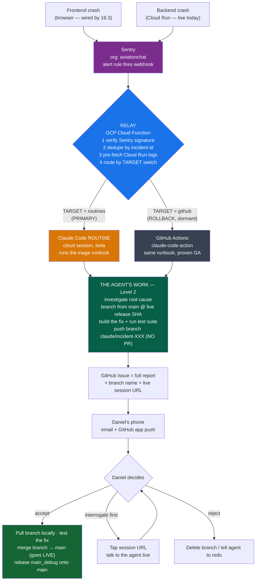
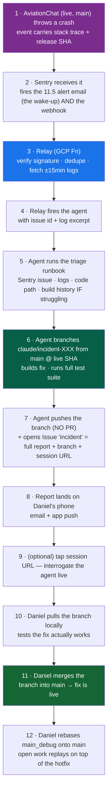
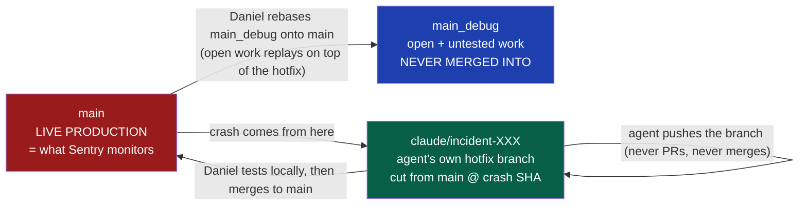
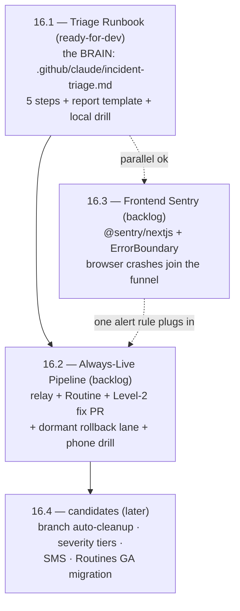

# Sentry Error-Response Team — visual overview & quick reference

> **What this is:** AviationChat's automated incident-response system (Epic 16). When production
> breaks — frontend or backend — a cloud Claude agent investigates, **builds the fix on its own
> hotfix branch**, and the full report lands on Daniel's phone. Accepting the fix = the standard
> hotfix flow: **pull the branch, test it locally, merge it into `main`, then rebase `main_debug`
> onto the released hotfix**. The investigation + build run with Daniel's desktop off; only the
> final test-merge-rebase is hands-on. `main_debug` (open, untested work) is **rebased, never
> merged into** — its unfinished work simply replays on top of the shipped fix.
>
> Designed + approved 2026-07-09. Stories: `Projects/AGY_AVIATIONCHAT/_bmad/bmm/stories/story-16-*.md` ·
> Decision record: `_artifacts/AGY_AVIATIONCHAT/2026-07-09_incident-response-story-draft/always-live-trigger-brainstorm.md`

---

## 1. The big picture — crash to merged fix

**The agent can NEVER push to `main`.** It only ever writes its own `claude/incident-*` branch;
going live is Daniel's deliberate local test → merge-to-`main` → rebase-`main_debug`, always.

---

## 2. One incident, step by step (the phone experience)

The incident lane **never merges into `main_debug`** — after the fix merges to `main`,
`main_debug` is *rebased* onto `main`, so its open untested work simply replays on top of the
shipped hotfix (the standard hotfix-branch sync, minus the textbook merge-into-dev).

---

## 3. Branch model — where the fix flows

✅ **The flow (Daniel, 2026-07-09) — standard hotfix pattern:** a **new hotfix branch** fixes the
problem → Daniel tests it → **merges it to `main`** (live) → **rebases `main_debug` onto `main`**.
`main_debug` (open, untested work) is only ever *rebased* — the hotfix is never merged *into* it,
so its unfinished work stays isolated and simply replays on top of the shipped fix. The agent only
ever writes its own `claude/incident-*` branch — it never PRs and never pushes to `main`, so the
standing "never PR to main" rule needs **no carve-out**; it holds as written. (Rebase assumes
`main_debug` is Daniel's to rewrite — force-push after, standard for a private integration branch.)

---

## 4. The build plan — Epic 16 story map

**Dev order:** 16.1 → 16.2, with 16.3 in parallel any time. Epic close-out live-QA = forced FE +
BE crashes → two full reports on the phone.

---

## 5. Quick reference

### Components & where they live

| Piece | Home | Job |
|---|---|---|
| Triage runbook | `.github/claude/incident-triage.md` (16.1) | The 5-step brain both lanes execute |
| Relay | GCP Cloud Function, project `aviationchat` (16.2) | Verify → dedupe → fetch logs → route |
| Primary lane | Claude Code **Routine** (beta) | Cloud agent session; live session URL bonus |
| Rollback lane | `.github/workflows/incident-response.yml` (dormant) | Proven GA path, same runbook |
| Delivery | GitHub Issue `incident` + ready `claude/incident-*` branch | Report + push + email to phone |
| Drill harness | `/sudo-incident-response` command | Testing only — NOT the product |

### Switches & secrets (names only — values never in repo)

| Name | Where | Does |
|---|---|---|
| `TARGET` = `routines` \| `github` | relay env | **The rollback**: one flip migrates lanes |
| `INCIDENTS_PAUSED` | relay env | Kill switch for alert storms |
| `SENTRY_AUTH_TOKEN` | secret | Headless Sentry reads + FE source maps |
| `ANTHROPIC_API_KEY` | GH secret | Fallback-lane billing (subscription tokens don't work in CI) |
| Routine bearer + Sentry webhook secret | relay secrets | Trigger auth |

### Guardrails (non-negotiable)

- Agent **never PRs and never pushes to `main` or `main_debug`** — it writes only its own `claude/incident-*` branch. Going live is Daniel's local test → merge to `main` → rebase `main_debug`.
- Dedupe by Sentry short-id — one issue, one triage, ever.
- Real test output pasted in every PR; no secrets or PII in any report (user ids arrive pre-hashed).
- Rollback lane is **drilled**, not hoped for; Sentry's plain alert email keeps firing regardless.

### Decision log (Daniel, 2026-07-09)

| Decision | Call |
|---|---|
| Trigger | Webhook from day one — no polling phase |
| Runtime | **Routines beta = primary** ("I trust the beta"); GH Actions built as drilled rollback |
| Fix depth | **Level 2 from day one** — fix pre-built + tests run on a hotfix branch; accept = pull it, test, merge to `main`, then rebase `main_debug` onto it |
| Notification | GitHub issue only (email + app push) |
| Build-history lookup | Conditional — only when the agent is struggling |
| Branch | **New `claude/incident-*` hotfix branch fixes `main`** (live) → Daniel tests → merges to `main` → **rebases `main_debug` onto `main`**; `main_debug` (open untested work) is *rebased, never merged into* — no PR, no back-merge |
