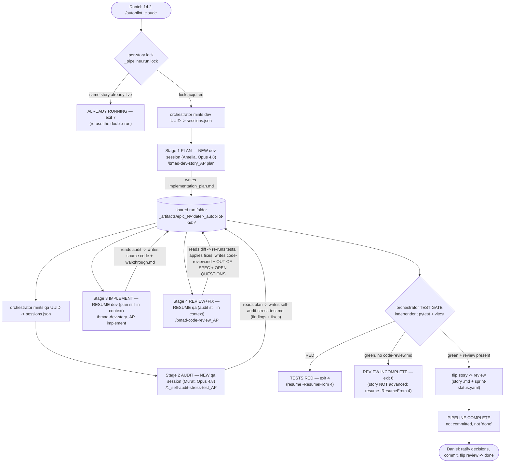
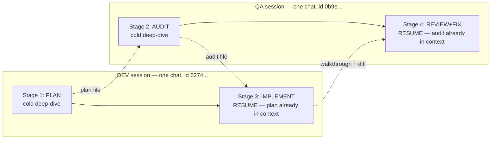
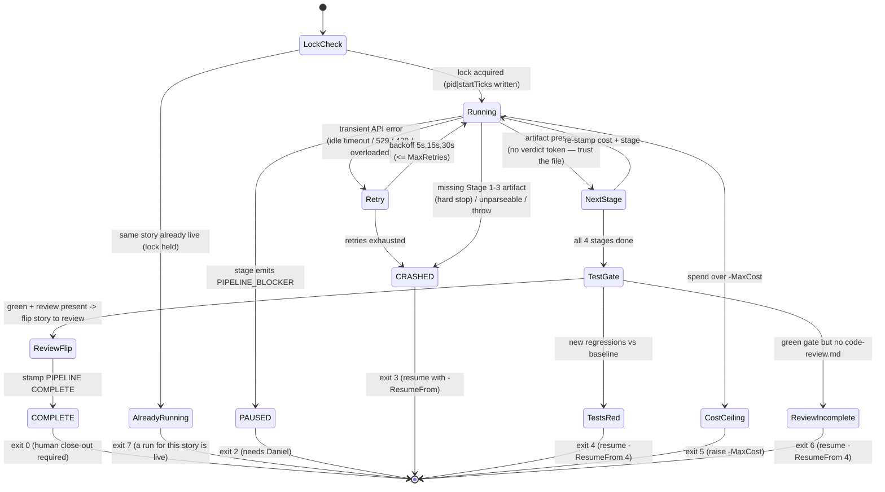
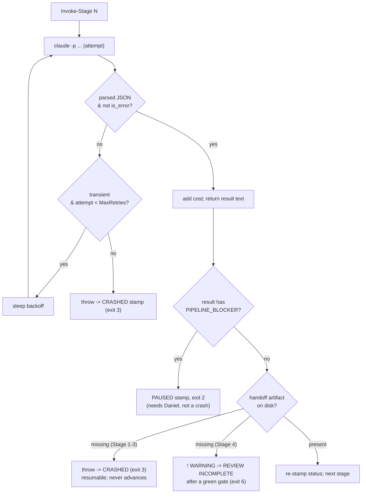
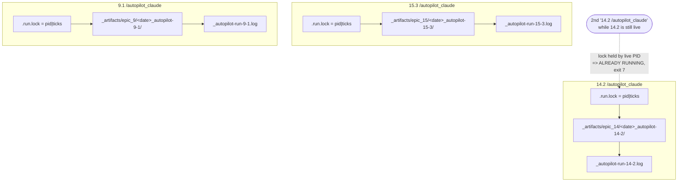

# Autopilot BMAD Dev Loop — Reference

> A one-command, fully-autonomous **dev + QA team** that takes a single BMAD story from
> `ready-for-dev` to *planned → audited → implemented → reviewed → self-fixed*, then hands the
> finished-but-uncommitted work back to Daniel for close-out.
>
> **Engine:** [`scripts/autopilot-dev-story.ps1`](../../scripts/autopilot-dev-story.ps1) ·
> **Trigger:** `<story> /autopilot_claude` ([`.claude/commands/autopilot_claude.md`](../../.claude/commands/autopilot_claude.md)) ·
> **Status:** v2, hardened — anchored matcher, evidence-gated (no verdict tokens), hard-stop artifact
> gate, dedicated `_AP` commands, independent test gate, auto story→`review`, and **concurrency-safe**
> (run as many stories at once as you want). Proven end-to-end on **Story 14.2** (full 4-stage run,
> $9.00, clean APPROVE, backend 1723 passed / frontend 270 passed); concurrency hardening landed
> 2026-06-27.

---

## 1. The one-paragraph mental model

It is a **relay race between two AI teammates who each stay in one chat.** A plain PowerShell
script (no LLM "coordinator" — that would just be tax) fires four headless `claude -p` subprocesses
in sequence. The **Dev** (Amelia, Opus 4.8) plans the story, then *resumes the same session* to
implement it. The **QA** (Murat, Opus 4.8) audits the plan *before any code exists*, then *resumes
the same session* to review the finished code, apply fixes itself, and write Daniel a report. The
two teams hand off through **files in one folder**, never by talking directly. After its own
independent test gate goes green, the script flips the story to `review` — but it **never commits
and never marks the story `done`**; that last mile is always human. Every run is keyed entirely by
its **story id**, so you can fire many at once and they never touch each other.

---

## 2. Why it exists (the problem it solves)

A normal "dev a story" chat is one model doing everything in one pass: it plans, codes, and grades
its own homework with no independent check. The autopilot splits that into a **four-eyes pipeline**
where an **independent reviewer session** (a fresh QA chat, Murat) checks the Dev's work twice —
once on the plan (cheap, before code is written) and once on the diff. The independence comes from a
*separate session + a different persona*, not from a stronger model: both default to **Opus 4.8**,
and the reviewer can be pinned to a stronger or different model via `-AuditModel` when a story
warrants it. The pre-code audit is the highest-leverage part: catching a flawed test assertion or an
unmount-order a11y bug in the *plan* costs nothing, whereas catching it after implementation costs a
red CI run and a rewrite. And because no agent grades its *own* output as the final word, the
orchestrator runs an **independent test gate** of its own after Stage 4 (§6) — it re-runs the suites
itself rather than trusting any pasted "tests green."

---

## 3. The four-stage relay

```
Stage 1  Plan        Dev/Amelia 4.8  NEW dev     /bmad-dev-story_AP plan       -> implementation_plan.md
Stage 2  Audit       QA /Murat  4.8  NEW qa      /1_self-audit-stress-test_AP  -> self-audit-stress-test.md
Stage 3  Implement   Dev/Amelia 4.8  RESUME dev  /bmad-dev-story_AP implement  -> code + walkthrough.md
Stage 4  Review+Fix  QA /Murat  4.8  RESUME qa   /bmad-code-review_AP          -> code-review.md + fixes
  then   TEST GATE   orchestrator (no LLM) re-runs pytest+vitest -> green: flip story to review -> Daniel
```

Each stage runs a dedicated headless **`_AP`** command (a lean, agent-to-agent variant of the
interactive BMAD skill, stripped of its "wait for a human" checkpoints). The orchestrator prompt is a
thin pointer: it names the `_AP` command + the shared folder + the story; the behaviour lives in the
command file. **A stage only counts as done when its handoff file lands on disk** — a missing
Stage 1–3 artifact halts the run hard (§6), so a corrupted stage never advances and burns spend on
empty downstream work.



**What each stage may and may not do:**

| Stage | Command invoked | May write | Must NOT |
|---|---|---|---|
| 1 Plan | `/bmad-dev-story_AP plan` | `implementation_plan.md`, `decisions-log.md` | touch source code |
| 2 Audit | `/1_self-audit-stress-test_AP` | `self-audit-stress-test.md`, `decisions-log.md` | hard-halt on findings (fixes flow to S3) |
| 3 Implement | `/bmad-dev-story_AP implement` | source, tests, `walkthrough.md` | re-plan; commit; touch story status |
| 4 Review+Fix | `/bmad-code-review_AP` | `code-review.md`, fixes, walkthrough sections | commit; touch story status / `sprint-status.yaml` (the **orchestrator** owns the `review` flip) |

### The Pre-Dev Audit (`/1_self-audit-stress-test`) Breakdown

The Stage 2 audit is an adversarial review of the `implementation_plan.md` *before any code is written*. It runs in five phases to catch flaws while fixing them costs nothing:

- **Phase 0 — Scope, Right-Size & AC Coverage:** Maps every Acceptance Criterion to a concrete plan step (catching unfulfilled ACs and scope creep). Right-sizes the audit (skip, light, full) based on the plan's complexity.
- **Phase 1 — Blast-Radius Trace:** Analyzes upstream setters and downstream readers that break if the target symbol changes. Checks for one-sided contract changes (e.g., backend event without frontend consumer) and reinvented utilities. Uses the GitNexus graph if available.
- **Phase 2 — Over-Engineering Gate (STRICT NO-GO):** Trips on unjustified abstractions, feature flags, generalizing for N=1, or new dependencies. Complexity must trace to a *current* AC; if it doesn't, the plan is flagged for cuts.
- **Phase 3 — Adversarial Scenarios / Pre-Mortem:** Assumes the shipped code silently corrupted user state and traces why. Evaluates edge cases: rehydration, timeout paths, concurrent events, missing auth, and type-union exhaustiveness.
- **Phase 4 — Verdict:** Renders `SAFE`, `NEEDS REVISION`, or `UNSAFE` per item. If revision is needed, the findings are baked directly into the plan/story file so the Dev agent (Stage 3) reads and implements the fixes in-context.

---

## 4. The two-session continuity (the v2 idea)

Each team does its **codebase deep-dive once**. v1 cold-started all five stages, so the QA reviewer
re-read the same files the QA auditor had already studied an hour earlier — pure re-derivation tax.
v2 keeps each team in **one persistent chat**:



**How it is wired:** the script owns the session ids. It mints a UUID for a team **at the moment
that team's first stage runs**, persists it to `_pipeline/sessions.json`, and passes
`--session-id <uuid> --name autopilot-<story>-<dev|qa>` on the first call, then `--resume <uuid>` on
the second. Because the ids are ours (not parsed out of the model's output), a crashed run is still
resumable — we just re-issue `--resume`.

> **Minting on-run, not up-front, is deliberate** (a collision fix — see §9). If both ids were
> generated once at startup, a forced redo (`-ResumeFrom 1`) would re-issue `--session-id` with an
> id that *already exists*, and the CLI's behaviour on a duplicate id is undocumented.

**The honest tradeoff (measured on 13.3):** resume buys *coherence and cache reuse*, not a
guaranteed per-stage cost drop. A resumed session re-sends its prior transcript as input on every
turn — billed, though at cheap cache-read rates. On 13.3 the Stage-4 resume read **676,763 tokens
from cache** against just 1,359 fresh input tokens: the continuity mechanism demonstrably worked,
but the resume *stages* were not individually cheaper than v1's cold stages (S3 was $2.41 vs a v1
cold implement ~$1.88). The win is quality + context fidelity; treat any cost savings as
story-dependent, not a law.

---

## 5. The tech stack

| Layer | What | Detail |
|---|---|---|
| **Orchestrator** | Windows PowerShell 5.1 | One script, no external deps. Plain control flow — the "coordinator" is `if`/`for`, not an LLM. |
| **Worker** | `claude` CLI (headless) | `claude -p <prompt> --model <id> --permission-mode bypassPermissions --output-format json` |
| **Continuity** | CLI session flags | `--session-id <uuid>` + `--name <label>` (first call) · `--resume <uuid>` (second call) |
| **Agents** | Dedicated headless **`_AP` commands** | Prompts invoke `/bmad-dev-story_AP plan`, `/1_self-audit-stress-test_AP`, `/bmad-dev-story_AP implement`, `/bmad-code-review_AP` (agent-tuned variants of the interactive BMAD skills). |
| **Models** | Opus 4.8 (Dev) · Opus 4.8 (QA) | Both default to `claude-opus-4-8`; independence is the *separate session + persona*, not a stronger model. Pin asymmetrically via `-DevModel` / `-AuditModel`. |
| **Test gate** | `pytest` + `vitest`, run by the script | After Stage 4 the orchestrator re-runs the suites itself (`-TestScope auto` derives backend/frontend from the baseline diff). It refuses to stamp COMPLETE on red. |
| **Handoff** | Artifact files | One canonical `_artifacts/epic_<epic>/<date>_autopilot-<id>/` folder; `_pipeline/` holds raw JSON + `sessions.json` + a self-contained `run.log` + the `.run.lock`. |
| **Concurrency** | Story-id keying | Per-story run folder, per-story monitoring log (`_artifacts/_autopilot-run-<id>.log`), and a per-story `.run.lock` — so N stories run fully in parallel and the **same** story can't double-run. |
| **Telemetry** | Parsed from result JSON | `.total_cost_usd`, `.num_turns`, `.is_error`, cache token counts. |

**The exact call** (from `Invoke-Stage`):

```powershell
$cargs = @('-p', $Prompt, '--model', $Model,
           '--permission-mode', 'bypassPermissions', '--output-format', 'json')
if ($SessionMode -eq 'New') { $cargs += @('--session-id', $SessionId, '--name', $SessionName) }
else                        { $cargs += @('--resume', $SessionId) }
$raw = $null | & $Claude @cargs 2>$null | Out-String   # empty stdin; drop PS stderr-wrapping
```

> **CLAUDE-ONLY.** This depends on the `claude` CLI's `-p`/session flags and cannot run under
> Gemini/opencode.
>
> The long `-p <prompt>` argument is also the one surface that can **truncate** when two headless
> runs launch near-simultaneously (see §9). The hard-stop artifact gate (§6) is the net that catches
> it: a truncated Stage 1 writes no plan, so the gate crashes the run cleanly instead of advancing.

---

## 6. Resilience model



Eight guarantees, each earned by a real incident:

1. **Transient errors retry before failing.** A regex classifies idle-timeout / overload / 429 /
   503 / 529 / generic API errors as transient and retries with `5s,15s,30s` backoff
   (`-MaxRetries`, default 3). A *non-transient* error (e.g. a bad model id) fails fast — no
   pointless retry.
2. **A crash is loud, never silent.** Any hard failure is caught and stamps
   `CRASHED - NOT FINISHED` into `_RUN-STATUS.md` (exit 3), which also carries the orchestrator PID
   for a liveness check. The status file *never* lies "IN PROGRESS" after the process dies.
3. **Mid-run status is accurate.** After every stage *and before the test gate* the script re-stamps
   `_RUN-STATUS.md` with the running cost + which phase is next, so "ask status" mid-run is truthful —
   including during the ~100s gate (this was a bug — see §9).
4. **Runs are resumable.** A stage counts as done iff its artifact exists on disk; the orchestrator
   auto-detects the first incomplete stage and skips the rest, reusing the saved session ids.
   `-ResumeFrom N` forces a start stage; `-DryRun` prints the whole resume plan for $0.
5. **Only a genuine blocker stops the flow mid-run — and it PAUSES, it doesn't crash.** Findings never
   halt the run (audit fixes flow into the next stage). The *only* mid-run stop is a stage emitting a
   `PIPELINE_BLOCKER:` line — reserved for contradictory ACs, a missing dependency, or a product call
   only a human can make. It stamps a *graceful* `PAUSED - NEEDS DANIEL` (exit 2), not a red crash.
6. **Evidence over tokens — but a missing artifact is a HARD STOP.** There is **no verdict-token gate**
   (the old `Assert-Verdict` crashed complete, tests-green stages over a missing phrase string; it was
   removed — trust the *file*, not a token). A stage is "done" iff its handoff artifact lands on disk.
   And a **missing Stage 1–3 artifact is a hard stop** (CRASHED, exit 3, resumable) — *not* a silent
   "continue to the next stage" — so a corrupted/truncated Stage 1 that writes no plan halts
   immediately instead of burning spend on empty downstream stages. **Stage 4 is the one exception:**
   a missing `code-review.md` is a soft warning at the stage, then — only if the independent gate is
   green — a dedicated check stamps **REVIEW INCOMPLETE** (exit 6) and *holds the story at its current
   status* (the code is provably green; only QA's written review is missing, so it's a "redo the
   review" state, not a crash). Re-run `-ResumeFrom 4`.
7. **The pipeline verifies green itself.** After Stage 4 the orchestrator re-runs the suites
   independently (`pytest` + `vitest`, scoped by `-TestScope`) rather than trusting the agents' pasted
   "tests green." It snapshots the pre-existing red tests *before* Stage 3 so the final gate fails only
   on **new** regressions this run introduced, not on already-broken tests. A red gate stamps
   `TESTS RED` (exit 4); only a green gate advances the story to `review` and stamps `COMPLETE`. (A
   missing runner stamps `TESTS UNVERIFIED` rather than a false green.)
8. **Concurrency-safe by story id (run as many at once as you want).** Each run is keyed entirely by
   its story id — its own folder, its own monitoring log, and a per-story `.run.lock` (PID + process
   start-ticks). Different stories run fully in parallel; a second launch of the **same** live story is
   refused (`ALREADY RUNNING`, exit 7). See §7.

**Per-stage runner logic:**



---

## 7. Running many stories at once (the concurrency model)

The whole design is keyed off **one thing: the story id** (`14.2` → normalized `14-2`). Nothing is
keyed off a chat name, a tab, or a global file — so two autopilots have nothing to collide on. You
fire each the way you always do: `<story> /autopilot_claude`.



Three things make this safe, and nothing more (the design was deliberately trimmed back to exactly
these — see §9):

- **Per-story run folder.** `_artifacts/epic_<epic>/<date>_autopilot-<id>/` — derived from the
  resolved story id. Each story's artifacts, `_pipeline/`, sessions, and stage logs live only here.
- **Per-story monitoring log.** `_artifacts/_autopilot-run-<id>.log` — the stable, known-up-front path
  the `/autopilot_claude` skill tails for live stage notifications. It's **per story**, so two runs
  streaming at once never cross-wire into one file. (The run folder also keeps a self-contained copy at
  `_pipeline/run.log`.)
- **Per-story lock.** `_pipeline/.run.lock` holds `"<pid>|<startTicks>"`. A second run of the **same**
  story refuses to start while that PID is alive (`exit 7`). The start-ticks defeat PID reuse — a dead
  orchestrator's recycled PID has a different start time, so a stale lock is reclaimed, never mistaken
  for "still live." **Different** stories never see each other's lock.

> **What this does and doesn't fix.** Story-keying guarantees runs don't cross-wire and the same story
> can't double-run. It does **not** cure the underlying CLI prompt-truncation race (§9) — that's below
> the level of anything we key by story. The hard-stop artifact gate (§6 #6) is the net for that: if a
> concurrent launch truncates a Stage-1 prompt, the run crashes clean and resumable, and a plain re-run
> almost always succeeds (the collision is intermittent).

---

## 8. The artifact handoff folder

Everything for a run lives in one place; the resumed agents read these files instead of
re-deriving:

```
_artifacts/epic_<epic>/<date>_autopilot-<id>/
├── implementation_plan.md        (Stage 1 — Dev)
├── self-audit-stress-test.md     (Stage 2 — QA, findings + proposed fixes)
├── walkthrough.md                (Stage 3 — Dev; Stage 4 prepends QA CLOSE-OUT to the TOP)
├── code-review.md                (Stage 4 — QA, the formal review artifact)
├── decisions-log.md              (any stage — every story-silent call the team made)
├── task-list.md                  (final task snapshot)
├── _RUN-STATUS.md                (live status: IN PROGRESS / TEST GATE / COMPLETE / PAUSED / TESTS RED / REVIEW INCOMPLETE / CRASHED; carries the orchestrator PID)
└── _pipeline/
    ├── sessions.json             ({"dev":"<uuid>","qa":"<uuid>"})
    ├── .run.lock                 ("<pid>|<startTicks>" — per-story double-run guard)
    ├── run.log                   (self-contained transcript — stage headers + each result + final banner)
    ├── stage{1..4}-*.json        (raw CLI result JSON per stage — cost, turns, etc.)
    └── gate-tests-*.txt          (independent test-gate output: backend / frontend)
```

> **The run is self-contained.** The live-tail monitoring log lives at the per-story path
> `_artifacts/_autopilot-run-<id>.log` (the stable path the `/autopilot_claude` skill tails), but the
> folder *also* keeps its own `_pipeline/run.log` copy — so opening just the run folder shows the whole
> story without hunting for the global log.

The artifact-presence map *is* the resume logic: `1=implementation_plan.md`,
`2=self-audit-stress-test.md`, `3=walkthrough.md`, `4=code-review.md`.

**QA owns the last mile.** Because Stage 4 is the final agent before the human, it writes two
spotlight sections at the **top** of `walkthrough.md`:

- `## OUT-OF-SPEC DECISIONS (QA judgment calls - your review)` — every call the team made that the
  story didn't cover, so Daniel can ratify or reverse.
- `## OPEN QUESTIONS FOR DANIEL` — anything the team genuinely couldn't resolve. The agent is
  explicitly *allowed to ask* here rather than forcing everything into a blocker.

---

## 9. Things we discovered building it (the war stories)

Each of these is a real bug or insight from the shakedown runs, now baked into the design:

- **A polished artifact is not a finished story.** A plan or a half-written walkthrough *reads* as
  done. The pipeline therefore makes incompleteness loud (`_RUN-STATUS.md` markers) and never relies
  on the *absence* of a signal to mean "not done." (See the project rule `completion-not-illusion`.)

- **TUNING-1 — stale mid-run status.** v1 only wrote `_RUN-STATUS.md` at start/halt/crash/end, so
  "ask status" mid-run showed `$0.00` and no current stage. Fix: re-stamp after every stage with the
  running cost. Confirmed live on 13.3 (`$1.26` after Stage 1).

- **Session-id collision (caught by a forced-failure test).** Generating both UUIDs up front meant a
  forced redo re-issued `--session-id` with an already-existing id. Fix: **mint on-run** — generate
  the id when its stage actually runs, persist then. A forced redo now gets a clean id.

- **The "exit -1 / stuck IN PROGRESS" red herring.** A crash test once looked like the script hung.
  Root cause was the *test harness*: piping the child through `Select-Object -First 1` closed its
  stdout early and killed it mid-`catch`. The script was fine; the *measurement* was wrong. Lesson:
  consume a child process's full output before judging it.

- **UTF-8 mojibake in captured stdout (TUNING-2).** PowerShell captured the CLI's UTF-8 as cp1252,
  turning em-dashes into `ΓÇö` in the saved JSON. Fix: set `[Console]::OutputEncoding = UTF8` before
  the calls. (Handoff was always safe — it goes through files the model writes, not the captured
  string — but the saved JSON now reads cleanly.)

- **PowerShell scripts must be pure ASCII.** PS 5.1 reads a UTF-8-no-BOM file as ANSI, so a smart
  quote or em-dash in the *script* breaks parsing. Every edit is gated on a 0-non-ASCII + 0-parse-
  error check.

- **Continuity is a cost *tradeoff*, not a free win.** Resume re-sends the prior transcript as
  billed input. The payoff is coherence + cache-cheap context reuse (676K cache-read tokens on
  13.3's Stage 4), not necessarily a cheaper stage. State the win honestly.

- **Agents drop "boring" bookkeeping on a clean pass (the Stage-4 hard-gate bug).** On 13.3, QA did
  everything substantive right but, finding *no fixes needed*, folded its review into `walkthrough.md`
  and **skipped the standalone `code-review.md`** (plus the 4.8 commit attribution and the verdict
  line). The artifact gate correctly stamped `CRASHED`. Root cause: the prompt buried "write
  code-review.md" as one of eight numbered steps. **Fix:** restructure the Stage-4 prompt into
  *review WORK* + a loud **"REQUIRED OUTPUT FILES — this stage FAILS if any is missing"** block that
  demands `code-review.md` *even on a clean review*. General lesson: **separate the judgment work
  from the mechanical deliverables and make the deliverables un-collapsible.**

- **Don't tell a resumed agent "don't re-research."** Early drafts of the team preamble said "you
  already analyzed this, don't re-investigate." That's a quality threat — the agent can over-read it
  and skip *new* investigation it genuinely needs. Continuity is mechanical (the context is already
  there); the prompt only frames it as a *convenience, never a restriction*. (Memory:
  `continuity-prompts-no-research-suppression`.)

- **The audit pays for itself.** On 13.3 the pre-code audit caught (a) a coverage gap where tests
  asserted the callback but never the user-visible "WE'RE LIVE" + Sign-In that the AC names, and
  (b) an a11y live-region placed inside a component that *unmounts at the exact moment* it should
  announce. Both were fixed before a line of code existed.

- **The story-id matcher collided `14.1` with `14.10` (R1).** The unanchored `*14-1*` glob matched
  both `story-14-1-…` and `story-14-10-…`. Fix: dash-normalize *both* the id and each filename, then
  boundary-match `(^|-)<id>(-|$)`. The folder slug is now derived from the **resolved story id**, so it
  is always the clean `…_autopilot-14-2` (the old code slugified the whole *path* →
  `…_autopilot-bmad-bmm-stories-story-14-1-…-md`).

- **The verdict-token gate crashed complete, tests-green work (R1 — the reason §6 #6 exists).**
  The old `Assert-Verdict` demanded a literal `PIPELINE_*_OK` string; a stage that did everything right
  but phrased its verdict in natural language got stamped CRASHED. Removed entirely — a stage is done
  iff its artifact is on disk. The first principle: **trust the artifacts, not a token.**

- **…but "trust the artifact" still means the artifact must EXIST (the hard-stop reversal).** We
  briefly relaxed a *missing* handoff artifact to a mere warning. The concurrency shakedown reversed
  that for Stages 1–3: a truncated Stage 1 that writes no `implementation_plan.md` must **not** advance
  and pay for empty downstream stages — so a missing Stage 1–3 artifact is now a **hard stop**
  (CRASHED, exit 3, resumable). Stage 4 keeps the soft path because the independent gate already proved
  the code green; a missing `code-review.md` there becomes **REVIEW INCOMPLETE** (exit 6), which holds
  the story instead of crashing. Form follows substance *except* when the substance itself is missing.

- **The real root cause of the concurrent-run failure: the CLI truncates a long `-p` prompt under
  load.** Two autopilots launched near-simultaneously and one run's Stage-1 prompt arrived **cut off
  mid-sentence** — the agent never saw its task and produced no plan. We first suspected the runs were
  racing on the shared `~/.claude` session store and built a per-story `CLAUDE_CONFIG_DIR` isolation
  (copying auth/trust into a temp dir per story). **It did not fix the truncation** — the cut happens
  in the CLI's handling of the long `-p <arg>` itself, below the level of session/config isolation — so
  that complexity was **removed** as over-engineering (it also copied the OAuth token around and hid the
  worker chats for no proven benefit). What actually makes concurrency safe is the cheap, story-keyed
  set: **per-story log + per-story lock + the hard-stop gate** that catches the truncated stage cleanly.
  A plain re-run of the crashed story almost always succeeds (the collision is intermittent).

- **A bare PID is an unsafe lock (PID reuse).** A first cut of the per-story lock stored just the
  orchestrator PID; the OS recycles a dead run's PID for an unrelated process, which would make a stale
  lock look "alive" and **falsely refuse a legitimate re-run**. Fix: the lock stores
  `"<pid>|<startTicks>"` — a reused PID has a different process start time, so a stale lock is reclaimed
  instead of trusted.

- **A self-healing diagnostic write (don't crash a good stage over a log file).** A headless agent once
  ran a `git clean`-style command mid-stage that wiped the untracked `_pipeline/` dir; the next
  diagnostic `WriteAllText` then threw and killed an otherwise-successful, already-paid-for stage. Fix:
  the stage-log write recreates the dir if it vanished and is wrapped non-fatally — the artifact-presence
  gate is what decides pass/fail, never a diagnostic write.

- **The folder-vs-log split sent the human to the wrong directory (R2).** The live transcript lived
  OUTSIDE the run folder; mid-run, a *parallel team's* folder changed and read as the autopilot's
  output. Fix: mirror the transcript into `_pipeline/run.log` so the run folder is self-contained, and
  make the global monitoring log **per-story** so concurrent runs never share one stream.

- **The ~100s "silent gap" at the test gate (R2).** Between Stage 4 and COMPLETE the gate runs both
  suites with almost no output — it looked hung, and `_RUN-STATUS.md` read a stage stale. Fix: a
  pre-gate `IN PROGRESS - TEST GATE` re-stamp + the monitor now streams the `>>> TEST GATE` heartbeat.
  (Bonus: a bare `WARNING` monitor token false-fired on pytest's `DeprecationWarning`; anchored it to
  the script's own `! WARNING` prefix.)

- **The pipeline left the story at `ready-for-dev` — the human had to flip it (R2).** On the 14.2 run,
  close-out meant manually setting the story to `review`. That *is* the BMAD "Dev finishes → review"
  step, so the orchestrator now does it on a green gate: flips the story to `review` in BOTH the `.md`
  and `sprint-status.yaml` — idempotent (only `ready-for-dev`/`in-progress` advance), **never `done`**
  (the human owns `review → done`), best-effort (a flip hiccup warns, never crashes a finished run).

- **The full pipeline is proven end-to-end (Story 14.2, 2026-06-24).** All four stages + the
  independent gate ran clean: **$9.00**, verdict APPROVE, backend **1723 passed** / frontend **270
  passed**. The team caught a **stale story premise** (an AC claimed a prior story had removed the last
  V1 dossier caller — it hadn't; the Admin Socratic-grader still wrote it) and adjudicated
  *delete-not-migrate*, logging it to `decisions-log.md`. That is the four-eyes value in one run:
  the plan questioned a wrong premise instead of blindly executing it.

---

## 10. How to run it

```powershell
# Full run
.\scripts\autopilot-dev-story.ps1 -Story 13.4

# See the resume plan + session ids, spend nothing
.\scripts\autopilot-dev-story.ps1 -Story 13.4 -DryRun

# Cheap trial: plan + audit only (stop after Stage 2)
.\scripts\autopilot-dev-story.ps1 -Story 13.4 -MaxStage 2

# Re-run only the review+fix leg (resumes the qa session)
.\scripts\autopilot-dev-story.ps1 -Story 13.4 -ResumeFrom 4
```

Or trigger via the slash command: **`13.4 /autopilot_claude`** (state the story, then the command).
Fire as many at once as you like — each is keyed by its story id and runs independently (§7).

| Parameter | Default | Purpose |
|---|---|---|
| `-Story` | (required) | `"14.2"` or a path to the story `.md` |
| `-DevModel` | `claude-opus-4-8` | model for Stages 1 & 3 (Dev) |
| `-AuditModel` | `claude-opus-4-8` | model for Stages 2 & 4 (QA) |
| `-MaxStage` | `4` | stop after this stage (1–4) |
| `-ResumeFrom` | `0` (auto) | force a start stage (1–4) |
| `-MaxRetries` | `3` | transient-error attempts per stage |
| `-MaxCost` | `30` | $ ceiling; halts if spend crosses it (`0` disables) |
| `-TestScope` | `auto` | independent gate: `auto` (from baseline diff) / `backend` / `frontend` / `both` / `none` |
| `-DryRun` | off | print the plan + sessions, no spend |

**Exit codes:** `0` complete · `2` paused on a blocker · `3` crashed (resume with `-ResumeFrom`) ·
`4` test gate red (resume `-ResumeFrom 4`) · `5` cost ceiling hit (raise `-MaxCost`) · `6` review
incomplete — green gate but no `code-review.md` (resume `-ResumeFrom 4`) · `7` already running — a
run for this **same** story is live (the per-story lock refused a double-run).

---

## 11. The human close-out (always required)

The pipeline stops at "developed + reviewed + fixed, gate-verified green, story advanced to
`review`." On a green gate it **does** flip the story to `review` (both the story `.md` and
`sprint-status.yaml`). But it deliberately does **not**:

- run `git commit` / `git push`,
- mark the story `done`, or
- make the judgment calls on the team's out-of-spec decisions.

Daniel's close-out: read the **QA CLOSE-OUT** + **OUT-OF-SPEC DECISIONS** + **OPEN QUESTIONS FOR
DANIEL** at the top of `walkthrough.md`, ratify (or reverse) the team's story-silent calls, run
`/update-sprint-context`, run the git command from the walkthrough's "Your Actions," and flip
`review → done`. That last mile is the point — the autopilot does the labor and parks the story at
`review`; the human owns the judgment, the `done` flip, and the commit.

---

## 12. What is NOT yet proven

- **The retry *loop* firing live.** The backoff path is verified by code inspection + a regex
  classification test, but no real transient failure has been forced on demand (a bad model id is
  correctly *non-transient*, so it never enters the loop).
- **The concurrent prompt-truncation race is caught, not cured.** The hard-stop gate (§6 #6)
  demonstrably catches a truncated Stage 1 (it crashed cleanly and resumed on a re-run), and the
  per-story log/lock keep parallel runs from cross-wiring. But the truncation itself is intermittent
  and lives in the CLI, so it can still cost an occasional crash-and-resume on heavy concurrency. The
  net is reliable; the underlying race is not eliminated.

**Now proven (previously open):** the full four-stage relay **and** the independent test gate ran
end-to-end on **Story 14.2** — including the Stage-4 "required `code-review.md` even on a clean review"
gate (Stage 4 produced `code-review.md` on a clean APPROVE and stamped `PIPELINE COMPLETE`), the `_AP`
headless command expansion, and the anchored matcher / clean folder slug. The story→`review` auto-flip
is deterministic PowerShell (idempotent, comment-preserving, no `14-2`/`14-20` prefix collision),
verified at $0 and exercised on real runs (`>>> STORY STATUS - … flipped to review`).

---

*Source of truth is always the script + `.claude/commands/autopilot_claude.md`. This doc is the map, not
the territory — if they disagree, the script wins.*
