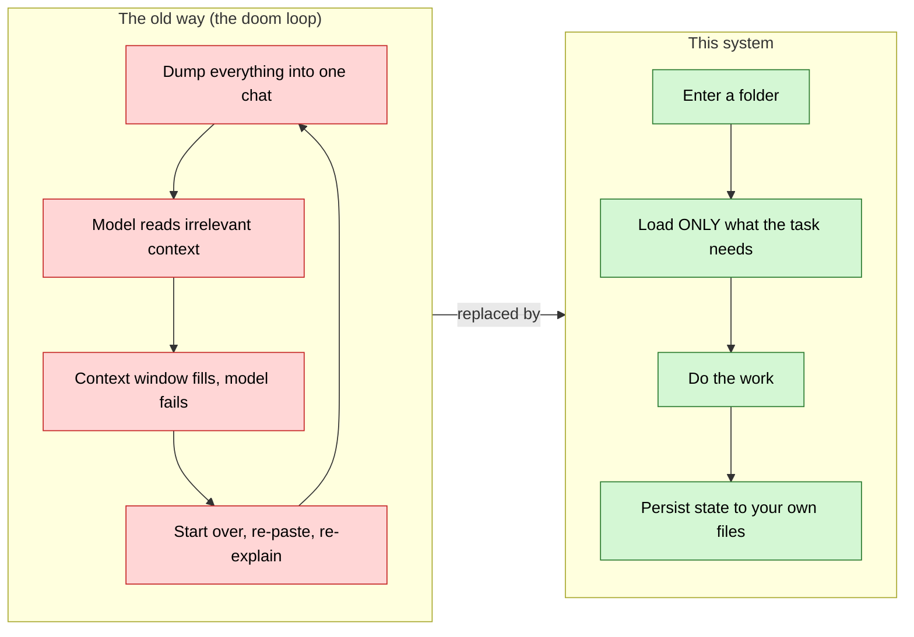
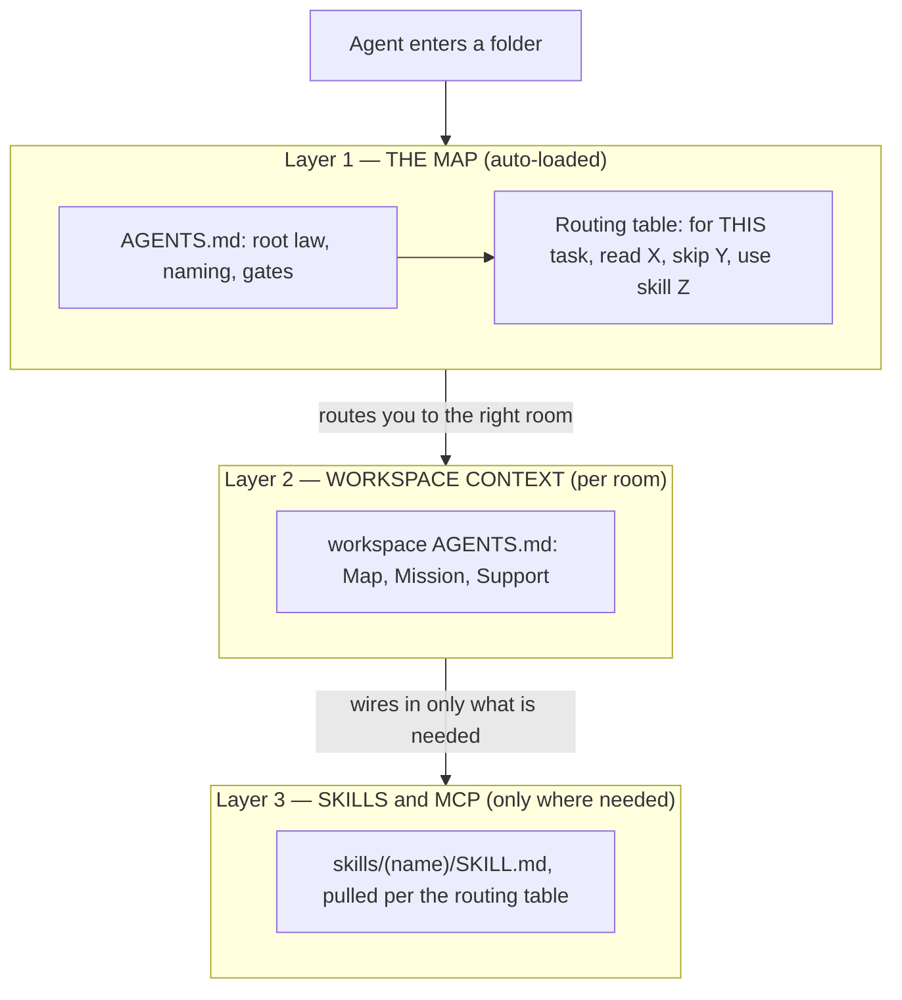
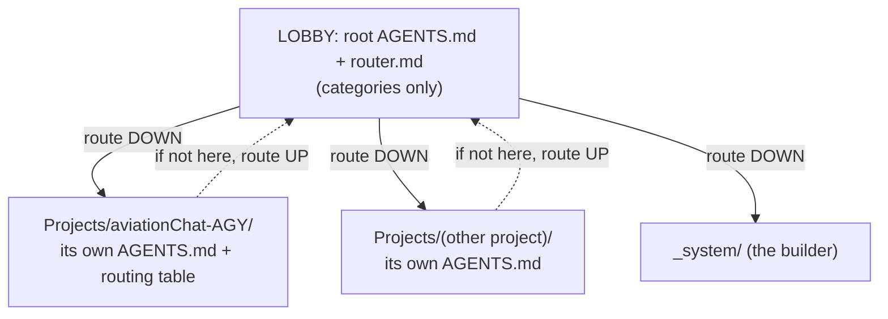
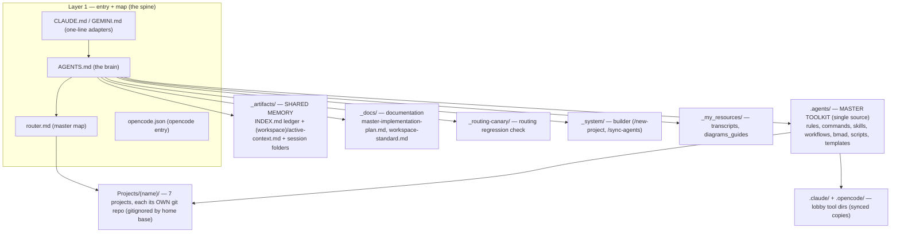
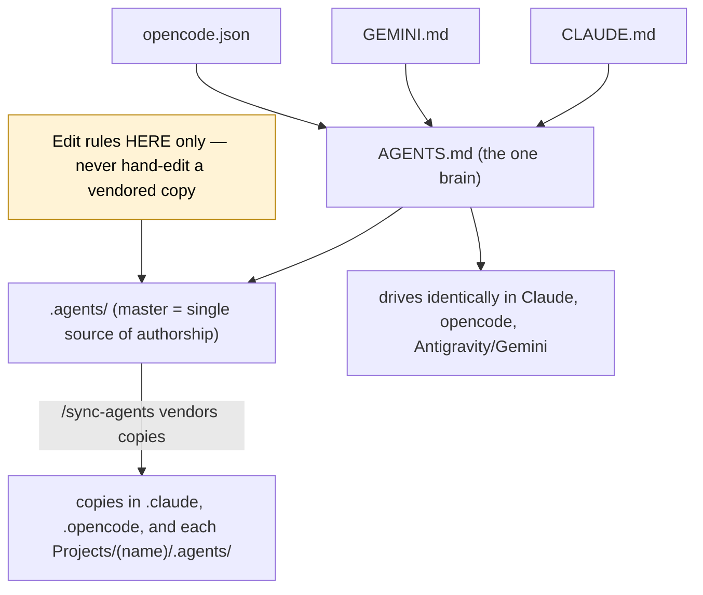
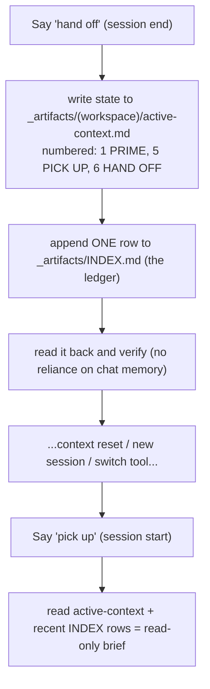
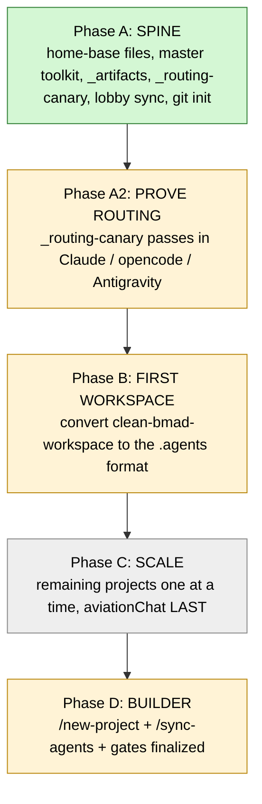

# Sudo_Hatter_Command — Complete System Overview

> **What this is.** The full breakdown of the system we are building: the folder-as-workspace routing
> system. Synthesized from `_docs/master-implementation-plan.md` (the rollout) and
> `_docs/workspace-standard.md` (the standard). Read top to bottom once and you'll understand the whole thing.
> For *only what changed on 2026-06-24*, see `updated_folder_file_structure_diagram.md` in this folder.

---

## 1. The one idea

Stop building apps and bespoke agents. Build a navigable folder-and-markdown system that routes the AI to
exactly the context a task needs — nothing more. The **folder is the app**, markdown is the program, and the
same model *becomes* whatever agent the current workspace describes. Your memory lives in **your** files, so
the system is portable across Claude, opencode, and Antigravity/Gemini, and you are not locked to any vendor.



**Five principles that drive everything:** least-context loading, the map is the single source of truth,
natural-language routing, persistence by convention (you own it), portability over lock-in.

---

## 2. The three layers (progressive loading)

An agent only ever loads down to the layer the task needs. This is how token waste is avoided.



**Map / Mission / Support** — the three answers every agent needs to never be lost: *Map* (where am I, where
can I go), *Mission* (what is the work here), *Support* (what tools/skills/context to load).

---

## 3. Routing: lobby, floors, and routing UP

The root is the **lobby**; each project is a **floor** with its own directory. The lobby lists categories
only — detail lives on the floor. Routers route **up** as well as down, so an agent can never dead-end.



---

## 4. Full home-base anatomy (what lives where)



---

## 5. Portability + single source of authorship

One brain, many front doors. Rules are authored in ONE place and vendored everywhere, so nothing drifts.



---

## 6. Memory you own (persistence)

State lives on disk in `_artifacts/`, not in a vendor's chat memory. Two codewords drive it.



**Artifact organization:** random task -> `_artifacts/(workspace)/(YYYY-MM-DD)_(slug)/`; story ->
`_artifacts/(workspace)/(epic)/(story)/` (epic folder houses its stories — create it if missing). Bucket =
decided by **where you work FROM** (your cwd): the project's bucket for project work, `_main` for
home-base/cross-project work. opencode mirrors the same rules under `_artifacts/opencode/`.

---

## 7. The operating disciplines (the gates)

These are the rules that keep work safe and reviewable. All authored in `.agents/rules/`.

| Discipline | Rule | One-line summary |
|---|---|---|
| Plan-first | `artifacts-always-first.md` | No file edits without an approved `implementation_plan.md`; STOP for "approved." |
| Git | `git-policy.md` | Never commit/push yourself — hand Daniel the command, unless he delegates it. |
| Hard stops + gates | `constitution.md` | Routing gate, risk gate, ask-first list. |
| How to work | `karpathy-guidelines.md` | Think first, simplicity, surgical changes, verify with evidence. |
| Workspace shape + upkeep | `_docs/workspace-standard.md` | How to format a workspace and keep it healthy. |
| Navigation index | repo-map (Part below) | Folder-level map every harness reads first. |
| Routing health | `_routing-canary/` | Re-run after routing changes or to qualify a new tool. |

---

## 8. Subsystems

- **Repo-map hybrid** (`.agents/scripts/generate_repo_map.py`): each workspace's `docs/repo-map.md` has a
  hand-curated header (never overwritten) plus an auto body that emits code signatures and collapses big data
  dirs to one line. A SessionStart hook injects it and flags drift (detect-only).
- **BMAD**: the agile agent suite (analyst, PM, architect, dev, QA, etc.) installed as **skills** under
  `.agents/skills/bmad-*`, pulled per a workspace's routing table — not global.
- **Autopilot** (`.agents/scripts/autopilot-dev-story.ps1`): a Claude-only autonomous dev/QA loop. Engine stays
  Claude/Opus; the loop doc is shared so any session can trigger it. (Has a pending `_claude_artifacts/` path
  cleanup on the retire-list.)

---

## 9. The rollout — where we are



**Status (2026-06-24):** Phase A complete and the day-restructure done (7 projects moved under `Projects/`,
paths fixed, home-base repo pushed). The Workspace Standard, repo-map hybrid, unified git policy, and lobby
artifacts parity all landed this session (home-base portion). clean-bmad-workspace has been converted to the
`.agents` format (Phase B in progress). It is **Daniel's own clean-shell template** — the project he clones to start a new one — not another team's and not off-limits.
Pending: cross-LLM canary runs (opencode + Antigravity), scaling to the rest, and finishing the builder/gates.

---

## 10. Glossary (the vocabulary)

| Term | Means |
|---|---|
| **Lobby** | The home base root — you start here, route out from here. |
| **Floor / workspace** | A project under `Projects/(name)/`, with its own AGENTS.md and git repo. |
| **Adapter** | The one-line `CLAUDE.md` / `GEMINI.md` that just says "read AGENTS.md." |
| **The brain** | `AGENTS.md` — the single source of behavior for a folder. |
| **Routing table** | The task -> read/skip/skills table inside an AGENTS.md (the heart of the system). |
| **Master toolkit** | `.agents/` — the one place rules/commands/skills are authored. |
| **Vendored copy** | A synced copy of the master in a tool dir or project (never hand-edited). |
| **Shared memory** | `_artifacts/` — the ledger + per-workspace continuity you own. |
| **Canary** | `_routing-canary/` — the smallest test that proves routing works in a tool. |
| **Pick up / Hand off** | Codewords to load / save state from `_artifacts/`. |
```
