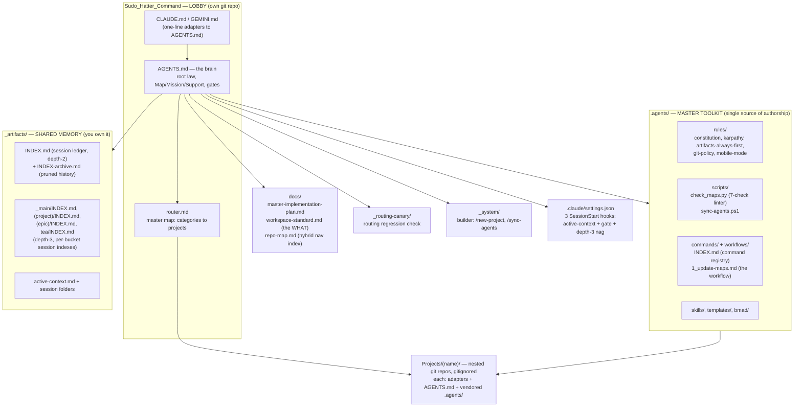
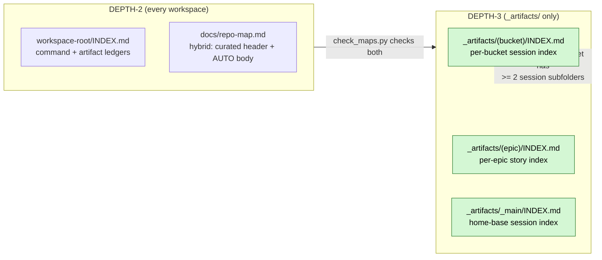
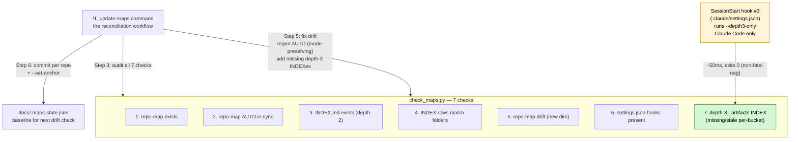
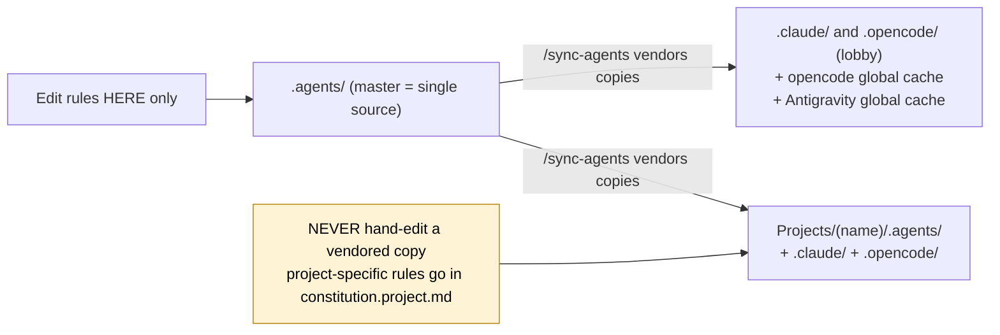
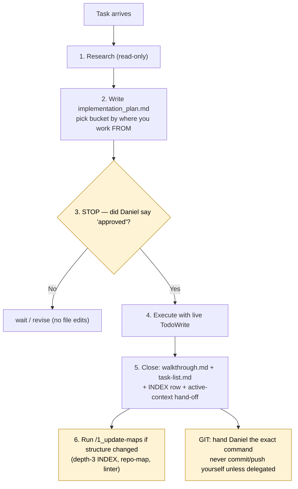
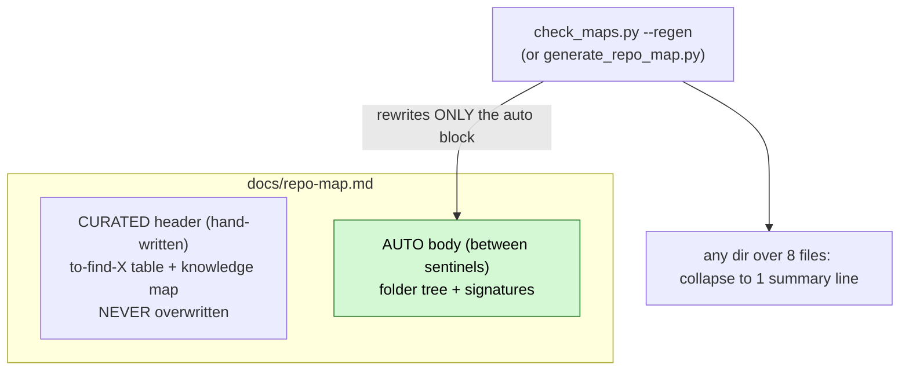

# File & Folder Structure + Maintaining — System Quick Reference

> **What this is.** A one-look reference to the home-base system: what lives where, and how it stays
> honest. This is the living current-state doc (not a session changelog). Full detail lives in
> `docs/workspace-standard.md` (the WHAT) and `.agents/workflows/1_update-maps.md` (the HOW).

---

## 1. The home base at a glance (what lives where)

---

## 2. The two-layer structure contract (depth-2 + depth-3)

**Why depth-3 only for `_artifacts/`:** session folders are content-rich (bug-tracking history, story
context). Code dirs use GitNexus + the repo-map AUTO block instead — a depth-3 INDEX there would just
duplicate what the graph already indexes.

**Bucket rule (decided by where you work FROM):**
- Project work → `_artifacts/(project-folder-name)/` (e.g. `_artifacts/AGY_AVIATIONCHAT/`)
- Main / home-base / cross-project → `_artifacts/_main/`
- Stories → nest under the parent epic folder: `(epic)/(story)/`
- opencode → mirror under `opencode/` (e.g. `_artifacts/opencode/_main/`)

---

## 3. The maintaining system (how it stays honest)

Three pieces work together: the **linter** (detect), the **workflow** (reconcile), and the
**SessionStart hook** (nag).

### check_maps.py flags

| Flag | What it does |
|---|---|
| `--all` | Run all 7 checks across all conformant workspaces |
| `--depth3-only` | Run ONLY check 7 (depth-3 INDEX); exits 0 always — for SessionStart nag |
| `--set-anchor` | Write current state to `docs/.maps-state.json` (run AFTER committing) |
| `--ignore <dirs>` | Skip dirs (lobby: `Projects,_my_resources`; projects: `_my_resources,_bmad`) |

### The three SessionStart hooks (Claude Code only)

| # | Hook | What it does |
|---|---|---|
| 1 | active-context injection | Reads the workspace's `active-context.md` into session context |
| 2 | plan-first gate | Enforces the artifacts-always-first gate |
| 3 | depth-3 nag | Runs `check_maps.py --depth3-only` — surfaces drift without blocking |

> **Platform note:** hooks fire only on Claude Code (desktop + web/mobile). opencode and Antigravity/Gemini
> don't have a SessionStart hook system — they get the full linter when you run `/1_update-maps` manually.

---

## 4. One rule set, one source (the anti-drift model)

**The propagation loop:** edit master `.agents/` → run `/sync-agents` (or `/sync-agents <project>`)
→ byte-identical copies land in all three platforms + both projects. `check_maps.py` is synced the
same way.

---

## 5. The plan-first + git lifecycle (how every task runs)

---

## 6. The repo-map hybrid (how the navigation index stays honest)

**Modes (mode-preserving regen):**
- `content` — curated header + AUTO body (lobby, AGY)
- `auto` — fully generated (Fresh_Workspace_BMAD)

---

## 7. Workspace status (which repos are conformant)

| Workspace | Conformant? | repo-map mode | Notes |
|---|---|---|---|
| Lobby (home base) | ✅ Yes | `content` | ignore `Projects,_my_resources` |
| AGY_AVIATIONCHAT | ✅ Yes | `content` | ignore `_my_resources,_bmad`; has project-specific rules in `constitution.project.md` |
| Fresh_Workspace_BMAD | ✅ Yes | `auto` | ignore `_my_resources,_bmad` |
| Ingestion_pipeline_AvCh | ❌ No | — | needs `/new-project` or manual standardization |

---

## 8. Quick-reference: key files

| Path | What it is |
|---|---|
| `docs/workspace-standard.md` | The WHAT — structure contract (PATH CONTRACT table, depth-3 rule, end-of-task checklist) |
| `.agents/workflows/1_update-maps.md` | The HOW — 7-step reconciliation workflow (audit → fix → commit → anchor) |
| `.agents/scripts/check_maps.py` | The linter — 7 checks + `--depth3-only` + `--set-anchor` |
| `.agents/scripts/sync-agents.ps1` | The propagator — mirrors master `.agents/` to all platforms + projects |
| `docs/repo-map.md` | Hybrid nav index (curated header + AUTO body) — per workspace |
| `_artifacts/INDEX.md` | Depth-2 session ledger — per workspace |
| `_artifacts/(bucket)/INDEX.md` | Depth-3 per-bucket session index — created when bucket has >= 2 session subfolders |
| `.claude/settings.json` | 3 SessionStart hooks (active-context + gate + depth-3 nag) — Claude Code only |
| `docs/.maps-state.json` | Drift baseline anchor — set via `--set-anchor` after committing |

**Git policy (locked):** never run `git commit`/`push` yourself — hand Daniel the exact command. The only
exception: Daniel explicitly delegates that specific commit/push in the moment. (Web/mobile sessions:
agent owns git delivery → `mobile-mode.md`.)

**When to run `/1_update-maps`:** after any structural change — new folders, new sessions, moved files,
INDEX drift, repo-map staleness. The linter catches it; the workflow reconciles it.
