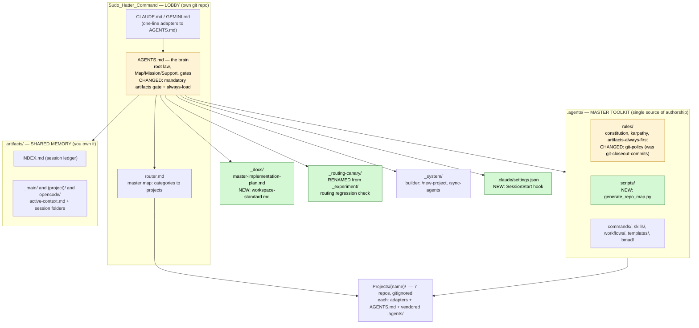
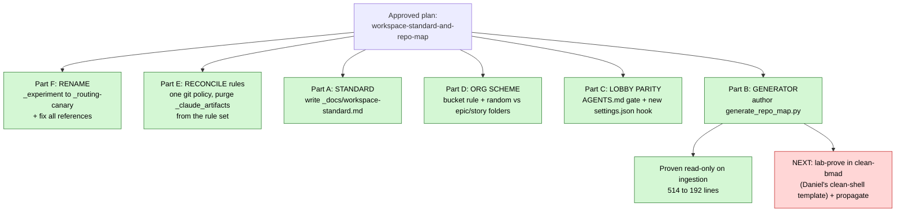
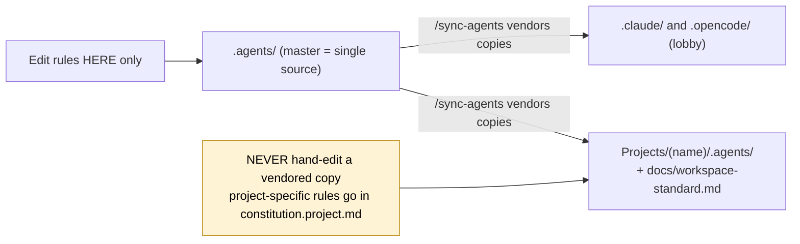
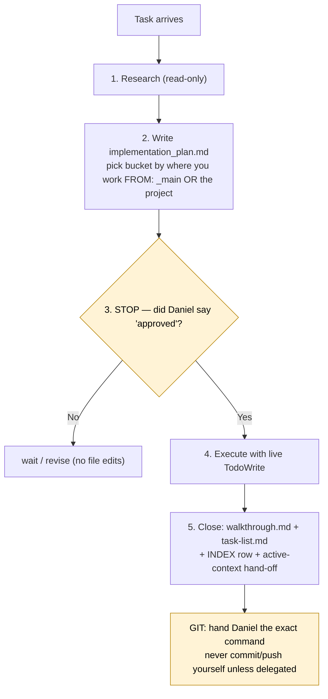
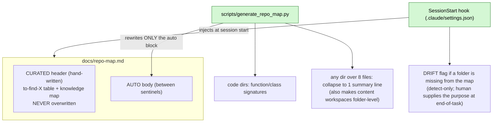

# Updated Folder / File Structure — System Quick Reference

> **What this is.** A one-look reference to the home-base system and the file-change strategy executed on
> 2026-06-24 (the `workspace-standard-and-repo-map` session). Green = NEW this session, Yellow = CHANGED this
> session, Red = BLOCKED / not done. Full detail lives in
> `_artifacts/_main/2026-06-24_workspace-standard-and-repo-map/` and `_docs/workspace-standard.md`.

---

## 1. The home base at a glance (what lives where)



---

## 2. The file-change strategy we just ran (the 6 parts)



---

## 3. One rule set, one source (the anti-drift model)

The whole reason for the cleanup: rules had forked across copies over months. Now there is one source.



---

## 4. The plan-first + git lifecycle (how every task runs)



**Artifact folder naming (the org scheme):**
- Random task: `_artifacts/(workspace)/(YYYY-MM-DD)_(slug)/`
- Story: `_artifacts/(workspace)/(epic)/(story)/`  — epic folder houses all its stories
- Bucket = decided by **where you work FROM** (your cwd): the project's bucket for project work, `_main` for
  home-base/cross-project work. Create the bucket/epic folder if missing. opencode mirrors this under `opencode/`.

---

## 5. The repo-map hybrid (how the navigation index stays honest)



---

## 6. Quick-reference tables

**Key files touched / created this session**

| Path | What it is | Status |
|---|---|---|
| `_docs/workspace-standard.md` | Canonical "how to format + upkeep a workspace" doctrine | NEW |
| `.agents/scripts/generate_repo_map.py` | Hybrid repo-map generator (signatures + collapse + sentinels) | NEW |
| `.claude/settings.json` | Lobby SessionStart hook (injects active-context + gate) | NEW |
| `.agents/rules/git-policy.md` | The one git rule (renamed from `git-closeout-commits.md`) | CHANGED |
| `.agents/rules/constitution.md` + `artifacts-always-first.md` | Reconciled to the git policy + org scheme | CHANGED |
| `AGENTS.md` | Mandatory artifacts gate + always-load + standard reference | CHANGED |
| `_routing-canary/` | Routing regression check (renamed from `_experiment/`) | RENAMED |

**Git policy (locked):** never run `git commit`/`push` yourself — hand Daniel the exact command. The only
exception: Daniel explicitly delegates that specific commit/push in the moment.

**When to run `_routing-canary/`:** after changing routing structure (`AGENTS.md` / `router.md` / the
adapter-skill pattern), or when qualifying a new LLM/CLI. A green run proves the mechanism, not that your real
routing is correct (use the cold-route test for that).

**Done vs Blocked**

| Done (home base) | Blocked / next |
|---|---|
| Rename, rule reconciliation, standard doc, org scheme, lobby gate + hook, generator (proven 514 to 192) | Lab-prove the repo-map in `clean-bmad-workspace` (Daniel's clean-shell template) + propagate to projects |
|  | Retire-list follow-up: autopilot workflow + `1_*` commands still reference `_claude_artifacts/` (engine-coupled) |
|  | Home-base changes are UNCOMMITTED — git command is in the session `walkthrough.md` |
```
