# Git Settings — A Visual Walkthrough

> **What this is.** A from-scratch, picture-first explanation of the git config we just set
> machine-wide, *why* each line exists, and what your day-to-day commands now do. Read it once
> and the whole "merge vs rebase vs fast-forward" thing stops being mysterious.

---

## 0. TL;DR — what we turned on and why

| Setting | Value | Plain-English meaning |
|---|---|---|
| `pull.ff` | `only` | `git pull` will **only** fast-forward. If it can't, it **stops and asks you** instead of guessing. |
| `pull.rebase` | `false` | If you *override* the stop, integrate by **merge**, not rebase. (Safety net behind `pull.ff`.) |
| `fetch.prune` | `true` | Deleting a branch on GitHub auto-cleans the stale copy on your machine. |
| `rebase.autostash` | `true` | Rebasing with uncommitted edits? Git stashes them, rebases, pops them back. No "please stash first" error. |
| `merge.conflictstyle` | `zdiff3` | Conflict markers also show the **original** code, so you see what each side *changed*. |
| `push.default` | `simple` | `git push` pushes **the current branch to its own upstream** — nothing surprising. |
| `push.autoSetupRemote` | `true` | First push of a new branch **auto-creates** its upstream. No more `--set-upstream` dance. |
| `push.followTags` | `true` | Annotated tags ride along with your pushes automatically. |
| `init.defaultBranch` | `main` | New repos start on `main`, not `master`. |
| `rerere.enabled` | `true` | Git **remembers** how you resolved a conflict and replays it if it reappears. |

All of this lives in `~/.gitconfig` (`C:/Users/dlohn/.gitconfig`) — your **user profile**, so it
survives a Git reinstall and follows you to a new machine. Every repo inherits it.

---

## 1. The mental model: three different actions

Most git confusion comes from blurring **fetch**, **pull**, and **push**. They are three separate
motions between three places: your **working files**, your **local repo history**, and the **remote** (GitHub).

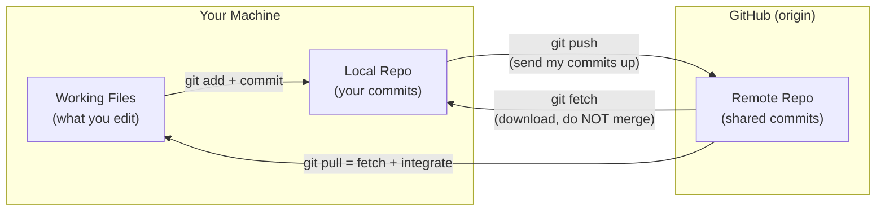

Key truth: **`git pull` is two steps glued together** — `fetch` (download remote commits) **plus**
*integrate them into your branch*. Almost every "pull went weird" story is really about that second
step. That second step is exactly what `pull.ff=only` makes safe.

---

## 2. The core problem `pull.ff=only` solves: divergence

When you pull, one of two situations is true.

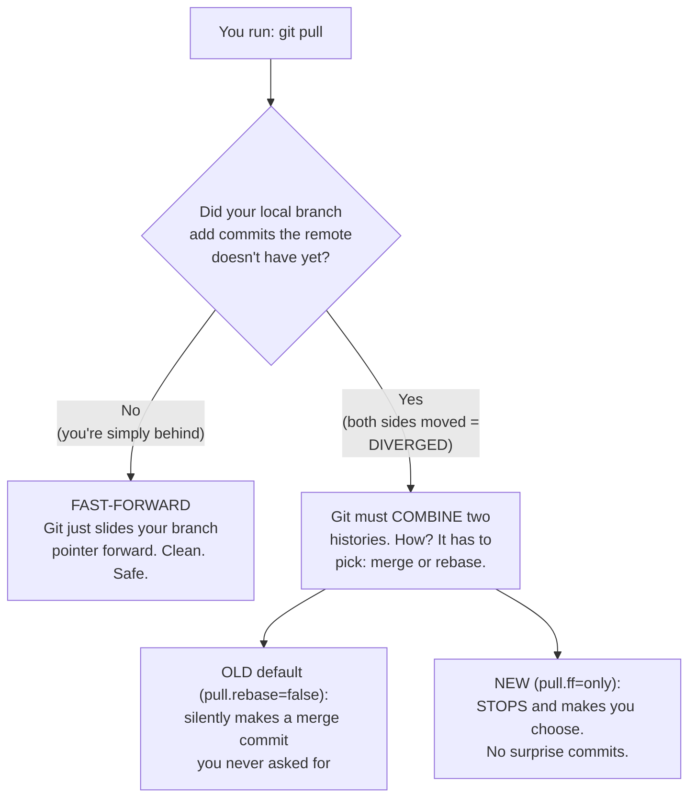

- **Fast-forward** = nothing to combine, git just catches you up. Always fine.
- **Diverged** = both you and the remote added commits. Now the two histories must be woven
  together, and there are two ways to do it (next section). The old behavior chose *for* you and
  quietly created a merge commit. `pull.ff=only` refuses to guess.

---

## 3. The big idea: Merge vs Rebase (the picture that makes it click)

Say `main` has commits `A → B`. You branch off, add `X → Y`. Meanwhile a teammate (or you on
another machine) adds `C` to `main`. The histories have **diverged**. Two ways to combine them:

### Option A — MERGE (ties the histories together with a knot)

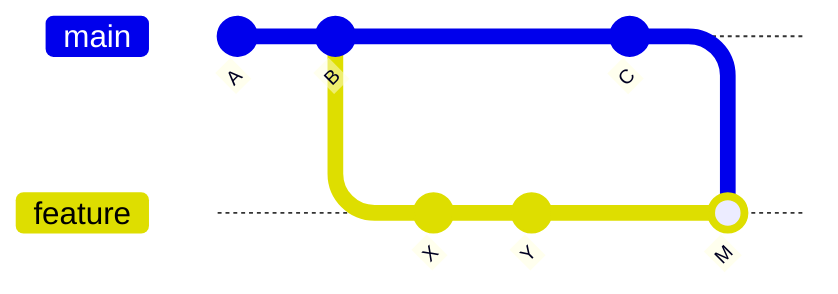

A **merge commit** `M` joins the two lines. History is *truthful* (it shows the branches really
existed in parallel) but the graph gets braided. This is `pull.rebase=false`.

### Option B — REBASE (replays your work on top, keeps one straight line)

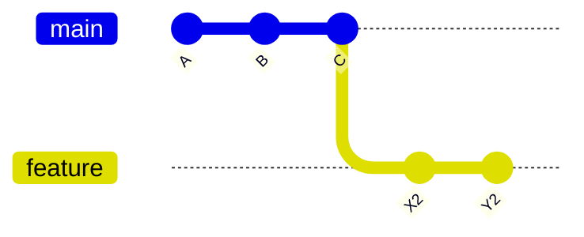

Rebase **lifts** your commits `X, Y`, puts `C` down first, then **replays** your commits on top as
`X2, Y2`. The result is one clean straight line — as if you'd started *after* `C` all along. This is
`git pull --rebase`. Cleaner history, nicer PRs, but it **rewrites** your commit IDs.

### Which to use?

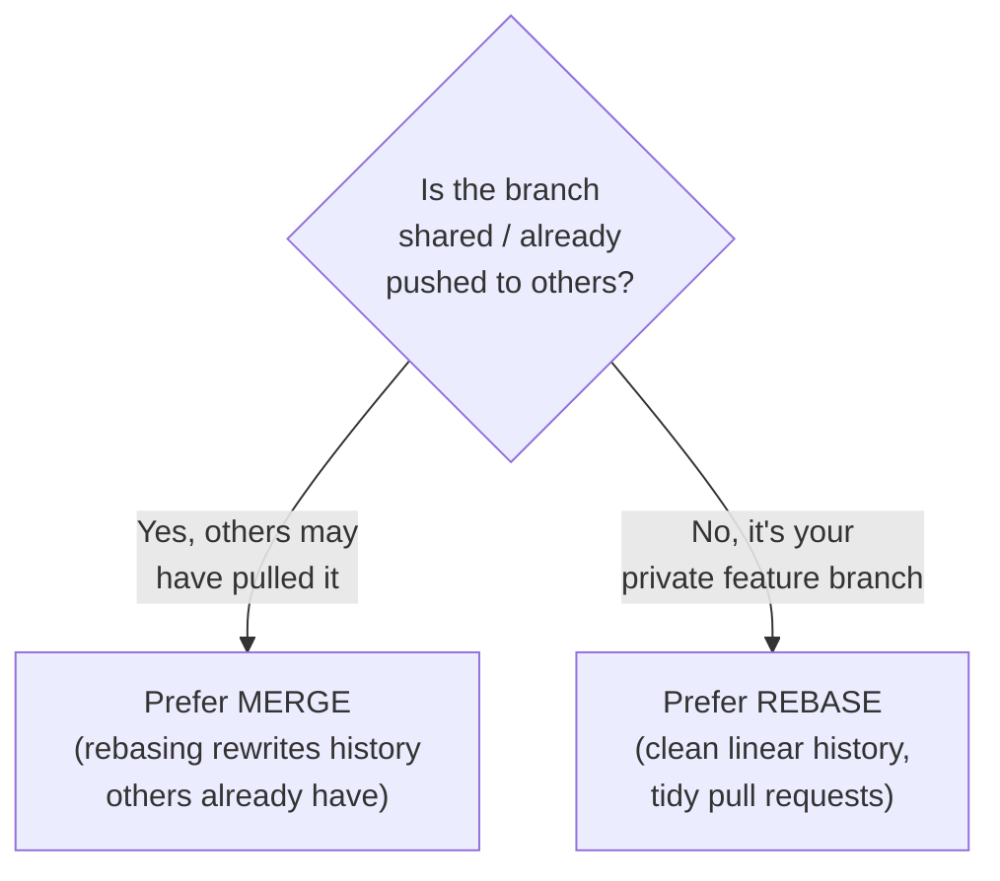

> **Your daily rule of thumb:** on your own feature branches (`Epic-8`, etc.) run
> `git pull --rebase` for a clean line. On shared `main`, a merge is honest. With `pull.ff=only`,
> git won't do *either* silently — you always type the verb on purpose.

---

## 4. So what actually happens now when you pull?

This is the new flow with `pull.ff=only` in effect:

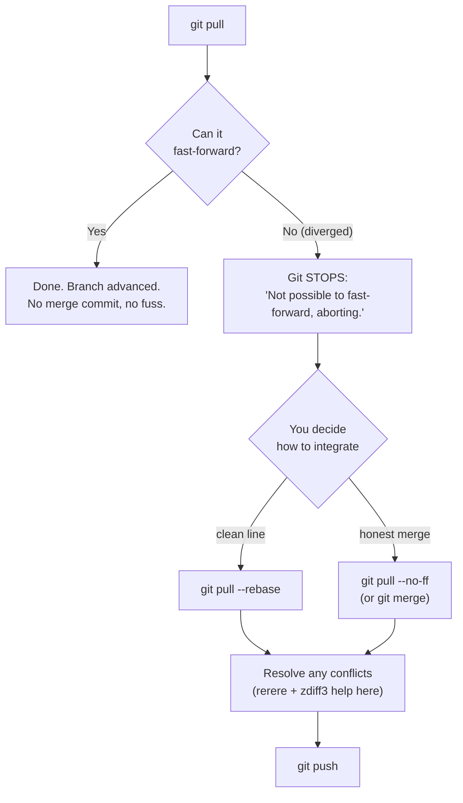

That "Git STOPS" message is **the feature, not an error**. It's the difference between a tool that
guesses and a tool that asks. The settings below make the rest of that flow painless.

---

## 5. The supporting cast (the smaller settings, visualized)

### `rebase.autostash=true` — no more "please stash first"

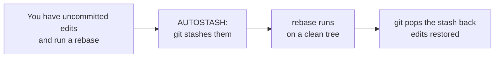

Without it, git refuses to rebase while you have unsaved changes. With it, git handles the
stash/unstash sandwich for you.

### `merge.conflictstyle=zdiff3` — conflict markers that show the *original*

Old `diff3`/default markers show only "your version" vs "their version." `zdiff3` adds the
**common ancestor**, so you see what each side actually changed from the same starting point:

```text
<<<<<<< HEAD            (your change)
const timeout = 5000
||||||| base            (the ORIGINAL — this is what zdiff3 adds)
const timeout = 3000
=======                 (their change)
const timeout = 8000
>>>>>>> origin/main
```

Seeing the base (`3000`) tells you *both* sides edited the same line and from what — far easier to
resolve correctly.

### `rerere.enabled=true` — git remembers your conflict fixes

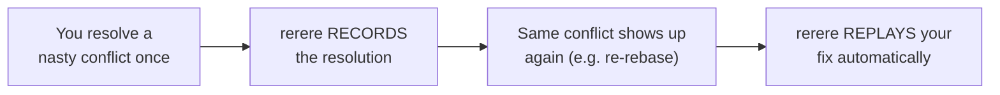

Huge time-saver on long-lived branches you rebase repeatedly.

### `fetch.prune=true` — auto-tidy deleted remote branches

When a branch is deleted on GitHub (e.g. after a PR merges), your local `origin/that-branch`
reference is stale junk. `prune` deletes those stale references automatically on every fetch/pull.

---

## 6. Push settings — fewer papercuts

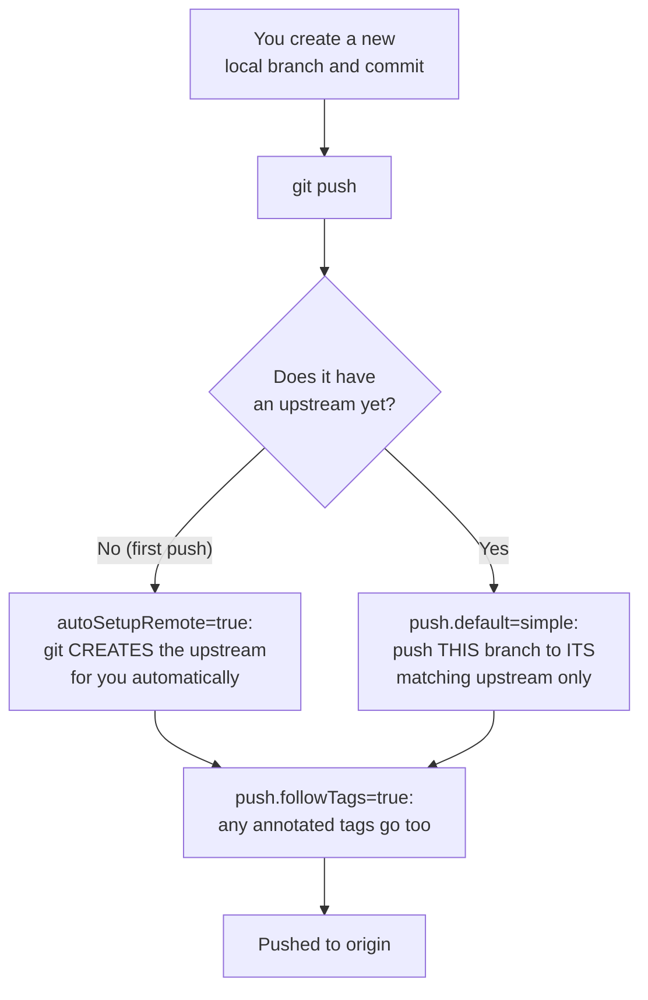

- **`push.autoSetupRemote=true`** kills the classic `fatal: The current branch has no upstream
  branch` error. Before, the first push of a new branch needed
  `git push --set-upstream origin <branch>`. Now plain `git push` just works.
- **`push.default=simple`** means `git push` only ever touches the branch you're standing on —
  never accidentally shoves other branches up.
- **`push.followTags=true`** sends your annotated tags (releases, versions) along with commits, so
  you don't forget `git push --tags`.

---

## 7. Cheat sheet — your new daily commands

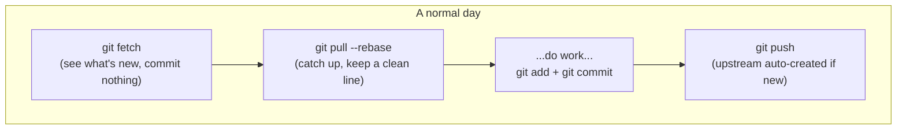

| You want to... | Command | What the settings do for you |
|---|---|---|
| Just see remote changes | `git fetch` | prunes stale branches automatically |
| Catch up your feature branch | `git pull --rebase` | clean linear history; autostash handles unsaved edits |
| Catch up `main` honestly | `git pull --no-ff` | explicit merge commit, on purpose |
| Push a brand-new branch | `git push` | upstream auto-created; no `--set-upstream` |
| Push a release tag | `git push` | annotated tags follow automatically |
| Pull on a diverged branch | `git pull` | **stops and asks** — pick rebase or merge |

---

## 8. The one setting we deliberately did NOT set

**`core.autocrlf`** (line-ending normalization) was left untouched **on purpose**. On Windows it can
silently rewrite line endings (`CRLF` ↔ `LF`) across a repo, which on an existing live project like
aviationChat can produce a giant "everything changed" diff out of nowhere.

- If you ever want it, the Windows-safe value is `input` (store `LF`, check out as-is):
  `git config --global core.autocrlf input`
- Only do this when your repos have **clean** working trees, and ideally add a `.gitattributes`
  with `* text=auto` first. Until then, leaving it unset is the safe choice.

---

## 9. Verify / change / undo

```bash
# See everything that's set globally
git config --global --list

# See where a single value comes from (which file)
git config --show-origin --get pull.ff

# Change one value
git config --global pull.ff true        # allow ff, fall back to merge (the pre-strict behavior)

# Remove one entirely (revert to git's built-in default)
git config --global --unset pull.ff
```

Nothing here touches repo contents or history — it's all preferences in a text file
(`~/.gitconfig`) you can edit or revert any time.

---

## 10. Bonus gotcha — "why don't my project's pending changes show in VS Code?"

This is **not** about the config above — it's a VS Code + nested-repo quirk specific to the
home-base layout, where each `Projects/<name>/` is its **own** git repo nested inside the home-base
repo. Two things stack up to hide a project's pending changes from the Source Control panel:

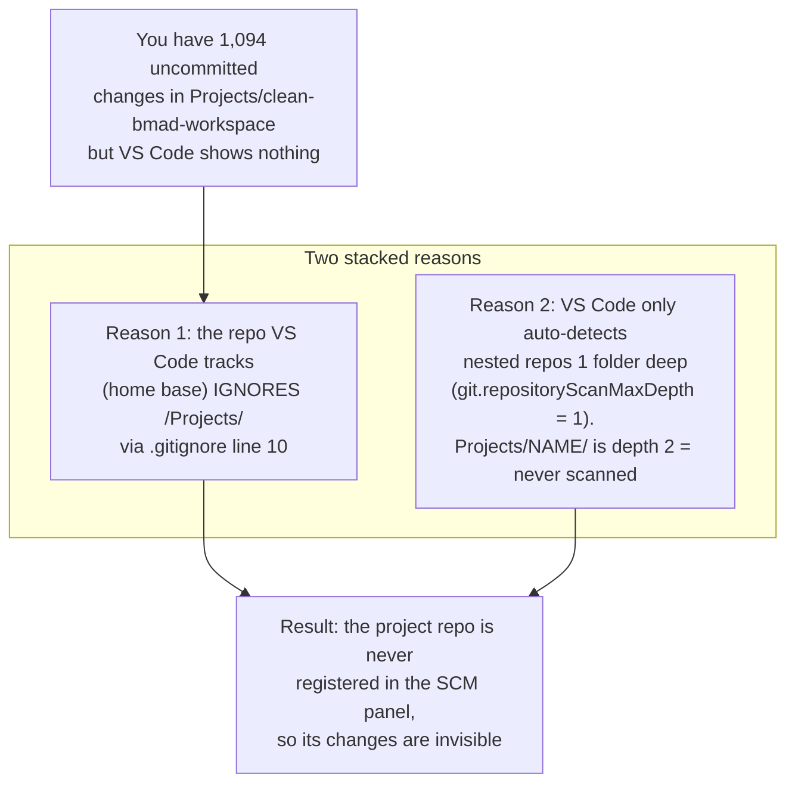

**Why it's by design:** the home-base `.gitignore` ignores `/Projects/` on purpose — each project is
an independent repo with its **own** remote, committed from **inside** its own folder. That keeps
them self-contained. The side effect is that the home-base IDE git view will never show project
changes, which is exactly why a half-finished conversion can sit unnoticed.

### Three ways to actually see them

| Fix | How | Trade-off |
|---|---|---|
| Open it directly | File → Open Folder → `Projects/<name>`, or right-click → "Open in New Window" | Cleanest; one project at a time |
| Multi-root workspace | "Add Folder to Workspace" | Home base + project in one window |
| Raise scan depth | `"git.repositoryScanMaxDepth": 2` in `.vscode/settings.json` | VS Code then tracks ALL project repos at once |

**What was set here:** the home-base `.vscode/settings.json` now contains:

```json
{
  "git.repositoryScanMaxDepth": 2,
  "git.detectSubmodules": false
}
```

So every `Projects/<name>/` repo (depth 2) now appears as its own entry in the Source Control
panel. You still **commit and push from inside each project repo** — this only makes their changes
*visible* in one window; it does not merge them into the home-base repo.

> **Reminder:** seeing a project's changes here does NOT mean the home-base repo can commit them.
> `/Projects/` stays gitignored at home base. Each project is pushed on its own remote.

---

### Appendix — the exact block that was applied

```bash
git config --global pull.ff only
git config --global pull.rebase false
git config --global fetch.prune true
git config --global rebase.autostash true
git config --global merge.conflictstyle zdiff3
git config --global push.default simple
git config --global push.autoSetupRemote true
git config --global push.followTags true
git config --global init.defaultBranch main
git config --global rerere.enabled true
```
