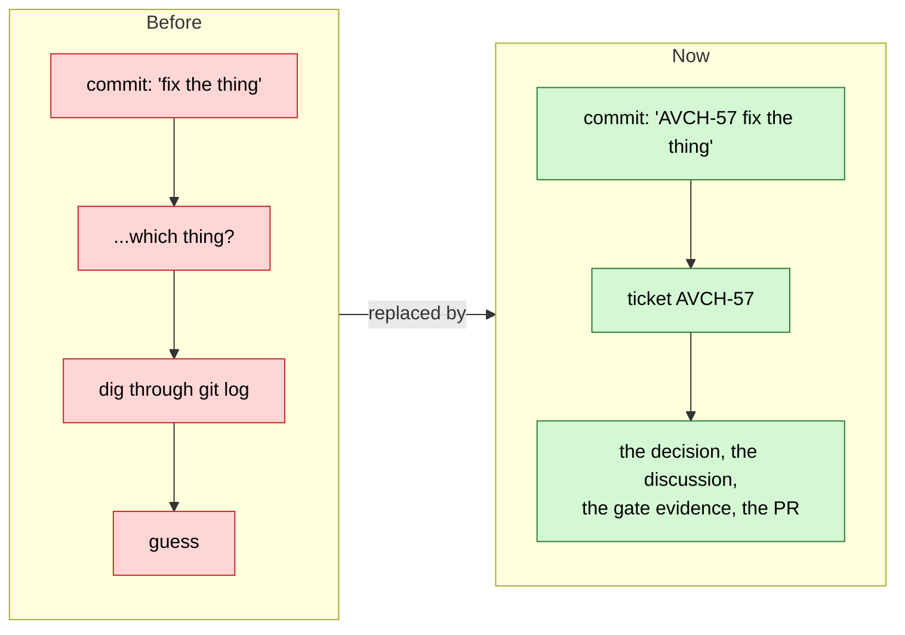
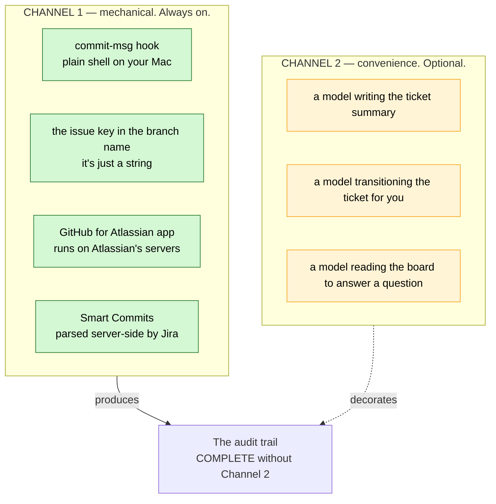
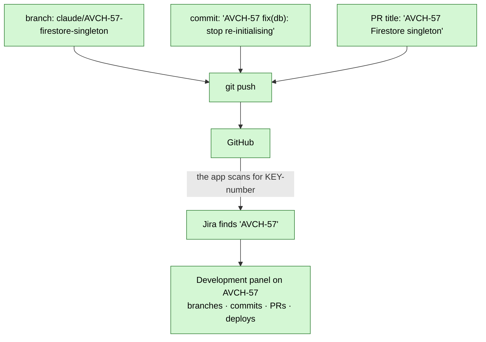
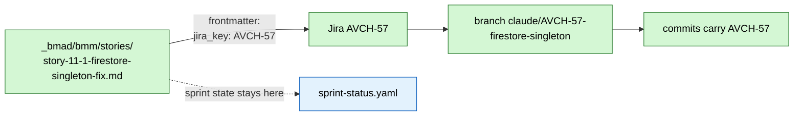
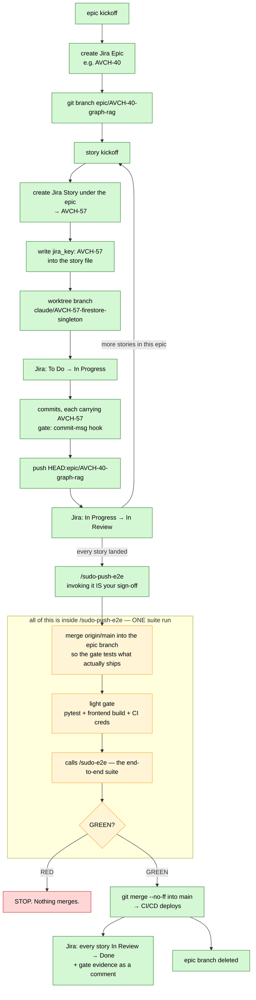
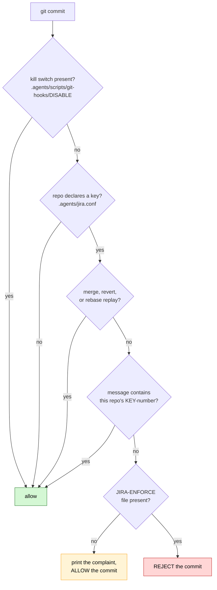
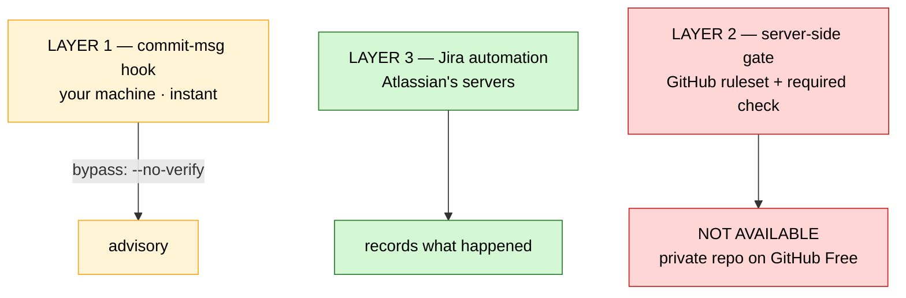

# Jira Integration — User Guide

> **What this is.** How work in this system becomes a tracked, auditable record in Jira — and why almost
> none of it depends on an AI model being available. Set up 2026-08-07. Read top to bottom once and you'll
> understand the whole thing; after that, §11 is the cheat-sheet you'll actually keep coming back to.
>
> **Status honesty:** §12 lists exactly what is LIVE today versus what is still to be built. Nothing in
> §1–§11 describes something that doesn't exist unless it says so.

---

## 1. The one idea

**Every change that reaches production should be traceable to a decision someone made.**

Today the trail is scattered: a commit message says *what* changed, a story file says *why*, the board says
*when*, and a Slack-shaped memory in your head connects them. Six months later that connection is gone and
the only honest answer to *"why is this code like this?"* is a shrug.

Jira's job here is narrow and specific: **be the durable join between a decision and the code that
implemented it.** It is not replacing your board. `sprint-status.yaml` remains the source of truth for
sprint state — what's in flight, what's next, what's blocked. Jira is the permanent record underneath it.



---

## 2. The most important thing to understand: two channels

This system has two halves that fail independently. Confusing them causes unnecessary panic, so learn this
split before anything else.



**Channel 1 uses no AI, no tokens, and — apart from Atlassian's own servers — no network.** It does not
know or care which model wrote the code, or whether a model was involved at all. Claude, Codex, Gemini,
Antigravity, you typing by hand at 2am, you on your phone in an airport: identical behaviour.

### What happens if you run out of tokens?

**Production does not stop.** Commits are still gated, commits still link to tickets, PRs still appear in
Jira's Development panel, Smart Commits still transition work items. The only thing you lose is a model
writing the prose for you — and you move the ticket yourself with one command or one click.

There is no single point of failure in this design that is an AI service. That was deliberate.

---

## 3. The parts, and what each one is for

| Part | Where it lives | What it does | Needs AI? |
|---|---|---|---|
| **Jira Cloud** | `sudo-command.atlassian.net` | Holds the tickets and the history | no |
| **`acli`** | your Mac, `/opt/homebrew/bin/acli` | Terminal access to Jira. Any tool that can run bash can use it | no |
| **GitHub for Atlassian** | Atlassian's servers | Watches your GitHub, files commits/branches/PRs under the matching ticket | no |
| **Smart Commits** | Jira, server-side | Lets a commit message comment on and transition a ticket | no |
| **commit-msg hook** | `.githooks/commit-msg` in each repo | Refuses a commit with no ticket key | no |
| **`.agents/jira.conf`** | each repo | Declares which Jira project *this* repo answers to | no |
| **GitHub secrets** | GitHub, encrypted | Lets CI talk to Jira from a machine that isn't yours | no |
| **Atlassian MCP** | `.mcp.json` | Lets Claude Code read the board directly. Pure convenience | yes |

### Two projects, two repos

| Jira project | Key | Repo | Board |
|---|---|---|---|
| Aviation Chat | `AVCH` | `AGY_AVIATIONCHAT` | board 3, sprints on |
| Sudo Command Center | `SCC` | `Sudo_Hatter_Command` (the lobby) | board 2, sprints on |

Both are **team-managed** projects. That choice has consequences you'll meet in §8 and §10.

---

## 4. The join — how a commit becomes a ticket link

There is exactly one mechanism, and it is refreshingly dumb: **Atlassian looks for the issue key as a
literal string.** That's it. No API call from your machine, no configuration, no plugin in your editor.



**The branch name matters most.** Every commit on a correctly-named branch links to the ticket *even if an
individual commit message forgets the key*. Name the branch right and you have a safety net under every
commit you'll make on it.

---

## 5. The numbering problem — and the join that solves it

This is the one genuinely awkward part of the design, and it's worth understanding rather than working
around blindly.

**Your stories are numbered by BMAD.** `story-11-1-firestore-singleton-fix.md` is story **11.1**, under
epic 11. There are 139 of them.

**Jira numbers its own way.** Sequential, per project, starting at 1: `AVCH-1`, `AVCH-2`, `AVCH-3`. You
cannot make Jira issue `AVCH-111` mean "story 11.1". Jira hands out the next number and there is no
override — not through the UI, not through the API.

So the two numbering systems can never be made to match. The answer is a recorded mapping:



**The rule:** the Jira key is written into the story file when the ticket is created, and from that moment
**the Jira key is what branches and commits carry** — never the BMAD number. The story file is the join
table. If you ever need to go from `11.1` to the code, you read `jira_key` first.

---

## 6. The full lifecycle

End to end, under the epic-branch model. Stories loop; the gate fires **once**, at the epic merge.



**`/sudo-e2e` is not a separate step you run first.** It is the fourth item of the gate *inside*
`/sudo-push-e2e` ([`sudo-push-e2e.md` Step 3](../../../.agents/commands/sudo-push-e2e.md)). The suite
runs **once per epic merge**. If you ever find yourself running `/sudo-e2e` and then `/sudo-push-e2e`
back to back, you have paid for the suite twice for one merge.

You *may* still run `/sudo-e2e` alone — it is documented as runnable solo — but that is **early warning
during development**, not part of shipping. Use it when you want end-to-end confidence mid-epic, before
you are anywhere near merging. When you are ready to ship, go straight to `/sudo-push-e2e` and let it
run the gate.

Nothing about this replaces the existing gate. `/sudo-push-e2e` is still the one door to `main`, and it
still refuses to open on red. Jira rides along and records what happened.

### The gate is not the same in both repos

The diagram above is **AviationChat's** lifecycle. The lobby's is smaller, and assuming otherwise sends
you hunting for a suite that was never supposed to exist:

| | AviationChat (`AVCH`) | the lobby (`SCC`) |
|---|---|---|
| E2E suite | `frontend/e2e/run-e2e.mjs` — the TEA-16 harness | **none, by design** |
| What `/sudo-e2e` does | runs it | **stops** — Step 1 finds no harness |
| The real gate | light gate + `/sudo-e2e` | `python3 .agents/scripts/tests/run_all.py` |
| Why | it ships a product with a browser in front of it | it ships markdown, PowerShell and Python — there is no journey to drive |

The lobby has no `frontend/` at all. Never improvise a substitute suite to fill the gap — `run_all.py`
**is** the gate here, and [`sudo-push-e2e.md` Step 1](../../../.agents/commands/sudo-push-e2e.md)
already grants `chore/*` branches the light gate only.

---

## 7. Naming conventions — the exact formats

**Branches.** The key goes immediately after the prefix:

```
epic/AVCH-40-graph-rag              an epic branch, lives one epic then deleted
claude/AVCH-57-firestore-singleton  one worktree per story
chore/AVCH-61-fix-broken-links      ad-hoc work — yes, this needs a ticket too
```

**Commits.** Key first, then your normal semantic message:

```
AVCH-57 fix(db): stop re-initialising the Firestore client
AVCH-61 chore(docs): repair the relocated quick-reference links
```

**Pull request titles.** Same shape — include the key.

### Why chore branches need a ticket

Ruled 2026-08-07. The point of this system is that *everything* reaching `main` is accounted for. A class
of changes that skips the ticket is a hole in the audit trail, and holes get used for more than they were
meant for. Creating a one-line Jira Task takes about fifteen seconds.

**The only exemptions** are commits git generates itself, which cannot sanely carry a key: merge commits,
reverts, and commits replayed during a rebase. The hook knows about all three.

---

## 8. Smart Commits — driving Jira from the commit message

Enabled on your site. Three commands, usable in any commit message after the key:

| Command | Example | Effect |
|---|---|---|
| `#comment` | `AVCH-57 fixed it #comment root cause was a module-scope get_db()` | Adds a comment to the ticket |
| `#time` | `AVCH-57 fixed it #time 2h 30m` | Logs work |
| `#transition` | `AVCH-57 fixed it #transition Done` | Moves the ticket |

Combined:

```bash
git commit -m "AVCH-57 fix(db): singleton #comment root cause was module-scope get_db #time 2h #transition In Review"
```

**Why this matters more than it looks.** Jira's *Automation rules* could do the same job, but your Free
plan allows only **100 automation runs per month**. Smart Commits are parsed server-side at no quota cost
at all. Using them instead of automation rules means you will most likely never hit that ceiling. That is
the reason the design leans on them.

**Format requirement:** the key must be two or more uppercase letters, a hyphen, then digits. `AVCH-57`
and `SCC-9` both qualify.

---

## 9. The commit gate

A `commit-msg` hook that refuses a commit with no ticket key.



### Two modes

**WARN.** Prints the complaint and lets the commit through. The original plan was to sit here for a few
days so the gate stops surprising you before it starts refusing you.

**ENFORCE (current, armed 2026-08-07).** Rejects the commit outright. Armed by the presence of a tracked
file:

```bash
touch .agents/scripts/git-hooks/JIRA-ENFORCE
```

**Why it was armed on day one instead.** WARN failed its first real test the same evening it shipped. A
commit carrying `SCC-10` landed on AviationChat's `main`, where `jira.conf` binds the repo to `AVCH`. The
hook fired and complained exactly as designed — and nobody saw it, because the commit came from **VS Code's
Source Control panel, which writes hook output to `View → Output → Git` and shows nothing in the UI**. The
"run in WARN for a few days" advice silently assumes you are committing in a terminal. A warning nobody
reads is not a gate.

The flag file is **tracked**, not local. Untracked, the gate would be armed on one machine and silent on
every other clone — failing precisely when you switch machines.

Remove the file to disarm. **Kill switch** for the whole hook: create `.agents/scripts/git-hooks/DISABLE`.
**Bypass once:** `git commit --no-verify`.

### Two things it deliberately does not do

**It does not check that the ticket exists.** A live lookup would put a network round-trip on every commit
and fail closed on a plane. A well-formed but wrong key is caught downstream, where the commit simply never
appears on any ticket's Development panel.

**It cannot stop you.** `--no-verify` walks past it. See §10 for what that means and what it would cost to
close.

### `jira.conf` — why each repo declares its own key

```sh
# Projects/AGY_AVIATIONCHAT/.agents/jira.conf
JIRA_KEYS="AVCH"

# Sudo_Hatter_Command/.agents/jira.conf
JIRA_KEYS="SCC"
```

This makes the gate repo-aware: an `SCC-9` commit is **rejected inside AviationChat**, because it belongs
to a different project.

> ⚠️ **`jira.conf` is deliberately excluded from `/sync-agents`.** The sync vendors the master `.agents/`
> tree into every project, overwriting same-named files — which would have pushed the lobby's `SCC` over
> AGY's `AVCH`, making AviationChat's gate reject its own work items and accept the lobby's, backwards,
> with the file reading perfectly plausibly. It is excluded in **both** the vendor copy and the manifest
> set, so a future delete from master can't purge every project's copy either. Treat it exactly like
> BMAD's module config: project identity, never vendored.

---

## 10. Enforcement — the honest picture

Enterprise practice is three layers. You currently have two of them.



**Verified 2026-08-07:** `GET repos/sudomadhatter/AGY_AVIATIONCHAT/rulesets` returns
`403 — Upgrade to GitHub Pro or make this repository public`. Branch protection and rulesets are not
available for private repos on the free plan.

**What that means in practice:** you have **a loud alarm, not a locked door.** The hook catches honest
mistakes — which, working solo, is essentially all of them. But nothing physically prevents a merge that
skipped the process.

**What closing it costs:** GitHub Pro, about $4/month. That turns the CI check into a required status
check, and an unkeyed commit becomes genuinely unmergeable. It is the cheapest line item in this build,
and it is entirely optional. *Decision still open.*

---

## 11. Cheat sheet

> **Agent-facing canonical copy:** `.agents/rules/jira.md` (lobby + AGY each carry one) — the rule every
> LLM platform loads on demand, with this cheat-sheet, the flag traps, the ticket↔file join, and the
> guardrails. Edit the rule first; this section is the human mirror.

### Reading

```bash
acli jira auth status                                  # am I logged in, and as whom?
acli jira workitem view AVCH-4                         # NOTE: key is positional here
acli jira workitem search --jql "project = AVCH AND status = 'In Progress'"
acli jira project list --limit 20
acli jira board search                                 # board ids
acli jira board list-sprints --id 3 --limit 5
```

### Writing

```bash
acli jira workitem create --project AVCH --type Story --summary "..." --parent AVCH-40
acli jira workitem transition --key AVCH-57 --status "In Progress" --yes   # NOTE: --key flag here
```

> **Gotcha worth memorising:** `view` takes the key **positionally** (`view AVCH-4`), `transition` takes it
> as a **flag** (`--key AVCH-4`). Inconsistent, but that's the tool.

### The three deferred views

```bash
# everything parked
acli jira workitem search --jql "project = AVCH AND status = Deferred"

# the REAL V3 review list — parked, not killed
acli jira workitem search --jql "project = AVCH AND status = Deferred AND labels != descoped"

# the graveyard — decisions preserved so nobody re-proposes them
acli jira workitem search --jql "project = AVCH AND status = Deferred AND labels = descoped"
```

### Status mapping

| `sprint-status.yaml` | Jira status | Notes |
|---|---|---|
| `backlog`, `ready-for-dev` | `To Do` | |
| `in-progress` | `In Progress` | |
| `review` | `In Review` | dev sets this; only human close-out sets `done` |
| `done` | `Done` | SHIPPED. Never for work that wasn't built |
| `deferred-v3` | `Deferred` | parked, revisited at V3 |
| `descoped` | `Deferred` + label `descoped` | terminal ruling, never built |

**Why `Deferred` sits in the `To Do` category, not `Done`.** Anything in a Done-category status reads as
*shipped* in every Jira report. Descoped work is the opposite of shipped. Putting `Deferred` in `To Do`
keeps "what actually went out" honest — which is the same corruption `sprint-status.yaml` already warns
about when it says a false `done` "corrupts every trace, retro and readiness check."

**Why one status and a label, not two statuses.** Team-managed Jira projects can't customise the
Resolution field, which is the normal way to express "closed but not shipped." The label does the same job:
one column on the board, and the distinction between *not yet* and *never* survives.

### Saved filters

| Filter | Id |
|---|---|
| `AVCH Deferred` | 10003 |
| `SCC Deferred` | 10004 |

---

## 12. What is live, and what is not

**LIVE — verified 2026-08-07:**

- Jira site with `AVCH` and `SCC`; sprints enabled on both; `AVCH Sprint 1` and `SCC Sprint 1` created
- `Deferred` status in both projects, category `To Do` — confirmed by round-trip on a sample ticket
- Saved filters `AVCH Deferred` (10003) and `SCC Deferred` (10004)
- `acli` 1.3.22 installed and authenticated as `sudomadhatter@gmail.com`
- GitHub for Atlassian app installed; Smart Commits enabled
- `commit-msg` hook in the lobby and AviationChat, **ENFORCE mode** (armed 2026-08-07, flag tracked)
- `.agents/jira.conf` per repo; excluded from `/sync-agents` in both the vendor and the manifest
- `JIRA_API_TOKEN` + `JIRA_EMAIL` secrets on both GitHub repos
- Atlassian MCP declared in `.mcp.json` (optional; needs `/mcp` approval)

**NOT BUILT YET:**

- The `acli` wrapper in `.agents/scripts/` — the thing that gives all four platforms one command surface
- `pre-push` branch-name check
- The CI job that fails a PR containing unkeyed commits
- `/sudo-*` wiring — kickoff minting the ticket and stamping `jira_key`; `/sudo-push-e2e` transitioning
  and posting gate evidence
- Jira epics and tickets for your actual open work *(agreed scope: open work only, roughly 20 issues —
  finished stories stay in the file board)*
- A decision on GitHub Pro
- The 16 Atlassian onboarding sample tickets are still present in both projects

---

## 13. Security — where the token lives

**The API token is never handled by a model and never appears in this repo.** Every caller has its own
authenticated copy:

| Caller | Authenticates via |
|---|---|
| you / any agent, through `acli` | your macOS keychain |
| GitHub Actions | the encrypted repo secret |
| you, in a browser | your normal Atlassian login |

**Never put the token in:** any file in a repo, a commit message, an untracked-but-present `.env`, or a
chat transcript.

**If it leaks — revoke and replace, about two minutes:**

1. [id.atlassian.com/manage-profile/security/api-tokens](https://id.atlassian.com/manage-profile/security/api-tokens) → revoke the old, create a new one
2. `acli jira auth login --site sudo-command.atlassian.net --email sudomadhatter@gmail.com --token`
3. Re-run the four `gh secret set` commands

Revoking is instant and total — the old string dies everywhere at once, so you never have to hunt copies.

> **GitHub secrets are write-only.** Once set, nobody can read one back — not a collaborator, not the
> GitHub UI, not you. `gh secret list` shows names and timestamps only. If you need to know what a secret
> was, you don't; you replace it.

---

## 14. Troubleshooting

| Symptom | Cause | Fix |
|---|---|---|
| Hook prints nothing, ever | `core.hooksPath` unset in that repo | `git config core.hooksPath .githooks` |
| Commit passes with no key | `JIRA-ENFORCE` missing, or repo has no `jira.conf` | Check both |
| Committed from VS Code and saw no hook output | The panel hides it | `View → Output → Git`. In ENFORCE mode a rejection also raises a notification |
| `SCC-9` rejected in AviationChat | Working as designed — wrong project | Use an `AVCH` key |
| Commit and ticket exist, but no link | Key typo'd, or GitHub app not connected to that repo | Check the key; check the app's repo list |
| `✗ Error: unknown flag: --key` | You used `--key` on `view` | `view` takes the key positionally |
| JQL: `value 'x' does not exist for the field 'status'` | Status genuinely doesn't exist | Check spelling — an *empty* result means it exists and is empty |
| `gh secret set` → `HTTP 403` | `gh` login lost a scope | `gh auth refresh -s repo` |
| Nothing appears while pasting a secret | Deliberate — input is hidden | Paste and press Enter anyway |

---

## 15. Related reading

- `_my_resources/_quick_reference/sudo_workflows_testing.md` — the dev system on one page; §6 is shipping
- `_my_resources/_quick_reference/git_walkthrough_settings.md` — the ten global git settings; §8 is the branch flow
- `Projects/AGY_AVIATIONCHAT/_bmad-output/implementation-artifacts/sprint-status.yaml` — the board, still the source of truth for sprint state

<!-- CHECKPOINT id="ckpt_msjenp0o_kmuefd" time="2026-08-07T20:36:33.000Z" note="auto" fixes=0 questions=0 highlights=0 sections="" -->

<!-- CHECKPOINT id="ckpt_msjhiks2_s1a95l" time="2026-08-07T21:56:33.074Z" note="auto" fixes=0 questions=0 highlights=0 sections="" -->
