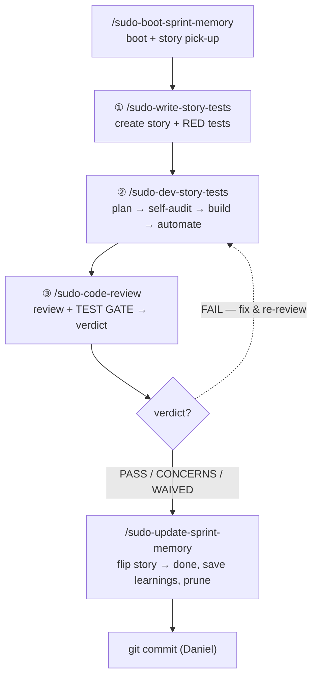
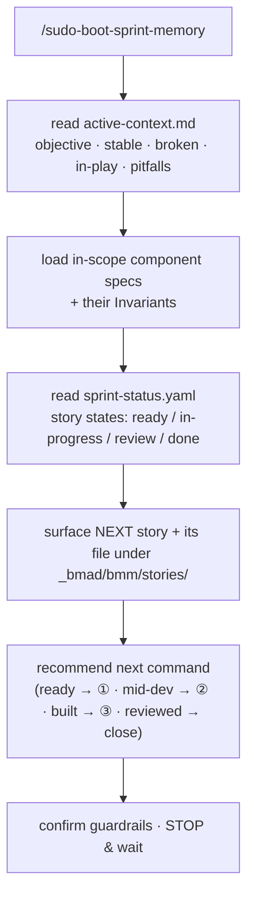
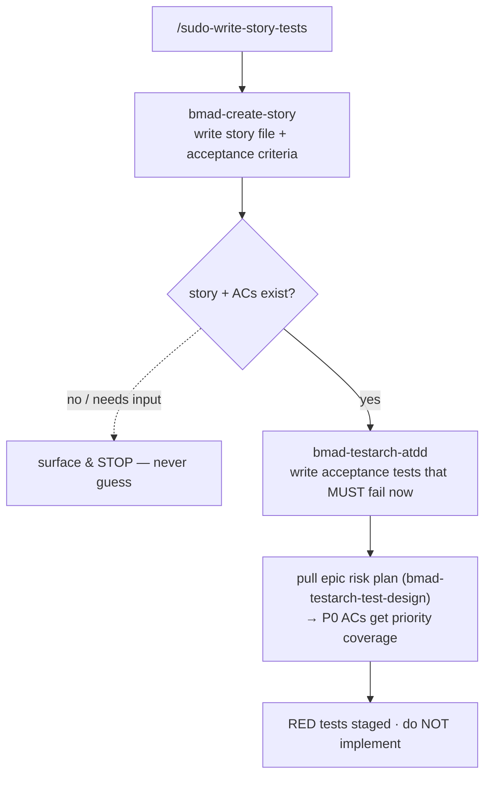
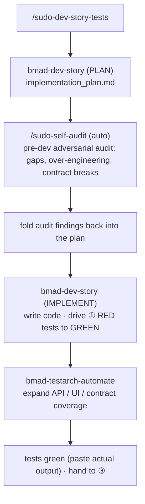
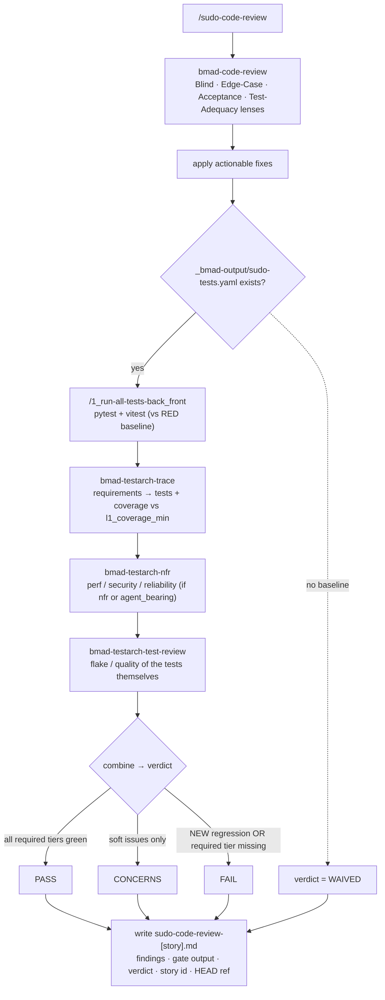
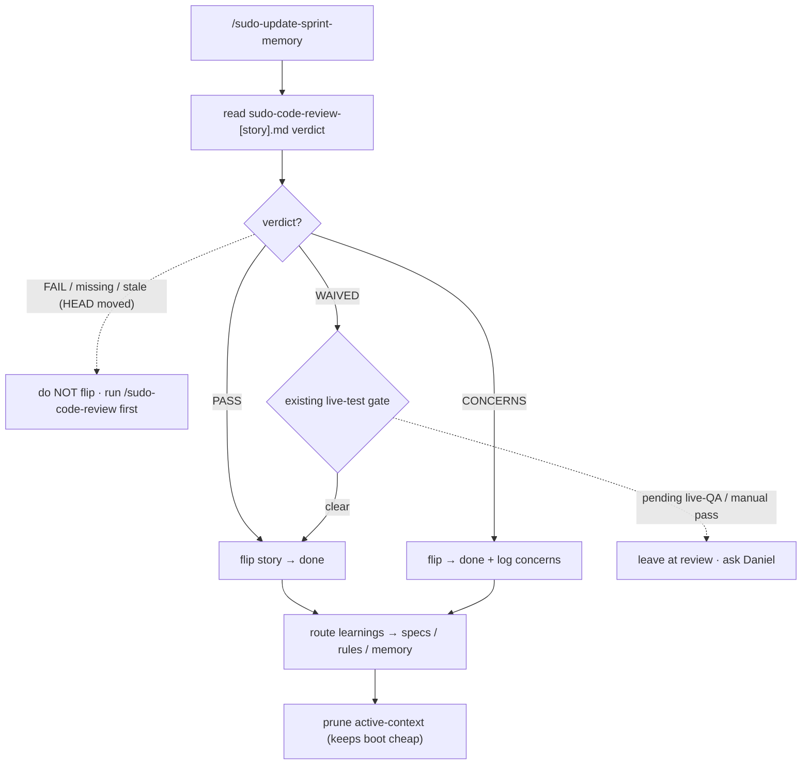
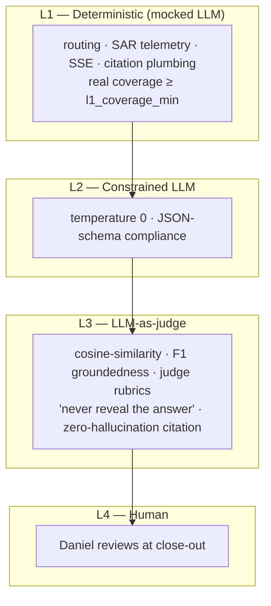
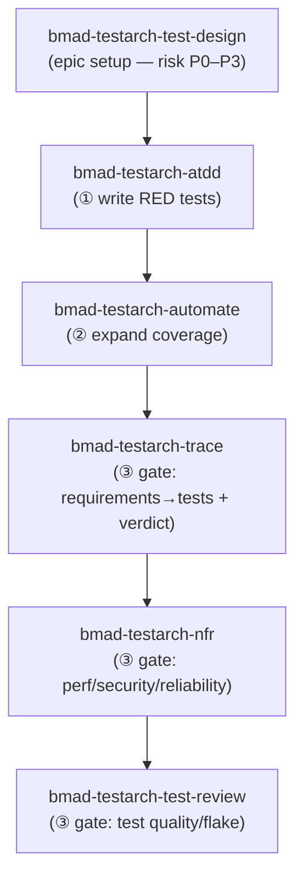

# TEA-Gated `sudo-` Dev Flow — Walkthrough (Human Lane)

**What this is:** the day-to-day, human-driven story flow with BMAD TEA testing baked in at every
station. These are the commands *you* run by hand, in order. The autopilot (`_AP`) lanes run the same
ideas through a different engine and are **out of scope here** — see `autopilot_bmad_dev_loop.md` for those.

**Core idea:** the `sudo-` commands are **thin orchestrators** — they don't reimplement anything, they
*call* existing BMAD + TEA workflows in the right order, and bake a **test gate** into review. Every
diagram below is a top-down waterfall: top = where you start, bottom = where it ends.

---

## 1. The whole flow at a glance



| Step | Command | One-line job |
|---|---|---|
| boot | `sudo-boot-sprint-memory` | Where am I? What story is next? Which command do I run? |
| ① | `sudo-write-story-tests` | Create the story, then write its **failing** acceptance tests (tests first). |
| ② | `sudo-dev-story-tests` | Plan, auto-audit the plan, build, drive tests green, expand coverage. |
| ③ | `sudo-code-review` | Review the diff, run the **test gate**, emit a PASS/CONCERNS/FAIL/WAIVED verdict. |
| close | `sudo-update-sprint-memory` | Verify the verdict, flip story → `done`, route learnings, prune. |

> **Epic setup (once per epic, not per story):** at sprint planning, run `bmad-testarch-test-design` to
> risk-score the epic's work **P0–P3**. That risk map tells ① which acceptance criteria deserve the
> heaviest tests. It is the same first move used to retrofit an existing untested codebase.

---

## 2. `sudo-boot-sprint-memory` — boot + story pick-up

Opens a session: grounds you in state **and** points at the next action. Read-only; it never edits.



> ⛔ **Not the master 'pick up'.** The home-base `pick up` trigger (AGENTS.md §7 / router.md) covers
> **all** work — code or not. `sudo-boot-sprint-memory` is the narrower BMAD-story/sprint sibling.

---

## 3. ① `sudo-write-story-tests` — create story + RED tests

Tests-first: you cannot test acceptance criteria that do not exist yet, so the story is created first.



**Calls:** `bmad-create-story` → `bmad-testarch-atdd` (+ optional `bmad-testarch-test-design` plan).

---

## 4. ② `sudo-dev-story-tests` — plan → self-audit → build → automate

The build station. The self-audit fires **automatically** the moment the plan is written.



**Calls:** `bmad-dev-story` (plan) → `sudo-self-audit` → `bmad-dev-story` (implement) → `bmad-testarch-automate`.

---

## 5. ③ `sudo-code-review` — review + the TEST GATE (the heart)

Two halves: the adversarial review, then the gate. The gate is **opt-in** (a project with no
`sudo-tests.yaml` baseline auto-`WAIVED`, so this never blocks a test-less project) and
**baseline-diff aware** (legacy red is grandfathered — only NEW regressions fail).



**Calls:** `bmad-code-review` → `/1_run-all-tests-back_front` → `bmad-testarch-trace` → `bmad-testarch-nfr` → `bmad-testarch-test-review`.

**`_bmad-output/sudo-tests.yaml` (opt-in config, per project that turns the gate on):**

```yaml
required_tiers: [L1, L2, L3]   # which pyramid tiers must be present
l1_coverage_min: 85           # deterministic branch/line coverage floor
agent_bearing: true           # story touches agent behavior → L3 judge required
nfr: false                    # also run the NFR audit
waive: false                  # hard override (force WAIVED)
```

---

## 6. `sudo-update-sprint-memory` — close-out (verdict gate + memory)

The only command that flips a story to `done`. It does **not** re-run tests — it just reads ③'s verdict,
then does the bookkeeping the gate never touches (learnings + prune).



> **Fail-open:** if the gate itself errored (not a real FAIL), close-out is never blocked. The verdict
> check stacks **on top of** the existing live-test human gate (AND, not OR).

---

## 7. The testing pyramid — which tier each station exercises

Deterministic code gets real coverage; generative output gets **soft assertions**, never string-matching.



| Tier | Written/run by | When |
|---|---|---|
| L1 deterministic | `bmad-testarch-atdd` (①) + `bmad-testarch-automate` (②); run by `/1_run-all-tests-back_front` (③) | every story |
| L2 constrained | `bmad-testarch-automate` (②); checked in the gate (③) | every story |
| L3 judge | authored via `atdd`/`automate`; scored in `bmad-testarch-trace` / `nfr` (③) | agent-bearing stories |
| L4 human | `sudo-update-sprint-memory` close-out + live-test gate | close-out |

---

## 8. Where every TEA agent fires (cheat sheet)



- **`bmad-testarch-framework`** + **`bmad-testarch-ci`** — one-time project setup (test bench + CI gates), not part of the per-story loop.
- The gate in ③ is the *only* place a ship/no-ship decision is made; close-out only *reads* it.

---

*Companion docs: the master command set → `.agents/commands/INDEX.md`; the autopilot (`_AP`) lanes →
`autopilot_bmad_dev_loop.md`; the artifact/persistence model → `.agents/rules/artifacts-always-first.md`.*
