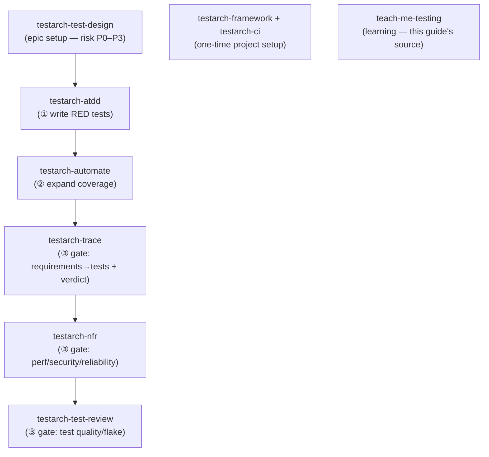
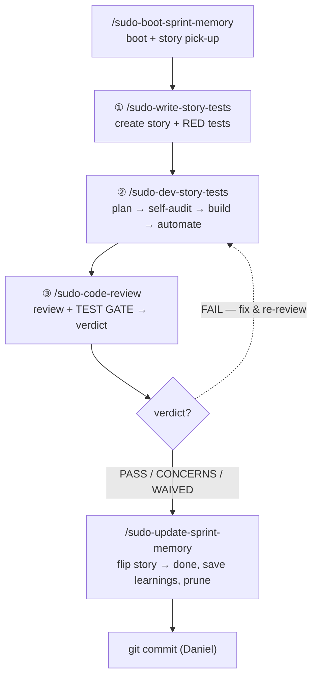
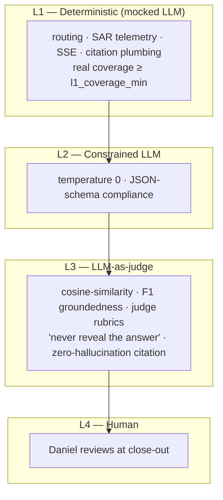

# TEA Testing — Quick Reference Guide

**Owner:** Daniel (Lead — Tech Lead / Engineering Manager)
**Source:** TEA Academy (Teach Me Testing, 7/7 sessions) + the `sudo-` dev-flow walkthrough, consolidated.
**Working anchor:** Epic 8 — Evolution Engine (`AGY_AVIATIONCHAT`)
**What this is:** the single page to keep open while writing tests, reviewing PRs, or running the dev loop. Two halves:
> **Part A — The Method** (TEA concepts: what to test, how much, what "good" means).
> **Part B — The Machine** (the `/` commands and the `sudo-` flow that execute the method).

---

# PART A — THE METHOD

## 0. The one-paragraph mental model

**TEA (Test Architecture Enterprise)** is a *method/playbook* layered on top of your existing tools (pytest, vitest, Playwright) — **not a replacement** for them. It is 9 workflows + a knowledge-fragment library + quality standards. The whole point is to make expert testing decisions *repeatable* so you don't have to be a testing expert to test well. Tests are **designed** before they're written, **maintained** like production code, and **allocated by risk** — not by line count.

> **The Lead reframe:** stop asking *"do we have enough tests?"* Ask *"do we have the **right** tests at the **right** priority levels, and are the P0 gates green?"*

**Engagement models (pick the entry point that matches team maturity):**
`Lite` (30-min quick start, immediate value) → `Solo` → `Integrated` → `Enterprise` → `Brownfield` (retrofit an existing untested codebase). Start at **Lite**; the same first move — `testarch-test-design` to risk-score P0–P3 — also bootstraps the Brownfield case.

---

## 1. "Where do I start?" — the decision tree

This is the answer to the most common beginner question. Run it on any feature, PR, or untested module.

```
1. What can break here?
   └─ List the decisions the code makes:
      defaults · auth checks · data transforms · ordering · privacy flags

2. What's the P-level of each decision?
   └─ Risk = Probability × Impact   (see §2)

3. Start at P0, work down.
   └─ 100% P0 coverage FIRST.  100% total coverage is NEVER the goal.
```

A test exists to **guard a decision that would hurt if it silently broke.** If breaking it wouldn't hurt, you probably don't need the test.

**Epic 8 example:** `GradingEvent.consent.export_eligible` defaults to `False`. If that silently flipped to `True`, student data becomes export-eligible without consent → a privacy breach. That's a P0 decision → it gets a dedicated test. Start there, not with the tooltip.

---

## 2. Risk Matrix — P0–P3 (the allocation engine)

**Risk = Probability × Impact.** Score each, prioritize where the product is highest.

| Dimension | Low | Medium | High |
|-----------|-----|--------|------|
| **Probability** (how likely to fail) | simple rendering | normal business logic | auth, privacy, complex transforms |
| **Impact** (what happens if it fails) | cosmetic only | user inconvenience, workaround exists | data loss, security, business failure |

| Priority | Meaning | Epic 8 examples |
|----------|---------|-----------------|
| **P0 — Critical** | Business fails if broken | `consent.export_eligible` default (privacy); tenancy wall (`test_tenancy_gate.py`); auth token validation |
| **P1 — High** | Major user pain, core workflows | grading event emitted on checkride; admin role claims enforced |
| **P2 — Medium** | Inconvenience, workaround exists | dataset pagination; graph overlays |
| **P3 — Low** | Minimal/cosmetic impact | tooltip animations, hover states |

**Test Priorities Matrix — which levels each P-level earns:**

| Priority | Unit | Integration | E2E | Manual | Coverage target |
|----------|:----:|:-----------:|:---:|:------:|:---------------:|
| **P0** | ✅ | ✅ | ✅ | ✅ | **100%** |
| **P1** | ✅ | ✅ | ✅ | — | **80%** |
| **P2** | — | ✅ | — | ✅ | **50%** |
| **P3** | — | — | — | ✅ | **20%** |

> **Lead code-review language:** *"What P-level is the decision this test pins?"* A PR with 0% P0 and 100% P3 coverage is a red flag regardless of line count.

---

## 3. Test Levels — the coverage pyramid

| Level | Covers | Speed | Epic 8 example |
|-------|--------|-------|----------------|
| **Unit** | isolated function/class; no external deps | ms | `test_grading_event.py` — schema defaults |
| **Integration** | multiple components; DB/service interaction | medium | `test_grading_event_writer.py` — writer + `mock_db` |
| **E2E** | full user workflow; real HTTP/browser stack | slow | `test_grading_event_dataset_api.py` — full HTTP via `TestClient` |

The P0 grading event is covered at **all three levels by design** — that's deliberate allocation, not accident:

```
P0: GradingEvent consent.export_eligible
├── Unit:        test_grading_event.py            ← schema defaults, no deps
├── Integration: test_grading_event_writer.py     ← write path, mock_db
└── E2E:         test_grading_event_dataset_api    ← full HTTP, admin governance
```

**Testability order:** test what's isolated first (schema), build up to full-stack (API). If a unit test needs no infra, it comes first.

---

## 4. Definition of Done — what a "good test" actually is

The **ceiling**, not just the floor of "tests pass":

1. **No flaky tests** — deterministic pass/fail. Re-running to see if it "clears" is a *bug*, not a workaround.
2. **No hard waits/sleeps** — `waitFor(condition)` not `sleep(5000)`. React to state; never guess timing.
3. **Stateless & parallelizable** — each test sets up and tears down its own world (the `get_db()` patch pattern in conftest is the reference impl).
4. **Self-cleaning** — tests delete/deactivate what they create; no manual DB resets.
5. **Low maintenance** — avoid brittle selectors; set state via APIs, not UI clicks.
6. **Near the source** — `grading_event.py` → `tests/.../test_grading_event.py` in a mirrored tree.

---

## 5. Test anatomy — Arrange → Act → Assert

Every test has the same shape. A test guards **one decision that matters.**

```python
def test_minimal_construct_defaults(self):
    # ARRANGE + ACT — construct the object
    event = GradingEvent(
        input=GradingEventInput(),
        label=GradingEventLabel(verdict="pass"),
        provenance=GradingEventProvenance(
            grader_name="checkride", served_model="gemini-3.5-flash", origin="exam"
        ),
    )
    # ASSERT — pin the decisions that would hurt if they broke
    assert event.event_id and len(event.event_id) == 32
    assert event.consent.export_eligible is False      # ← the P0 privacy guard
    assert event.consent.consent_status == "unknown"
```

---

## 6. Architecture & Patterns

### 6.1 Fixture composition
Define setup/teardown once, name it, compose by declaring dependencies. DRY + auto-cleanup even on crash + isolation (fresh instance per test).

```python
@pytest.fixture
def client_and_svc():
    import backend.routers.admin_auth as admin_auth_mod
    svc = AdminAuthService()
    admin_auth_mod._admin_auth_service = svc
    client = TestClient(app)
    try:
        yield client, svc
    finally:                                  # ← cleanup runs even if the test crashes
        admin_auth_mod._admin_auth_service = None
```
*Review Q:* "Is this setup duplicated, or centralized in a fixture? Does cleanup happen in `finally`?"

### 6.2 Mock-first / network-first
Set up the mock/intercept **before** triggering the action. Eliminates race conditions — the mock must exist before the code runs.

### 6.3 ⚠️ Patch at the import/use site, NOT the definition site
**The single most common Python mock bug.** Patch the name *as the module under test looks it up*, not where it's defined.

```python
# ❌ WRONG — definition site; the router's local name still points to the real function
patch("backend.services.grading_event_governance.query_grading_events")

# ✅ RIGHT — use site; the router resolves THIS name at call time
GOV_QUERY = "backend.routers.admin_governance.query_grading_events"
patch(GOV_QUERY)
```
*Review Q:* "Does this patch target the import site in the module under test, not the definition module?"

### 6.4 Data factories
Factory function with sensible defaults + keyword overrides → one update point when the schema changes.

```python
def _make_event(*, origin="teaching", grader="socratic", verdict="pass", ...) -> GradingEvent:
    return GradingEvent(...)

event      = _make_event()                 # all defaults
exam_event = _make_event(origin="exam")    # override only what matters
```
*Design smell:* if `_make_event()` needs 40 lines to build a "minimal" valid object, the **schema** is over-complicated.

### 6.5 Step-file architecture
Break complex workflows into micro-files: self-contained, loaded just-in-time, state tracked in a progress file, resumable from any point. (This very guide's TEA workflows run on it.) **Test analogy:** each test file = a self-contained step; fixtures = JIT setup; CI status = progress tracking; `-k`/`.only` = resume from any test.

---

## 7. TDD — ATDD vs. Automate

**The red phase is proof-of-test:** a test that passes *before* the code exists proves nothing.

| | **ATDD** (test-first) | **Automate** (coverage expansion) |
|-|----------------------|-----------------------------------|
| Order | Test → Code | Code → Test |
| Phase | Red → Green | Tests pass immediately |
| Use case | new feature, TDD discipline | brownfield coverage debt, gap-filling |
| Risk if skipped | implementation drift | unknown regressions |

**The red-green loop:** `Red` (write failing test) → `Green` (minimal code to pass) → `Refactor` (clean up, tests stay green) → `Repeat`. *Minimal means minimal* — let tests drive scope.

**Epic 8 live example (ATDD):** `test_faa_grounding_guard.py` was written (red) before `agents/specialist/agent.py` was wired up (green) — the FAA Grounding Guard story (TEA-4).

> **Lead frame:** know which mode you're asking your team for. "Write a failing test that drives the implementation" (ATDD) ≠ "we have working code, add coverage" (Automate). Different conversations, different success criteria.

---

## 8. Quality & Trace — auditing and the release gate

### 8.1 Test Review — 5 dimensions (0–100 each; overall = average)

| Dimension | Asks | Red flag |
|-----------|------|----------|
| **Determinism** | passes/fails consistently? | re-running to see if it "clears" |
| **Isolation** | runs independently? | passes alone, breaks in parallel |
| **Assertions** | checks are meaningful? | `assert resp is not None` (trivially true) |
| **Structure** | readable & organized? | 200-line test, no fixture composition |
| **Performance** | fast enough for feedback? | 45-min CI devs skip |

> A low **Isolation** score with everything else high is usually an *architecture* problem — shared fixture state or a missing `finally` cleanup.

### 8.2 Trace — requirements → tests → release gate

`Load acceptance criteria → Discover tests → Map criteria → Analyze gaps → Gate decision`

| Gate | Condition | Action |
|------|-----------|--------|
| 🟢 GREEN | all P0/P1 AC covered; gaps are P2/P3 | ship |
| 🟡 YELLOW | some P1 gaps | Lead assesses risk |
| 🔴 RED | **any P0 gap** | do NOT ship |

**Epic 8:** `test_tenancy_gate.py` is a Trace artifact — the tenancy wall (`scoped_user_query`) is a P0 AC ("no cross-school data leakage"). Delete it → Trace returns RED. That's why it's a CI merge-blocker.

### 8.3 Metrics — track vs. vanity

| ✅ Track (risk-based) | ❌ Vanity (misleading) |
|----------------------|------------------------|
| P0/P1 coverage % | total line coverage % |
| flakiness rate | number of tests |
| test execution time | test file count |
| determinism score | — |

> **"How much is enough?"** = *enough to hold every P0/P1 gate GREEN.* Line coverage tells you nothing; gate color tells you everything.

---

# PART B — THE MACHINE

## 9. The 9 TEA workflows & when each fires



| Workflow | Fires | Job |
|----------|-------|-----|
| **test-design** | once per epic (sprint planning) | risk-score the epic's work P0–P3 → tells ① which ACs deserve the heaviest tests |
| **atdd** | ① per story | write acceptance tests that MUST fail now (red) |
| **automate** | ② per story | expand API / UI / contract coverage on existing code |
| **trace** | ③ gate | map requirements → tests, coverage vs. floor, GREEN/YELLOW/RED verdict |
| **nfr** (nfr-assess) | ③ gate (if NFR/agent-bearing) | audit perf / security / reliability evidence |
| **test-review** | ③ gate | flake & quality audit of the tests themselves |
| **framework** | one-time | initialize the test bench (Playwright/Cypress/pytest) |
| **ci** | one-time | scaffold the CI/CD quality pipeline & gates |
| **teach-me-testing** | on demand | the TEA Academy (what produced this guide) |

---

## 10. Slash-command reference (`/` commands)

### TEA Test Architect — the persona
| Command | Does |
|---------|------|
| `/tea` | Activate **Murat**, the Master Test Architect & Quality Advisor — quality, NFR & test-strategy consult. Pass intent inline for direct dispatch. |

### TEA workflow commands (the 8 raw workflows)
| Command | Description |
|---------|-------------|
| `/testarch-test-design` | Create system-level or epic-level test plan (risk P0–P3). |
| `/testarch-framework` | Initialize test framework (Playwright/Cypress). |
| `/testarch-ci` | Scaffold CI/CD quality pipeline. |
| `/testarch-atdd` | ATDD — write **failing** acceptance tests before implementation. |
| `/testarch-automate` | Expand test automation coverage for existing code. |
| `/testarch-trace` | Generate traceability matrix + coverage analysis. |
| `/testarch-nfr` | Audit NFR evidence for performance, security, reliability. |
| `/testarch-test-review` | Review test quality against best practices (5 dimensions). |

### Learning
| Command | Does |
|---------|------|
| `/bmad-teach-me-testing` | The TEA Academy — 7 self-paced sessions. (Re-run Session 7 anytime to explore the 42 knowledge fragments.) |

### The `sudo-` dev-flow orchestrators (human lane — thin wrappers that call the TEA workflows in order)
| Command | One-line job |
|---------|--------------|
| `/sudo-boot-sprint-memory` | Where am I? What story is next? Which command do I run? (read-only) |
| `/sudo-write-story-tests` | ① Create the story, then write its **failing** acceptance tests. |
| `/sudo-dev-story-tests` | ② Plan → auto self-audit → build → drive tests green → automate. |
| `/sudo-self-audit` | Adversarial pre-dev audit of the plan (fires automatically inside ②). |
| `/sudo-code-review` | ③ Review the diff + run the **TEST GATE** → PASS/CONCERNS/FAIL/WAIVED. |
| `/sudo-update-sprint-memory` | Close-out: verify verdict, flip story → `done`, route learnings, prune. |
| `*_AP` variants | Autopilot lanes (`sudo-dev-story-tests_AP`, `sudo-code-review_AP`, `sudo-self-audit_AP`) — same ideas, different engine. |

### Supporting test commands
| Command | Does |
|---------|------|
| `/1_run-all-tests-back_front` | Run pytest + vitest (the gate's test runner in ③). |
| `/1_clean-test-scripts` | Tidy/remove scratch test scripts. |
| `/1_live_testing_team` | Live / manual QA lane. |

---

## 11. The `sudo-` dev flow — the human-driven story loop

The `sudo-` commands are **thin orchestrators** — they don't reimplement anything; they *call* the BMAD + TEA workflows in the right order and bake a **test gate** into review.



| Step | Command | Calls (TEA workflows) |
|------|---------|------------------------|
| boot | `sudo-boot-sprint-memory` | — (reads active-context + sprint-status, recommends next command) |
| ① | `sudo-write-story-tests` | `bmad-create-story` → `testarch-atdd` (+ optional `testarch-test-design`) |
| ② | `sudo-dev-story-tests` | `bmad-dev-story` (plan) → `sudo-self-audit` → `bmad-dev-story` (implement) → `testarch-automate` |
| ③ | `sudo-code-review` | `bmad-code-review` → `/1_run-all-tests-back_front` → `testarch-trace` → `testarch-nfr` → `testarch-test-review` |
| close | `sudo-update-sprint-memory` | — (reads ③'s verdict; only command that flips a story to `done`) |

> **Epic setup (once per epic):** run `testarch-test-design` at sprint planning to risk-score P0–P3. Same first move to retrofit an untested codebase.

### The TEST GATE (the heart of ③)
Opt-in and baseline-diff aware: a project with no `_bmad-output/sudo-tests.yaml` baseline **auto-WAIVED** (never blocks a test-less project); legacy red is grandfathered — only **NEW** regressions fail.

```yaml
# _bmad-output/sudo-tests.yaml  (per project that turns the gate on)
required_tiers: [L1, L2, L3]   # which pyramid tiers must be present
l1_coverage_min: 85            # deterministic branch/line coverage floor
agent_bearing: true            # story touches agent behavior → L3 judge required
nfr: false                     # also run the NFR audit
waive: false                   # hard override (force WAIVED)
```

| Verdict | Means |
|---------|-------|
| **PASS** | all required tiers green |
| **CONCERNS** | soft issues only |
| **FAIL** | NEW regression OR a required tier missing |
| **WAIVED** | no baseline (gate off) |

> Close-out (`sudo-update-sprint-memory`) only *reads* the verdict — it never re-runs tests. ③ is the only place a ship/no-ship decision is made.

---

## 12. The testing pyramid — L1–L4 (which tier each station exercises)

Deterministic code gets real coverage; generative LLM output gets **soft assertions**, never string-matching.



| Tier | Written / run by | When |
|------|------------------|------|
| L1 deterministic | `testarch-atdd` (①) + `testarch-automate` (②); run by `/1_run-all-tests-back_front` (③) | every story |
| L2 constrained | `testarch-automate` (②); checked in the gate (③) | every story |
| L3 judge | authored via `atdd`/`automate`; scored in `testarch-trace` / `nfr` (③) | agent-bearing stories |
| L4 human | `sudo-update-sprint-memory` close-out + live-test gate | close-out |

---

## 13. Lead code-review checklist (consolidated)

Print this. It's the whole curriculum compressed into the questions you ask on a PR.

**Risk & coverage**
- [ ] What P-level is each new decision, and does coverage match the matrix (P0 = all 3 levels; P3 = manual/skip)?
- [ ] Is there 100% P0 coverage? (Not "is line coverage high?")
- [ ] Would removing any of these tests leave a P0 gate RED?

**Test quality (the 5 dimensions)**
- [ ] Deterministic — no flaky tests, no `sleep()`/hard waits?
- [ ] Isolated — stateless, parallelizable, self-cleaning (`finally`)?
- [ ] Meaningful assertions — pins a real decision, fails for the right reason?
- [ ] Readable structure — setup centralized in fixtures, data built via factories?
- [ ] Fast enough that the team won't skip the suite?

**Patterns**
- [ ] Mocks patch the **import/use site** in the module under test, not the definition module?
- [ ] Mock set up **before** the action (mock-first)?
- [ ] Test lives near its source in the mirrored tree?

**Mode**
- [ ] New feature: was there a **failing** test before the implementation (ATDD red phase)?
- [ ] Coverage work: do new tests pass immediately (Automate)?

---

## 14. Epic 8 anchor index (verified real files)

| File | Level | Teaches |
|------|-------|---------|
| [test_grading_event.py](../../../Projects/AGY_AVIATIONCHAT/backend/tests/schemas/test_grading_event.py) | Unit | AAA shape; P0 privacy default `consent.export_eligible is False`; scores high on all 5 review dimensions |
| [test_grading_event_writer.py](../../../Projects/AGY_AVIATIONCHAT/backend/tests/services/test_grading_event_writer.py) | Integration | `mock_db` + `writer(mock_db)` fixture composition; `_make_event()` factory |
| [test_grading_event_dataset_api.py](../../../Projects/AGY_AVIATIONCHAT/backend/tests/routers/test_grading_event_dataset_api.py) | E2E | `client_and_svc` fixture (auto-cleanup); `GOV_QUERY` **use-site** patch; `TestClient` API pattern |
| [test_tenancy_gate.py](../../../Projects/AGY_AVIATIONCHAT/backend/tests/routers/test_tenancy_gate.py) | E2E | P0 Trace artifact; CI merge-blocker; RED gate if removed |
| [test_faa_grounding_guard.py](../../../Projects/AGY_AVIATIONCHAT/backend/tests/agents/specialist/test_faa_grounding_guard.py) | — | Live ATDD example (TEA-4): test written red before `agent.py` green |

> Paths in this section are relative to this guide's location. Inside the project repo, they are `backend/tests/...`.

---

## 15. TEA knowledge-fragment library (42 fragments)

Session 7 is a returnable reference. Re-run `/bmad-teach-me-testing` → Session 7 to deep-dive any fragment. Highest-value for a Lead: **Configuration & Governance** and **Quality Frameworks**.

**1. Testing Patterns (9)**
`fixture-architecture` · `fixtures-composition` · `network-first` · `data-factories` · `component-tdd` · `api-testing-patterns` · `test-healing-patterns` · `selector-resilience` · `timing-debugging`

**2. Playwright Utils (19)**
`overview` · `api-request` · `network-recorder` · `intercept-network-call` · `recurse` · `log` · `file-utils` · `burn-in` · `network-error-monitor` · `contract-testing` · `pactjs-utils-overview` · `pactjs-utils-consumer-helpers` · `pactjs-utils-provider-verifier` · `pactjs-utils-request-filter` · `pact-mcp` · `pact-consumer-framework-setup` · `pact-consumer-di` · `playwright-cli` · `visual-debugging`

**3. Configuration & Governance (6)**
`playwright-config` · `ci-burn-in` · `selective-testing` · `feature-flags` · `risk-governance` · `adr-quality-readiness-checklist`

**4. Quality Frameworks (5)**
`test-quality` · `test-levels-framework` · `test-priorities-matrix` · `probability-impact` · `nfr-criteria`

**5. Authentication & Security (3)**
`email-auth` · `auth-session` · `error-handling`

---

## 16. Glossary / one-line cheat sheet

| Term | One line |
|------|----------|
| **TEA** | Method/playbook on top of your tools — makes expert testing repeatable |
| **P0–P3** | Risk priority = Probability × Impact; P0 = ship-blocker, P3 = cosmetic |
| **AAA** | Arrange → Act → Assert; the shape of every test |
| **DoD** | No flaky, no hard waits, stateless, self-cleaning, low-maintenance, near source |
| **ATDD** | Test-first (red → green); the failing test is the proof-of-test |
| **Automate** | Coverage expansion on existing code (passes immediately) |
| **Use-site patch** | Patch the name as the module-under-test looks it up — not the definition |
| **Factory** | `_make_event(...)` — defaults + overrides; one update point |
| **Trace gate** | Requirements → tests → GREEN/YELLOW/RED ship decision |
| **5 dimensions** | Determinism · Isolation · Assertions · Structure · Performance |
| **L1–L4** | Deterministic → Constrained LLM → LLM-judge → Human |
| **TEST GATE** | The opt-in, baseline-diff gate inside `/sudo-code-review` (③) |

---

## 17. Reference links

**TEA documentation**
- Overview: https://bmad-code-org.github.io/bmad-method-test-architecture-enterprise/
- Testing as Engineering: …/explanation/testing-as-engineering/
- Risk-Based Testing: …/explanation/risk-based-testing/
- Test Quality Standards: …/explanation/test-quality-standards/
- Fixture Architecture: …/explanation/fixture-architecture/
- Network-First Patterns: …/explanation/network-first-patterns/
- Step-File Architecture: …/explanation/step-file-architecture/
- Workflows — Test Design / ATDD / Automate / Test Review / Trace: …/how-to/workflows/run-<name>/
- Knowledge base (42 fragments): https://github.com/bmad-code-org/bmad-method-test-architecture-enterprise/tree/main/src/agents/bmad-tea/resources/knowledge

**Local companions**
- TEA Academy session notes + certificate: `Projects/AGY_AVIATIONCHAT/_bmad-output/test-artifacts/tea-academy/Daniel/`
- Master command set: `.agents/commands/INDEX.md`
- Autopilot (`_AP`) lanes: `autopilot_bmad_dev_loop.md`
- Artifact/persistence model: `.agents/rules/artifacts-always-first.md`

---

*Generated from TEA Academy (7/7 complete) + the `sudo-` TEA-gated dev-flow walkthrough. The `sudo-` commands are thin orchestrators over the TEA workflows; the gate in ③ is the only ship/no-ship decision point.*
