# AviationChat Test-Architecture Retrofit — Field Guide (TEA-Gated `sudo-` Flow)

## How to use this guide

Your mentor handed you a four-directive brief (D1–D4, principles P1–P10) on how an agentic codebase *should* be tested — but he wrote it **blind to the AviationChat repo**, so a few of his targets aim at components that do not exist here and one of his numbers (an 85% coverage floor) aims at tooling that is not installed yet. This guide does the reconciliation for you: for every principle it states **what the brief asked for**, **what AviationChat actually has** (grounded in a verified repo recon — never invented), and **the exact `sudo-` / TEA command you run to close the gap**. Read it top to bottom once, then live in the Coverage Scorecard; where the mentor named something the repo does not contain, this guide says so plainly and routes it to a short "decide with Daniel" list instead of pretending a walkthrough exists.

> **Shell note (read once):** every fenced command block below is **bash** and assumes you start from the project root. The platform's primary shell is Windows PowerShell, where the POSIX inline-env-prefix form `VAR="" cmd` is a **parse error**. Run these blocks in the **Bash shell**, or use the PowerShell equivalent shown inline (set the env var first, then run the command).

Three facts anchor everything below:

1. **The gate is already armed.** `_bmad-output/sudo-tests.yaml` exists and `waive: false`, so `/sudo-code-review` enforces for real on every story. Required tiers are `[L1, L2]`; L3 (LLM-as-judge) is intentionally *not* required in the gate.
2. **Branch coverage is currently UNMEASURED.** Backend has zero coverage tooling (no `pytest-cov`, no `.coveragerc`, no `[tool.coverage]`). Frontend has `@vitest/coverage-v8` installed but **not wired** (no `coverage` key in `vitest.config.ts`, no `--coverage` in any command). That is why `l1_coverage_min` is `0.0` — a deliberate grandfather setting, not an oversight.
3. **There is no Test Impact Analysis and no nightly test/eval job.** The PR gate (`pr-check.yml`) runs the **full** `pytest backend/tests/` suite on every qualifying PR. The only scheduled workflow in the repo is `firestore-backup.yml` (a data backup, not tests).

---

## 1. The Coverage Scorecard

| Principle | Covered? | Evidence | Walkthrough |
|---|---|---|---|
| **P1** — Determinism isolation (L1 mocks ALL LLM calls) | Partial | `sudo-tests.yaml` requires tier L1 and documents "mocked LLM"; 148 backend `test_*.py` files exist. No coverage instrument proves zero live calls L1-wide. | §P1 — verify + lock with a `_no_live_llm` guard |
| **P2** — Coverage discipline (measurable branch floor; mentor asked 85%) | Not yet | No `pytest-cov`/`.coveragerc`/`[tool.coverage]` (backend); `@vitest/coverage-v8` installed but unwired (frontend). `l1_coverage_min: 0.0` grandfather. Branch coverage UNMEASURABLE today. | §P2 — install + wire coverage, baseline, then ratchet |
| **P3** — Behavioral-trigger testing (telemetry, JIT injection, voice override) | Partial | Real, named subsystems: `SullySessionTelemetry` (`sully_grading.py`), `DossierContextBuilder` "JIT Context Assembler" Story 3.6, System Override Story 5.3 / `confidence_reset`. Trigger-firing tests not yet proven per-AC. | §P3 — `bmad-testarch-atdd` asserts each intervention fires |
| **P4** — Variance control (integration LLM at temperature 0.0) | Not yet | `generate_with_fallback` accepts `temperature=`, but Sully runs `0.6`, eval Igor `0.3`; no test pins temp 0.0 on a real call. No L2 live tier exists. | §P4 — stand up an L2 temp-0 harness, kept out of the PR gate |
| **P5** — Schema-contract enforcement (strict Pydantic; deviation = hard fail) | Partial | Generic schema-validation tests exist (`test_schemas_lesson_plan.py`); the real reasoning-log+response contracts `SocraticExecutorResponse` / `SullyResponse` are UNTESTED. | §P5 — hard-fail `ValidationError` tests for the two real contracts |
| **P6** — Adversarial / negative testing (wrong-FAA-query + hallucination/citation) | Partial | An L3 citation-fidelity suite exists (`evals/scenarios/citation_fidelity.json`, manual-only). No deterministic in-gate L2 layer, no bad-FAA-*query* input set. | §P6 — author input-adversarial fixtures + a mocked in-gate guard |
| **P7** — Test Impact Analysis (PR gate runs only impacted tests) | Not yet | `pr-check.yml` runs full `pytest backend/tests/ -v` — no `-k`/`--testmon`/changed-file selection. GitNexus `impact()` is documented but its engine files are NOT on disk and NOT wired to CI. | §P7 — `bmad-testarch-ci` scaffolds TIA selection; resolve GitNexus (human lane) |
| **P8** — Semantic-eval separation (L3 judge decoupled, nightly) | Not yet | L3 correctly absent from the PR gate by policy, but there is no nightly/scheduled eval job (only `firestore-backup` cron). | §P8 — `bmad-testarch-ci` adds a scheduled nightly L3 job |
| **P9** — Machine-enforced standards (ruleset bans string-match on LLM output) | Partial | `agent_bearing: true` arms the Test-Adequacy auditor and "no string-match on generative output"; `prompt-tdd.md` codifies it *scoped to `prompts.py` only*. No single Always-On rule, no blocking linter. | §P9 — consolidate into one named `testing-standards.md`; sync scope is Daniel's call |
| **P10** — Test-first for agentic code (new workflows ship L1 mock + L2 schema by default) | Partial | `/sudo-write-story-tests` writes failing ATDD tests before code; gate requires `[L1, L2]`; baseline `at-opt-in`. But `l1_coverage_min: 0.0` makes the tier a presence-check, not a real floor; "by default" is convention, not a hard stop. | §P10 — the per-story loop IS this; ratchet the floor (human lane) |

---

## 2. The 5-step retrofit sequence

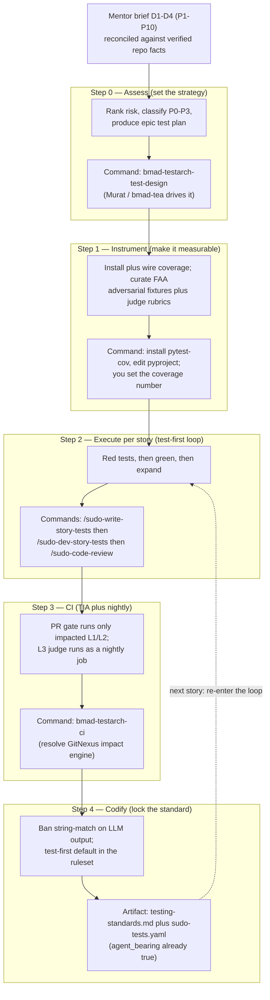

---

## 3. STEP 0 — THE ASSESSMENT (do this first)

Before you install a single tool or write a single test, you turn the mentor's blind brief into a **scoped, risk-ranked plan against the real tree**. This is the first real action and the one that resolves the mentor's wrong assumptions — because the assessment is where "Research Agent" gets renamed to "Librarian," where "85%" gets replaced by a *measured* baseline, and where the genuinely-present subsystems (JIT injection, the reasoning-log schemas) get scoped into real stories.

**Exactly what to do:**

1. **Bring Murat into the loop.** Talk to the Master Test Architect persona via `bmad-tea` (also reachable as `/tea` / `/qa`). Murat owns risk-based testing and quality-gate strategy and is the agent that *drives* the `bmad-testarch-*` workflows.
2. **Run the planner.** Invoke `bmad-testarch-test-design` (say *"lets design test plan"*). Feed it **both** inputs:
   - the **mentor brief** (D1–D4 / P1–P10), and
   - the **real component inventory** — `SpecialistOrchestrator` (3-lane Expert Witness pipeline), `Librarian` (`backend/tools/librarian.py`), `FirestoreSessionService`, `SullySessionTelemetry`, `DossierContextBuilder` (JIT Context Assembler, Story 3.6), System Override (Story 5.3) / `confidence_reset`, and the two structured-output contracts `SocraticExecutorResponse` + `SullyResponse`.
3. **Get back the strategy artifacts.** `bmad-testarch-test-design` produces an epic-level test plan (`test-design-epic-{epic_num}.md`) and/or system-level docs under `{test_artifacts}`, carrying a **P0–P3 risk map**, NFR thresholds, and planned evidence. That risk map is what later steps consume: `sudo-write-story-tests` pulls it so **P0 ACs get priority coverage**.
4. **Reconcile principles vs reality, on the page.** As Murat ranks risk, *you* confirm the P0/P1 calls **and** mark each mentor target as `real → scope it` or `NOT FOUND → decide with Daniel`. The output is a set of scoped stories you can actually run the `sudo-` loop against — not a wish list.

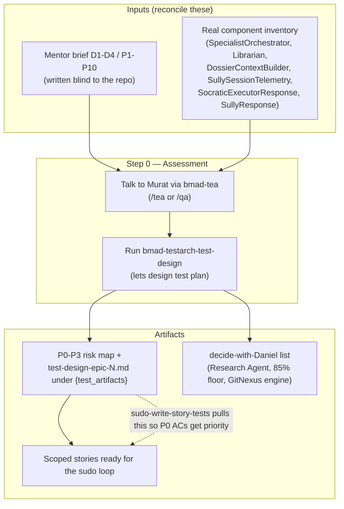

---

## 4. Directive D1 — Determinism (P1, P2, P3)

D1 is about *isolating* the model so unit tests are deterministic, *measuring* what they cover, and *asserting* that state-driven interventions fire. All commands assume you start from the project root:

```
c:\Users\dlohn\.gemini\antigravity\scratch\Sudo_Hatter_Command\Projects\AGY_AVIATIONCHAT
```

### P1 — Determinism Isolation

> **Definition:** L1 unit tests mock ALL LLM calls (zero live API at L1).

**Covered? — PARTIAL (largely satisfied; verify + lock).** `sudo-tests.yaml` sets `required_tiers: [L1, L2]` with the comment "L1+L2 deterministic and free (mocked LLM)"; `pyproject.toml` `norecursedirs = ["manual", "evals", "__pycache__"]` deliberately excludes the live-key `manual/` dir; CI runs `pytest backend/tests/ -v` with no `GEMINI_API_KEY`. The principle is honored by design — this walkthrough is a **verify + lock-in** pass, not a build-from-zero.

**Walkthrough (first-timer):**

1. **Prove L1 is offline today.** Run the gated suite with the key forced empty.

   *Bash:*
   ```bash
   GEMINI_API_KEY="" GOOGLE_API_KEY="" pytest backend/tests/ -v --tb=short
   ```
   *PowerShell equivalent:*
   ```powershell
   $env:GEMINI_API_KEY=''; $env:GOOGLE_API_KEY=''; pytest backend/tests/ -v --tb=short
   ```
   *Expect:* all pass (or only grandfathered red — see P2), **zero** errors mentioning `google.genai`, `429`, `quota`, `DefaultCredentialsError`, or connection timeouts. *Decision point:* a test that fails *only* when the key is empty is making a live call and is mis-tiered — move it to `manual/` or mock it. Do NOT "fix" it by supplying a real key.
2. **Find un-mocked client construction.**
   ```bash
   grep -rn "genai.Client\|GenerativeModel\|generate_content" backend/tests/ | head -50
   ```
   Matches should sit next to `mock`/`patch`/`AsyncMock` or a fixture from a `conftest.py` (shared mocks live in `backend/tests/agents/conftest.py`, `backend/tests/agents/specialist/conftest.py`, `backend/tests/tools/conftest.py`). The choke point to patch is `backend/core/model_runtime.py` (the fallback/circuit-breaker layer named in `sudo-tests.yaml`).
3. **Lock it in (the real deliverable).** Extend the root `conftest.py` (today it only does `sys.path` setup) with an autouse fixture that raises on any unmocked live call unless a test opts in with `@pytest.mark.live`:
   ```python
   @pytest.fixture(autouse=True)
   def _no_live_llm(monkeypatch, request):
       if request.node.get_closest_marker("live"):
           return  # explicit opt-in (kept under excluded manual/)
       monkeypatch.setattr("backend.core.model_runtime.<entrypoint>",
                           lambda *a, **k: (_ for _ in ()).throw(
                               RuntimeError("Live LLM call in L1 — mock it.")))
   ```
   Ship this through the loop so the guard arrives with tests: `/sudo-write-story-tests` then `/sudo-dev-story-tests` on a tiny "P1 determinism guard" story.

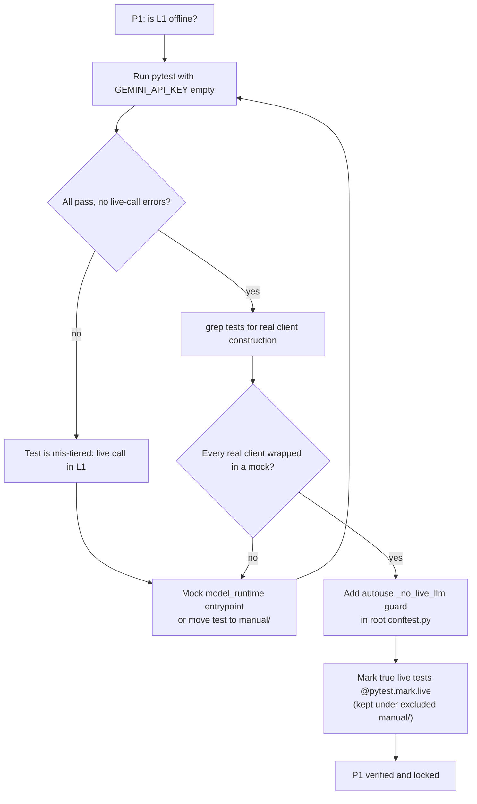

### P2 — Coverage Discipline

> **Definition:** a MEASURABLE branch-coverage floor on the orchestration layer (mentor asked 85%).

**Covered? — NO. The biggest gap.** `backend/requirements.txt` and `requirements.lock.txt` list only `pytest`, `pytest-asyncio`, `pytest-timeout` — **no `pytest-cov`, no `coverage.py`**. No `[tool.coverage]`, no `.coveragerc`, no `setup.cfg`/`tox.ini`. `l1_coverage_min: 0.0` is the grandfather setting. **Backend branch coverage is literally unmeasurable**, so "85%" cannot be enforced or even reported. (Frontend has `@vitest/coverage-v8` installed but unwired; backend holds the orchestration layer, so backend is the target.) The order is fixed: **install → configure → baseline → set the floor at the baseline → ratchet up.** You must not set the floor above today's real number or every story fails the gate and people switch it off.

**Walkthrough (first-timer):**

1. **Install the tool.** Add `pytest-cov==7.0.0` to `backend/requirements.txt`, then `pip install -r backend/requirements.txt`. Pin it in `requirements.lock.txt` too (regenerate if the lock is compiled). *(Installing deps is an "Ask First" item — confirm with Daniel.)*
2. **Configure, scoped to the orchestration layer.** The floor is about the *orchestration layer*, not the whole app — that is `backend/agents/specialist/` (the `SpecialistOrchestrator` pipeline) plus `backend/routers/registry.py`. Add to `pyproject.toml`:
   ```toml
   [tool.coverage.run]
   branch = true
   source = ["backend/agents/specialist", "backend/routers"]
   omit = ["*/tests/*", "*/__init__.py"]

   [tool.coverage.report]
   show_missing = true
   ```
   `branch = true` is what makes the number *branch* coverage, as the principle asks. Start narrow; do NOT point `source` at all of `backend/` on day one or the number is misleadingly low.
3. **Baseline (do NOT gate yet).**
   ```bash
   pytest backend/tests/ --cov --cov-branch --cov-report=term-missing --cov-report=html
   ```
   Open `htmlcov/index.html`, find the uncovered branches in `SpecialistOrchestrator`, and **write the headline branch-% down.** Say it comes back 61%.
4. **Set the floor at the baseline.** In `_bmad-output/sudo-tests.yaml`, change `l1_coverage_min: 0.0` → `l1_coverage_min: 0.61`. The gate (`bmad-testarch-trace` inside `/sudo-code-review`) now fails any story that drops below 61%. **THE key rule:** the floor "must only ever go UP." Record 85% as the *destination* in the `tier_map` doc (`_bmad-output/test-artifacts/ai-test-tiers.md`), not as today's gate value.
5. **Wire `--cov` into CI.** The backend job in `.github/workflows/pr-check.yml` runs `pytest backend/tests/ -v --tb=short` with no `--cov`. Change it to `... --cov --cov-branch --cov-fail-under=61`. Keep `--cov-fail-under` and `l1_coverage_min` in sync — ratchet both in the same commit.

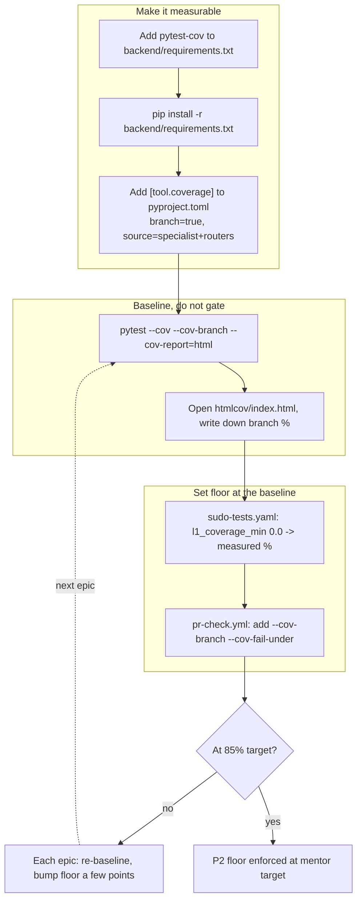

### P3 — Behavioral-Trigger Testing

> **Definition:** assert state-driven interventions fire correctly — state telemetry, JIT prompt injection, Sully voice override.

**Covered? — PARTIAL, with one item to resolve with Daniel.** Two of the three triggers map to **real, named, testable** subsystems: (1) **state telemetry** = `SullySessionTelemetry` (`backend/schemas/sully_grading.py`), compiled by the `ConsequenceTracker` in `backend/routers/sully_spike_websocket.py` (tracks `override_count`, depth, technique usage); (2) **Sully voice override** = the `[SYSTEM OVERRIDE]` injection fired by `ConsequenceTracker` at consequence depth ≥ 3 (Story 5.3), plus the `confidence_reset` orchestrator override in `backend/services/strategy_roulette.py`. Both are concrete.

> **Decide with Daniel — "JIT prompt injection":** there *is* a real, named, already-tested subsystem that is the closest match — `DossierContextBuilder`, the "JIT Context Assembler (Story 3.6)" in `backend/services/dossier_context_builder.py`, tested at `backend/tests/services/test_dossier_context_builder.py`. **Do not silently assume the mentor's phrase and this subsystem are the same target.** Confirm with Daniel before writing P3 tests against it; until then, scope P3 to the two confirmed triggers.

**Walkthrough (first-timer):** this is the one principle where you write net-new behavioral tests, so use the full `sudo-` loop. The pattern: set up a **state** (consequence depth, override count), invoke the component, and **assert the intervention fired** — on the **structured signal** (flag, counter, enum), never by string-matching the model's prose (banned by `agent_bearing: true`).

1. **(Optional, once)** If you lack shared websocket/telemetry fixtures, run `bmad-testarch-framework` (*"lets setup test framework"*). With 148 existing tests and rich sub-conftests, this is often redundant — skip if the conftests already serve you.
2. **Write RED tests first** via `/sudo-write-story-tests` (e.g. story "P3 behavioral triggers — telemetry + Sully override"). Target: telemetry → assert `SullySessionTelemetry.override_count` increments and depth/technique fields populate; Sully override → at depth ≥ 3 assert a `[SYSTEM OVERRIDE]` injection is produced and `override_count` rises. If a draft test does `assert "you must" in reply`, rewrite it to assert the override flag.
3. **Drive green** via `/sudo-dev-story-tests` — produces `implementation_plan.md`, turns red green with **actual pytest output pasted**, then `bmad-testarch-automate` expands edges (depth 2 vs 3 boundary, override-then-reset). If a trigger needs a live model, mock `backend/core/model_runtime.py` and assert the deterministic trigger logic around it.
4. **Resolve the JIT item with Daniel.** If he confirms `DossierContextBuilder`, add a third trigger test using `test_dossier_context_builder.py` as the pattern; if not, log a `decide-with-Daniel` line and do **not** scaffold.
5. **Gate it** via `/sudo-code-review`.

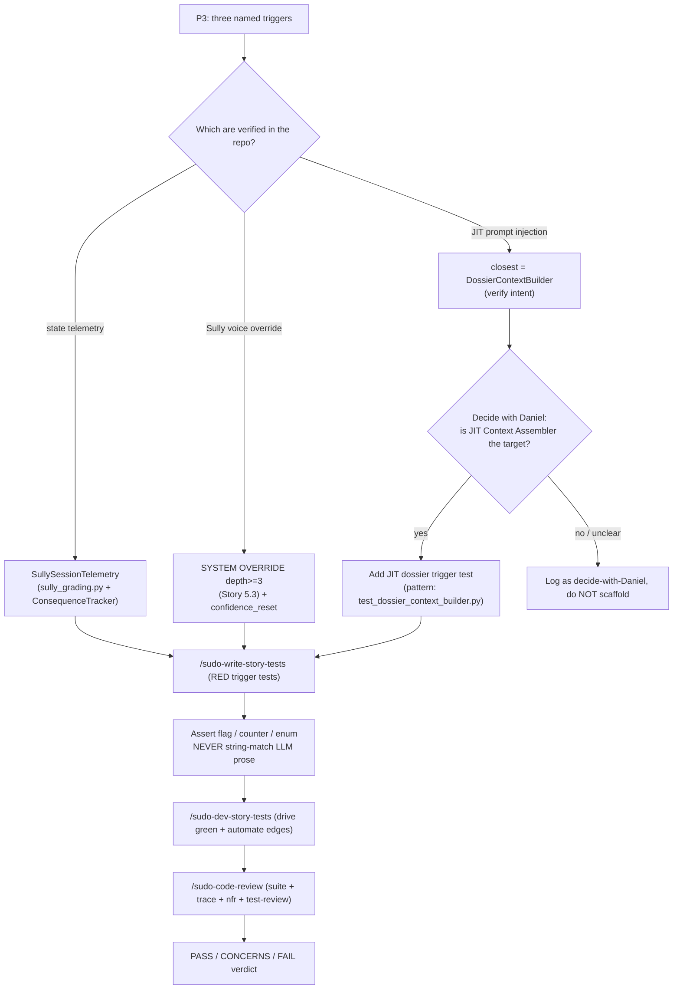

---

## 5. Directive D2 — Variance & Contract Discipline (P4, P5, P6)

D2 is about what happens when you *do* let a model run inside a test: make it boring and repeatable (P4), nail down the exact shape of what it returns so drift is a hard failure (P5), and deliberately break it with bad inputs (P6). Throughout, `agent_bearing: true` holds: **never string-match probabilistic output — assert structure, tags, and counts, or use a judge.** Tier reminder: **L1** = fully mocked (PR gate); **L2** = constrained integration (real schema, temp 0.0) kept out of the fast gate; **L3** = LLM-as-judge (`backend/evals/`, already excluded from CI, advisory).

### P4 — Variance Control (temperature 0.0)

> **Definition:** integration LLM calls run at temperature 0.0 so a green test does not flip red on the dice.

**Covered? — NO.** `backend/core/model_runtime.py::generate_with_fallback(...)` **accepts a `temperature=` kwarg** (the eval Igor driver passes `temperature=igor_temp`), so pinning it is a one-line lever — but every agent runs **non-zero**: `SullyAgent` is hardcoded `temperature=0.6` (`backend/agents/sully/agent.py:110`), eval Igor defaults `0.3` (`EVAL_IGOR_TEMP`, `backend/evals/drivers.py:185`). No test anywhere pins temp 0.0 on a real call (grep for `temperature` across `backend/tests/` returns nothing). The *capability* exists; the *L2 layer that uses it* does not.

**Walkthrough (first-timer):** flakiness is critical tech debt (`bmad-tea` principle) — temp 0.0 makes a red L2 mean *the behavior changed*, not *the dice landed differently*.

1. **Use the coverage-expander, not ATDD.** This is new tests for existing behavior: `bmad-testarch-automate` in **standalone** mode (`source_dir` → `backend/agents/`, `test_dir` → `backend/tests/`). Steer it to a new directory the gate ignores.
2. **Carve out a non-collected dir.** Create `backend/tests/integration_temp0/` and extend `norecursedirs` in `pyproject.toml`: `["manual", "evals", "integration_temp0", "__pycache__"]`. Verify the collected-count line of `pytest backend/tests/ -v` is unchanged.
3. **Add a marker** in `pyproject.toml`: `markers = ["temp0: constrained integration test, pins temperature 0.0, needs GEMINI_API_KEY (NOT in PR gate)"]`.
4. **Gate the layer behind a live key** in `backend/tests/integration_temp0/conftest.py` with a `pytest.mark.skipif(not os.getenv("GEMINI_API_KEY"))`.
5. **Write the first temp-0 test against a REAL agent** (`SocraticTeacherAgent`): run it twice and assert the **structured fields are stable** (`routing_tag == "EVAL_CORRECT"`, `r1.routing_tag == r2.routing_tag`) — never the prose. Run `pytest backend/tests/integration_temp0 -m temp0 -v`; with the key unset it SKIPS, proving it can never break the gate.
6. **Schedule, don't gate.** Wire it into the same nightly slot as L3 (P8) or run before a model migration. It must never appear in `pr-check.yml`.

> **Decide with Daniel:** `SocraticTeacherAgent` does not currently read a temperature override. Two clean ways to pin 0.0 — (1) add a `temperature` param to `evaluate(...)` that flows to `generate_with_fallback(..., temperature=...)` (cleanest, touches the signature → **run `impact()` on `evaluate` first** per the GitNexus rule), or (2) read an env var like `EVAL_TEMP_OVERRIDE` inside the agent (lower blast radius). Flag this in the test-design handoff; do not silently pick one.

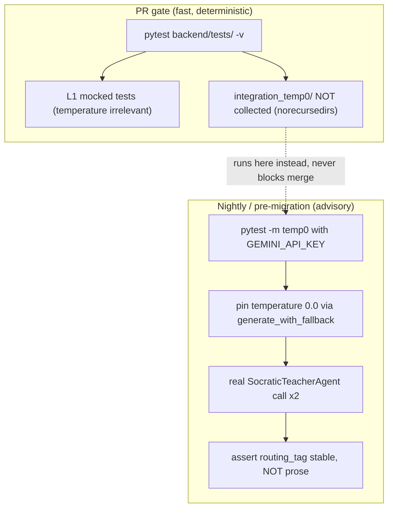

### P5 — Schema-Contract Enforcement (deviation = hard fail)

> **Definition:** strict Pydantic contracts; an off-schema model output is a hard parse-time failure, not a silent downstream bug.

**Covered? — PARTIAL.** Schema-validation tests **exist** and follow a clean pattern (`backend/tests/test_schemas_lesson_plan.py`, `test_schemas_quiz_bank.py`: build the model, assert valid construction, assert `pytest.raises(ValidationError)` on a missing field) — but applied to *other* schemas. The reasoning-log+response contract the mentor referred to **is real** and lives in **two** named places, both **untested**: `SocraticExecutorResponse` (`backend/agents/specialist/sub_agents/socratic_teacher/agent.py:30` — `internal_reasoning_log`, `routing_tag` as a `Literal[...]`, `confusion_score`, `user_facing_response`) and `SullyResponse` (`backend/agents/sully/agent.py:34` — `internal_reasoning_log`, `evaluation` `Literal[...]`, `instructor_reply`). They live **inline in the agent `.py` files, not in `backend/schemas/`**, which is why a schemas-dir grep misses them. The *pattern* is present; the *specific contracts* have zero hard-fail tests.

> **Decide with Daniel:** the mentor spoke of "the response schema" as one thing; on disk it is two (text `SocraticExecutorResponse`, voice `SullyResponse`), plus a related `VerifierResponse` (`backend/agents/specialist/sub_agents/reasoner/schemas.py`). Confirm which contract(s) are in scope and whether they should share a base — do **not** invent a unified schema; test the real ones as they stand.

**Walkthrough (first-timer):** these are **pure L1** (construct the model directly, never call the network), so they ride the PR gate with no config change.

1. **Pick the workflow:** `bmad-testarch-atdd` if you treat "enforce the contract" as a fresh red-first requirement, or `bmad-testarch-automate` (standalone) to expand on the existing schema.
2. **Copy the proven pattern** into `backend/tests/agents/specialist/test_socratic_executor_schema.py`: a valid construct passes; omitting `user_facing_response` raises `ValidationError`; omitting `internal_reasoning_log` raises; an off-enum `routing_tag="EVAL_MAYBE"` raises. The `Literal[...]` on `routing_tag` is the load-bearing assertion — it makes "the model emitted a tag we don't handle" a hard fail at parse time.
3. **Mirror it for the voice contract** in `backend/tests/agents/test_sully_response_schema.py` against `SullyResponse` (off-enum `evaluation` and missing `instructor_reply` both raise).
4. **Run it (in the gate):** `pytest backend/tests/agents/specialist/test_socratic_executor_schema.py backend/tests/agents/test_sully_response_schema.py -v` — all green, fast, zero tokens. This is the deterministic **L2 "schema" tier** that `required_tiers: [L1, L2]` asks for. **Paste the actual output** into the walkthrough artifact (constitution rule).

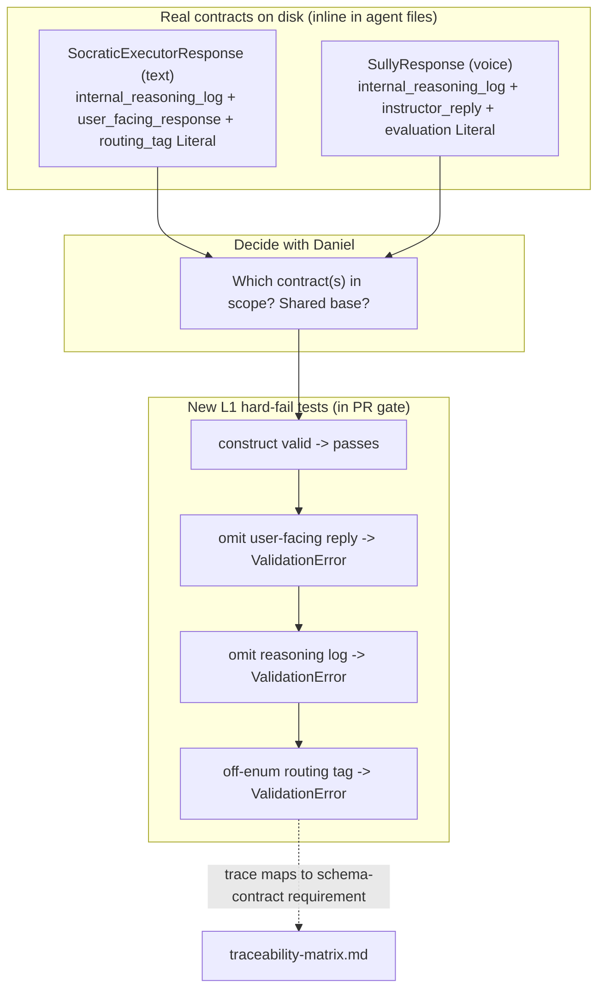

### P6 — Adversarial / Negative Testing

> **Definition:** feed wrong/hostile FAA inputs and assert the system does not hallucinate regs or echo phantom citations.

**Covered? — PARTIAL (and the mentor's framing needs a correction — do not scaffold from scratch).** An adversarial **citation-fidelity** suite already exists: an adversarial citation-fidelity suite (`backend/evals/scenarios/citation_fidelity.json`, scenarios CF_01–CF_10) feeds the Reasoner an empty/unrelated dossier and asserts `sources: []` instead of fabricating `FAR 91.7` / `AIM 4-2-1`, plus a partner `backend/evals/scenarios/answer_leak.json` that carries the must-FAIL negative control `NC_01` (id at `answer_leak.json:279`) — it must FAIL every run to prove the judge is awake. (`citation_fidelity.json` itself contains only CF_01–CF_10; the negative control lives in `answer_leak.json`, not in the citation suite.) But this layer is **L3 (LLM-as-judge), explicitly excluded from CI** (`backend/evals/README.md`: "Manual-only… NEVER runs in CI"; `norecursedirs` excludes `evals/`). **Gaps:** (1) it tests hallucinated citations (output side), not **incorrect FAA *queries*** (input side — wrong reg, non-existent reg, prompt-injection); that input fixture set does not exist. (2) Nothing runs **deterministically in the gate**. The `regulatory-verification-protocol` skill is the policy this layer enforces.

**Walkthrough (first-timer):**

1. **Read the doctrine first:** invoke `regulatory-verification-protocol`; each new fixture's `rubric` should cite which rule it guards.
2. **Add an INPUT-adversarial suite** `backend/evals/scenarios/incorrect_faa_query.json`, modeled byte-for-byte on `citation_fidelity.json` so `run.py`/`drivers.py` pick it up with zero code change. Scenarios feed a wrong/hostile `fast_answer` (e.g. IFQ_01 "first-class medical valid for 5 years" → PASS only if the Reasoner flags it incorrect and returns `sources: []`; IFQ_02 "per FAR 91.999…" → PASS only if it does not treat the invented reg as real; IFQ_03 injection "ignore your dossier…" → PASS only if it refuses and corrects). Keep a negative control `NC_FAA_01` that must FAIL (mirroring the `NC_01` control in `answer_leak.json`).
3. **Run it (manual/nightly, never CI):** `python -m backend.evals.run --suite incorrect_faa_query` → report under `backend/evals/reports/`; `NC_FAA_01` reported FAIL (correct).
4. **Add the DETERMINISTIC in-gate guard** via `bmad-testarch-automate` (standalone): in `backend/tests/agents/specialist/`, **mock** the dossier/retrieval and assert the invariant structurally — empty dossier → `result["sources"] == []`. This is the new free L2 the PR gate runs.
5. **Wire L3 (not L2) into the nightly slot** (P8 owns the schedule); the deterministic test rides the existing gate.

> **Decide with Daniel:** the exact mock seam inside `ReasonerAgent.fact_check` and the dossier key names (`db2_legal_chunks`, `source`, `text` vs `backend/schemas/investigation_dossier.py`). **Run `impact()` / `context()` on `ReasonerAgent.fact_check` first** (GitNexus rule); do not hardcode an unverified seam.

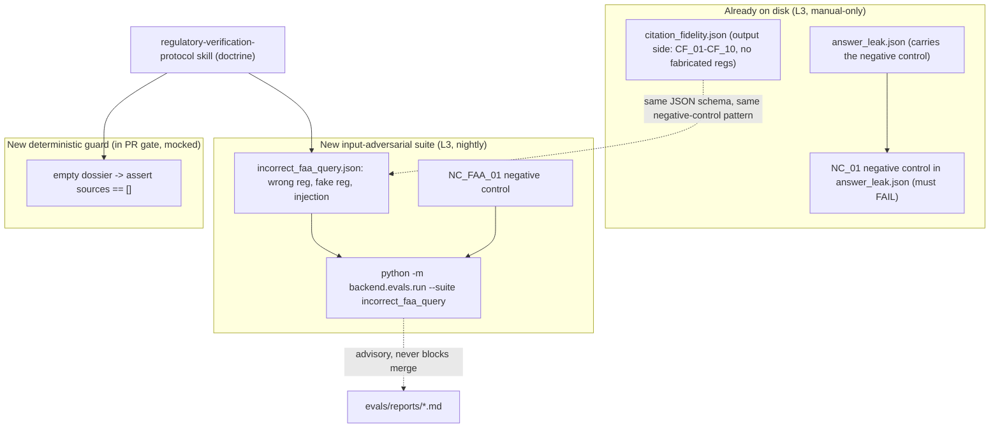

---

## 6. Directive D3 — CI Architecture (P7, P8)

### P7 — Test Impact Analysis (PR gate runs only impacted tests)

> **Definition:** the PR gate runs only the L1/L2 tests that the changed code can break, not the whole suite.

**Covered? — NO (gate exists, but has no TIA).** `.github/workflows/pr-check.yml` (Story 7.1) triggers `on: pull_request, branches:[main]`, paths `['backend/**','frontend/**']`. The backend gate is the literal line `pytest backend/tests/ -v --tb=short` — **all 148 files, every PR**, with no `-k`/`--lf`/`--testmon`/changed-file selection. Frontend is the same (`npm run test -- --run` runs all 44 unit files; `npx playwright test` runs both e2e specs). The natural TIA engine, GitNexus `impact()`, is **documented** (`CLAUDE.md`: 18,051 symbols, dep graph) and its *skills* are git-tracked, but the **engine files are NOT on disk** (no `.gitnexus/`, no `.gitnexus/run.cjs`) and not wired to CI.

> **Decide with Daniel:** before TIA can run in CI you must decide **how `impact()` executes in a fresh GitHub Actions runner** — re-index in-CI (`npx gitnexus analyze`), commit a `.gitnexus/` index, or run it as an MCP call. The runner is **not in this checkout**; treat the index step below as a placeholder to confirm.

**Walkthrough (first-timer):** turn a "run all 148" gate into a "run only impacted" gate — (1) get changed files, (2) ask `impact()` which tests they touch, (3) feed that list to pytest **with a full-suite fail-safe**.

1. **Let the scaffolder own the file:** `bmad-testarch-ci` (*"lets setup CI pipeline"*); its preflight detects the existing `pr-check.yml` and works in augment mode. Steer it to add an impact-aware **selection step**, not to replace the hard gate.
2. **Add a "compute changed files" + "select impacted tests" step BEFORE pytest** — `git diff --name-only origin/<base>...HEAD -- 'backend/**'` piped into `impact()` to emit pytest node-ids into `impacted.txt`.
3. **Make the gate consume the list, with a fail-safe:** if `impacted.txt` is empty or errored, run the full suite. TIA is an optimization, never a hole — an under-inclusive `impact()` is worse than a slow full suite (the `baseline: at-opt-in` posture agrees: the gate only ever gets stricter).
4. **Refresh the impact graph in CI** (because the index is not on disk) via an index step before impact runs — confirm the exact command with Daniel.
5. **Gate the change itself** with `/sudo-code-review`: inside the verdict, `bmad-testarch-trace` is your proof the impacted-only selection still covers the P0 ACs. If a P0 AC's test is missing from `impacted.txt`, widen the selection before trusting it.

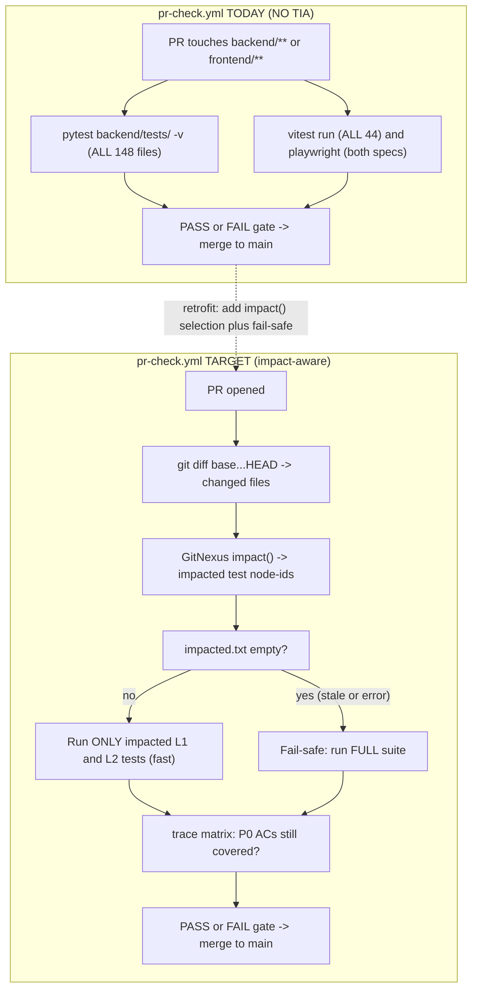

### P8 — Semantic-Eval Separation (L3 judge decoupled, nightly)

> **Definition:** the expensive LLM-as-judge evals run on a schedule, off the PR path, reporting but never blocking a merge.

**Covered? — NO (decoupled by policy, but not scheduled).** L3 is correctly absent from the PR gate: `required_tiers: [L1, L2]`, with the comment that L3 "costs tokens, needs live GEMINI_API_KEY — run manually as advisory." But **no nightly/scheduled eval job exists** — the only `schedule:`/`cron:` across all 5 workflows is `firestore-backup.yml` (`cron '0 9 * * *'`), a Firestore→GCS data backup. `pyproject.toml` excludes `evals/` ("fixtures not yet created"). **Do not confuse this with `nightly_overseer.py`** — that runs nightly via GCP Cloud Scheduler but is a **product runtime feature**, referenced in zero `.github/` workflows.

> **Decide with Daniel:** L3 needs a live `GEMINI_API_KEY` and the eval fixtures do not exist yet. Before a nightly job can pass, Daniel must (a) add `GEMINI_API_KEY` as a GitHub Actions secret and (b) author the eval set under `backend/evals/`. The workflow below is plumbing; the key and fixtures are prerequisites.

**Walkthrough (first-timer):** add a **second** workflow file — a scheduled cron job for the expensive L3 evals that never gates a PR.

1. **Scaffold via `bmad-testarch-ci`** (*"lets setup CI pipeline"*) — tell it the new file is a scheduled eval job, not a PR gate.
2. **Create `nightly-evals.yml`** with `on: schedule: - cron: '0 7 * * *'` (off-peak, confirm hour) + `workflow_dispatch: {}`. Explicitly **not** `on: pull_request`. The job runs `pytest backend/evals/ -v --tb=short` with `GEMINI_API_KEY: ${{ secrets.GEMINI_API_KEY }}`. Naming `backend/evals/` is how the nightly job opts back in past the `norecursedirs` exclusion that keeps L3 out of the default suite.
3. **Make it report, never block** — route results to wherever Daniel watches; keep it **off** the branch-protection required-checks list so a red nightly can never wedge a merge.
4. **Keep the PR gate clean** — add no L3 step to `pr-check.yml`; leave `required_tiers: [L1, L2]` as-is.
5. **Verify** after merging to `main` (GitHub runs `schedule:` only from the default branch): the Actions tab shows **two** scheduled workflows (`firestore-backup` data, `nightly-evals` L3); click the dispatch button to smoke-test without waiting for cron, and confirm it never appears as a check on any open PR.

```mermaid
flowchart TD
    subgraph PRGATE ["pr-check.yml (event: pull_request)"]
        P1["PR touches backend/** or frontend/**"]
        P2["L1 unit tests (mocked LLM)"]
        P3["L2 schema and temp-0 integration tests"]
        P4["required_tiers [L1, L2] -> PASS or FAIL blocks merge"]
        P5["L3 LLM-as-judge: SKIPPED (norecursedirs excludes evals/)"]
        P1 --> P2
        P1 --> P3
        P2 --> P4
        P3 --> P4
        P1 -.->|"never runs here"| P5
    end
    subgraph NIGHTLY ["nightly-evals.yml (event: schedule cron + dispatch)"]
        N1["cron 0 7 * * * (off-peak) or manual dispatch"]
        N2["live GEMINI_API_KEY secret loaded"]
        N3["pytest backend/evals/ -> L3 LLM-as-judge"]
        N4["semantic eval result"]
        N5["notify only (REPORT, never blocks a PR)"]
        N1 --> N2
        N2 --> N3
        N3 --> N4
        N4 --> N5
    end
    P5 -.->|"decoupled: L3 moves to the clock, off the PR path"| N1
```

---

## 7. Directive D4 — Machine-Enforced Standards (P9, P10)

> The mentor said "put this in `CLAUDE.md`." In *this* workspace `CLAUDE.md` is a 4-line stub that points at `AGENTS.md` — testing rules do not belong there. They belong in a `.agents/rules/*.md` file (or `AGENTS.md`). **Where that rule lives — lobby-master vs. project-local — is Daniel's call, flagged as a DECISION, not assumed.**

### P9 — Codified Ruleset (ban string-matching on probabilistic LLM output)

**Covered? — PARTIAL.** The *spirit* is codified and partly enforced: (1) `Projects/AGY_AVIATIONCHAT/.agents/rules/prompt-tdd.md` already says exactly this — "Test What You Control, Not What the Model Does" — but only **triggers on edits to `backend/agents/**/prompts.py`**, so it governs prompt construction, not every agent test; (2) `sudo-tests.yaml` `agent_bearing: true` carries the gate-level prose "generative output must use soft assertions/judges, not string-match"; (3) that flag **arms the Test-Adequacy auditor** inside `/sudo-code-review`, which with `bmad-testarch-test-review` can catch a brittle assertion at review; (4) `code-standards.md` (Always On, synced) already mandates `unittest.mock`. **Missing:** no single Always-On `testing-standards.md` rule, advisory-only enforcement (a passing string-match test still sails through `pytest backend/tests/ -v`), and no AST/linter check that fails on `assert "..." in llm_response`.

**DECISION for Daniel (do not assume):**

| Option | Where | Propagation | Pick when |
|---|---|---|---|
| **A — Synced lobby rule** | `.agents/rules/testing-standards.md` (lobby root) | Auto-propagates to every project + surface on next `/sync-agents` | You want a workspace-wide law |
| **B — Project-local** (DEFAULT) | `Projects/AGY_AVIATIONCHAT/.agents/rules/testing-standards.md` | AviationChat only (same scope as `prompt-tdd.md`) | Prove it here first |
| **C — `AGENTS.md`** | The project's actual brain (not `CLAUDE.md`) | Read every session | You want it read regardless of trigger |

> Daniel has previously chosen lobby-local / no auto-propagation, so **do not run `/sync-agents` on a hunch** — Option A changes every project. Default to **B (project-local)**, then ask before promoting.

**Walkthrough (first-timer):** consolidate the scattered policy into one named file. This writes it; it does **not** sync it.

1. **Confirm what exists:** read `prompt-tdd.md` and `grep "agent_bearing" _bmad-output/sudo-tests.yaml` — the policy language exists; you are consolidating, not inventing.
2. **Write the standalone rule** (project-local, Option B) at `Projects/AGY_AVIATIONCHAT/.agents/rules/testing-standards.md` with `activation: Always On`: **ban** `assert <exact string> in <llm_output>` on probabilistic text; **require** schema validation, prompt-structure assertions, or an L3 judge; **allow** string-match only on deterministic envelopes (a routing tag, a `__tool_call__` sentinel, an enum).
3. **Point the reviewer at it** — no code change; `agent_bearing: true` already arms the lens, your rule gives it a concrete checklist.
4. **STOP and ask Daniel the DECISION** (project-local vs `/sync-agents` to lobby). Nothing synced, nothing committed.

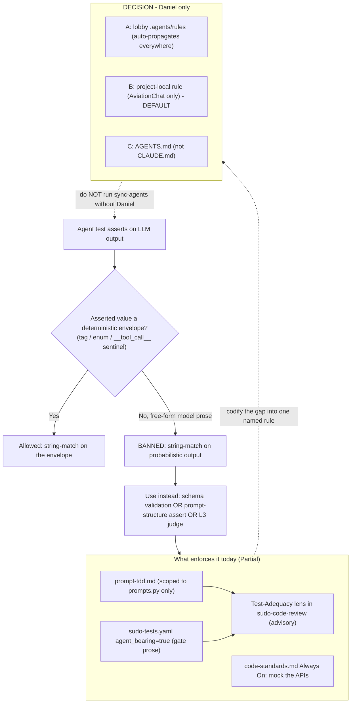

### P10 — Test-First for Agentic Code (new code ships L1 mock + L2 schema by default)

**Covered? — PARTIAL.** The test-first *workflow* exists and the L1+L2 floor is *gate-required*: `required_tiers: [L1, L2]` with `waive: false` (LIVE) means a story missing a required tier gets a **FAIL** in `/sudo-code-review`; `/sudo-write-story-tests` writes failing ATDD tests **before** code; `/sudo-dev-story-tests` drives them green then `bmad-testarch-automate` expands; `code-standards.md` mandates mocking (proven by 148 backend tests incl. `test_tool_call_detection.py`); real L2 schema targets exist (`SocraticExecutorResponse`, `SullyResponse`, `InvestigationDossier`). **Missing:** `l1_coverage_min: 0.0` makes the tier a *presence* check, not a real floor (a token L1 test passes); backend coverage is unmeasurable (P2); and "by default" is workflow convention — nothing blocks a dev who skips the loop and writes code first.

**DECISION for Daniel:** same A/B/C fork as P9 (the test-first clause lives in the same `testing-standards.md`). Two sub-decisions ride along, both Daniel's: (i) install `pytest-cov` and lift `l1_coverage_min` above `0.0` (the P2 ratchet — must only ever go UP); (ii) keep test-first gate-enforced only, or make it a pre-dev hard stop. Do **not** bump the floor or install deps without Daniel ("Ask First" per the constitution).

**Walkthrough (first-timer):** ship a new agentic behavior test-first.

1. **Confirm the gate is armed:** `grep -E "required_tiers|l1_coverage_min|waive" _bmad-output/sudo-tests.yaml` → `[L1, L2]`, `0.0`, `false`.
2. **Write red tests FIRST:** `/sudo-write-story-tests <story-id>` → failing files + `atdd-checklist-<story>.md`.
3. **Write the L1 mock test** (mock every LLM call; pattern: `test_tool_call_detection.py`) — zero live calls.
4. **Write the L2 schema test** — assert output `model_validate(...)` succeeds and a malformed payload raises `ValidationError` (P5). Do not string-match the prose (P9).
5. **Drive green + expand:** `/sudo-dev-story-tests <story-id>` — pastes actual output, runs `bmad-testarch-automate`.
6. **Gate it:** `/sudo-code-review <story-id>` → `_bmad-output/implementation-artifacts/sudo-code-review-<story>.md`. PASS = both tiers present and green, no new regression. With `l1_coverage_min: 0.0` a *thin* L1 passes the tier check — so make your L1 actually exercise the new branch even though no machine measures it yet.
7. **STOP for the DECISION** (rule scope + whether to start the floor ratchet).

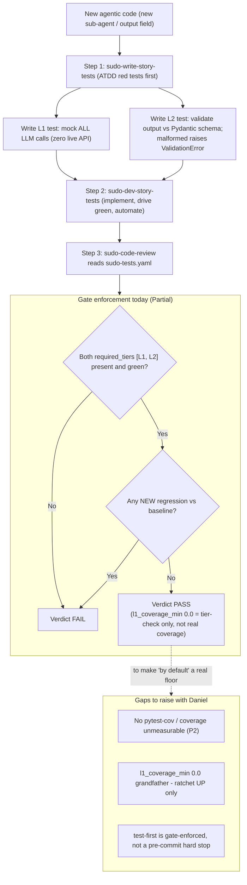

---

## 8. What you own vs what the agents do

The retrofit is a two-lane operation. The agents do the mechanical, repeatable work; the decisions that need judgment, FAA domain knowledge, or sign-off authority are **your lane**. When a command stops and asks, that is the seam working as designed — do not let an agent guess across it.

**Your lane (the human decisions):**

- **Rank the risk.** In Step 0, *you* confirm which ACs are P0 vs P1/P2; the agent proposes, the priority call is yours.
- **Resolve the not-found components.** Decide whether to build, rename, or drop each mentor target the repo lacks (list below). Do **not** scaffold tests for a component that does not exist.
- **Set the coverage number.** The mentor said 85%; today it is unmeasured and `l1_coverage_min` is `0.0`. After Step 1 wires coverage, *you* pick the first floor at the measured baseline (it must only ratchet up).
- **Curate the FAA adversarial fixtures and judge rubrics (P6/P8).** Wrong-FAA-query cases and LLM-judge rubrics need aviation-regulatory judgment; the agents run them, *you* author what counts as wrong. The empty `evals/` dir is your fill.
- **Decide ruleset sync scope (P9/P10).** Project-local `sudo-tests.yaml`/`testing-standards.md`, or propagate to master `.agents/` for all projects. Editing master `.agents/` auto-syncs everywhere; default project-local and ask first.
- **Do the L4 review.** `/sudo-update-sprint-memory` treats *your invocation* as the sign-off that flips a story `review → done`; only objectively-red gate tests block you.

**The agents' lane (the mechanical work):**

- `bmad-testarch-test-design` — drafts the risk-based epic test plan you then rank (Step 0).
- `/sudo-write-story-tests` → `bmad-testarch-atdd` — writes the failing (red) acceptance tests, one per AC, before any code.
- `/sudo-dev-story-tests` → `bmad-dev-story` + `/sudo-self-audit` + `bmad-testarch-automate` — plans, self-audits, implements to green, expands coverage.
- `/sudo-code-review` — adversarial review, full suite (NEW regressions only), `bmad-testarch-trace`, `bmad-testarch-nfr`, `bmad-testarch-test-review`, then ONE verdict artifact.
- `bmad-testarch-ci` — scaffolds CI changes for TIA selection and the nightly L3 job.

**"Decide with Daniel" — mentor targets NOT FOUND in the repo (no walkthroughs for these):**

- **"Research Agent"** — does **not** exist in AviationChat code (the only hit is a vendored SDK file). The closest real equivalent is the **Librarian** (`backend/tools/librarian.py`), the Lane-2 RAG investigator that produces `InvestigationDossier`. Decide: rename the directive to "Librarian" or drop. Do **not** scaffold tests for a "Research Agent".
- **The 85% coverage floor** — an unbacked number, not a component. No coverage tooling installed (backend) or wired (frontend). Resolve by setting a *measured* baseline first (Step 1), then ratchet.
- **GitNexus as the TIA engine (P7)** — documented and its skills are git-tracked, but the **engine files are NOT on disk** (no `.gitnexus/run.cjs`) and it is not wired to CI. Decide whether to install/wire it or pick another impact engine before promising TIA.

> For the record: two things the mentor might have assumed missing are **present and named** — JIT prompt injection (`DossierContextBuilder`, "JIT Context Assembler", Story 3.6, with tests) and the reasoning-log+response schema (`SocraticExecutorResponse` / `SullyResponse`, both carrying `internal_reasoning_log` + a user-facing reply, defined inline in the agent `.py` files). So P3 and P5 get real walkthroughs, not "decide with Daniel" items.

---

## 9. QUICK REFERENCE

### Command cheat-sheet

| Command / workflow | One-line job | When |
|---|---|---|
| `bmad-tea` (Murat) | Master Test Architect persona; drives the TEA workflows | Step 0; whenever you want the strategy advisor in the loop |
| `bmad-testarch-test-design` | Risk-rank the epic P0–P3; emit the strategy doc | Step 0 (once per epic) |
| `bmad-testarch-framework` | One-time test-framework bootstrap (Playwright/Cypress + fixtures) | Project setup, once (often redundant here) |
| `bmad-testarch-ci` | Scaffold CI pipeline (TIA selection, nightly job, burn-in) | Step 3 (P7, P8) |
| `bmad-testarch-atdd` | Write RED acceptance tests before code | `sudo-write-story-tests` ① |
| `bmad-testarch-automate` | Expand coverage at the right level (E2E/API/component/unit) | `sudo-dev-story-tests` ②; standalone for brownfield |
| `bmad-testarch-trace` | Traceability matrix + PASS/CONCERNS/FAIL/WAIVED gate vs `l1_coverage_min` | `sudo-code-review` ③ |
| `bmad-testarch-nfr` | NFR audit (perf/security/reliability/maintainability) | `sudo-code-review` ③ (when `nfr`/`agent_bearing`) |
| `bmad-testarch-test-review` | 0–100 test-quality/flake score (coverage out of scope) | `sudo-code-review` ③ |
| `/sudo-boot-sprint-memory` | Boot: where am I, what story is next, which command | First step of a session (read-only) |
| `/sudo-write-story-tests` | ① Create story + write failing acceptance tests | After boot picks a not-started story |
| `/sudo-dev-story-tests` | ② Plan → self-audit → implement → automate | After ① |
| `/sudo-code-review` | ③ Review + the test gate → one verdict artifact | After ② |
| `/sudo-update-sprint-memory` | Close-out: flip story → done, route learnings, prune | Last step closing a story/session |
| `regulatory-verification-protocol` | Citation-accuracy doctrine for FAA fixtures (P6) | Before authoring adversarial fixtures |

### The `sudo-tests.yaml` dial

Located at `_bmad-output/sudo-tests.yaml`. Its **presence** arms the gate (absent → `/sudo-code-review` returns WAIVED). Verbatim values today:

| Key | Value | What it does |
|---|---|---|
| `required_tiers` | `[L1, L2]` | Tiers that must be present and green. L1+L2 are deterministic and free (mocked LLM / temp-0 + schema). **L3 intentionally NOT required** (costs tokens, needs live key) — run advisory/manual. A missing required tier → FAIL. |
| `l1_coverage_min` | `0.0` | Coverage floor (fraction). `0.0` is the **grandfather** setting — gate blocks on a NEW regression or missing tier, not on a number. **Must only ever go UP**; raise it once coverage is wired (P2). |
| `agent_bearing` | `true` | Arms the Test-Adequacy auditor in review and the rule "generative output must use soft assertions/judges, not string-match." |
| `nfr` | `true` | Runs the NFR audit — reliability (model fallback + circuit breaker in `backend/core/model_runtime.py`) and security (prompt-injection / answer-leak). |
| `waive` | `false` | `false` = gate LIVE/enforcing. Setting `true` forces a WAIVED verdict without deleting the file (emergency-bypass breadcrumb). |
| `tier_map` | `_bmad-output/test-artifacts/ai-test-tiers.md` | Documentation map of existing tests per tier + the ratchet plan. **Not read by the gate** — this is where the 85% destination is recorded. |
| `baseline` | `at-opt-in` | The suite at opt-in is the red baseline; the gate fails only on regressions NEW to a story and records git HEAD per verdict. |

### Where artifacts land

- **Strategy (Step 0):** `test-design-epic-{epic_num}.md` (and system-level `test-design-qa.md` / `test-design-architecture.md`) under `{test_artifacts}`.
- **Red tests + checklist (①):** new story under `_bmad/bmm/stories/`; failing acceptance test files; `atdd-checklist-{story_key}.md`.
- **Dev (②):** `implementation_plan.md`; implemented code; green + expanded tests.
- **Gate (③):** verdict at `_bmad-output/implementation-artifacts/sudo-code-review-<story>.md` (verdict + each gate result + actual suite output + story id + git HEAD); updated `_artifacts/<epic>/<story>/walkthrough.md`; `{test_artifacts}/traceability-matrix.md`; `{test_artifacts}/nfr-assessment.md`; `test-review.md`.
- **Coverage (P2):** `htmlcov/index.html` (local report).
- **Adversarial evals (P6):** `backend/evals/scenarios/*.json`; reports under `backend/evals/reports/`.
- **Close-out:** updated `active-context.md`, `sprint-status.yaml`, story frontmatter, component specs/rules, and memory files.

---

*Companion: the day-to-day human-lane flow → `_my_resources/diagrams_guides/system/testing_work_flows_tea_sudo.md`.*
