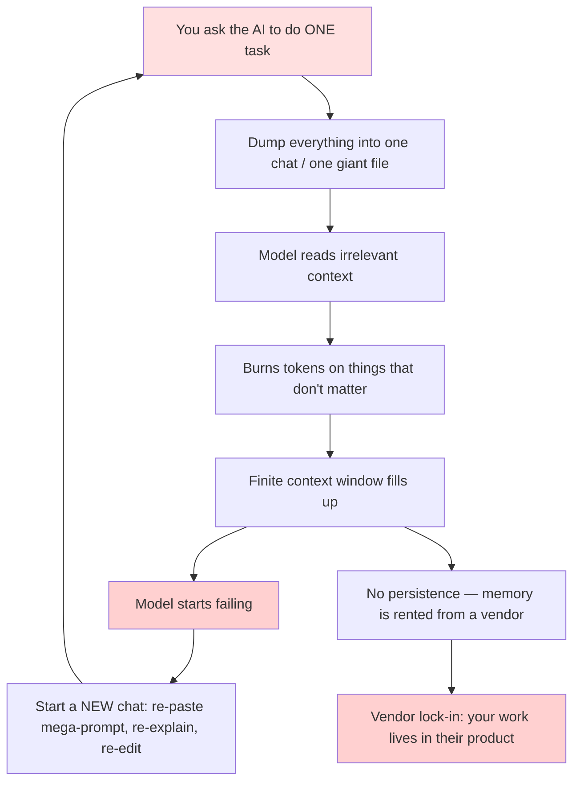
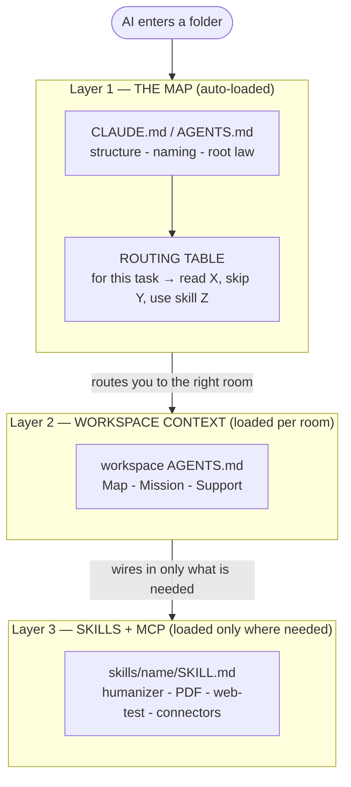
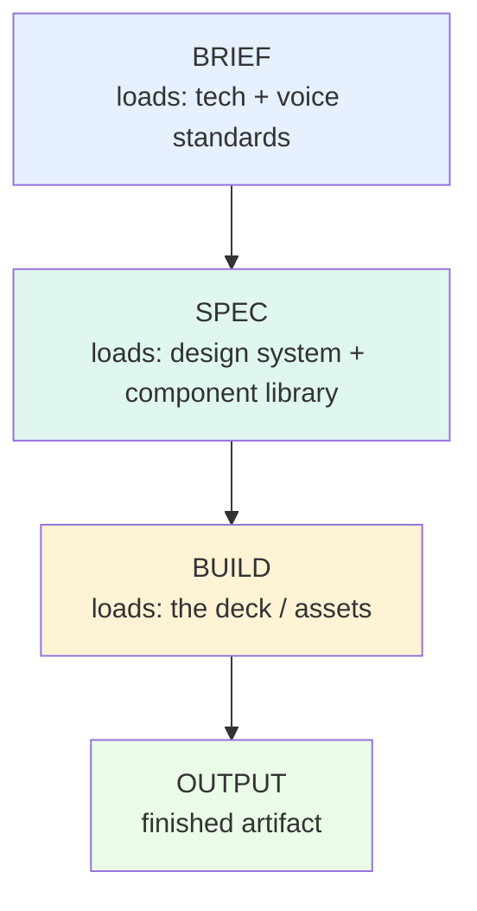
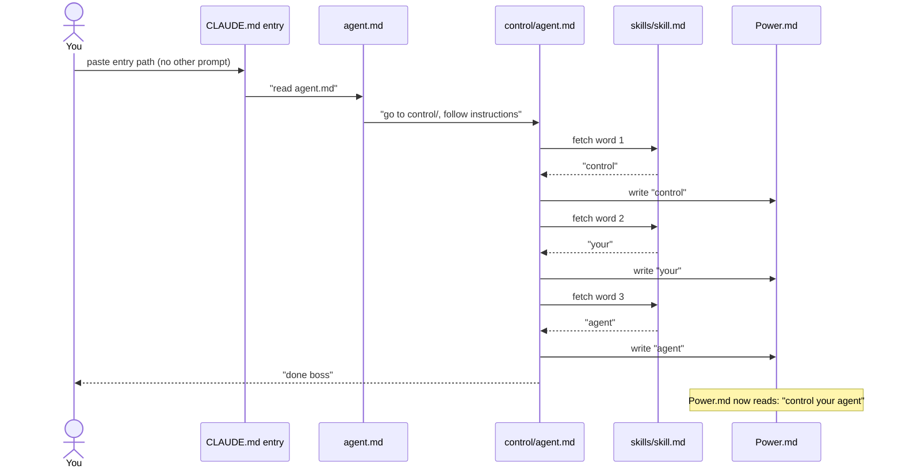
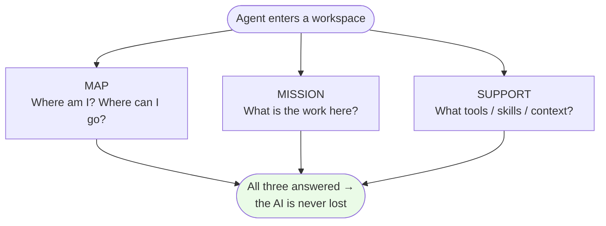
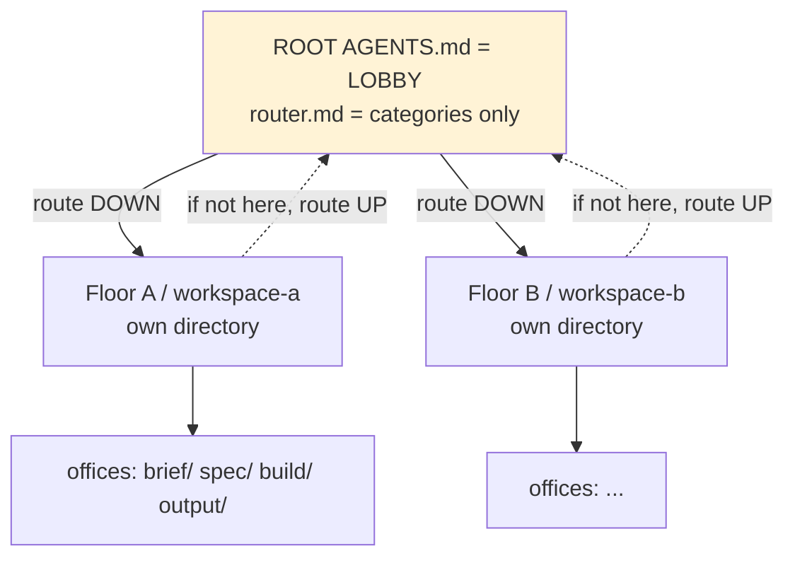
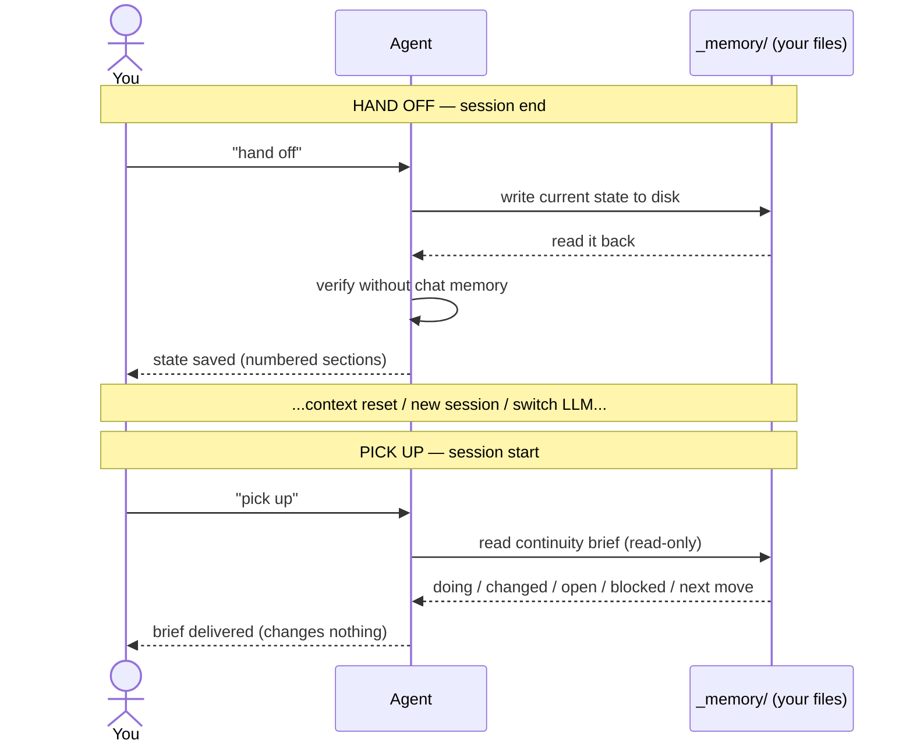
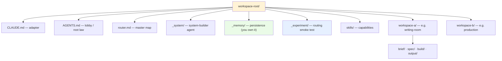
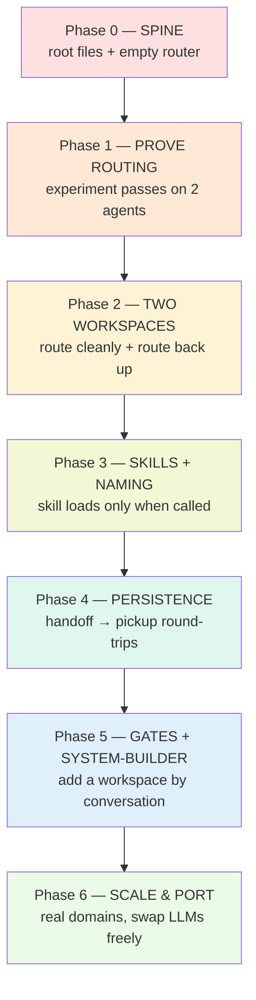

# Folder-as-Workspace Routing System

> One artifact, three parts:
> **Part 1 — Strategy Breakdown** (what the idea actually is, synthesized from both transcripts).
> **Part 2 — The PRP** (a Product Requirement Prompt an AI agent can execute to build the system).
> **Part 3 — Implementation Plan** (phased rollout + drop-in file templates).

---

# Part 1 — Strategy Breakdown

## 1.1 The one-sentence thesis

**Stop building apps and agents. Build a navigable folder-and-markdown system that routes the AI to exactly the context it needs, exactly when it needs it.** The folder *is* the app, the file system *is* the UI, markdown *is* the program, and the AI *becomes* whatever agent the current workspace describes — instead of you maintaining a separate hard-coded agent per task.

Both transcripts argue the same thing. Jake's video (`main_script`) lays out the architecture; the second creator (`script_for_structure`) is a viewer who rebuilt it for his own org and adds the concrete, missing mechanics. Treat Jake as the **spec** and the second video as the **reference implementation + operating manual**.

## 1.2 The problem it solves

The default way ~everyone uses AI:

- Dump everything into one chat or one giant file → the model reads irrelevant context (writing a blog post while also reading your video production notes), **burning tokens on things that don't matter**.
- Hit the **finite context window** → it starts failing, you start a new chat, re-paste your mega-prompt, re-explain, re-edit. Not sustainable, not scalable.
- **No persistence** — the model can't see your files, has no durable memory; what memory exists is **rented from a vendor** (Claude/ChatGPT/Codex) and you don't control it.
- **Vendor lock-in** — your work and "memory" live inside one company's product.

**The doom loop this creates:**



Root cause framing from the transcripts: AI reads everything as **tokens** (≈¾ of a word each), and the **context window** is finite. So the winning move is not a better mega-prompt — it's **never loading what you don't need**.

## 1.3 The core architecture — three layers (Jake / `main_script`)

The system runs on **three layers**, each loaded only when relevant:

| Layer | Name | What lives here | Metaphor |
|---|---|---|---|
| **1** | **The Map** (`CLAUDE.md` / `AGENTS.md`) — auto-loaded | Folder structure, naming conventions, where files go, where to route next. The stuff the agent *always* needs. | The **floor plan on the lobby wall** — walk into any room, the map tells you where to go. |
| **2** | **Workspace context files** | Per-workspace "what is this place / what to load / what to skip / what's the process." The actual **rooms** and pipelines. | The **room you were sent to**, with its own local instructions. |
| **3** | **Skills + MCP servers** | Plug-and-play capabilities (humanizer skill, doc co-authoring, PDF, web-testing, MCP connectors) wired in **only where needed**, not loaded globally. | The **tools on the workbench** in that specific room. |

**The single most important pattern** is the **routing table** in Layer 1/2: a plain-English table that says *"For this task → read these files, skip those files, you might need these skills."* Without it the AI either (a) reads everything and wastes tokens, (b) guesses wrong, or (c) produces work you can't edit step-by-step. The table eliminates all three.

**The three layers as progressive loading** (you only ever load down to the layer the task needs):



Supporting ideas from Jake's video:

- **Naming conventions replace databases.** Instead of SQL/vector DBs/Postgres, encode meaning in file names (`2026-03_launch-week.md`, `api-auth-guide_draft_v2.md`). The AI finds and moves files by convention — zero query layer, zero bespoke Python.
- **"Claude becomes the agent you need."** Most frameworks make you build a writing-room agent, a production agent, etc. Instead, let the *same* Claude Code instance become whichever agent the workspace's context describes. The approach to each task differs, so don't pre-build N rigid agents.
- **The folder becomes your app; the folder is the UI.** "What's a simpler UI than a folder?" You can run dozens of "apps" off one Claude Code subscription — they're just folders.
- **Pipelines inside workspaces.** Example production pipeline: **brief → spec → build → output**, where each stage loads *different* context (brief loads tech/voice standards; spec loads the design system/component library; build loads the deck).
- **Make it yours.** Swap the example workspaces (writing-room / production / community) for your domain — content creator (script lab / edit bay / distribution), freelancer (intake / production / delivery), developer (design / engineering / docs), construction, real estate. *The workspaces change; the three-layer routing system is the constant.*
- **Lineage.** This is **function-call routing / software routing** — a decades-old engineering idea (transparency, composition) — now expressed in **natural-language English** instead of code. Jake notes a longer 5-layer architecture exists in his research paper, but **3 layers is what most people need**.

**The pipeline pattern — each stage loads *different* context (a true waterfall):**



## 1.4 The expansion — concrete mechanics (the reaction / `script_for_structure`)

The second creator keeps the same strategy but supplies the **operating mechanisms** Jake gestured at. These are the additions:

**a) The proof-of-concept experiment (run this first to "get it").**
A minimal routing demo: a `CLAUDE.md` redirects to an `agent.md`; that file sends the agent to a **control/** folder; instructions there tell it to write the first word into a `Power.md` file — but the *word itself* must be fetched from a **skill file** ("first word = control, second = your, third = agent"). The agent hops folder→folder, fetches from the skill file, writes back, and ends with "done boss." Open `Power.md` and it reads **"control your agent."** No prompting beyond pasting the entry file. **It works identically in Claude and Codex** — proving the routing is model-agnostic. This is the smallest thing that demonstrates *route → fetch-from-skill → write-back → handoff*.

**The experiment as a waterfall of handoffs** (paste one file path; everything below happens with zero further prompting):



**b) Map / Mission / Support — the three answers every agent needs.**
An agent should always know: **the Map** (where am I, where can I go), **the Mission** (what is the work here), **the Support** (what tools/skills/context to use). If it has all three, *the AI is never lost*. "I don't know what you're talking about" should disappear permanently.



**c) `AGENTS.md` as the universal entry; `CLAUDE.md` is just an adapter.**
Because he uses many LLMs, every `CLAUDE.md` contains one line: *"read `AGENTS.md` in this folder."* Codex/others read `AGENTS.md` natively. One source of truth, many front doors → **portability**.

**d) The building / floor / department metaphor + `router.md` as a dedicated map file.**
The root `AGENTS.md` is the **lobby**; each folder is a **floor/department**; each floor has its **own directory** (you don't list every office in the lobby — only categories; detail lives on the floor). The master map is pulled into its **own `router.md`**: lobby-level categories that point to floors. Rule: *if what you need isn't here, go back to the root router* — routers route **up** as well as down, so the agent can never dead-end.



**e) Root law + "start here" + gates before risky actions.**
The root `AGENTS.md` opens with a **prime mission / root law** and a **"start here"** pointer, plus **gates**: "before a routing decision / before a risky action, read the matching gate." Numbered sections let the agent **skip-to-N** instead of reading the whole file.

**f) Pickup / Handoff workflows (codeword-triggered persistence).**
- Say **"pick up"** → a read-only **continuity brief**: what we're doing, what changed recently, open decisions, what's blocked / needs approval, best next move. *Don't change anything; don't explain the obvious.*
- Say **"hand off"** → write current state to disk (local memory), read it back, verify without relying on chat memory: completed work, in-progress, open tasks, open decisions, unresolved trade-offs, related tickets.
- Sections are **numbered** (e.g. `ICA-5.2`) so the agent skims to the number. This is how you survive context resets and **switch projects/sessions without losing state** — the memory lives in **your files**, not the vendor's.

**Hand off → reset → pick up (state lives on disk, not in the chat):**



**g) Cross-app / cross-LLM portability (the payoff).**
The same `AGENTS.md` drives Claude Code, Codex, Cursor/Composer, Hermes, Open Claw, local models. The only skills you need: *find the chat window, paste the `AGENTS.md` path.* Consequences: your work is saved to **your** files (not Codex's or Claude's memory); you can **switch agents when one gets dumber** or to save money (three $20 plans instead of one $200 plan); you're insulated from any single vendor.

**h) How to actually build it: talk to your AI, start small.**
Don't hand-author everything. Feed the AI the transcript/idea, have it **plan the system**, then have it **write its own `AGENTS.md`** and bootstrap. **Start with two folders**, get routing working, then grow. Build a dedicated **system-builder agent** first whose only job is to make/maintain the folder system; thereafter you mostly talk to *that* agent to add workspaces.

**i) Why it matters (the stakes).**
The big labs are spending millions to "solve memory." This file-and-folder system solves persistence *today*, and **you** own it. When ambient voice agents arrive, you'll talk to a workspace that's never lost rather than hoping a vendor remembers you. It's "not even an AI thing — it's routing," readable by a human or any model. Concepts that last a decade, drawn from ~200 years of software-engineering practice.

## 1.5 Distilled principles (the part to actually internalize)

1. **Least-context loading / progressive disclosure.** Never load what the current task doesn't need. This is the whole game.
2. **The map is the single source of truth.** One navigable description of structure + naming, auto-loaded, kept current.
3. **Natural-language function routing.** Old SWE routing, now in English: "for this task, read X, skip Y, use skill Z."
4. **Composition + transparency.** Small files that compose; everything is plain readable markdown — no hidden state, no DB, no framework.
5. **Persistence by convention.** Naming conventions + pickup/handoff files = durable, vendor-independent memory you control.
6. **Portability over lock-in.** `AGENTS.md` is the universal contract; `CLAUDE.md` is a one-line adapter.
7. **The folder is the app; the AI becomes the agent.** Don't build N agents or a Python framework — describe the workspace and let the model assume the role.
8. **Start small; let the AI build the AI's home.** Two folders → working routing → grow.

---

# Part 2 — The PRP (Product Requirement Prompt)

> A PRP is a PRD written for an AI executor: **Goal · Why · What · Context · Implementation Blueprint · Validation Loop · Anti-Patterns.** Paste Part 2 (plus Part 3's templates) into a fresh agent in an empty folder to have it build the system.

## 2.1 Goal

Build a **portable, model-agnostic, folder-and-markdown routing system** in which an AI agent, on entering any folder, knows **where it is, where it can go, what the work is, and which tools/context to load** — loading only what the current task needs, persisting state to disk between sessions, and behaving identically across Claude Code, Codex, Cursor, and other CLIs.

## 2.2 Why

- Eliminate token waste and context-window failures by never loading irrelevant context.
- Replace rented, vendor-locked "memory" with durable persistence the user owns (files on disk).
- Replace N hard-coded agents and bespoke frameworks with one navigable folder system the same model can drive into any role.
- Future-proof: the same structure serves typed *and* voice interaction, on any current or future model.

## 2.3 What — requirements

**Functional**
- **R1** Auto-loaded entry map. On entering the root, the agent reads one entry file (`CLAUDE.md` → `AGENTS.md`) and learns the structure, naming conventions, root law, and where to route.
- **R2** Master router. A `router.md` lists workspaces as **categories** (lobby level), each pointing to a workspace folder; every workspace router can route **back up** ("if not here, go to root router").
- **R3** Workspace context. Each workspace has its own `AGENTS.md`/`context.md` answering **Map / Mission / Support**, with a **routing table** (task → read these / skip these / skills).
- **R4** Skills layer. Skills live in `skills/<name>/SKILL.md` and are referenced **only** by the workspaces that need them — never globally preloaded.
- **R5** Naming conventions. A documented convention (dates, versions, draft/final, slugs) the agent uses to place and locate files — no database.
- **R6** Persistence: **pickup** (read-only continuity brief) and **handoff** (write state to disk + verify) codewords, backed by `_memory/` files with **numbered sections** for skip-to-N reads.
- **R7** Gates. Named gates the agent must consult before routing decisions and before risky/irreversible actions.
- **R8** Portability. `CLAUDE.md` is a one-line redirect to `AGENTS.md`; nothing model-specific in the content; verified working in ≥2 agents.

**Non-functional**
- Everything is plain markdown, human-readable, no code/DB/framework required.
- Adding a workspace = adding a folder + an `AGENTS.md` + a `router.md` line. No central rebuild.
- Token-frugal by construction: a cold start reads the entry map + one router hop + one workspace context, not the tree.

## 2.4 Success criteria

- [ ] From a cold session in the root, "I want to work on **X**" routes to the correct workspace with a **light lookup, not a full tree wander**, and never answers "I don't know what you're talking about."
- [ ] The routing **experiment** (§2.6) passes in **two different agents** (e.g. Claude + Codex), producing `control your agent` in `Power.md` with no instruction beyond pasting the entry file.
- [ ] **"pick up"** returns an accurate continuity brief without mutating anything; **"hand off"** writes verifiable state to `_memory/` and reads it back.
- [ ] Switching workspaces mid-session ("never mind, work on Y") re-routes cleanly and preserves prior state on disk.
- [ ] A new workspace can be added by a non-author in < 10 minutes by copying the workspace template.

## 2.5 Context the executor must load

- **This artifact, Part 1** (the strategy) and **Part 3** (templates + phases).
- The two source transcripts in `youtube_transcripts/` for tone and intent.
- Concept anchors: *Map/Mission/Support*; *three layers (map → workspace context → skills)*; *router routes up and down*; *naming-conventions-as-database*; *pickup/handoff*; *`AGENTS.md` universal, `CLAUDE.md` adapter*.

## 2.6 Implementation blueprint (ordered)

1. **Scaffold the spine** — create root `CLAUDE.md` (redirect), root `AGENTS.md` (root law + start-here + Map/Mission/Support), `router.md` (empty category table), `_memory/` (with `active-context.md`), `skills/`.
2. **Wire the routing experiment** (`_experiment/`) — `agent.md` → `control/` → `skill.md` → write into `Power.md`. This is the executable smoke test for the whole routing concept (see Validation Loop).
3. **Build two real workspaces** — e.g. `workspace-a/` and `workspace-b/`, each with `AGENTS.md` (Map/Mission/Support + routing table). Add both to `router.md`. *Only two — prove routing before scaling.*
4. **Add one skill** under `skills/` and reference it from one workspace's routing table (never globally).
5. **Author pickup/handoff** — define the codewords + numbered `_memory/` section format; implement read-only pickup and write-then-verify handoff.
6. **Add gates** — a `gates` section (or `_system/gates.md`) for "before routing" and "before risky action."
7. **Document naming conventions** in root `AGENTS.md`.
8. **Bootstrap the system-builder agent** (`_system/AGENTS.md`) whose mission is to add/maintain workspaces by template — so future growth is conversational.
9. **Portability pass** — confirm `CLAUDE.md` is a pure redirect; run §2.6/Validation in a second agent.

## 2.7 Validation loop (executable)

- **Routing experiment (model-agnostic):** Paste the path to `_experiment/CLAUDE.md` (or `agent.md`) into the agent with **no other instruction**. Expected: it reads the redirect → `control/` instructions → fetches words from `skill.md` → writes word-by-word → `Power.md` == `control your agent` → replies "done boss." Run in **Claude and Codex**; both must pass.
- **Cold-route test:** New session in root → "work on \<workspace-a topic\>" → agent does a *light* lookup and lands in `workspace-a/`. Repeat for `workspace-b`. Then "never mind, \<workspace-b topic\>" → clean re-route.
- **Persistence test:** "hand off" → inspect `_memory/` for a new numbered entry → new session → "pick up" → brief matches the handoff.
- **Token-frugality check:** Confirm a cold route reads only entry map + router + one workspace context (not the whole tree) — eyeball the agent's "reading …" trace.
- **Negative test:** Ask a workspace something out of its domain → it should route **back up** via the router, not hallucinate or wander.

## 2.8 Anti-patterns / gotchas (do NOT do these)

- ❌ One mega `AGENTS.md` that preloads every workspace and skill — defeats the entire purpose (token burn).
- ❌ Building a Python/agent framework or wiring a database — the folder + naming conventions *are* the database and the app.
- ❌ Pre-building a separate agent per task — let the model become the agent the workspace describes.
- ❌ Putting all detail in the lobby router — lobby = categories only; detail lives on the floor.
- ❌ Model-specific content in shared files — keep `CLAUDE.md` a one-line redirect; logic in `AGENTS.md`.
- ❌ Skipping pickup/handoff — without it you fall back to vendor memory and lose ownership/persistence.
- ❌ Scaling to 20 folders before routing works on 2.

---

# Part 3 — Implementation Plan

## 3.1 Proposed file tree

```
workspace-root/
├── CLAUDE.md                 # Layer 1 — one-line adapter: "read AGENTS.md"
├── AGENTS.md                 # Layer 1 — lobby: root law, start-here, Map/Mission/Support, naming conventions, gates
├── router.md                 # Layer 1 — master map: categories → workspaces (routes up & down)
│
├── _system/                  # the system-builder agent (maintains the structure itself)
│   └── AGENTS.md
│
├── _memory/                  # persistence (you own this, not a vendor)
│   ├── active-context.md     # current state, numbered sections (e.g. 5.2)
│   └── handoffs/             # dated handoff snapshots
│
├── _experiment/              # the routing smoke test (keep it — it's your CI)
│   ├── CLAUDE.md             # redirect → agent.md
│   ├── agent.md              # → go to control/ and follow instructions
│   ├── Power.md              # target file (starts empty)
│   ├── control/
│   │   └── agent.md          # write words 1..3 into Power.md, fetch each from skill.md
│   └── skills/
│       └── skill.md          # word map: 1=control, 2=your, 3=agent
│
├── skills/                   # Layer 3 — referenced only where needed
│   └── <skill-name>/
│       └── SKILL.md
│
├── workspace-a/              # Layer 2 — a real workspace (e.g. writing-room)
│   ├── AGENTS.md             # Map/Mission/Support + routing table
│   └── ...pipeline folders (brief/ spec/ build/ output/ ...)
│
└── workspace-b/              # Layer 2 — second workspace (e.g. production)
    ├── AGENTS.md
    └── ...
```

**The same tree, as a map** (yellow = entry/lobby, blue = your CI smoke test, green = the memory you own):



## 3.2 Phased rollout (start small — non-negotiable)

**Each phase only starts when the one above it is done** (the rollout waterfall — red→green = unproven→lived-in):



| Phase | Goal | Done when |
|---|---|---|
| **0 — Spine** | Root `CLAUDE.md` + `AGENTS.md` + empty `router.md` + `_memory/` + `skills/`. | Cold session reads the entry map and states the structure back. |
| **1 — Prove routing** | Build `_experiment/`; run the word test. | `Power.md == "control your agent"` in **two** agents. |
| **2 — Two workspaces** | `workspace-a` + `workspace-b` with routing tables; both in `router.md`. | "work on A" / "work on B" route cleanly; out-of-domain routes back up. |
| **3 — Skills + naming** | One skill under `skills/`, referenced by one workspace; naming conventions documented. | Workspace loads the skill only when its table calls it. |
| **4 — Persistence** | Pickup/handoff codewords + numbered `_memory/` format. | Handoff → new session → pickup reproduces state. |
| **5 — Gates + system-builder** | Gates section; `_system/` builder agent. | Adding a workspace is a conversation with `_system`, by template. |
| **6 — Scale & port** | Add real workspaces for your domain; verify on a 2nd/3rd LLM. | Your actual work runs here; agent swap loses nothing. |

## 3.3 Drop-in templates

### `CLAUDE.md` (root) — the adapter
```markdown
# Entry
Read `AGENTS.md` in this same folder and follow it. That is the single source of truth.
(Every CLAUDE.md in this system says exactly this — so any LLM has one front door.)
```

### `AGENTS.md` (root) — the lobby
```markdown
# ROOT LAW — <Org/Project> Operating System
Prime mission: <one line — what this whole workspace exists to do>.

## START HERE
1. You are in the LOBBY. Do not read the whole tree.
2. If the request is a routing/ownership question → read `router.md`.
3. If unsure how much to read → read only the numbered section you need.
4. Before any risky/irreversible action → see GATES below.

## MAP / MISSION / SUPPORT (answer these for every task)
- MAP: where am I, where can I go?  → `router.md`
- MISSION: what is the work?         → the target workspace's `AGENTS.md`
- SUPPORT: what tools/skills/context? → that workspace's routing table + `skills/`

## NAMING CONVENTIONS (this replaces a database)
- Dated output:   `YYYY-MM-DD_<slug>.md`
- Versioned draft: `<slug>_draft.md`, `<slug>_v2.md`, `<slug>_final.md`
- Memory sections are NUMBERED (e.g. 5.2) so agents skip-to-N.

## GATES
- ROUTING GATE: confirm the target workspace via `router.md` before acting.
- RISK GATE: never delete/overwrite/publish without explicit user go-ahead.

## PERSISTENCE
- "pick up" → read-only continuity brief from `_memory/active-context.md`.
- "hand off" → write state to `_memory/`, read it back, verify.
```

### `router.md` (root) — the master map (lobby = categories only)
```markdown
# MASTER ROUTER (the map)
If a request isn't listed here, it belongs to no workspace yet — ask, don't guess.
Each workspace router may send you BACK here ("if not here, go to root router").

| If the work is about… | Go to | Read first |
|---|---|---|
| <writing / scripts / drafts>     | `workspace-a/` | `workspace-a/AGENTS.md` |
| <build / production / assets>    | `workspace-b/` | `workspace-b/AGENTS.md` |
| <maintaining this system itself> | `_system/`     | `_system/AGENTS.md` |
```

### `workspace-<x>/AGENTS.md` — a room (the heart: the routing table)
```markdown
# <Workspace name> — local router
If what you need isn't here, GO BACK to root `../router.md`.

## MAP / MISSION / SUPPORT
- MAP: this workspace handles <scope>. Sub-folders: <brief/ spec/ build/ output/>.
- MISSION: <the process, in order> e.g. understand topic → find angle → draft → catch problems.
- SUPPORT: skills + context below, loaded ONLY per the table.

## ROUTING TABLE  (the most important thing in the system)
| Task | Read these | Skip these | Skills |
|---|---|---|---|
| <write a draft>   | `context.md`, `brief/<x>`     | everything in `build/` | `skills/humanizer/SKILL.md` |
| <make a spec>     | `design-system.md`           | `brief/`               | — |
| <build/produce>   | `spec/<x>`, `design-system.md` | `brief/`             | `skills/<tool>/SKILL.md` |
```

### `_experiment/` — the model-agnostic routing test
```markdown
# _experiment/CLAUDE.md
Read `agent.md` in this folder and follow it exactly.

# _experiment/agent.md
Go to `control/agent.md` and follow its instructions. Do not ask questions.

# _experiment/control/agent.md
Write three words into ../Power.md, in order, one at a time.
You do NOT know the words — fetch each from `../skills/skill.md`.
After writing all three, reply exactly: "done boss".

# _experiment/skills/skill.md
Word map — when asked for:
  word 1 = control
  word 2 = your
  word 3 = agent

# _experiment/Power.md   (starts empty; after a pass it must read:)
control your agent
```

### `_memory/active-context.md` — persistence (numbered for skip-to-N)
```markdown
# ACTIVE CONTEXT  (you own this — not a vendor)

## 1. PRIME STATE
Current workspace: <…>   |   Last session: <date>

## 5. PICK UP  (read-only brief)
- 5.1 What we're doing: …
- 5.2 What changed recently: …
- 5.3 Open decisions / waiting on: …
- 5.4 Blocked / needs approval: …
- 5.5 Best next move: …

## 6. HAND OFF  (written at session end, then verified)
- 6.1 Completed: …
- 6.2 In progress: …
- 6.3 Open tasks / decisions / trade-offs: …
- 6.4 Related tickets/links: …
```

### `skills/<name>/SKILL.md` — a capability, referenced not preloaded
```markdown
# <Skill name>
Purpose: <what this skill does in one line>.
Use when: <the routing table in a workspace points here>.

## Steps
1. …
2. …
## Inputs / Outputs
- Input: … → Output: … (named per the naming conventions)
```

## 3.4 First three commands to run after scaffolding

1. **Prove routing:** paste `_experiment/CLAUDE.md`'s path into a fresh agent, no other text. Confirm `Power.md` → "control your agent". Repeat in a second agent.
2. **Cold route:** new session in root → "I want to work on \<workspace-a topic\>" → confirm a light lookup lands in `workspace-a/`.
3. **Persist:** do a trivial edit → "hand off" → new session → "pick up" → confirm the brief matches.

## 3.5 Out of scope (deliberately)

- The optional **5-layer** variant from Jake's research paper (3 layers is the target here).
- Any database, vector store, or agent framework (naming conventions + routing replace them).
- Per-task hard-coded agents (the model becomes the agent via workspace context).
- Voice front-end (the same structure will serve it later; not built now).

## 3.6 Definition of done

The system is "done enough to live in" when: two workspaces route cleanly from a cold start; the routing experiment passes on two LLMs; pickup/handoff round-trips through `_memory/`; and adding a new workspace is a copy-the-template conversation with `_system/` — no central rebuild, no vendor memory in the loop.
```

