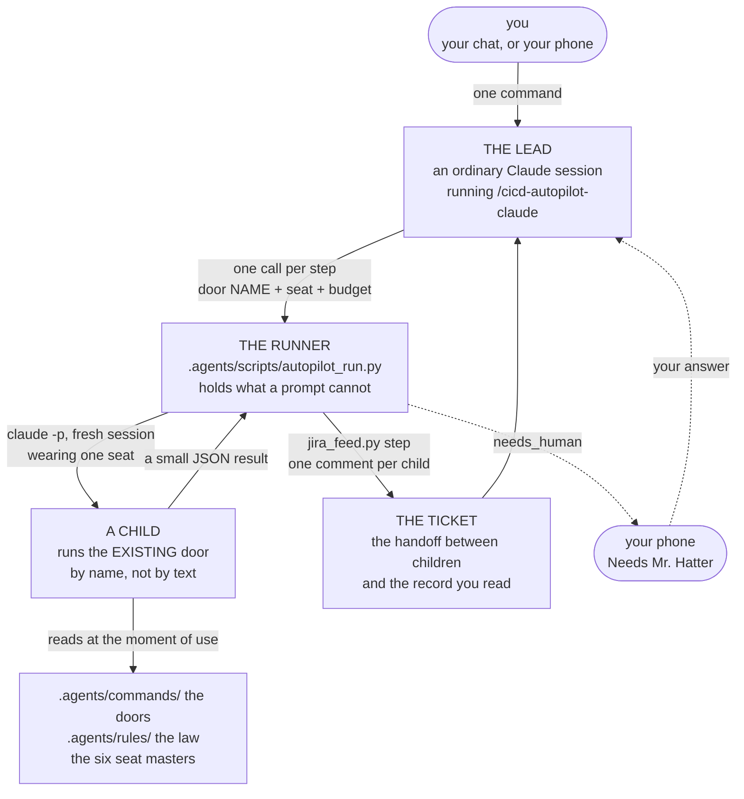
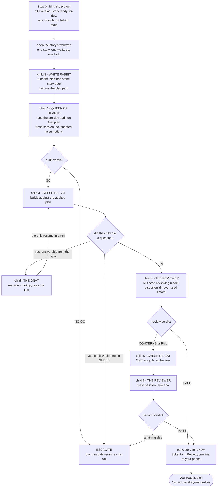
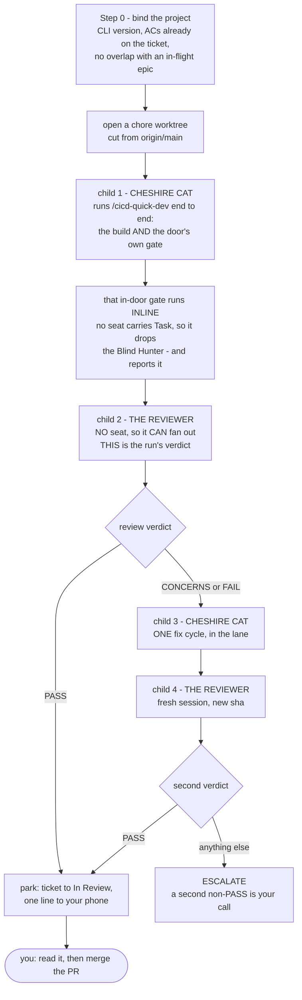
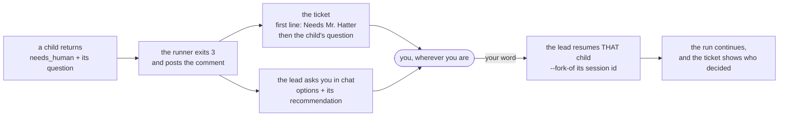

# The Autopilot SOP

*The robot that runs your own workflow for you. This page is where the autopilot is explained and
where it is kept current — the main [`workflows_testing_SOP.md`](workflows_testing_SOP.md) links
here rather than carrying a second copy.*

---

## 1. What it is, in one paragraph

You type one command and go to bed. A **lead** session — an ordinary Claude chat running
`/cicd-autopilot-claude` — walks one story through the **same doors you would type by hand**, calling
a small script once per step. Each call launches a fresh headless Claude process, a **child**, wearing
one of the six Wonderland seats, running one door **by name**. The child answers with a short
structured result; the script writes that result onto the Jira ticket as a comment and the lead reads
one paragraph, not a transcript. When something needs you, it lands on your phone as a ticket comment
that begins `Needs Mr. Hatter`. When the story is review-ready it stops. It cannot merge anything.

**The one design decision everything else follows from:** the autopilot owns **no copy** of any door,
rule or seat. It passes names, never text. Edit a door in the morning and the robot runs the new one
that night, with no sync step, no regeneration and nothing to forget.

---

## 2. The three layers

**A door** is a slash command you type today. **A seat** is one Wonderland team member. **A child** is
one headless process running one step. **The runner** is the script that launches children and holds
the rules an agent must not be trusted with.

**Why the ticket and not memory.** Nothing passes between children in process memory — each is a fresh
session. The next child learns what happened by reading the ticket, exactly as you do. That is not a
limitation worked around; it is what makes the run auditable after the fact, and it is why a comment
that fails to post is treated as a step that did not happen.

---

## 3. One story, end to end

Six children for a clean run. Every one is a fresh session with a new id, and the ids are on the
ticket, so "did the reviewer really start clean?" is a thing you can check rather than trust.

⛔ **There is no arrow to `main`.** Landing is not a rule the lead is asked to keep — the runner has
no verb for it at all, so it is not a thing an agent can talk itself into.

### 3.1 The quick-fix route — a ticket that is not a story

Not every ticket is a story. A project **Task** — a performance fix, an asset, a copy change — has no
story file on disk, no sprint row and no epic branch, so the six-child run above has nothing to bind
to. Its road is `/cicd-quick-dev`, which is **one door holding both the build and its own review
gate**, and the run is four children rather than six.

**Which route:** the story route when the work has a story file and an epic branch; the quick-fix
route when it has neither. If you cannot tell which it is, it is not a quick fix — that is an
escalation, not a coin flip.

⛔ **The quick-dev door's own verdict is NOT the run's verdict, and the reason is a seat pin.** Every
seat's `claude-tools` list deliberately omits `Task`, so a seated child has no subagent tool. When
`/cicd-quick-dev` reaches its review gate it probes the runtime honestly, finds none, records
`review-runtime: inline (no subagent tool)` and **drops the Blind Hunter** rather than faking it —
the behaviour the review engine was given in SCC-203. That is a real first pass and worth having. It
is not independent, because the agent that wrote the code is the agent triaging the findings.

The **no-seat** review child is what closes that. Passing `--review` sends no `--agents` at all, so
the child inherits the default tool set, `Task` included, fans the lenses into clean contexts and
returns a full roster. Net effect: an autopilot quick fix gets *more* review than a human running the
same door by hand — one inline first pass, then one independent fan-out at the shipping sha.

---

## 4. The charter — what the lead may pass without you

Approved 2026-09-07. Your launch word is a **batch approval** scoped to these rows and to **one
story**; it does not travel to the next one. The runner writes the scope into the ticket's first
comment, so what was in force is on the record rather than in someone's context.

| Gate | Who decides | Why it sits there |
|---|---|---|
| ② Step 2 `continue` | **the lead** | The audit already ran as a Queen child in a fresh session — which is the thing that stop existed to guarantee |
| ② Step 2.5 questions before code | **the lead** | Answered from the story, the plan and a Gnat lookup. **If it would need a guess, it escalates instead** |
| Audit verdict `NO-GO` | **you** | The plan-first gate re-arms; re-scoping is a judgment about what to build |
| New dependency, schema, security rule, CI or environment config | **you** | The constitution's Ask First list wins. The old engine's "self-install and log it" is dropped |
| Deleting a file | **you** | Ask First, always |
| ③ verdict `PASS` | **the lead** | It posts review-ready and parks. You still own review-to-done |
| ③ verdict `CONCERNS` or `FAIL` | **the lead**, once | One fix child, then one fresh reviewer. A second non-PASS escalates. `CONCERNS` never ships by itself |
| Landing on the epic branch or `main` | **nobody** | No runner verb exists |
| Anything a door marks `PIPELINE_BLOCKER` | **you** | The door already decided it is yours |

---

## 5. When it needs you

An escalation is **two things, both of them, every time**: a question in the chat with real options
and a recommendation, and a ticket comment whose first line is the literal marker. Your phone reads
the ticket; the chat may not be in front of you.

⛔ **The lead waits.** An escalation it answered itself is the single failure the charter exists to
prevent, and it would be invisible — the run would look normal and be wrong.

---

## 6. The seats, and what each one costs

Each seat is one file, `.agents/commands/smh-team-<seat>.md`, and it is the **same file** that defines
that seat in Zoo. Three frontmatter keys pin the Claude side.

| Seat | Role | Model | Effort | Why |
|---|---|---|---|---|
| The Gnat | read-only research | haiku | low | Looks things up and cites lines. Cheap on purpose — it is called often |
| White Rabbit | PM / planning | sonnet | medium | Writes the plan; does not build |
| Caterpillar | design / front end | sonnet | medium | |
| Cheshire Cat | the builder | sonnet | high | Does the work that has to be right |
| Queen of Hearts | tests & QA | sonnet | high | Writes the failing tests and audits the plan |
| March Hare | the lead | opus | high | Decides; almost never a child |

⛔ **No seat can spawn its own subagents.** `Task` is on nobody's tool list — a headless child that
can launch more children is an unbounded bill with no ledger row.

⛔ **Never leave a child unpinned.** An unpinned child inherits the 1M-context Opus and costs six to
twenty times more; measured, a one-word answer cost **$0.157–$0.496** unpinned against **$0.024** on
haiku.

**Why forking is worth caring about.** A child launched fresh rebuilds ~12,600 tokens of prompt; a
child *forked* from a warm parent builds ~340 and reads the rest from cache. Measured over five
steps: **$0.158 naive against $0.059 layered — 63% cheaper**, and 82% once the parent amortises.

---

## 7. The six failure modes, all of them silent

Every one of these was measured against the real CLI, and **not one produces an error**. That is why
they are written down: none is guessable from reading the code.

| What breaks | What you would see | What holds it |
|---|---|---|
| A resumed child **loses its seat** — identity, model and tool limits — and keeps going | Nothing. Later steps look normal and run wrong | The runner re-sends the seat on every launch, forks included |
| `--max-budget-usd` is a **suggestion**: it stops the *next* turn, not the current one. Capped at $0.05, measured spends of **$0.496** and **$0.296** | A bill 10x the cap, reported as "budget exhausted" | `--run-cap-usd`, summed off the run's own ledger before each launch |
| A reply that **parses but carries no status** | A no-op recorded as success | Anything without a status is `failed`, never `done` |
| The child's transcript store is **unwritable**, so nothing can be forked | "No conversation found" — which reads as *forking does not work* | The runner points `CLAUDE_CONFIG_DIR` somewhere writable and seeds it |
| The workspace is **untrusted**, so every fork reads **zero** cached tokens | Nothing at all. Runs succeed; only the bill changes | The runner sets the trust flag in its own config directory |
| The `claude` on `PATH` is **older than the CLI you are typing in** — a launcher symlink that never moved after an upgrade | Nothing, until a child hits a permission prompt and there is nobody to answer it | Step 0.2 reads `claude --version` from `PATH`, not from this session, and refuses below 2.1.259 |

ⓘ **Why the floor is 2.1.259, since the obvious answer is wrong.** It is not `--agents` or
`--json-schema` — both are present on 2.1.258, so a floor justified by them collapses the moment
anyone checks. It is **`--permission-prompts none`**, which lands in 2.1.259. That flag's default is
`host`, meaning *the SDK host or a `--permission-prompt-tool` answers* — and a child launched by this
runner has neither. Left at the default, an unattended child that hits a permission prompt has nobody
to answer it. `none` turns the same moment into an explicit deny the child reports back in its
result. Measured 2026-09-07: absent on 2.1.258, present on 2.1.263, and this machine's
`~/.local/bin/claude` symlink was still pointing at 2.1.258 while the session running the check was
2.1.263.

---

## 7.5 What the retired engines were mined for

The v2 lane — `/cicd-autopilot-opencode`, `/cicd-autopilot-deepseek4` and the three `_AP` twins they
called — was read end to end before it was deleted, and four things in it were worth keeping. Each is
**lead behaviour or runner mechanics**, never another document to keep in step: that filter is why
the old lane needed a nineteen-file edit to change one rule and this one does not.

| Kept | Why it earned its place | Where it lives now |
|---|---|---|
| **A run lock, one child per ticket** | The old engine's own notes record the hole: *"nothing used to stop a double-run of the SAME story"*. Two children in one worktree interleave their edits and **both report success** — there is no error anywhere | `autopilot_run.py`, taken after every refusal and released in a `finally`. A dead holder's lock is stolen, so a crash cannot lock a ticket forever |
| **The run is watched, not awaited** | A step prints nothing until it returns, so a foreground call makes a working run look like a hang and the only choices are wait blind or kill it | The door: launch each step in the background, watch it, keep a visible checklist |
| **What the lead decided on your behalf** | The charter says what it MAY pass. Nothing said what it DID — and a permission slip nobody audits is not a control | The door's park step: one ticket comment listing every charter row actually exercised |
| **A soft "I'd normally check this with him" is a DECISION, not an escalation** | The retired lane got this exactly right. Left unwritten, a lead either escalates everything or quietly defaults and records nothing | The same list — that is the line it exists to catch |
| **A verdict must carry the sha it was made at** | Their reviewer, on a CLEAN pass, did every bit of the judgment work and then dropped the mechanical deliverable — because it was buried among the instructions. **The happy path is where a deliverable collapses** | `autopilot_run.py`: a review answering `done` with no `evidence.sha` is `failed`. Narrow on purpose — a Gnat lookup owes no sha |

⭐ **The lesson under the last row is the one worth carrying into anything built here:** separate
the judgment WORK from the mechanical DELIVERABLE, and make the deliverable un-collapsible. An agent
that finds nothing wrong is the *most* likely to fold its bookkeeping into prose, because on a clean
pass the bookkeeping feels like ceremony. Their reviewer was not lazy and it was not confused — it
was correct about the code and quietly wrong about the record, which is the hardest failure to spot
afterwards. A checklist item cannot fix that; only a check that fails can.

**What was deliberately NOT carried over.** The old lane's per-stage test-gate baseline and its
`_RUN-STATUS.md` both belong to somebody else now: the **door** owns its own gate, and the **ticket**
is the status surface. Re-implementing either here would have given this lane a second copy of
something that already exists — which is the exact disease the v2 engines died of.

---

## 8. Keeping this current

| If you change… | Do this |
|---|---|
| a door, a rule, or a skill | **Nothing.** The children read the file at the moment of use |
| a seat's character, model, tools or effort | Edit `.agents/commands/smh-team-<seat>.md`. ⛔ At most three `claude-*` keys, below `mode-groups`, one line each — the sync reads only the first 12 lines and a seat that falls outside that window is dropped from Zoo silently |
| how a child is launched, or the result contract | `.agents/scripts/autopilot_run.py`, and its tests in `.agents/scripts/tests/test_autopilot_run.py` |
| how a step reaches the ticket | `jira_feed.py step`, and `test_jira_feed.py` |
| the charter | Here, and in the door's own Step 1 table. Both, in the same commit — they are read by different people |

**The five things this lane owns**, and the reason the list is short: how to launch a child, the
result contract, the `step` verb, the seat renderer, and the budget table. Everything else is
borrowed at the moment of use. When the workflow changes, nothing here changes; when Claude's CLI
changes, only the runner does.
