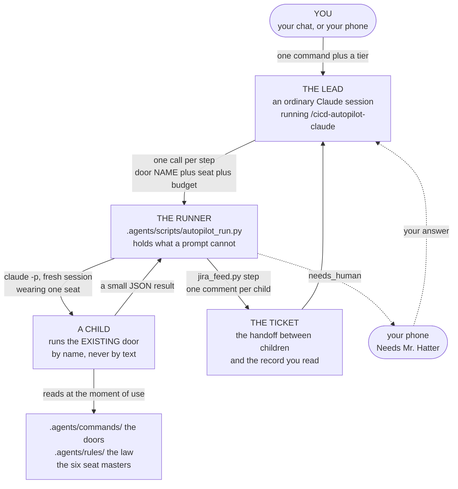
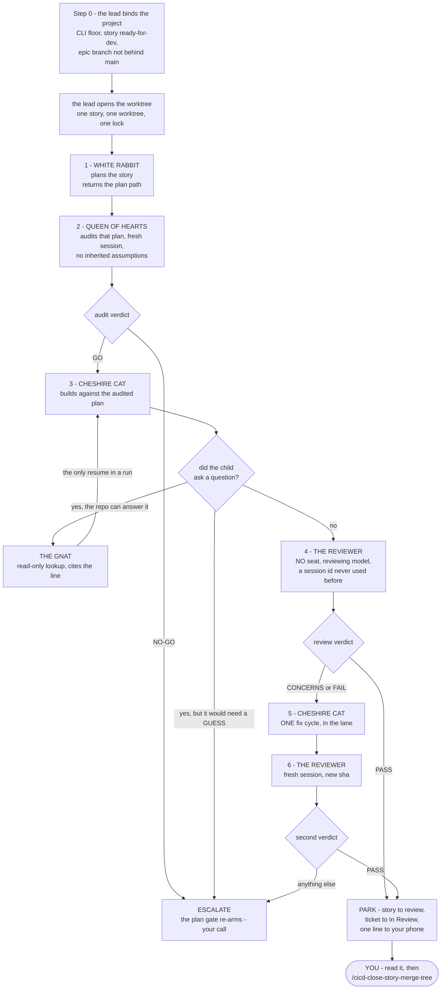
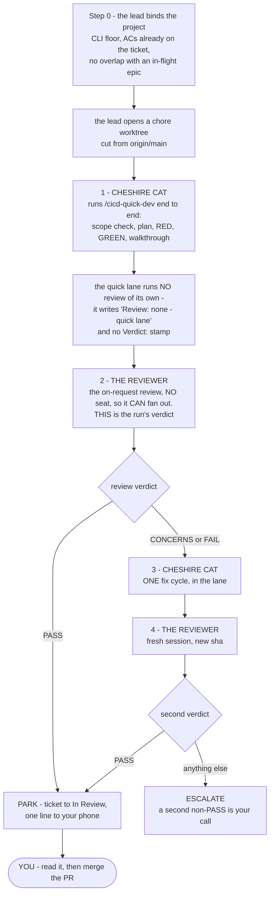
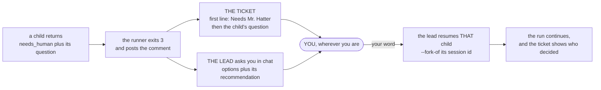

# The Autopilot SOP

*The robot that runs your own workflow for you. This is the complete guide to the lane: what each
step is, **who runs it**, what it costs, and where to look when it goes wrong. The whole run happens
without you watching, so this page is the only place the mechanism is written down — the main
[`workflows_testing_SOP.md`](workflows_testing_SOP.md) links here rather than carrying a second copy.*

---

## 1. What it is, in one paragraph

You type one command and go to bed. A **lead** session — an ordinary Claude chat running
`/cicd-autopilot-claude` — walks one ticket through the **same doors you would type by hand**,
calling a small script once per step. Each call launches a fresh headless Claude process, a **child**,
wearing one of the six Wonderland seats and running one door **by name**. The child answers with a
short structured result; the script writes that result onto the Jira ticket as a comment, and the
lead reads one paragraph rather than a transcript. When something needs you it lands on your phone
as a ticket comment beginning `Needs Mr. Hatter`. When the ticket is review-ready the run stops. It
cannot merge anything.

**The one design decision everything else follows from:** the autopilot owns **no copy** of any door,
rule or seat. It passes names, never text. Edit a door in the morning and the robot runs the new one
that night — no sync step, nothing to regenerate, nothing to forget.

---

## 2. The cast — who does what, and what each one cannot do

Five actors, and the limits matter as much as the jobs. Every "can never" below is enforced by the
runner or by a tool list, not by an instruction a model could talk itself past.

| Who | What it is | What it does | What it can never do |
|---|---|---|---|
| **You** | the operator | Name the ticket and the tier, answer escalations, run close-out | — |
| **The lead** | your own chat session running `/cicd-autopilot-claude` | Calls the runner once per step, reads one paragraph back, decides the next step inside the charter (§6) | Write code, run tests, read transcripts, land anything |
| **The runner** | `.agents/scripts/autopilot_run.py`, a plain script | Launches each child, holds the run ceiling, takes the ticket lock, writes the ledger, posts each step to Jira | Read a door's body, invent a status, land anything |
| **A seated child** | one fresh `claude -p` process wearing one Wonderland seat | Runs ONE door by name, end to end, and returns a small JSON result | Spawn subagents (`Task` is on no seat's tool list), write a review verdict |
| **The review child** | one fresh process wearing **no seat** | Runs `/cicd-code-review` with the default tool set, fans the review lenses into clean contexts, returns the verdict and the sha it was made at | Wear a seat, fork from anything, reuse a session this run already issued |

**Why the ticket and not memory.** Nothing passes between children in process memory — each is a
fresh session. The next child learns what happened by reading the ticket, exactly as you do. That is
what makes a run auditable after the fact, and it is why a comment that fails to post is treated as
a step that did not happen.

---

## 3. Before you launch — what must already be true

The autopilot implements work; it never invents it. Step 0 of the door measures each of these and
refuses to launch if one fails, naming which.

| Check | How it is measured | Why it is there |
|---|---|---|
| The CLI | `claude --version` on `PATH` is ≥ **2.1.259** | `--permission-prompts none` lands at that version. Its default is `host`, and a headless child has no host — so below the floor, an unattended child that hits a permission prompt has nobody to answer it. ⛔ Read the binary on `PATH`, not the session you are typing in: a launcher symlink that never moved after an upgrade leaves the two on different versions |
| The runner | `autopilot_run.py --help` exits 0 | A missing runner fails here, not halfway through a run |
| The work | a **story** is `ready-for-dev` with its failing tests already on disk; a **quick-fix Task** already carries its acceptance criteria on the ticket | ① is not the autopilot's — `/cicd-write-story-tests` runs on your reviewing model before you launch |
| The branch | the epic branch is checked out and **not behind `origin/main`** | A drifted epic is a merge conflict waiting to be found by a robot |
| The ticket | the story's Jira key resolves | The ticket IS the handoff; without it there is no run record |
| The tier | you named it, or the lead says which it chose and why before spending anything | One word sets every model, every effort and both budgets (§8) |

Then the lead opens the story's worktree and links its gitignored assets. **One story, one worktree,
one lock.**

---

## 4. The story run — six children, step by step

Six children for a clean run, each a fresh session with a new id, and every id lands on the ticket —
so "did the reviewer really start clean?" is something you can check rather than trust.

| # | Who runs it | The door it runs | What it returns | What the lead does with it |
|---|---|---|---|---|
| 1 | ⏰🐇 **White Rabbit** | `/cicd-dev-story-tests <story>`, to its Step 2 stop | the plan path | Passes the plan to stage 2 |
| 2 | ♥️👑 **Queen of Hearts** | `/cicd-self-audit` on that plan | `GO` or `NO-GO` | `GO` → build. `NO-GO` → **escalate**; re-scoping is your call |
| 3 | 😼🔨 **Cheshire Cat** | `/cicd-dev-story-tests <story>`, Step 2.5 → Step 5 | the build, committed and pushed on the lane's `claude/*` branch | Reads the status, never the diff |
| — | 🦟🔍 **The Gnat** | a read-only lookup, whenever a child asks something the repo can answer | the answer, cited to file and line | Forks the asking child with `--fork-of` and the answer — the only `--resume` in a run |
| 4 | **no seat** | `/cicd-code-review <story>` | `PASS` / `CONCERNS` / `FAIL`, plus `evidence.sha` | `PASS` → park. Anything else → one fix cycle |
| 5 | 😼🔨 **Cheshire Cat** | the fix, in the lane — only on `CONCERNS` or `FAIL` | the fixed tree at a new sha | One cycle, never two |
| 6 | **no seat** | `/cicd-code-review <story>` again | the second verdict at the new sha | `PASS` → park. Anything else → **escalate** |

⛔ **The Queen audits; she never reviews.** Stage 2 is the pre-dev audit in a fresh session, which is
exactly what the ② Step 2 stop existed to guarantee — so the lead may pass that stop itself. The ③
verdict is not hers and not any seat's: it belongs to a no-seat child on the reviewing model, which
is the same independence your model switch buys when you run ③ by hand. Two things enforce it — the
runner refuses `--review` together with `--seat`, and no seat carries the `Task` tool, so a seated
child could not fan the lenses out even if it tried.

⛔ **There is no arrow to `main`.** Landing is not a rule the lead is asked to keep — the runner has
no verb for it at all, so it is not something an agent can talk itself into.

---

## 5. The quick-fix run — four children, for a ticket that is not a story

Not every ticket is a story. A project **Task** — a performance fix, an asset, a copy change — has no
story file on disk, no sprint row and no epic branch, so the six-child route has nothing to bind to.
Its road is `/cicd-quick-dev`, **the quick lane** — scope check, plan, RED then GREEN, walkthrough,
and a review **only when asked** — and the run is four children, because the lead is the one asking.

**Which route:** the story route when the work has a story file and an epic branch; the quick-fix
route when it has neither. If you cannot tell which it is, it is not a quick fix — that is an
escalation, not a coin flip.

| # | Who runs it | The door it runs | What it returns | What the lead does with it |
|---|---|---|---|---|
| 1 | 😼🔨 **Cheshire Cat** | `/cicd-quick-dev <KEY>` end to end | the build and its walkthrough; the lane writes `Review: none - quick lane …` and no `Verdict:` | both `approved` stops are yours: the plan's is your launch word (a batch approval scoped to this ticket), the walkthrough's comes to your phone (§7) — the lead never supplies either; ⛔ there is no verdict here to read |
| 2 | **no seat** | `/cicd-code-review <KEY>` | the verdict, plus `evidence.sha` | this is the on-request review; `PASS` → park. Anything else → one fix cycle |
| 3 | 😼🔨 **Cheshire Cat** | the fix, in the lane | the fixed tree at a new sha | One cycle, never two |
| 4 | **no seat** | `/cicd-code-review <KEY>` again | the second verdict at the new sha | `PASS` → park. Anything else → **escalate** |

⛔ **The quick lane has no verdict of its own, and the review is a separate child for two reasons.**
First, the lane runs a review only when asked (`git-policy` § Two toggles) — on this route the lead
is the one asking, and stage 2 is that request. Second, every seat's tool list deliberately omits
`Task`, so a seated child has no subagent tool and could not fan the lenses out even if it tried;
stage 1 records its `review-runtime:` probe honestly and stops at the walkthrough. Nothing the
builder writes is independent, because the agent that wrote the code would be the agent triaging
the findings.

The **no-seat** review child closes that gap. Passing `--review` sends no seat at all, so the child
inherits the default tool set, `Task` included, fans the lenses into clean contexts and returns a
full roster. Net effect: an autopilot quick fix gets *more* review than a human running the same
door by hand — one inline first pass, then one independent fan-out at the shipping sha.

---

## 6. The charter — what the lead decides without you

Your launch word is a **batch approval** scoped to these rows and to **one ticket**; it does not
travel to the next one. The runner writes the scope into the ticket's first comment, so what was in
force is on the record rather than in someone's context.

| Gate | Who decides | Why it sits there |
|---|---|---|
| ② Step 2 `continue` | **the lead** | The audit already ran as a Queen child in a fresh session — which is the thing that stop existed to guarantee |
| ② Step 2.5 questions before code | **the lead** | Answered from the story, the plan and a Gnat lookup. **If it would need a guess, it escalates instead** |
| Audit verdict `NO-GO` | **you** | The plan-first gate re-arms; re-scoping is a judgment about what to build |
| New dependency, schema, security rule, CI or environment config | **you** | The constitution's Ask First list wins. There is no "self-install and log it" in this lane |
| Deleting a file | **you** | Ask First, always |
| ③ verdict `PASS` | **the lead** | It posts review-ready and parks. You still own review-to-done |
| ③ verdict `CONCERNS` or `FAIL` | **the lead**, once | One fix child, then one fresh reviewer. A second non-PASS escalates. `CONCERNS` never ships by itself |
| Landing on the epic branch or `main` | **nobody** | No runner verb exists |
| Anything a door marks `PIPELINE_BLOCKER` | **you** | The door already decided it is yours |

**And what it actually used.** Before it parks, the lead posts one ticket comment listing every
charter row it exercised and the call it made — the Step 2 `continue` it passed, each question it
answered from the repo rather than asking, each Gnat lookup and what that settled, each review
finding it assessed as not-real. ⛔ A soft *"I would normally have checked this with him"* is a
**decision**, and it belongs on that list. Without it a charter is a permission slip nobody audits,
and the first time a run surprises you there is no way to tell whether the scope was wrong or the
lead simply exceeded it.

---

## 7. When it stops for you

An escalation is **two things, both of them, every time**: a question in the chat with real options
and a recommendation, and a ticket comment whose first line is the literal marker. Your phone reads
the ticket; the chat may not be in front of you.

⛔ **The lead waits.** An escalation it answered itself is the single failure the charter exists to
prevent, and it would be invisible — the run would look normal and be wrong.

---

## 8. The dial — every model, every effort, every dollar

You name the tier; the lead judges it only when you do not, and says which it chose and why before
it spends anything. One word sets the whole run. This table is the only place a cost is stated —
`--tier easy|medium|hard` goes on **every** call in the run.

| Who | `easy` | `medium` | `hard` |
|---|---|---|---|
| ⏰🐇 White Rabbit — plans | Sonnet 5 · medium | Opus 5 · high | Opus 5 · **xhigh** |
| ♥️👑 Queen of Hearts — tests and the audit | Sonnet 5 · high | Opus 5 · high | Opus 5 · **xhigh** |
| 😼🔨 Cheshire Cat — builds | Sonnet 5 · high | Opus 5 · high | Opus 5 · **xhigh** |
| 🦋 Caterpillar — front end | Sonnet 5 · medium | Opus 5 · high | Opus 5 · **xhigh** |
| 🦟🔍 The Gnat — read-only lookups | Sonnet 5 · medium | **unchanged** | **unchanged** |
| 🫖🐰 March Hare — when it runs as a child | Opus 5 · high | Opus 5 · high | Fable 5.1 · high |
| **The reviewer** — no seat | Opus 5 | Fable 5.1 · high | Fable 5.1 · high |
| Your own lead session — advisory, you switch it | Opus 5 | Opus 5 | Fable 5.1 |
| **Budget: per child · per run** | **$6 · $25** | **$12 · $60** | **$20 · $120** |

**What wins when two things disagree.** In order: an explicit `--model` / `--effort` at the call
site, then the tier, then the seat's own frontmatter pin, then Sonnet 5. Raise a single step when
one step needs more than its tier gives it — raise the step, never the run.

⛔ **An omitted `--tier` is not "no tier" — it is `easy`.** The runner defaults to it, so a call that
forgets the flag runs that child on easy pins against an easy ceiling, silently. Pass it every time.

⭐ **The reviewer never runs the model that wrote the code.** Sonnet builds and Opus reviews; Opus
builds and Fable reviews. That is not a cost decision — it is the only kind of independence a fresh
session cannot buy, because a new session frees a reviewer from the author's *context* and never
from the author's *blind spots*. The suite asserts it for every tier, because collapsing two rows
onto one model would look like tidying up.

**Why the Hare and the reviewer share Fable at `hard`.** The March Hare is the lead: it reads results
and decides what happens next, and never authors the diff under review. So at `hard` the two
*judgment* roles get the model best at judgment, while every seat that touches code sits on Opus at
extra-high — which the reviewer does not.

**Why the Gnat never moves.** It runs Sonnet 5 at medium at every tier, because looking something up
does not get harder when the work around it does. ⛔ **Exempt is not the same as cheap.** Its answer
is what the lead uses to settle a question **instead of asking you**, and the build then proceeds on
it — so a mis-read line never surfaces as a bad lookup. It surfaces days later as a wrong build
decision, with nothing downstream able to see that the premise was false. If a lookup ever needs
judgment rather than accuracy, the charter already says escalate.

**How the two money numbers actually behave, because only one of them is real.** The per-child figure
is the CLI's own cap and it is **soft** — it stops the *next* turn, not the current one; capped at
$0.05, measured single children have spent $0.296 and $0.496. The run ceiling is the enforceable one:
the runner sums the ledger before every launch and refuses to start a child that would cross it,
having spent nothing. Say both numbers out loud before you start. For scale, one Sonnet-5-at-high
child on a small ticket cost **$5.82** and ran 22 minutes.

**Why each tier carries its own ceiling.** Otherwise the ceiling silently becomes the tier: `hard` is
Opus at extra-high across six children, and an `easy` ceiling would halt it partway and report
hitting a limit — which reads as the work failing rather than as a number set too low.

**Forking, and why it is worth caring about.** A child launched fresh rebuilds roughly 12,600 tokens
of prompt; a child forked from a warm parent builds about 340 and reads the rest from cache —
measured, $0.0020 against $0.0250, a 92% saving. The lane uses it in exactly one place: delivering
your answer, or a Gnat's, to the child that asked the question. ⛔ Never fork to start a *new* step.
A fresh session per step is what keeps the audit and the review honest, and the ticket carries every
session id so the count is checkable.

⛔ **The tier cannot set the lead's own model.** The lead is your session, not a child — only you can
change it. At `hard` it should be on Fable 5.1; the door tells the lead to say so and let you switch.

**Every step comment names its tier, model and effort**, so three weeks later you can answer why one
ticket cost $8 and another $80 without reconstructing anything.

---

## 9. Where the run is written down

The run happens while you are not watching, so every part of it lands somewhere you can open
afterwards. `<worktree>` is the story's own worktree, the one the lead opened at Step 0.

| Where | Path | What is in it |
|---|---|---|
| **The ticket** | the Jira issue, one comment per step | The provenance line (`tier · model · effort`), the child's own summary, its question, artifacts, denials, and the session id |
| **The ledger** | `<worktree>/_artifacts/autopilot-ledger.json` | One row per step: stage, door, seat, whether it was a review, tier, model, effort, session id, status, `total_cost_usd`, timestamp. **This is the file the run ceiling is summed from** |
| **The step summary** | `<worktree>/_artifacts/autopilot-step-<n>.md` | Exactly the prose that was posted to the ticket |
| **The step usage** | `<worktree>/_artifacts/autopilot-step-<n>-usage.json` | That child's raw token counts |
| **The lock** | `<worktree>/_artifacts/.autopilot-<key>.lock` | The pid holding the ticket. One child per ticket at a time; a dead holder's lock is stolen automatically, so a crash cannot lock a ticket forever |
| **The children's home** | `~/.local/share/autopilot-claude-home`, or `$AUTOPILOT_CLAUDE_HOME` | Every child's transcript, the symlinked credential, and the workspace trust flag. Forking reads from here |

**Watch a run, do not await it.** A step prints nothing until it returns and can work for many
minutes, so a foreground call makes a working run look like a hang and the only choices are to wait
blind or kill it. The lead launches each step in the background, watches the worktree and the output,
and keeps a visible checklist advancing. ⛔ Silence is not progress: a run you cannot see is a run
you cannot stop.

---

## 10. When a step comes back bad

**The exit code is the answer; the prose is context.**

| Exit | Meaning | What it means for the run |
|---|---|---|
| `0` | `done` | Dispatch the next step |
| `1` | `failed` | The result could not be read, or the child errored. ⛔ **Read the summary before retrying** — it carries the child's own words. If the work is in the worktree, the step is *done and unverified*, not undone, and a blind retry pays twice. Retry once only when nothing was produced, then escalate. Never retry a budget cut — that is a deliberate halt |
| `2` | the runner refused | Nothing was launched and nothing was spent. Fix the call — see below |
| `3` | `needs_human` | Escalate (§7) |
| `4` | `blocked` | Escalate. The child could not proceed and said why |

**The ten refusals, all exit 2, all before a cent is spent.** Each one names itself, so the message
is the fix: `--cwd` is not a directory · no door by that name under the child's own
`.agents/commands/` · that door exists in the command centre but not where the child was pointed ·
the run has already spent its ceiling · a review child was given `--fork-of` · a review child was
given `--seat` · a review child was given a session id already in the ledger · a non-review call
carries no `--seat` · no seat master exists by that name · another child already holds this ticket's
lock.

⛔ **`--cwd` is where the child stands, and that is where its door must live.** A child resolves its
launcher skill from its own working directory and inherits nothing from the lead. A `/cicd-*` door
belongs to the command centre and names its project in `--args`, so for those the child stands in
**the command centre**, not in the project — a thin project carries its own tier-2 law but none of
the lobby's doors, and a child launched there would find no such command and improvise.

---

## 11. The silent failure modes, and what holds each one

Every one of these is measured against the real CLI, and **not one produces an error**. That is why
they are written down: none is guessable from reading the code.

| What breaks | What you would see | What holds it |
|---|---|---|
| A resumed child **loses its seat** — identity, model and tool limits — and keeps going | Nothing. Later steps look normal and run wrong | The runner re-sends the seat on every launch, forks included |
| `--max-budget-usd` is a **suggestion**: it stops the *next* turn, not the current one | A bill many times the cap, reported as "budget exhausted" | `--run-cap-usd`, summed off the run's own ledger before each launch |
| A reply that **parses but carries no status** | A no-op recorded as success | Anything without a status is `failed`, never `done` |
| The child's transcript store is **unwritable**, so nothing can be forked | "No conversation found" — which reads as *forking does not work* | The runner points `CLAUDE_CONFIG_DIR` somewhere writable and seeds it |
| The workspace is **untrusted**, so every fork reads **zero** cached tokens | Nothing at all. Runs succeed; only the bill changes | The runner sets the trust flag in its own config directory |
| The `claude` on `PATH` is **older than the CLI you are typing in** — a launcher symlink that never moved after an upgrade | Nothing, until a child hits a permission prompt and there is nobody to answer it | Step 0 reads `claude --version` from `PATH`, not from the session, and refuses below 2.1.259 |
| A reviewer returns a clean verdict and **drops the sha** | A `PASS` that names no tree, so nothing can be re-checked | A review answering `done` with no `evidence.sha` is turned into `failed`. Narrow on purpose — a Gnat lookup owes no sha |
| A child does the **whole job** and answers in sentences instead of the result shape | The step reads `failed`. The work is committed, the tests are green, and the run record says it did not happen | The failure carries the child's own words verbatim, and the door says to read them and the worktree **before** retrying |

⛔ **A `failed` status stays `failed`, and that is correct** — nothing may guess a status, or a silent
no-op gets recorded as work. But *unreadable* and *unverified* are different problems, and only the
second one was ever intended: **`failed` means "done but unverified" at least as often as it means
"nothing happened", and only a person reading it can tell which.**

⭐ **The lesson worth carrying into anything built here:** separate the judgment WORK from the
mechanical DELIVERABLE, and make the deliverable un-collapsible. An agent that finds nothing wrong is
the *most* likely to fold its bookkeeping into prose, because on a clean pass the bookkeeping feels
like ceremony. A checklist item cannot fix that; only a check that fails can — which is why the
missing-sha rule is code and not a line in a door.

---

## 12. Keeping this current

| If you change… | Do this |
|---|---|
| a door, a rule, or a skill | **Nothing.** The children read the file at the moment of use |
| a seat's character, model, tools or effort | Edit `.agents/commands/smh-team-<seat>.md`. ⛔ At most three `claude-*` keys, below `mode-groups`, one line each — the sync reads only the first 12 lines, and a seat that falls outside that window is dropped from Zoo silently |
| a tier's models, efforts or budgets | The `TIERS` table in `.agents/scripts/autopilot_run.py`, its tests, and §8 here. ⛔ Not the seat masters — per-tier keys there would run past the 12-line sync window |
| how a child is launched, or the result contract | `.agents/scripts/autopilot_run.py`, and `.agents/scripts/tests/test_autopilot_run.py` |
| how a step reaches the ticket | `jira_feed.py step`, and `test_jira_feed.py` |
| the charter | §6 here **and** the door's own Step 1 table, in the same commit — they are read by different people |

**The five things this lane owns**, and the reason the list is short: how to launch a child, the
result contract, the `step` verb, the seat renderer, and the budget table. Everything else is
borrowed at the moment of use. When the workflow changes, nothing here changes; when Claude's CLI
changes, only the runner does.
