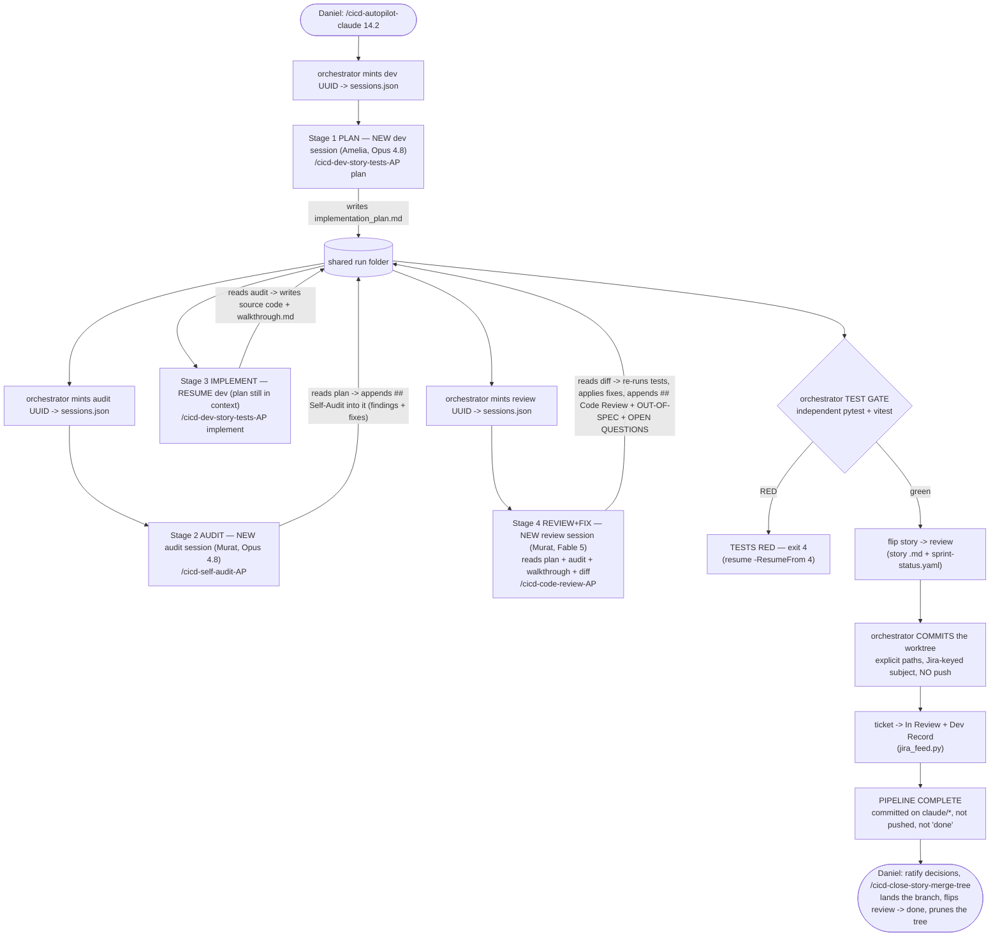
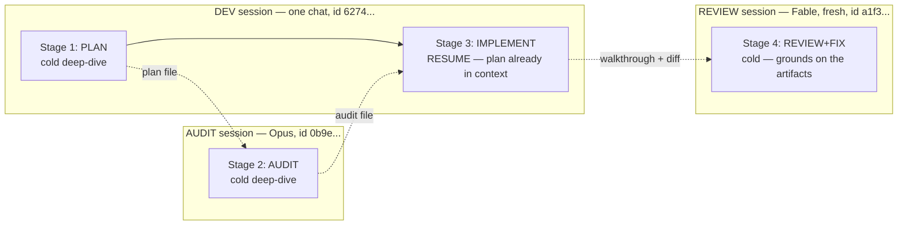
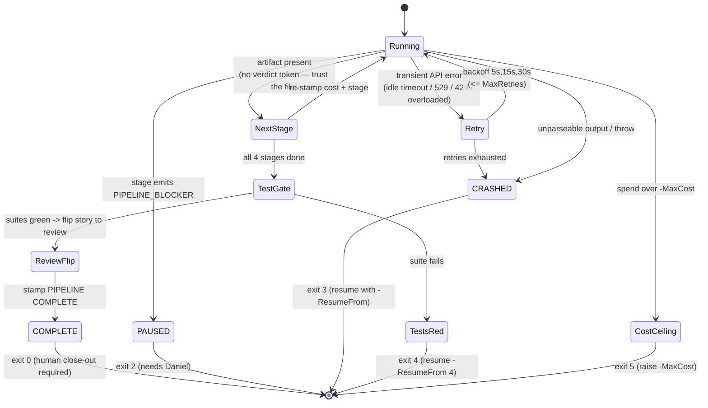
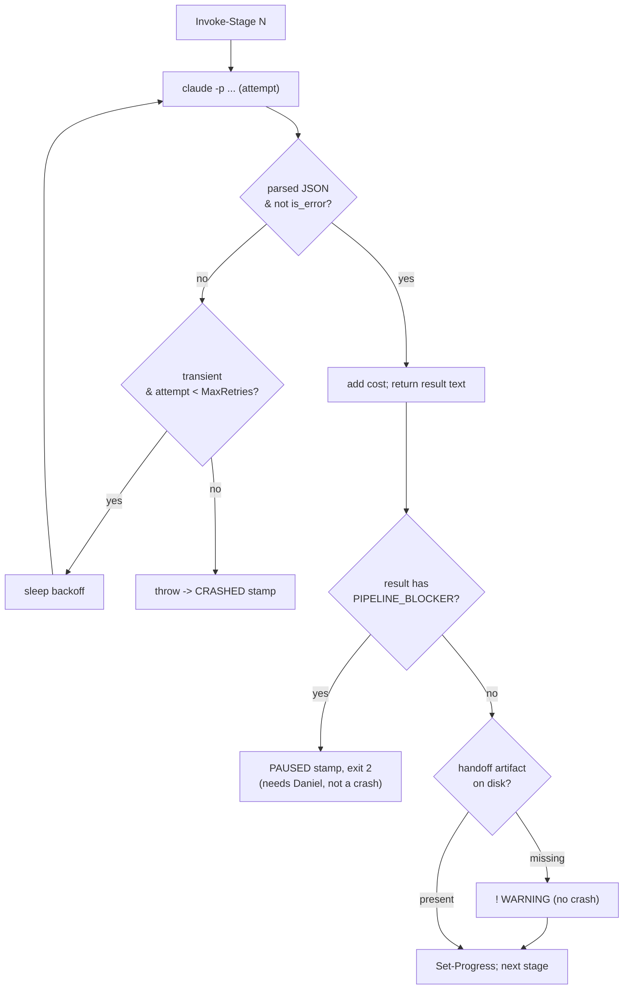

# Autopilot BMAD Dev Loop — Reference

> A one-command, fully-autonomous **dev + QA team** that takes a single BMAD story from
> `ready-for-dev` to *planned → audited → implemented → reviewed → self-fixed → committed on its own
> story branch*, then hands it to Daniel for close-out.
>
> **Engine:** `<project>/scripts/autopilot-dev-story.ps1` — **project-local and diverged between
> projects**, so there is deliberately no link: there is no one file to point at. Read the copy in
> the project you are running (`Projects/AGY_AVIATIONCHAT/scripts/`, which is its own repo and does
> not materialize in a lobby worktree) ·
> **Trigger:** `/cicd-autopilot-claude <story>` ([`.agents/commands/cicd-autopilot-claude.md`](../../.agents/commands/cicd-autopilot-claude.md)) ·
> **Status:** v2, hardened — anchored matcher, evidence-gated (no verdict tokens), dedicated `_AP`
> commands, independent test gate, auto story→`review`. Proven end-to-end on **Story 14.2** (full
> 4-stage run, $9.00, clean APPROVE, backend 1723 passed / frontend 270 passed).

---

## 1. The one-paragraph mental model

It is a **relay race between AI teammates who hand off through files.** A plain PowerShell
script (no LLM "coordinator" — that would just be tax) fires four headless `claude -p` subprocesses
in sequence. The **Dev** (Amelia, Opus 4.8) plans the story, then *resumes the same session* to
implement it. On **QA**, Murat audits the plan *before any code exists* (Stage 2, Opus 4.8 in an audit
session), then a **fresh review session** (Stage 4, Fable 5) reviews the finished code, applies fixes
itself, and writes Daniel a report. The
two teams hand off through **files in one folder**, never by talking directly.

All of that happens inside **the story's own git worktree** (`.claude/worktrees/<story-slug>/` on
`claude/<JIRA-KEY>-<story-slug>`, cut from the epic branch), so the code and the artifacts share one
root and concurrent stories cannot see each other's edits. After its own independent test gate goes
green, the script flips the story to `review`, **commits the tree** with explicit paths and a
Jira-keyed subject, and moves the work item to In Review. It **never pushes, never touches `main`, and
never marks the story `done`** — landing the branch on the epic branch and closing the story are
`/cicd-close-story-merge-tree`'s, and that last mile is always human.

---

## 2. Why it exists (the problem it solves)

A normal "dev a story" chat is one model doing everything in one pass: it plans, codes, and grades
its own homework with no independent check. The autopilot splits that into a **four-eyes pipeline**
where an **independent reviewer session** (a fresh QA chat, Murat) checks the Dev's work twice —
once on the plan (cheap, before code is written) and once on the diff. The independence comes from a
*separate session + a different persona* — and, on the final gate, from a **different model too**: the
Dev lane runs **Opus 4.8**, the QA **audit** (Stage 2) runs Opus 4.8 in its own session, and the QA
**review** (Stage 4) runs **Fable 5** in a fresh session — both QA gates at max effort (§5b), so the
final reviewer is neither the same chat nor the same weights as the author. The pre-code audit is the highest-leverage part: catching a flawed test assertion or an
unmount-order a11y bug in the *plan* costs nothing, whereas catching it after implementation costs a
red CI run and a rewrite. And because no agent grades its *own* output as the final word, the
orchestrator runs an **independent test gate** of its own after Stage 4 (§6) — it re-runs the suites
itself rather than trusting any pasted "tests green."

---

## 3. The four-stage relay

```
Stage 1  Plan        Dev/Amelia 4.8    NEW dev     /cicd-dev-story-tests-AP plan       -> implementation_plan.md
Stage 2  Audit       QA /Murat  4.8    NEW audit   /cicd-self-audit-AP  -> ## Self-Audit appended into implementation_plan.md
Stage 3  Implement   Dev/Amelia 4.8    RESUME dev  /cicd-dev-story-tests-AP implement  -> code + walkthrough.md
Stage 4  Review+Fix  QA /Murat  Fable  NEW review  /cicd-code-review-AP          -> ## Code Review appended into walkthrough.md + fixes
  then   TEST GATE   orchestrator (no LLM) re-runs pytest+vitest -> green: flip story to review -> Daniel
```

Each stage runs a dedicated headless **`_AP`** command (a lean, agent-to-agent variant of the
interactive BMAD skill, stripped of its "wait for a human" checkpoints). The orchestrator prompt is a
thin pointer: it names the `_AP` command + the shared folder + the story; the behaviour lives in the
command file.



**What each stage may and may not do:**

| Stage | Command invoked | May write | Must NOT |
|---|---|---|---|
| 1 Plan | `/cicd-dev-story-tests-AP plan` | `implementation_plan.md`, `decisions-log.md` | touch source code |
| 2 Audit | `/cicd-self-audit-AP` | the plan's `## Self-Audit` section, `decisions-log.md` | hard-halt on findings (fixes flow to S3) |
| 3 Implement | `/cicd-dev-story-tests-AP implement` | source, tests, `walkthrough.md` | re-plan; **run git at all**; touch story status |
| 4 Review+Fix | `/cicd-code-review-AP` | the walkthrough's `## Code Review` section, fixes, other walkthrough sections | **run git at all**; touch story status / `sprint-status.yaml` (the **orchestrator** owns the `review` flip AND the commit) |

Every stage's cwd is the story worktree. No stage may read or write anything in the shared checkout —
that is a different tree on a different branch, so a write there is silently lost to the story.

---

## 4. The session model — Dev continuity + decoupled QA gates

The **Dev team does its codebase deep-dive once** and carries it forward: Stage 1 (Plan) cold-starts a
chat, Stage 3 (Implement) *resumes the same chat*, so the plan is already in context — no re-derivation
tax. (v1 cold-started every stage; keeping the Dev team in one persistent chat was the original v2 idea.)

The **QA lane is two independent sessions, on purpose.** Stage 2 (Audit) runs Opus 4.8 in its own
session; Stage 4 (Review+Fix) runs **Fable 5 in a fresh session**. They are deliberately *not* resumed
into one chat, and the reason is the prompt cache. The cache is **model-scoped** — a resumed session that
changes model mid-stream invalidates the tools+system+messages cache, so a Fable Stage 4 resuming an Opus
Stage 2 would re-ingest Opus's entire audit transcript at the **full input price**, not the cheap
cache-read price. Resume's one economic benefit (cache-cheap carry-over) is exactly what a model switch
destroys. So once the QA gates run different models, decoupling is strictly better: Stage 4 opens clean
and grounds itself on the *distilled artifacts* (plan + audit + walkthrough + diff) instead of replaying
Stage 2's raw exploration. (This split was adopted 2026-07-23 to cut spend — Fable is 2x Opus per token,
so the pre-dev audit takes the cheaper model and only the final gate before the human pays for Fable.)



**How it is wired:** the script owns the session ids. It mints a UUID for a session **at the moment
that session's stage runs**, persists it to `_pipeline/sessions.json` (`dev` / `audit` / `review`), and
passes `--session-id <uuid> --name autopilot-<story>-<dev|audit|review>` on the call. The Dev id is
reused on Stage 3 via `--resume <uuid>`; the audit and review ids are one-shot. Because the ids are ours
(not parsed out of the model's output), a crashed run is still resumable — we just re-issue the id.

> **Minting on-run, not up-front, is deliberate** (a collision fix — see §8). If the ids were
> generated once at startup, a forced redo (`-ResumeFrom 1`) would re-issue `--session-id` with an
> id that *already exists*, and the CLI's behaviour on a duplicate id is undocumented.

**The honest tradeoff (measured on 13.3, under the old single-QA-session design):** resume buys
*coherence and cache reuse*, not a guaranteed per-stage cost drop. A resumed session re-sends its prior
transcript as input on every turn — billed, though at cheap cache-read rates *only while the model is
unchanged*. On 13.3 the Stage-4 resume read **676,763 tokens from cache** against just 1,359 fresh input
tokens: the continuity mechanism demonstrably worked — but that run kept QA on one model. The moment the
QA gates split across models (Opus audit → Fable review), that same cache read would be billed at full
price, which is precisely why Stage 4 is now a decoupled fresh session rather than a resume. The Dev lane
still resumes (S1→S3, same model) and still earns that cache; treat any cost savings as story-dependent,
not a law.

---

## 5. The tech stack

| Layer | What | Detail |
|---|---|---|
| **Orchestrator** | Windows PowerShell 5.1 | One script, no external deps. Plain control flow — the "coordinator" is `if`/`for`, not an LLM. |
| **Worker** | `claude` CLI (headless) | `claude -p <prompt> --model <id> --permission-mode bypassPermissions --output-format json` |
| **Continuity** | CLI session flags | `--session-id <uuid>` + `--name <label>` (new session) · `--resume <uuid>` (Stage 3 only — the QA audit/smh-review sessions are one-shot, §4) |
| **Agents** | Dedicated headless **`_AP` commands** | Prompts invoke `/cicd-dev-story-tests-AP plan`, `/cicd-self-audit-AP`, `/cicd-dev-story-tests-AP implement`, `/cicd-code-review-AP` (agent-tuned variants of the interactive BMAD skills). |
| **Models** | Opus 4.8 (Dev) · Opus 4.8 (QA audit) · **Fable 5 (QA review)** | Dev `claude-opus-4-8`, Stage 2 audit `claude-opus-4-8`, Stage 4 review `claude-fable-5` (QA split 2026-07-23). Repin via `-DevModel` / `-AuditModel` / `-ReviewModel` — one flag per *session*, since the QA gates are decoupled (§4, §5b). |
| **Effort** | `medium` (Dev) · **`max`** (QA, both stages) | Passed per call as `--effort`; set by `-DevEffort` / `-AuditEffort` / `-ReviewEffort`. This is the depth control — see §5b. |
| **Test gate** | `pytest` + `vitest`, run by the script | After Stage 4 the orchestrator re-runs the suites itself (`-TestScope auto` derives scope from the baseline diff: backend-only / frontend-only / both — and a shared-contract change (schemas / models / OpenAPI / generated types) forces both, so a cross-stack break can't slip through). It refuses to stamp COMPLETE on red. |
| **Handoff** | Artifact files | One canonical `_artifacts/<date>_autopilot-<story>/` folder; `_pipeline/` holds raw JSON + `sessions.json` + a self-contained `run.log` transcript. |
| **Telemetry** | Parsed from result JSON | `.total_cost_usd`, `.num_turns`, `.is_error`, cache token counts. |

**The exact call** (from `Invoke-Stage`):

```powershell
$cargs = @('-p', $Prompt, '--model', $Model,
           '--permission-mode', 'bypassPermissions', '--output-format', 'json')
if ($SessionMode -eq 'New') { $cargs += @('--session-id', $SessionId, '--name', $SessionName) }
else                        { $cargs += @('--resume', $SessionId) }
$raw = $null | & $Claude @cargs 2>$null | Out-String   # empty stdin; drop PS stderr-wrapping
```

### 5a. Engine vs. harness — what "model-agnostic" actually means here

The orchestrator is **not the model you are chatting with.** It is a PowerShell script that spawns its
**own** headless workers. So you can launch it from a Claude Code session, an **opencode** session, an
**Antigravity** session, or a bare terminal, and it **still runs Opus 4.8** — the worker model is the
script's `-DevModel` / `-AuditModel` / `-ReviewModel`, completely independent of whatever harness you
triggered it from.

That splits "works for all LLMs" into two independent things:

- **Harness-agnostic (done):** the `_AP` commands and this doc live in the shared `.agents/` toolkit, so
  **any** LLM session can read, understand, and trigger the loop. The engine reaches past your harness
  to Anthropic regardless.
- **Worker-engine (deliberately NOT built):** swapping the worker binary off the `claude` CLI would only
  buy **non-Claude brains** — which is exactly what we don't want — and it costs more (API per-token vs
  the Claude-subscription CLI path). It also throws away the per-role **effort** lever below, which is
  Claude-native.

**Engine Adapter** — the seam a second engine would plug into is `Invoke-Stage` (the call above):

| Engine | Headless call | Session new / resume | Telemetry | Status |
|---|---|---|---|---|
| **Claude** (`claude` CLI) | `claude -p … --output-format json` | `--session-id`+`--name` / `--resume` | result JSON (`.total_cost_usd`, `.num_turns`, `.is_error`, `.modelUsage`) | **proven runtime** (`/cicd-autopilot-claude`, Opus audit + Fable-5 review via subscription) |
| **opencode** (`opencode` CLI) | `opencode run … --auto --format json` | `--session <id>` (id **captured from the event stream** on the "new" stage, not pre-minted) | NDJSON event stream (parse adapter: `text` events -> result, `step_finish.part.cost` -> cost, `error` events -> is_error) | **second runtime** (`/cicd-autopilot-opencode`, Dev=selected default, QA=`openrouter/z-ai/glm-5.2` `--variant max`) |
| **Antigravity / Gemini** | — | — | — | IDE-bound, not headless-scriptable; **out of scope** |

> **TWO RUNTIMES NOW EXIST.** `/cicd-autopilot-claude` is the Claude-engine proven path (Opus audit +
> Fable-5 review via the Claude subscription, `--max-budget-usd` per-stage cap, `.modelUsage` mismatch
> assertion).
> `/cicd-autopilot-opencode` is the opencode-engine sibling (GLM 5.2 at `--variant max` for QA, no API
> keys, no per-stage cap, mismatch assertion is a no-op — the opencode event stream carries no
> `model` field). Both share the same artifact contract, test gate, story->`review` flip, and
> resilience model; only the `Invoke-Stage` seam + the telemetry adapter differ.

> **CURRENT RUNTIME: the `claude` CLI on Opus 4.8 — and it should stay there.** The relay, file-handoff,
> test gate, and resilience model (the rest of this doc) are already vendor-neutral; only this one call is
> Claude-bound, by choice. (The opencode engine is the second runtime above — same vendor-neutral core,
> different `Invoke-Stage` seam.)

### 5b. Tuning lever — per-stage EFFORT, per-session MODEL

Two dials, at different granularities, and the difference is not cosmetic:

| Dial | Granularity | Why |
|---|---|---|
| **Effort** (`--effort`) | **per stage** (4 values) | Effort is a per-call setting, so every stage can differ freely — including two stages inside one resumed session. |
| **Model** (`--model`) | **per session** (3 values) | A *resumed* session's model must stay constant — changing it invalidates the model-scoped prompt cache. That is why Stages 1+3 share one flag (`-DevModel`, one resumed chat), and why the two QA gates, which deliberately run *different* models, are two separate one-shot sessions rather than one resumed one (§4): `-AuditModel` (Stage 2) and `-ReviewModel` (Stage 4). |

The current ladder — Dev `opus-4-8 @ medium`, QA audit `opus-4-8 @ max`, QA review `fable-5 @ max`:

| Stage | Lane | Session | Model | Effort |
|---|---|---|---|---|
| 1 Plan | Dev | dev (new) | `claude-opus-4-8` | `medium` |
| 2 Audit | QA | audit (new) | `claude-opus-4-8` | **`max`** |
| 3 Implement | Dev | dev (resume) | `claude-opus-4-8` | `medium` |
| 4 Review+Fix | QA | review (new) | `claude-fable-5` | **`max`** |

**Depth goes to the QA lane** — Stages 2 and 4 are the last gates before the human, so both run at
maximum effort while the Dev coding lane runs at `medium`. The **strongest tier** is reserved for
Stage 4, the final gate before the human sees the work.

Findings worth keeping:

- **Effort replaced prompt keywords.** Thinking is always-on on Fable 5 / Opus 4.8, so depth is set by the
  `--effort` flag, not by writing "think hard" in the prompt. Any surviving keyword in a prompt is inert.
- **Don't trade down a tier to save money — on the *coding* lane.** We tried `-DevModel claude-sonnet-4-6`
  and found **Opus-4.8-at-lower-effort costs about the same with better results.** Dial effort down, not
  the model. `-DevModel`/`-AuditModel`/`-ReviewModel` are also how you pin a *successor* model when one ships.
- **The QA-gate exception (2026-07-23).** The Stage 2 audit *was* stepped down Fable -> Opus, held at
  `max` effort. That is a deliberate exception to the rule above, not a repeal of it: Fable is exactly 2x
  Opus per token ($10/$50 vs $5/$25 per 1M), the audit's deliverable is a findings *artifact* rather than
  code, and the final gate before the human still pays for Fable. If audit quality visibly drops, this is
  the first knob to put back.

---

## 6. Resilience model



Seven guarantees, each earned by a real incident:

1. **Transient errors retry before failing.** A regex classifies idle-timeout / overload / 429 /
   503 / 529 / generic API errors as transient and retries with `5s,15s,30s` backoff
   (`-MaxRetries`, default 3). A *non-transient* error (e.g. a bad model id) fails fast — no
   pointless retry.
2. **A crash is loud, never silent.** Any hard failure is caught and stamps
   `CRASHED - NOT FINISHED` into `_RUN-STATUS.md` (exit 3). The status file *never* lies "IN
   PROGRESS" after the process dies.
3. **Mid-run status is accurate.** After every stage *and before the test gate* the script re-stamps
   `_RUN-STATUS.md` with the running cost + which phase is next, so "ask status" mid-run is truthful —
   including during the ~100s gate (this was a bug — see §8).
4. **Runs are resumable.** A stage counts as done iff its artifact exists on disk; the orchestrator
   auto-detects the first incomplete stage and skips the rest, reusing the saved session ids.
   `-ResumeFrom N` forces a start stage; `-DryRun` prints the whole resume plan for $0.
5. **Only a genuine blocker stops the flow — and it PAUSES, it doesn't crash.** Findings never halt
   the run (audit fixes flow into the next stage). The *only* mid-run stop is a stage emitting a
   `PIPELINE_BLOCKER:` line — reserved for contradictory ACs, a missing dependency, or a product call
   only a human can make. It stamps a *graceful* `PAUSED - NEEDS DANIEL` (exit 2), not a red crash.
6. **Evidence over tokens.** A stage is "done" iff its handoff artifact lands on disk — there is **no
   verdict-token gate** (the old `Assert-Verdict` crashed complete, tests-green stages over a missing
   string; it was removed). A missing artifact is a *warning*, not a crash; the human reviews the
   folder. This is a human-in-the-loop pipeline: it trusts the artifacts, not a phrase.
7. **The pipeline verifies green itself.** After Stage 4 the orchestrator re-runs the suites
   independently (`pytest` + `vitest`, scoped by `-TestScope`) rather than trusting the agents' pasted
   "tests green." A red gate stamps `TESTS RED` (exit 4); only a green gate advances the story to
   `review` and stamps `COMPLETE`. (A missing runner stamps `TESTS UNVERIFIED` rather than a false green.)

**Per-stage runner logic:**



---

### 6a. Done-means-green — the law the engines port (SCC-134, under SCC-38)

The seven guarantees above are what the v2 engine *does*. This block is what every engine — the
Claude, DeepSeek/GLM and opencode lanes, and the four project-local `.ps1` copies that drift from
them — **must keep doing when it is ported, rewritten or tuned.** Engines are project-local; this
spec is the propagation layer, so the law lives here and not in any one script.

1. **A stage's gate is a script with an exit code — never the agent's self-assessment.** "Tests
   green" pasted by an agent is a claim; the orchestrator's own independent suite run (guarantee 7)
   is the evidence, and only that flips a story to `review`. An engine that lets a stage declare
   itself done has removed the gate, whatever its log says.
2. **Retries are engine-owned, deterministic and hard-bounded.** The counter lives in the
   orchestrator (`-MaxRetries`, backoff, then `CRASHED` — guarantees 1 and 2). The spawned agent has
   **no authority and no instruction path to spawn further attempts of its own**; an agent that
   retries itself is an unbounded loop with a budget attached.
3. **Skip-if-unchanged.** A gate that failed is not re-run while the workspace it failed on is
   byte-identical — that is pure credit burn. Re-run only after something changed, and say what.
4. **Park with a receipt on exhaustion, never thrash.** When retries or the cost ceiling run out,
   the engine stops with the gate output, the attempts and the shas written down for the human
   (`PAUSED` / `TESTS RED` / `COST CEILING` in `_RUN-STATUS.md`) — not a silent loop, not a
   softened gate.
5. **Idempotent resume by `(stage, sha)`.** A stage's completion is recorded against the artifact
   it produced (guarantee 4); re-running the pipeline returns the record instead of redoing the
   stage, and `-DryRun` shows the resume plan for $0.

**What is deliberately NOT here — red gates stay human-in-the-loop.** The 08-12 plan for SCC-38
proposed that a red gate spawn a fresh, engine-owned fix session (max two retries) before parking.
That was **dropped, not deferred**, on the 2026-08-15 assessment: v2 stops on `TESTS RED` for the
operator by design (guarantee 5's spirit — only a human decides what a red means), and reviving
an auto-fix loop is a design reversal, not a tuning knob. If it is ever wanted it returns as an
opt-in flag under a new ticket, with these five points as its floor.

## 7. The artifact handoff folder

Everything for a run lives in one place — **inside the story worktree**, because `_artifacts/` is
tracked and the run folder has to ride the story branch to land with the story. The resumed agents read
these files instead of re-deriving:

```
.claude/worktrees/<story-slug>/_artifacts/epic_<N>/<date>_autopilot-<story>/
├── implementation_plan.md        (Stage 1 — Dev; Stage 2 QA appends ## Self-Audit — findings + proposed fixes + `Audit verdict:` line)
├── walkthrough.md                (Stage 3 — Dev: ## Task Checklist outline + ## Evidence + ## Suite Ledger + ## Your Actions;
│                                  Stage 4 QA appends ## Code Review (`Verdict:` line) and prepends QA CLOSE-OUT to the TOP)
├── decisions-log.md              (any stage — every story-silent call the team made)
├── _RUN-STATUS.md                (live status: IN PROGRESS / TEST GATE / COMPLETE / PAUSED / TESTS RED / CRASHED)
└── _pipeline/
    ├── sessions.json             ({"dev":"<uuid>","qa":"<uuid>","review":"<uuid>"} - "qa" is the Stage-2 audit session)
    ├── run.log                   (self-contained transcript — stage headers + each result + final banner)
    ├── stage{1..4}-*.json        (raw CLI result JSON per stage — cost, turns, etc.)
    └── gate-tests-*.txt          (independent test-gate output: backend / frontend)
```
(Runs before 2026-08-02 also hold standalone `self-audit-stress-test.md` / `code-review.md` — read-only
history; the two-doc model replaced them.)

> **The run is self-contained.** The global live-tail log lives at `_artifacts/_autopilot-run.log`
> (the stable path the `/cicd-autopilot-claude` skill tails), but the folder *also* keeps its own `_pipeline/run.log`
> copy — so opening just the run folder shows the whole story without hunting for the global log.

The artifact/section-presence map *is* the resume logic: `1 = implementation_plan.md exists`,
`2 = the plan contains an "Audit verdict:" line (## Self-Audit)`, `3 = walkthrough.md exists`,
`4 = the walkthrough contains a "## Code Review" section (Verdict: line)`. A legacy standalone
`self-audit-stress-test.md` / `code-review.md` from an old run still counts as its stage's evidence.

**QA owns the last mile.** Because Stage 4 is the final agent before the human, it writes two
spotlight sections at the **top** of `walkthrough.md`:

- `## OUT-OF-SPEC DECISIONS (QA judgment calls - your review)` — every call the team made that the
  story didn't cover, so Daniel can ratify or reverse.
- `## OPEN QUESTIONS FOR DANIEL` — anything the team genuinely couldn't resolve. The agent is
  explicitly *allowed to ask* here rather than forcing everything into a blocker.

---

## 8. Things we discovered building it (the war stories)

Each of these is a real bug or insight from the shakedown runs, now baked into the design:

- **A polished artifact is not a finished story.** A plan or a half-written walkthrough *reads* as
  done. The pipeline therefore makes incompleteness loud (`_RUN-STATUS.md` markers) and never relies
  on the *absence* of a signal to mean "not done." (See the project rule `completion-not-illusion`.)

- **TUNING-1 — stale mid-run status.** v1 only wrote `_RUN-STATUS.md` at start/halt/crash/end, so
  "ask status" mid-run showed `$0.00` and no current stage. Fix: re-stamp after every stage with the
  running cost. Confirmed live on 13.3 (`$1.26` after Stage 1).

- **Session-id collision (caught by a forced-failure test).** Generating both UUIDs up front meant a
  forced redo re-issued `--session-id` with an already-existing id. Fix: **mint on-run** — generate
  the id when its stage actually runs, persist then. A forced redo now gets a clean id.

- **The "exit -1 / stuck IN PROGRESS" red herring.** A crash test once looked like the script hung.
  Root cause was the *test harness*: piping the child through `Select-Object -First 1` closed its
  stdout early and killed it mid-`catch`. The script was fine; the *measurement* was wrong. Lesson:
  consume a child process's full output before judging it.

- **UTF-8 mojibake in captured stdout (TUNING-2).** PowerShell captured the CLI's UTF-8 as cp1252,
  turning em-dashes into `ΓÇö` in the saved JSON. Fix: set `[Console]::OutputEncoding = UTF8` before
  the calls. (Handoff was always safe — it goes through files the model writes, not the captured
  string — but the saved JSON now reads cleanly.)

- **PowerShell scripts must be pure ASCII.** PS 5.1 reads a UTF-8-no-BOM file as ANSI, so a smart
  quote or em-dash in the *script* breaks parsing. Every edit is gated on a 0-non-ASCII + 0-parse-
  error check.

- **Continuity is a cost *tradeoff*, not a free win.** Resume re-sends the prior transcript as
  billed input. The payoff is coherence + cache-cheap context reuse (676K cache-read tokens on
  13.3's Stage 4), not necessarily a cheaper stage. State the win honestly.

- **Agents drop "boring" bookkeeping on a clean pass (the Stage-4 hard-gate bug).** On 13.3, QA did
  everything substantive right but, finding *no fixes needed*, folded its review into `walkthrough.md`
  and **skipped the standalone `code-review.md`** (plus the 4.8 commit attribution and the verdict
  line). The artifact gate correctly stamped `CRASHED`. Root cause: the prompt buried "write
  code-review.md" as one of eight numbered steps. **Fix:** restructure the Stage-4 prompt into
  *review WORK* + a loud **"REQUIRED OUTPUT FILES — this stage FAILS if any is missing"** block that
  demands `code-review.md` *even on a clean review*. General lesson: **separate the judgment work
  from the mechanical deliverables and make the deliverables un-collapsible.**

- **Don't tell a resumed agent "don't re-research."** Early drafts of the team preamble said "you
  already analyzed this, don't re-investigate." That's a quality threat — the agent can over-read it
  and skip *new* investigation it genuinely needs. Continuity is mechanical (the context is already
  there); the prompt only frames it as a *convenience, never a restriction*. (Memory:
  `continuity-prompts-no-research-suppression`.)

- **The audit pays for itself.** On 13.3 the pre-code audit caught (a) a coverage gap where tests
  asserted the callback but never the user-visible "WE'RE LIVE" + Sign-In that the AC names, and
  (b) an a11y live-region placed inside a component that *unmounts at the exact moment* it should
  announce. Both were fixed before a line of code existed.

- **The story-id matcher collided `14.1` with `14.10` (R1).** The unanchored `*14-1*` glob matched
  both `story-14-1-…` and `story-14-10-…`. Fix: dash-normalize *both* the id and each filename, then
  boundary-match `(^|-)<id>(-|$)`. The folder slug is now derived from the **resolved story id**, so it
  is always the clean `…_autopilot-14-2` (the old code slugified the whole *path* →
  `…_autopilot-bmad-bmm-stories-story-14-1-…-md`).

- **The verdict-token gate crashed complete, tests-green work (R1 — the reason §6 guarantee 6 exists).**
  The old `Assert-Verdict` demanded a literal `PIPELINE_*_OK` string; a stage that did everything right
  but phrased its verdict in natural language got stamped CRASHED. Removed entirely — a stage is done
  iff its artifact is on disk. The first principle: **trust the artifacts, not a token.**

- **The orchestrator was too rigid about form when it already had the substance (R1).** The fix above
  generalised: the run no longer hard-fails on a missing handoff artifact either (it *warns*), because
  this is human-in-the-loop — Daniel reviews the folder. The only stop is a genuine `PIPELINE_BLOCKER`,
  and even that PAUSES gracefully rather than crashing.

- **The folder-vs-log split sent the human to the wrong directory (R2).** The live transcript lived
  OUTSIDE the run folder; mid-run, a *parallel team's* folder changed and read as the autopilot's
  output. Fix: mirror the transcript into `_pipeline/run.log` so the run folder is self-contained.

- **The ~100s "silent gap" at the test gate (R2).** Between Stage 4 and COMPLETE the gate runs both
  suites with almost no output — it looked hung, and `_RUN-STATUS.md` read a stage stale. Fix: a
  pre-gate `IN PROGRESS - TEST GATE` re-stamp + the monitor now streams the `>>> TEST GATE` heartbeat.
  (Bonus: a bare `WARNING` monitor token false-fired on pytest's `_GENERIC_LOAD_METHOD_WARNING`;
  anchored it to the script's own `! WARNING` prefix.)

- **The pipeline left the story at `ready-for-dev` — the human had to flip it (R2).** On the 14.2 run,
  close-out meant manually setting the story to `review`. That *is* the BMAD "Dev finishes → review"
  step, so the orchestrator now does it on a green gate: flips the story to `review` in BOTH the `.md`
  and `sprint-status.yaml` — idempotent (only `ready-for-dev`/`in-progress` advance), **never `done`**
  (the human owns `review → done`), best-effort (a flip hiccup warns, never crashes a finished run).

- **The full pipeline is proven end-to-end (Story 14.2, 2026-06-24).** All four stages + the
  independent gate ran clean: **$9.00**, verdict APPROVE, backend **1723 passed** / frontend **270
  passed**. The team caught a **stale story premise** (an AC claimed a prior story had removed the last
  V1 dossier caller — it hadn't; the Admin Socratic-grader still wrote it) and adjudicated
  *delete-not-migrate*, logging it to `decisions-log.md`. That is the four-eyes value in one run:
  the plan questioned a wrong premise instead of blindly executing it.

---

## 9. How to run it

```powershell
# Full run
.\scripts\autopilot-dev-story.ps1 -Story 13.4

# See the resume plan + session ids, spend nothing
.\scripts\autopilot-dev-story.ps1 -Story 13.4 -DryRun

# Cheap trial: plan + audit only (stop after Stage 2)
.\scripts\autopilot-dev-story.ps1 -Story 13.4 -MaxStage 2

# Re-run only the review+fix leg (opens a fresh review session, re-grounds on the artifacts)
.\scripts\autopilot-dev-story.ps1 -Story 13.4 -ResumeFrom 4
```

Or trigger via the slash command: **`/cicd-autopilot-claude 13.4`**.

| Parameter | Default | Purpose |
|---|---|---|
| `-Story` | (required) | `"14.2"` or a path to the story `.md` |
| `-DevModel` | `claude-opus-4-8` | model for Stages 1 & 3 (Dev lane) |
| `-AuditModel` | `claude-opus-4-8` | model for Stage 2 (QA pre-dev audit, own session) |
| `-ReviewModel` | `claude-fable-5` | model for Stage 4 (QA final review+fix, own session) |
| `-DevEffort` | `medium` | `--effort` for Stages 1 & 3 · `low\|medium\|high\|xhigh\|max` |
| `-AuditEffort` | `max` | `--effort` for Stage 2 (pre-dev audit) |
| `-ReviewEffort` | `max` | `--effort` for Stage 4 (final review+fix) |
| `-MaxStage` | `4` | stop after this stage (1–4) |
| `-ResumeFrom` | `0` (auto) | force a start stage (1–4) |
| `-MaxRetries` | `3` | transient-error attempts per stage |
| `-MaxCost` | `40` | run-level $ ceiling, checked between stages; halts if spend crosses it (`0` disables) |
| `-MaxStageCost` | `15` | per-stage cap, enforced *inside* the call via `--max-budget-usd`, so one stuck stage self-halts (`0` disables) |
| `-TestScope` | `auto` | independent gate: `auto` (scope from baseline diff: backend-only / frontend-only / both; a shared-contract change forces both) / `backend` / `frontend` / `both` / `none` |
| `-DryRun` | off | print the plan + sessions + the worktree that would be cut, no spend (and nothing written) |
| `-EpicBranch` | (the checkout's current branch) | the epic branch the story tree is cut from; must be an `epic/*`, and supplies the Jira key |
| `-NoWorktree` | off | debug only: run in the shared checkout. No isolation, no commit, and close-out will refuse to land it |
| `-JiraKey` | (looked up on the board) | the story's work item, for the Dev Record + the move to In Review |
| `-NoJira` | off | skip the board update entirely (the story file + `sprint-status.yaml` still flip) |
| `-NoCommit` | off | skip the orchestrator's commit; the tree is left dirty for a human |

**Exit codes:** `0` complete · `2` paused on a blocker · `3` crashed (resume with `-ResumeFrom`) ·
`4` test gate red (resume `-ResumeFrom 4`) · `5` cost ceiling hit (raise `-MaxCost`).

---

## 10. The human close-out (always required)

The pipeline stops at "developed + reviewed + fixed, gate-verified green, story advanced to `review`,
**committed on its own branch**, ticket at **In Review**." On a green gate it flips the story (both the
story `.md` and `sprint-status.yaml`), commits the worktree with explicit enumerated paths and a
Jira-keyed subject, files the Dev Record, and moves the work item. But it deliberately does **not**:

- **push** anything — not the story branch, and never `main`,
- land the branch on the epic branch,
- mark the story `done`, or
- make the judgment calls on the team's out-of-spec decisions.

Daniel's close-out: read the **QA CLOSE-OUT** + **OUT-OF-SPEC DECISIONS** + **OPEN QUESTIONS FOR
DANIEL** at the top of `walkthrough.md`, ratify (or reverse) the team's story-silent calls, then run
`/cicd-close-story-merge-tree` — it runs `/cicd-update-sprint-memory`'s save (which is what flips
`review → done`), lands the `claude/*` branch on the epic branch, and prunes the tree. That last mile is
the point: the autopilot does the labor and parks the story at `review` with the work already committed;
the human owns the judgment, the landing, and the `done` flip.

**Why the worktree is what unblocked this.** `/cicd-close-story-merge-tree` Step 3 refuses to land a story
whose HEAD is not a `claude/*` branch inside a worktree. Until the engines opened one, the autopilot's
output could not be closed out by the normal flow at all — the close-out was not "not automated", it was
*impossible*. The tree, not tidiness, is the payoff.

---

## 11. What is NOT yet proven

- **The whole worktree + commit + Jira change (AVCH-50 / SCC-41), on a real run.** It was written and
  statically verified on a Mac — both engines parse clean under `pwsh`, and PSScriptAnalyzer reports no
  new findings against the pre-change baseline — but this lane is Windows-only (`powershell.exe`,
  `%USERPROFILE%`, `.venv\Scripts\python.exe`), so **not one stage has been executed against it.**
  What a first real run has to show, per engine: two concurrent stories cannot see each other's files ·
  the gate runs green inside the tree and finds the right interpreter · `-ResumeFrom` re-binds to the
  SAME tree instead of cutting a second one · the orchestrator's commit passes the armed `commit-msg`
  hook · `/cicd-close-story-merge-tree` accepts the result and lands it. Start with `-DryRun` (it creates
  nothing and prints the tree, branch and base it *would* use), then a small story with `-MaxStage 2`.
- **The retry *loop* firing live.** The backoff path is verified by code inspection + a regex
  classification test, but no real transient failure has been forced on demand (a bad model id is
  correctly *non-transient*, so it never enters the loop).
- **The story→`review` auto-flip firing on a real green gate (R2).** Verified at $0 — clean parse, and
  the two flip regexes unit-tested against the real `sprint-status.yaml` line format (idempotent,
  comment-preserving, no `14-2`/`14-20` prefix collision). It is deterministic PowerShell (not headless
  command expansion), so risk is low; the next real run exercises it and prints
  `>>> STORY STATUS - … flipped to review`.

**Now proven (previously open):** the full four-stage relay **and** the independent test gate ran
end-to-end on **Story 14.2** — including the Stage-4 "required `code-review.md` even on a clean review"
gate (Stage 4 produced `code-review.md` on a clean APPROVE and stamped `PIPELINE COMPLETE`), the `_AP`
headless command expansion, and the anchored matcher / clean folder slug.

---

*Source of truth is always the script + `.agents/commands/cicd-autopilot-claude.md`. This doc is the map, not
the territory — if they disagree, the script wins.*
