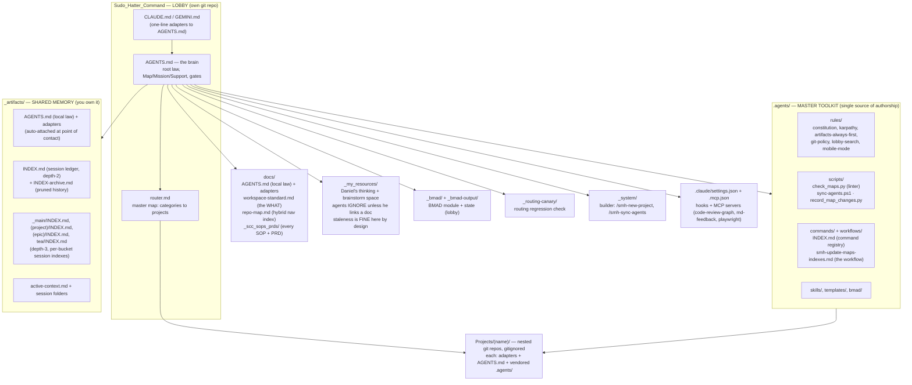
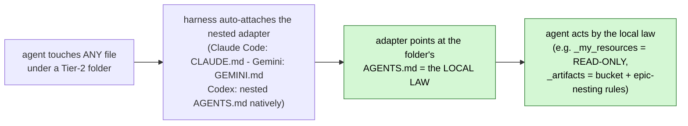
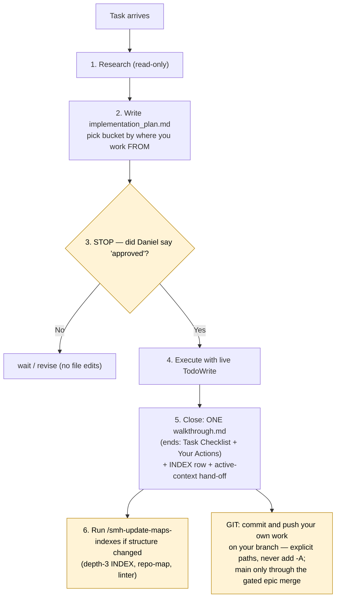
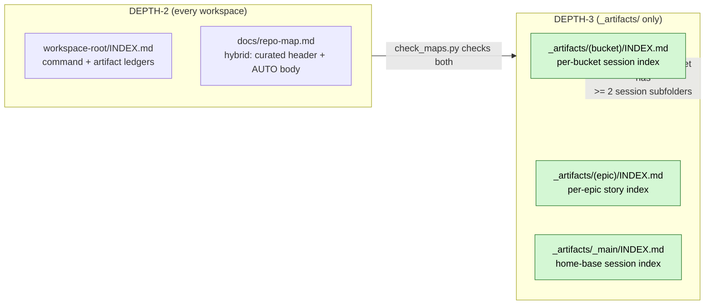
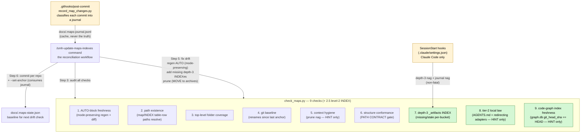
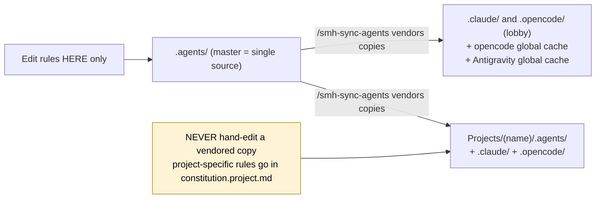

# The Home-Base System — Guide & Overview

> **What this is.** The one-stop guide to what we built in `Sudo_Hatter_Command` and how it works: a
> **folder-as-workspace routing system** where the folder is the app, markdown is the program, and the
> model *becomes* the agent each workspace describes. This is the living overview; the deeper docs it
> sits on top of:
>
> | Doc | Role |
> |---|---|
> | `_my_resources/research_docs/implementation-plan_folder-as-workspace-routing-system.md` | the **theory** (mentor transcript, distilled). In Daniel's thinking space — read it only when he links it |
> | ~~`_my_resources/docs/master-implementation-plan.md`~~ | the rollout record — **gone**; that folder no longer exists. The build history is the git log and `_artifacts/_main/` |
> | `docs/workspace-standard.md` | the **standing spec** (PATH CONTRACT, tier model, upkeep rules) |
> | `.agents/workflows/smh-update-maps-indexes.md` | the **maintenance workflow** (how it stays honest) |
> | *this file* | the **guide & overview** (read this first) |

---

## 1. The idea in one paragraph

Never load what the task doesn't need — that's the whole game. Instead of one mega-prompt or N
hard-coded agents, the system is a tree of folders where every workspace answers three questions the
moment an agent enters: **MAP** (where am I, where can I go), **MISSION** (what is the work here), and
**SUPPORT** (what tools/rules/skills to pull). Entry files auto-load, a router dispatches, routing
tables say *read this / skip that / use skill Z*, and everything persists to files **we** own — not a
vendor's memory. It works identically in Claude Code, opencode, and Antigravity/Gemini because the
brain is always `AGENTS.md` and each LLM's front door is a one-line adapter.

## 2. The home base at a glance

### 2.1 `docs/` vs `_my_resources/` — the two folders get OPPOSITE treatment (SCC-74, 2026-08-10)

This is the one distinction worth memorising, because getting it wrong is how documentation rots.

| | `docs/` | `_my_resources/` |
|---|---|---|
| What it is | the **maintained** surface | Daniel's **thinking + brainstorming space** |
| Agents | read it, keep it correct | **ignore it** unless he links a specific document |
| Staleness | must never happen | **fine by design** — it is a scratchpad, not a contract |
| Drift-checked | yes — `check_maps.py`, repo-map regen, the doc graph | **no, deliberately** |

**Why the split had to become a rule.** Every procedural doc in this system used to live in
`_my_resources/`. That folder is named in `SCAN_IGNORES` (`check_maps.py`), in
`DEFAULT_REGEN_IGNORE`, and in the code graph's exclusion list — its own local law says *"excluded
from repo-map regen + linter scans … do not fix that."* So thirteen documents that tell the operator what
to type sat where **every drift-checker in this system is forbidden to look.** They did not rot from
neglect; nothing was *able* to notice. The proof was sitting in the open: the index they lived under
listed 2 files that did not exist and omitted 4 that did.

> **Since SCC-289 the centre carries no code graph at all** — it is markdown, and a code graph
> parses code. The exclusion that mattered is still live in `SCAN_IGNORES` and
> `DEFAULT_REGEN_IGNORE`, and `docs/` is now a root of the **doc graph**, which is what actually
> checks these pages for drift. See `docs/doc-graph.md`.

SCC-74 moved them to `docs/_scc_sops_prds/`, which put them in scanner scope for free — and because
it is a **level-2 folder**, `check_maps.py` check 2.5 now *requires* it to carry an accurate
`INDEX.md`. A dedicated test (`.agents/scripts/tests/test_sops_prds_folder.py`, in `run_all`) pins
the manifest, checks the INDEX against the directory in both directions, and verifies every
`/command` reference names a real command master.

**The consequence for you:** a procedural doc found in `_my_resources/` is a defect by definition —
move it. And never "fix" the ignore lists to make `_my_resources/` scannable: its exemption is what
makes it safe to think out loud in.

## 3. How an agent finds its way (the routing walk)

1. **Auto-load.** The harness injects the front door: `CLAUDE.md` (Claude) or `GEMINI.md` (Gemini) —
   one line: *read `AGENTS.md`*. Codex/opencode read `AGENTS.md` natively. One brain, many doors.
2. **Root law.** `AGENTS.md` is numbered for skip-to-N: `1 START HERE` · `2 MAP/MISSION/SUPPORT` ·
   `3 ALWAYS-LOAD` (only `constitution.md` + `karpathy-guidelines.md` + `artifacts-always-first.md`) ·
   `4 WHAT LIVES WHERE` · `5 NAMING & ARTIFACT PLACEMENT` · `6 GATES` · `7 PERSISTENCE` · `8 PORTABILITY`.
3. **Route.** A "what should I work on / whose is this" question → `router.md` — the lobby directory,
   **categories only** (detail lives on each floor). Every floor routes back up: *if it's not here, go
   back to the root router* — an agent can never dead-end.
4. **Become the agent.** The target workspace's `AGENTS.md` (Layer 2) carries its own
   Map/Mission/Support and the **routing table** — the single most important thing in the system:
   *task → read these / skip these / skills*. Rules and skills (Layer 3) load only when a table row
   calls them.

**The reading-order rule (root law §1.7):** entering any folder — if it carries an `AGENTS.md`, read
that FIRST (the local law: how to *act* here); read `INDEX.md`/`README.md` only when you need the
*inventory*. They are complements: `AGENTS.md` = behavior, `INDEX.md` = contents.

### The folder-file tier model (which folders get an `AGENTS.md`)

| Tier | What | Folders | Carries |
|---|---|---|---|
| **1 — Floors** | work happens here | lobby root, each `Projects/(name)/`, `_system/`, `_routing-canary/`, `.agents/` | full `AGENTS.md` (brain) + 1-line adapters |
| **2 — Guarded infrastructure** | rules apply here, work doesn't | `_artifacts/`, `_my_resources/`, `docs/` | ~15-line **local-law `AGENTS.md`** + 1-line adapters |
| **3 — Leaf content** | storage | epic buckets, session folders, `docs/_scc_sops_prds/`, board sessions | `INDEX.md`/`README.md` only — **no** `AGENTS.md` |

**Why the adapters give this teeth** (auto-attach — no reliance on the model choosing to read):

A Tier-2 `AGENTS.md` is a *digest that points at canon* — never a second canonical copy. Not every
folder gets one: boilerplate in every hop burns tokens, drifts, and kills the beacon.

## 4. Where work lands (artifacts + persistence)

**The plan-first lifecycle every task runs:**

**Bucket rule — artifacts go where the work is OWNED, not where you were standing.**
⚠️ This rule was inverted on 2026-07-30 (`_artifacts/_main/2026/07/2026-07-30_project-first-artifact-locality/`)
and this page described the old one until SCC-83 caught it. It used to say *"where you work
FROM (your cwd)"*, which put a project's history in the lobby whenever a chat happened to start
there — the same history then existed in two places depending on where someone sat.
- A **project's** work → **that project's own** `Projects/<name>/_artifacts/`, *even when the
  chat started in the lobby*. Ownership decides, cwd never does.
- **Home-base / cross-project** work → `_artifacts/_main/` (this repo's own ledger)
- Sudo-managed exceptions → their named home-base buckets
- Stories → nest under the parent epic: `(epic)/(story)/` — the epic folder houses its stories
- opencode → the same rules, inside an `_artifacts/opencode/` namespace created on first use

Full model: root `AGENTS.md` §7 · `.agents/rules/artifacts-always-first.md`.

**Persistence (pick up / hand off):** *"pick up"* reads a read-only continuity brief from the right
`active-context.md`, then surfaces open work **from the live Jira board** — `In Progress` →
`To Do Next` → `To Do`, first non-empty rank wins. ⛔ **Not from `todo_list.md`** — that was retired
as an agent source on 2026-08-09: it is personal notes, it goes stale, and it duplicates tickets that
already exist. This page said otherwise until SCC-83; the board is the queue. *"hand off"* prepends
one dated block to the brief, appends one `INDEX.md` row, and reads it back to verify. Memory
lives in **our files**, not the vendor's — survive any context reset, switch LLMs freely.

**Pruning is a MOVE, never a delete** (verified 2026-07-09 end-to-end): old brief blocks →
`active-context-archive.md`; old ledger rows → `INDEX-archive.md`; consumed maps-journal lines →
`.maps-journal-archive.jsonl` (the script appends to the archive *before* rewriting the live file).
History stays readable — just out of the hot path.

## 5. The two-layer INDEX contract (depth-2 + depth-3)

**Why depth-3 only for `_artifacts/`:** session folders are content-rich (bug-tracking history, story
context). Code dirs use the code graph + the repo-map AUTO block instead — a depth-3 INDEX there would just
duplicate what the graph already indexes.

## 6. How it stays honest (the maintaining system)

Four pieces: the **linter** (detect), the **recorder** (pre-scope), the **workflow** (reconcile), and
the **hooks** (nag).

### check_maps.py flags

| Flag | What it does |
|---|---|
| `--all` | Run all 9 checks (+ the unnumbered level-2 INDEX presence check, "2.5") across all conformant workspaces |
| `--depth3-only` | Run ONLY check 7 (depth-3 INDEX); exits 0 always — for the SessionStart nag |
| `--set-anchor` | Write current state to `docs/.maps-state.json` + consume the maps-journal (run AFTER committing) |
| `--ignore <dirs>` | Skip dirs (lobby: `Projects,_my_resources`; projects: `_my_resources,_bmad`) |

**Fan-out:** run from the home base, `/smh-update-maps-indexes` reconciles the lobby **and every conformant
project** in one pass (each repo commits + re-anchors separately). Run inside a project, it does just
that workspace.

### The four SessionStart hooks (Claude Code only) + one PreToolUse guard

| # | Hook | What it does |
|---|---|---|
| 1 | continuity + gate + repo-map | Injects `_artifacts/_main/active-context.md`, the artifacts/git gate text, AND the full `docs/repo-map.md` |
| 2 | repo-map drift check | `check-repo-map-drift.ps1` — nags on top-level folders on disk but missing from the map |
| 3 | depth-3 nag | Runs `check_maps.py --depth3-only` — surfaces drift without blocking |
| 4 | maps-journal nag | Runs `record_map_changes.py --nag` — pre-scoped drift worklist since the last anchor |
| PT | git push approval | PreToolUse on Bash: `.claude/hooks/require-push-approval.py` guards agent `git commit`/`push` |

> **Platform note:** hooks fire only on Claude Code. opencode and Antigravity/Gemini get the full
> linter when `/smh-update-maps-indexes` runs.

### The routing canary (`_routing-canary/`)

The smallest thing that proves the routing mechanism works in any tool: paste ONE entry-file path into
a fresh agent with no other text → it hops adapter → `agent.md` → `control/` → fetches words from a
skill file → writes `Power.md` == `control your agent` → replies "done boss". **Re-run it whenever
routing structure changes** (root `AGENTS.md`, `router.md`, the adapter pattern) or when qualifying a
new LLM/CLI; reset `Power.md` to its placeholder after. (Last green: 2026-07-09, post root-law slim.)

## 7. One rule set, one source (the anti-drift model)

- **The loop:** edit master `.agents/` → `/smh-sync-agents` (or `/smh-sync-agents <project>`) → byte-identical
  copies land on all three platforms + the projects.
- **Fresh_Workspace_BMAD is the living template** — every new project clones it (`<PROJECT_NAME>`
  placeholders, one find-replace). Any structural change at the home base must land in Fresh
  (`living-template-sync` rule; `/smh-sync-agents` auto-flags Fresh drift). `/smh-new-project` scaffolds and
  registers a new workspace in `router.md`.
- **Lobby-only search gotcha:** from the lobby root, Grep/Glob are **blind to `Projects/`** (ripgrep
  honors the lobby `.gitignore`). Point Grep at `Projects/<name>` or sweep with Bash `find`. Full
  mechanics → `.agents/rules/lobby-search.md`.

## 8. The git model (locked)

- **Desktop default:** agents never run `git commit`/`push` — the walkthrough's "Your Actions" hands
  Daniel the exact command (explicit paths, never `git add -A`). Exception: an explicitly delegated,
  per-action commit. Enforced by the PreToolUse hook.
- **Branch model:** `main` is the ONLY long-lived branch (live production — a push deploys). Each epic
  gets a short-lived `epic/<key>-<slug>` branch off `main`; story worktrees branch from and land on it;
  the epic merges to `main` only via `/cicd-push-e2e` (full gate + `/cicd-e2e` green + Daniel's
  sign-off, `--no-ff`, epic branch deleted after). Ad-hoc work: short-lived `chore/*` off `main`,
  merged same-session with sign-off. Canon: `.agents/rules/git-policy.md`.
- **Web/mobile** (`CLAUDE_CODE_REMOTE=true`): the agent owns git delivery instead → `mobile-mode.md`.
- Each project is its **own repo** — one commit per touched repo, never cross-commit.

## 9. The MD Feedback review loop

Daniel annotates any `.md` (plan, walkthrough, draft) in VS Code — highlight / fix / question — and
says **"review"**. The agent then: returns to that document, reads the annotations (via the
`md-feedback` MCP server or the `<!-- USER_MEMO -->` blocks), addresses fixes and answers questions,
and resolves memos **only through the MCP tools** (`apply_memo`, `batch_apply`) — never by hand-editing
the HTML blocks (that corrupts tracking hashes).

**Where the server is wired (2026-07-09):** every workspace (lobby, AGY_AVIATIONCHAT,
Fresh_Workspace_BMAD) carries it in all four config surfaces — root **`.mcp.json`** (what Claude Code
actually reads), plus `.claude/mcp.json`, `.opencode/mcp.json`, `.antigravity/mcp.json`. Requires
Node 18+ (`npx -y md-feedback`). New/changed servers appear after a session restart + approval.

## 10. Workspace status (which repos are conformant)

| Workspace | Conformant? | repo-map mode | Notes |
|---|---|---|---|
| Lobby (home base) | ✅ Yes | `content` | ignore `Projects,_my_resources`; `_bmad/custom/` guard + dialect tomls (2026-07-09 — guards direct lobby-rooted BMAD runs) |
| AGY_AVIATIONCHAT | ✅ Yes | `content` | ignore `_my_resources,_bmad`; project rules in `constitution.project.md`; `_bmad/custom/` guard + TDAD dialect tomls (2026-07-09) |
| Fresh_Workspace_BMAD | ✅ Yes | `auto` | ignore `_my_resources,_bmad`; **the living template — born enforcing since 2026-07-09**: armed TEA gate (`_bmad-output/sudo-tests.yaml`), CI gating `main` + `epic/**` (`pr-check.yml`), BDD layer (`backend/tests/features/` + self-binding `tests/bdd/steps_*.py`), `_bmad/custom/` guard + dialect tomls + resolver scripts |
| BRKN_Tattoos | ⏳ active | — | active in `router.md`; conformance not yet audited |
| RAG_Pipeline_AC (AviationChat ingestion) | ❌ No | — | needs `/smh-new-project` or manual standardization |
| B-L-WorldWide · NEXGen-Films · OpenChat-Openrouter | ❌ pending | — | registered in `router.md`, not yet converted |

## 10a. Glossary — the vocabulary

Absorbed from `complete-system-overview.md` when SCC-80 retired it (2026-08-10): seven of that
doc's ten sections had a counterpart here, and this table was the part that did not.

| Term | Means |
|---|---|
| **Lobby** | The home base root — you start here, route out from here. |
| **Floor / workspace** | A project under `Projects/<name>/`, with its own `AGENTS.md` and git repo. |
| **Adapter** | The one-line `CLAUDE.md` / `GEMINI.md` that just says "read `AGENTS.md`." |
| **The brain** | `AGENTS.md` — the single source of behavior for a folder. |
| **Routing table** | The task → read / skip / skills table inside an `AGENTS.md` (the heart of the system). |
| **Master toolkit** | `.agents/` — the one place rules, commands and skills are authored. |
| **Vendored copy** | A synced copy of the master in a tool dir or project (never hand-edited). |
| **Shared memory** | `_artifacts/` — the ledger + per-workspace continuity you own. |
| **Canary** | `_routing-canary/` — the smallest test that proves routing works in a tool. |
| **Pick up / Hand off** | Codewords to load / save state from `_artifacts/`. |
| **SOPs & PRDs** | `docs/_scc_sops_prds/` — every procedural doc, gated so it cannot go stale (§2.1). |

## 11. Quick-reference: key files

| Path | What it is |
|---|---|
| `AGENTS.md` (root) | The brain — root law §1–§8, always loaded |
| `router.md` | The master map — categories → workspaces, routes up & down |
| `docs/workspace-standard.md` | The WHAT — structure contract (PATH CONTRACT, tier model, depth-3 rule, end-of-task checklist) |
| **`docs/_scc_sops_prds/`** | **Every SOP and PRD in the system** — the pages that tell the *operator* what to do and what to type (as opposed to `.agents/`, which describes the system to an *agent*). Start at its `INDEX.md`; `workflows_testing_SOP.md` is THE quick reference. Consolidated here by SCC-74 — see §2.1 below for why the location is the point |
| `_artifacts/AGENTS.md` · `_my_resources/AGENTS.md` · `docs/AGENTS.md` | Tier-2 local law (+ adapters) — auto-attached at point of contact |
| `.agents/workflows/smh-update-maps-indexes.md` | The HOW — reconciliation workflow (audit → fix → commit → anchor) |
| `.agents/scripts/check_maps.py` | The linter — 9 checks + unnumbered 2.5 + `--depth3-only` + `--set-anchor` |
| `.agents/scripts/sync-agents.ps1` | The propagator — mirrors master `.agents/` to all platforms + projects (**excludes `_bmad/`** — see next row) |
| `_bmad/custom/*.toml` + `_bmad/scripts/resolve_*.py` (projects only) | The BMAD guard layer — plan-first + artifact-insurance overrides (`bmad-dev-story`/`quick-dev`), TDAD dialect pins (`bmad-testarch-atdd`/`automate`, pytest-bdd + automate-evidence `on_complete`). Lives in ALL THREE repos (lobby included — direct BMAD skill runs from the lobby seat bind `{project-root}` to the lobby, Daniel's management lane; the sudo story flow binds to the child project). Propagates ONLY by cloning Fresh or 3-way hand-copy — never `/smh-sync-agents` |
| `.agents/rules/lobby-search.md` | The lobby search gotcha (Grep/Glob blind to `Projects/`) — mechanics |
| `docs/repo-map.md` | Hybrid nav index (curated header + AUTO body) — per workspace |
| `_artifacts/INDEX.md` | Depth-2 session ledger — per workspace |
| `_artifacts/(bucket)/INDEX.md` | Depth-3 per-bucket session index — created at ≥ 2 session subfolders |
| `.claude/settings.json` · `.mcp.json` | 4 SessionStart hooks + PreToolUse git guard · MCP servers (code-review-graph, md-feedback, playwright) |
| `docs/.maps-state.json` · `docs/.maps-journal.jsonl` | Drift anchor · commit-time drift journal (cache, never truth) |
| `_routing-canary/` | The routing regression check (README has run + reset instructions) |

## 12. Playbook — when to run what

| Moment | Do |
|---|---|
| Session start (from the lobby) | say **"pick up"** / run `/cicd-boot-sprint-memory` for sprint work — brief + open tasks surface |
| Starting any file-touching task | plan-first: `implementation_plan.md` in the right bucket → STOP for "approved" |
| Closing a task | ONE `walkthrough.md` (Task Checklist + Your Actions) + INDEX row + **"hand off"** |
| After any structural change (folders moved/added, sessions created) | `/smh-update-maps-indexes` — then commit, then `--set-anchor` |
| After editing master `.agents/` | `/smh-sync-agents` (lobby) or `/smh-sync-agents <project>` |
| After changing routing structure (`AGENTS.md`, `router.md`, adapters) | re-run `_routing-canary/` + reset `Power.md` |
| After committing (if check 9 hinted) | `code-review-graph update` in the stale repo |
| Reviewing a doc Daniel annotated | say **"review"** → md-feedback loop (§9) |
| Adding a new project | `/smh-new-project <name>` — scaffold from Fresh, register in `router.md` |
