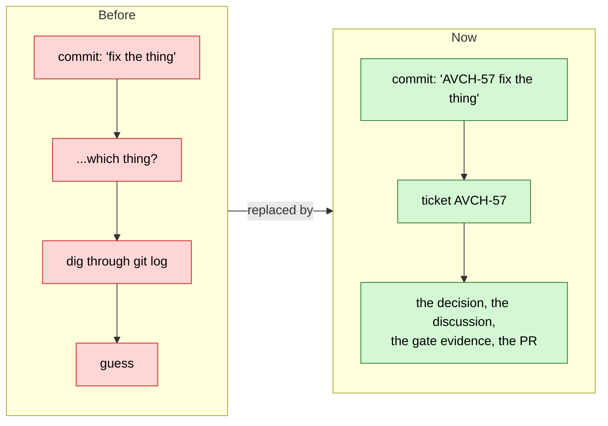
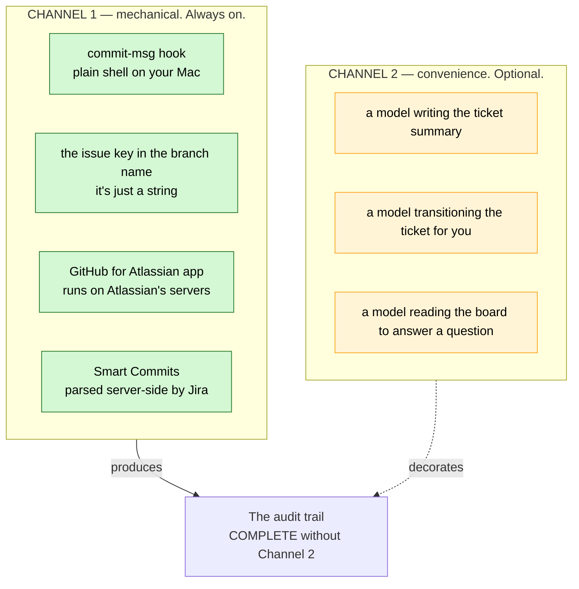
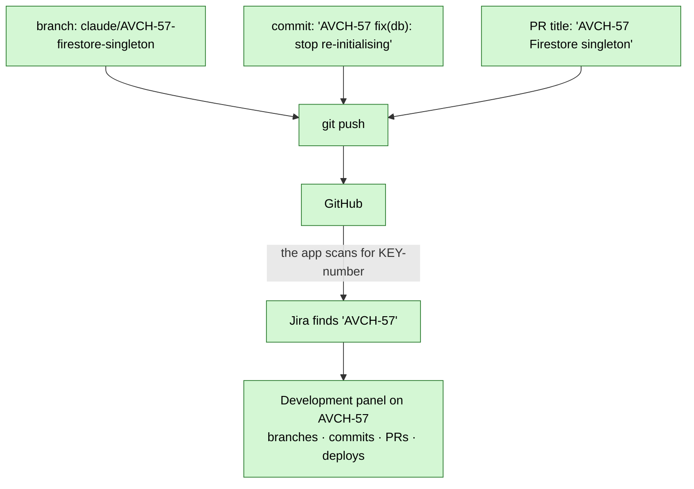
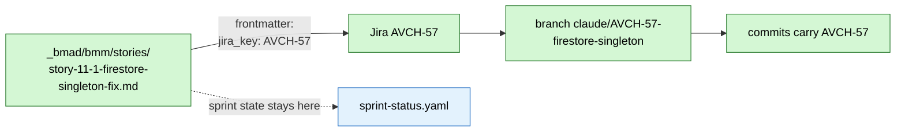
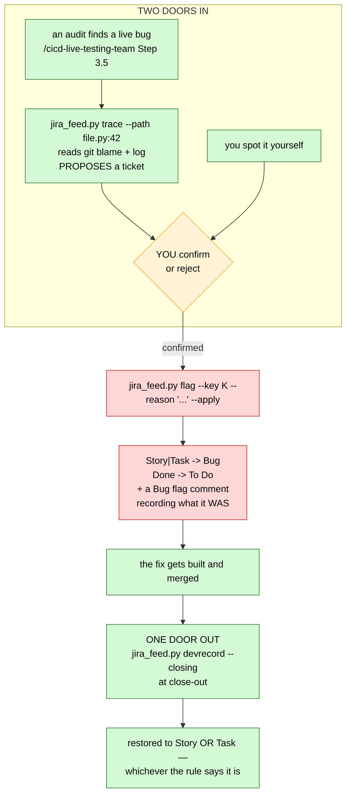
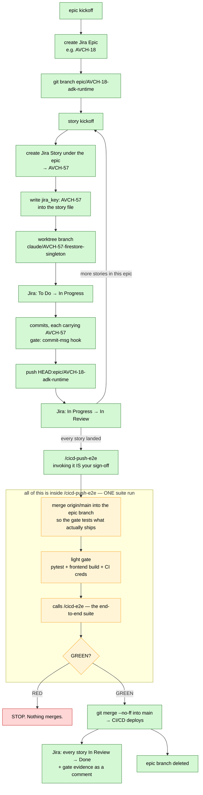
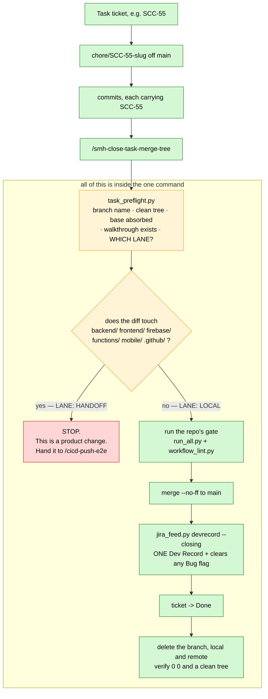
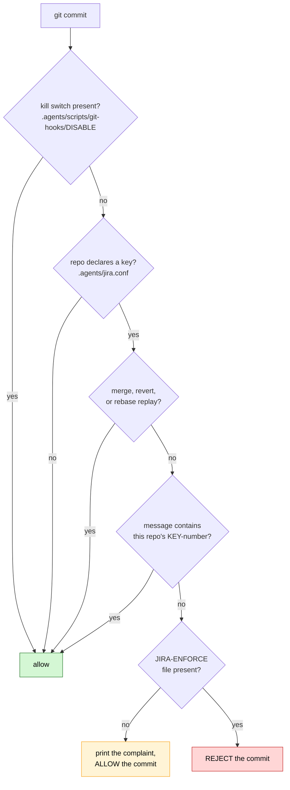
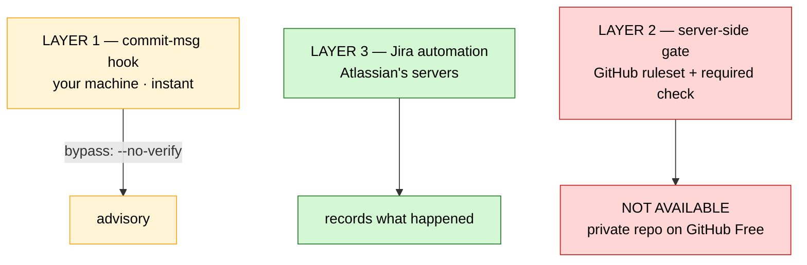

# Jira Integration — User Guide

> **What this is.** How work in this system becomes a tracked, auditable record in Jira — and why almost
> none of it depends on an AI model being available. Set up 2026-08-07, **refreshed 2026-08-09** against
> the live board. Read top to bottom once and you'll understand the whole thing; after that, §12 is the
> cheat-sheet you'll actually keep coming back to.
>
> **Status honesty:** §13 lists exactly what is LIVE today versus what is still to be built. Nothing in
> §1–§12 describes something that doesn't exist unless it says so.
>
> **What changed on 2026-08-09.** Most of the original "not built yet" list shipped. The board now has a
> **work-item type rule** (§6) that decides which close-out command can even reach a ticket, a **`Bug`
> flag** with a raise half and a clear half, and a script — `jira_feed.py` — that owns every write the dev
> flow makes to a ticket. If you read this doc before that date, §6 and §13 are the two to re-read.

---

## 1. The one idea

**Every change that reaches production should be traceable to a decision someone made.**

Today the trail is scattered: a commit message says *what* changed, a story file says *why*, the board says
*when*, and a Slack-shaped memory in your head connects them. Six months later that connection is gone and
the only honest answer to *"why is this code like this?"* is a shrug.

Jira's job here is narrow and specific: **be the durable join between a decision and the code that
implemented it.** In AviationChat it is not replacing your board — `sprint-status.yaml` remains the source
of truth for sprint state, and Jira is the permanent record underneath it. In the lobby there is no BMAD
board to sit under, so Jira is both (§3).



---

## 2. The most important thing to understand: two channels

This system has two halves that fail independently. Confusing them causes unnecessary panic, so learn this
split before anything else.



**Channel 1 uses no AI, no tokens, and — apart from Atlassian's own servers — no network.** It does not
know or care which model wrote the code, or whether a model was involved at all. Claude, Codex, Gemini,
Antigravity, you typing by hand at 2am, you on your phone in an airport: identical behaviour.

### What happens if you run out of tokens?

**Production does not stop.** Commits are still gated, commits still link to tickets, PRs still appear in
Jira's Development panel, Smart Commits still transition work items. The only thing you lose is a model
writing the prose for you — and you move the ticket yourself with one command or one click.

There is no single point of failure in this design that is an AI service. That was deliberate.

---

## 3. The parts, and what each one is for

| Part | Where it lives | What it does | Needs AI? |
|---|---|---|---|
| **Jira Cloud** | `sudo-command.atlassian.net` | Holds the tickets and the history | no |
| **`acli`** | your Mac, `/opt/homebrew/bin/acli` | Terminal access to Jira. Any tool that can run bash can use it | no |
| **`jira_feed.py`** | `.agents/scripts/` | **The wrapper** — every write the dev flow makes to a ticket goes through it. Seven verbs (§12) | no |
| **`task_preflight.py`** | `.agents/scripts/` | Before a Task merges: is the branch named right, is the tree clean, and **does this diff touch deployable code?** | no |
| **GitHub for Atlassian** | Atlassian's servers | Watches your GitHub, files commits/branches/PRs under the matching ticket | no |
| **Smart Commits** | Jira, server-side | Lets a commit message comment on and transition a ticket | no |
| **commit-msg hook** | `.githooks/commit-msg` in each repo | Refuses a commit with no ticket key | no |
| **`.agents/jira.conf`** | each repo | Declares which Jira project *this* repo answers to | no |
| **GitHub secrets** | GitHub, encrypted | Lets CI talk to Jira from a machine that isn't yours | no |
| **Atlassian MCP** | `.mcp.json` | Lets Claude Code read the board directly. Pure convenience — **and unused**: agents run `acli` | yes |

**`jira_feed.py` is the part this doc originally said didn't exist.** It shipped 2026-08-08 (SCC-49) and
grew the `Bug` verbs on 2026-08-09 (SCC-54). It matters because raw `acli` has silent failure modes that
prose could not hold — a ticket created with only a summary is a title, not a ticket; a Dev Record filed
twice is two half-records. Each verb writes, then **reads the ticket back and exits non-zero if the write
did not land.** Raw `acli` stays perfectly valid for anything ad-hoc.

### Two other hooks fire on every commit

The `commit-msg` key gate (§10) is the Jira one, but it is not alone, and a surprise from either of these
reads at first like the Jira gate misbehaving:

| Hook | Refuses | Armed by | Escape |
|---|---|---|---|
| **`pre-commit-encoding.sh`** | staged bytes that don't decode, or a literal `U+FFFD` | always on where installed | `<!-- wf-lint: allow-encoding-literals -->` in the file, for a doc that *quotes* mojibake on purpose |
| **`sop-currency.sh`** | a change to `.agents/commands/`, `.agents/rules/`, `.agents/scripts/`, the git hooks or root `AGENTS.md` that does **not** also stage `docs/_scc_sops_prds/workflows_testing_SOP.md` | `.agents/scripts/git-hooks/SOP-ENFORCE` | `[sop-ok]` in the commit message |

The second one is why changing a command and updating its documentation are one commit here rather than
two, and why "I'll document it after" is not an available option.

### Two projects, two repos

| Jira project | Key | Repo | Board |
|---|---|---|---|
| Aviation Chat | `AVCH` | `AGY_AVIATIONCHAT` | board 3, sprints on |
| Sudo Command Center | `SCC` | `Sudo_Hatter_Command` (the lobby) | board 2, sprints on |

Both are **team-managed** projects. That choice has consequences you'll meet in §9 and §12.

**The two boards are not the same kind of thing, and §6 explains why.** AviationChat has a BMAD sprint
board (`sprint-status.yaml`) *underneath* Jira — Jira is the permanent record, the YAML is sprint state.
The lobby has no BMAD stories and no sprint YAML at all, so for `SCC` the Jira board **is** the board.

---

## 4. The join — how a commit becomes a ticket link

There is exactly one mechanism, and it is refreshingly dumb: **Atlassian looks for the issue key as a
literal string.** That's it. No API call from your machine, no configuration, no plugin in your editor.



**The branch name matters most.** Every commit on a correctly-named branch links to the ticket *even if an
individual commit message forgets the key*. Name the branch right and you have a safety net under every
commit you'll make on it.

---

## 5. The numbering problem — and the join that solves it

This is the one genuinely awkward part of the design, and it's worth understanding rather than working
around blindly.

**Your stories are numbered by BMAD.** `story-11-1-firestore-singleton-fix.md` is story **11.1**, under
epic 11. There are 139 of them.

**Jira numbers its own way.** Sequential, per project, starting at 1: `AVCH-1`, `AVCH-2`, `AVCH-3`. You
cannot make Jira issue `AVCH-111` mean "story 11.1". Jira hands out the next number and there is no
override — not through the UI, not through the API.

So the two numbering systems can never be made to match. The answer is a recorded mapping:



**The rule:** the Jira key is written into the story file when the ticket is created, and from that moment
**the Jira key is what branches and commits carry** — never the BMAD number. The story file is the join
table. If you ever need to go from `11.1` to the code, you read `jira_key` first.

---

## 6. Work-item types — the rule that decides everything downstream

*Added 2026-08-08 (SCC-49), extended 2026-08-09 (SCC-53/54). This is the section to read if you read an
earlier version of this doc.*

The original build treated `Story` vs `Task` as a style choice. It isn't. **The type decides which
close-out command can reach the ticket at all** — get it wrong and the ticket is stranded, because the
command that would close it has nothing to operate on.

### The trap: the parent does not tell you

Everything on this board is parented under an epic. So the parent is **not** the discriminator — and
there are two kinds of epic that look identical in Jira's UI:

| Kind of epic | How you recognise it | Its children are |
|---|---|---|
| **BMAD epic** | the summary carries a BMAD number — `Epic 19 — ADK 2.x Runtime Upgrade` | **`Story`** |
| **Grouping epic** | no number — `CI/CD Improvment`, `Thin toolkit` | **`Task`** |

A grouping epic exists only because Jira offers no other container. It is a folder, not a plan.

### The four types

| Type | What it is | Decided by |
|---|---|---|
| **`Epic`** | a container, either kind | you, by hand — never computed |
| **`Story`** | BMAD sprint work | a **dotted number** (`19.2`, `12.3.4`) **or** a **`debug-` id** **or** a **story file** in `_bmad/bmm/stories/` — *any one is enough* |
| **`Task`** | workflow / IDE / rules / skills / toolkit work | none of the above |
| **`Bug`** | **a temporary flag on a ticket found to be broken** | never computed — raised, then cleared |

Three signals for `Story` rather than one because each is true at a different moment: the **number**
exists before the story file does (rows are minted from `epics.md` well ahead of pickup), the **`debug-`
marker** covers ids with no dotted number, and the **file** catches the rest. Any single one of them
missed real tickets on the real board — that is how the rule got written this way.

One implementation, `jira_feed.py work_type()`, so it cannot drift. **`SCC` is the pure case:** the lobby
has no story files and no sprint board, so all 32 of its non-epic tickets are `Task` under one of its five
grouping epics, with no per-project switch.

Audit the whole board against the rule any time:

```bash
python3 .agents/scripts/jira_feed.py audit --jira-project SCC --project Sudo_Hatter_Command
#   add --apply to convert the mismatches and read each one back
```

### The consequence: three lanes, three close-outs

| Type | Branch | Closes out with | Why the others can't |
|---|---|---|---|
| **`Story`** | `claude/<KEY>-<slug>` off the epic branch | `/cicd-close-story-merge-tree` | it lands on the **epic** branch, never `main` |
| **`Task`** | `chore/<KEY>-<slug>` off `main` | **`/smh-close-task-merge-tree`** | the story close-out reads a sprint board, flips a story status and lands on an epic branch — a Task has **none of the three** |
| **`Epic`** | `epic/<KEY>-<slug>` off `main` | `/cicd-push-e2e` | — |

### `Bug` is a flag, not a category of work

This is the piece people get wrong first. **A bug is not a kind of ticket you create.** When something
already shipped turns out to be broken, *the ticket that shipped it* wears `Bug` — same number, same story
file, same everything — and comes back out of `Done` until the fix lands. Then the flag clears and the
ticket goes back to being whatever it always was.



**Why `trace` and `flag` are two commands and not one.** `trace` answers *"which ticket last touched this
line"*. That is **not** the same question as *"which ticket introduced this bug"* — a later, unrelated
edit takes the blame outright, and the line that shows a symptom is often not the line that broke it. A
wrong answer pulls a finished ticket out of `Done`, and nothing restores the board's history of having
been right. So `trace` reads git and prints; it never writes. `flag` takes `--key` and **only** `--key` —
it will not accept a trace result. **A human is the join between them, deliberately.**

Three properties worth knowing about `flag`:

- **Idempotent** — a ticket already flagged is a no-op, so two people finding the same bug can't fight
  over the board.
- **Only out of `Done`** — a ticket sitting `In Progress` was never finished; shoving it back to `To Do`
  would erase real state to record something the type already says.
- **Refuses an `Epic`** — a container is never a bug. Flag the child whose work broke.

⛔ **Nothing else may retype a `Bug`.** It carries the same number and story file it always did, so every
other rule in the system reads it as a mistype — and "correcting" it mid-flight erases the only signal
that the work is broken. Exactly one thing clears it: `devrecord --closing`, at close-out, because that is
the one moment anything in the system knows the fix actually landed. Even the bulk `audit` leaves Bugs
alone; it cannot tell *still broken* from *fixed*, and that judgement isn't the rule's to make.

---

## 7. The full lifecycle

End to end, under the epic-branch model. Stories loop; the gate fires **once**, at the epic merge.



**`/cicd-e2e` is not a separate step you run first.** It is the fourth item of the gate *inside*
`/cicd-push-e2e` ([`cicd-push-e2e.md` Step 3](../../.agents/commands/cicd-push-e2e.md)). The suite
runs **once per epic merge**. If you ever find yourself running `/cicd-e2e` and then `/cicd-push-e2e`
back to back, you have paid for the suite twice for one merge.

You *may* still run `/cicd-e2e` alone — it is documented as runnable solo — but that is **early warning
during development**, not part of shipping. Use it when you want end-to-end confidence mid-epic, before
you are anywhere near merging. When you are ready to ship, go straight to `/cicd-push-e2e` and let it
run the gate.

Nothing about this replaces the existing gate. `/cicd-push-e2e` is still the one door to `main` **for
product work**, and it still refuses to open on red. Jira rides along and records what happened.

### The Task lane — the other road to `main`

The diagram above is the **Story** lane. Task work (§6) never enters it: there is no epic branch, no story
file and often no sprint board, so every step of it would have nothing to read. Tasks take a much shorter
road, and the whole of it is one command — **`/smh-close-task-merge-tree`**:



**The one thing to understand here is `LANE:`.** Skipping the end-to-end suite is the only reason this
road is cheaper than the epic road, and the only honest justification for skipping it is *nothing that
deploys changed*. That is precisely the claim an agent is worst at auditing about its own work — so the
script derives it **from the diff**, prints it, and there is deliberately **no override flag**. A
`chore/*` branch that reaches deployable code is a product change whatever its ticket type says, and it
gets sent to `/cicd-push-e2e`.

`LANE: LOCAL` has two quite different causes and it's worth knowing which you're getting: either the diff
touched no deployable path, **or** the repo has no deployable surface at all. The lobby is the second case
permanently — see the table below.

### The gate is not the same in both repos

The diagram above is **AviationChat's** lifecycle. The lobby's is smaller, and assuming otherwise sends
you hunting for a suite that was never supposed to exist:

| | AviationChat (`AVCH`) | the lobby (`SCC`) |
|---|---|---|
| E2E suite | `frontend/e2e/run-e2e.mjs` — the TEA-16 harness | **none, by design** |
| What `/cicd-e2e` does | runs it | **stops** — Step 1 finds no harness |
| The real gate | light gate + `/cicd-e2e` | `python3 .agents/scripts/tests/run_all.py` |
| Why | it ships a product with a browser in front of it | it ships markdown, PowerShell and Python — there is no journey to drive |

The lobby has no `frontend/` at all. Never improvise a substitute suite to fill the gap — `run_all.py`
**is** the gate here, and [`cicd-push-e2e.md` Step 1](../../.agents/commands/cicd-push-e2e.md)
already grants `chore/*` branches the light gate only.

---

## 8. Naming conventions — the exact formats

**Branches.** The key goes immediately after the prefix:

```
epic/AVCH-18-adk-runtime              an epic branch, lives one epic then deleted
claude/AVCH-57-firestore-singleton  one worktree per story
chore/AVCH-61-fix-broken-links      ad-hoc work — yes, this needs a ticket too
```

**Commits.** Key first, then your normal semantic message:

```
AVCH-57 fix(db): stop re-initialising the Firestore client
AVCH-61 chore(docs): repair the relocated quick-reference links
```

**Pull request titles.** Same shape — include the key.

### Why chore branches need a ticket

Ruled 2026-08-07. The point of this system is that *everything* reaching `main` is accounted for. A class
of changes that skips the ticket is a hole in the audit trail, and holes get used for more than they were
meant for. Creating a one-line Jira Task takes about fifteen seconds.

**The only exemptions** are commits git generates itself, which cannot sanely carry a key: merge commits,
reverts, and commits replayed during a rebase. The hook knows about all three.

---

## 9. Smart Commits — driving Jira from the commit message

Enabled on your site. Three commands, usable in any commit message after the key:

| Command | Example | Effect |
|---|---|---|
| `#comment` | `AVCH-57 fixed it #comment root cause was a module-scope get_db()` | Adds a comment to the ticket |
| `#time` | `AVCH-57 fixed it #time 2h 30m` | Logs work |
| `#transition` | `AVCH-57 fixed it #transition Done` | Moves the ticket |

Combined:

```bash
git commit -m "AVCH-57 fix(db): singleton #comment root cause was module-scope get_db #time 2h #transition In Review"
```

**Why this matters more than it looks.** Jira's *Automation rules* could do the same job, but your Free
plan allows only **100 automation runs per month**. Smart Commits are parsed server-side at no quota cost
at all. Using them instead of automation rules means you will most likely never hit that ceiling. That is
the reason the design leans on them.

**Format requirement:** the key must be two or more uppercase letters, a hyphen, then digits. `AVCH-57`
and `SCC-9` both qualify.

---

## 10. The commit gate

A `commit-msg` hook that refuses a commit with no ticket key.



### Two modes

**WARN.** Prints the complaint and lets the commit through. The original plan was to sit here for a few
days so the gate stops surprising you before it starts refusing you.

**ENFORCE (current, armed 2026-08-07).** Rejects the commit outright. Armed by the presence of a tracked
file:

```bash
touch .agents/scripts/git-hooks/JIRA-ENFORCE
```

**Why it was armed on day one instead.** WARN failed its first real test the same evening it shipped. A
commit carrying `SCC-10` landed on AviationChat's `main`, where `jira.conf` binds the repo to `AVCH`. The
hook fired and complained exactly as designed — and nobody saw it, because the commit came from **VS Code's
Source Control panel, which writes hook output to `View → Output → Git` and shows nothing in the UI**. The
"run in WARN for a few days" advice silently assumes you are committing in a terminal. A warning nobody
reads is not a gate.

The flag file is **tracked**, not local. Untracked, the gate would be armed on one machine and silent on
every other clone — failing precisely when you switch machines.

Remove the file to disarm. **Kill switch** for the whole hook: create `.agents/scripts/git-hooks/DISABLE`.
**Bypass once:** `git commit --no-verify`.

### Two things it deliberately does not do

**It does not check that the ticket exists.** A live lookup would put a network round-trip on every commit
and fail closed on a plane. A well-formed but wrong key is caught downstream, where the commit simply never
appears on any ticket's Development panel.

**It cannot stop you.** `--no-verify` walks past it. See §11 for what that means and what it would cost to
close.

### `jira.conf` — why each repo declares its own key

```sh
# Projects/AGY_AVIATIONCHAT/.agents/jira.conf
JIRA_KEYS="AVCH"

# Sudo_Hatter_Command/.agents/jira.conf
JIRA_KEYS="SCC"
```

This makes the gate repo-aware: an `SCC-9` commit is **rejected inside AviationChat**, because it belongs
to a different project.

> ⚠️ **`jira.conf` is deliberately excluded from `/smh-sync-agents`.** The sync vendors the master `.agents/`
> tree into every project, overwriting same-named files — which would have pushed the lobby's `SCC` over
> AGY's `AVCH`, making AviationChat's gate reject its own work items and accept the lobby's, backwards,
> with the file reading perfectly plausibly. It is excluded in **both** the vendor copy and the manifest
> set, so a future delete from master can't purge every project's copy either. Treat it exactly like
> BMAD's module config: project identity, never vendored.

---

## 11. Enforcement — the honest picture

Enterprise practice is three layers. You currently have two of them.



**Verified 2026-08-07:** `GET repos/sudomadhatter/AGY_AVIATIONCHAT/rulesets` returns
`403 — Upgrade to GitHub Pro or make this repository public`. Branch protection and rulesets are not
available for private repos on the free plan.

**What that means in practice:** you have **a loud alarm, not a locked door.** The hook catches honest
mistakes — which, working solo, is essentially all of them. But nothing physically prevents a merge that
skipped the process.

**What closing it costs:** GitHub Pro, about $4/month. That turns the CI check into a required status
check, and an unkeyed commit becomes genuinely unmergeable. It is the cheapest line item in this build,
and it is entirely optional. *Decision still open.*

---

## 12. Cheat sheet

> **Agent-facing canonical copy:** `.agents/rules/jira.md` (lobby + AGY each carry one) — the rule every
> LLM platform loads on demand, with this cheat-sheet, the flag traps, the ticket↔file join, and the
> guardrails. Edit the rule first; this section is the human mirror.

### Reading

```bash
acli jira auth status                                  # am I logged in, and as whom?
acli jira workitem view AVCH-4                         # NOTE: key is positional here
acli jira workitem search --jql "project = AVCH AND status = 'In Progress'"
acli jira project list --limit 20
acli jira board search                                 # board ids
acli jira board list-sprints --id 3 --limit 5
```

### Writing

```bash
acli jira workitem create --project AVCH --type Story --summary "..." --parent AVCH-18
acli jira workitem transition --key AVCH-57 --status "In Progress" --yes   # NOTE: --key flag here
acli jira workitem comment create --key AVCH-57 --body "..."               # --key here too
acli jira workitem edit --key AVCH-57 --labels "quick-dev,parallel-ok" --yes  # REPLACES the label set
acli jira workitem link create --out SCC-10 --in SCC-14 --type Blocks      # "SCC-10 blocks SCC-14"
```

> **Three gotchas worth memorising.**
> 1. `view` takes the key **positionally** (`view AVCH-4`); everything else takes it as a **flag**
>    (`--key AVCH-4`). Inconsistent, but that's the tool.
> 2. **`--fields` is a whitelist, not a hint.** Ask for `key,summary,status` and `issuetype` comes back
>    *empty* — not missing, empty. This cost two tickets of debugging: a script asked for a field list
>    without `issuetype` on it, then read `issuetype` out of the answer, and every type check in it
>    silently returned nothing while the tests passed. Whatever you intend to read, name it.
> 3. `edit` **hangs** without `--yes`, waiting on a confirm you can't see.

### The dev flow's writes — `jira_feed.py`

Every write the dev flow makes to a ticket goes through one script, because each of these seams had a
silent failure mode. Each verb writes, reads the ticket back, and exits non-zero if it didn't land.

```bash
python3 .agents/scripts/jira_feed.py outline   --story 12.3.4 --project P    # render a description; no network
python3 .agents/scripts/jira_feed.py mint      --story 12.3.4 --project P --jira-project AVCH \
                                               --epic-key AVCH-13 --lane full --apply
python3 .agents/scripts/jira_feed.py devrecord --key AVCH-15 --story 12.3.4 --project P \
                                               --decision "..." --pitfall "..." --apply
python3 .agents/scripts/jira_feed.py check     --key AVCH-15 --story 12.3.4  # both halves present? exit 2 if not
python3 .agents/scripts/jira_feed.py audit     --jira-project SCC --project Sudo_Hatter_Command
python3 .agents/scripts/jira_feed.py trace     --path backend/x.py:42        # proposes; never writes
python3 .agents/scripts/jira_feed.py flag      --key AVCH-15 --reason "..." --apply
```

| Verb | Does | The failure it exists to prevent |
|---|---|---|
| `outline` | renders a ticket description from the story file | — (it's the dry run for `mint`) |
| `mint` | creates the ticket **with** its description, parented, deduped on the BMAD number | a ticket with only a summary is a title, not a ticket — the whole board was first minted that way |
| `devrecord` | files **THE** Dev Record — decisions, pitfalls, follow-ons, outcome | two closers leaving two half-records. **Exactly one per ticket**; an existing one is updated in place, never stacked |
| `check` | "does this ticket carry both halves?" | — |
| `audit` | every ticket whose type disagrees with §6; `--apply` converts | the board drifting back to all-`Task` |
| `trace` | ranks the tickets whose commits touched a line | — (it can't write) |
| `flag` | raises the `Bug` flag (§6) | — |

**`devrecord --closing` is the only thing in the system that clears a `Bug`.** Both close-out commands
pass it; on a non-`Bug` ticket it's a silent no-op, so it's always safe.

Two rules that bind on **you**, not the script: nothing is invented (a missing story section renders
`(none found …)` and warns — don't paper over it), and **the buckets are yours to fill**. The walkthrough
scrape underneath is a safety net, not the source.

### The three deferred views

```bash
# everything parked
acli jira workitem search --jql "project = AVCH AND status = Deferred"

# the REAL V3 review list — parked, not killed
acli jira workitem search --jql "project = AVCH AND status = Deferred AND labels != descoped"

# the graveyard — decisions preserved so nobody re-proposes them
acli jira workitem search --jql "project = AVCH AND status = Deferred AND labels = descoped"
```

### Status mapping

The left column is **AviationChat only** — `SCC` has no `sprint-status.yaml`, so its Jira status is the
whole answer.

| `sprint-status.yaml` | Jira status | Notes |
|---|---|---|
| `backlog`, `ready-for-dev` | `To Do` | |
| — | **`To Do Next`** | ⭐ operator-set only; **no `sprint-status.yaml` value maps to it**, which is the point — it is how a human overrides the computed pick. Ranks above `To Do` in every "what's next?" answer, and above the YAML's next `ready-for-dev` on a project. SCC only so far. Full rule: `.agents/rules/jira.md` §The queue |
| `in-progress` | `In Progress` | |
| `review` | `In Review` | dev sets this; only human close-out sets `done` |
| `done` | `Done` | SHIPPED. Never for work that wasn't built |
| `deferred-v3` | `Deferred` | parked, revisited at V3 |
| `descoped` | `Deferred` + label `descoped` | terminal ruling, never built |
| — | `Blocking` | waiting on something else. **Note the name** — the status reads `Blocking`, the *label* and the saved filter read `blocked`. Live on the SCC board |
| — | `Open Epics` | ⚠️ not part of the vocabulary. One AVCH item sits here (`AVCH-14`, the `12.3` umbrella story) — a board column that became a status. Harmless, but it means "every open item" is not `status != Done` on AVCH |

### Labels — because a card holds one status but stacks labels

That's the whole reason these are labels: a story can be quick-dev-eligible **and** blocked at once. All
three are ruled by `/cicd-write-story-tests` at story pickup.

| Label | Means |
|---|---|
| `quick-dev` | ships via `/cicd-quick-dev` instead of the full ①②③ loop |
| `parallel-ok` | no file overlap with the epic's other in-flight stories — safe to run beside them |
| `blocked` | waiting on a linked blocker (the `Blocks` link names *what*) |
| `descoped` | with `Deferred`: a terminal ruling, never to be built |

```bash
acli jira workitem search --jql "project = AVCH AND labels = quick-dev AND status != Done"
```

**Why `Deferred` sits in the `To Do` category, not `Done`.** Anything in a Done-category status reads as
*shipped* in every Jira report. Descoped work is the opposite of shipped. Putting `Deferred` in `To Do`
keeps "what actually went out" honest — which is the same corruption `sprint-status.yaml` already warns
about when it says a false `done` "corrupts every trace, retro and readiness check."

**Why one status and a label, not two statuses.** Team-managed Jira projects can't customise the
Resolution field, which is the normal way to express "closed but not shipped." The label does the same job:
one column on the board, and the distinction between *not yet* and *never* survives.

### Saved filters

Cross-project by design — one view per *question*, spanning every current and future project; per-project
slices come from each board's own column/label filter. **Agents never read these** (they run raw JQL);
they are operator sugar. Every row below was **executed**, not just read, on 2026-08-09:

| Filter | Id | JQL | Returns |
|---|---|---|---|
| `Deferred` | 10010 | `status = Deferred ORDER BY project ASC, key ASC` | **16** |
| `Blocked` | 10007 | `(labels = blocked OR status = Blocking) AND status != Done ORDER BY project ASC, key ASC` | **2** |
| `Descoped` | 10009 | `labels = descoped ORDER BY project ASC, key ASC` | 0 — correctly |
| `Quick-Dev` | 10005 | `labels = quick-dev AND status != Done ORDER BY project ASC, key ASC` | 0 — awaiting input |
| `Parallel-OK` | 10006 | `labels = parallel-ok AND status != Done ORDER BY project ASC, key ASC` | 0 — awaiting input |

**Two of these were repaired on 2026-08-09, and the story is worth knowing** because it is the failure
mode saved filters have: *a filter that runs cleanly and returns the wrong thing looks identical to a
filter that works.*

- **`Deferred` did not filter deferred work.** Its JQL was `created >= -30d order by created DESC` — a
  *recently created* view wearing the wrong name, returning 30 rows that had nothing to do with parked
  work. Ids `10003` / `10004` (the old `AVCH Deferred` / `SCC Deferred` pair) no longer exist; `10010`
  replaced them and picked up the wrong query on the way.
- **`Blocked` was label-only, and no ticket carries the label.** Two tickets are genuinely blocked —
  they sit in the **`Blocking` status** — and the filter for blocked work found neither. It now matches
  either signal.

**Why the other three return nothing — and why only one of those is a problem.** Not a single ticket
across either board carries **any** label. That is not a filter bug; the JQL is right:

- `Descoped` is **correctly empty.** AviationChat's `deferred-work.md` is explicit — *"assume every entry
  is parked, not queued"* — so nothing has been terminally ruled out. An empty `Descoped` is the honest
  answer, and it should stay empty until something is actually killed.
- `Quick-Dev` and `Parallel-OK` are **set at story pickup**, by `/cicd-write-story-tests` Step 1.6 —
  `jira_feed.py mint` writes them at create time from ①'s lane ruling. Every current ticket predates that
  seam or was created by hand in the UI, so there is nothing for them to find *yet*. They will populate
  on their own from the next story picked up; nothing needs fixing for that to happen.

---

## 13. What is live, and what is not

**LIVE — re-verified against the board 2026-08-09:**

*Infrastructure (unchanged since 2026-08-07):*

- Jira site with `AVCH` and `SCC`; sprints enabled on both
- `Deferred` status in both projects, category `To Do` — confirmed by round-trip
- `acli` installed and authenticated as `sudomadhatter@gmail.com`
- GitHub for Atlassian app installed; Smart Commits enabled
- `commit-msg` hook in the lobby and AviationChat, **ENFORCE mode** (flag tracked, so it travels)
- `.agents/jira.conf` per repo; excluded from `/smh-sync-agents` in both the vendor and the manifest —
  vendoring it would push the lobby's `SCC` over AGY's `AVCH` and reverse both gates, plausibly
- `JIRA_API_TOKEN` + `JIRA_EMAIL` secrets on both GitHub repos
- Atlassian MCP declared in `.mcp.json` — optional, and in practice unused: agents run `acli`
- Saved filters, cross-project — ids and the one broken JQL in §12

*Shipped since (this is what the old ledger got wrong):*

| Was listed as not built | Shipped | What it is |
|---|---|---|
| the `acli` wrapper in `.agents/scripts/` | **2026-08-08** (SCC-49), `Bug` verbs 2026-08-09 (SCC-54) | `jira_feed.py`, seven verbs — §12 |
| `/cicd-*` wiring: kickoff mints + stamps `jira_key` | **2026-08-08** | `/cicd-write-story-tests` Step 1.6 mints the ticket, rules the lane, and writes `jira_key:` into the story frontmatter |
| `/cicd-*` wiring: transition + gate evidence at merge | **2026-08-08** | `/cicd-push-e2e` Step 6.5 moves the **epic** ticket and posts the gate result |
| Jira epics and tickets for open work | **done** | `SCC` **37** items (5 Epics + 32 Tasks) · `AVCH` **40** (8 Epics + 21 Stories + 11 Tasks) |
| the 16 Atlassian onboarding sample tickets | **deleted** | both projects are clean; `SCC-1`…`SCC-3` no longer resolve |

*New since, and not on the old list at all:*

- **The work-item type rule** — §6. One implementation, `jira_feed.py work_type()`; `audit` checks the
  whole board against it
- **The `Bug` flag** — §6. Raise half `trace`/`flag` (SCC-54), clear half `devrecord --closing` (SCC-53)
- **`/smh-close-task-merge-tree`** — the Task lane's close-out (SCC-49), §7
- **`task_preflight.py`** — six mechanical preconditions before a Task merges, including the derived
  `LANE:` that decides whether this is even a Task at all (SCC-41)
- **Two more armed commit hooks** — SOP currency and encoding, §3

**STILL NOT BUILT:**

- `pre-push` branch-name check *(the `commit-msg` gate covers the message; nothing checks the branch)*
- The CI job that fails a PR containing unkeyed commits — `pr-check.yml` has no Jira step
- **A decision on GitHub Pro** — the one thing that would turn §11's alarm into a lock. Still open

---

## 14. Security — where the token lives

**The API token is never handled by a model and never appears in this repo.** Every caller has its own
authenticated copy:

| Caller | Authenticates via |
|---|---|
| you / any agent, through `acli` | your macOS keychain |
| GitHub Actions | the encrypted repo secret |
| you, in a browser | your normal Atlassian login |

**Never put the token in:** any file in a repo, a commit message, an untracked-but-present `.env`, or a
chat transcript.

**If it leaks — revoke and replace, about two minutes:**

1. [id.atlassian.com/manage-profile/security/api-tokens](https://id.atlassian.com/manage-profile/security/api-tokens) → revoke the old, create a new one
2. `acli jira auth login --site sudo-command.atlassian.net --email sudomadhatter@gmail.com --token`
3. Re-run the four `gh secret set` commands

Revoking is instant and total — the old string dies everywhere at once, so you never have to hunt copies.

> **GitHub secrets are write-only.** Once set, nobody can read one back — not a collaborator, not the
> GitHub UI, not you. `gh secret list` shows names and timestamps only. If you need to know what a secret
> was, you don't; you replace it.

---

## 15. Troubleshooting

| Symptom | Cause | Fix |
|---|---|---|
| Hook prints nothing, ever | `core.hooksPath` unset in that repo | `git config core.hooksPath .githooks` |
| Commit passes with no key | `JIRA-ENFORCE` missing, or repo has no `jira.conf` | Check both |
| Committed from VS Code and saw no hook output | The panel hides it | `View → Output → Git`. In ENFORCE mode a rejection also raises a notification |
| `SCC-9` rejected in AviationChat | Working as designed — wrong project | Use an `AVCH` key |
| Commit and ticket exist, but no link | Key typo'd, or GitHub app not connected to that repo | Check the key; check the app's repo list |
| `✗ Error: unknown flag: --key` | You used `--key` on `view` | `view` takes the key positionally |
| JQL: `value 'x' does not exist for the field 'status'` | Status genuinely doesn't exist | Check spelling — an *empty* result means it exists and is empty |
| A field reads back **empty** and you know it isn't | `--fields` is a whitelist and you left that field off it | Name every field you intend to read. §12, gotcha 2 |
| `acli … edit` sits there forever | It's waiting on a confirm you can't see | Add `--yes` |
| Commit blocked and the message says nothing about Jira | The **encoding** or **SOP-currency** hook, not the key gate | §3. Read which hook actually spoke |
| `/smh-close-task-merge-tree` refuses with `LANE: HANDOFF` | Your diff touches deployable code | Working as designed. Hand it to `/cicd-push-e2e`; there is no override |
| A ticket is typed `Bug` and you didn't do that | An audit or a tester flagged it broken — §6 | Don't retype it. Fix it, and close-out clears the flag |
| `gh secret set` → `HTTP 403` | `gh` login lost a scope | `gh auth refresh -s repo` |
| Nothing appears while pasting a secret | Deliberate — input is hidden | Paste and press Enter anyway |

---

## 16. Related reading

- `.agents/rules/jira.md` — **the canonical agent-facing copy.** Edit that first; this doc is the human mirror
- `docs/_scc_sops_prds/jira_manual.md` — the same system driven entirely by hand, no terminal
- `docs/_scc_sops_prds/workflows_testing_SOP.md` — the dev system on one page; §6 is shipping
- `docs/_scc_sops_prds/git_walkthrough_settings.md` — the ten global git settings; §8 is the branch flow
- `.agents/rules/git-policy.md` — the branch model: `main` is the only long-lived branch (`main_debug` retired 2026-08-07)
- `Projects/AGY_AVIATIONCHAT/_bmad-output/implementation-artifacts/sprint-status.yaml` — AviationChat's sprint state. `SCC` has no equivalent; its Jira board is the board

<!-- CHECKPOINT id="ckpt_msjenp0o_kmuefd" time="2026-08-07T20:36:33.000Z" note="auto" fixes=0 questions=0 highlights=0 sections="" -->

<!-- CHECKPOINT id="ckpt_msjhiks2_s1a95l" time="2026-08-07T21:56:33.074Z" note="auto" fixes=0 questions=0 highlights=0 sections="" -->
