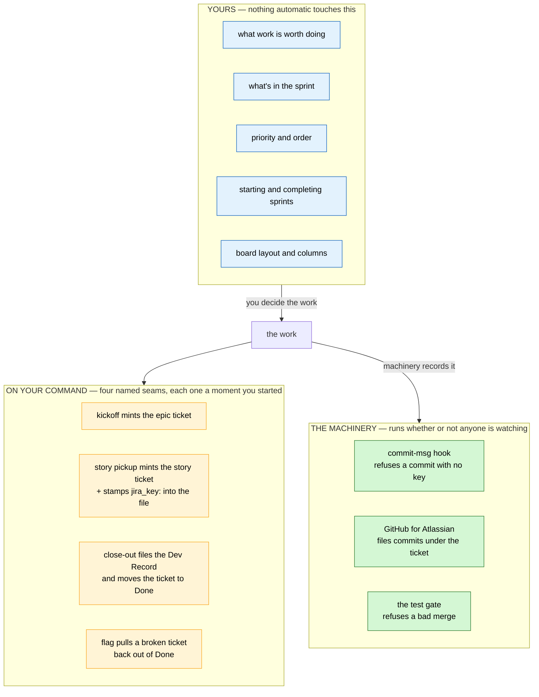
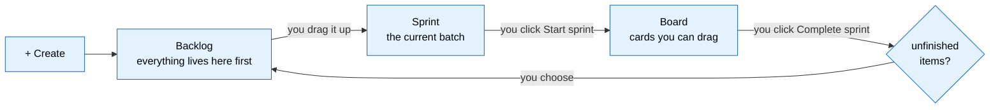
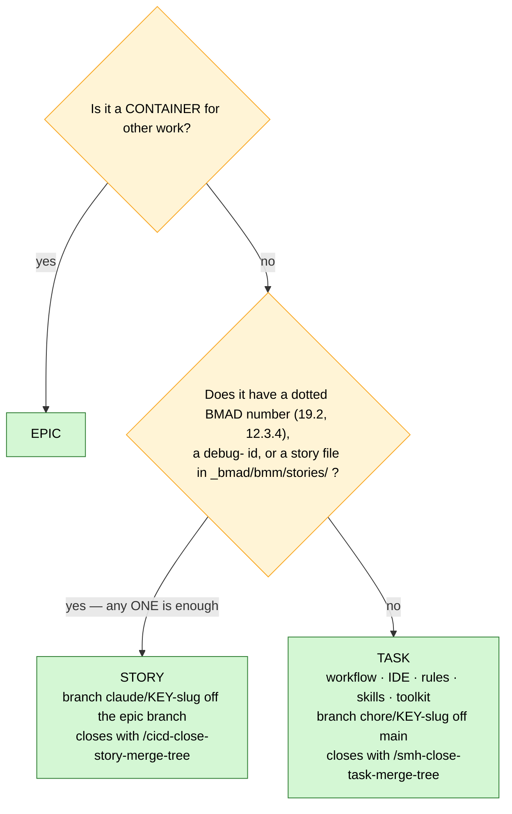
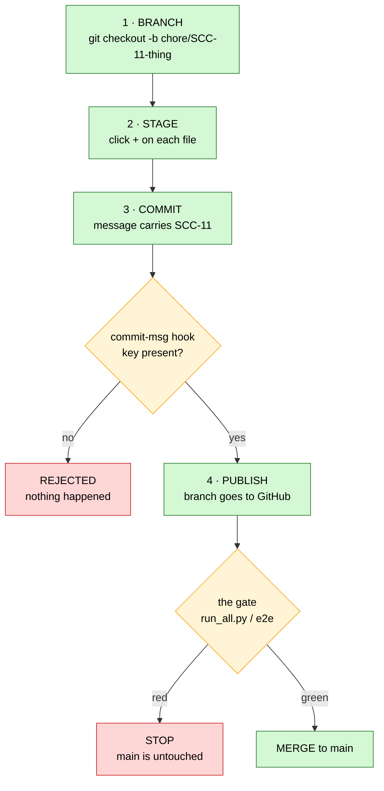
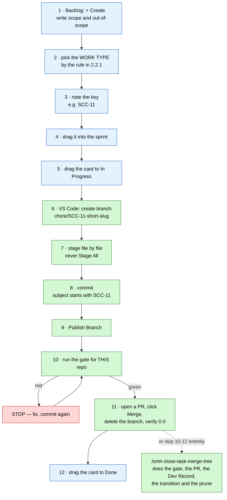

# Jira — The Manual Process

> **What this is.** Every step *you* perform by hand: creating work in Jira, moving it through a sprint,
> and pushing code through the VS Code Source Control panel. No commands, no agents, no terminal.
> Written 2026-08-07 from an actual run — including the parts that went wrong. **Refreshed 2026-08-09.**
>
> **Companion doc:** [jira_integration_guide.md](jira_integration_guide.md) explains *why* the system is
> built this way. This one is *how you drive it*.
>
> **What changed on 2026-08-09 — read §2.2 if you read nothing else.** This doc used to tell you the
> Story/Task line was a soft style choice. **It isn't any more.** The type is now decided by a rule, and it
> decides which close-out command can even reach the ticket. There is also a fourth type — `Bug` — that
> works unlike anything here: it's a *flag on an existing ticket*, not a new one. §2.6 is new and covers it.

---

## 1. Who touches what

The single most useful thing to hold in your head: **the planning layer is yours.** Nothing decides *what
matters* except you.



**The machinery never decides a priority, never places anything in a sprint, and never lays out your
board.** It links commits to tickets and refuses bad ones. That's the whole of its authority.

**One honest correction to this section, from 2026-08-08.** Commands *do* now create and move tickets —
but only at four named seams, and every one of them is a moment you started:

| Seam | What it does |
|---|---|
| `/cicd-create-epic-sprint` at kickoff | mints the **epic** ticket |
| `/cicd-write-story-tests` at story pickup | mints the **story** ticket and stamps `jira_key:` into the story file |
| `/cicd-push-e2e` at the epic merge · `/cicd-close-story-merge-tree` and `/smh-close-task-merge-tree` at close-out | move the ticket to `Done` and file the Dev Record |
| `jira_feed.py flag` | moves a ticket **out of `Done`** when it's found broken (§2.6) |

Outside those four: status and comments only, and only when you ask. **Nothing ever decides placement,
priority or sprint** — those stayed yours on purpose. And nothing runs on a timer: left alone overnight,
the board is exactly as you left it. If you never spoke to a model again, every mechanism in §3 below
would keep working unchanged.

---

## 2. The Jira side — all by hand

### 2.1 Three places, and why the board looks empty

This trips up everyone once:

| Place | What it holds | URL |
|---|---|---|
| **Backlog** | everything not in the active sprint | `…/boards/2/backlog` |
| **Sprint** | the batch you've committed to right now | lives on the Backlog page |
| **Board** | **only the active sprint**, as draggable cards | `…/boards/2` |

**A Scrum board renders only the active sprint.** If your sprint is empty or unstarted, the board is
blank and nothing is wrong. Your work is one page over, in the Backlog.



Every arrow in that diagram is **you clicking something**. None of it happens on its own.

### 2.2 Create a backlog item

1. Open the **Backlog**.
2. **+ Create** — the button in the top bar, or the `+ Create` at the bottom of the Backlog list.
3. **Work type** — see the rule immediately below. **This is not a style choice.**
4. **Summary** — one line, what it is. This becomes the branch slug later, so keep it plain.
5. **Description** — the **outline**, never the plan. Four short sections: `Why:` (one paragraph,
   the problem), `## Plan` (a 4-8 line checklist that renders as real Jira checkboxes), `## Done`
   (left as `(filled at close-out)`), and `## Files` (where the real plan lives, plus the plan
   attached to the ticket). If you find yourself pasting more than a screenful, it belongs in
   `_artifacts/` and attached — see the integration guide, "Fast-read tickets".
   Out-of-scope is the half people skip and then argue about later.
6. **Parent** — pick the epic it belongs under. Everything is parented; nothing floats loose.
7. Leave assignee and sprint blank. It lands in the Backlog.

**Write down the key it gives you** — `SCC-11`, `AVCH-12`. That string is now the name of this piece of
work everywhere: branch, commits, PR title.

### 2.2.1 Choosing the work type — the rule, not a preference

*Changed 2026-08-08. An earlier version of this page said the Story/Task line was soft. It is not, and
treating it as soft strands the ticket:* **the type decides which close-out command can reach it**, and
the wrong one has nothing to operate on.

Ask one question — **does this work have a BMAD story?**



**The trap: the parent doesn't tell you.** Everything is parented, so "it's under an epic" proves nothing.
There are two kinds of epic and Jira draws them identically:

| Kind | How you spot it | Children are |
|---|---|---|
| **BMAD epic** | the summary carries a number — `Epic 19 — ADK 2.x Runtime Upgrade` | `Story` |
| **Grouping epic** | no number — `CI/CD Improvment`, `Thin toolkit` | `Task` |

A grouping epic is a folder, not a plan. It exists only because Jira gives you nowhere else to put things.

**In the lobby (`SCC`) the answer is always `Task`.** There are no BMAD stories here and no sprint board,
so all 32 non-epic tickets are Tasks under one of five grouping epics. In AviationChat you actually have
to think about it.

If you get it wrong, nothing breaks loudly — you just find the close-out command can't see your ticket.
Change the type in the UI and carry on, or let the audit catch it:

```bash
python3 .agents/scripts/jira_feed.py audit --jira-project SCC --project Sudo_Hatter_Command
```

### 2.3 Move it into the sprint

On the Backlog page, **drag the card up** from the *Backlog* section into the *Sprint* section. Or
right-click → **Move to** → the sprint name.

That's the entire mechanism. There's no approval, no state change — the item's status is untouched.
You've only moved it into a different bucket.

### 2.4 Start and complete a sprint

**Start:** with at least one item in it, a **Start sprint** button appears on the sprint header. Name,
dates and goal are all optional. Once started, the Board comes alive.

**Jira never ends a sprint for you.** Past the end date it simply shows as overdue until you act.

**Complete:** the **Complete sprint** button appears while a sprint is active. Jira looks at what's
unfinished and asks where it should go:

- back to the **Backlog**
- into an **existing future sprint**
- into a **new sprint**

> **Completing a sprint never changes an item's status.** Something at `In Progress` stays `In Progress`;
> it just moves out of the box. Nothing is silently marked done.

**One thing to check on your board:** Jira counts an item as finished once it sits in the **last column**
— that's column *position*, not status name. If `Deferred` is the rightmost column, deferred work gets
counted as finished at sprint close and won't carry over. Drag the columns so `Done` is last.

### 2.5 Moving a card across the board = changing its status

Dragging a card from `To Do` to `In Progress` **is** a status change. That's all a status change is.

Three doors, one result — use whichever is in front of you:

| Door | How |
|---|---|
| **The board** | drag the card |
| **The terminal** | `acli jira workitem transition --key SCC-11 --status "In Progress"` |
| **A commit message** | a Smart Commit `#transition` directive |

Your statuses, and what each means here:

| Status | Meaning | Category |
|---|---|---|
| `To Do` | not started | To Do |
| **`To Do Next`** | ⭐ **what you picked to start next.** Agents lead every "what's next?" with this column — it outranks `To Do`, and on a project it outranks the story computed from `sprint-status.yaml`. SCC only so far; adding the column to another board is the whole install | To Do |
| `In Progress` | branch cut, work happening | In Progress |
| `In Review` | code landed on the epic branch, awaiting the gate | In Progress |
| `Done` | merged to `main` | Done |
| `Deferred` | descoped or parked — **still open**, deliberately | **To Do** |
| `Blocking` | waiting on something else | To Do |
| `Open Epics` | ⚠️ a stray — one AVCH item (`AVCH-14`) sits here. A board column that became a status; not part of the vocabulary |

`Deferred` sits in the `To Do` category on purpose. A `Done`-category status would auto-resolve the
ticket and make descoped work read as *shipped*. Add the `descoped` label when that's the reason.

> **`Blocking` vs `blocked` — the names don't match and that's just how it is.** The *status* on the board
> reads `Blocking`. The *label* and the saved filter read `blocked`. Use both: the status so the card sits
> in the right column, the label so the `Blocked` filter finds it. Then add a **`Blocks` link** from
> whatever is holding it up, because the status says *that* it's stuck and only the link says *on what*.

**The other labels you'll set by hand** — a card holds one status but stacks labels, which is the whole
reason these are labels:

| Label | Means |
|---|---|
| `quick-dev` | ships via `/cicd-quick-dev` instead of the full three-step loop |
| `parallel-ok` | no file overlap with the epic's other in-flight work — safe to run beside it |
| `blocked` | pair with the `Blocking` status and a `Blocks` link |
| `descoped` | with `Deferred`: a terminal ruling, never to be built |

### 2.6 Flagging something broken — the fourth type

*New 2026-08-09.* `Bug` does not work like the other three, and the mistake to avoid is the obvious one:

⛔ **You do not create a Bug ticket.** When something that already shipped turns out to be broken, **the
ticket that shipped it wears the flag** — same key, same story file, same everything. It comes back out of
`Done` until the fix lands, then goes back to being whatever it was.

The reason is the audit trail this whole system exists for. A new ticket buys you a second number
describing the same piece of work, and the trail forks. The flag keeps one number and records that it was
broken for a while.

**Two ways it gets raised. Yours is the second, and it's one command:**

```bash
python3 .agents/scripts/jira_feed.py flag --key AVCH-57 \
        --reason "the roster panel 500s on an archived learner" \
        --evidence "repro: open school ACDEMO, archive a learner, reload" --apply
```

*(`AVCH-57` is this page's running example, not a live ticket — the same one §3.2 uses for a branch name.)*

That does the whole flip and proves each part landed: type `Story|Task → Bug`, status `Done → To Do`, and
a **Bug flag** comment carrying your reason, your evidence, and *what the ticket was* so the restore is
auditable later.

The other way is an audit — `/cicd-live-testing-team` flies the running app, finds a symptom, and traces
it back to a candidate ticket. **It will stop and ask you before flagging anything.** That pause is
deliberate, not caution: "which ticket last touched this line" is not the same question as "which ticket
broke this", and a wrong flip pulls a finished ticket out of `Done` with nothing to undo it. **You are the
join.** If it ever stops asking, that's a bug in the tooling.

Three things worth knowing:

- **Flagging twice is harmless.** Already flagged is a no-op — two people finding the same bug can't fight
  over the board.
- **It only reopens things that were `Done`.** A ticket sitting `In Progress` was never finished; shoving
  it back to `To Do` would erase real state.
- **You can't flag an `Epic`.** A container is never a bug — flag the child whose work broke.

**Clearing it is automatic.** When the fix merges, close-out restores the ticket to `Story` or `Task`
(whichever the rule says it is) and moves it to `Done`. **Don't clear it by hand** by editing the type in
the UI mid-flight — the flag is the only signal in the system that the work is broken, and removing it
early makes the ticket look fine while it isn't.

### 2.7 The saved filters — and the one way they lie

Five starred filters, cross-project on purpose: one view per *question*, not per project. They're for you
— agents run raw JQL and never read them.

| Filter | Shows you | Live count |
|---|---|---|
| `Deferred` | parked work, still open | 16 |
| `Blocked` | waiting on something else | 2 |
| `Descoped` | terminally ruled out, never to be built | 0 |
| `Quick-Dev` | eligible for `/cicd-quick-dev` | 0 |
| `Parallel-OK` | safe to run alongside its siblings | 0 |

> ⚠️ **A filter that returns the wrong list looks exactly like one that works.** Two of these were broken
> until 2026-08-09 and nothing announced it. `Deferred`'s JQL was `created >= -30d` — a *recently created*
> view wearing the wrong name, cheerfully returning 30 irrelevant rows. `Blocked` matched only the label,
> and since no ticket carries any label, it found neither of the two genuinely blocked tickets. Both are
> fixed. **If a filter's count ever looks surprising, run its JQL by hand before believing it.**

The three zeros are honest, and only one of them is waiting on you:

- **`Descoped` should be empty.** Nothing has been terminally killed — AviationChat's deferred ledger says
  outright that everything parked is *parked, not queued*.
- **`Quick-Dev` and `Parallel-OK` fill themselves.** Those labels get written at story pickup by
  `/cicd-write-story-tests`. Every ticket on the board today predates that seam or was made by hand in the
  UI, so there's nothing to find yet. The next story picked up will populate them.

---

## 3. The source control side — all in VS Code

### 3.1 "Push" is four separate actions

This is the unlock. Most people think it's one button.



**Only step 3 involves Jira**, and only because that's the moment the message is written.

### 3.2 Step 1 — the branch, and what to call it

**Always branch before you touch anything.** Git will happily let you commit straight onto `main` and
nothing will stop you — there is no lock on `main`, only an alarm. (See §4.)

Bottom-left of the VS Code window shows your current branch. Click it → **Create new branch…** → type
the name → Enter.

**The name is not decoration.** Atlassian's GitHub app finds a ticket by searching for the key as a
literal string, and it searches the *branch name* too. A correctly-named branch links **every commit on
it** — even one whose message forgot the key. The message is the belt; the branch name is the suspenders.

```
<prefix>/<JIRA-KEY>-<short-slug>
```

| Prefix | Use it for | Example |
|---|---|---|
| `chore/` | one-off work, fixes, toolkit changes | `chore/SCC-11-acli-wrapper` |
| `epic/` | an epic's integration branch | `epic/AVCH-18-adk-runtime` |
| `claude/` | one story inside an epic (worktree lane) | `claude/AVCH-57-firestore-singleton` |

Rules that matter:

- **The key comes immediately after the prefix.** `chore/SCC-11-…`, never `chore/fix-SCC-11`.
- **Use the key for the repo you're standing in.** `SCC` in the lobby, `AVCH` in AviationChat. An `SCC`
  key inside AviationChat is now **rejected** — that repo is bound to `AVCH` by `.agents/jira.conf`.
- **Slug: lowercase, hyphens, 2–4 words.** It's for humans skimming `git branch`.

### 3.3 Step 2 — stage exactly what belongs

Source Control panel (**⌃⇧G** / **⌘⇧G**). Hover a file row → click **+** → it moves to *Staged Changes*.

**Stage file by file. Never "Stage All Changes".** A working tree usually holds more than one piece of
work — a parallel task, a config edit, an unrelated fix. One commit carries one ticket, so a blanket
stage silently drags someone else's work into your ticket's history.

Click a filename first to see its diff. Staging something you haven't looked at is how surprises ship.

### 3.4 Step 3 — the commit message

The big box at the top of the panel. **The first line is the subject, and the subject is what the hook
reads.**

```
SCC-11 feat(jira): acli wrapper for all four platforms

- one command surface, synced via .agents/scripts/
- no per-tool MCP config to drift

Co-Authored-By: Claude Opus 5 (1M context) <noreply@anthropic.com>
```

| Part | Rule |
|---|---|
| **Key first** | `SCC-11 ` — anywhere in the subject works, but first is easiest to scan |
| **Type** | `feat` · `fix` · `docs` · `chore` · `refactor` · `test` |
| **Scope** | `(jira)`, `(sync)`, `(db)` — the area touched |
| **Subject** | imperative, lowercase, no trailing period |
| **Body** | the *why*. Bullets are fine. Blank line after the subject |

In that box **Enter makes a new line** — it does not commit. Commit with **⌘Enter** or the **✓ Commit**
button.

### 3.5 What the hook does at that moment — and where VS Code hides it

The gate is **armed** (ENFORCE, 2026-08-07). No valid key for this repo → **the commit is rejected**.

A rejected commit is a **no-op**: your staged files are exactly as they were, nothing to undo. This is
why it's safe to just try.

> ### ⚠️ VS Code hides hook output
>
> The panel does not show what a hook prints. It goes to **View → Output → `Git`** in the dropdown.
>
> In ENFORCE mode a rejection also raises a notification with a *Show Command Output* button, so you
> won't miss a block. But **anything a hook merely warns about is invisible** in the UI.
>
> This is not hypothetical — it's exactly how a commit with the wrong key reached AviationChat's `main`
> on 2026-08-07. The hook caught it and said so, into a panel nobody had open.

Success is **silence**. The *Staged Changes* section empties and the panel goes quiet. Hooks only speak
when something is wrong.

### 3.6 Step 4 — publish the branch

For a brand-new branch the button reads **Publish Branch**, not *Sync Changes*. Click it.

**This does not touch `main`.** You have put a branch on GitHub. Production is untouched.

> If it fails with an authentication error, that's a stale `GITHUB_TOKEN` authenticating you as the wrong
> identity. One terminal command fixes it:
> ```bash
> env -u GITHUB_TOKEN git push -u origin <branch-name>
> ```

Now open the ticket. If the GitHub app is connected, a **Development** panel appears on the right
showing your branch and commits. You never told Jira anything — it found the key in the text.

### 3.7 The merge to `main`

The one step with a gate in front of it, and **the gate is different per repo**:

| Repo | Gate | Command |
|---|---|---|
| Sudo Command Center (lobby) | `run_all.py` — **no E2E exists, by design** | `python3 .agents/scripts/tests/run_all.py` |
| AviationChat | full suite + build + the E2E harness | `/cicd-push-e2e` runs all of it |

The lobby has no `frontend/`. There is no browser journey to drive, so there is no E2E suite and there
never will be. Don't go looking for one, and never improvise a substitute and call it the gate.

Green, then **open a pull request and click Merge** — that is the road, since SCC-183:

```bash
gh pr create --base main --head "$BRANCH" --fill    # opens the PR, prints the link
```

Click *Merge pull request* on the link it prints. **Your decision to proceed is the sign-off** — the
click is how it reaches GitHub, not work you owe (ruling 2026-08-17). Then drag the
ticket to **Done** (or let `/smh-close-task-merge-tree --after-merge <KEY>` do the ticket, the Dev
Record and the prune for you).

> ⭐ **Why this replaced the hand-typed merge below (2026-08-16).** SCC-184 was docs-only with every
> gate green and it still could not reach `main` in a whole session — not because a gate stopped it,
> but because the *landing* was fifteen separate commands in the shared checkout and the agent's
> permission layer refused several of them halfway through, leaving the state stranded. One command
> and one click has none of those failure points, and GitHub still runs the `main-write-gate` check
> before it will let the button work.

⛔ **There is no hand-typed alternative any more, and that is deliberate.** The old sequence
(`checkout main` · `merge --no-ff` · mint a token · `push origin main`) is gone from the close-out:
it needed a checkout parked on `main`, gates armed on *this* machine, and about fifteen separate
commands — and it depended on GitHub and the same CI check anyway, so it could never be the answer
for "GitHub is down". If Actions is genuinely broken, disable the ruleset (see the SOP), merge, and
re-arm it.

### 3.8 The one-command version — `/smh-close-task-merge-tree`

*Added 2026-08-08.* Everything in §3.7 for a **Task** is one command, and it does several things the hand
version can't:

```
/smh-close-task-merge-tree
```

| It does | Which by hand you'd skip |
|---|---|
| **Preflight** — branch name, clean tree, `origin/main` absorbed, walkthrough exists, no stray worktree | conflicts surfacing on `main` instead of on your branch |
| **Derives the lane from the diff** | see below — this is the one that matters |
| Runs the repo's gate and pastes the real output | reporting a gate from intent |
| Opens the PR, then after your click files **one** Dev Record, moves the ticket to `Done`, clears any `Bug` flag | the Dev Record entirely, and the flag |
| Prunes the branch local *and* remote, verifies `0 0` and a clean tree | the remote branch, usually |

**The lane check is why this exists.** Skipping the end-to-end suite is the only thing that makes a Task
cheaper to land than an epic, and the only honest reason to skip it is *nothing that deploys changed*. So
the command works that out from the diff rather than asking: a `chore/*` branch that touches `backend/`,
`frontend/`, `firebase/`, `functions/`, `mobile/` or `.github/` prints **`LANE: HANDOFF`**, stops, and
tells you to use `/cicd-push-e2e`. **There is deliberately no override flag.** A change that reaches
deployable code is a product change whatever its ticket says.

In the lobby you'll always see `LANE: LOCAL`, and for a permanent reason: there is no deployable surface
here at all.

Use §3.7 by hand when you want to; use this when you want the Dev Record and the flag handling for free.

---

## 4. What is actually stopping you from breaking `main`

Read this once and be honest with yourself about it.

| Layer | Status |
|---|---|
| `commit-msg` hook — the Jira key | ✅ **armed** — no key, no commit |
| `pre-commit` hook — encoding | ✅ **armed** — undecodable bytes, or a stray `U+FFFD`, block the commit |
| `commit-msg` hook — SOP currency | ✅ **armed** — change a command, a rule, a script or a git hook and you must stage `workflows_testing_SOP.md` in the same commit. `[sop-ok]` opts out |
| The test gate | ⚠️ **only when invoked.** `/cicd-e2e` is a command someone types. Nothing triggers it on a push |
| Server-side branch protection | ❌ **does not exist** — GitHub Free can't put rulesets on private repos (`403`) |

**You have an alarm, not a lock.** Nothing physically prevents a push to `main`. The discipline in §3 is
the control; the hooks are the backstop; branch protection is the piece you don't own yet.

> **When a commit is blocked, read *which* hook spoke.** Three of them can refuse you now and only one is
> about Jira. A block that says nothing about a key is the encoding or the SOP hook — and in VS Code you
> won't see which unless you open `View → Output → Git` (§3.5).

GitHub Pro (~$4/mo) buys the lock: `main` becomes unpushable except through a PR that passed its checks.
Until then, §3.2 — *always branch first* — is doing real work and is not ceremony.

---

## 5. The whole manual loop



Steps 1–5 and 12 are Jira, in a browser. Steps 6–11 are VS Code. Nothing else is required, and no model
has to be involved at any point — the dotted branch is a convenience, not a dependency.

---

## 6. Mistakes already made, so you can skip them

| What happened | Why | The fix |
|---|---|---|
| Committed straight to `main` in AviationChat | no branch was cut first, and nothing prevents it | §3.2 — branch first, every time |
| Used `SCC-10` inside AviationChat | that repo is bound to `AVCH` | §3.2 — the key must match the repo |
| Hook complained and nobody saw it | committed from the VS Code panel, which hides hook output | §3.5 — `View → Output → Git`; the gate is now armed so it rejects rather than warns |
| A commit swept in 15 files instead of 6 | blanket staging pulled in a parallel task | §3.3 — stage file by file |
| Looked for an E2E suite for the lobby | there isn't one and never was | §3.7 — the lobby's gate is `run_all.py` |
| A fix "worked" for two tickets while doing nothing | `acli`'s `--fields` is a **whitelist**. A script asked for a field list without `issuetype` on it, then read `issuetype` out of the answer and got empty every time — and the tests passed, because the test stub ignored `--fields` and handed back everything | Name every field you intend to read. And never let a stub be more generous than the tool it stands in for |
| A doc about mojibake was blocked as mojibake | it *quoted* a replacement character on purpose, and the encoding hook scans for that character | `<!-- wf-lint: allow-encoding-literals -->` in the file — not `--no-verify` |
| A `Bug` got "corrected" back to `Task` mid-flight | it looked like a mistype | §2.6 — the flag is the only signal the work is broken. Close-out clears it |

---

## 7. The card

```
JIRA
  Backlog   …/boards/2/backlog     everything not in the sprint
  Board     …/boards/2             ONLY the active sprint
  Sprint = a planning bucket. Status = the actual state. Unrelated.
  Completing a sprint never changes a status.

WORK TYPE — a rule, not a preference
  dotted number / debug- id / story file?  -> STORY  -> /cicd-close-story-merge-tree
  none of those?                           -> TASK   -> /smh-close-task-merge-tree
  a container?                             -> EPIC   -> /cicd-push-e2e
  In the lobby the answer is always TASK.
  BUG is a FLAG on an existing ticket. Never a new ticket.

BRANCH
  chore/SCC-11-short-slug     one-off work (Task)
  epic/AVCH-18-slug           an epic
  claude/AVCH-57-slug         one story
  Key goes right after the prefix. Key must match the repo.

COMMIT
  SCC-11 feat(jira): short imperative subject
  <blank>
  why, in bullets

REPO → KEY
  Sudo_Hatter_Command  → SCC       gate: run_all.py   (no E2E, by design)
  AGY_AVIATIONCHAT     → AVCH      gate: /cicd-push-e2e

FOUND SOMETHING BROKEN THAT ALREADY SHIPPED
  jira_feed.py flag --key <K> --reason "..." --apply
  flips the ORIGINAL ticket to Bug and out of Done. Close-out clears it.

WHEN SOMETHING IS SILENT
  View → Output → Git       (three hooks can refuse you; only one is about Jira)
```

---

## 8. Related reading

- [jira_integration_guide.md](jira_integration_guide.md) — why it's built this way; the two-channel model;
  the work-item type rule and the `Bug` lifecycle in full (§6); the BMAD-number ↔ Jira-key join;
  Smart Commits; the `jira_feed.py` verb table; the live-vs-not-built ledger
- [git_walkthrough_settings.md](git_walkthrough_settings.md) — git setup and settings
- [workflows_testing_SOP.md](workflows_testing_SOP.md)
  — the command lanes and the test gate in full
- `.agents/rules/jira.md` — the agent-facing canonical copy. If these two docs ever disagree with it,
  it wins and they're stale

<!-- CHECKPOINT id="ckpt_msjiy0kp_e3v0cw" time="2026-08-07T22:36:33.001Z" note="auto" fixes=0 questions=0 highlights=0 sections="" -->
