# Sudo Operator Flight Manual & Visual Quick-Reference

> **The human flight deck for the Sudo Command Center.**
> Designed for Mr. Hatter: rapid-fire cheat sheets, visual decision trees, complete Mermaid lifecycles, and failure-recovery triage.
> The canonical machine/agent specification lives at [`workflows_testing_SOP.md`](workflows_testing_SOP.md).

---

## 1. Quick-Start Cockpit ("What Do I Type?")

### Starting & Finding Work
| I want to... | What to type / do | Notes |
|---|---|---|
| Know what to work on | **Look at `To Do Next` on Jira board** | First non-empty rank wins: `In Progress` → `To Do Next` → `To Do`. |
| Query live queue via CLI | `acli jira workitem search --jql "project = SCC AND status = 'To Do Next'"` | Reaches OS keychain unsandboxed. |
| Kick off a new epic | `/cicd-create-epic-sprint` | Once per epic: mints epic ticket, risk-scores stories. |
| Determine story execution order | `/cicd-label-tasks <EPIC-KEY>` | Solves dependency graph: `parallel-ok` vs sequential. |

### The Story Dev Loop (Product Work)
| Stage | Command | Purpose |
|---|---|---|
| **① Test-First** | `/cicd-write-story-tests <id>` | Mints story ticket, establishes baseline, writes FAILING tests. |
| **② Build & Certify** | `/cicd-dev-story-tests <id>` | Plan → **STOP for your approval** → implement → widen tests → certify green. |
| **③ Blind Review** | `/cicd-code-review <id>` | Independent audit pass → test gate → `PASS`/`CONCERNS`/`FAIL`/`WAIVED`. |
| **Land Single Story** | `/cicd-close-story-merge-tree` | Saves sprint learnings → lands on **epic branch** → prunes tree. |
| **Land Batch of Stories** | `/cicd-merge-epic-workingtrees <epic>` | Merges 2+ passed story branches onto **epic branch** at once. |
| **Ship to Production** | `/cicd-push-e2e` | Full E2E suite passes → lands **epic branch** onto `main`. |

### The Task & System Loop (Chore / Toolkit Work)
| Stage | Command | Purpose |
|---|---|---|
| **Plan Task** | `/smh-plan-task <TASK-KEY>` | Breaks task into subtasks, maps dependencies, **ONE approval stop**. |
| **Order Subtasks** | `/smh-label-tasks <TASK-KEY>` | Determines subtask execution waves and parallel eligibility. |
| **Assert-First Build** | `/smh-quick-dev <KEY>` | Tests/assertions first → minimal implementation → mutation proof. |
| **Ad-Hoc Quick Fix** | `/smh-quick-fix "<the ask>"` | **Lightweight lane**: guides, references, repo tidying. No plan, no review. |
| **Review Task** | `/smh-code-review <KEY>` | Reviews task changes against toolkit and constitutional rules. |
| **Close & Merge Task** | `/smh-close-task-merge-tree` | Verifies clean tests → lands chore branch directly on `main` → prunes tree. |
| **Merge Multiple Tasks** | `/smh-merge-multiple-workingtrees` | Lands batch of passing chore lanes onto `main` with one sign-off per lane. |

### System Maintenance & Upkeep
| Operation | Command | Purpose |
|---|---|---|
| Sync Commands & Skills | `/smh-sync-agents` | Mirrors `.agents/` to Claude, Zoo, opencode, Antigravity, and caches. |
| Update LLM Approvals | `/smh-llm-approvals` | Scans permission requests and updates shared allowlists across models. |
| Refresh Maps & Indexes | `/smh-update-maps-indexes` | Audits and regenerates repo-map, doc-graph, and directory indexes. |
| Memory Compaction | `/smh-memory-audit` | Audits persistent facts in `_artifacts/_memory/` when approaching cap. |
| Machine Hopping | `/cicd-park` / `/cicd-resume` | Clean handoff between machines via git branch sync. |

---

## 2. Choosing a Lane (Visual Decision Tree)

Answer this before running any command: does the change touch deployable software (`backend/`, `frontend/`, `mobile/`, `firebase/`), or is it system/toolkit work?

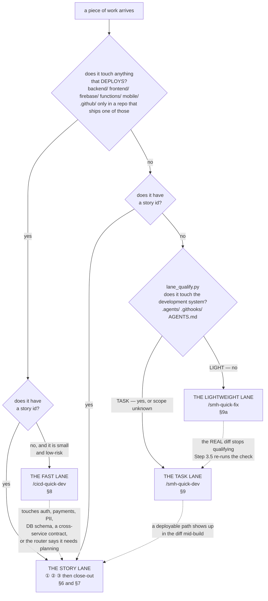


---

## 3. Core Lifecycles & Architecture

### 3.1 The System Lifecycle Map
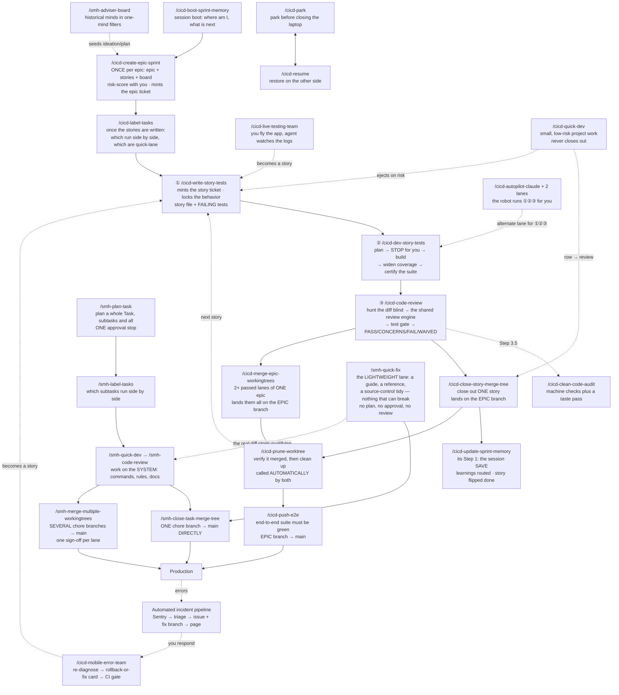


### 3.2 The Story Lane Loop
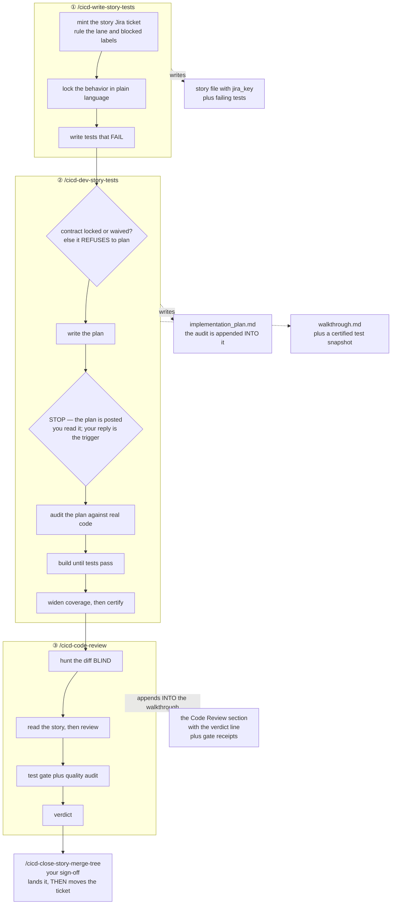


### 3.3 Which Close-Out Do I Run?
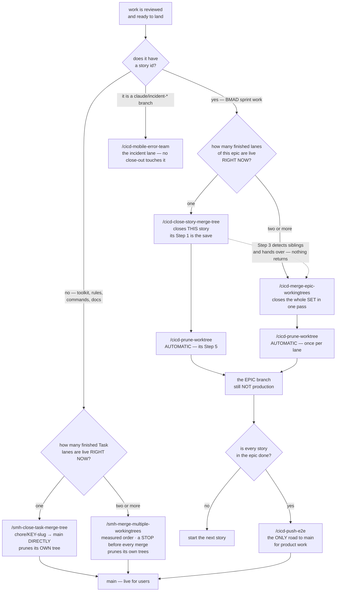


### 3.4 Close-Out Altitude & Call Tree
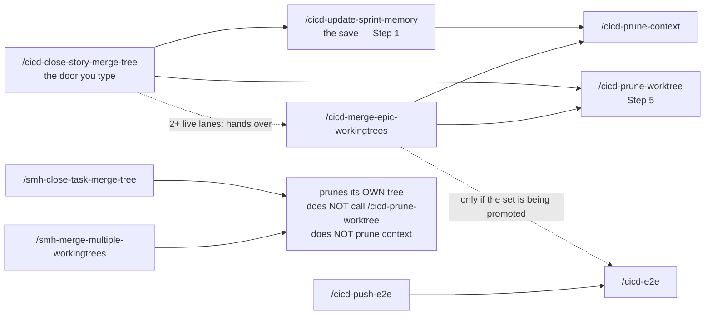


### 3.5 Git Branch & Worktree Topology
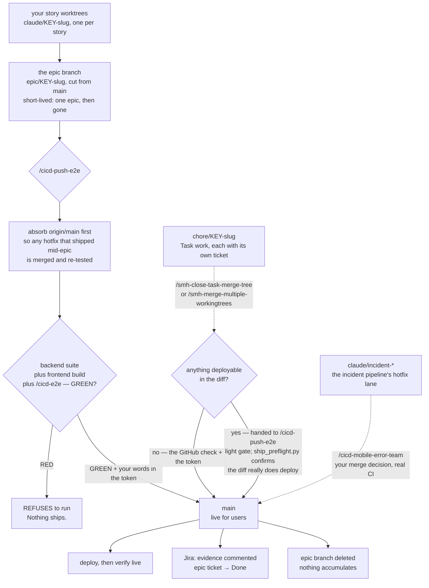


### 3.6 The Task Lane Loop
```mermaid
flowchart LR
    TICK["a Task ticket\nno story · no board · no epic"] --> PT["/smh-plan-task\nwhole Task, subtasks and all\nONE approval stop"]
    PT --> LT["/smh-label-tasks\nwhich subtasks run side by side"]
    LT --> QD["/smh-quick-dev\nworktree · checkable list · plan → approved"]
    TICK -.->|"a single lane"| QD
    QD --> SA["/smh-self-audit\nGO or NO-GO before a file is touched"]
    SA --> RED["write the assertion RED\na test, or a check a doc must pass"]
    RED --> GREEN["implement until GREEN\nmutants declared and killed"]
    GREEN --> EJ{"a deployable path\nin the diff?"}
    EJ -- "yes" --> OUT["⛔ eject → /cicd-push-e2e"]
    EJ -- "no" --> CR["/smh-code-review\nre-check main → blind hunt\n→ acceptance audit → the gate"]
    CR --> CCA["/smh-clean-code-audit"]
    CCA --> V["Verdict in the walkthrough"]
    V --> STOP["STOP — hand back"]
    STOP -.->|"your sign-off, ONE lane"| CLOSE["/smh-close-task-merge-tree"]
    STOP -.->|"your sign-off, SEVERAL lanes"| MULTI["/smh-merge-multiple-workingtrees"]
```


### 3.7 The Safety Net & Test Integrity
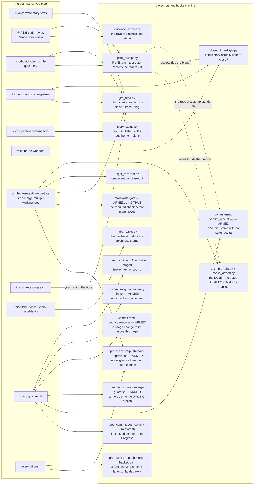


### 3.8 Is This Review Still Valid?
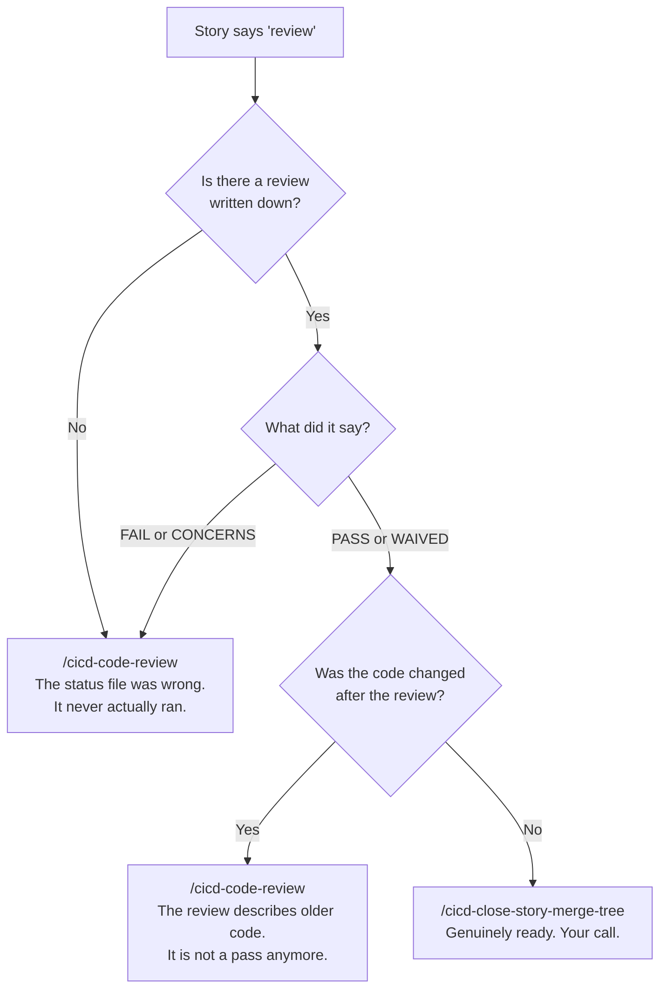


### 3.9 Machine Switching Architecture
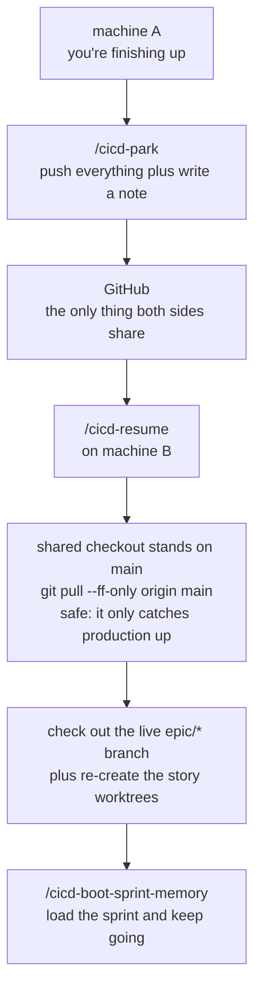


### 3.10 Automated Incident Response Loop
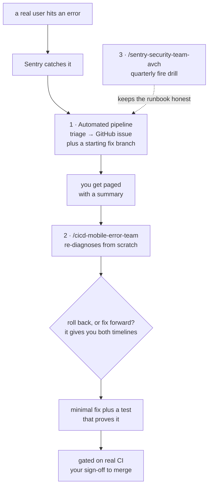


---

## 4. Gates vs. Nags: The Visual Diagnostic Guide

When working with autonomous agents, understand the fundamental difference between **Hard Gates** (which halt execution to prevent catastrophe) and **Nags** (non-blocking diagnostic telemetry delivered after an action):

```
[Agent or User Command]
          │
          ▼
   🛑 Pre-Execution Gates ──────────(Refusal / Stop)────────► User Intervention
   (require-push, pre-commit)                                 (approve / fix input)
          │ (Pass)
          ▼
   [Command Execution]
          │
          ▼
   💬 Post-Tool Nags ────────────────(Telemetry)────────────► Agent Self-Correction
   (shape-guard, context hygiene)                             (adjust next call)
          │
          ▼
   🔒 Commit & Push Gates ──────────(Refusal / Stop)────────► Staged Fix Required
   (sop-currency, pre-push)                                   (stage doc / [sop-ok])
```

### Two-Tier Diagnostic Matrix

| Type | Name | Timing | Behavior | How to Unblock / Remedy |
|---|---|---|---|---|
| **🛑 Hard Gate** | `require-push-approval.py` | `PreToolUse` (push) | Prompts for confirmation | Allow push if targeting your own `claude/*` or `chore/*` branch. Refuse if targeting `main`. |
| **🛑 Hard Gate** | `.githooks/pre-push` | Git push | Rejects push to `main` | Direct pushes to `main` are banned. Must land through `/cicd-push-e2e` or `/smh-close-task-merge-tree`. |
| **🛑 Hard Gate** | `sop_currency.py` | `commit-msg` | Rejects commit | If you altered commands, rules, scripts, or hooks, stage `docs/_scc_sops_prds/workflows_testing_SOP.md`. Or add `[sop-ok]` to commit message. |
| **🛑 Hard Gate** | `task_preflight.py` | Close-out merge | Refuses merge | If a `chore/*` branch touched deployable code (`backend/`, `frontend/`), work must route through `/cicd-push-e2e`. |
| **💬 Nag** | `shape-guard.py` | `PostToolUse` | Advisory in `additionalContext` | **Non-blocking**. Informs agent to pin with `cd <path> && ...`, avoid `git -C`, avoid `; echo "EXIT=$?"`, and avoid piped gates. |
| **💬 Nag** | `record_map_changes.py --nag` | `SessionStart` | Printed warning | Run `/smh-update-maps-indexes` to reconcile disk changes with repo map. |
| **💬 Nag** | `lint_context.py` | Context linter | Printed warning | Run context prune when session blocks exceed hysteresis limit (nag at 12, keep ~10). |
| **💬 Nag** | `test_memory_store.py` | Test suite | Printed warning | `MEMORY AUDIT DUE` prints at 90% of 25KB cap. Ask operator before running `/smh-memory-audit`. |

---

## 5. Visual Command Atlas

### 5.1 Command Call Graph
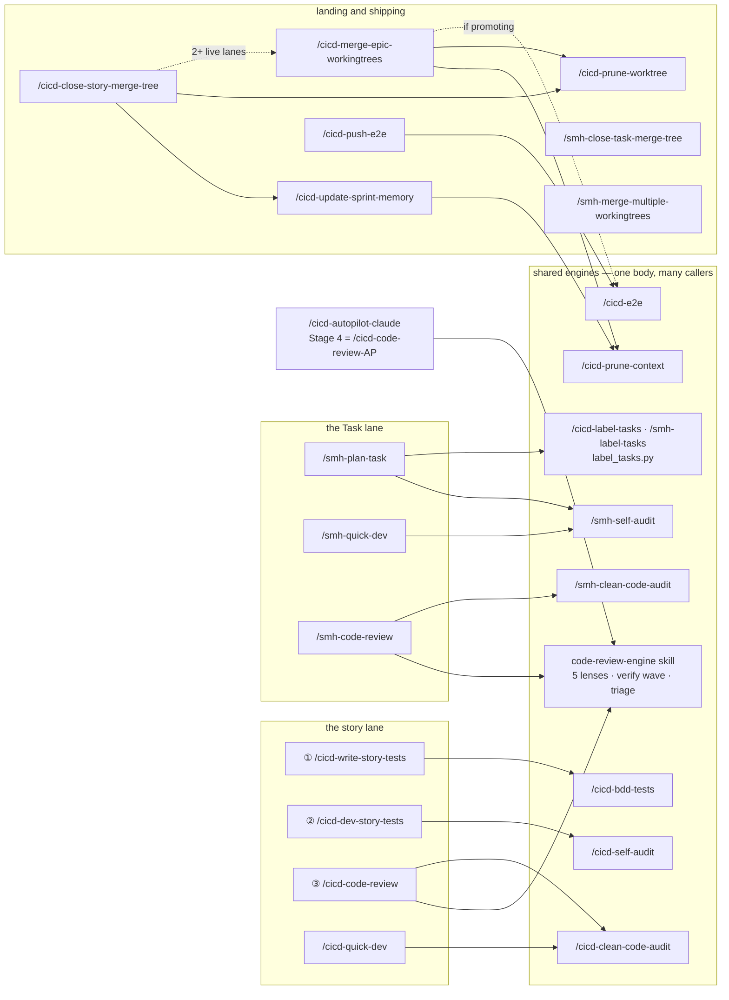


### 5.2 Who Writes the Board
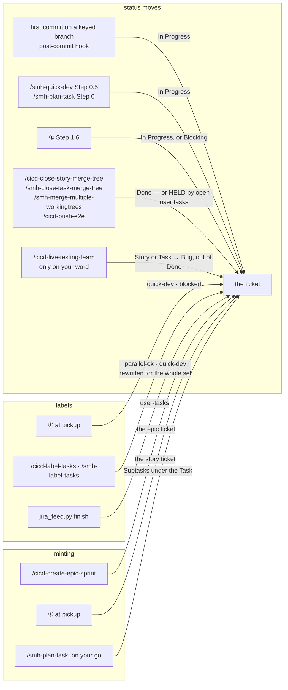


## 18. Every command, one diagram

*Grouped the way you meet them: session and planning → the story lane → the fast lane → the Task
lane → landing and shipping → operations → toolkit upkeep. Each entry names what it calls, what calls
it, and where the longer explanation lives.*

**Find your command** — every name below jumps straight to its diagram:

| Family | Commands |
| --- | --- |
| **Session & planning** | [`/cicd-boot-sprint-memory`](#cicd-boot-sprint-memory) · [`/cicd-create-epic-sprint`](#cicd-create-epic-sprint) · [`/cicd-label-tasks` + `/smh-label-tasks`](#cicd-label-tasks-and-smh-label-tasks) · [`/smh-plan-task`](#smh-plan-task) |
| **Story lane** | [`/cicd-write-story-tests`](#cicd-write-story-tests) · [`/cicd-bdd-tests`](#cicd-bdd-tests) · [`/cicd-dev-story-tests`](#cicd-dev-story-tests) · [`/cicd-self-audit`](#cicd-self-audit) · [`/cicd-code-review`](#cicd-code-review) · [`code-review-engine`](#code-review-engine-the-shared-reviewer) · [`/cicd-clean-code-audit` + `/smh-clean-code-audit`](#cicd-clean-code-audit-and-smh-clean-code-audit) |
| **Fast lane** | [`/cicd-quick-dev`](#cicd-quick-dev) |
| **Task lane** | [`/smh-quick-fix`](#smh-quick-fix) · [`/smh-quick-dev`](#smh-quick-dev) · [`/smh-self-audit`](#smh-self-audit) · [`/smh-code-review`](#smh-code-review) |
| **Landing & shipping** | [`/cicd-close-story-merge-tree`](#cicd-close-story-merge-tree) · [`/cicd-update-sprint-memory`](#cicd-update-sprint-memory) · [`/cicd-merge-epic-workingtrees`](#cicd-merge-epic-workingtrees) · [`/cicd-prune-worktree`](#cicd-prune-worktree) · [`/cicd-e2e`](#cicd-e2e) · [`/cicd-push-e2e`](#cicd-push-e2e) · [`/smh-close-task-merge-tree`](#smh-close-task-merge-tree) · [`/smh-merge-multiple-workingtrees`](#smh-merge-multiple-workingtrees) |
| **Operations** | [`/cicd-park` + `/cicd-resume`](#cicd-park-and-cicd-resume) · [`/cicd-prune-context`](#cicd-prune-context) · [`/cicd-autopilot-claude` (and its lanes)](#cicd-autopilot-claude-and-its-lanes) · [`/cicd-live-testing-team`](#cicd-live-testing-team) · [`/cicd-mobile-error-team`](#cicd-mobile-error-team) |
| **Toolkit upkeep** | [`/smh-sync-agents`](#smh-sync-agents) · [`/smh-sync-vscode`](#smh-sync-vscode) · [`/smh-memory-audit`](#smh-memory-audit) · [`/smh-update-maps-indexes`](#smh-update-maps-indexes) |

### Session and planning

#### /cicd-boot-sprint-memory

*Start of a session on a project: where am I, what is next, which command does it need. Read-only —
it never writes the board and never starts work. Explained in [§12](#12-the-board--what-runs-next).
Hands to: whichever step the story is at, or `/cicd-resume` when the work is only on origin.*

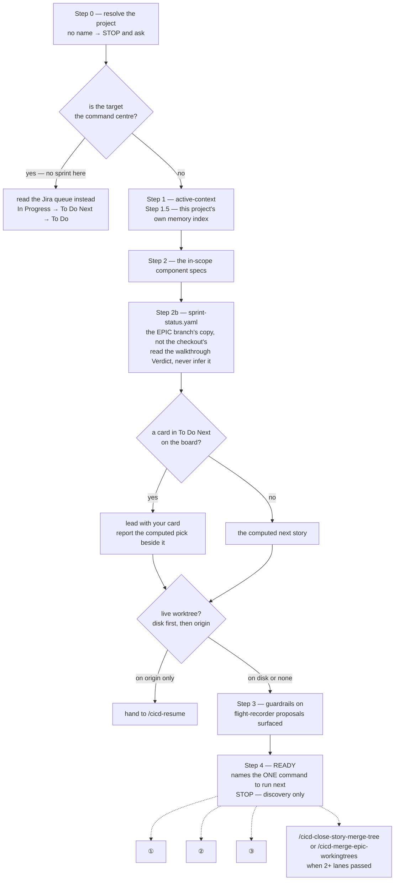

**Step 2b reads the sprint file off the epic branch, not off your checkout.** Close-out runs inside
the story worktree, so the `sprint-status.yaml` it writes rides the story branch and lands on the
epic; your shared checkout stays on `main` and only moves when the whole epic ships. Its copy is
therefore behind by every story that has landed since — which on a live epic is most of them. Boot
reads both and, when they disagree, **says so and leads with the epic branch**. A project between
epics has no epic branch at all; there the checkout copy is the authority and boot says that in one
line rather than erroring out.

#### /cicd-create-epic-sprint

*Once per epic, with you in the room: write the epic and its stories, cut and push the epic branch,
mint the epic ticket, generate the board, then risk-score every story. Explained in
[§6](#6-the-story-lane) and [§14](#14-how-we-test). Calls: `bmad-create-epics-and-stories`,
`bmad-testarch-test-design`, `jira_feed.py`. Hands to: ① for the first story.*

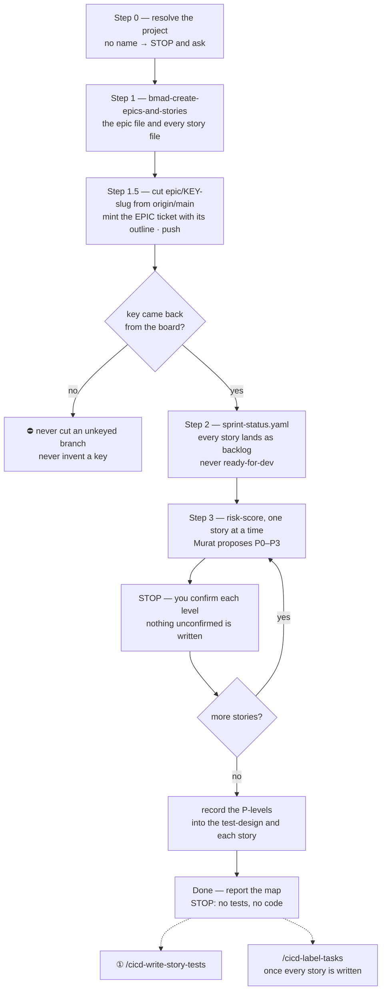

#### /cicd-label-tasks and /smh-label-tasks

*The same engine (`label_tasks.py`), two units of work: an epic's **stories**, or a Task's
**Subtasks**. Answers "which of these can run side by side, and which are small enough for the quick
lane" — stamps `parallel-ok` and `quick-dev` on the board, records what it compared so a stale answer
says so, and never starts anything. Explained in [§6](#6-the-story-lane) and
[§9](#9-the-task-lane--work-on-the-system-itself). Called by: you, and `/smh-plan-task` Step 4.*

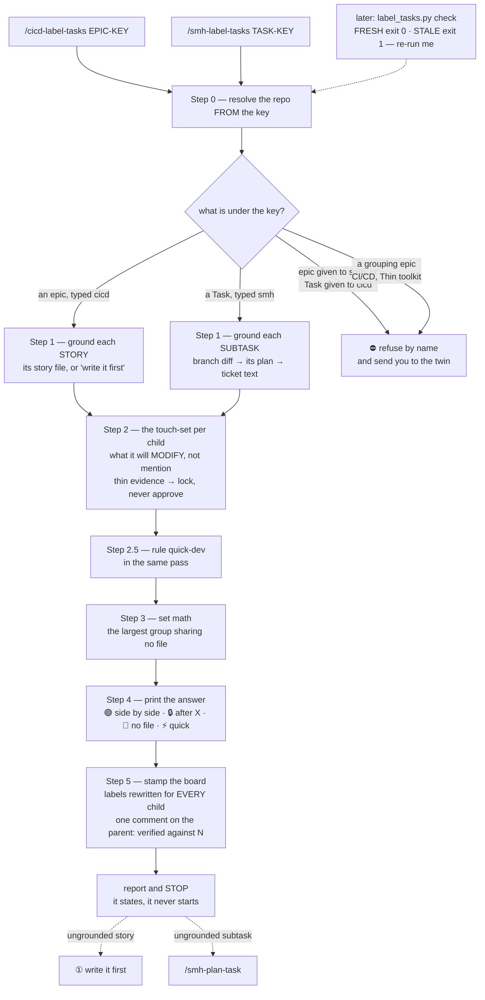

**Three ways it could answer confidently and wrongly are closed.**

- **A story file that has not merged yet is still found.** ① writes the story onto the lane branch
  and pushes; nothing reaches the epic until ③. Grounding reads the lane's own branch when the
  checkout has none — the same way the Task lane reads its plan. Reading only the checkout returns
  `[NO-STORY]` for every story *still in flight*, which is every story you would ever ask about, and
  tells you to go and write a file that already exists on the branch being labelled. **A source read
  that way carries a `ref`, and the doors say to open it with `git show "<ref>:<path>"`** — the
  checkout does not have that file, and an agent that hits the ENOENT and reads it as "no source"
  throws away the rung the packet just called authoritative.
- **A lane with only its RED tests written is not "code written".** That would be rung 1, the top of
  the ladder, decided on a touch-set that is the test files and nothing else — which understates
  where the code is about to land, and an understated touch-set is what manufactures a false 🟢. A
  tests-only diff keeps its paths but ranks *below* whatever can see further. **A diff with any real
  source file in it is unaffected.**
- **🔒 names every declared blocker, not just the first** — in the engine, in the legend, and in the
  chat report, which is the surface you actually read. One name for four declared blockers costs you
  four rounds — land it, re-run, hear about the next one — for an answer the engine already has, and
  the row *reads* like a single dependency.

#### /smh-plan-task

*Plan a whole Task and its subtasks in one pass, so the parallel question can be answered before any
lane starts. Proposes the breakdown and stops; on your go, mints the Subtasks and, per lane, writes
the plan, audits it, cuts and pushes the worktree, points the ticket at the plan; labels the set;
then **one** approval stop for everything. Explained in
[§9](#9-the-task-lane--work-on-the-system-itself). Calls: `/smh-self-audit`, `/smh-label-tasks`,
`jira_feed.py`. Hands to: `/smh-quick-dev` per lane, which skips its own approval stop for a lane
that came through this batch.*

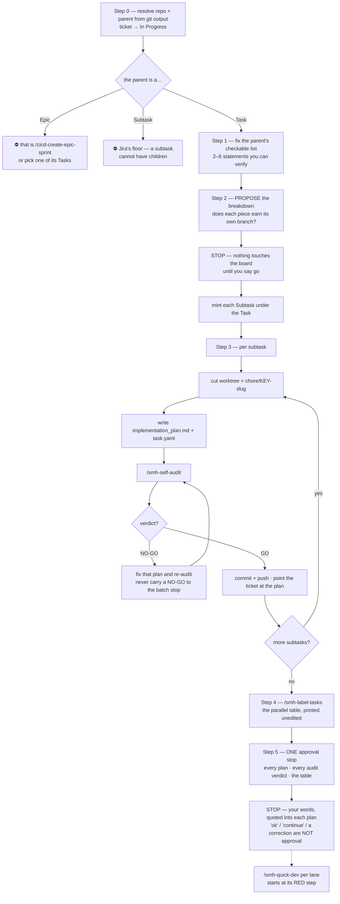

### The story lane

#### /cicd-write-story-tests

*① — create the story, mint its ticket, lock the behavior in plain language, write the tests that
FAIL. Explained in [§6](#6-the-story-lane). Calls: `bmad-create-story`, `jira_feed.py mint / start`,
`/cicd-bdd-tests`, `bmad-testarch-atdd`. Hands to: ②. Called by: you, or the boot's recommendation.*

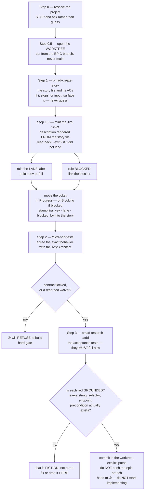

#### /cicd-bdd-tests

*The BDD Vision Lock — an interactive session that hashes out exact expected behavior until it is
100 % understood, then writes it as contracts **inside** the story's red tests, or records an
explicit waiver. ② hard-gates on its output. Explained in [§14](#14-how-we-test). Called by: ①
Step 2, or you.*

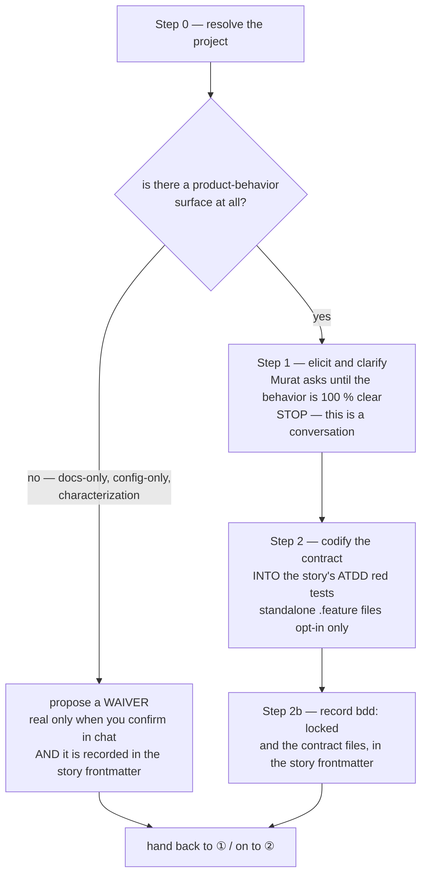

#### /cicd-dev-story-tests

*② — plan, stop, build, widen coverage, certify. The stop at Step 2 exists so you can switch the
model before the audit or hand the plan to another team blind. Explained in
[§6](#6-the-story-lane). Calls: `bmad-dev-story`, `/cicd-self-audit`, `bmad-testarch-automate`.
Hands to: ③.*

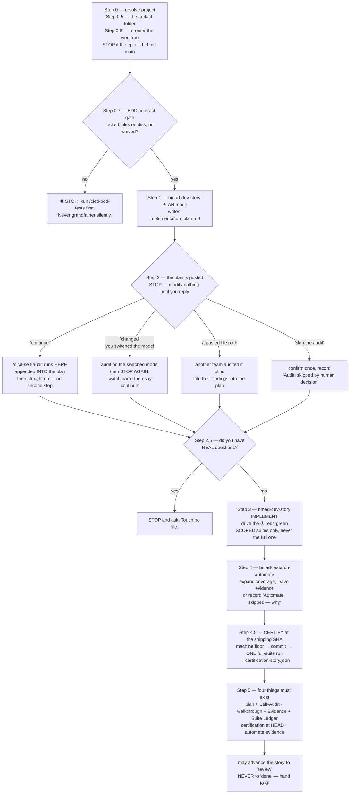

#### /cicd-self-audit

*The pre-dev plan audit, rebuilt under SCC-225: THREE lenses, an anchor rule (a finding names a
file or a plan step with the literal text read, or it is deleted), coverage-not-findings
reporting (full coverage with zero findings is a successful run), and over-engineering as a
LEDGER (created artefact × the AC requiring it), never an opinion. An amendment rule at the top
forbids ever adding a fourth lens. Ends in `GO` or `NO-GO` written **into** the plan. Explained
in [§6](#6-the-story-lane). Called by: ② Step 2 (automatically), or you.*

```mermaid
flowchart TD
    S0["Step 0 — bind the project · Skip / PRE-DEV / POST-DEV"] --> LVL{"level, from the Declared Change Set\nLEDGER — Lens 1 only\nLEDGER+BLAST — all three"}
    LVL --> L1["Lens 1 — Repo Reality\ndoes the plan's world exist? paths, ACs, block parses\n+ the Scope Ledger: created artefact × the AC requiring it"]
    L1 --> L2["Lens 2 — Parity + Blast\ngraph when fresh, grep as the NORMAL path\ncontracts two-sided · ports · twins · sibling lanes\nrisk seam informs, never gates"]
    L2 --> L3["Lens 3 — Pre-Mortem\nBOUNDED: attaches failure narratives to anchored findings\nunattached output is DISCARDED"]
    L3 --> V{"verdict"}
    V -- "GO" --> GO["append ## Self-Audit + Audit verdict: GO\ncoverage blocks per lens · findings anchored · Observations uncounted"]
    V -- "NO-GO" --> NOGO["only two grounds: an anchored finding breaking\nan AC or a hard gate · the Ledger precondition failing"]
```

#### /cicd-code-review

*③ — hunt the diff cold, then run the adversarial review through the shared engine, then the test
gate and the clean-code gate; write one verdict into the walkthrough. Explained in
[§6](#6-the-story-lane) and [§11](#11-is-this-review-still-valid). Calls: the `code-review-engine`
skill, `gate_receipt.py`, `bmad-testarch-trace / nfr / test-review`, `/cicd-clean-code-audit`. Hands
to: the close-out (on your word).*

```mermaid
flowchart TD
    S0["Step 0 — resolve project\nStep 0.5 — re-enter the story worktree\nthe built code often lives ONLY there"] --> EMPTY{"is the diff empty?"}
    EMPTY -- "yes" --> X["⛔ STOP — an empty diff\nis not a pass"]
    EMPTY -- "no" --> S1["Step 1 — the engine, clean-room\npass REPO · WORKTREE · DIFF · HEAD_SHA\nreview_mode · lens_budget: standard"]
    S1 --> ORD["⭐ hunt the diff FIRST\nopen ②'s plan and walkthrough ONLY AFTER"]
    ORD --> FLOOR["the engine returns lenses run,\nfindings by bucket, and a severity FLOOR\nthe verdict may be the floor or worse, never better"]
    FLOOR --> FIX["⭐ fix IN THREAD, now — every patch applied here\nevery decision walked with you here\nnothing survives as future work; never a ticket"]
    FIX --> S2{"Step 2 — a test baseline?\nsudo-tests.yaml"}
    S2 -- "absent" --> WAIV["verdict WAIVED\nStep 3.5 still runs"]
    S2 -- "present" --> S3["Step 3 — the checks\nEVERY gate through gate_receipt.py\nunrunnable is a finding, not a skip"]
    S3 --> INH{"②'s certification SHA\nequals HEAD, 0 failures?"}
    INH -- "yes" --> ADOPT["adopt it — cite the file"]
    INH -- "no" --> RUN["run the full suite yourself\nfail TOWARD running\nthis becomes the certifying run"]
    ADOPT --> TEA["testarch-trace coverage floor\ntestarch-nfr when required · test-review\nautomate evidence, else CONCERNS"]
    RUN --> TEA
    TEA --> S35["Step 3.5 — /cicd-clean-code-audit\nALWAYS, even on WAIVED"]
    WAIV --> S35
    S35 --> V["Step 4 — the VERDICT\nPASS · CONCERNS · FAIL · WAIVED @ sha\nappended to walkthrough.md as ## Code Review"]
    V --> S5["Step 5 — refresh the walkthrough body\nand clear ## Your Actions of anything\nthe agent can do itself"]
    S5 -.-> NO["never lands, never flips status\nthe close-out is yours"]
```

#### code-review-engine (the shared reviewer)

*A skill, not a command — you never type it. It is the one reviewer behind ③, `/smh-code-review`
and the autopilot's Stage 4: five independent lenses in parallel, a verify wave, a triage that
decides what is actually worth doing, and a record. It never verdicts, never writes the board, never
stops to ask; decisions come back as findings. Explained in [§6](#6-the-story-lane) (the
"found ≠ owed" aside) and [§15](#15-the-autopilot-lane).*

```mermaid
flowchart TD
    IN["the caller passes\nREPO · WORKTREE · DIFF · HEAD_SHA · review_mode\nlens_budget · optional evidence pack"] --> CHK{"invoked from a menu,\nor an input missing?"}
    CHK -- "yes" --> X["⛔ refuse — print the contract\nnever re-derive what a caller resolved"]
    CHK -- "no" --> L["Step 01 — the lens fan-out, in parallel"]
    L --> L1["Blind Hunter\nsees the DIFF only, starved on purpose"]
    L --> L2["Edge-Case Hunter"]
    L --> L3["Literal-Correctness Hunter\nopens the real definition behind each line\nthe one lens with a budget: standard or capped"]
    L --> L4["Acceptance Auditor\nreview_mode: full only"]
    L --> L5["Test-Adequacy Auditor"]
    L1 --> DEAD{"a lens could not run?"}
    L2 --> DEAD
    L3 --> DEAD
    L4 --> DEAD
    L5 --> DEAD
    DEAD -- "retry → inline rerun → still dead" --> CAP["floor rises to CONCERNS"]
    DEAD -- "all ran" --> V["Step 02 — the verify wave\nevidence dossier from the changed files and callers\nEvidence Verifier · Compound Synthesis"]
    CAP --> V
    V --> T["Step 03 — triage\nnormalize · dedupe · one bucket each\ndecision_needed · patch · defer · dismiss"]
    T --> REL{"⭐ the relevance gate\nTRUE is not WORTH DOING"}
    REL -- "a real path to damage today, or it\nundermines cited evidence, or you asked" --> KEEP["survives — FIXED IN THE LANE by the caller,\nbefore the verdict · a defer only against ONE named\nstructural blocker · a review NEVER produces a ticket"]
    REL -- "fails all three legs" --> KILL["dismissed with a one-line reason\ncounted AND named in the table"]
    KEEP --> F["score the severity floor\ncritical in decision/patch → FAIL\nimportant → CONCERNS · dead lens → CONCERNS"]
    KILL --> F
    F --> R["Step 04 — record the findings\nreturn lenses · counts · floor · notes"]
    R -.-> OUT["the caller turns the floor into a Verdict"]
```

#### /cicd-clean-code-audit and /smh-clean-code-audit

*The clean-code gate, one shape, two floors: the product lane checks with the tools the project has
(`ruff`, `eslint`, `pyrefly`, `tsc`); the command centre has none of those, so its floor is the
enforcement suite, the toolkit lint, SOP currency, `py_compile`, links and door parity. Machine
findings can FAIL; the judgment pass caps at CONCERNS. Explained in
[§9](#9-the-task-lane--work-on-the-system-itself). Called by: ③ Step 3.5 and `/cicd-quick-dev`
(the cicd one); `/smh-code-review` Step 3.5 (the smh one); or you.*

> **Step 0's base is the epic branch, fetched (SCC-165 follow-on).** A story lane's diff base is
> `refs/remotes/origin/epic/*` **before** the local head — a local epic head is only as fresh as the
> last pull, and sibling stories land on the epic branch while the audit runs — falling back to
> `origin/main`, never a bare `main`. The line had been carrying `BASE=${BASE:-main}`, invisible to
> the stale-ref scan because its `(?<![\w/.-])` lookbehind rejects the `-` of the shell
> default-value operator; the scan carries `ref-default` and `ref-assign` patterns for that.
>
> ⛔ **QUOTE the refspec.** `'refs/remotes/origin/epic/*'` is a pattern for git to match, not a
> path for the shell to expand. Bash leaves an unmatched glob alone, so an unquoted one looks
> fine there; **zsh** refuses outright with
> `no matches found: refs/remotes/origin/epic/*`, exits 1 and prints nothing, so the next line
> reads an empty variable and the whole discovery step fails quietly. Every `for-each-ref`,
> `ls-remote` and `show-ref` pattern in a command body is quoted for this reason.

```mermaid
flowchart TD
    A["/cicd-clean-code-audit\nProduct repo"] --> S0["Step 0 — resolve the diff, worktree-aware\ndiff-scoped ALWAYS — legacy debt never red-walls a story\nload the standard, never audit from memory"]
    B["/smh-clean-code-audit\ncommand centre"] --> S0
    S0 --> FLOOR{"Step 1 — the machine floor\nwhich repo?"}
    FLOOR -- "product" --> P["ruff · eslint on the changed files\npyrefly · tsc counted on the changed set\na MISSING tool is a finding, not a skip"]
    FLOOR -- "command centre" --> C["run_all.py · workflow_lint --toolkit-only\nsop_currency · py_compile · links + anchors\ndoor parity when a command changed"]
    P --> SCAN["scan for what linters miss\nbare except · any · a committed secret\ndebug prints · commented-out code · bare python"]
    C --> SCAN
    SCAN --> J["Step 2 — the judgment pass\ncomment contract · AI-drift bans · toolkit conventions\ncaps at CONCERNS"]
    J --> F["Step 3 — findings by severity\nhand back to the caller's verdict"]
```

### The fast lane

#### /cicd-quick-dev

*Small, low-risk project work: fix the acceptance criteria before any code, build in one shot, then a
mandatory review gate. It never closes out — on a story it advances the row to `review` and stops.
Explained in [§8](#8-the-fast-lane--cicd-quick-dev). Calls: `bmad-quick-dev`, an independent
reviewer, `/cicd-clean-code-audit`, `jira_feed.py devrecord`. Ejects to: ①.*

```mermaid
flowchart TD
    S0["Step 0 — resolve project"] --> S05{"Step 0.5 — which lane?"}
    S05 -- "a story id" --> WT["worktree on claude/KEY-slug\noff the epic branch"]
    S05 -- "ad-hoc, no epic" --> CH["chore/KEY-slug off main\nno story file — ever"]
    WT --> S1["Step 1 — bmad-quick-dev clarifies and routes"]
    CH --> S1
    S1 --> AC["⊕ FIX 2–6 CHECKABLE ACs\nechoed in chat BEFORE any code\nSTOP until they are agreed"]
    AC --> S15{"Step 1.5 — ⛔ EJECT tripwire"}
    S15 -- "router says plan-code-review" --> EJ["STOP. Hand to ① /cicd-write-story-tests\nkeep the worktree, discard nothing"]
    S15 -- "auth · payments · PII · schema\nsecurity rules · cross-boundary contract" --> EJ
    S15 -- "the intent will not reduce to ACs" --> EJ
    S15 -- "a bug fix that will not reproduce" --> EJ
    S15 -- "clear" --> S2["Step 2 — one-shot implementation\ncommits in the worktree, explicit paths\na bug fix carries ONE pinning regression test"]
    S2 --> S3["Step 3 — ⭐ REVIEW GATE, mandatory"]
    S3 --> R1["every lane: an independent adversarial\nreviewer with NO conversation context"]
    S3 --> R2["code touched: acceptance auditor\n+ /cicd-clean-code-audit\n+ scoped tests, whole suite if a shared handler moved"]
    S3 --> R3["docs only: link + anchor check\n+ SOP-currency check"]
    R1 --> F{"any finding bigger\nthan a trivial patch?"}
    R2 --> F
    R3 --> F
    F -- "yes" --> EJ
    F -- "no — patches applied NOW; a defer names\nONE structural blocker, never a parking lot" --> S4["Step 4 — thin walkthrough with the Verdict line\nstory: advance the row to 'review'"]
    S4 --> S45["Step 4.5 — file the Dev Record now\nthis lane may END here"]
    S45 --> STOP2["⛔ STOP. No close-out. Never land on the epic\nbranch. 'done' is yours — /cicd-close-story-merge-tree"]
```

### The Task lane

#### /smh-quick-fix

*The lightweight lane (SCC-162): command-centre work that touches nothing which can break. Invoking
it IS the "skip the plan" instruction, so there is no plan, no `approved`, no self-audit, no RED-first
assertion and no review verdict — but qualification is a script and it runs TWICE, on what you
intended and again on what you actually changed. Explained in
[§9a](#the-lightweight-lane--smh-quick-fix). Calls: `lane_qualify.py`, `link-worktree-assets.py`,
`jira_feed.py start`, `jira_feed.py devrecord`. Hands to: `/smh-close-task-merge-tree` on your word —
or to `/smh-quick-dev` if it ejects.*

```mermaid
flowchart TD
    S0["Step 0 — lane_qualify.py --paths\nBEFORE minting anything"] --> Q{"verdict?"}
    Q -- "NOT-COMMAND-CENTRE" --> OUTP["⛔ a project repo\n→ the cicd-* lanes"]
    Q -- "HANDOFF" --> OUTD["⛔ a deployable path\n→ /cicd-push-e2e"]
    Q -- "TASK — incl. NO paths given" --> OUTT["⛔ touches the dev system,\nor scope is unknown\n→ /smh-quick-dev, with a plan"]
    Q -- "LIGHT / LIGHT-VCS" --> S1["Step 1 — mint the ticket, cut\nchore/KEY-slug off main, link assets\nticket → In Progress"]
    S1 --> NOASK["⛔ never ask 'shall I mint /\nopen a lane / write a plan?'\nasking IS the over-engineering"]
    NOASK --> S2["Step 2 — do the work\nexplicit-path commits · push"]
    S2 --> S3["Step 3 — the gates that apply\nrun_all · workflow_lint --toolkit-only\ncheck_maps · the SOP folder test\nrun them BARE, never piped"]
    S3 --> VCS{"LIGHT-VCS?"}
    VCS -- "yes" --> RISK["delete only the refs the operator NAMED\nnever a swept set · -C on every call\nshow it, get the word, then delete"]
    VCS -- "no" --> S35
    RISK --> S35["Step 3.5 — ⛔ EJECT\nlane_qualify.py against the REAL diff\ngit diff --name-only main...HEAD"]
    S35 --> EJ{"still LIGHT?"}
    EJ -- "no" --> EJECT["⛔ the lane is over — keep every commit,\nthe plan-first gate RE-ARMS\n→ /smh-quick-dev"]
    EJ -- "yes" --> S4["Step 4 — lean walkthrough\n## What changed · ## Evidence\n## Your Actions (required, even if empty)\ntask.yaml · Dev Record"]
    S4 --> STOP["STOP — hand back\nnever merges, never closes its own ticket"]
    STOP -.->|"your sign-off"| CLOSE["/smh-close-task-merge-tree\nno verdict to inherit, so the FULL gate runs"]
```

#### /smh-quick-dev

*The Task lane's build step: fix a checkable list, plan, audit, wait for `approved`, then something
must be RED before anything is edited, then make it green with the mutant table declared first.
Explained in [§9](#9-the-task-lane--work-on-the-system-itself) — the mutation and subtask rules
live there. Calls: `/smh-self-audit`, `gate_receipt.py` (stamp-first), `link-worktree-assets.py`,
`jira_feed.py start`. Hands to: `/smh-code-review`, then `/smh-close-task-merge-tree` on your word.*

```mermaid
flowchart TD
    S0["Step 0 — resolve the repo FROM git output\npin EXPECTED_KEY · read the ticket's ACCEPTANCE\nno ticket → STOP and ask, never invent a key"] --> S05["Step 0.5 — worktree + chore/KEY-slug off main\nabsorb main · link assets · ticket → In Progress"]
    S05 --> SIB["⭐ read the SIBLING lanes now\ntheir uncommitted work is invisible to grep\nname the landing-order dependency"]
    SIB --> S1["Step 1 — FIX THE CHECKABLE LIST\nticket ACCEPTANCE → your intent → 2–6 items you confirm"]
    S1 --> CHK{"every item checkable by a\ncommand or an inspection?"}
    CHK -- "no" --> NOTHERE["not work for this lane — say so, stop"]
    CHK -- "yes" --> BATCH{"came through a\n/smh-plan-task batch?"}
    BATCH -- "yes — plan already approved" --> S2
    BATCH -- "no" --> S15["Step 1.5 — write the plan, then /smh-self-audit"]
    S15 --> AUD{"audit verdict?"}
    AUD -- "NO-GO" --> FIXPLAN["fix the plan, re-audit\nnever re-run hoping"]
    FIXPLAN --> S15
    AUD -- "GO" --> APPR["STOP — wait for the literal 'approved'"]
    APPR --> S16["Step 1.6 — SUBTASKS: does a piece earn its own\nbranch AND worktree? propose, then STOP"]
    S16 --> S2["Step 2 — ⭐ RED FIRST\nscript → a test · gate → refuses the bad case\ncommand → the lint error · doc → a checkable assertion"]
    S2 --> READ["run it, paste the RED, read WHICH LINE raised\n--case 'label' to run your cases only\nexit 3 = the filter matched nothing, never a result"]
    READ --> S3["Step 3 — GREEN, minimally\nexplicit paths · key in every subject\nSTAMP-FIRST: the receipt run IS the suite run"]
    S3 --> MUT["⭐ mutation — the declared table, ONE sweep\ncode-derived · targeted kills · restore in a trap\nclosing green on the whole files (§9 Mutation)"]
    MUT --> S35{"Step 3.5 — ⛔ EJECT tripwire"}
    S35 -- "a deployable path in the diff" --> EJ1["→ /cicd-push-e2e. No override."]
    S35 -- "it is BMAD story work" --> EJ2["→ ① /cicd-write-story-tests"]
    S35 -- "clear" --> S4["Step 4 — /smh-code-review, mandatory"]
    S4 --> S5["Step 5 — walkthrough + task.yaml + Dev Record\n## Your Actions is a contract: an open box HOLDS the ticket"]
    S5 --> STOPX["⛔ STOP. No merge, no transition, no prune.\n/smh-close-task-merge-tree is YOUR sign-off"]
```

#### /smh-self-audit

*The Task lane's plan audit, rebuilt under SCC-225: THREE lenses behind an anchor rule — a
finding names an existing file or plan step with the literal text read, or it is deleted, not
demoted. Lenses return COVERAGE (checks run, what was read, verdict): full coverage with zero
findings is a successful run, so "I found nothing" is a valid deliverable. Over-engineering ships
only as the Scope Ledger (created artefact × the acceptance row requiring it). The amendment rule
at the top of the file forbids ever adding a fourth lens — a miss amends the marker lists, the
anchor definitions, or the Ledger rules instead. Two modes: PRE-WORK (default — no plan means
STOP) and POST-DEV / retroactive. Explained in
[§9](#9-the-task-lane--work-on-the-system-itself). Called by: `/smh-quick-dev` Step 1.5,
`/smh-plan-task` Step 3, or you. Its stale half (Lens 2) re-runs by itself as `/smh-code-review`
Step 0.7.*

```mermaid
flowchart TD
    S0["Step 0 — resolve the repo from git output\nthe lobby is a valid subject · name the plan and the key"] --> MODE{"Skip / PRE-WORK / POST-DEV, out loud"}
    MODE -- "PRE-WORK, no plan file" --> X["⛔ STOP and say so\ninventing a plan to audit is the failure this catches"]
    MODE -- "POST-DEV" --> RETRO["audit the ticket's ACCEPTANCE + the change set\nlabel the run RETROACTIVE"]
    MODE -- "PRE-WORK" --> LVL{"level, from the Declared Change Set\nLEDGER — Lens 1 only\nLEDGER+BLAST — all three"}
    LVL --> L1["Lens 1 — Repo Reality\npaths and commands exist · block parses · both sides\n+ Scope Ledger: created artefact × the acceptance row requiring it"]
    RETRO --> L2
    L1 --> L2["Lens 2 — Parity + Blast\nscar table: doors, rules, scripts, gates, links, SOP, ports\ntwins diffed · sibling lanes read · risk seam informs, never gates"]
    L2 --> L3["Lens 3 — Pre-Mortem\nBOUNDED: cannot originate — attaches failure narratives\nto anchored findings · unattached output DISCARDED"]
    L3 --> V{"verdict"}
    V -- "GO" --> GO["## Self-Audit appended INTO the plan\ncoverage per lens · anchored findings · Audit verdict: GO"]
    V -- "NO-GO" --> NOGO["only two grounds: anchored finding breaking an\nacceptance row or a hard gate · Ledger precondition failing"]
    GO -.-> NOTOUCH["writes no implementation\ntransitions no ticket"]
    NOGO -.-> NOTOUCH
```

#### /smh-code-review

*The Task lane's verdict: re-derive the blast radius against **current** `main` (sibling lanes land
while you build), then the shared review engine on the diff, an acceptance audit against the
checkable list, the command-centre gate, and the clean-code gate; one `Verdict:` line the close-out
reads. Explained in [§9](#9-the-task-lane--work-on-the-system-itself). Calls: the
`code-review-engine` skill, `gate_receipt.py`, `/smh-clean-code-audit`. Hands to:
`/smh-close-task-merge-tree` on your word.*

```mermaid
flowchart TD
    S0["Step 0 — resolve repo, branch, HEAD from git\nStep 0.5 — the diff · EMPTY is a STOP, not a pass"] --> S07["Step 0.7 — ⭐ RE-DERIVE THE BLAST RADIUS\nagainst CURRENT main"]
    S07 --> Q1["did anything this diff REFERENCES\nmove, rename, or vanish?"]
    S07 --> Q2["the TRUE overlap —\ndoes merge-tree conflict?"]
    S07 --> Q3["which sibling lanes are live —\nmust one land first?"]
    Q1 --> ABS["absorb main NOW, before the verdict\nre-take DIFF and HEAD_SHA after"]
    Q2 --> ABS
    Q3 --> ABS
    ABS --> S1["Step 1 — the engine, clean-room\nthe SAME engine ③ runs · lens_budget: standard\nhunt the diff first, open the plan ONLY AFTER"]
    S1 --> FIX["⭐ fix IN THREAD before any gate\npatches applied now · decisions walked with you now\na defer names ONE structural blocker; never a ticket"]
    FIX --> S2["Step 2 — acceptance audit\nagainst the CHECKABLE LIST, not the code"]
    S2 --> EV{"each item names the\nassertion that proves it?"}
    EV -- "no" --> CONC["CONCERNS floor\n'I read it and it looks right' is not evidence"]
    EV -- "yes" --> S3["Step 3 — the command-centre gate"]
    CONC --> S3
    S3 --> G1["run_all.py — inherit quick-dev's receipt if\nclean-stamped and code-fresh, else run and RE-STAMP once"]
    S3 --> G2["workflow_lint --toolkit-only\nerrors FAIL · warnings CONCERNS"]
    S3 --> G3["the task's own RED assertions — GREEN now\ncite the named cases"]
    S3 --> G4["sop_currency · link + anchor · door parity"]
    G1 --> S35["Step 3.5 — /smh-clean-code-audit"]
    G2 --> S35
    G3 --> S35
    G4 --> S35
    S35 --> S4["Step 4 — Verdict appended to walkthrough.md\nwith Step 0.7's three lines —\n'nothing moved' is a result, silence is not"]
    S4 --> S5["Step 5 — refresh the walkthrough body\nclear ## Your Actions of what the agent can do"]
```

### Landing and shipping

#### /cicd-close-story-merge-tree

*THE DOOR — the command you type to close ONE story out: preflight, run the save, commit the close-out
edits, LAND the story on its **epic branch**, and only THEN file the Dev Record and move the ticket,
then prune. Invoking it IS your sign-off for THAT landing, and the sign-off is spent by it. It never
touches `main`. Explained in [§7](#7-landing-and-shipping--the-close-out-family). Calls:
`closeout_preflight.py`, `jira_feed.py`, `/cicd-update-sprint-memory` (Step 1), `/cicd-prune-worktree`
(Step 5). Hands over to: `/cicd-merge-epic-workingtrees` when siblings are live.*

```mermaid
flowchart TD
    S0["Step 0 — resolve the project\necho the story, the KEY and the BRANCH you MEAN"] --> S05["Step 0.5 — absorb the EPIC branch FIRST\nthe save is about to rewrite the two hottest files\nconflict → STOP and report, never force"]
    S05 --> S06["Step 0.6 — closeout_preflight.py\n--expect-key + --branch + --worktree, NOT optional\ncheck the target it ECHOES before its verdict"]
    S06 --> PF{"exit code?"}
    PF -- "2 — BLOCKED" --> STOP1["⛔ resolve it before anything flips\n'landing was NOT verified' is not a pass"]
    PF -- "0 or 1" --> S1["Step 1 — the SAVE: /cicd-update-sprint-memory\nAUTOMATIC · hand it the preflight block\nit flips the story to done — every write a FILE write"]
    S1 --> S2["Step 2 — jira_feed.py check-actions\n## Your Actions may hand you no ticket work\nand none of the ceremony's own steps"]
    S2 --> CA{"does it refuse?"}
    CA -- "yes" --> FIXA["fix it HERE — this is the only place it is free\nafter the landing the walkthrough is on the\nepic branch and the fix costs another commit"]
    CA -- "no" --> CM["commit the close-out edits\nEXPLICIT PATHS ONLY — git add -A / . / -u are banned"]
    FIXA --> CM
    CM --> S3{"Step 3 — sibling worktrees live?"}
    S3 -- "yes" --> HANDOVER["STOP this solo flow\nfollow /cicd-merge-epic-workingtrees\nnothing returns here"]
    S3 -- "no" --> PRE{"HEAD is on…"}
    PRE -- "claude/incident-*" --> INC["⛔ STOP — that is the incident lane\n/cicd-mobile-error-team"]
    PRE -- "not a claude/* branch" --> NOLAND["⛔ not worked in a worktree\ndo NOT land it — report and stop"]
    PRE -- "claude/KEY-slug" --> MG{"⭐ MERGE GATE — did the epic branch\nmove CODE since ③'s verdict sha?"}
    MG -- "no" --> INH["inherit ③'s green"]
    MG -- "yes" --> RERUN["the merged tree has NEVER been tested\nrun the full suite NOW"]
    RERUN --> RED{"green?"}
    RED -- "no" --> STOPALL["⛔ STOP — no push, nothing lands\nthe board flips ride this branch, and Step 4\nnever runs, so the ticket never moves"]
    RED -- "yes" --> INH
    INH --> PUSH["git push origin HEAD:epic/KEY-slug\nTHE landing · main untouched"]
    PUSH --> P0{"did the push return 0?"}
    P0 -- "no — the remote moved" --> REJ["⛔ STOP and report · re-sync and re-land, never force\nthe ticket does NOT move"]
    P0 -- "yes" --> S4["⭐ Step 4, and only now — the one REMOTE write\na. Dev Record filed, then READ BACK\nb. ticket → Done · a Bug flag is cleared\nc. check scoped AND unscoped — the fork arm"]
    S4 --> S5["Step 5 — /cicd-prune-worktree\nAUTOMATIC · --repo and --branch passed through"]
    S5 --> S6["Step 6 — VERIFY, then report\nevery line from a command you actually ran"]
```

#### /cicd-update-sprint-memory

*The SAVE, and nothing else: read this session's artifacts, code-verify the claimed work
on disk, route every learning to its home, apply the board / story / `active-context` updates, flip the
story to `done`, prune the context budget. Every write it makes is a FILE write that rides the story
branch — no landing, no ticket, no Dev Record, no worktree prune. Explained in
[§7](#7-landing-and-shipping--the-close-out-family). Calls: `story_status.py`, `/cicd-prune-context`.
Invoked by: `/cicd-close-story-merge-tree` at its Step 1, or by you, standalone, any time a session
needs saving and nothing is being closed.*

```mermaid
flowchart TD
    S0["Step 0 — resolve the project"] --> WHO{"who invoked this?"}
    WHO -- "the door" --> SKIP["Steps 0.5 / 0.6 are already done\nread the preflight block it hands you\ndo NOT re-run either — it answers nothing new"]
    WHO -- "you, standalone" --> OWNPF["absorb the EPIC branch, then run\ncloseout_preflight.py yourself\nexit 2 — BLOCKED"]
    SKIP --> S1
    OWNPF --> S1["Steps 1–2 — read state and this session's\nplan + walkthrough, then CODE-VERIFY\nthe claimed work on disk"]
    S1 --> S3["Step 3 — route each learning to its home\nrule · component pitfall · open bug · memory\na ## Close-Out Handoff block is LIFTED, never re-derived"]
    S3 --> S4{"Step 4 — flip to done?\nread the Verdict line + gate receipts"}
    S4 -- "FAIL" --> NOFLIP["do NOT flip\nfix via ③, re-run"]
    S4 -- "PASS · CONCERNS · WAIVED\nmissing · stale" --> FLIP["story_status.py set id done\nBOTH surfaces or NEITHER"]
    FLIP --> EPICCLOSE["same pass: every child terminal?\n→ flip the EPIC too"]
    EPICCLOSE --> S5["Step 5 — /cicd-prune-context\nAUTOMATIC, applies unconditionally"]
    S5 --> S6{"Step 6 — did Step 3\nroute any learnings?"}
    S6 -- "none" --> ASKL["ask you for manual learnings"]
    S6 -- "some" --> ENDS
    ASKL --> ENDS["⛔ the save ENDS here\nno landing, no ticket, no Dev Record, no prune —\nthose four are the door's, in that order"]
```

#### /cicd-merge-epic-workingtrees

*Close out ALL of an epic's finished lanes in one reviewed pass — inventory, per-lane preflight, the
overlap map, land in dependency order with a gate per lane, a combined gate on the epic branch, then
prune. Ends at the epic branch; it does not touch `main`. Explained in
[§7](#7-landing-and-shipping--the-close-out-family). Calls:
`/cicd-prune-context` (once), `/cicd-prune-worktree` (per lane), `/cicd-e2e` (only if promoting).
⚠ It does **not** call `closeout_preflight.py` (this row said it did), and it files no Dev Record and moves no
ticket — it borrows `/cicd-update-sprint-memory` Steps 1–4 + 6, and the ticket write is outside that range.
Close a set through it and each story's ticket is still owed.
Invoked by: you, or `/cicd-close-story-merge-tree` Step 3's hand-over.*

```mermaid
flowchart TD
    S0["Step 0 — resolve the project"] --> S1["Step 1 — INVENTORY every tree\nread BOTH listings: worktrees AND branches\nclaude/incident-* is NEVER in the set"]
    S1 --> CONF["map lane → story → board row → verdict\nSTOP — confirm the set with you"]
    CONF --> S2["Step 2 — pre-flight per lane\nclean tree · close-out eligibility"]
    S2 --> ELIG{"per lane"}
    ELIG -- "verdict FAIL" --> SKIP["BLOCKED — report it, keep it out\nof the order, close the rest"]
    ELIG -- "already done" --> PRUNEONLY["prune-only — nothing to land"]
    ELIG -- "eligible" --> S3["Step 3 — ⭐ THE OVERLAP MAP\npairwise diff every lane against every other"]
    S3 --> O1["CODE overlaps → owner + resolution NOW\ncreator lands before importer"]
    S3 --> O2["BOARD files → KEEP BOTH SIDES' FACTS\nnever pick a winner"]
    S3 --> O3["TEST surfaces → which suites re-run\nsiblings' tripwires must STAY green"]
    O1 --> S4["Step 4 — per lane, IN ORDER, inside its worktree"]
    O2 --> S4
    O3 --> S4
    S4 --> L1["a. merge the epic branch INTO the lane\nit carries every landed sibling"]
    L1 --> L2["b. post-merge gate, still in the worktree\nsuites SEQUENTIALLY, never several at once"]
    L2 --> L3["c. close the story out IN the worktree\nits board edits ride its own landing"]
    L3 --> L4["d. push HEAD:epic/KEY-slug"]
    L4 --> MORE{"more lanes?"}
    MORE -- "yes" --> L1
    MORE -- "no" --> S5["Step 5 — ⭐ COMBINED GATE on the epic branch\nthe union of every landed story's tests"]
    S5 --> INT{"an integration break\nno single lane caused?"}
    INT -- "yes" --> FIXHERE["fix it HERE on the epic branch\nno new story, no new worktree"]
    INT -- "no" --> S52["/cicd-prune-context ONCE for the set\nlearnings question only if none were routed"]
    FIXHERE --> S52
    S52 --> S6["Step 6 — /cicd-prune-worktree per lane\n--repo + --branch named, slug echoed back\nprune NOTHING before the combined gate is green"]
    S6 --> END["ENDS AT THE EPIC BRANCH\nit does NOT merge to main"]
```

#### /cicd-prune-worktree

*The janitor. Moves no code: verifies a landing already happened AND the story was finished, then
sweeps the disk, preserves anything unsaved, unlinks, removes, deletes branches, verifies. Both story
close-outs call it — `/cicd-close-story-merge-tree` at its Step 5, `/cicd-merge-epic-workingtrees`
once per lane — and you type it only when a cleanup was skipped or failed. Explained in
[§7](#7-landing-and-shipping--the-close-out-family). Calls: `closeout_preflight.py`,
`link-worktree-assets.py --unlink`.*

```mermaid
flowchart TD
    S0["Step 0 — resolve project + slug + id + JIRA-KEY\nStep 0.6 — closeout_preflight.py --expect-key + --branch, NOT optional\ncheck the target it ECHOES before reading the result"] --> S1{"Step 1 — SAFETY GATE\nis the branch an ancestor of the epic branch?"}
    S1 -- "no" --> REFUSE["⛔ REFUSE to delete\nland the story first"]
    S1 -- "yes" --> S17{"Step 1.7 — was the STORY finished?\nfrontmatter done → board key → CHANGE LOG"}
    S17 -- "no match" --> STOP17["⛔ STOP with the reason and the fix\nno 'looks ambiguous, checking' branch"]
    S17 -- "authorized" --> S16["Step 1.6 — ⭐ SWEEP EVERY TREE ON DISK\nthe slug is NOT the scope — the disk is"]
    S16 --> CLASS{"classify each directory"}
    CLASS -- "HUSK — no .git" --> H["dead folder → unlink, then delete"]
    CLASS -- "LOST — .git, unregistered" --> L["⛔ STOP and report. Never delete."]
    CLASS -- "LIVE, clean" --> LC["remove only if its branch passed Step 1"]
    CLASS -- "LIVE, uncommitted" --> S2["Step 2 — PRESERVE\ncommit to its own branch and PUSH\nnever --force past unsaved work"]
    S2 --> FLAG["a branch you just pushed work to\nis NOT deletable — flag it for Step 5"]
    H --> S3
    LC --> S3
    FLAG --> S3["Step 2.5 — leave the directory\nStep 3a — ⭐ UNLINK EVERY REPARSE POINT\na recursive delete FOLLOWS links into the shared assets"]
    S3 --> S3B["Step 3b — git worktree remove --force\nStep 3c — delete the leftover dir\nonly once 3a proved zero links remain"]
    S3B --> S4["Step 4 — PROBE the shared assets survived\nrun them, do not just Test-Path"]
    S4 --> S5{"Step 5 — delete the branch?\ncode landed AND story finished"}
    S5 -- "no" --> KEEP["keep it and say why\na tree is cheap — the branch recreates it\nthe branch is the only copy"]
    S5 -- "yes" --> DEL["remote first — only if it is on origin —\nthen local"]
    DEL --> S6["Step 6 — VERIFY, then report\nevery line from a command you actually ran"]
    KEEP --> S6
```

#### /cicd-e2e

*The real end-to-end suite — emulator-backed, seeded users, hermetic — reporting GREEN or RED. The
gate `/cicd-push-e2e` requires; also runnable solo. Explained in
[§7](#7-landing-and-shipping--the-close-out-family). Called by: `/cicd-push-e2e` Step 3,
`/cicd-merge-epic-workingtrees` when promoting, or you.*

```mermaid
flowchart TD
    S0["Step 0 — resolve the project"] --> S1{"Step 1 — does the harness exist?\nfrontend/e2e/run-e2e.mjs"}
    S1 -- "no" --> X["⛔ no E2E harness — /testarch-framework first\nnever improvise a substitute and call it the gate"]
    S1 -- "yes" --> S2["Step 2 — npm run test:e2e, in the background\nthe harness owns emulators, port, seeding, mocks"]
    S2 --> S3{"Step 3 — verdict"}
    S3 -- "N/N journeys" --> G["E2E GATE: GREEN"]
    S3 -- "any failure, harness or env included" --> R["E2E GATE: RED\neach failing spec + one line why\nan env failure is STILL red"]
    G -.-> PE["/cicd-push-e2e continues"]
    R -.-> FIX["solo: /cicd-quick-dev or the ①②③ loop\noffer to file bug docs"]
```

#### /cicd-push-e2e

*The one shipping command: pin the ticket, pre-flight it mechanically (`ship_preflight.py` — exit 2 stops the command), absorb `origin/main`
into the epic branch, run the full gate on it, push the gated tip, **open the PR and STOP** for your
click — your invocation this turn is the authority it carries. Re-invoked as `--after-merge <KEY>`
it proves the merge with plain git, watches the deploy, verifies live, prunes the epic branch and
closes the epic ticket. Explained in
[§7](#7-landing-and-shipping--the-close-out-family). Calls: `/cicd-e2e`, `gh pr create`,
`jira_feed.py`.*

```mermaid
flowchart TD
    S0["Step 0 — resolve the project"] --> S06["Step 0.6 — PIN the ticket you mean\nbefore any tool has answered anything"]
    S06 --> S1["Step 1 — resolve the branch"]
    S1 --> S15["Step 1.5 — ⭐ ship_preflight.py, from the LOBBY\nshape · pinned key · CLEAN · 0 0 · the lane"]
    S15 -- "exit 2" --> PFSTOP["⛔ STOP — nothing is gated or merged\na dirty checkout means the gate would test\na tree the merge will not carry"]
    S15 -- "epic/KEY-slug — clear\nstories still open → STOP and name them" --> S2["Step 2 — ⭐ ABSORB origin/main INTO the epic\nBEFORE gating — conflicts surface HERE, never on production"]
    S15 -- "chore/KEY-slug whose diff\nREACHES deployable code" --> LIGHT["light gate only\nyour invocation IS the approval"]
    S15 -- "chore/KEY-slug, nothing deployable" --> HANDOFF["⛔ STOP — Task work\n/smh-close-task-merge-tree owns its ceremony"]
    S2 --> S3["Step 3 — the gate, on the epic branch"]
    S3 --> G1["backend pytest via the canonical venv"]
    S3 --> G2["frontend production build, zero errors"]
    S3 --> G3["CI/CD credentials actually referenced"]
    S3 --> G4["⭐ /cicd-e2e must finish GREEN"]
    G1 --> V{"all green?"}
    G2 --> V
    G3 --> V
    G4 --> V
    LIGHT --> V
    V -- "RED" --> STOP["REFUSES — nothing ships\nsummarize failures, suggest the lane"]
    V -- "GREEN" --> S35["Step 3.5 — the ledger row + active-context\nCOMMITTED ON THE EPIC BRANCH, before the PR\nnumber-free: the PR # and merge sha go on the ticket"]
    S35 --> S4["Step 4 — push the GATED TIP, open the PR\ngate numbers + e2e report in the body\n🛑 STOP — hand back the link"]
    S4 --> CLICK{"you click Merge pull request"}
    CLICK --> S45["Step 4.5 — --after-merge KEY\nmerge-base --is-ancestor — NOT merged? STOP\nPR number off the merge subject"]
    S45 --> S5["Step 5 — watch every workflow run to success\nverify LIVE: /health · the prod URL · the release track"]
    S5 --> S6["Step 6 — prune the epic branch\n0 0 clean · ⛔ COMMIT NOTHING\nthe gate refuses a post-merge push"]
    S6 --> S65["Step 6.5 — evidence commented\nepic ticket → Done"]
```

#### /smh-close-task-merge-tree

*The Task lane's close-out and its merge sign-off: pin the key, preflight mechanically, run the gate
the preflight selected, record the flight event, **open the PR and STOP** for your click — GitHub's
`main-write-gate` must be green before the button unlocks — then, re-invoked as `--after-merge`,
verify the merge with plain git, file the Dev Record, move the ticket (riders first, then the Task —
or HELD by open user tasks), prune. Explained in
[§7](#7-landing-and-shipping--the-close-out-family). Calls: `task_preflight.py`, `flight_recorder.py`,
`gh pr create`, `jira_feed.py devrecord / finish`.*

```mermaid
flowchart TD
    S0["Step 0 — resolve the repo FROM git output\npin EXPECTED_KEY before any tool answers\nauthor task.yaml if the task lacks one"] --> S1["Step 1 — task_preflight.py --expect-key\n⭐ REQUIRED — the script refuses without it"]
    S1 --> HDR{"the header line — is the branch\nit resolved the one you meant?"}
    HDR -- "no, or epic/ · claude/ · incident" --> WRONG["⛔ STOP — wrong lane, or another\ncommand's branch, named for you"]
    HDR -- "yes" --> CHECKS["shape · manifest · clean and pushed · main absorbed\nwalkthrough · open child → STOP, rider → warn\nSTALLED LANDING: local main ahead of origin?"]
    CHECKS --> LANE{"⭐ THE LANE — derived, not asked"}
    LANE -- "a deployable path in the diff" --> HAND["⛔ STOP — a product change\nwhatever the ticket says → /cicd-push-e2e\nNO OVERRIDE FLAG"]
    LANE -- "nothing that deploys" --> S2{"Step 2 — did the preflight\nprint gate: SKIP?"}
    S2 -- "yes — verdict PASS/CONCERNS,\ncode-fresh, receipts valid" --> G0["the SKIP spares the SUITE only\nstill run lint · check_maps --depth3-only --strict\ncite the review's link + SOP sweeps"]
    S2 -- "no" --> G["run_all.py · workflow_lint --toolkit-only\ncheck_maps --depth3-only --strict\nlink + anchor · SOP currency — PASTE the output"]
    G0 --> S25["Step 2.5 — flight_recorder.py record\npre-merge, artifacts-only commit, keyed on the verdict sha"]
    G --> S25
    S25 --> S3["Step 3 — reconcile ## Your Actions, then\ngh pr create --base main · 🛑 STOP — hand back the link"]
    S3 --> CI["GitHub runs main-write-gate on the PR"]
    CI --> CIQ{"check result?"}
    CIQ -- "red" --> CISTOP["⛔ STOP — never --no-verify\nnever disable the ruleset"]
    CIQ -- "green" --> MINT["you click Merge pull request\nthen --after-merge KEY:\nmerge-base --is-ancestor proves it landed"]
    MINT --> S4["Step 4 — AFTER the merge, never before\ntick the merge row · riders → Done FIRST · one Dev Record\njira_feed.py finish → Done, or HELD on open user tasks"]
    S4 --> S5["Step 5 — UNLINK → remove tree → delete branch\nin that order · a claude/* tree is not yours to prune"]
    S5 --> S6["Step 6 — verify, THEN report"]
```

#### /smh-merge-multiple-workingtrees

*Land a SET of finished Task lanes on `main`, one merge at a time, in an order derived from
measurement: inventory, preflight, staleness, the overlap map (lanes that change commit or push
machinery go LAST), then per lane — absorb, re-gate, **its own PR and its own STOP**, your click,
`--after-merge`, record, prune — and a combined gate on `main` that is the only run to see the
whole set. N lanes are N links and N clicks. Explained in
[§7](#7-landing-and-shipping--the-close-out-family). Calls: `task_preflight.py`,
`flight_recorder.py`, `gh pr create`, `jira_feed.py`.*

```mermaid
flowchart TD
    S0["Step 0 — resolve the repo, pin EVERY key\nfrom command output · cd REPO && git on every call"] --> S1["Step 1 — INVENTORY every lane\nbranch · key · commits · task.yaml · walkthrough Verdict"]
    S1 --> S2["Step 2 — preflight each eligible lane\n--expect-key, one per lane"]
    S2 --> S25["Step 2.5 — staleness against CURRENT main\nstale lanes leave the set"]
    S25 --> S3["Step 3 — ⭐ THE OVERLAP MAP before ANY merge\nledger · rewrite-vs-edit · modify-delete · gate-or-script\ncommit/push machinery lands LAST"]
    S3 --> L["Step 4 — the landing loop, per lane, in order"]
    L --> A["4a — absorb origin/main into the lane's tree\nconflict outside the map → STOP and re-derive"]
    A --> B["4b — re-gate bare: run_all · lint · its own tests\nrecord the flight event\na change during absorb voids the verdict → re-measure"]
    B --> C["4c — 🛑 STOP — your sign-off for THIS lane\nkey · tip · verdict · gate output"]
    C --> D["4d — gh pr create for THIS lane · 🛑 STOP\nmain-write-gate green → you click Merge\n--after-merge proves it landed"]
    D --> E["4e — Dev Record → finish\nDone, or HELD on open user tasks — never a bare transition"]
    E --> F["4f — prune: unlink → tree → branch\nnever a claude/* tree"]
    F --> MORE{"more lanes?"}
    MORE -- "yes" --> A
    MORE -- "no" --> S5["Step 5 — ⭐ COMBINED GATE on main\nrun_all · lint · check_maps · sop_currency"]
    S5 --> R{"green?"}
    R -- "no" --> FWD["fix FORWARD on a new chore/* lane\nwith its own ticket — never rewrite history"]
    R -- "yes" --> S6["Step 6 — verify 0 0 · clean · trees · branches\nthen report ✅ landed @ sha / ⏸ held"]
```

### Operations

#### /cicd-park and /cicd-resume

*The machine-switch pair. Park pushes every in-flight branch (story worktrees, the epic branch, both
`main` checkouts — lobby AND project) and writes one resume card; resume fetches, finds the live work
on **origin** (a fresh machine's worktree list lies), rebuilds the surface, and hands to the boot.
Neither touches `main`. Explained in [§13](#13-switching-machines).*

```mermaid
flowchart TD
    subgraph PARK ["/cicd-park — machine A"]
        P0["Step 0 — scope: lobby + the active project"] --> P1{"Step 1 — GUARD before any git add\nis a worktree committable?"}
        P1 -- "yes" --> PX["⛔ STOP — a committed worktree entry\nbreaks re-creation on machine B"]
        P1 -- "no" --> P2["Step 2 — per story worktree\ncommit explicit paths · absorb the epic INSIDE the tree\npush -u origin claude/KEY-slug"]
        P2 --> P3["Step 3 — push the epic branch and both mains\nunpushed main work → a chore/* branch first\nnever push main, never force, never land a story"]
        P3 --> P4["Step 4 — ONE resume card\ncommitted inside a story worktree so it rides the branch"]
        P4 --> P5["Step 5 — report every branch, sha, on-origin?\nANY failed push is said out loud"]
    end
    subgraph RESUME ["/cicd-resume — machine B"]
        R0["Step 0 — scope: lobby + project"] --> R1["Step 1 — fetch both repos\nshared checkout stays on main · pull --ff-only\ndiverged → STOP"]
        R1 --> R2["Step 2 — read the resume card"]
        R2 --> R3["Step 3 — find in-flight work on ORIGIN\nnever from git worktree list here"]
        R3 --> R4["Step 4 — re-create the story worktrees\non their claude/* branches · CREATES only, never deletes"]
        R4 --> R5["Step 5 — hand to /cicd-boot-sprint-memory"]
    end
    P5 -.->|"GitHub — the only thing both sides share"| R0
```

#### /cicd-prune-context

*Keeps a project's `active-context.md` under the ≤20 KB (~5,000-token) budget: still-live state
becomes a ≤3-line pointer, everything else is DELETED (git is the undo), stale pitfalls are swept, and
it reports `active-context: ~X / 5,000 tokens`. No stops, no board writes, never touches story
status. Explained in [§7](#7-landing-and-shipping--the-close-out-family). Called by:
`/cicd-update-sprint-memory` Step 5 — and so by `/cicd-close-story-merge-tree`, which runs that save —
and by `/cicd-merge-epic-workingtrees` Step 5 (automatically), or you.*

```mermaid
flowchart LR
    S0["Step 0 — resolve the project"] --> B{"bytes ÷ 4 over 5,000?"}
    B -- "either way" --> M["route every fact to its ONE home\nactive-context only POINTS"]
    M --> K["still-live state → ≤3-line pointer\noutcome · STILL-OWED · pointer"]
    M --> D["everything else → DELETE\nthe normal outcome"]
    B -- "over budget" --> SW["full pitfall sweep\ndep done · degraded-until done · pattern gone → remove\npermanent invariant → keep"]
    K --> A["completed tasks > 5 → oldest to _archive/\nspec size caps · normalize encoding"]
    D --> A
    SW --> A
    A --> R["report the token line\ncompacted · deleted · archived · STILL-OWED"]
```

#### /cicd-autopilot-claude (and its lanes)

*The robot running the ①②③ loop for one story across four stages and three sessions: Dev plans
(Stage 1) and later **resumes the same chat** to implement (Stage 3); QA audits the plan in a fresh
session (Stage 2, same model) and reviews + fixes the finished code in another (Stage 4, the shared
review engine). Done means a script's exit code was green — never the agent's say-so. Explained in
[§15](#15-the-autopilot-lane). Lanes: `/cicd-autopilot-opencode` (opencode engine),
`/cicd-autopilot-deepseek4` (cheaper Dev model, same QA).*

> **Stage 2's twin inherits the phases rather than copying them.** `/cicd-self-audit-AP` names no
> phases of its own — it runs *"the pre-dev adversarial audit defined in `@.agents/commands/`*
> `cicd-self-audit.md`", overriding only its I/O, its lane boundaries and the blocker token. So the
> cross-repo **port-checklist** paragraph added to the primary's Phase 1 (SCC-176) reaches the
> autopilot lane through that reference, and was deliberately **not** copied into the twin: the AP
> stamp exists to stop exactly that kind of second copy from drifting.

```mermaid
flowchart TD
    L["launch from the EPIC branch\nelse it refuses to start"] --> W["open the story's own worktree\nclaude/TICKET-story"]
    W --> S1["1 · Plan — Dev session\nwrites the plan"]
    S1 --> S2["2 · Audit the plan — fresh QA session\nsame model, no inherited assumptions\nappends INTO the plan"]
    S2 --> S3["3 · Build — RESUMES the Dev session\nleaves the walkthrough"]
    S3 --> BASE["baseline snapshot of the suite\nbefore any code"]
    BASE --> S4["4 · Review + fix — fresh QA session\n/cicd-code-review-AP → the shared engine, capped budget\nappends INTO the walkthrough"]
    S4 --> GATE{"the orchestrator's OWN suite run\ngreen vs the baseline?"}
    GATE -- "regression this run introduced" --> RED["TESTS RED — parks with a receipt\nno auto-fix loop, by design"]
    GATE -- "green, but no ## Code Review written" --> INC["REVIEW INCOMPLETE — story NOT flipped"]
    GATE -- "green + review present" --> OK["commit its own branch, explicit paths\nstory → review · ticket → In Review · Dev Record"]
    OK --> YOU(["you: read the plan, the walkthrough, the ticket\nthen /cicd-close-story-merge-tree"])
    STOPS["parks for you on:\nPAUSED · CRASHED · COST CEILING · COMMIT REJECTED\nretries engine-owned, bounded · resume by (stage, sha)"] -.-> S1
```

#### /cicd-live-testing-team

*You fly the running app; the agent boots the dev env, watches the backend log live, **reads the
frontend itself with Playwright**, files researched bug docs, and traces each bug back to the ticket
that shipped it — flagging `Bug` only on your word. Writes no product code. Explained in
[§12](#12-the-board--what-runs-next) and [§16](#16-incidents). Calls: `jira_feed.py trace / flag`.
Hands to: `/cicd-quick-dev` or ① for the fix.*

**What this means for you: stop retyping the Console.** The agent captures the browser's own output —
error lines, uncaught exceptions, the failing request *with its response body*, and a full-page
screenshot — and attaches those files to the bug doc. You are asked only for what a script genuinely
cannot reach: anything behind a login, a flow only you can drive, or "does this feel wrong to you".
The mechanism is the `playwright-frontend-check` skill, which the command loads on its own.

ⓘ **Why it works this way.** Playwright is a **project** dependency, not a machine-wide tool, so the
agent uses whichever project has it installed (today: `Projects/AGY_AVIATIONCHAT/frontend`). If the
agent says it cannot launch a browser, two things are worth checking before anything else: whether
the **sandbox is on** (it blocks the browser from starting, and the error never says so), and whether
the project you are testing has Playwright installed at all. This is observation only — the actual
end-to-end test suite is still `/cicd-e2e`.

```mermaid
flowchart TD
    S0["Step 0 — resolve the project"] --> S1["Step 1 — boot the dev env\nreap stale processes (each kill prompt-gated)\nboth servers in the background"]
    S1 --> S2["Step 2 — the co-pilot loop, until you end it\nre-read the backend log every turn\nread the frontend with Playwright: console, errors, network, screenshot\nask you only for what a script cannot reach"]
    S2 --> S3["Step 3 — per confirmed symptom, a bug doc\nsymptom · evidence · ranked causes (verified vs docs-say)\nfix direction · suggested lane"]
    S3 --> S35["Step 3.5 — jira_feed.py trace\ngit history only — proposes the shipping ticket"]
    S35 --> STOP["🛑 STOP — show you the ranked candidates\nnever pass a traced key to flag itself"]
    STOP -- "you say yes" --> FLAG["jira_feed.py flag --apply\nStory or Task → Bug, out of Done, reason posted"]
    STOP -- "no ticket proposed" --> NEW["new work, not a reopen"]
    FLAG --> S4
    NEW --> S4["Step 4 — close out\nsummary table · keep or kill the servers?\nremove every temp debug log"]
    S4 -.-> FIX["fixes happen in /cicd-quick-dev\nor the ①②③ loop — never here"]
```

#### /cicd-mobile-error-team

*The live incident responder — phone-first. Re-diagnoses from scratch rather than trusting the
automated triage, stops twice for you (rollback vs fix-forward; the merge), gates on real CI, and
never merges on its own initiative or pushes `main`. Explained in [§16](#16-incidents).*

```mermaid
flowchart TD
    S0{"Step 0 — the project's incident runbook exists?"} -- "no" --> X["⛔ STOP — never improvise triage"]
    S0 -- "yes" --> S1["Step 1 — resolve the incident\nresume ladder: finished stages auto-detect"]
    S1 --> S2["Step 2 — the triage card, before any diagnosis"]
    S2 --> E{"early exits?"}
    E -- "not a fire" --> S9
    E -- "bleeding NOW, deploy-correlated" --> S4
    E -- "neither" --> S3["Step 3 — independent diagnosis\nthe Sentry event id IS the reproduction\nno repro → say so, do not fix blind"]
    S3 --> S4["Step 4 — 🛑 STOP 1: the decision card\nroll back, or fix forward — both timelines"]
    S4 -- "rollback" --> S5["Step 5 — roll back"]
    S4 -- "fix forward" --> S6["Step 6 — the minimal fix + a regression test\nrevert the hunk, watch it go red, restore"]
    S6 --> S7["Step 7 — the gate: real CI, not a claim"]
    S7 --> S8["Step 8 — 🛑 STOP 2: the merge decision\nnever merges on its own, never pushes main"]
    S5 --> S9
    S8 --> S9["Step 9 — close the loop\nSentry resolved · issue closed · incident report + INDEX row\nfollow-up story if owed"]
```

### Toolkit upkeep

#### /smh-llm-approvals

*Answers "what did I keep having to approve?" and then fixes it. It reads your recent Claude Code
sessions, your Zoo Code threads and your Antigravity store, finds every terminal command that
stopped and waited for you, and shows them in chat as one list. Antigravity also stops on **files**
it is asked to read from outside the open workspace — the Claude memory store is one — so those come
back as their own group, listed as paths rather than pretended to be commands (SCC-387). You say which ones you want allowed
— in words, in the conversation. The agent then adds them to the one permission source,
`.agents/permissions/families.json`, renders the three platform lists from it, and runs the Zoo and
Antigravity applies so both extensions actually see them.*

*It also reads the other half of Claude — the rules that already stopped asking. When you approve
something from a terminal chat, Claude writes that rule into a file that lives on this machine only:
`~/.claude/settings.json`, or a gitignored `.claude/settings.local.json`. So it works here, and the
other side keeps asking you for the same command forever. The command reads both, compares them
against the tracked list, and shows whatever exists only here under its own heading — because those
are not commands that stopped, they are rules that already stopped asking, and the question about
them is not "may I run this" but "should this travel". It reads those two files and never edits
them: removing a row that the source now covers is your own edit to ask for by name.*

*You never open a terminal and you never edit a settings file. The three lists you used to know —
`.claude/settings.json`, `.vscode/settings.json` and `.agents/permissions/antigravity.json` — are
rendered now, not edited: a hand edit to any of them is drift that `/smh-sync-agents -Status`
reports and the next sync overwrites. The one thing it asks before doing is quitting VS Code, which
the Zoo apply needs because its decision store is a SQLite database VS Code holds open — say no and
your Zoo rows stay staged until you run the apply later. Antigravity's store is a plain file; it asks
you to reload the VS Code window afterwards. Claude's rows are live the moment the file is saved.*

*A file you pick is granted as its **folder**, not as the one file that asked. Antigravity grants a
directory recursively, and a per-file grant is exactly what your "always allow" click already wrote —
it buys one file and the next one asks again. The same narrowness law still applies, and harder,
because a directory is recursive: it grants the folder that asked and never its parent.*

*⛔ One thing to know before the Antigravity apply runs: it REPLACES that store's grant lists rather
than merging into them. Any row your clicks added that you did not pick is gone when it runs. That is
the design — the tracked file is the fence, not the store — but the command tells you how many are
about to be dropped and waits for your word. That caveat belongs to Antigravity alone: Claude has no
apply, so nothing on that side is replaced and nothing can be lost.*

*⛔ And one row it will always stop on. A rule harvested from your machine-local Claude list is
already a rule, not a command, so "no wider than the command it came from" has nothing to measure it
against — and two of the rules on that list today, `Bash(bash:*)` and `Bash(sh:*)`, permit any
command at all. Locally that is your call on a machine you are watching; promoting one into the
source is a different act, because it then lands on both sides. The command shows the row for
what it is and waits for you to say so out loud. It will not narrow it for you either.*

*Two things it will not do. It never widens a rule past the command it came from — `git fetch
origin main` earns `Bash(git fetch *)`, never `Bash(git *)`, because the tracked list scopes every
git rule to its subcommand on purpose. And it never touches any deny list: you asked to be
un-blocked, not to have your own fence removed.*

*It checks the fence before it tells you anything. Rendering only proves the three lists match the
source; it says nothing about whether a row you picked tore a hole. So the command runs the whole
enforcement suite straight after the render — not the permission battery alone, because a picked row
can break a law the battery does not run, which is exactly how a harvested bare `python` rule got
through on the first run and was caught by a different test. A red row is then one of two things: a
pick your fence refuses, which it backs out and reports to you naming the deny row (or, for `npx`,
the battery case, because no deny row refuses that one); or a pick so good it RESOLVED a known
platform disagreement, where the right move is the opposite — the test wants that row deleted from
its list. On the first real run six of seventeen picks could not land: `gh`,
`env -u GITHUB_TOKEN gh`, `acli`, `chmod`, `npx`, and `python`.*

*And it takes the change all the way to a pull request, rather than leaving four modified files in
the tree with no road. A permissions harvest skips the plan-and-review lane — named in
`artifacts-always-first.md` under "When to Skip" — because there is nothing to design and nothing to
assert that the suite does not already assert, and your pick at the second step already was the
approval. It still writes a short record of what you picked and what was refused, commits by
explicit path on a `chore/` branch, and opens a PR. ⛔ **It does not merge.** Your click on* Merge
pull request *is what lands it, exactly as with every other door — the pick you gave it was about
which commands may run, and that is never permission to write to `main`.*

*Called by: you, when an agent keeps stopping on commands you would rather it just ran.*

#### /smh-sync-agents

*Publishes the toolkit to all five platforms — one door each — from the lobby's masters: generates
the launcher skill per command that Claude, Codex and Antigravity all read (a hand-authored skill
always wins), mirrors opencode, generates the Zoo Code doors (`.roo/commands/` launchers,
`.roomodes` with the six Wonderland team seats, floor + team rule copies in `.roo/rules/` — all
tracked in git, so they travel to both sides), retires what the manifest says it wrote and the
master no longer owns, and purges the three retired doors. Explained in
[§19](#19-where-the-depth-lives). Called by: you, after any command change; the door-parity test
tells you when it is owed.*

**⭐ It also owns the globals-only pass (SCC-367).** `/smh-slash-command-updating` was a thin alias
that ran exactly `-GlobalsOnly` and nothing else, and its own closing note told you to prefer this
command — which does that pass **and** the local doors. It is retired; the flag is the only way to
run the pass now, and the command's own `-GlobalsOnly` section carries the law the alias used to
hold: **what each machine cache is fed, and which ones are retired.**
`~/.config/opencode/commands` comes from `.agents/commands/` (full bodies — opencode has no cap).
The other two are RETIRED and the pass purges each once per machine: `~/.codex/prompts`, and
`~/.gemini/antigravity/global_workflows` — Antigravity reads `.agents/skills/` natively out of the
workspace, so it needs no global command cache from us at all.

⛔ **A worktree sync DOES write the machine-global caches — run it from the main checkout.** The
script resolves its own home from where it sits, so a lane worktree counts as the lobby and a bare
run republishes **that lane's doors** into your live opencode menu, unmerged work included, and runs
the retired-cache purges against your machine. Add **`-NoGlobals`** to make a lane sync local-only.
Run the plain sync from the main checkout after retiring or renaming a command, or the retired door
lingers in the menu with nothing in the repo able to see it.

```mermaid
flowchart TD
    G{"did the / menu change?\nadded · renamed · retired"} -- "yes" --> SOP["update this page in the same commit\nor the SOP gate rejects it"]
    G -- "no" --> T
    SOP --> T{"a project target?"}
    T -- "yes" --> X["⛔ retired — projects stay thin\nrun from the home base, no target"]
    T -- "no" --> L["generate launcher skills\none door per platform · hand-authored wins\nstale generated launchers pruned"]
    L --> LOCAL["write the local dirs\n.claude/skills · .opencode/ — .claude/commands is retired"]
    LOCAL --> CACHE["refresh the machine cache\nopencode · Codex bmad-* mirror\npurge the two retired caches"]
    CACHE --> M["manifest retirement — deletes only what IT wrote\nmissing or corrupt manifest → purges nothing"]
    M --> R["report per-surface counts\nrestart opencode · start a NEW Codex chat\nrun it once per machine"]
    ST["-Status: read-only diff\n-WhatIf: preview, touches nothing\n-Reconcile: two runs — stage a keep-list, then purge"] -.-> L
```

#### /smh-sync-vscode

*Synchronizes VS Code configurations (installed extensions, User `settings.json`, and `keybindings.json`) across this PC's two VS Code installs — the Windows-native one and the Ubuntu/WSL one. Runs `vscode_sync.py export` on the source side to update `docs/migrations/vscode_sync/`, and `vscode_sync.py import` on the destination side to install missing extensions and apply settings with automatic `cmd` ↔ `ctrl` modifier translation. Reminds you to transfer private Zoo Code provider profiles via Zoo Code's 1-click Export/Import button.*

```mermaid
flowchart TD
    S0["Invoke /smh-sync-vscode [export | import | status]"] --> M{"Mode?"}
    M -- "export" --> E1["Dump extensions to extensions.txt\nCopy settings.json & keybindings.json\nRemind about Zoo Code 1-click private export"]
    M -- "import" --> I1["Backup existing User config (.bak)\nRun code --install-extension for missing IDs\nApply settings & translate keybindings (cmd ↔ ctrl)"]
    M -- "status" --> D1["Compare local VS Code vs. repo bundle\nReport extension and config drift"]
    E1 --> P["Commit and push bundle to git"]
    I1 --> R["Reload VS Code to apply changes"]
```

#### /smh-memory-audit

*Audits and compacts the shared memory store: ground-truths every candidate against the live repo,
proposes retire · merge · compress · **relocate** (a fact true only inside one project moves to that
project's own store) with the bytes each frees, and applies only what you approve **per item**. Never
auto-deletes. Explained in [§19](#19-where-the-depth-lives). Triggered by: the memory gate at 90 % of
the 25 KB index cap, or you.*

```mermaid
flowchart TD
    S0{"Step 0 — standing in the lobby?"} -- "no" --> X["⛔ say so and stop\nit binds the LOBBY store"]
    S0 -- "yes" --> S1["Step 1 — run the floor: test_memory_store.py"]
    S1 --> S2["Step 2 — widen the candidate set"]
    S2 --> S3["Step 3 — ⭐ ground-truth each one against the live repo\ndoes the rule, script, flag it names still exist?"]
    S3 --> S4["Step 4 — PROPOSE, one block\n🔧 repair · 🗑️ retire · 🔀 merge · 🗜️ compress\n📦 relocate · ✅ keep · 🚩 not mine (dirty in git)"]
    S4 --> STOP["STOP — your yes, PER ITEM\n'approve the retirements but keep #3' is honored exactly"]
    STOP --> S5["Step 5 — apply only what was approved\ngit rm so deletes are staged · repoint dangling links\na relocation is TWO repos, TWO keys"]
    S5 --> S6["Step 6 — verify this machine's harness link"]
    S6 --> S7["Step 7 — re-run the gate, THEN report"]
```

#### /smh-update-maps-indexes

*Reconciles the repo maps, every `INDEX.md`, and the cross-references across the lobby and the
maintained projects; it does not touch the memory store (that is `/smh-memory-audit`'s job). Runs the
linter first, shows you the findings, and waits at its approval gate before editing. Explained in
[§19](#19-where-the-depth-lives).*

It also checks whether each workspace's **code graph** still matches that workspace's latest commit,
and tells you rather than fixing it: refreshing an index can take a while and is not something a
reconciliation run should decide for you. When it reports a stale one, the fix is one command, run in
that repo after you commit: `code-review-graph update`.

```mermaid
flowchart TD
    S0["Step 0 — preflight + run the drift linter\ncheck_maps.py bare, from the workspace root"] --> S05["Step 0.5 — fan-out: the lobby + the maintained list\ninside a project: just that workspace"]
    S05 --> S1["Step 1 — regenerate the repo-map AUTO block\nmode-preserving"]
    S1 --> S2["Step 2 — drift-check the CURATED block\nand the SessionStart hook's view"]
    S2 --> S3["Step 3 — audit each INDEX.md against reality\n3.5 context hygiene · 3.6 open-tasks · 3.7 folder law\n3.8 AGENTS/README pointers · 3.9 memory: NOT here"]
    S3 --> S4["Step 4 — ONE findings report, grouped by workspace"]
    S4 --> STOP["STOP — the approval gate\nread-mostly until here, never commits"]
    STOP --> S5["Step 5 — apply the approved edits"]
    S5 --> S6["Step 6 — close out: re-run the linter, report"]
```

*[↑ back to Contents](#contents)*

---
---


