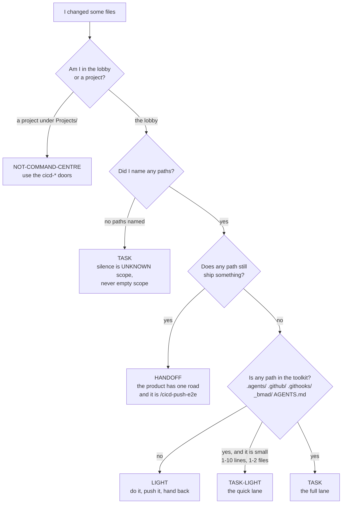
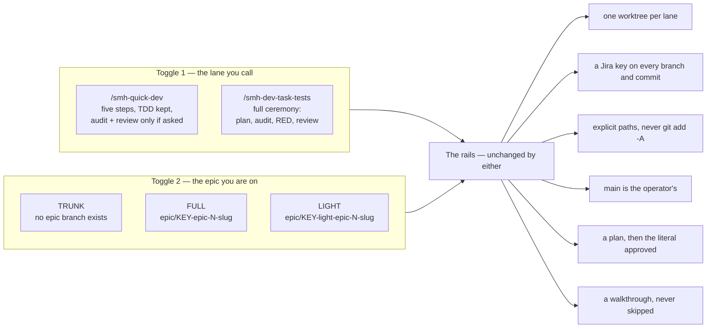
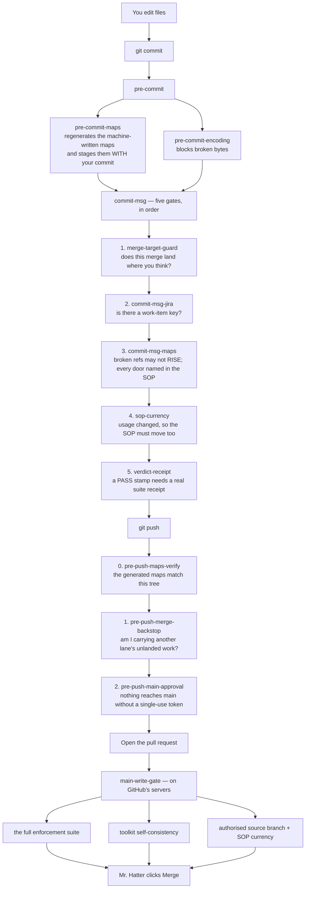
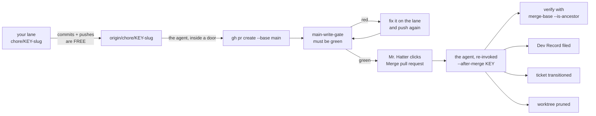
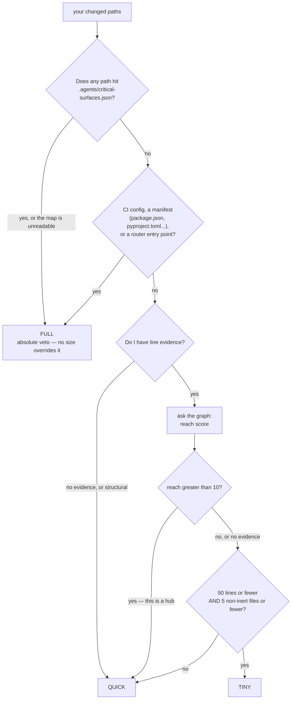
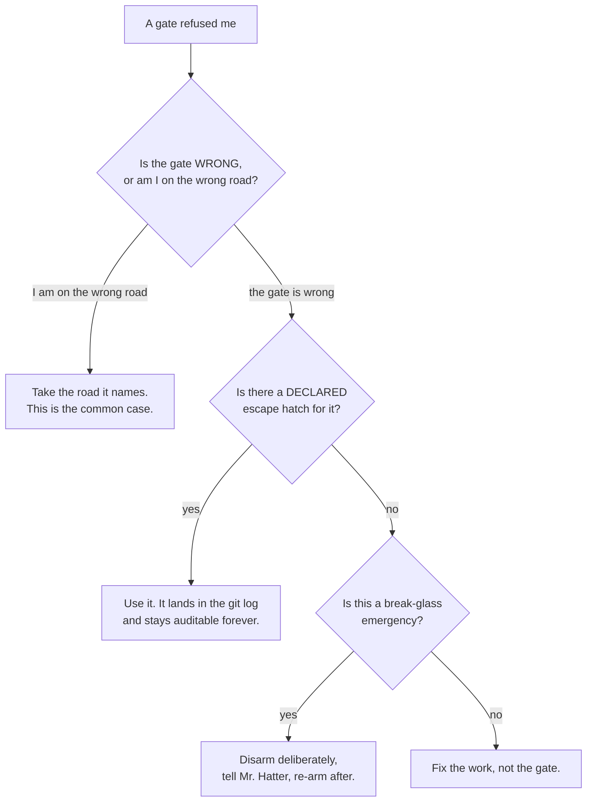

# The PR Push System — a user's guide

**What this page is for.** You changed some files. Something is going to refuse you, or nothing is,
and you want to know which before you find out the hard way. This page answers four questions:

1. **Which `/` command do I type?** — and what decides that, mechanically.
2. **What refuses me, and where does that refusal live?** — every gate, named, with its file.
3. **How do I override one that is wrong?** — every escape hatch, and what each one costs.
4. **What is the "blast radius" thing?** — the number is called **reach**, and this page explains
   where it comes from and what it changes.

**The one sentence underneath all of it:** `main` is never an agent's. Every landing is a pull
request Mr. Hatter merges, in every repo, always. Everything below is machinery in service of that
one rule — and machinery that tells you *early* when you are on the wrong road, instead of at the
merge button.

**Vocabulary, defined once**, because the rest of the page uses these words:

| Term | Five-word gloss |
|---|---|
| **the lobby** | this repo, the command centre |
| **a lane** | one branch, one worktree, one ticket |
| **a door** | a `/` command that ships something |
| **a gate** | code that can refuse you |
| **armed** | the gate blocks, not just warns |
| **reach** | how many files depend on yours |
| **ceremony** | how much plan/test/review is owed |

---

## 1. Start here — which door do I type?

Do not guess this. There is a script whose entire job is to answer it, and it exists precisely
because the previous version of this rule was prose and agents talked themselves past it.

```bash
python3 .agents/scripts/lane_qualify.py --repo "$(git rev-parse --show-toplevel)" \
  --paths <every path you will touch>
```

*(On the PC: `python`, not `python3`.)*

It prints a **bare word on line one** and the reason on line two. Read the word, not the exit
code — a piped gate reports the pipe's status, not the script's.



### The six verdicts, and the door each one names

| Verdict | What it means | What you type |
|---|---|---|
| `LIGHT` | nothing deployable, nothing in the toolkit | [`/smh-non-crit-pr-push`](../../.agents/commands/smh-non-crit-pr-push.md) |
| `LIGHT-VCS` | a **declared** git-hygiene action that edits no files | same door, with `--no-file-changes` |
| `TASK-LIGHT` | a small toolkit edit, off the critical surfaces | [`/smh-quick-dev`](../../.agents/commands/smh-quick-dev.md) |
| `TASK` | a toolkit change — this alters the development system | [`/smh-dev-task-tests`](../../.agents/commands/smh-dev-task-tests.md) |
| `HANDOFF` | a path that genuinely ships | [`/cicd-push-e2e`](../../.agents/commands/cicd-push-e2e.md) |
| `NOT-COMMAND-CENTRE` | you are standing in a project repo | [`/cicd-non-crit-pr-push`](../../.agents/commands/cicd-non-crit-pr-push.md) |

**Two of those verdicts are traps worth knowing about.**

*Silence is not smallness.* Naming no paths returns `TASK`, not `LIGHT`. "A check whose empty input
reads as a pass" is a named tripwire in the house audit, and the path list is the one input an agent
controls completely. The same rule applies to size: no `--lines` evidence means no `TASK-LIGHT`.

*A self-contradiction is never read the permissive way.* Declaring `--no-file-changes` **and** naming
paths returns `TASK`. You said two things that cannot both be true, so you get the strict reading.

### "Deployable" is narrower than it looks

Until recently the deployable test was a folder-prefix test and nothing else, which meant
`frontend/scripts/INDEX.md` — a markdown map file that ships nothing — was refused by the push door
while a *different* gate, `check_maps.py`, demanded that the file exist. One gate manufactured what
another refused.

Now `deployable_paths()` runs the folder test and then subtracts the **inert** part: paths nothing
reads when the system runs, and no gate reads as law. The declaration lives in
`<repo>/.agents/inert-paths.json`, and it is fenced so a lane cannot widen its way out of a gate:

- the list **cannot list itself**;
- nothing under a `public/` or `static/` folder is ever inert (those are served verbatim — a file
  there is on production);
- nothing under `.agents/rules/` or `.agents/commands/` is ever inert (that is the law);
- a malformed declaration means **nothing** is inert, never everything.

Markdown is not the test. `.agents/rules/*.md` *is* the law, and a project's runtime knowledge
documents are markdown the product genuinely reads.

---

## 2. The two toggles — and they never depend on each other

Two switches shape how work moves, and confusing them is the most common orientation mistake.

**The lane you call** is read from the command name. **The epic you are on** is read from the branch
name. Everything else is a rail that holds in every lane and every mode.



Ask git which mode a project is on — never guess, and never read a local branch:

```bash
python3 .agents/scripts/epic_mode.py --repo /abs/path/to/project
```

It prints the mode on line one and **what that costs you** on line two: where a story lands, which
checks run, when E2E runs. `TRUNK` means no `origin/epic/*` exists at all, so a story lands on `main`
by a PR — same road, same click, one branch shorter.

The `-light-epic-` substring after the key *is* the whole switch. The word "light" anywhere else in
the slug is not it.

---

## 3. What refuses you, and where it lives

There are three layers, and they guard different ground. None is a substitute for another.



### Layer 1 — the local git hooks

They are **POSIX `sh` with no Python and no interpreter probe**, deliberately. The predecessor to
this system was a set of Claude hooks wired as `powershell -Command "python ..."`, and the Mac has
neither binary: they exited 127, silently, every time, for weeks. Six merges reached `main` on one
sign-off because of it. A git hook is the only layer both machines, all four agent platforms and the
operator's own terminal share.

| Gate | Runs at | Refuses | Lives in |
|---|---|---|---|
| merge-target-guard | `commit-msg` | a merge landing on the wrong branch | `.agents/scripts/git-hooks/merge-target-guard.sh` |
| commit-msg-jira | `commit-msg` | a commit with no work-item key | `.agents/scripts/git-hooks/commit-msg-jira.sh` |
| commit-msg-maps | `commit-msg` | a rise in broken doc references; a door the SOP does not name | `.agents/scripts/git-hooks/commit-msg-maps.sh` |
| sop-currency | `commit-msg` | a usage-surface change with no SOP edit | `.agents/scripts/git-hooks/sop-currency.sh` |
| verdict-receipt | `commit-msg` | a `Verdict: PASS` stamp with no suite receipt | `.agents/scripts/git-hooks/verdict-receipt.sh` |
| pre-commit-maps | `pre-commit` | nothing — it *regenerates* and stages | `.agents/scripts/git-hooks/pre-commit-maps.sh` |
| pre-commit-encoding | `pre-commit` | broken bytes | `.agents/scripts/git-hooks/pre-commit-encoding.sh` |
| pre-push-maps-verify | `pre-push` | a push whose generated maps are stale | `.agents/scripts/git-hooks/pre-push-maps-verify.sh` |
| pre-push-merge-backstop | `pre-push` | a lane carrying another lane's unlanded commits | `.agents/scripts/git-hooks/pre-push-merge-backstop.sh` |
| pre-push-main-approval | `pre-push` | a push to `main` with no single-use token | `.agents/scripts/git-hooks/pre-push-main-approval.sh` |

**Why the merge guard runs from `commit-msg` and not from `pre-merge-commit`** — this was measured on
a real repo, not assumed, and the answer is counter-intuitive. `pre-merge-commit` runs *before* git
writes `MERGE_HEAD`, so it fires with no way to name what is being merged in, and every rule in the
branch model is a rule about a *pair*. Worse, on a conflicted merge it never fires at all, because
the commit is then made by `git commit`, not by `git merge`. `commit-msg` fires on both paths and has
`MERGE_HEAD` in both.

**Why there is a `pre-push` backstop as well** — a fast-forward merge creates no commit, so no
commit-time hook runs at all. What a ff merge cannot hide is the evidence it leaves: another lane's
unlanded commits are now contained in yours. That is the whole check.

### ⛔ A hook can be silently OFF five different ways

`core.hooksPath` is local config that git **never** carries in a clone. A fresh clone has every gate
in this repo switched off, and nothing says so. Run this before you trust any green:

```bash
python3 .agents/scripts/hooks_armed.py
```

The five ways, each silent on its own:

1. **`core.hooksPath` unset** — the master switch. Git reads `.git/hooks`, which is empty.
2. **The inner script missing, or merely not executable** — every dispatcher ends with
   `[ -x "$SCRIPT" ] || exit 0`, so the hook exits 0 with no output at all.
3. **A `*-ENFORCE` marker absent** — the gate *warns* instead of rejecting, and hook output renders
   nowhere the operator looks. A warning you never see is the same as no gate.
4. **An orphaned marker** — a tracked flag whose gate script is not tracked. The marker claims armed;
   the gate does not exist.
5. **The dispatcher itself untracked** — a flag arming a script reached through a hook no clone
   carries.

### Layer 2 — the preflights

These are not hooks. They are scripts a door runs and prints, and their contract is the same across
all three: **exit 0 clean, 1 warnings only, 2 blocking**, so a door can say "exit 2 → STOP" and mean it.

| Script | Called by | The question it answers |
|---|---|---|
| `.agents/scripts/task_preflight.py` | [`/smh-close-task-merge-tree`](../../.agents/commands/smh-close-task-merge-tree.md) | is this lobby lane fit to land? |
| `.agents/scripts/ship_preflight.py` | [`/cicd-push-e2e`](../../.agents/commands/cicd-push-e2e.md) | shape, intent, sync, lane — for the production door |
| `.agents/scripts/closeout_preflight.py` | [`/cicd-close-story-merge-tree`](../../.agents/commands/cicd-close-story-merge-tree.md) | is this story's record complete? |

`ship_preflight.py` exists because of a specific sequence: uncommitted changes sit in the epic
checkout, the gate runs on that dirty tree and comes back green, then the door merges the *branch*,
which does not contain those edits. **What shipped was never what was gated,** and nothing in the
door's 151 lines would have said so.

### Layer 3 — `main-write-gate`, on GitHub's servers

The local token gate lives on a machine and runs at `git push`. A merge performed on GitHub — the web
*Merge pull request* button, or the REST API — never touches a machine. The hook is not bypassed
there; it is **absent**. There is nothing to bypass.

The obvious fix, "restrict who may merge to `main`", cannot work here, and the reason is worth
reading twice: the agent merges **as the operator**. Same GitHub identity, not a bot account. So there
is no *who* to restrict — any rule that lets the operator through lets an autonomous agent through
with it. The only server-side discriminator left is a **required status check**.

⛔ `main-write-gate` is **not a port of the local hook**, and must never be described as one. They
guard different ground:

| | enforces | can it cross to a server? |
|---|---|---|
| local `pre-push-main-approval` | **authorisation** — one sign-off buys exactly one merge | **No.** The token lives under `.git/` and by design never leaves the machine |
| server `main-write-gate` | **fitness** — the real suite ran, the source branch is an authorised kind | Yes, and it is the half that was completely missing |

It runs in two modes. On a **pull request** GitHub builds the merge commit itself only *after* the
check passes, so there are no parents to inspect and the source branch *name* is all there is to
check — deliberately the weaker case. On a **`gate/**` push** the merge commit already exists, so its
*shape* is checked: `main` advances by exactly one merge commit sitting directly on the remote's
current tip.

**Draft PRs do not run it.** The job skips while a PR is a draft, and the trigger list carries
`ready_for_review` so the gate fires the moment you flip it. Those two are one change: a draft filter
without `ready_for_review` in the types makes a PR opened as a draft **permanently unmergeable**,
because the required context never reports.

---

## 4. The road to `main`



### The permission table — keyed on WHERE a write lands, never on the act

| Destination | Permission |
|---|---|
| your own `claude/*` story branch — commits **and** pushes | **FREE.** Loops and retries are fine |
| a `chore/*` branch — commits and pushes | **FREE.** The merge back to `main` is what is gated |
| an epic branch (`epic/*`) — a story landing | **Mr. Hatter's sign-off**, per action, never carried forward |
| `main` | **a pull request Mr. Hatter merges, in every repo** |

**One "approved" lands one story. The next needs its own.**

### The sign-off is a decision, and the click is how it reaches GitHub

The sign-off is given in exactly one of three ways: the word `approved`, or invoking
[`/smh-close-task-merge-tree`](../../.agents/commands/smh-close-task-merge-tree.md), or invoking
[`/cicd-push-e2e`](../../.agents/commands/cicd-push-e2e.md). **From that word on, every step is the
ceremony's and the agent runs it** — the PR, the `--after-merge` half, the Dev Record, the
transitions, the prune. So the merge never appears as an item in a walkthrough's `## Your Actions`,
and never as an open box.

⛔ **Why there is no token on this road, and why that is not a bypass.** The token proves the
operator said yes before *a machine here* pushes to `main`. A merge on GitHub runs on GitHub's
servers and never touches a machine here, so there is no push for a local hook to gate — the token is
**structurally absent**, not evaded. The click is the intent half; `main-write-gate` is the fitness
half. Both present, both required.

And the click is a **stronger** constraint on an agent than a sentence in a file. A *document* saying
the sign-off happened sits in an agent's context and still reads as valid on task six — which is
precisely how one invocation rode six merges. A click cannot be inferred from context, stretched from
an earlier turn, or performed by an agent that was never given the ability.

---

## 5. Blast radius — the code graph, and the number you could not name

The number is called **reach**: how many *other* files depend on the ones you changed. The tool that
produces it is `code-review-graph` — a local Tree-sitter + SQLite index of this repo. The thing that
consumes it is `ceremony_tier()` in `.agents/scripts/task_preflight.py`, which decides how much
review depth a change has earned.



### Four properties of this design worth understanding

**Every rule runs in ONE direction: toward more ceremony.** The critical-surface veto, the manifest
and CI checks, the entry-point exclusion and the reach veto can each force a tier *up*. Nothing in
the function can force one down. That is what makes the order safe to read.

**Entry points are excluded by NAME, before any score is consulted** — and this is the most important
rule in the tier. Reverse-dependency count is flatly *wrong* for entry points, and a naive
implementation ranks the riskiest files as the safest. Measured across 146 frontend components:
`app/layout.tsx` has reach **0** and wraps every screen in the app; `app/dashboard/page.tsx` has reach
**0** and is an entire user journey. Nothing imports a page — the router loads it.

**The cap of 10 was measured, not chosen.** Run over every tracked source file in both repos that
carry a graph, at the same depth the code queries:

| repo | files | measured | p50 | p75 | p90 | p95 | max |
|---|---|---|---|---|---|---|---|
| the lobby | 209 | 29 | 2 | 4 | 9 | 10 | 86 |
| AviationChat | 899 | 308 | 6 | 18 | 50 | 96 | 204 |

The knee — where the long tail starts — lands in the same place in both. Two thirds of every measured
file sits at 10 or under. So the cap sits *on* the knee: the veto fires for hubs and stays silent for
the files people actually edit.

**Absence of evidence lowers nothing.** `None` is not zero. Zero means "measured, and nothing depends
on it"; `None` means "not measured", and every arm that cannot produce a real number returns it — no
binary, no graph, a non-zero exit, output that is not JSON, a timeout. With no evidence the line caps
decide, which is exactly the behaviour with no graph at all, so no repo is ever weaker than it is now.

⛔ **The graph degrades; it never becomes a dependency.** It is machine-local, absent from a fresh
clone, absent from a new worktree, and stale the moment you commit. Eight of the ten repos in this
workspace have no graph, and a worktree never inherits its parent's. With no graph the tool prints
*"No graph found at …"* as plain text and exits **0** — so a returncode check alone would read that as
a successful measurement of zero. Only the JSON parse catches it.

**Freshness is checked against the graph's own stamp**, not a timestamp: the `git_head_sha` the
database recorded must equal `HEAD`. A graph one commit behind answers confidently about code that no
longer exists.

**And the base is a merge-base, never a branch name.** `--base main` is a two-dot diff: it includes
everything that landed on `main` since your lane started — measured at 104 files for a 12-file lane.
`git merge-base HEAD main` is your lane's own work. This is the single most expensive mistake
available here, because the wrong answer looks entirely normal.

### The related question: what *scope_check* asks

`ceremony_tier` asks *how much depends on this*. [`scope_check.py`](../../.agents/scripts/scope_check.py)
asks a different question: *is this one of the surfaces we agreed never to touch casually* — auth,
billing, security rules, FAA-facing answers, CI and the gates. The list is
`.agents/critical-surfaces.json`, and it is a **file, not a feeling, and not a size**.

An `OVERLAP` is a **soft stop**. The agent says what overlaps and why, and waits. Only Mr. Hatter's
word moves it, quoted into the plan as `Scope override (<date>): "…"`. **No agent override exists and
the script never asks.**

---

## 6. Overrides — every one, and what each costs



| Override | What it does | What it costs |
|---|---|---|
| `[sop-ok]` in the commit message | tells the SOP-currency gate "this genuinely does not change how the system is used" | one token, permanently in the git log, auditable forever |
| `Scope override (<date>): "…"` in the plan | moves a critical-surface `OVERLAP` | **only Mr. Hatter's word.** No agent override exists |
| delete a `*-ENFORCE` marker | the gate drops from BLOCK to WARN | **the warning renders nowhere you look.** Warn-only is close to off |
| create `.agents/scripts/git-hooks/DISABLE` | turns that whole gate family off | untracked, so it is per-machine and invisible to everyone else |
| `git commit --no-verify` / `git push --no-verify` | skips local hooks for one command | **it clears only the LOCAL hook.** GitHub still refuses `main` without the check |
| `--accept-unpushed-main` | lets `task_preflight` proceed when reads succeed but pushes die on the same uplink | downgrades a block to a warning, and says so in the report |
| disable the ruleset | the server-side twin of deleting `MAIN-PUSH-ENFORCE` | genuine break-glass: CI down, GitHub degraded, and `main` must move |

**The design principle behind every row: a gate with no legitimate exit gets `--no-verify`d into
oblivion, and then nothing is checked at all.** `[sop-ok]` exists so the honest case has a cheap,
visible answer. That is why it is one token in the commit message rather than a config file — it
cannot be set once and forgotten.

⛔ **`--no-verify` is the one that does least.** `main` is ruleset-protected on GitHub. Clearing the
local hook changes nothing about the required status check, and the branch-protection API will report
a 404 rather than admit the ruleset exists. If `main-write-gate` is red, the answer is to fix the
lane.

⛔ **There is deliberately no override for `HANDOFF`.** The product has one road to `main` and the
verdict says so in those words. This is the one refusal with no hatch at all.

---

## 7. One worked example, end to end

A docs change in the lobby — the most common thing that happens.

```bash
# 0. Which lane is this?
python3 .agents/scripts/lane_qualify.py --repo "$(git rev-parse --show-toplevel)" \
  --paths docs/_scc_sops_prds/git_walkthrough_settings.md
#   LIGHT
#   1 path(s), none deployable and none in the toolkit - do it, push it, hand back
```

`LIGHT` names [`/smh-non-crit-pr-push`](../../.agents/commands/smh-non-crit-pr-push.md), which runs
the standing lane: one ticket that never closes, one branch, straight to a PR.

```bash
# 1. The standing branch, cut fresh from main.
git fetch origin main
git checkout -B chore/SCC-186-standing-push origin/main

# 2. Stage EXPLICITLY. Never git add -A / . / -u — it sweeps other lanes' work.
git add docs/_scc_sops_prds/git_walkthrough_settings.md
git diff --cached --stat

# 3. Commit with the key. [sop-ok] because a doc edit changes no usage surface.
git commit -m "SCC-186 docs: git settings page [sop-ok]"

# 4. Push. --force-with-lease, because the standing branch is reset from main each time.
env -u GITHUB_TOKEN git push origin chore/SCC-186-standing-push --force-with-lease

# 5. Open the PR and STOP.
gh pr create --base main --head chore/SCC-186-standing-push \
  --title "SCC-186 docs: git settings page" --body "SCC-186: Routine non-critical update."

# 6. Watch the one check that matters.
gh pr checks <PR-number>
```

Then it is Mr. Hatter's click, and the agent's `--after-merge` half.

⛔ **Never a bare `gh pr create`.** With neither `--fill` nor a title it prompts, and an agent shell
has no TTY to answer — the command hangs.

⛔ **Open the PR on the FIRST push, even as a draft.** Both gates are `pull_request`-only, so a pushed
branch with no open PR runs **zero CI**. A draft PR runs nothing either, by design — but it exists,
and flipping it to ready fires the gate immediately.

---

## 8. Three refusals people try to route around, and why each one is right

**"The gate demands a file another gate forbids."** This was real, and it was fixed by narrowing the
*definition* rather than by adding an exception: `check_maps.py` requires an `INDEX.md` in every
level-2 folder, and the push door refused anything under a product folder. The fix was
`deployable_paths()` subtracting inert paths — one predicate, in one module, called by all four
doors. Nothing re-implements it, because two spellings of a rule is how gates start disagreeing.

**"The suite is red for a reason that is not mine."** Check whether it is red in a clean checkout of
`main` too. If the message is byte-identical there, it is not your lane's, and rewriting prose to
silence it is editing the finding instead of the finding's cause. Some checks are *inconclusive* on a
CI runner by design — where the remedy is genuinely unavailable, keyed on the environment variable
the platform **declares**, never inferred from the symptom.

**"The branch-delete guard will not let me clean up."** It refuses any `git branch -d` naming
something outside `chore/`, `claude/` or `epic/`, and it refuses the command if it carries a variable,
a substitution **or a redirect** — a `> out.txt 2>&1` tail parses as extra branch arguments. This
looks pedantic until you see why: every permission grammar here matches from the *left*, so a leading
`chore/` target satisfies the rule and everything after it rides free. Measured on real git:
`git branch -d worktree-agent-x main` deleted **both**.

---

## Related reading

| Page | What it covers |
|---|---|
| [`workflows_testing_SOP.md`](workflows_testing_SOP.md) | the full command menu and the safety net, script by script |
| [`operator_workflows_quickref.md`](operator_workflows_quickref.md) | the human flight manual and visual quick-reference |
| [`git_walkthrough_settings.md`](git_walkthrough_settings.md) | git configuration and the walkthrough contract |
| [`../../.agents/rules/git-policy.md`](../../.agents/rules/git-policy.md) | the law this page describes |
| [`../../.agents/rules/critical-surfaces.md`](../../.agents/rules/critical-surfaces.md) | what is on the list, and why |
| [`../../.agents/rules/tests-must-gate-for-real.md`](../../.agents/rules/tests-must-gate-for-real.md) | why a gate that reads like protection and is not is worse than no gate |
| [`../../.agents/scripts/INDEX.md`](../../.agents/scripts/INDEX.md) | every script named above, one line each |
