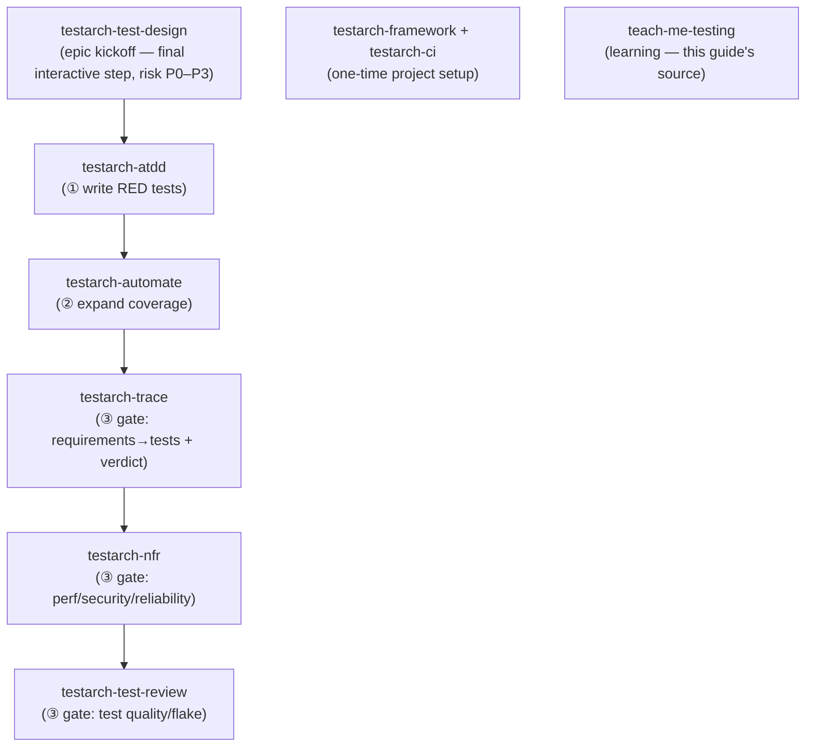
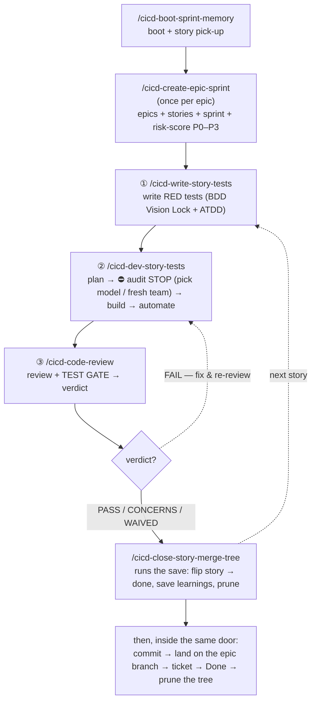
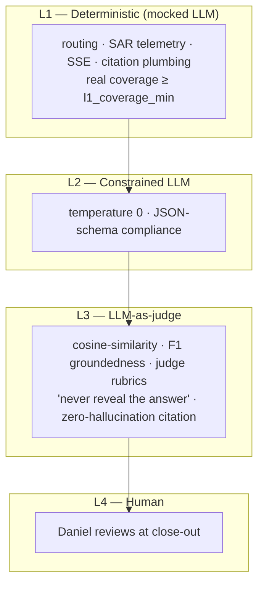

# TEA Deep Reference (companion — not the quick guide)

> **Read [workflows_testing_SOP.md](workflows_testing_SOP.md) first** — that is the clean quick
> reference. This file is the deep archive it was carved from (2026-07-14): full call-graphs, the
> method curriculum, the Epic-8 anchor index, and the 42-fragment TEA library. Kept for depth, not
> for daily use.
>
# TEA Testing — Quick Reference Guide

**Owner:** Daniel (Lead — Tech Lead / Engineering Manager)
**Source:** TEA Academy (Teach Me Testing, 7/7 sessions) + the `cicd-` dev-flow walkthrough, consolidated.
**Working anchor:** Epic 8 — Evolution Engine (`AGY_AVIATIONCHAT`)
**What this is:** the single page to keep open while writing tests, reviewing PRs, or running the dev loop. Two halves:
> **Part A — The Method** (TEA concepts: what to test, how much, what "good" means).
> **Part B — The Machine** (the `/` commands and the `cicd-` flow that execute the method).

---

## ⚡ The `/` command workflow — new epic → developed

The exact sequence, top to bottom, from a fresh epic to a shipped story. Run it from the **command center** (lobby); the leading token targets the child project (e.g. `AGY_AVIATIONCHAT`). **Phase A runs once per epic; Phase B repeats per story (P0 first).** Full detail in §11.

```
# ── Orient (start of every session) ───────────────────────────
/cicd-boot-sprint-memory <PROJECT>           # where am I? what's next? (read-only)

# ── Phase A · Epic kickoff — ONCE per epic ────────────────────
/cicd-create-epic-sprint <PROJECT> <requirements-source>
#   → epic + stories → sprint board → interactive P0–P3 risk-score (one story at a time)

# ── Phase B · Per-story loop — REPEAT per story, P0 first ──────
/cicd-write-story-tests    <story>   # ① BDD Vision Lock (MANDATORY, waiver-recorded) + ATDD red tests (must fail now; lock scenarios live IN the red files)
/cicd-dev-story-tests      <story>   # ② BDD gate → plan → ⛔ SELF-AUDIT STOP (you pick: model / fresh team / continue) → build to green → automate
/cicd-code-review          <story>   # ③ adversarial review + TEST GATE → PASS/CONCERNS/FAIL
/cicd-close-story-merge-tree <story> # close-out DOOR = your sign-off → runs the save (flip to done) → commits + lands on the epic branch
```

| # | Agile step | Command |
|---|------------|---------|
| — | Orient — where am I / what's next | `/cicd-boot-sprint-memory` |
| **1–2** | Epic + stories + sprint, then map test levels (P0–P3) | `/cicd-create-epic-sprint` |
| **3** | Write the failing test | `/cicd-write-story-tests` |
| **4–6** | Dev plan → self-audit → code the story | `/cicd-dev-story-tests` |
| **7** | Code review + run tests | `/cicd-code-review` |
| **8** | Close out + land on the epic branch + log learnings | `/cicd-close-story-merge-tree` |

> **P0 first.** The kickoff's Step 3 risk-scores every story with you; work the P0s through Phase B before P1/P2. Nothing is committed mid-story — the close-out door makes the one commit, then lands the story on its epic branch.

---

## 🔎 What each thin `/` command actually fires (the full call-graph)

Every `/cicd-*` you type is a **thin launcher**: the `.claude/skills/cicd-*/SKILL.md` just says "read `.agents/commands/cicd-*.md` and follow it end-to-end." That `.agents/commands/` file is the real script — it resolves the target project, then calls the underlying **BMAD + TEA skills** in order. Below is what's under the hood for each one, so you know exactly what's running when you fire a command.

> **Every command shares Step 0:** resolve the child project (`$ARGUMENTS` name → `.agents/active-project.txt` pointer → ask you), echo `Target: Projects/<name>`, and bind every path under it. Never touches the lobby. Omitted below to avoid repetition.

---

### `/cicd-boot-sprint-memory` — Orient (read-only, no sub-skills)
Doesn't call other commands — it just **reads state** and tells you what to run next.
```
1. active-context.md        → Sprint Objective · Stable (don't-touch) · Broken · In Play · Pitfalls
2. component-specs/          → Invariants of any in-scope spec
3. sprint-status.yaml        → story counts + the NEXT story to pick up + which cicd- step it needs
4. confirm guardrails        → G2 spec-compliance · G3 targeted-edits · G5 agent-authority · G6 get_db() · G8 research-first
                              → then STOPS. Discovery only — waits for your instruction.
```

### `/cicd-create-epic-sprint` — Phase A epic kickoff (calls 3 skills)
```
1. bmad-create-epics-and-stories   → writes the epic + its user stories with acceptance criteria (ACs)
2. bmad-sprint-planning            → lands those stories in sprint-status.yaml as `ready-for-dev`
3. bmad-testarch-test-design       → risk-analyzes (Risk = Probability × Impact), THEN…
   ⛔ INTERACTIVE HARD STOP        → as Murat (Test Architect), walks you through P0–P3 ONE story at a time
                                     (recommended P-level + why + what-it-is + levels-it-earns; you confirm/override each)
```

### `/cicd-write-story-tests` ① — story prep + red tests (calls 3 skills)
```
1. bmad-create-story    → writes the story file under _bmad/bmm/stories/ with its ACs
2. /cicd-bdd-tests      → BDD Vision Lock (MANDATORY): interactive w/ Murat until behaviors are 100% locked.
                          The locked Given/When/Then goes INTO the story's ATDD red test file(s) —
                          BDD-structured pytest scenarios (BE) / describe-it scaffolds (FE). A standalone
                          pytest-bdd .feature + step defs is OPT-IN ONLY (you choose it at the lock, when
                          Gherkin itself buys value — Epic 17 audit demoted it from default). Sole other
                          escape = a RECORDED waiver (no behavior surface, you confirm, frontmatter records
                          it). Either way the story leaves ① carrying `bdd: locked` (+ contract paths) or
                          `bdd: waived — <rationale>` in frontmatter, plus a dated decision block.
3. bmad-testarch-atdd   → writes the remaining unit/component acceptance tests that MUST FAIL now (red phase),
                          EXTENDING the same contract file(s) — one red file per story per stack
                          (pulls the test-design P-levels so P0 ACs get priority coverage)
                          → leaves tests staged & red. Does NOT implement.
```

### `/cicd-dev-story-tests` ② — build to green (calls bmad-dev-story twice + 2 skills)
```
0.5 resolve ARTIFACT_DIR              → _artifacts/epic_<E>/<story>/ (all artifacts land here)
0.7 BDD contract gate (HARD)          → story frontmatter must carry `bdd: locked` (+ every cited contract
                                        file ON DISK — a locked flag with missing files FAILS, the 17.7
                                        phantom lesson) or `bdd: waived — <rationale>`; NEITHER (incl.
                                        pre-gate stories) → STOP, run /cicd-bdd-tests first. No plan, no code.
1.  bmad-dev-story (PLAN mode)        → writes implementation_plan.md into ARTIFACT_DIR
2.  ⛔ SELF-AUDIT STOP GATE (MANDATORY)→ posts the plan link and STOPS. You pick:
                                        (a) run /cicd-self-audit here — name a model for the lane
                                            (e.g. "use Fable" on an easy story; subagent model override)
                                        (b) you take implementation_plan.md to a FRESH team/session — it waits
                                        (c) "continue" — resumes the remainder; no audit run/provided →
                                            it confirms once, then records the skip as a stub artifact
                                        → either way findings fold into the plan + self-audit-stress-test.md
2.5 conditional gate                 → only STOPS to ask if you have a real question; else proceeds
3.  bmad-dev-story (IMPLEMENT mode)   → writes the code, drives the ① red tests → GREEN, pastes actual test output
4.  bmad-testarch-automate            → expands API/UI/contract coverage on what was built (automation-summary-<story>.md)
5.  close-out artifacts (MANDATORY)   → implementation_plan.md · self-audit-stress-test.md · walkthrough.md
                                        → MAY flip story to `review`. NEVER flips to `done`, NEVER commits.
```

### `/cicd-self-audit` — adversarial pre-dev audit (fires inside ② at the STOP gate; no sub-skills, 5 phases)
Audits the **plan, not a diff** — catches flaws while fixing them is still free. ② stops before running it
so you choose the lane: run it in-session (optionally on a cheaper model for easy stories), or hand the
plan doc to a fresh team and say **continue** when their audit lands.
```
Phase 0  Right-size + AC traceability  → Skip / Light / Full; map every AC ↔ plan step (gap = under-deliver; extra = scope creep)
Phase 1  Blast-radius trace            → GitNexus impact()/context() if indexed, else grep — who breaks if this changes;
                                         contract two-sidedness (SSE/API/DB/signature); reinvention check
Phase 2  Over-engineering gate (STRICT)→ default NO-GO: new abstraction/flag/dep for N=1, "might need", clone-and-tweak → CUT
Phase 3  Pre-mortem scenarios          → happy · rehydration · error/timeout · concurrency · bad-auth · exhaustiveness · AI-hallucinated edge
Phase 4  Verdict                       → SAFE / NEEDS-REVISION / UNSAFE + Go/No-Go; bakes fixes inline into the plan
```

### `/cicd-code-review` ③ — review + TEST GATE (calls code-review-engine + the gate chain)
```
1. code-review-engine            → clean-room adversarial review of the diff (AI drift, over-eng, bloat, logic flaws);
                                    the command applies the actionable fixes + re-runs suites
2. gate opt-in check             → read _bmad-output/sudo-tests.yaml — ABSENT → verdict WAIVED (skip gate)
3. gate checks (baseline-diff, fail only on NEW regressions):
     • direct test execution         → pytest + vitest
     • bmad-testarch-trace           → requirements→tests traceability + coverage vs l1_coverage_min
     • bmad-testarch-nfr             → perf / security / reliability (when nfr:true or agent_bearing:true)
     • bmad-testarch-test-review     → quality/flake of the tests themselves
     • automate-evidence check       → confirms ②'s expansion pass left evidence (else caps at CONCERNS)
4. Verdict → PASS / CONCERNS / FAIL / WAIVED  → writes cicd-code-review-<story>.md (+ current git HEAD ref)
5. reflects the review back INTO walkthrough.md
                                    → NEVER commits, NEVER flips story status.
```

### `/cicd-close-story-merge-tree` — the close-out DOOR / sign-off (calls the save below)
Running this **IS your sign-off** for THIS story's landing — and it is spent by it; the next story needs its own
invocation. It never touches `main` (that stays `/cicd-push-e2e`'s).
```
0.  resolve project · sync the branch · preflight → one call, before the save reads the board
1.  /cicd-update-sprint-memory        → THE SAVE (below) — the board, the story file, the learnings
2.  commit the close-out edits        → explicit paths, on the story branch, so they ride the landing
3.  LAND: git push origin HEAD:epic/<KEY>-<slug>
                                      → the one sanctioned push. HEAD must be a claude/* branch inside the
                                        worktree, else STOP; a red merge gate lands nothing.
4.  Jira: Dev Record, THEN ticket → Done (+ clears any Bug flag)
                                      → only AFTER the push returns 0. The ticket write is REMOTE — it rides no
                                        branch, so nothing undoes it if a later step stops (SCC-210).
5.  /cicd-prune-worktree              → verify the landing, preserve stray work, unlink assets, remove tree + branches
```

### `/cicd-update-sprint-memory` — the session / story SAVE (no sub-skills, 6 steps)
The door's Step 1, still runnable standalone when all you want is the save. It lands nothing, moves no ticket and
prunes no worktree. Only objectively-red tests can block the flip.
```
1. read state + this session's artifacts (plan + walkthrough; lift ## Close-Out Handoff if present)
2. code-verify the work you just closed (grep the fix in the files it touched)
3. route each learning to 1 of 4 homes:
     app-wide rule → project-context.md · component gotcha → component-specs/ · open bug → active-context.md · cross-session fact → Claude memory
4. APPLY: flip story `review → done` (in story file + sprint-status.yaml)
     → ONLY a FAIL verdict (new red regression) blocks. PASS/CONCERNS/WAIVED/stale/missing all close it.
5. prune active-context.md (≈250-line cap; drop stale pitfalls & old completed tasks) — automatic, never asks
6. write validated Claude memories + ask you for any manual learnings
                                    → all FILE writes: they ride the story branch and land at the door's Step 3.
```

---

**One-liner dictionary of every underlying skill these call:**

| Underlying skill / command | What it does |
|----------------------------|--------------|
| `bmad-create-epics-and-stories` | Break a requirements source into an epic + user stories with ACs |
| `bmad-sprint-planning` | Generate/populate `sprint-status.yaml` from the epic's stories |
| `bmad-testarch-test-design` | Risk-score stories P0–P3 (Probability × Impact); the interactive kickoff step |
| `bmad-create-story` | Write ONE story file with its ACs under `_bmad/bmm/stories/` |
| `/cicd-bdd-tests` | Interactive BDD Vision Lock (MANDATORY phase of ①) → locked scenarios codified INTO the story's ATDD red files (standalone `pytest-bdd` `.feature` = opt-in only) or a recorded waiver; ② hard-gates on the frontmatter record + files-on-disk |
| `bmad-testarch-atdd` | Write **failing** (red) acceptance tests before any code |
| `bmad-dev-story` | The dev engine — PLAN mode writes the plan; IMPLEMENT mode writes code to green |
| `bmad-testarch-automate` | Expand coverage on existing code (passes immediately) |
| `code-review-engine` | Adversarial clean-room review of the diff (the house engine, SCC-116); the calling command applies the fixes |
| `bmad-testarch-trace` | Requirements→tests traceability matrix + coverage verdict |
| `bmad-testarch-nfr` | Audit non-functional evidence (perf / security / reliability) |
| `bmad-testarch-test-review` | Score the tests on the 5 quality dimensions |

---

Glossary / one-line cheat sheet

| Term | One line |
|------|----------|
| **TEA** | Method/playbook on top of your tools — makes expert testing repeatable |
| **P0–P3** | Risk priority = Probability × Impact; P0 = ship-blocker, P3 = cosmetic |
| **AAA** | Arrange → Act → Assert; the shape of every test |
| **DoD** | No flaky, no hard waits, stateless, self-cleaning, low-maintenance, near source |
| **ATDD** | Test-first (red → green); the failing test is the proof-of-test |
| **BDD Vision Lock** | Mandatory ① phase: interactive behavior lock w/ Murat → Given/When/Then codified into the story's ATDD red files (or **recorded** waiver) stamped in story frontmatter; ② refuses to dev without it. Standalone `pytest-bdd` is opt-in, not the default |
| **Automate** | Coverage expansion on existing code (passes immediately) |
| **Use-site patch** | Patch the name as the module-under-test looks it up — not the definition |
| **Factory** | `_make_event(...)` — defaults + overrides; one update point |
| **Trace gate** | Requirements → tests → GREEN/YELLOW/RED ship decision |
| **5 dimensions** | Determinism · Isolation · Assertions · Structure · Performance |
| **L1–L4** | Deterministic → Constrained LLM → LLM-judge → Human |
| **TEST GATE** | The opt-in, baseline-diff gate inside `/cicd-code-review` (③) |

---

# PART A — THE METHOD

## 0. The one-paragraph mental model

**TEA (Test Architecture Enterprise)** is a *method/playbook* layered on top of your existing tools (pytest, vitest, Playwright) — **not a replacement** for them. It is 9 workflows + a knowledge-fragment library + quality standards. The whole point is to make expert testing decisions *repeatable* so you don't have to be a testing expert to test well. Tests are **designed** before they're written, **maintained** like production code, and **allocated by risk** — not by line count.

> **The Lead reframe:** stop asking *"do we have enough tests?"* Ask *"do we have the **right** tests at the **right** priority levels, and are the P0 gates green?"*

**Engagement models (pick the entry point that matches team maturity):**
`Lite` (30-min quick start, immediate value) → `Solo` → `Integrated` → `Enterprise` → `Brownfield` (retrofit an existing untested codebase). Start at **Lite**; the same first move — `testarch-test-design` to risk-score P0–P3 — also bootstraps the Brownfield case.

---

## 0.5 TEA method — the quick-reference card

Everything the method asks of you, on one screen. Keep this open; drop into §1–§8 only when you need the prose, code, or Epic 8 examples behind a line. (§16 is the even-terser one-line glossary.)

**The reframe** — stop asking *"do we have enough tests?"* Ask *"do we have the **right** tests at the **right** priority, and are the P0 gates green?"*

**What TEA is** — a *method/playbook* on top of your runners (pytest, vitest, Playwright), **not** a replacement: 9 workflows + a 42-fragment knowledge library + quality standards that make expert testing decisions repeatable. Adopt at the entry point matching team maturity: `Lite` (30-min) → `Solo` → `Integrated` → `Enterprise` → `Brownfield` (retrofit). **Start at Lite.**

**The move (run on any feature / PR / module) — §1**
```
1. What can break?   → list the decisions the code makes (defaults · auth · transforms · ordering · privacy flags)
2. What P-level?     → Risk = Probability × Impact
3. Start at P0, work down.   100% P0 FIRST · 100% total is NEVER the goal.
```
A test exists to **guard a decision that would hurt if it silently broke.** No hurt → probably no test.

**Risk → priority → allocation — §2**

`Risk = Probability × Impact` · **Probability** = how likely to fail (rendering → logic → auth/privacy) · **Impact** = damage if it does (cosmetic → workaround → data-loss/security).

| P-level | Meaning | Levels it earns | Coverage |
|---------|---------|-----------------|:--------:|
| **P0 — Critical** | business fails if broken (privacy default, tenancy wall, auth) | Unit + Integration + E2E + Manual | **100%** |
| **P1 — High** | major user pain / core workflow | Unit + Integration + E2E | **80%** |
| **P2 — Medium** | inconvenience, workaround exists | Integration + Manual | **50%** |
| **P3 — Low** | minimal / cosmetic | Manual / skip | **20%** |

**Test levels (the pyramid) — §3** · spread a P0 across all three, cheapest/most-isolated first.

| Level | Covers | Speed |
|-------|--------|-------|
| **Unit** | isolated function/class, no deps | ms |
| **Integration** | multiple components / DB / service | medium |
| **E2E** | full workflow, real HTTP / browser | slow |

**Definition of Done — a "good" test — §4** · the ceiling, not just "tests pass":
`no flaky` · `no hard waits/sleeps` (react to state) · `stateless & parallelizable` · `self-cleaning` (finally) · `low-maintenance` (no brittle selectors) · `near the source` (mirrored tree).

**Test shape — AAA — §5** · **Arrange → Act → Assert.** One test guards one decision that matters.

**Patterns that matter — §6**
- **Fixture composition** — setup/teardown once, compose by deps, cleanup in `finally` (runs even on crash).
- **Mock-first / network-first** — set the mock up **before** the action (kills races).
- **⚠️ Use-site patch** — patch where the module-under-test *looks the name up* (import site), not where it's defined. The #1 Python mock bug.
- **Data factory** — `_make_event(...)`: defaults + overrides → one update point per schema change.
- **Step-file architecture** — self-contained JIT-loaded micro-files, progress tracked externally, resumable.

**TDD mode — know which you're asking for — §7**

| | **ATDD** (test-first) | **Automate** (coverage expansion) |
|-|-----------------------|-----------------------------------|
| Order | Test → Code (Red → Green) | Code → Test (passes immediately) |
| Use case | new feature, TDD discipline | brownfield gap / regression debt |

Red-green loop: **Red** (failing test) → **Green** (minimal code) → **Refactor** (stays green) → **Repeat**.

**Quality & gate — §8**
- **Test Review — 5 dimensions** (0–100 each, avg = overall): **Determinism · Isolation · Assertions · Structure · Performance.**
- **Trace gate:** load AC → discover tests → map → analyze gaps → verdict. 🟢 all P0/P1 covered → **ship** · 🟡 P1 gaps → **Lead assesses** · 🔴 any P0 gap → **do NOT ship**.
- **Metrics — track vs. vanity:** ✅ P0/P1 coverage %, flakiness, exec time, determinism. ❌ total line coverage, test count, file count.
- **"How much is enough?"** = enough to hold every P0/P1 gate GREEN.

---

## 1. "Where do I start?" — the decision tree

This is the answer to the most common beginner question. Run it on any feature, PR, or untested module.

```
1. What can break here?
   └─ List the decisions the code makes:
      defaults · auth checks · data transforms · ordering · privacy flags

2. What's the P-level of each decision?
   └─ Risk = Probability × Impact   (see §2)

3. Start at P0, work down.
   └─ 100% P0 coverage FIRST.  100% total coverage is NEVER the goal.
```

A test exists to **guard a decision that would hurt if it silently broke.** If breaking it wouldn't hurt, you probably don't need the test.

**Epic 8 example:** `GradingEvent.consent.export_eligible` defaults to `False`. If that silently flipped to `True`, student data becomes export-eligible without consent → a privacy breach. That's a P0 decision → it gets a dedicated test. Start there, not with the tooltip.

---

## 2. Risk Matrix — P0–P3 (the allocation engine)

**Risk = Probability × Impact.** Score each, prioritize where the product is highest.

| Dimension | Low | Medium | High |
|-----------|-----|--------|------|
| **Probability** (how likely to fail) | simple rendering | normal business logic | auth, privacy, complex transforms |
| **Impact** (what happens if it fails) | cosmetic only | user inconvenience, workaround exists | data loss, security, business failure |

| Priority | Meaning | Epic 8 examples |
|----------|---------|-----------------|
| **P0 — Critical** | Business fails if broken | `consent.export_eligible` default (privacy); tenancy wall (`test_tenancy_gate.py`); auth token validation |
| **P1 — High** | Major user pain, core workflows | grading event emitted on checkride; admin role claims enforced |
| **P2 — Medium** | Inconvenience, workaround exists | dataset pagination; graph overlays |
| **P3 — Low** | Minimal/cosmetic impact | tooltip animations, hover states |

**Test Priorities Matrix — which levels each P-level earns:**

| Priority | Unit | Integration | E2E | Manual | Coverage target |
|----------|:----:|:-----------:|:---:|:------:|:---------------:|
| **P0** | ✅ | ✅ | ✅ | ✅ | **100%** |
| **P1** | ✅ | ✅ | ✅ | — | **80%** |
| **P2** | — | ✅ | — | ✅ | **50%** |
| **P3** | — | — | — | ✅ | **20%** |

> **Lead code-review language:** *"What P-level is the decision this test pins?"* A PR with 0% P0 and 100% P3 coverage is a red flag regardless of line count.

---

## 3. Test Levels — the coverage pyramid

| Level | Covers | Speed | Epic 8 example |
|-------|--------|-------|----------------|
| **Unit** | isolated function/class; no external deps | ms | `test_grading_event.py` — schema defaults |
| **Integration** | multiple components; DB/service interaction | medium | `test_grading_event_writer.py` — writer + `mock_db` |
| **E2E** | full user workflow; real HTTP/browser stack | slow | `test_grading_event_dataset_api.py` — full HTTP via `TestClient` |

The P0 grading event is covered at **all three levels by design** — that's deliberate allocation, not accident:

```
P0: GradingEvent consent.export_eligible
├── Unit:        test_grading_event.py            ← schema defaults, no deps
├── Integration: test_grading_event_writer.py     ← write path, mock_db
└── E2E:         test_grading_event_dataset_api    ← full HTTP, admin governance
```

**Testability order:** test what's isolated first (schema), build up to full-stack (API). If a unit test needs no infra, it comes first.

---

## 4. Definition of Done — what a "good test" actually is

The **ceiling**, not just the floor of "tests pass":

1. **No flaky tests** — deterministic pass/fail. Re-running to see if it "clears" is a *bug*, not a workaround.
2. **No hard waits/sleeps** — `waitFor(condition)` not `sleep(5000)`. React to state; never guess timing.
3. **Stateless & parallelizable** — each test sets up and tears down its own world (the `get_db()` patch pattern in conftest is the reference impl).
4. **Self-cleaning** — tests delete/deactivate what they create; no manual DB resets.
5. **Low maintenance** — avoid brittle selectors; set state via APIs, not UI clicks.
6. **Near the source** — `grading_event.py` → `tests/.../test_grading_event.py` in a mirrored tree.

---

## 5. Test anatomy — Arrange → Act → Assert

Every test has the same shape. A test guards **one decision that matters.**

```python
def test_minimal_construct_defaults(self):
    # ARRANGE + ACT — construct the object
    event = GradingEvent(
        input=GradingEventInput(),
        label=GradingEventLabel(verdict="pass"),
        provenance=GradingEventProvenance(
            grader_name="checkride", served_model="gemini-3.5-flash", origin="exam"
        ),
    )
    # ASSERT — pin the decisions that would hurt if they broke
    assert event.event_id and len(event.event_id) == 32
    assert event.consent.export_eligible is False      # ← the P0 privacy guard
    assert event.consent.consent_status == "unknown"
```

---

## 6. Architecture & Patterns

### 6.1 Fixture composition
Define setup/teardown once, name it, compose by declaring dependencies. DRY + auto-cleanup even on crash + isolation (fresh instance per test).

```python
@pytest.fixture
def client_and_svc():
    import backend.routers.admin_auth as admin_auth_mod
    svc = AdminAuthService()
    admin_auth_mod._admin_auth_service = svc
    client = TestClient(app)
    try:
        yield client, svc
    finally:                                  # ← cleanup runs even if the test crashes
        admin_auth_mod._admin_auth_service = None
```
*Review Q:* "Is this setup duplicated, or centralized in a fixture? Does cleanup happen in `finally`?"

### 6.2 Mock-first / network-first
Set up the mock/intercept **before** triggering the action. Eliminates race conditions — the mock must exist before the code runs.

### 6.3 ⚠️ Patch at the import/use site, NOT the definition site
**The single most common Python mock bug.** Patch the name *as the module under test looks it up*, not where it's defined.

```python
# ❌ WRONG — definition site; the router's local name still points to the real function
patch("backend.services.grading_event_governance.query_grading_events")

# ✅ RIGHT — use site; the router resolves THIS name at call time
GOV_QUERY = "backend.routers.admin_governance.query_grading_events"
patch(GOV_QUERY)
```
*Review Q:* "Does this patch target the import site in the module under test, not the definition module?"

### 6.4 Data factories
Factory function with sensible defaults + keyword overrides → one update point when the schema changes.

```python
def _make_event(*, origin="teaching", grader="socratic", verdict="pass", ...) -> GradingEvent:
    return GradingEvent(...)

event      = _make_event()                 # all defaults
exam_event = _make_event(origin="exam")    # override only what matters
```
*Design smell:* if `_make_event()` needs 40 lines to build a "minimal" valid object, the **schema** is over-complicated.

### 6.5 Step-file architecture
Break complex workflows into micro-files: self-contained, loaded just-in-time, state tracked in a progress file, resumable from any point. (This very guide's TEA workflows run on it.) **Test analogy:** each test file = a self-contained step; fixtures = JIT setup; CI status = progress tracking; `-k`/`.only` = resume from any test.

---

## 7. TDD — ATDD vs. Automate

**The red phase is proof-of-test:** a test that passes *before* the code exists proves nothing.

| | **ATDD** (test-first) | **Automate** (coverage expansion) |
|-|----------------------|-----------------------------------|
| Order | Test → Code | Code → Test |
| Phase | Red → Green | Tests pass immediately |
| Use case | new feature, TDD discipline | brownfield coverage debt, gap-filling |
| Risk if skipped | implementation drift | unknown regressions |

**The red-green loop:** `Red` (write failing test) → `Green` (minimal code to pass) → `Refactor` (clean up, tests stay green) → `Repeat`. *Minimal means minimal* — let tests drive scope.

**Epic 8 live example (ATDD):** `test_faa_grounding_guard.py` was written (red) before `agents/specialist/agent.py` was wired up (green) — the FAA Grounding Guard story (TEA-4).

> **Lead frame:** know which mode you're asking your team for. "Write a failing test that drives the implementation" (ATDD) ≠ "we have working code, add coverage" (Automate). Different conversations, different success criteria.

---

## 7.5 BDD (Behavior-Driven Development) — the Vision Lock, right-sized

The **Vision Lock conversation** (① `/cicd-bdd-tests`) is the mandatory part: an interactive session that
pins exact `Given-When-Then` behaviors before any code. The **artifact** rides the story's ATDD red test
file(s) — BDD-structured pytest scenarios (BE) / `describe("Given …")`-`it("When … Then …")` (FE) — one
red file per story per stack.

**Epic 17 audit verdict (2026-07-13, the recalibration):** across 8 locked stories, the demonstrated value
came from the lock *session* (17.7 caught a stale story premise + 2 live defects; 17.8 caught dataset
drift + forced schema decisions), while the parallel standalone `pytest-bdd` layer mostly re-confirmed
already-correct behavior (3 stories closed "no changes — correct as-is"), added its own harness-bug class
(sync steps driving async fns → `asyncio.run` false-reds), and produced one phantom gate pass (17.7's
`bdd: locked` with all contract files deleted). **So: conversation kept mandatory; standalone `pytest-bdd`
demoted to opt-in.**

* **Default contract:** locked scenarios written into the story's ATDD red test file(s); ② drives them green.
* **Opt-in `pytest-bdd`** (`.feature` + `test_*_steps.py`, `@given/@when/@then`, shared `ctx` fixture):
  choose it at the lock only when Gherkin itself buys value — stakeholder-readable specs, heavy data-table
  scenarios, cross-team contracts. Gotcha when you do: sync step fns driving `async def` seams must use
  `asyncio.run(...)` (Py 3.12+).
* **Gate integrity:** `bdd_contract:` paths are load-bearing — ② verifies each exists on disk; renames/
  deletes must update the frontmatter.

**Value the lock keeps delivering:** living specs (drift → red), decision records in the story file, and
safety-gate invariants (cycle caps, mandatory reasons) — now pinned in the same red files ATDD owns.

---

## 8. Quality & Trace — auditing and the release gate

### 8.1 Test Review — 5 dimensions (0–100 each; overall = average)

| Dimension | Asks | Red flag |
|-----------|------|----------|
| **Determinism** | passes/fails consistently? | re-running to see if it "clears" |
| **Isolation** | runs independently? | passes alone, breaks in parallel |
| **Assertions** | checks are meaningful? | `assert resp is not None` (trivially true) |
| **Structure** | readable & organized? | 200-line test, no fixture composition |
| **Performance** | fast enough for feedback? | 45-min CI devs skip |

> A low **Isolation** score with everything else high is usually an *architecture* problem — shared fixture state or a missing `finally` cleanup.

### 8.2 Trace — requirements → tests → release gate

`Load acceptance criteria → Discover tests → Map criteria → Analyze gaps → Gate decision`

| Gate | Condition | Action |
|------|-----------|--------|
| 🟢 GREEN | all P0/P1 AC covered; gaps are P2/P3 | ship |
| 🟡 YELLOW | some P1 gaps | Lead assesses risk |
| 🔴 RED | **any P0 gap** | do NOT ship |

**Epic 8:** `test_tenancy_gate.py` is a Trace artifact — the tenancy wall (`scoped_user_query`) is a P0 AC ("no cross-school data leakage"). Delete it → Trace returns RED. That's why it's a CI merge-blocker.

### 8.3 Metrics — track vs. vanity

| ✅ Track (risk-based) | ❌ Vanity (misleading) |
|----------------------|------------------------|
| P0/P1 coverage % | total line coverage % |
| flakiness rate | number of tests |
| test execution time | test file count |
| determinism score | — |

> **"How much is enough?"** = *enough to hold every P0/P1 gate GREEN.* Line coverage tells you nothing; gate color tells you everything.

---

# PART B — THE MACHINE

## 9. The 9 TEA workflows & when each fires



| Workflow | Fires | Job |
|----------|-------|-----|
| **test-design** | epic kickoff — final interactive step of `/cicd-create-epic-sprint` | risk-score the epic's work P0–P3 **with Daniel, one story at a time** → tells ① which ACs deserve the heaviest tests |
| **atdd** | ① per story | write acceptance tests that MUST fail now (red) |
| **automate** | ② per story | expand API / UI / contract coverage on existing code |
| **trace** | ③ gate | map requirements → tests, coverage vs. floor, GREEN/YELLOW/RED verdict |
| **nfr** (nfr-assess) | ③ gate (if NFR/agent-bearing) | audit perf / security / reliability evidence |
| **test-review** | ③ gate | flake & quality audit of the tests themselves |
| **framework** | one-time | initialize the test bench (Playwright/Cypress/pytest) |
| **ci** | one-time | scaffold the CI/CD quality pipeline & gates |
| **teach-me-testing** | on demand | the TEA Academy (what produced this guide) |

---

## 10. Slash-command reference (`/` commands)

### TEA Test Architect — the persona
| Command | Does |
|---------|------|
| `/tea` | Activate **Murat**, the Master Test Architect & Quality Advisor — quality, NFR & test-strategy consult. Pass intent inline for direct dispatch. |

### TEA workflow commands (the 8 raw workflows)
| Command | Description |
|---------|-------------|
| `/testarch-test-design` | Create system-level or epic-level test plan (risk P0–P3). |
| `/testarch-framework` | Initialize test framework (Playwright/Cypress). |
| `/testarch-ci` | Scaffold CI/CD quality pipeline. |
| `/testarch-atdd` | ATDD — write **failing** acceptance tests before implementation. |
| `/testarch-automate` | Expand test automation coverage for existing code. |
| `/testarch-trace` | Generate traceability matrix + coverage analysis. |
| `/testarch-nfr` | Audit NFR evidence for performance, security, reliability. |
| `/testarch-test-review` | Review test quality against best practices (5 dimensions). |

### Learning
| Command | Does |
|---------|------|
| `/bmad-teach-me-testing` | The TEA Academy — 7 self-paced sessions. (Re-run Session 7 anytime to explore the 42 knowledge fragments.) |

### The `cicd-` dev-flow orchestrators (human lane — thin wrappers that call the TEA workflows in order)
| Command | One-line job |
|---------|--------------|
| `/cicd-boot-sprint-memory` | Where am I? What story is next? Which command do I run? (read-only) |
| `/cicd-create-epic-sprint` | **Phase A / epic kickoff** — write the epic + stories → sprint board → interactive P0–P3 risk-score (one story at a time). |
| `/cicd-write-story-tests` | ① Create the story → **BDD Vision Lock (mandatory)** → write its **failing** acceptance tests (lock scenarios + ATDD reds share one file per stack). |
| `/cicd-bdd-tests` | ①-inner (also standalone) — interactive Vision Lock w/ Murat → scenarios codified into the ATDD red files (standalone pytest-bdd opt-in only) or a **recorded** waiver, stamped into story frontmatter. |
| `/cicd-dev-story-tests` | ② **BDD contract gate (hard)** → plan → **⛔ self-audit STOP gate** (you pick: run here w/ chosen model · fresh team · continue) → build → drive tests green → automate. |
| `/cicd-self-audit` | Adversarial pre-dev audit of the plan (fires inside ② at the STOP gate — or standalone by a fresh team on the plan doc). |
| `/cicd-code-review` | ③ Review the diff + run the **TEST GATE** → PASS/CONCERNS/FAIL/WAIVED. |
| `/cicd-close-story-merge-tree` | **The close-out door** — preflight → the save below → commit → **land the story on its epic branch** → Dev Record + ticket → `Done` → prune the tree. Typing it IS the sign-off for that landing, and it never touches `main`. |
| `/cicd-update-sprint-memory` | The save the door runs at its Step 1 (standalone too): verify verdict, flip story → `done`, route learnings, prune context. |
| `*_AP` variants | Autopilot lanes (`cicd-dev-story-tests-AP`, `cicd-code-review-AP`, `cicd-self-audit-AP`) — same ideas, different engine. `dev_AP` plan-stage enforces the BDD gate too: contract-or-waiver missing → `PIPELINE_BLOCKER` (headless lanes never author the lock themselves). |

### Supporting test commands
| Command | Does |
|---------|------|
| `/cicd-live-testing-team` | Live / manual QA lane. |

### Ops drill command — outside the per-story loop
Not part of the ①②③ dev flow — a standalone **incident-response drill** (Epic 16). Fire it any time to
exercise the production triage runbook; it never touches the sprint board.

| Command | Does |
|---------|------|
| `/sentry-security-team-avch [issue-id\|latest]` | **Drill harness** (16.1) for the Sentry incident-triage runbook (`.github/claude/incident-triage.md`). Thin — carries no triage logic: resolves the project → loads its runbook → runs it verbatim (**interactive lane**, Sentry MCP) → drops an `incident-report.md` under `_artifacts/debugging/`. **Drill:** force a P1 (`_test_scripts/sentry_smoke_test.py`) then run `/sentry-security-team-avch latest`; a pass = the report names the planted failure, the right file, and a sane fix. The runbook is the product; this is only its test rig. Full picture: [security/sentry_error_response_team.md](sentry_error_response_team.md). |

#### The incident lane's **E2E test** — the headless dispatch (read this if the last line confused you)

There are **two** ways to test the incident system, and they cover **opposite halves.** The command above
(`/sentry-security-team-avch`) tests the *triage brain* in a chat window. The **headless E2E dispatch** tests
the *production wiring* — the real GitHub Actions lane, end to end. It's "E2E" in the truest §3 sense: the
**full workflow over the real stack** (Actions runner → real HTTP → Telegram), not a mocked slice.

| | `/sentry-security-team-avch` — interactive drill | **Headless E2E dispatch** — the real lane |
|---|---|---|
| **Lane** | an interactive Claude chat session | the real **GitHub Actions** runner (`.github/workflows/incident-response.yml`) |
| **What it proves** | the runbook finds the right cause · file · fix | CI secrets/auth · fix-branch push · **the Telegram pager** — the whole chain fires |
| **Output** | `incident-report.md` in `_artifacts/debugging/` | a **real GitHub issue** + fix branch + a **page to your phone** |
| **How it fires** | `/sentry-security-team-avch latest` | a hand-crafted `repository_dispatch` (`gh api repos/<owner>/<repo>/dispatches -f event_type=incident …`) |
| **Built-in command?** | ✅ yes | ❌ **no** — manual dispatch, or wait for a real Sentry fatal |

**Why you need both (the 2026-07-14 lesson).** A Telegram-paging bug lived *only* in the headless lane's
shell script — a parse error in a step that **only runs on a real dispatch**. Everything was green
everywhere (unit tests, the interactive drill, the PR gate), yet the first real incident paged a **false
"🛑 LANE FAILED"** while the report was actually fine. The interactive drill *could never* catch it — it
doesn't run the Actions bash or the pager. Only a headless E2E dispatch exercises that surface.

**When to fire the headless E2E dispatch** (the tips):
- **After ANY edit to `.github/workflows/incident-response.yml`** — *especially* the bash paging steps. Nothing else runs them; they execute only on a real dispatch. **This is the big one.**
- After changing the runbook, when you want to see *headless* behavior (no Sentry MCP — REST-only).
- To confirm the CI secrets/auth are still wired (`SENTRY_AUTH_TOKEN`, Workload Identity, `TELEGRAM_BOT_TOKEN`).
- As a periodic **fire drill** — simple proof the pager still reaches your phone.

**How to ask for it:** just say *"fire an incident drill"* / *"live-fire the incident lane"* / *"test the
pager end-to-end."* Claude crafts the dispatch (against a real issue or a synthetic one), watches it go
green, confirms the page landed, and cleans up any throwaway issue/branch after.

> **Gap worth closing:** there's no one-word command for the headless E2E yet — it's a hand-crafted
> `repository_dispatch`. Adding a `workflow_dispatch:` trigger to the workflow would let you fire it from the
> GitHub Actions UI / `gh workflow run` with no payload-crafting, and a `bash -n` syntax-gate on the page
> steps would catch the parse-error class in CI before it ever ships.

---

## 11. The `cicd-` dev flow — the human-driven story loop

The `cicd-` commands are **thin orchestrators** — they don't reimplement anything; they *call* the BMAD + TEA workflows in the right order and bake a **test gate** into review.

**Two phases, eight steps.** An **epic kickoff** runs once; the **per-story loop** repeats:

| # | Step | Command |
|---|------|---------|
| — | Orient (where am I / what's next) | `/cicd-boot-sprint-memory` |
| **1** | Epic + stories + sprint | `/cicd-create-epic-sprint` |
| **2** | Map test levels (P0–P3) | ↳ its final interactive step |
| **3** | Write failing test | `/cicd-write-story-tests` |
| **4** | Dev implementation plan | `/cicd-dev-story-tests` → plan |
| **5** | ⛔ STOP → self-audit stress test | `/cicd-dev-story-tests` → you pick lane/model (or fresh team), then audit |
| **6** | Code the story (on "continue") | `/cicd-dev-story-tests` → build + automate |
| **7** | Code review + run tests | `/cicd-code-review` |
| **8** | Close out + land on the epic branch + log learnings | `/cicd-close-story-merge-tree` |

Steps 1–2 are the once-per-epic kickoff; 3–8 repeat per story.



| Step | Command | Calls (TEA workflows) |
|------|---------|------------------------|
| boot | `cicd-boot-sprint-memory` | — (reads active-context + sprint-status, recommends next command) |
| kickoff | `cicd-create-epic-sprint` | `bmad-create-epics-and-stories` → `bmad-sprint-planning` → `bmad-testarch-test-design` (interactive P0–P3, one story at a time) |
| ① | `cicd-write-story-tests` | `bmad-create-story` → `/cicd-bdd-tests` (BDD Vision Lock, **mandatory** — contract or recorded waiver) → `testarch-atdd` |
| ② | `cicd-dev-story-tests` | **BDD contract gate** → `bmad-dev-story` (plan) → **⛔ STOP** → `cicd-self-audit` (chosen lane/model, or fresh team) → `bmad-dev-story` (implement) → `testarch-automate` |
| ③ | `cicd-code-review` | `code-review-engine` → `/1_run-all-tests-back_front` → `testarch-trace` → `testarch-nfr` → `testarch-test-review` |
| close | `cicd-update-sprint-memory` | — (reads ③'s verdict; still the only command that flips a story to `done` — you reach it by typing `cicd-close-story-merge-tree`, which runs it as its Step 1, then lands the story) |

> **Epic kickoff (once per epic):** `/cicd-create-epic-sprint` bundles this — it ends with an interactive `testarch-test-design` pass where you risk-score every story P0–P3 one at a time. Same first move to retrofit an untested codebase.

### The TEST GATE (the heart of ③)
Opt-in and baseline-diff aware: a project with no `_bmad-output/sudo-tests.yaml` baseline **auto-WAIVED** (never blocks a test-less project); legacy red is grandfathered — only **NEW** regressions fail.

```yaml
# _bmad-output/sudo-tests.yaml  (per project that turns the gate on)
required_tiers: [L1, L2, L3]   # which pyramid tiers must be present
l1_coverage_min: 85            # deterministic branch/line coverage floor
agent_bearing: true            # story touches agent behavior → L3 judge required
nfr: false                     # also run the NFR audit
waive: false                   # hard override (force WAIVED)
```

| Verdict | Means |
|---------|-------|
| **PASS** | all required tiers green |
| **CONCERNS** | soft issues only |
| **FAIL** | NEW regression OR a required tier missing |
| **WAIVED** | no baseline (gate off) |

> Close-out (`cicd-close-story-merge-tree` and the `cicd-update-sprint-memory` save it runs) only *reads* the verdict — it never re-runs tests. ③ is the only place a ship/no-ship decision is made.

---

## 12. The testing pyramid — L1–L4 (which tier each station exercises)

Deterministic code gets real coverage; generative LLM output gets **soft assertions**, never string-matching.



| Tier | Written / run by | When |
|------|------------------|------|
| L1 deterministic | `testarch-atdd` (①) + `testarch-automate` (②); run by `/1_run-all-tests-back_front` (③) | every story |
| L2 constrained | `testarch-automate` (②); checked in the gate (③) | every story |
| L3 judge | authored via `atdd`/`automate`; scored in `testarch-trace` / `nfr` (③) | agent-bearing stories |
| L4 human | `cicd-close-story-merge-tree` close-out + live-test gate | close-out |

---

## 13. Lead code-review checklist (consolidated)

Print this. It's the whole curriculum compressed into the questions you ask on a PR.

**Risk & coverage**
- [ ] What P-level is each new decision, and does coverage match the matrix (P0 = all 3 levels; P3 = manual/skip)?
- [ ] Is there 100% P0 coverage? (Not "is line coverage high?")
- [ ] Would removing any of these tests leave a P0 gate RED?

**Test quality (the 5 dimensions)**
- [ ] Deterministic — no flaky tests, no `sleep()`/hard waits?
- [ ] Isolated — stateless, parallelizable, self-cleaning (`finally`)?
- [ ] Meaningful assertions — pins a real decision, fails for the right reason?
- [ ] Readable structure — setup centralized in fixtures, data built via factories?
- [ ] Fast enough that the team won't skip the suite?

**Patterns**
- [ ] Mocks patch the **import/use site** in the module under test, not the definition module?
- [ ] Mock set up **before** the action (mock-first)?
- [ ] Test lives near its source in the mirrored tree?

**Mode**
- [ ] New feature: was there a **failing** test before the implementation (ATDD red phase)?
- [ ] Coverage work: do new tests pass immediately (Automate)?

---

## 14. Epic 8 anchor index (verified real files)

| File | Level | Teaches |
|------|-------|---------|
| [test_grading_event.py](../../Projects/AGY_AVIATIONCHAT/backend/tests/schemas/test_grading_event.py) | Unit | AAA shape; P0 privacy default `consent.export_eligible is False`; scores high on all 5 review dimensions |
| [test_grading_event_writer.py](../../Projects/AGY_AVIATIONCHAT/backend/tests/services/test_grading_event_writer.py) | Integration | `mock_db` + `writer(mock_db)` fixture composition; `_make_event()` factory |
| [test_grading_event_dataset_api.py](../../Projects/AGY_AVIATIONCHAT/backend/tests/routers/test_grading_event_dataset_api.py) | E2E | `client_and_svc` fixture (auto-cleanup); `GOV_QUERY` **use-site** patch; `TestClient` API pattern |
| [test_tenancy_gate.py](../../Projects/AGY_AVIATIONCHAT/backend/tests/routers/test_tenancy_gate.py) | E2E | P0 Trace artifact; CI merge-blocker; RED gate if removed |
| [test_faa_grounding_guard.py](../../Projects/AGY_AVIATIONCHAT/backend/tests/agents/specialist/test_faa_grounding_guard.py) | — | Live ATDD example (TEA-4): test written red before `agent.py` green |
| [firestore.rules.test.js](../../Projects/AGY_AVIATIONCHAT/firebase/tests/firestore.rules.test.js) | Integration (emulator) | Security-rules testing (TEA-12): `@firebase/rules-unit-testing` `assertFails`/`assertSucceeds` deny/allow matrix against the real Firestore emulator; **local-only, out of the PR gate** (needs Java 17 — set `JAVA_HOME` per shell); non-vacuity via the emulator's own `PERMISSION_DENIED` logs |

> Paths in this section are relative to this guide's location. Inside the project repo, they are `backend/tests/...` (or `firebase/tests/...` for the rules suite).

---

## 15. TEA knowledge-fragment library (42 fragments)

Session 7 is a returnable reference. Re-run `/bmad-teach-me-testing` → Session 7 to deep-dive any fragment. Highest-value for a Lead: **Configuration & Governance** and **Quality Frameworks**.

**1. Testing Patterns (9)**
`fixture-architecture` · `fixtures-composition` · `network-first` · `data-factories` · `component-tdd` · `api-testing-patterns` · `test-healing-patterns` · `selector-resilience` · `timing-debugging`

**2. Playwright Utils (19)**
`overview` · `api-request` · `network-recorder` · `intercept-network-call` · `recurse` · `log` · `file-utils` · `burn-in` · `network-error-monitor` · `contract-testing` · `pactjs-utils-overview` · `pactjs-utils-consumer-helpers` · `pactjs-utils-provider-verifier` · `pactjs-utils-request-filter` · `pact-mcp` · `pact-consumer-framework-setup` · `pact-consumer-di` · `playwright-cli` · `visual-debugging`

**3. Configuration & Governance (6)**
`playwright-config` · `ci-burn-in` · `selective-testing` · `feature-flags` · `risk-governance` · `adr-quality-readiness-checklist`

**4. Quality Frameworks (5)**
`test-quality` · `test-levels-framework` · `test-priorities-matrix` · `probability-impact` · `nfr-criteria`

**5. Authentication & Security (3)**
`email-auth` · `auth-session` · `error-handling`

---

## Reference links

**TEA documentation**
- Overview: https://bmad-code-org.github.io/bmad-method-test-architecture-enterprise/
- Testing as Engineering: …/explanation/testing-as-engineering/
- Risk-Based Testing: …/explanation/risk-based-testing/
- Test Quality Standards: …/explanation/test-quality-standards/
- Fixture Architecture: …/explanation/fixture-architecture/
- Network-First Patterns: …/explanation/network-first-patterns/
- Step-File Architecture: …/explanation/step-file-architecture/
- Workflows — Test Design / ATDD / Automate / Test Review / Trace: …/how-to/workflows/run-<name>/
- Knowledge base (42 fragments): https://github.com/bmad-code-org/bmad-method-test-architecture-enterprise/tree/main/src/agents/bmad-tea/resources/knowledge

**Local companions**
- TEA Academy session notes + certificate: `Projects/AGY_AVIATIONCHAT/_bmad-output/test-artifacts/tea-academy/Daniel/`
- Master command set: `.agents/commands/INDEX.md`
- Autopilot (`_AP`) lanes: `autopilot_bmad_dev_loop.md`
- Artifact/persistence model: `.agents/rules/artifacts-always-first.md`

---

*Generated from TEA Academy (7/7 complete) + the `cicd-` TEA-gated dev-flow walkthrough. The `cicd-` commands are thin orchestrators over the TEA workflows; the gate in ③ is the only ship/no-ship decision point.*

<!-- CHECKPOINT id="ckpt_mrefjgkp_cqegiw" time="2026-07-10T04:22:41.833Z" note="auto" fixes=0 questions=0 highlights=0 sections="" -->

<!-- CHECKPOINT id="ckpt_mriqhjgy_wmr0ic" time="2026-07-13T04:40:12.754Z" note="auto" fixes=0 questions=0 highlights=0 sections="" -->

<!-- CHECKPOINT id="ckpt_mrjgfu74_t98jtq" time="2026-07-13T16:46:43.360Z" note="auto" fixes=0 questions=0 highlights=0 sections="" -->

<!-- CHECKPOINT id="ckpt_mrkl96fs_1zkvkj" time="2026-07-14T11:49:16.888Z" note="auto" fixes=0 questions=0 highlights=0 sections="" -->
