# The Sudo Dev System

> **How we build software here, and what you type to do it.** Current as of **2026-08-11**.
>
> This page is kept current by a gate, not by good intentions. Change a `/` command, a rule, a
> safety-net script, or a commit hook, and the commit is **rejected** unless this file moves with it
> (`[sop-ok]` in the message opts out and is logged). The law:
> [`sop-currency.md`](../../.agents/rules/sop-currency.md).

---

## How to read this page

This page has **two reading levels**, and knowing which one you're in saves you an hour.

| Level | What it looks like | Who it's for |
|---|---|---|
| **The spine** | Numbered sections, diagrams, tables, short paragraphs. | Everyone. Read it start to finish once and you can operate the system. |
| **The asides** | Blocks that begin `ⓘ **Why it works this way**`. | Skip them on your first read. Every one records a real failure that produced the rule above it — they are the review surface, and the reason nothing here is arbitrary. |

**Three ways in, depending on why you're here:**

- **Never seen this system?** Read Parts I and II (about fifteen minutes), then stop. That's enough
  to follow along. Come back for Part III when something refuses to run.
- **Need to type something right now?** Jump to [Start here](#start-here) below.
- **Reviewing or changing the system itself?** Read the asides. They carry the incident history that
  each rule exists to prevent, and they're where a proposed change gets argued.

**A promise about vocabulary:** every term gets defined the first time it appears. You should not
need to know git plumbing to run this system. [§2](#2-nine-words-that-unlock-everything) is the
glossary if a word gets away from you.

---

## Where you are standing

You're in the **command center** (also called the lobby). It has no sprint of its own — it holds the
shared toolkit and drives the child projects under `Projects/`.

**One home, since 2026-08-07.** Every shared rule, `/` command, skill, workflow, and the BMAD
machinery lives here and *only* here. Nothing is copied into a project any more. A project carries
just its own law — its `rules/`, its `skills/`, and the `.agents/INDEX.md` that routes them — plus
the enforcement that has to sit in the repo to work at all (its git hooks and its `jira.conf`).

Two consequences worth holding: **you edit a shared rule in exactly one place and every project has
it instantly**, and **binding a project means reading its `.agents/INDEX.md` first**, because that
file is now the only thing that tells you what's local to it.

| | |
|---|---|
| What runs next | the [SCC Jira board](https://sudo-command.atlassian.net/jira/software/projects/SCC/boards/2) — sprint view ([§12](#12-the-board--what-runs-next)) |
| The shared toolkit — the only copy | [`.agents/`](../../.agents/) — commands, rules, skills, workflows, scripts |
| What a project owns vs. what it reads from here | [`project-law.md`](../../.agents/rules/project-law.md) |
| Long-form depth | [`INDEX.md`](INDEX.md) |
| Projects this **lints** | the [maintained list](../../.agents/maintained-projects.txt) — AGY_AVIATIONCHAT · NEXgen-VR-Director. It is a lint worklist, **not** a sync target: nothing is pushed into a project. |

AGY_AVIATIONCHAT keeps its own copy of this page, localized in the header block,
[§12](#12-the-board--what-runs-next) and [§17](#17-where-the-depth-lives). **The body is meant to be
identical** — if the two disagree, this one is canonical.

---

## Start here

**I want to…**

| …do this | → run / read |
|---|---|
| know what to work on | **put the card in `To Do Next` on the board — that column *is* the answer** ([§12](#12-the-board--what-runs-next)). On a project: `/cicd-boot-sprint-memory`. In the command centre: just ask. |
| see or move the sprint board | ask any agent — the live board answers via `acli` ([§12](#12-the-board--what-runs-next)) |
| work out which lane my work belongs in | [§5 — the lane chooser](#5-which-lane-am-i-in) |
| start the next story | ① `/cicd-write-story-tests <id>` |
| build a story that has failing tests waiting | ② `/cicd-dev-story-tests <id>` |
| review code that's written | ③ `/cicd-code-review <id>` |
| land a story that passed review | `/cicd-update-sprint-memory` ([§7](#7-landing-and-shipping--the-close-out-family)) |
| land every lane of one epic at once | `/cicd-merge-epic-workingtrees <epic>` ([§7](#7-landing-and-shipping--the-close-out-family)) |
| fix something small in a project | `/cicd-quick-dev <slug>` — **low-risk work only** ([§8](#8-the-fast-lane--cicd-quick-dev)) |
| **build** a Task — a command, a rule, a gate, the docs | `/smh-quick-dev <KEY>` → `/smh-code-review` → `/smh-close-task-merge-tree` ([§9](#9-the-task-lane--work-on-the-system-itself)) |
| know whether a review still counts | [§11 — the decision tree](#11-is-this-review-still-valid) |
| ship to production | `/cicd-push-e2e` ([§7](#7-landing-and-shipping--the-close-out-family)) |
| switch machines | `/cicd-park` before, `/cicd-resume` after ([§13](#13-switching-machines)) |
| chase a production error | `/cicd-mobile-error-team` ([§16](#16-incidents)) |
| brainstorm or solve hard problems | `/smh-adviser-board` |
| free up a heavy session | `/cicd-prune-context` |
| **change the system itself** | edit it in `.agents/` (the only copy), then **update this page in the same commit** — a gate enforces it ([§10](#10-the-safety-net--what-checks-your-work)) |

### ⭐ `To Do Next` — the column that answers "what's next?"

**Drag a card into `To Do Next` and every agent picks it up from there.** No file to edit, no command
to run — the column *is* the instruction. Ask any agent "what's next?", or boot a session, and the
answer walks three ranks and stops at the first one holding anything:

**`In Progress`** (finish what's started) → **`To Do Next`** (what *you* chose) → **`To Do`** (the
backlog). `Blocking` is reported separately as an impediment and is **never** offered as something to
start.

- **On a project, this beats the sprint file.** `/cicd-boot-sprint-memory` normally computes the next
  story from `sprint-status.yaml` — but that file lags *by design*, since only close-out writes it. A
  card you placed by hand outranks a stale computed guess. If the two disagree the agent reports both
  and leads with yours.
- **The column is per board, and adding it is the whole install.** Only SCC has it today. Create the
  column in the Jira UI on any other board and it starts working there immediately. A board without
  it is silently skipped, not an error.

⛔ **`_my_resources/open_tasks/todo_list.md` is retired as an agent source** (2026-08-09). Keep it as
personal notes if you like; agents no longer read it, and it is never quoted as "what's next".

---

## Contents

**Part I — The model** (read this first)
[1 What this system is](#1-what-this-system-is) ·
[2 Nine words](#2-nine-words-that-unlock-everything) ·
[3 The two laws](#3-the-two-laws-above-every-command) ·
[4 The lifecycle map](#4-the-lifecycle-map)

**Part II — Choosing a lane**
[5 Which lane am I in?](#5-which-lane-am-i-in)

**Part III — The lanes**
[6 The story lane](#6-the-story-lane) ·
[7 Landing and shipping](#7-landing-and-shipping--the-close-out-family) ·
[8 The fast lane](#8-the-fast-lane--cicd-quick-dev) ·
[9 The Task lane](#9-the-task-lane--work-on-the-system-itself)

**Part IV — The machinery**
[10 The safety net](#10-the-safety-net--what-checks-your-work) ·
[11 Is this review still valid?](#11-is-this-review-still-valid) ·
[12 The board](#12-the-board--what-runs-next)

**Part V — Operations**
[13 Switching machines](#13-switching-machines) ·
[14 How we test](#14-how-we-test) ·
[15 The autopilot lane](#15-the-autopilot-lane) ·
[16 Incidents](#16-incidents)

**Part VI — Reference**
[17 Where the depth lives](#17-where-the-depth-lives)

---
---

# Part I — The model

*Four short sections. After these you'll understand every command in the system without having read
any of them.*

## 1. What this system is

**In one paragraph:** work arrives as a **story** or a **Task**. Either way it gets its own isolated
copy of the repo, a plan you personally approve, tests written before the code, an adversarial review
by an agent that never saw the work being built, and a machine gate that refuses to let it land if
any of that is missing. Nothing reaches production without you typing a specific command that means
*"I am signing off on this one merge."*

The whole system exists to make **four claims impossible to fake**:

| The claim | What makes it un-fakeable |
|---|---|
| "The tests pass" | A gate script *runs* the tests and records the real exit code. There is no way to hand it a result. |
| "It was reviewed" | The verdict is stamped with the exact code version it examined. Change the code and the verdict expires by itself. |
| "It merged" | The close-out asks git, not the agent. |
| "This ticket is done" | Only you can mark a story done, and the only way to say it is to run the close-out command. |

Everything else on this page is a consequence of those four.

## 2. Nine words that unlock everything

Read this once. The rest of the page assumes it.

| Word | What it means here | Why you care |
|---|---|---|
| **Story** | Sprint work with a number (`19.2`), a story file, a BMAD epic above it and a row on `sprint-status.yaml`. | It runs the ①②③ loop and closes one specific way. |
| **Task** | Everything else you actually spend days on: the toolkit, rules, `/` commands, docs, IDE work. No story file, no epic. | It has its **own** loop and its **own** close-out. Confusing the two is the single most common mistake. |
| **Lane** | One unit of work in flight, with its own branch and its own folder on disk. | Several run at once. Most of the safety rules exist because of that. |
| **Worktree** | A second, separate checkout of the same repo, on its own branch, in its own folder. Looks like `.claude/worktrees/<slug>/`. | Two lanes can't corrupt each other's files or test runs. **Every lane that will commit gets one.** |
| **Epic branch** | `epic/<JIRA-KEY>-<slug>`. Short-lived. Stories land here, not on `main`. | This is the thing that makes "landed" different from "shipped." |
| **`main`** | The only long-lived branch. On a project with CI/CD, a push to it **is** a deploy. | One command reaches it for product work; one other reaches it for Task work. Nothing else. |
| **Gate** | A check that can refuse. Some are scripts you run; two are git hooks that fire on every commit. | A gate that only warns is a gate nobody obeys — see [§10](#10-the-safety-net--what-checks-your-work). |
| **Verdict** | The line `Verdict: PASS \| CONCERNS \| FAIL \| WAIVED @ <sha>` written into the walkthrough by a review. | The close-out reads this line before it will land anything. The `@ <sha>` is what makes it expire. |
| **Close-out** | The command that *finishes* a piece of work: flips its status, records what was learned, moves its ticket, lands the code. **Typing it is your signature.** | There is exactly one close-out per kind of work. [§7](#7-landing-and-shipping--the-close-out-family) is the whole map. |

Two more you'll see constantly:

- **Artifact** — the documents a piece of work leaves behind. There are only ever **two**: the
  **plan** (`implementation_plan.md`) and the **walkthrough** (`walkthrough.md`). Audits get appended
  into the plan; reviews get appended into the walkthrough. If you're hunting for what an audit or a
  review said, it's inside one of those two, never a separate file.
- **Preflight** — a script that answers, mechanically, every "is this actually safe?" question a
  close-out used to answer by hand. **Exit 2 means blocked.**

## 3. The two laws above every command

Everything else is downstream of these.

### Law 1 — Plan first. Nothing is touched until you type `approved`.

No agent touches a project file until you type the literal word **`approved`** on an
`implementation_plan.md`. "ok" / "looks good" / "continue" are deliberately **not** approval — the
gate only means something if it's one specific word.
(→ [`000-PLAN-FIRST-GATE`](../../.agents/rules/000-PLAN-FIRST-GATE.md))

**Four more things that are explicitly not approval**, all of which had been misread as such:

1. **Clicking an option an agent wrote for you** — that answers *which*, never *whether*.
2. **Telling it to do the work** ("go build X", "finish Y") — being told to build something is the
   *reason* to write a plan, not permission to skip one.
3. **Answering its clarifying question.**
4. **Correcting its plan** — a correction narrows the plan, and the agent must stop and wait *again*.

> ⓘ **Why it works this way.** The gate kept leaking, and it was hardened on 2026-08-09. Agents are
> now forbidden from putting the word "approved" in a button label, because that is how the gate was
> actually bypassed: the agent wrote the word, you clicked it, and it read its own word back as your
> consent.

### Law 2 — You alone mark work `done`.

Agents may set a story to `review`. Only you set `done`, and **the way you say it is to run the
close-out command**. There is nothing else to sign — no separate approval step, no second
confirmation. Invoking the close-out *is* the signature.

### And one rule the machines hold so you don't have to

Every branch and every commit carries the repo's **Jira ticket key**
(`epic/AVCH-13-ppl-curriculum`, not `epic/ppl-curriculum`). An armed git hook refuses a keyless
commit outright — which is what keeps every ticket's Development panel honest without anyone
remembering to link anything ([§10](#10-the-safety-net--what-checks-your-work),
[§12](#12-the-board--what-runs-next)).

## 4. The lifecycle map

*Every command in the system and what hands off to what. Solid lines are the main road; dotted lines
are the on-ramps.*

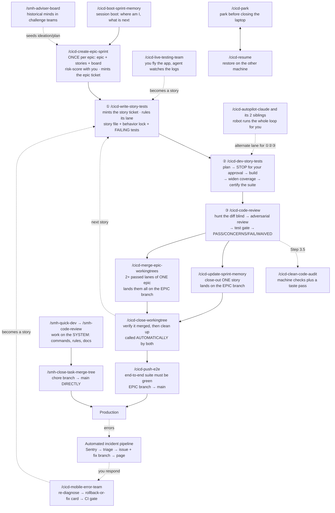

**The one thing to take from this map:** there are **two roads to production**, and they never
cross. Product work goes story → epic branch → `/cicd-push-e2e` → `main`. System work goes
chore branch → `/smh-close-task-merge-tree` → `main`. Which road you're on is decided in §5, and a
machine check enforces it so you can't get it wrong by accident.

---
---

# Part II — Choosing a lane

## 5. Which lane am I in?

**Answer this before you type anything.** It decides every command that follows, and it's the one
question the system will not answer for you at the end.

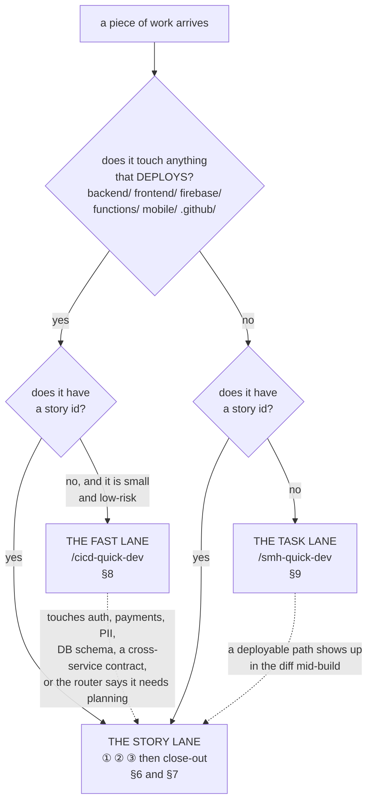

**Read the arrows, they matter more than the boxes.** Both dotted lines are **ejects** — tripwires
that fire mid-build and send the work back to the full loop. You do not get to argue with either one:

- The fast lane ejects on **risk, not size**. Login, permissions, payments, user data, DB schema, or
  a cross-service contract goes to the full loop no matter how small the change looks.
- The Task lane ejects the moment a **deployable path** appears in the diff. That is a product
  change whatever the ticket says, and the product has exactly one road to `main`. **There is no
  override flag, deliberately** — see [`task_preflight.py`](#the-checks-and-what-each-one-refuses).

### The three lanes side by side

| | Story lane | Fast lane | Task lane |
|---|---|---|---|
| **For** | sprint features, bug stories | a small project fix, a docs/config change | the toolkit, rules, `/` commands, gates, docs |
| **Build with** | ① `/cicd-write-story-tests` → ② `/cicd-dev-story-tests` | `/cicd-quick-dev` | `/smh-quick-dev` |
| **Review with** | ③ `/cicd-code-review` | built into `/cicd-quick-dev` Step 3 | `/smh-code-review` |
| **Branch** | `claude/<KEY>-<slug>`, off the epic branch | same, or `chore/<KEY>-<slug>` off `main` if ad-hoc | `chore/<KEY>-<slug>`, off `main` |
| **Close with** | `/cicd-update-sprint-memory` (or `/cicd-merge-epic-workingtrees`) | **it does not close** — hands back to you | `/smh-close-task-merge-tree` |
| **Code lands on** | the epic branch → `main` via `/cicd-push-e2e` | epic branch, via close-out | `main`, directly |
| **Story file?** | yes | only on the story lane; never on the ad-hoc lane | no |

> ⓘ **Why the Task lane exists at all (2026-08-10, SCC-78).** Everything in the story lane is
> *BMAD-paired*: it needs a story file, a sprint board, an epic branch and a `review`→`done` flip,
> and it is barred from acting on the command centre at all. But a lot of real work is exactly that —
> move thirteen documents and rewrite thirty-two references, extend a commit gate, add a command to
> four platform menus. That work had **no story and no ceremony to hang it on**, and until SCC-78 the
> only thing it had was a close-out. You could *land* a Task properly; there was no defined way to
> *build* one. On SCC-74 that showed: the audit command had to be invoked knowing it did not apply.
>
> The prefix carries the permission and it is not cosmetic. Every `/cicd-*` command binds a rule
> saying *"operate on exactly one project — never the command centre."* Toolkit work lives **in** the
> command centre, so it needs the `smh-*` family, which is the one allowed to act on the repo you are
> standing in.

---
---

# Part III — The lanes

## 6. The story lane

Three commands — ①, ② and ③ — in order, each leaving behind what the next one needs.

*The same three steps as the map, but showing what each one leaves behind. The documents on the
right are how the next step knows what happened — they are the system's memory.*

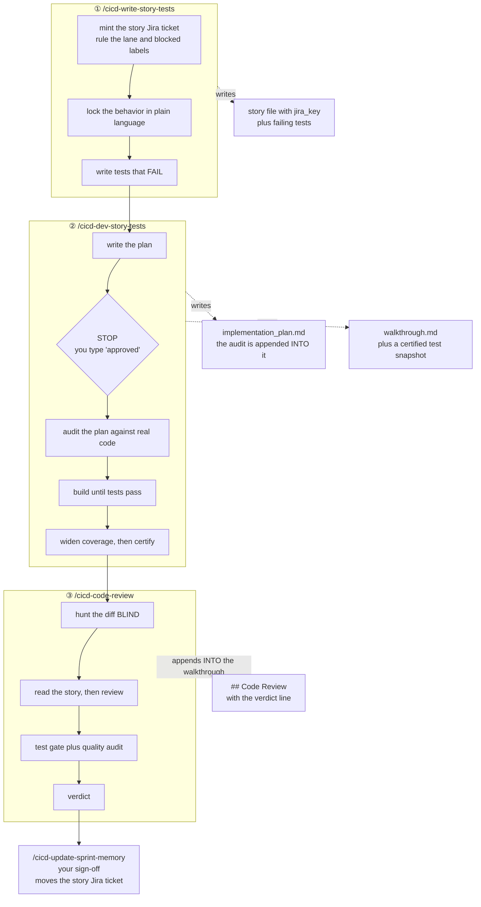

**Two documents, not ten.** Everything a story produces lives in exactly two files: the **plan** (the
pre-build audit gets appended into it) and the **walkthrough** (the review gets appended into it).

> ⓘ **Dense, not short — and no size limit (changed 2026-08-08, SCC-51).** Those two docs used to
> carry hard byte caps (8 KB / 10 KB). They are gone. The caps were set the same day the **audit**
> began appending into the plan, which quietly made it a two-author document — so the only way to
> stay under the cap was for the second author, the auditor, to cut findings. A plan that grew
> because the audit found eight real things is working correctly. **Length is never a reason to drop
> a finding, an acceptance criterion, or evidence.** What survives is the reason the caps existed:
> these files are re-read on every pass of the loop, so every line has to earn it — cut restatement
> and filler, never substance, and never split into a third file.

### Before the loop: `/cicd-create-epic-sprint` (once per epic)

Writes the epic and its stories, generates the sprint board, then risk-scores every story with you
P0–P3. That score decides how much testing each story earns ([§14](#14-how-we-test)). It mints the
epic's **Jira ticket** itself at kickoff — never an invented key: it reads the key from the ticket it
just created, and the branch is never cut unkeyed.

### ⭐ `/cicd-parallel-check <EPIC-KEY>` — run it once the stories are written

Tells you which stories you can run **side by side**. It reads every story file, works out what each
will actually *change* (as opposed to merely mention), and hands you the biggest group that touches
no file in common — tagged `parallel-ok` on the board so the group is one filter away.

**It never guesses.** A story with no file written yet gets "write the story first", not an opinion.
When two stories are ambiguous it locks them rather than approving — a wrong green puts two lanes on
the same file, a wrong lock only costs you running them one after the other. **The answer has a shelf
life and says so:** it stamps which stories it compared, so if you write another one afterwards the
old answer reads *"re-run me"* instead of quietly lying. **It only ever tells you — it never starts
anything.**

> ⓘ **Why it is its own command (2026-08-09, SCC-56).** ① used to decide this when it minted each
> ticket, and it could never have been right — it rules story 19.1 before 19.2 has even been written,
> so there is nothing to compare against, and it never looks again. Parallel-safety is a fact about a
> **group at a moment**, not about one story. A boolean also cannot express *"safe after AVCH-34"*.
> Proof it never worked: *zero* tickets ever carried the label.

### ① `/cicd-write-story-tests` — create the story, write the failing tests

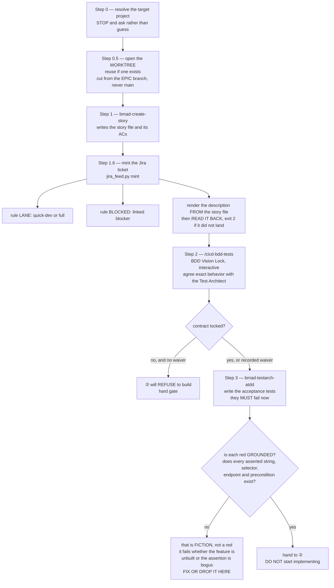

**What it leaves you:** a story file carrying `jira_key:`, a locked behavior contract, and tests that
fail. Failing is the point — a test that has never failed proves nothing.

**⛔ It does not rule `parallel-ok`** — that moved to `/cicd-parallel-check` for the reason above.

### ② `/cicd-dev-story-tests` — plan, stop, build, widen, certify

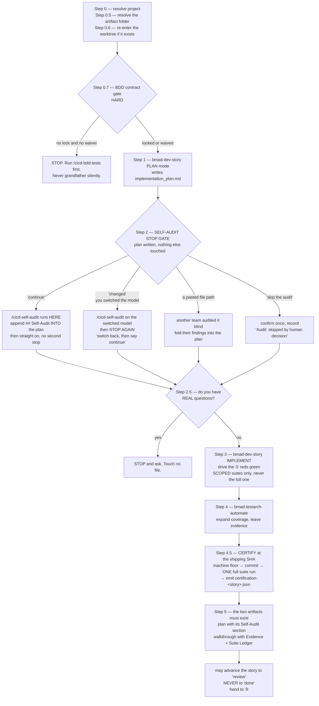

**The stop at Step 2 is the whole point of this command.** It exists so you can switch the model
before the audit, or hand the plan to another team for a blind audit. **The agent can never switch
the model itself and must never offer to.**

**Step 4.5 is why ③ is fast.** The certification file records the exact SHA the full suite was green
on. If ③ finds that SHA still matches HEAD, it inherits the green instead of paying for the suite
again. Any code or test change after it voids the pair.

### ③ `/cicd-code-review` — hunt blind, then gate

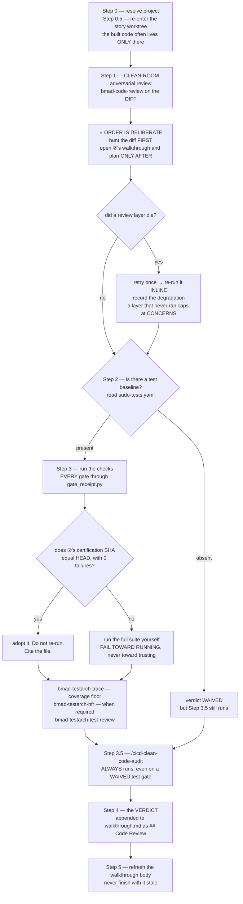

**Why ③ hunts the diff before reading ②'s notes:** opening the builder's write-up first imports the
builder's framing — the exact blind spot the review exists to remove. Order is always *hunt cold,
then read the story.*

**The four verdicts, and what each one means for you:**

| Verdict | Means | Does close-out land it? |
|---|---|---|
| **PASS** | every required tier green, and the clean-code floor green on changed lines | yes |
| **CONCERNS** | soft issues only — bloat, duplication, an unowned TODO, a stale note, a review layer that never ran | yes, and they get recorded |
| **FAIL** | a new test regression, a required tier missing, a machine-floor error on a changed line, or a banned pattern shipped | **no — this is the only thing that blocks** |
| **WAIVED** | the project has no test baseline at all | yes |

> ⓘ **The split is deliberate: objective checks block a story, taste does not.** Taste gets recorded,
> argued, and fixed on its merits — never used to stall a story on a reviewer's preference.

**Where the verdict lives:** a `## Code Review` section in the story's `walkthrough.md`. Stories
closed before 2026-08-02 keep it in the old standalone `sudo-code-review-<story>.md` file instead,
and that historic filename stays as it is on purpose — the files already exist on disk in the project
trees, so anything reading the fallback must name them as they are, not as the command is now called.

---

## 7. Landing and shipping — the close-out family

**This is the section people get lost in, so start with the one idea that resolves it.**

### There aren't four ways to close out — there are four *altitudes*

Each command below operates on a different thing. None can substitute for another.

| Altitude | The move | The command |
|---|---|---|
| **1. Lane → epic branch** | one finished story lands | `/cicd-update-sprint-memory` |
| **1. Lane → epic branch** | *several* finished stories of one epic land together | `/cicd-merge-epic-workingtrees` |
| **2. Disk cleanup** | verify merged, remove the worktree, delete the branch | `/cicd-close-workingtree` |
| **3. Epic branch → `main`** | the epic ships to production | `/cicd-push-e2e` |
| **3. Chore branch → `main`** | a Task ships | `/smh-close-task-merge-tree` |

**Two facts dissolve most of the confusion:**

1. **Neither story close-out touches `main`.** They land on the **epic branch** and stop. Production
   is a separate, later, explicitly-gated act.
2. **You almost never type `/cicd-close-workingtree`.** Both story close-outs call it as their own
   last step. You type it by hand only when a cleanup was skipped or failed.

### Which close-out do I run?

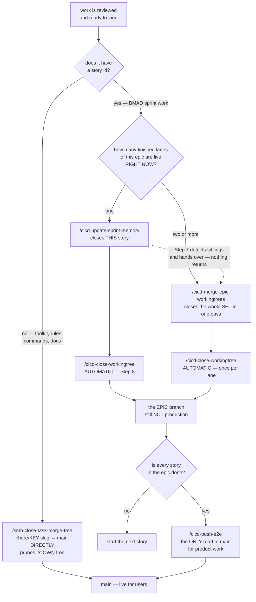

### What calls what

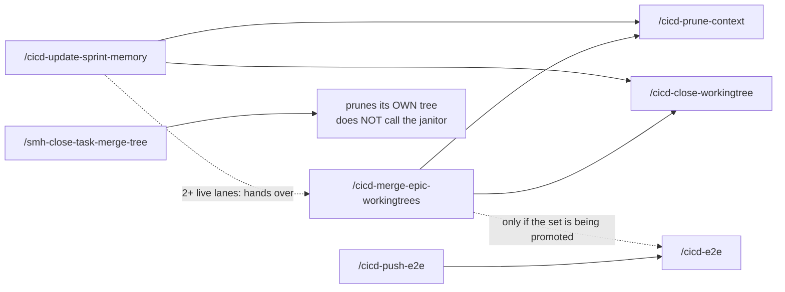

`/cicd-merge-epic-workingtrees` is **not a different close-out** — it *contains*
`/cicd-update-sprint-memory`'s per-story steps, wrapped in an overlap map and a combined gate the
solo version cannot do. `/smh-close-task-merge-tree` prunes its own worktree and deliberately does
**not** call the janitor, which owns `claude/*` story trees only.

### `/cicd-update-sprint-memory` — close out ONE story

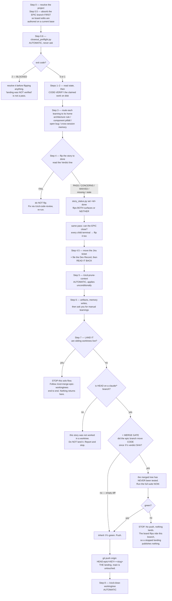

**Three things worth knowing before you run it:**

- **Only an objectively-red `FAIL` blocks the flip.** A pending live-test, live-QA or "stays review
  until X" note is **not** a blocker — your invocation resolves it. The command flips and records the
  note. There is deliberately **no "leave it at review and ask" branch**; punting the flip back to you
  is the failure this rule removes.
- **"Commit owed" is not a blocker either.** The agent commits its own work in the worktree, and
  Step 7 lands it.
- **⛔ Do not push the `claude/*` branch to origin.** The landing pushes `HEAD:epic/...` only. A
  story branch reaches origin **only** via `/cicd-park` — that is park's whole purpose, and
  `/cicd-resume` reads the origin `claude/*` list to find in-flight work on a cold machine.

### `/cicd-merge-epic-workingtrees` — close out ALL of an epic's lanes at once

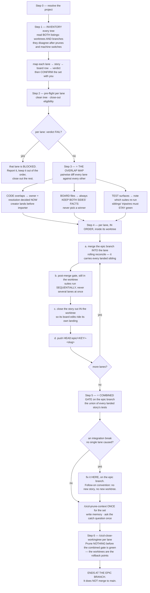

> ⓘ **Why this exists rather than closing lanes one at a time.** Up to four story lanes run at once,
> and lanes of one epic descend on the same surfaces. Closing them one-by-one without looking
> sideways ships what no single lane ever saw: two lanes editing one function, the same fix landed
> twice, board files colliding, and **semantic breaks git cannot see** — each lane green alone, red
> combined (a renamed fixture, a moved mount, a changed contract a sibling's test pins).
>
> **Expect exactly one conflict every time**, in `sprint-status.yaml`, spanning the set's story-status
> lines. Adjacent lines, different lanes, by construction. The resolution is mechanical, never
> judgment: keep the trunk's lines for already-landed siblings (their `done` is newer) plus this
> lane's own line.

**Invoking it — directly, or via `/cicd-update-sprint-memory` on the multiple-worktrees signal — IS
your sign-off** for landing AND flipping every story confirmed in Step 1. When it finishes there is
nothing left owed on the set: boards updated, stories `done`, trees and branches pruned.

### `/cicd-close-workingtree` — the janitor

**It moves no code.** It verifies a landing already happened, then cleans up. Both story close-outs
call it automatically; you type it only when cleanup was skipped or failed.

**Order is load-bearing and the numbering enforces it: SWEEP → PRESERVE → UNLINK → REMOVE → DELETE
BRANCH.** Every out-of-order variant of this command has destroyed something.

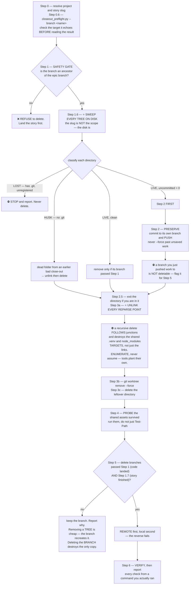

**Step 1.7 is the gate that stops the worst failure.** Step 1 proves the *code* landed; that is a
different question from whether *you finished the story*. Step 1.7 answers the second by reading the
story file's `Status:` — only a human close-out writes `done`.

> ⓘ **Why both checks exist.** `debug-2.2` sat merged-but-not-closed-out for five days while every
> planning surface recommended rebuilding it. Under the merge check alone its tree would have been
> pruned, erasing the last on-disk hint that the close-out never ran.
>
> **This gate has exactly two outcomes: AUTHORIZED, or a STOP with a named reason and the fix.**
> There is no third "the board looks ambiguous, checking with you" branch — that is the punt-hatch the
> gate exists to remove.
>
> **And why the sweep is wider than the slug you gave it.** On 2026-07-27 a single run found a dead
> husk still holding live junctions to the shared `.venv` and both `node_modules` (it had sat in the
> IDE side panel for a full day), and a **live tree holding 1,197 uncommitted lines** from a
> `/cicd-write-story-tests` run that never committed. The target slug's own tree was perfectly clean.

### `/cicd-push-e2e` — the one shipping command

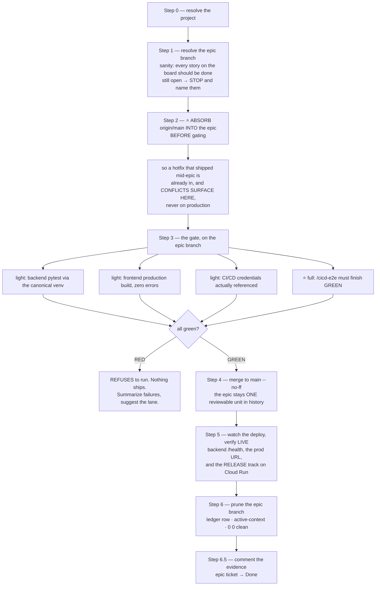

**Invoking it IS your per-merge sign-off for the one epic it ships.** The command doc expects a
push-approval prompt on the final push — but today no pre-push hook is armed on this machine (see
the ⓘ aside on the one-invocation rule later in this section), so no prompt fires until SCC-77
lands one. When a prompt or token gate *does* appear there, it is expected, not an error — satisfy
it, never bypass it.

`/cicd-e2e` also runs solo any time you want end-to-end confidence without shipping.

### `/smh-close-task-merge-tree` — the Task lane's close-out

**The half BMAD has no answer for.** A Task has no epic, no story file and often no sprint board at
all, so `/cicd-update-sprint-memory` has nothing to operate on and simply cannot close it.

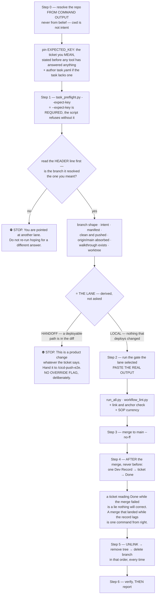

**Typing it IS your merge sign-off** — the same contract `/cicd-push-e2e` carries for an epic.

> ⓘ **Why the E2E answer is mechanical.** The one thing making this command cheaper than
> `/cicd-push-e2e` is skipping the end-to-end suite, and the only honest justification is *nothing
> that deploys changed.* That is precisely the claim an agent is worst at auditing about its own work,
> so the script derives it from the repo instead of asking.
>
> **And why `--expect-key` is required (SCC-64).** On 2026-08-09 the preflight resolved a sibling's
> `chore/*` branch mid-close-out and returned a clean verdict. Merging on it would have put another
> lane's in-flight work on `main` under the wrong ticket. The script cannot catch that by itself — it
> has no way to know which ticket you meant. So now you have to tell it, and a mismatch is a hard
> exit 2 instead of a prose warning.

### ⛔ One typing = ONE merge

Typing `/smh-close-task-merge-tree` authorises **the one task you typed it for**. It does not
authorise the next one, no matter how soon it follows. Same for `/cicd-update-sprint-memory`. Every
other merge to `main` needs you to say so directly.

> ⓘ **This got broken, and it is worth knowing how (2026-08-09, SCC-71).** In one long session the
> command was invoked **once** and then rode **six** merges (SCC-64 → SCC-69). Not defiance — the
> command's whole body stays sitting in the agent's context after you type it, and on task six it
> still looks exactly as valid as on task one. **A permission that arrives as a *document* doesn't
> expire when the task does.** Twice you typed the command to authorise the next merge and were told
> "already done": the sign-off was arriving *after* the merge it was meant to authorise.
>
> **What you should see instead.** When a task is merge-ready the agent stops with the branch pushed,
> gates green and preflight clear, and hands it back to you — then waits. If it reports a merge you
> did not authorise for *that* task, that is the bug, and the merge SHA's timestamp against your
> message is how you prove it.
>
> **Not yet fixed mechanically.** This machine has **no pre-push hook** (`.githooks/` holds
> `commit-msg`, `post-commit`, `pre-commit` only) even though the command doc claims a push-approval
> hook prompts. The proposed fix — a single-use token written when you invoke the command and consumed
> by the merge, plus a pre-push hook that refuses `main` without one — is **not built**. Until it is,
> this rule is enforced by reading, which is exactly the weakness it describes.

### The branch model underneath all of it

**`main` is what your users are running.** Everything else is short-lived by design.

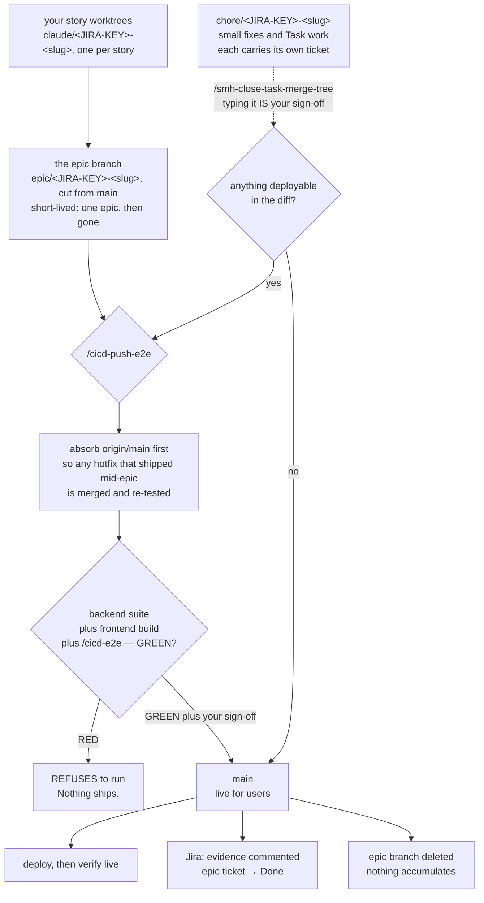

### ⭐ Every lane gets its own workspace — not just story lanes

**Changed 2026-08-09 (SCC-62). If a lane is going to commit anything, it gets its own worktree. No
classification, nothing to get wrong.**

Two things deliberately did **not** change:

- **Where a lane branches FROM is untouched** — a story still branches from its epic branch (never
  `main`), Task work still branches from `main`.
- **Each close-out still cleans up its own** — `/cicd-close-workingtree` for stories,
  `/smh-close-task-merge-tree` for Tasks.

> ⓘ **Why the old rule was backwards.** It decided who got an isolated workspace by asking *what kind
> of work this is*: a story lane got one, everything else was **forbidden** one and had to work in the
> shared checkout. But the thing that causes damage is **how many agents are in the repo at once**,
> and a small toolkit fix running next to a story collides just as hard — except it was the one told
> to sit where the collisions happen. The old wording also made the agent work out its own category
> and ended with *"unsure? you're not"*, which sent every ambiguous case into the shared checkout —
> the one place it must not go.
>
> On 2026-08-09 it went wrong twice in one afternoon: a close-out inspected a *different* lane's
> branch and reported it clear to merge (SCC-61), and the next Task opened onto a checkout still
> holding 11 of that lane's half-finished files (SCC-58).

**The one practical cost, solved.** A fresh workspace doesn't get the files git deliberately ignores
— `.env`, keys, `node_modules`. You can *see* them, but the test runner and dev server look for them
in the folder they're running in, so they fail. Run
`python3 .agents/scripts/link-worktree-assets.py <workspace>` (PC: `python`) and it points the new
workspace at the originals in seconds rather than copying gigabytes.

It warns you about the two cases that bite: a linked `.env` is **shared** — change it in one lane and
every lane sees it (`--copy-env` if that's not what you want) — and a shared `node_modules` is fine
day-to-day but the E2E suite needs its own. **Always `--unlink` before deleting a workspace**; both
close-outs do it automatically, because a delete that walks through a link destroys the *original*,
not the shortcut.

The linker also finds assets **one folder down** (`backend/.env`, `frontend/node_modules` — the real
AGY layout); before that fix it looked only at the repo root and would have quietly linked almost
nothing there.

### Where each check runs

| Gate | Where | When |
|---|---|---|
| Pull-request checks | GitHub Actions | every PR into `main` or an epic branch |
| **Jira key check** | local, armed git hook | **every commit** |
| Test-selection gate | local, before push | picks the affected tests; falls back to the full suite when unsure |
| **End-to-end gate** | local, via `/cicd-push-e2e` | **before anything reaches production** |
| Deploy | hosting CI/CD | on push to `main` |
| Incident pipeline | GitHub Action | when a real user hits an error ([§16](#16-incidents)) |

---

## 8. The fast lane — `/cicd-quick-dev`

For genuinely small project work: a fix, a docs/config change, a task that does not earn the full
pipeline.

**Accuracy over speed.** What it drops is the *pipeline* — the ATDD red phase, the full suite, the
three-reviewer panel. It does **not** drop the rigour.

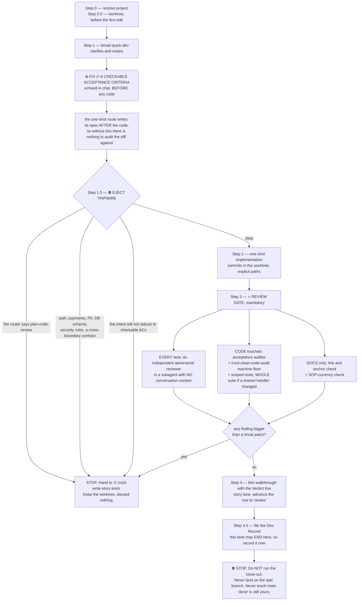

**It never closes out.** On a story it advances the row to `review` on the way out and stops there.
① marks eligible stories with the `quick-dev` label, so the fast-lane pile is one board filter away.

---

## 9. The Task lane — work on the system itself

**The dev cycle for work that has no story, no sprint board and no epic branch.** Four commands, and
the prefix is the whole point: `smh-*` is the family allowed to act on the repo you are standing in.

```mermaid
flowchart LR
    TICK["a Task ticket\nno story · no board · no epic"] --> QD["/smh-quick-dev\nworktree · acceptance list\nplan → approved"]
    QD --> SA["/smh-self-audit\nGO or NO-GO\nbefore a file is touched"]
    SA --> RED["write the assertion RED\ntest · or a check a doc must pass"]
    RED --> GREEN["implement until it is GREEN\nand nothing more"]
    GREEN --> CR["/smh-code-review\nStep 0.7 re-check main → blind hunt\n→ acceptance audit → the gate"]
    CR --> CCA["/smh-clean-code-audit\nrun_all · workflow_lint · sop_currency\npy_compile · links · door parity"]
    CCA --> V["Verdict in the walkthrough"]
    V --> STOP["STOP — hand back"]
    STOP -.->|"your sign-off"| CLOSE["/smh-close-task-merge-tree\nmerge to main · Dev Record · prune"]
```

### `/smh-quick-dev` — assert-first development

**Its core discipline: something must be failing before anything is edited.** For a script that
means a real test. For a *document or a folder move* — which is most Task work — it means a
machine-verifiable assertion written first. That is as close to test-first as prose gets, and it is
the difference between "I moved the files" and "I can prove nothing broke."

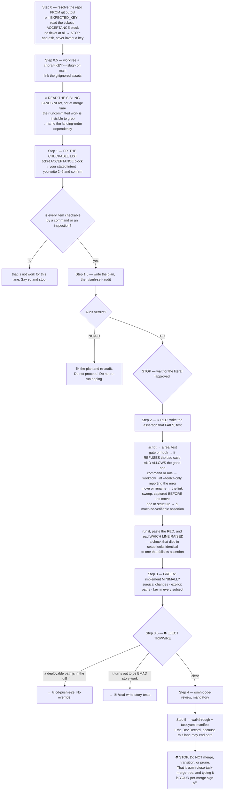

### `/smh-code-review` — the Task lane's verdict

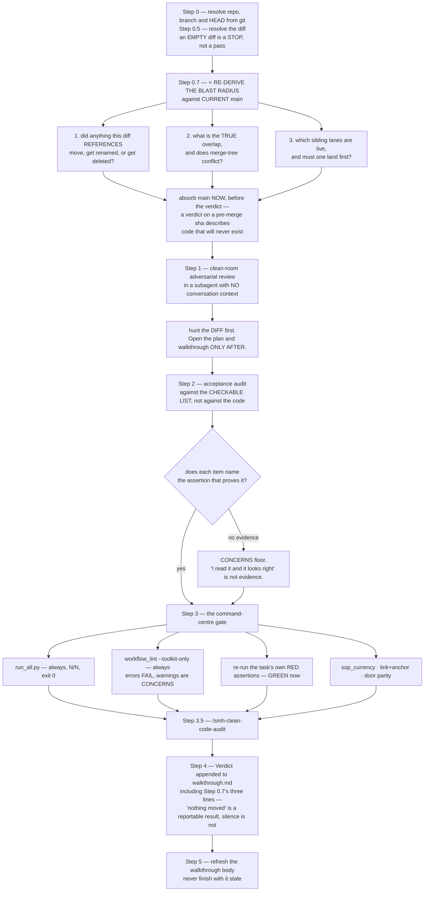

> ⓘ **Why the review re-checks `main` before it reviews anything (2026-08-10).** The audit you run
> *before* building traces its blast radius against the repo as it was that morning. Task lanes run
> several at a time, so by the time you finish, another lane may have landed and **moved a file your
> work points at.** Every test still passes — your code runs fine; it is the *references* that broke.
>
> That is not theoretical: it happened on the very task that built these commands. A sibling lane
> relocated this document mid-build, and two of the new commands still named its old address as the
> standard they load. Every gate was green before and after; only the re-check caught it.
>
> So the re-check is a **step**, not advice, and it lives inside `/smh-code-review` rather than being
> something you have to remember to run — an optional re-audit is one nobody runs, which is exactly
> how the memory cleanup sat unused inside the map command for weeks.

### `/smh-clean-code-audit` — the command centre's machine floor

**Why a separate command was needed at all:** `/cicd-clean-code-audit` checks `ruff`, `eslint`,
`pyrefly` and `tsc` — **none of which exist in this repo.** There is no venv here, no `backend/`, no
`frontend/`. Run the product version here and every check reports "skipped", which under its own rules
means *nothing was checked* — a floor made entirely of holes, reading as a pass.

So this one gates on what the command centre really has: the enforcement suite,
`workflow_lint.py --toolkit-only`, the SOP-currency check, "does this Python actually compile", the
link and anchor sweep, and **door parity** (does every new command exist on all four menus it
claims). Its judgment half checks the conventions **this page** defines.

> ⓘ **One limit, said out loud rather than papered over.** The product lane records each gate through
> `gate_receipt.py`, which writes a tamper-evident receipt proving a check really ran. **That tool
> cannot run in the command centre** — it looks for a BMAD sprint board and exits when it does not
> find one. So on this lane the evidence contract is pasted real output plus the commit it was
> measured on, recorded in the walkthrough. Same invariant, held by hand instead of by machine. If a
> code change lands after that commit, the verdict is void.

---
---

# Part IV — The machinery

*You almost never run any of this yourself. It matters because it's what makes the four claims in
[§1](#1-what-this-system-is) un-fakeable.*

## 10. The safety net — what checks your work

**Nine small programs plus three git hooks — two that block (`pre-commit`, `commit-msg`, carrying
the encoding, lint, Jira-key and SOP-currency checks) and one that records (`post-commit`, the
map-drift journal)** — do the checking that used to be a person holding eight rules in their head. What matters to you is *what they refuse to let happen.*

*Which safety check fires inside which command:*

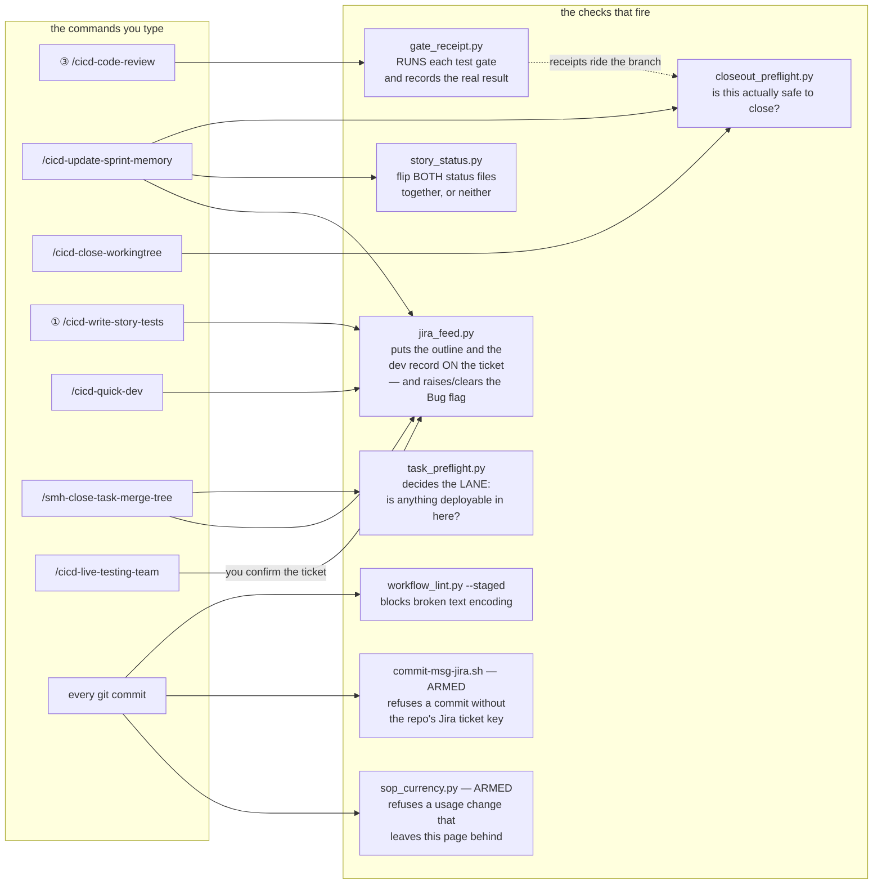

### The checks, and what each one refuses

| The check | What it refuses to let happen |
|---|---|
| `gate_receipt.py` | **A claimed test result that never ran.** It *executes* the gate and writes down the real exit code. There is deliberately **no way to hand it a verdict** — a receipt existing means the thing actually ran. It also separates *"the tool is missing"* from *"the tests failed"*, because a missing tool is a finding, not a free pass. |
| `closeout_preflight.py` | **Closing out a story that didn't really land.** One command answers: did the code merge · is every repo clean and in sync · does the review verdict exist and does it still apply · do the files the story claims it changed actually exist. **Exit 2 means blocked.** A warning that says *"landing was NOT verified"* means exactly that — it is not a pass. |
| `story_status.py` | **A story marked done in one place and not the other.** Status lives in two files; this flips both together or neither. It refuses a downgrade, refuses an unknown status, and refuses outright if the two surfaces already disagree — that case needs `--reconcile`, which is a decision, not a default. |
| `workflow_lint.py` | **Broken characters quietly entering a document** — the `—` that turns into `â€"`. Runs on every commit, staged files only, so it stays fast enough that nobody disables it. Its `--toolkit-only` half also checks the toolkit against its own conventions, and **since 2026-08-11 (SCC-82) a clean run is `0 errors, 0 warnings` — exit 0.** |
| ⤷ `ap_reconciled:` | **Silencing the AP-twin check by touching the twin.** The `*-AP.md` robot-lane commands are headless adaptations of their primaries, and the linter warns when a primary was committed after its twin — *go and diff them.* The twin now writes `ap_reconciled: <primary-sha>` in its frontmatter — a claim you can audit — and the check goes quiet **only** while that sha is the primary's current one. |
| `commit-msg-jira.sh` | **A commit with no ticket.** Each repo declares its Jira project in `.agents/jira.conf`; a commit whose message carries no valid key for *that* repo — or the wrong project's key — is refused outright. A rejected commit is a no-op: your staged files are untouched, nothing to undo. Merges, reverts, and rebases are exempt (the branch name carries the key for them). |
| `sop_currency.py` | **This page falling behind the system it describes.** Change a `/` command, a rule, a safety-net script, a commit gate, or the root `AGENTS.md`, and the commit is refused unless this file is staged with it. Say `[sop-ok]` in the message when a change genuinely alters no usage — that stays in the git log as the record of the call. It checks only that the two moved together; no program can judge whether the *edit* was right, and the point is to make you look while you still have the context. |
| `jira_feed.py` | **A Jira ticket that is only a title.** ① mints the ticket with an outline rendered *from the story file*, and the close-out files a **Dev Record**: the decisions, the pitfalls, and what is still owed. Both write paths **read the ticket back** and fail if what they claimed to write is not there. **Exactly one Dev Record per ticket.** It also picks the ticket **type** for you ([§12](#12-the-board--what-runs-next)). |
| `task_preflight.py` | **A change to the product sneaking onto `main` labelled a "task".** It derives the lane from the repo rather than asking: does this repo **have** anything that deploys, and did **this diff** touch it? Touch one and it **stops dead and sends the work to `/cicd-push-e2e`. There is no override flag, on purpose.** It also checks the branch shape, the `--expect-key` match, the `task.yaml` manifest, that the tree is clean and pushed, and that `origin/main` was absorbed. |
| `check_maps.py` | **The maps and INDEXes drifting from what is actually on disk.** Every level-2 folder must carry an `INDEX.md`, every backticked path in an INDEX table row must resolve, and the repo-map must still name every top-level folder. Ledgers under `_artifacts/` are exempt on purpose — their rows are history, and a row describing work that *deleted* something has to be able to name it. |
| `tests/test_sops_prds_folder.py` | **The SOPs and PRDs going stale again.** Pins the 11-doc manifest in `docs/_scc_sops_prds/`, checks its `INDEX.md` against the directory in BOTH directions, verifies every markdown link resolves and every `/command` reference names a real command master, and asserts the SOP gate's two halves still point at the same file. |
| `split_sprint_status.py` | The one-time migration that shrank the board. |
| `wf_common.py` | Shared plumbing the others import. You'll never call it. |

**Run all their tests any time:** `python3 .agents/scripts/tests/run_all.py` (on the PC, `python …`) —
408 checks across 12 files as of 2026-08-11, about ten seconds — the suite prints its live totals,
which outrank this sentence. Full detail in
[`.agents/scripts/INDEX.md`](../../.agents/scripts/INDEX.md).

> ⓘ **Three design decisions that look like bugs until you know why.**
>
> - **"Did this change?" compares *content*, not commit IDs.** When a branch lands via a merge it gets
>   a brand-new commit ID but identical content. Calling that "stale" would make an honest gate cry
>   wolf until someone disabled it permanently.
> - **The encoding check can be told to stand down** on a file that legitimately contains those
>   broken-looking characters as data — the checker's own test fixtures, a doc quoting them. Without
>   that escape hatch, the gate would block every commit that touches the gate itself.
> - **Both new gates ship armed rather than warning first**, which breaks the usual advice. The reason
>   is specific to how you work: **hook output is invisible in VS Code.** A warn-only gate prints into
>   a pane nobody reads, so it looks exactly like a clean success — you'd have shipped the gate and
>   enforced nothing. Every one keeps a one-token exit instead (`[sop-ok]`, or `--no-verify`), because
>   a gate with no legitimate way out gets disabled permanently, and then nothing is checked at all.
>
> **And why a zero baseline matters.** Before SCC-82 two `workflow_lint` warnings had stood on `main`
> for weeks, and every close-out report carried *"2 pre-existing warnings"* as an excuse — which means
> nobody could read the next run without first holding a list of accepted noise in their head. **A
> gate with a non-zero baseline cannot tell you anything about your change.** If you see a warning
> now, it is yours.

> **⚠ Python is named differently on your two machines.** The **Mac** has **only `python3`** — no bare
> `python`, not in a script and not in your own shell. A python.org install on the **PC** has **only
> `python`** (Microsoft Store installs have both). So there is no single spelling that works
> everywhere: commands in these docs are written `python3`, and **on the PC you drop the `3`**. If a
> documented command answers *command not found*, try the other name before assuming anything is
> broken.
>
> **The gates themselves are immune to this** — every hook probes `python3 → python → py` and uses
> whichever exists, so the safety net works on either machine with nothing to configure. It is only
> the commands *you type* that differ. See [§13](#13-switching-machines).

### When another lane lands while you're mid-branch

Somebody else merging to `main` is normal and mostly free. What actually costs you a session is being
behind **on a file you also edited** — and "you are 7 commits behind" tells you nothing about which
case you're in, so a 30-second catch-up and a real hand-merge read exactly the same.

Both preflights now say which. When your branch hasn't absorbed the other side, they diff the two and
either tell you:

> `no file overlap: origin/main moved on 16 file(s), none of the 8 this branch touched — the merge should be clean`

or name the ones that collide:

> `2 file(s) changed on BOTH sides — resolve by keeping both sides' facts, never by picking a winner: docs/_scc_sops_prds/workflows_testing_SOP.md, .agents/rules/jira.md`

**"Keep both sides' facts" is the standing rule for these, not a suggestion** — parallel lanes record
*different true things*, so picking a winner silently deletes someone's work.

> ⓘ **Why it warns you at the gate and not the moment they merge.** A ping at merge time can't know
> whether it affects you — most merges don't — and interrupting a lane mid-flight is its own hazard:
> absorbing `main` early drags other people's changes into the diff your review is scoped on, and a
> `git merge` under a running dev server has wedged this system before. At the gate you've already
> stopped, so telling you costs nothing. And note the verb is always **merge**, never *rebase* —
> rewriting a branch that's been pushed is on the never list.

## 11. Is this review still valid?

A review is a statement about *specific code*. If the code changed afterward, the review describes
something that no longer exists. So every verdict is stamped with the exact version it examined.

*How the system decides whether a story marked "review" is genuinely ready:*

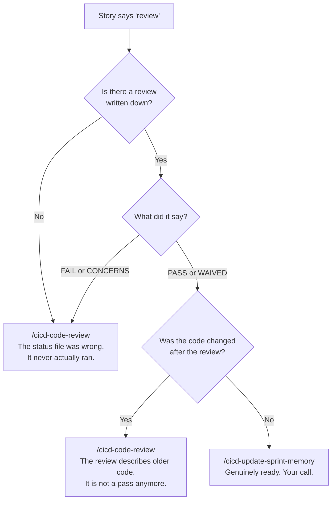

> ⓘ **Why this exists.** For a while the boot command answered "is this ready?" from the status file
> alone — which reads `review` whether the review passed, failed, or never happened. It cheerfully
> pointed at close-out for work nobody had reviewed. It now reads the actual verdict and checks the
> version stamp. Close-out still lets you land a stale verdict deliberately, because that call is
> yours — it just won't let you make it *unknowingly*.

## 12. The board — what runs next

The human-facing view of "what runs next" is the **Jira board** —
[SCC](https://sudo-command.atlassian.net/jira/software/projects/SCC/boards/2) for this command
center, [AVCH](https://sudo-command.atlassian.net/jira/software/projects/AVCH/boards/3) for
AviationChat. The sprint holds the current batch, the backlog holds everything else, and every ticket
links to its branches and commits through the key. How to drive it by hand:
[jira_manual.md](jira_manual.md); why it's built this way:
[jira_integration_guide.md](jira_integration_guide.md).

**Any agent can read and write the board — live.** There is no "export it for me" step: every
platform (Claude, Gemini, opencode, Codex, Antigravity) shells out to the authenticated `acli` CLI.
Ask "what's In Progress?" and the agent queries Jira and joins each ticket back to its story file
through `jira_key:`. The rule that teaches this: [`jira.md`](../../.agents/rules/jira.md).

**What did NOT retire: `sprint-status.yaml`.** It remains the machine-read sprint state — the story
loop, close-outs, `/cicd-boot-sprint-memory`, `/cicd-resume` and the autopilots all read it, and its
vocabulary (`descoped` vs `deferred-v3`, `ready-for-dev`) is richer than Jira's. The pairing between
the two worlds: the Jira summary carries the BMAD number (`21.4 — School code rotation`), the story
file carries `jira_key:` in frontmatter, and the branch carries the Jira key.

**Statuses are per board and they differ** — SCC runs `To Do · To Do Next · Blocking · In Progress ·
Done`, AVCH runs `To Do · In Progress · In Review · Deferred · Done`. Note the SCC name is
**`Blocking`**, not `Blocked`; there is no `Blocked` status on either board.

> ⛔ **If an agent tells you the board is unreachable, ask it to re-run outside its sandbox
> (2026-08-09).** A sandboxed tool call can't reach the OS credential store, so `acli` fails there
> while working perfectly in the same repo unsandboxed. Two agents hit this on one day and both read
> a fact about *their own shell* as a fact about *the board* — one reported a ticket didn't exist, the
> other declared the CLI "no longer authenticated" and proposed committing new work under **SCC-54**,
> a ticket that had already closed. `acli jira auth status`, unsandboxed, settles it in one line.
>
> **And a closed ticket's key is never free to borrow:** commits link to it through the branch name,
> and a close-out would overwrite the one Dev Record belonging to the work that earned it. Minting a
> fresh ticket is one command and always available.

### Where tickets come from, and what moves them

**Minting happens at exactly two seams:** `/cicd-create-epic-sprint` mints the **epic's** ticket at
kickoff, and ① mints each **story's** ticket at pickup — stamped with two rulings as labels:
`quick-dev` (fast lane allowed) and `blocked` (waiting on a linked blocker). The third label,
`parallel-ok`, has its own writer: `/cicd-parallel-check` ([§6](#6-the-story-lane)).

**Movement is automated at exactly three moments:** close-out moves the **story's** ticket,
`/smh-close-task-merge-tree` moves a **task's**, and `/cicd-push-e2e` moves the **epic's** to Done
with the evidence commented. Sprint and backlog *placement* stays yours; outside the two minting
seams, machinery only ever touches status.

### Two shapes of work on one board — and why it decides the command

Everything on the board is a **Story** or a **Task**, and that is not a label — **it decides which
command is able to close it.**

| | Story | Task |
|---|---|---|
| What it is | sprint work: a number (`19.2`), a story file, a BMAD epic, a `sprint-status.yaml` row | the toolkit, rules, `/` commands, IDE and skills work. No story file, no BMAD epic, in the command centre no sprint board at all |
| Branch | `claude/<KEY>-<slug>`, off the epic branch | `chore/<KEY>-<slug>`, off `main` |
| Closes with | `/cicd-update-sprint-memory` | **`/smh-close-task-merge-tree`** |
| The code lands on | the epic branch (then `main` via `/cicd-push-e2e`) | `main`, directly |
| Your sign-off | invoking the close-out | invoking the command |

A Task hangs under one of your grouping epics (`CI/CD Improvment`, `New Epic Feature or Fix`,
`Thin toolkit`) only because Jira offers no other container for it.

**The consequence worth knowing: `/cicd-update-sprint-memory` cannot close a Task, and never could.**
It reads a sprint board, flips a story status and lands on an epic branch — a Task has none of the
three. So Task work was being closed by hand, which is exactly why the tickets stayed empty.

You never pick the type by hand: `jira_feed.py` derives it when the ticket is minted, and
`jira_feed.py audit --jira-project <P>` re-checks a whole board at once.

### `Bug` is a flag, not a kind of work

It means *this ticket turned out to be broken.* Two things raise it: an audit that finds a live bug
and traces it back to the ticket that introduced it, or you, by hand. Either way the ticket comes
back out of Done wearing `Bug`, and the close-out puts it back to **Story or Task** — whichever it
actually is — once the fix lands, because the bug is gone.

**How a bug actually gets flagged, end to end.** `/cicd-live-testing-team` is where this lives,
because it is the one command that flies the running app: you click, it watches, and every symptom
becomes a researched bug doc that names *where the fix lives*. Those paths feed the trace.

```
you find a bug flying the app   ->  the agent traces the paths, shows you ranked candidates
                                    "SCC-31 · blame + log · last 2026-08-04"
you say yes                     ->  the ticket goes Story|Task -> Bug, comes out of Done,
                                    and carries a comment saying what broke and how you know
the fix lands, close-out        ->  back to Story or Task. The bug is gone.
```

> ⓘ **The agent stops in the middle of that on purpose.** It can find the ticket; it cannot know it is
> the right one. Git tells you who last *touched* a line, not who *broke* it — a typo fix a month
> later takes the blame, and flagging that ticket pulls finished work back into your queue for someone
> else's mistake. So the machine proposes and you confirm. **Raising a `Bug` is two commands**:
> `trace` reads git history and *proposes*; `flag` does the flip. If nothing is proposed, the bug has
> no ticket behind it: that is new work, not a reopen.
>
> A ticket already flagged is left alone rather than flagged twice, and a ticket that was still
> `In Progress` keeps its status — it was never finished, so there is nothing to reopen.

**One override worth knowing:** if a story has a live working folder on disk, it is in flight no
matter what the status file says. The status file lags by design — only close-out writes it.

> ⓘ **The scrum-board map is retired (2026-08-07, SCC-13 / AVCH-10).** `sprint_scrum_board_map.md` and
> its command are gone. **The command menu kept advertising it for two days after it was deleted** —
> the `/` index still listed `/sudo-update-scrum-board` under session ops with a full description,
> which is what sent you looking for a command that wasn't there. Removed 2026-08-09. The lesson is
> cheap and worth keeping: **deleting a command is only half of retiring it — the index that
> dispatches to it is the half people actually read.**

---
---

# Part V — Operations

## 13. Switching machines

You work one sprint across desktop, laptop, and phone. **Branches travel between machines; your local
working setup does not.** That gap is the entire reason this pair exists.

```mermaid
flowchart TD
    M1["machine A\nyou're finishing up"] --> PARK["/cicd-park\npush everything plus write a note"]
    PARK --> ORIGIN["GitHub\nthe only thing both machines share"]
    ORIGIN --> RESUME["/cicd-resume\non machine B"]
    RESUME --> PULL["shared checkout stands on main\ngit pull --ff-only origin main\nsafe: it only catches production up"]
    PULL --> WORK["check out the live epic/* branch\nplus re-create the story worktrees"]
    WORK --> BOOT["/cicd-boot-sprint-memory\nload the sprint and keep going"]
```

**Why the pull is boring now.** The shared checkout stands on `main` and stays there — always exactly
production. `git pull --ff-only origin main` from there can only catch it up to what already shipped;
it cannot promote anything. Story work never happens in the shared checkout anyway — it lives in
worktrees on the epic branch. Promotion to production happens through `/cicd-push-e2e` and nowhere
else, never as a side effect of picking your work back up.

> ⓘ Under the retired two-branch model this exact spot hid a trap: pulling the build branch while
> standing on `main` silently fast-forwarded production to 160+ unreviewed commits. With one
> long-lived branch, the trap has nothing left to spring on.

Two smaller things it handles: a fresh machine shows **no** work in progress even when plenty exists
(it's all on GitHub, not yet on disk), and resuming never deletes anything on your other machine.

### What does NOT travel between the machines

Git moves branches and files. It does **not** move your local git *settings*, your environment, or
your secrets. This is the category that produces "it works on the desktop but not the Mac" reports,
and every item below has already cost a debug cycle.

| | What breaks if it's missing | Fix — **once per machine** |
|---|---|---|
| **The commit gates** | `core.hooksPath` is *local* config and does **not** travel with a clone. Without it git reads `.git/hooks`, which is empty — so the Jira gate, the encoding gate, and the SOP gate are all **silently off** while the repo looks identical. | `git config --global core.hooksPath .githooks` — a **relative** value resolves against each repo's own root, so this one command arms every clone you have and every one you make later. Harmless no-op in repos with no `.githooks/`. |
| **Python's name** | The Mac has only `python3`; a python.org PC has only `python`. Typed commands differ; the gates don't (they probe). | Nothing to install — just use the name your box answers to. |
| **Secrets / `.env` / `auth_keys/`** | All gitignored, so a fresh clone has none of them and things fail in confusing ways rather than obviously. | Restore from the hand-carried master bundle — start at the migrations `INDEX.md` in `_my_resources/`. |
| **Shell environment** | On the Mac, `.zshrc` is read **only** by interactive shells — anything an agent or script runs can't see it. | Put anything scripts need (e.g. `JAVA_HOME`) in `~/.zshenv`, not `.zshrc`. |
| **The Jira login** | `acli`'s API token lives in your **OS credential store**, not in the repo — and the binary isn't at the same path on both boxes either. An agent that trips over this concludes *"I have no Jira integration"* and starts improvising: inventing a key, or borrowing a closed ticket's. | `acli jira auth login`, once per machine. Then **any** agent can confirm it with `acli jira auth status`. Never hardcode the binary's path into a doc. |
| **The memory link** | The agent memory store lives **in the repo** (`_artifacts/_memory/`) — that part travels, and every model on every machine reads it at session start. What does **not** travel is the link that lets Claude's harness write into it: without it, Claude quietly writes memory to a machine-local folder and the shared store **stops growing** — no error, just lessons that never reach the other box or the other models. | `link-memory.ps1` (Windows) / `link-memory.sh` (Mac) — migrations kit §1, step 8. `/smh-memory-audit` checks the link on whatever machine it runs on and flags a missing one. |

**The rule underneath all six:** anything stored *outside* the repo is per-machine by definition. When
something works on one box and not the other, check this table before suspecting the code.

> **Setting up a machine?** The short version is
> [machine_setup_card.md](../migrations/install_guides/machine_setup_card.md) — arm
> the gates, check the Python name, restore what git doesn't carry. The full path for a genuinely
> fresh box is the [migrations kit](../migrations/INDEX.md).

## 14. How we test

Deterministic code — same input, same output — gets exact tests. AI-generated output gets **soft**
checks that look for meaning rather than exact wording, because demanding exact wording from a
language model produces a test that fails for no real reason. Anything critical is covered at more
than one level.

**Three things worth carrying in your head:**

- **Failing first is the point.** A test that has never failed hasn't proven it can detect anything.
- **Tests added to already-working code pass immediately** — that's correct. Don't manufacture a
  failure to feel better about it.
- **A test fed a value the real system never produces is a false green.** It passes and proves
  nothing.

**How much testing a story earns** is set by its risk score at epic kickoff — not by how the work
feels once you're in it.

### TEA tools — when to reach for one

You rarely call these directly; the ①②③ steps fire them in the right order. Reach for one solo only
when you want that single piece:

| Solo use | Why |
|---|---|
| `/tea` | Activates the Test Architect persona for a strategy conversation. |
| `/testarch-trace` | Shows which requirements have tests, without running a whole review. |
| `bmad-teach-me-testing` | Structured lessons, if you want to go deeper on method. |

One-time setup only: `/testarch-framework` (stand up a test bench) · `/testarch-ci` (scaffold the
automated pipeline).

## 15. The autopilot lane

*The robot running the same loop you'd run by hand — and how it picks back up if it dies halfway.*

```mermaid
flowchart TD
    S1["1 · Plan"] --> S2["2 · Audit the plan\nfresh session, different model"]
    S2 --> S3["3 · Build"]
    S3 --> S4["4 · Review and fix\nfresh session again"]
    S4 --> GATE{"tests green?"}
    GATE -- "yes" --> REV["story → 'review'\n+ commits its own branch\n+ ticket → In Review"]
    GATE -- "no" --> HAND["stops and hands it to you"]
    REV --> YOU(["you: read it, then\n/cicd-update-sprint-memory"])
    S1 -.->|"leaves behind"| P["the plan"]
    S2 -.->|"appends INTO the plan"| P
    S3 -.->|"leaves behind"| WK["the walkthrough"]
    S4 -.->|"appends INTO the walkthrough"| WK
    P -.->|"resume looks for\nSECTIONS, not files"| S1
    WK -.->|"same"| S3
```

| Command | Runs on | Notes |
|---|---|---|
| `/cicd-autopilot-claude` | the `claude` CLI | The canonical robot loop: Plan → Audit → Build → Review, four separate sessions. |
| `/cicd-autopilot-opencode` | the `opencode` binary | Port of the same loop. |
| `/cicd-autopilot-deepseek4` | `claude` CLI plus a flag | Runs the token-heavy building half on a cheaper model, keeps review on Claude. A *lane* of `/cicd-autopilot-claude`, not a third engine. |

Each stage runs in a **fresh session** so none inherits the previous one's assumptions — the same
reason ③ hunts blind in the human lane.

**It's resumable.** Re-run the launcher and it works out which stages finished by looking for their
*sections inside* those two documents, not for the files themselves. A half-written plan doesn't
count as a finished plan.

**The robot works in its own copy of the repo.** Every run opens the story's own worktree first, so
the robot is never typing into the same files as you or another lane. It looks like
`.claude/worktrees/<story>/`, on a branch named `claude/<TICKET>-<story>`.

**You launch it from the epic branch.** The robot cuts the story's branch from whatever the project
has checked out, and that has to be the epic branch — so switch to it first, or pass
`-EpicBranch epic/<KEY>-<slug>`. It refuses to start rather than guess, because a story branched off
`main` can't be landed.

**When it's green it commits, files the ticket, and stops.** It saves the work on the story branch
with an explicit list of files and a Jira-keyed message, moves the ticket to **In Review**, and writes
the Dev Record onto it. It still **never pushes**, never touches `main`, and never marks anything
`done`. Your end of it: read the walkthrough, the plan, and the ticket — then run
`/cicd-update-sprint-memory`.

> ⚠️ **Not yet run for real.** All of the above was written and checked on the Mac, but the autopilot
> is Windows-only, so no stage of it has actually executed. First time out, use `-DryRun`, then a
> small story with `-MaxStage 2`, on each engine.

The engines live **per-project** and have drifted between projects — a behavior fix has to land in
each one. The claude and opencode engines are **twins by contract**: the worktree, commit and ticket
blocks are kept identical on purpose, so a `diff` shows drift straight away.

> There is **no** `/autopilot-claude` with a hyphen. Every launcher uses an underscore.
> **`/autopilot_mobile` was deleted 2026-08-07.** There is no separate mobile engine any more — from
> your phone you drive the desktop engines through Remote Control, which is strictly better: same
> code, same gates, one thing to fix when the loop changes.

> ⓘ **⛔ A green check can be telling you the truth about the wrong branch (2026-08-09).** When
> several lanes run at once, the checking scripts work out *which* repo and branch to look at by
> starting from wherever the agent happens to be standing and searching upward for the repo. **That
> starting point silently resets** — a `/compact`, a new slash command, a fresh tool call — back to
> the shared checkout. If a sibling lane has moved the shared checkout onto **its** branch, the check
> quietly points there instead.
>
> Nothing errors. The script has no way of knowing which ticket the agent meant, so it runs every
> check properly and reports a clean result — **about the wrong branch.** On 2026-08-09 a Task
> close-out printed *"clear to close out and merge"* for a different lane's unfinished branch.
>
> **What changed, so you can hold the agent to it:** every close-out command must say **which repo and
> which branch** it resolved — read out of `git`, not from memory — and **name the ticket it means to
> close** *before* it runs the check. If the check comes back pointing at a different ticket, it must
> **stop and tell you**, not retry. The same trap in miniature: piping a check into `tail` makes the
> computer report *`tail`'s* success instead of the check's, so a failed gate prints "passed". Gates
> now run unpiped.
>
> **The one thing to ask for:** if an agent reports a gate as green, ask which branch the gate named.
> A report that can't answer that hasn't been verified — it's been assumed.
>
> **Update (SCC-64): the machine now enforces this.** The Task-close-out check refuses to run at all
> unless told which ticket is meant (`--expect-key`), and blocks hard when the branch it resolved
> carries a different key. Each task can also carry a small `task.yaml` in its artifacts folder — the
> ticket, repo, and branch written down at task *start*, before anything can drift. And toolkit
> close-outs run the lint scoped (`--toolkit-only`), so a red or green about some *product project's*
> sprint state can no longer leak into a decision about toolkit work. If an agent explains away a red
> gate as "pre-existing, different project", it is using the wrong flag.

## 16. Incidents

*Three layers, from fully automatic to fully yours.*

```mermaid
flowchart TD
    ERR["a real user hits an error"] --> SENTRY["Sentry catches it"]
    SENTRY --> AUTO["1 · Automated pipeline\ntriage → GitHub issue\nplus a starting fix branch"]
    AUTO --> PAGE["you get paged\nwith a summary"]
    PAGE --> YOU["2 · /cicd-mobile-error-team\nre-diagnoses from scratch"]
    YOU --> CARD{"roll back, or fix forward?\nit gives you both timelines"}
    CARD --> FIX["minimal fix plus a test\nthat proves it"]
    FIX --> CI["gated on real CI\nyour sign-off to merge"]
    DRILL["3 · /sentry-security-team-avch\nquarterly fire drill"] -.->|"keeps the runbook honest"| AUTO
```

The responder **re-diagnoses independently** rather than trusting the automated triage — an automated
first guess is a lead, not a diagnosis. It stops twice for you and never merges on its own initiative.

`/cicd-live-testing-team` is the other half of this: it boots the app and watches the logs while
**you** click around, files researched bug reports, writes no code, and traces each bug back to the
ticket that shipped it ([§12](#12-the-board--what-runs-next)).

---
---

# Part VI — Reference

## 17. Where the depth lives

### Every command, by family

> ### ⭐ One door per command, on every tool (SCC-66)
>
> **Nothing you type changes.** Each command has exactly **one** way in per tool, and the sync builds
> them all from the same command file:
>
> | Tool | How you invoke it |
> |---|---|
> | **Claude Code** | `/<name>` (the entry comes from a *skill*, not a command copy — same name, same behavior) |
> | **Codex** | `/skills` → `<name>`, or `$<name>`. **Codex cannot have top-level `/name` commands at all** — that limit is Codex's, not ours, and it is why the skill is the door everywhere. |
> | **opencode** | `/<name>` |
> | **Antigravity** | `/<name>` |
>
> Two old doors are **retired and swept**: Claude's duplicate command copies and Codex's deprecated
> `/prompts:<name>`. They published the *same* command twice on those tools, which is how the menus
> drifted apart without anyone noticing.
>
> **The one thing to know:** after a `/smh-sync-agents`, **start a new Codex chat** — Codex takes its
> skill list when a chat opens, so a sync mid-chat is invisible until you open a fresh one. Restart
> opencode for the same reason. And each machine has its own caches, so a sync on the Mac does not
> reach the PC — run it once on each.

**The story loop** — [§6](#6-the-story-lane)

| Command | What it does for you |
|---|---|
| `/cicd-boot-sprint-memory` | Start of session. Reads the sprint, tells you the next story and exactly which command it needs. It **reads the review verdict from the artifact** rather than trusting the status file. **Also reads that project's own memory index** — the memory store is two-tier, so facts true only inside one project live in that project's store and are not in the lobby index your session already loaded. No memories yet is a normal answer, not a fault. |
| `/cicd-create-epic-sprint` | **Once per epic.** Writes the epic and its stories, then risk-scores every story with you. Mints the epic's Jira ticket itself at kickoff. |
| ① `/cicd-write-story-tests` | Creates the story, locks the intended behavior in plain language, then writes the **failing** tests. Also mints the story's Jira ticket and rules `quick-dev` and `blocked` onto the board as labels. |
| ⭐ `/cicd-parallel-check <EPIC-KEY>` | Run once an epic's stories are all written: tells you which ones you can run **side by side**. States, never starts. |
| ② `/cicd-dev-story-tests` | Plans, **stops for your `approved`**, builds until the tests pass, widens coverage, then records a signed-off snapshot of the results. |
| ③ `/cicd-code-review` | Hunts the diff cold, runs an adversarial review, audits code quality, runs the test gate, issues a verdict into the walkthrough. |
| `/cicd-clean-code-audit` | Dead code, duplication, drift. Runs inside ③; also runs solo across a whole area. |
| `/cicd-bdd-tests` | Locks behavior in plain language, standalone (① does this for you). |
| `/cicd-self-audit` | Pressure-tests a plan against the real code before anyone writes anything (② does this for you). **Fixed 2026-08-09 (SCC-58):** the step where it asks the code graph "who else breaks if we change this?" had never once run — it decided whether the graph was available by looking for a section title inside `AGENTS.md`, and that title lives in `docs/gitnexus.md`, so the answer was always "not available". It now asks the tool itself which projects are indexed. Three guards came with it: it names the project on every question, it **checks the map is not stale before trusting it**, and it treats a **"nothing breaks" answer as the one to double-check by hand** — the graph is blind to one common calling style. |
| `/cicd-prune-context` | Trims the running session notes back under budget so sessions start fast. |

**Landing and shipping** — [§7](#7-landing-and-shipping--the-close-out-family)

| Command | What it does for you |
|---|---|
| `/cicd-update-sprint-memory` | Close-out for **one story**. Pre-flights everything mechanically, marks the story done on **your** word, saves what was learned, lands the code on the **epic branch** — and moves the story's Jira ticket to match, with the evidence attached. |
| `/cicd-merge-epic-workingtrees` | Lands **all** of one epic's finished lanes in a single reviewed pass. Ends at the epic branch. |
| `/cicd-close-workingtree` | The janitor. Confirms the branch really merged, then removes the workspace and deletes the branch. Both close-outs call it automatically. |
| `/cicd-e2e` | Runs the real end-to-end suite — a complete stand-in for the live app, with test users. Green means safe to ship. |
| `/cicd-push-e2e` | The one shipping command — the only road an epic takes to `main`. **Refuses to run** until the end-to-end suite is green. After the merge it comments the evidence on the epic's Jira ticket and moves it to **Done**. |
| `/smh-close-task-merge-tree` | **The Task lane's close-out.** Gate, merge to `main` with `--no-ff`, one Dev Record, ticket → Done, prune. **Typing it IS your merge sign-off.** Refuses the moment a deployable path is in the diff and hands the work to `/cicd-push-e2e`, with no override flag. |

**The fast lane** — [§8](#8-the-fast-lane--cicd-quick-dev)

| Command | What it does for you |
|---|---|
| `/cicd-quick-dev` | Fast lane for genuinely small project work. Drops the *pipeline*, never the rigour: a worktree, ACs fixed before any code, an eject tripwire, and a mandatory review gate. **Low-risk only.** On a story it advances the row to `review` and **stops there — it never closes out**. |

**The Task lane** — [§9](#9-the-task-lane--work-on-the-system-itself)

| Command | What it does for you |
|---|---|
| `/smh-quick-dev` | The Task lane's build step. Fixes a checkable acceptance list before anything is written, plans, audits, waits for `approved`, then builds — with something failing first, always. Ends at the review gate and **stops**; it never merges. |
| `/smh-self-audit` | Pressure-tests the plan before anyone writes anything, pointed at the blast radius toolkit work actually has. Also **reads the other live lanes** and tells you which should land first. Ends in `GO` or `NO-GO`. Has a **retroactive mode** for when the work already exists and no plan was written — it audits the ticket's ACCEPTANCE block instead and stamps the result `retroactive`, so the record never reads as though a gate ran in time when it did not. |
| `/smh-code-review` | The Task lane's verdict. Re-checks `main` (Step 0.7), hunts the diff cold, audits against the acceptance list, runs the command-centre gate, folds in the clean-code gate, and writes the one `Verdict:` line `/smh-close-task-merge-tree` reads before it will merge. |
| `/smh-clean-code-audit` | The command centre's machine floor — the enforcement suite, toolkit lint, SOP currency, py_compile, links, door parity. |

**Machine handoff** — [§13](#13-switching-machines)

| Command | What it does for you |
|---|---|
| `/cicd-park` | Before you close the laptop: commits and pushes everything in flight, and writes a note to your other machine about where you left off. |
| `/cicd-resume` | On the machine you just opened: pulls everything back down and rebuilds your working setup. |

**Debugging, incidents and thinking** — [§16](#16-incidents)

| Command | What it does for you |
|---|---|
| `/cicd-live-testing-team` | Boots the app and watches the logs while **you** click around. Files researched bug reports. Writes no code. Traces each bug back to the ticket that shipped it — never flags one without your word. |
| `/cicd-mobile-error-team` | Live incident responder, works from your phone. Re-diagnoses independently, gives you a rollback-vs-fix decision, writes the fix and a test that proves it. |
| `/smh-adviser-board` | Convene historical minds in 5 challenge teams (+ a Real-World marketing squad) to flip assumptions and surface what people *need*. Runs Brainstorm → Plan → Market → Brief; advances only on your word. Saves the brief to `_my_resources/board_sessions/`. |

**Toolkit upkeep**

| Command | What it does for you |
|---|---|
| `/smh-update-maps-indexes` | Reconciles the repo maps, every index, and every cross-reference across the lobby and the maintained projects. It **no longer touches the memory store** — that moved to `/smh-memory-audit` (SCC-68). |
| `/smh-memory-audit` | Cleans up the shared memory store (`_artifacts/_memory/`) — the one document every model on every machine loads *before* doing any work, which is why letting it fill costs you on every session everywhere. It checks each memory's claim against the live repo, then shows you *retire · merge · compress · relocate* with the bytes each frees, and waits. **Nothing is deleted without your yes on that specific item**; git is the undo either way. See the box below. |
| `/smh-sync-agents` | Publishes the toolkit to all four platforms — one door each. It reaches **the lobby and this machine's caches only**; projects read from the center, so there is nothing to push. It *generates* the Claude/Codex skill door for every command instead of publishing a second command copy beside it, and purges the two retired doors. Hand-written skills are never overwritten. What a command *declares* decides where it publishes — nothing is inferred from its filename any more (SCC-56 fixed five commands that were invisible in Antigravity). |
| `/smh-slash-command-updating` | A thin alias for the globals-only half of `/smh-sync-agents`. Plain `/smh-sync-agents` does this *and* the local dirs, so prefer it. |
| `/smh-review` | Reviews the working diff outside the story loop — the quick read when there's no story to hang ③ on. |
| `/smh-new-project` | Scaffold a new workspace. |
| `webm-alpha-video` | **Skill only — not a slash command (retired SCC-63).** Green-screen video to transparent WebM; load it by intent. |

> ⓘ **The memory store is two-tier, and `/smh-memory-audit` is what moves things between tiers
> (SCC-73).** The lobby store is the **inbox**: every model still writes there, always, and *nothing
> about how you write changes*. What changed is that a memory true only inside one project can be
> **relocated** into that project's own store (`Projects/<name>/_artifacts/_memory/`) — a fourth
> disposition beside retire/merge/compress, offered per item and applied only on your yes. It leads
> the list because compaction is spent: a full audit of 145 memories freed 633 bytes, while roughly a
> third of the index is true only inside one project.
>
> Two things keep the move safe: the lobby index keeps a `## Project stores` signpost naming every
> project (a memory moved out with no pointer left behind is indistinguishable from a deleted one),
> and `/cicd-boot-sprint-memory` reads the bound project's index at Step 1.5.
>
> ⛔ **A relocation is two repos, two commits, two ticket keys** — the project is a separate repo whose
> hook rejects `SCC` keys — and because `ignore = all` is set on the submodule, the lobby's
> `git status` will not show the project half dirty.
>
> **Two rules worth knowing before you touch any of this.** *First:* the memory store is read-only
> outside its own flows, and that still holds for what a memory **says**. Three **structural** acts are
> allowed — changing the index's section layout, the `## Project stores` pointers, and relocating a
> file between tiers — and **all three need your explicit yes**. The enumeration is deliberate: an
> undefined word there would be an exemption an agent grants itself by writing a ticket title.
> *Second:* the two obligations are enforced **differently on purpose.** The lobby's signpost section
> is a **hard failure** (this repo owns it). A project's missing back-pointer is a **`[SIGNAL]`** (that
> repo owns it, and its hook rejects this repo's keys) — a gate that reds for something nobody standing
> here may fix would block every unrelated lane instead. ⚠ Adding a project to
> `.agents/maintained-projects.txt` is therefore a **two-file edit**: add its row to the
> `## Project stores` section in the same change, or `run_all` goes red in every checkout.
>
> **You don't have to remember to run it.** The test gate that runs on every close-out watches the
> index and, at 90% of the 25 KB ceiling, prints `MEMORY AUDIT DUE` and requires whichever agent sees
> it to stop and ask you. That trigger sits *below* the ceiling on purpose — it's there to prevent a
> red gate, not to be one. It also surfaces **rotted path pointers** — a memory whose lesson is still
> true while the file it names has moved or gone. It stays a *signal*, never a failure.

### Not in your menu, on purpose

| Name | Why |
|---|---|
| `cicd-*-AP` | **Robot-only.** The autopilot engines call these. Never typed by a human, deliberately kept out of your menus. |
| `/sentry-security-team-avch` | A fire-drill harness that rehearses the incident runbook. The *live* responder is `/cicd-mobile-error-team`. |

### Longer reading

This page is the how-to. Everything longer lives elsewhere.

| Want | Go to |
|---|---|
| What a command does, step by step | [`.agents/commands/`](../../.agents/commands/) — one file per `/command` |
| The rules themselves — the authority for everything above | [`.agents/rules/`](../../.agents/rules/) |
| Jira from an agent's seat — the cheat-sheet + guardrails | [`.agents/rules/jira.md`](../../.agents/rules/jira.md) |
| **Why this page can't go stale** — the trigger, the surfaces, the opt-out | [`.agents/rules/sop-currency.md`](../../.agents/rules/sop-currency.md) |
| What a project owns vs. what it reads from the center | [`.agents/rules/project-law.md`](../../.agents/rules/project-law.md) |
| The safety-net scripts in detail | [`.agents/scripts/INDEX.md`](../../.agents/scripts/INDEX.md) |
| Testing method in depth | [tea_deep_reference.md](tea_deep_reference.md) |
| The long-form testing field guide | [tea_testing_guide.md](tea_testing_guide.md) |
| The incident system in full, with diagrams | [sentry_error_response_team.md](sentry_error_response_team.md) |
| The Adviser Board in full | [smh-adviser-board-REFERENCE.md](smh-adviser-board-REFERENCE.md) |
| Workspace layout plus artifact rules | [docs/workspace-standard.md](../../docs/workspace-standard.md) |
| The toolkit's front door | [AGENTS.md](../../AGENTS.md) |
