# The Sudo Dev System

> **How we build software here, and what you type to do it.** Current as of **2026-08-15**.
>
> This page is kept current by a gate, not by good intentions. Change a `/` command, a rule, a
> safety-net script, or a commit hook, and the commit is **rejected** unless this file moves with it
> (`[sop-ok]` in the message opts out and is logged). The law:
> [`sop-currency.md`](../../.agents/rules/sop-currency.md).

---

## How to read this page

This page has **two reading levels**, and knowing which one you're in saves you an hour.

| Level | What it looks like | Who it's for |
|---|---|---|
| **The spine** | Numbered sections, diagrams, tables, short paragraphs. | Everyone. Read it start to finish once and you can operate the system. |
| **The asides** | Blocks that begin `ⓘ **Why it works this way**`. | Skip them on your first read. Every one records a real failure that produced the rule above it — they are the review surface, and the reason nothing here is arbitrary. |

**Four ways in, depending on why you're here:**

- **Never seen this system?** Read Parts I and II (about fifteen minutes), then stop. That's enough
  to follow along. Come back for Part III when something refuses to run.
- **Need to type something right now?** Jump to [Start here](#start-here) below.
- **Reviewing or changing the system itself?** Read the asides. They carry the incident history that
  each rule exists to prevent, and they're where a proposed change gets argued.
- **About to type a command and want to see what it will do?** Part VI — [the command
  atlas](#18-every-command-one-diagram) — has one diagram per command: every step, every stop, every
  refusal, and [how they all call and hand off to one another](#17-how-the-commands-interact).

**A promise about vocabulary:** every term gets defined the first time it appears. You should not
need to know git plumbing to run this system. [§2](#2-nine-words-that-unlock-everything) is the
glossary if a word gets away from you.

---

## Where you are standing

You're in the **command center** (also called the lobby). It has no sprint of its own — it holds the
shared toolkit and drives the child projects under `Projects/`.

**One home, since 2026-08-07.** Every shared rule, `/` command, skill, workflow, and the BMAD
machinery lives here and *only* here. Nothing is copied into a project any more. A project carries
just its own law — its `rules/`, its `skills/`, and the `.agents/INDEX.md` that routes them — plus
the enforcement that has to sit in the repo to work at all (its git hooks and its `jira.conf`).

Two consequences worth holding: **you edit a shared rule in exactly one place and every project has
it instantly**, and **binding a project means reading its `.agents/INDEX.md` first**, because that
file is now the only thing that tells you what's local to it.

| | |
|---|---|
| What runs next | the [SCC Jira board](https://sudo-command.atlassian.net/jira/software/projects/SCC/boards/2) — sprint view ([§12](#12-the-board--what-runs-next)) |
| The shared toolkit — the only copy | [`.agents/`](../../.agents/) — commands, rules, skills, workflows, scripts |
| What a project owns vs. what it reads from here | [`project-law.md`](../../.agents/rules/project-law.md) |
| Changing a file that exists in **both** the centre and a project | [`port-checklist.md`](../../.agents/rules/port-checklist.md) — six checks answered at PLAN time, in either direction |
| Long-form depth | [`INDEX.md`](INDEX.md) |
| Projects this **lints** | the [maintained list](../../.agents/maintained-projects.txt) — AGY_AVIATIONCHAT · NEXgen-VR-Director. It is a lint worklist, **not** a sync target: nothing is pushed into a project. |

AGY_AVIATIONCHAT keeps a copy of this page (its `_my_resources/_quick_reference/` folder, file
`sudo_workflows_testing.md`, last synced 2026-08-07 as an AVCH-41 twin). It has **not** followed this page since — it is a fifth of the
size — and it sits in that project's `_my_resources/`, which agents do not scan. **This page is canonical**;
re-syncing the twin is an AVCH ticket of its own, not something a lobby lane may do.

---

## Start here

**I want to…**

| …do this | → run / read |
|---|---|
| know what to work on | **put the card in `To Do Next` on the board — that column *is* the answer** ([§12](#12-the-board--what-runs-next)). On a project: `/cicd-boot-sprint-memory`. In the command centre: just ask. |
| see or move the sprint board | ask any agent — the live board answers via `acli` ([§12](#12-the-board--what-runs-next)) |
| work out which lane my work belongs in | [§5 — the lane chooser](#5-which-lane-am-i-in) |
| know which stories can run side by side | `/cicd-label-tasks <EPIC-KEY>` — once the stories are written ([§6](#6-the-story-lane)) |
| start the next story | ① `/cicd-write-story-tests <id>` |
| build a story that has failing tests waiting | ② `/cicd-dev-story-tests <id>` |
| review code that's written | ③ `/cicd-code-review <id>` |
| land a story that passed review | `/cicd-update-sprint-memory` ([§7](#7-landing-and-shipping--the-close-out-family)) |
| land every lane of one epic at once | `/cicd-merge-epic-workingtrees <epic>` ([§7](#7-landing-and-shipping--the-close-out-family)) |
| fix something small in a project | `/cicd-quick-dev <slug>` — **low-risk work only** ([§8](#8-the-fast-lane--cicd-quick-dev)) |
| **plan** a big Task — subtasks, lanes, the parallel table | `/smh-plan-task <TASK-KEY>`, then `/smh-label-tasks <TASK-KEY>` ([§9](#9-the-task-lane--work-on-the-system-itself)) |
| **build** a Task — a command, a rule, a gate, the docs | `/smh-quick-dev <KEY>` → `/smh-code-review` → `/smh-close-task-merge-tree` ([§9](#9-the-task-lane--work-on-the-system-itself)) |
| ⭐ **just get one specific thing done** — write me a guide, fix a reference, tidy a branch mess | `/smh-quick-fix "<the ask>"` — **no plan, no `approved`, no review**; it does not stop to ask whether to start ([§9a](#the-lightweight-lane--smh-quick-fix)) |
| land **several** finished Tasks at once | `/smh-merge-multiple-workingtrees` — one sign-off per lane ([§7](#7-landing-and-shipping--the-close-out-family)) |
| see what a command will do before typing it | [Part VI — the command atlas](#18-every-command-one-diagram) |
| know whether a review still counts | [§11 — the decision tree](#11-is-this-review-still-valid) |
| ship to production | `/cicd-push-e2e` ([§7](#7-landing-and-shipping--the-close-out-family)) |
| switch machines | `/cicd-park` before, `/cicd-resume` after ([§13](#13-switching-machines)) |
| chase a production error | `/cicd-mobile-error-team` ([§16](#16-incidents)) |
| brainstorm or solve hard problems | `/smh-adviser-board` |
| free up a heavy session | `/cicd-prune-context` |
| **change the system itself** | edit it in `.agents/` (the only copy), then **update this page in the same commit** — a gate enforces it ([§10](#10-the-safety-net--what-checks-your-work)) |

### ⭐ `To Do Next` — the column that answers "what's next?"

**Drag a card into `To Do Next` and every agent picks it up from there.** No file to edit, no command
to run — the column *is* the instruction. Ask any agent "what's next?", or boot a session, and the
answer walks three ranks and stops at the first one holding anything:

**`In Progress`** (finish what's started) → **`To Do Next`** (what *you* chose) → **`To Do`** (the
backlog). `Blocking` is reported separately as an impediment and is **never** offered as something to
start.

- **On a project, this beats the sprint file.** `/cicd-boot-sprint-memory` normally computes the next
  story from `sprint-status.yaml` — but that file lags *by design*, since only close-out writes it. A
  card you placed by hand outranks a stale computed guess. If the two disagree the agent reports both
  and leads with yours.
- **The column is per board, and adding it is the whole install.** SCC and AVCH both have it today.
  Create the column in the Jira UI on any other board and it starts working there immediately. A
  board without it is silently skipped, not an error.

⛔ **`_my_resources/open_tasks/todo_list.md` is retired as an agent source** (2026-08-09). Keep it as
personal notes if you like; agents no longer read it, and it is never quoted as "what's next".

---

## Contents

**Part I — The model** (read this first)
[1 What this system is](#1-what-this-system-is) ·
[2 Nine words](#2-nine-words-that-unlock-everything) ·
[3 The two laws](#3-the-two-laws-above-every-command) ·
[4 The lifecycle map](#4-the-lifecycle-map)

**Part II — Choosing a lane**
[5 Which lane am I in?](#5-which-lane-am-i-in)

**Part III — The lanes**
[6 The story lane](#6-the-story-lane) ·
[7 Landing and shipping](#7-landing-and-shipping--the-close-out-family) ·
[8 The fast lane](#8-the-fast-lane--cicd-quick-dev) ·
[9 The Task lane](#9-the-task-lane--work-on-the-system-itself) ·
[9a ⭐ The lightweight lane](#the-lightweight-lane--smh-quick-fix)

**Part IV — The machinery**
[10 The safety net](#10-the-safety-net--what-checks-your-work) ·
[11 Is this review still valid?](#11-is-this-review-still-valid) ·
[12 The board](#12-the-board--what-runs-next)

**Part V — Operations**
[13 Switching machines](#13-switching-machines) ·
[14 How we test](#14-how-we-test) ·
[15 The autopilot lane](#15-the-autopilot-lane) ·
[16 Incidents](#16-incidents)

**Part VI — The command atlas** (one diagram per command)
[17 How the commands interact](#17-how-the-commands-interact) ·
[18 Every command, one diagram](#18-every-command-one-diagram)

**Part VII — Reference**
[19 Where the depth lives](#19-where-the-depth-lives)

---
---

# Part I — The model

*Four short sections. After these you'll understand every command in the system without having read
any of them.*

## 1. What this system is

**In one paragraph:** work arrives as a **story** or a **Task**. Either way it gets its own isolated
copy of the repo, a plan you personally approve, tests written before the code, an adversarial review
by an agent that never saw the work being built, and a machine gate that refuses to let it land if
any of that is missing. Nothing reaches production without you typing a specific command that means
*"I am signing off on this one merge."*

The whole system exists to make **four claims impossible to fake**:

| The claim | What makes it un-fakeable |
|---|---|
| "The tests pass" | A gate script *runs* the tests and records the real exit code. There is no way to hand it a result. |
| "It was reviewed" | The verdict is stamped with the exact code version it examined. Change the code and the verdict expires by itself. |
| "It merged" | The close-out asks git, not the agent. |
| "This ticket is done" | Only you can mark a story done, and the only way to say it is to run the close-out command. |

Everything else on this page is a consequence of those four.

## 2. Nine words that unlock everything

Read this once. The rest of the page assumes it.

| Word | What it means here | Why you care |
|---|---|---|
| **Story** | Sprint work with a number (`19.2`), a story file, a BMAD epic above it and a row on `sprint-status.yaml`. | It runs the ①②③ loop and closes one specific way. |
| **Task** | Everything else you actually spend days on: the toolkit, rules, `/` commands, docs, IDE work. No story file, no epic. | It has its **own** loop and its **own** close-out. Confusing the two is the single most common mistake. |
| **Lane** | One unit of work in flight, with its own branch and its own folder on disk. | Several run at once. Most of the safety rules exist because of that. |
| **Worktree** | A second, separate checkout of the same repo, on its own branch, in its own folder. Looks like `.claude/worktrees/<slug>/`. | Two lanes can't corrupt each other's files or test runs. **Every lane that will commit gets one.** |
| **Epic branch** | `epic/<JIRA-KEY>-<slug>`. Short-lived. Stories land here, not on `main`. | This is the thing that makes "landed" different from "shipped." |
| **`main`** | The only long-lived branch. On a project with CI/CD, a push to it **is** a deploy. | One command reaches it for product work; one other reaches it for Task work. Nothing else. |
| **Gate** | A check that can refuse. Some are scripts you run; two are git hooks that fire on every commit. | A gate that only warns is a gate nobody obeys — see [§10](#10-the-safety-net--what-checks-your-work). |
| **Verdict** | The line `Verdict: PASS \| CONCERNS \| FAIL \| WAIVED @ <sha>` written into the walkthrough by a review. | The close-out reads this line before it will land anything. The `@ <sha>` is what makes it expire. |
| **Close-out** | The command that *finishes* a piece of work: flips its status, records what was learned, moves its ticket, lands the code. **Typing it is your signature.** | There is exactly one close-out per kind of work. [§7](#7-landing-and-shipping--the-close-out-family) is the whole map. |

Two more you'll see constantly:

- **Artifact** — the documents a piece of work leaves behind. There are only ever **two**: the
  **plan** (`implementation_plan.md`) and the **walkthrough** (`walkthrough.md`). Audits get appended
  into the plan; reviews get appended into the walkthrough. If you're hunting for what an audit or a
  review said, it's inside one of those two, never a separate file.
- **Preflight** — a script that answers, mechanically, every "is this actually safe?" question a
  close-out used to answer by hand. **Exit 2 means blocked.**

## 3. The two laws above every command

Everything else is downstream of these.

### Law 1 — Plan first. Nothing is touched until you type `approved`.

No agent touches a project file until you type the literal word **`approved`** on an
`implementation_plan.md`. "ok" / "looks good" / "continue" are deliberately **not** approval — the
gate only means something if it's one specific word.
(→ [`000-PLAN-FIRST-GATE`](../../.agents/rules/000-PLAN-FIRST-GATE.md))

**Four more things that are explicitly not approval**, all of which had been misread as such:

1. **Clicking an option an agent wrote for you** — that answers *which*, never *whether*.
2. **Telling it to do the work** ("go build X", "finish Y") — being told to build something is the
   *reason* to write a plan, not permission to skip one.
3. **Answering its clarifying question.**
4. **Correcting its plan** — a correction narrows the plan, and the agent must stop and wait *again*.

> ⓘ **Why it works this way.** The gate kept leaking, and it was hardened on 2026-08-09. Agents are
> now forbidden from putting the word "approved" in a button label, because that is how the gate was
> actually bypassed: the agent wrote the word, you clicked it, and it read its own word back as your
> consent.

> ⓘ **One scripted stop uses a different word, and you should know that before it surprises you.**
> ②'s Step 2 posts the plan link and waits — but the reply it is written to accept is `continue`
> (or `changed`, or a pasted audit path), and it treats that as the go once you have read the plan.
> The `approved` law and that command wording have not been reconciled; this page describes what the
> command actually does, and the reconciliation is flagged as open (2026-08-15).

### Law 2 — You alone mark work `done`.

Agents may set a story to `review`. Only you set `done`, and **the way you say it is to run the
close-out command**. There is nothing else to sign — no separate approval step, no second
confirmation. Invoking the close-out *is* the signature.

### And one rule the machines hold so you don't have to

Every branch and every commit carries the repo's **Jira ticket key**
(`epic/AVCH-13-ppl-curriculum`, not `epic/ppl-curriculum`). An armed git hook refuses a keyless
commit outright — which is what keeps every ticket's Development panel honest without anyone
remembering to link anything ([§10](#10-the-safety-net--what-checks-your-work),
[§12](#12-the-board--what-runs-next)).

## 4. The lifecycle map

*Every command in the system and what hands off to what. Solid lines are the main road; dotted lines
are the on-ramps.*

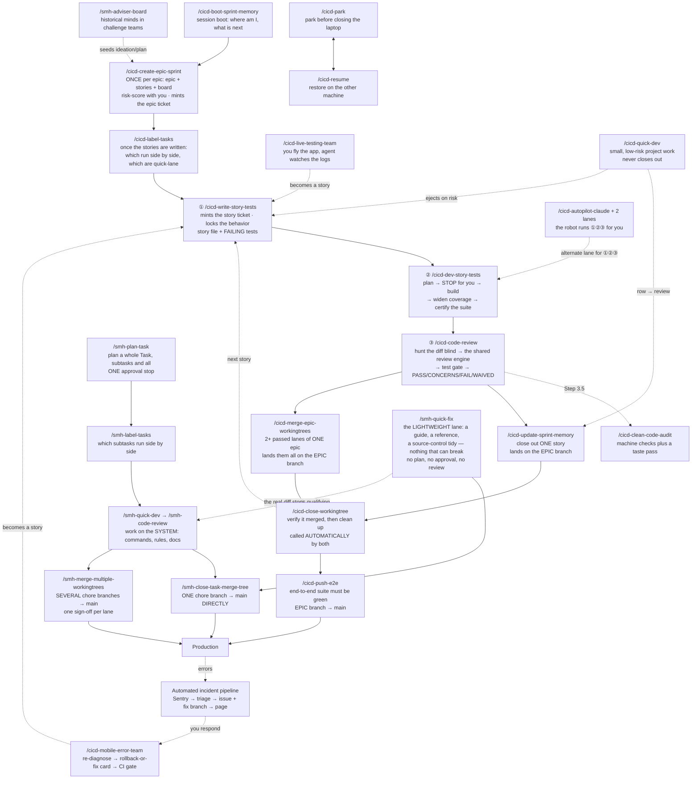

**The one thing to take from this map:** there are **two roads to production**, and they never
cross. Product work goes story → epic branch → `/cicd-push-e2e` → `main`. System work goes
chore branch → `/smh-close-task-merge-tree` (or, for a set of lanes, `/smh-merge-multiple-workingtrees`)
→ `main`. Which road you're on is decided in §5, and a machine check enforces it so you can't get it
wrong by accident. **Every box on this map has its own diagram in [Part VI](#18-every-command-one-diagram).**

---
---

# Part II — Choosing a lane

## 5. Which lane am I in?

**Answer this before you type anything.** It decides every command that follows, and it's the one
question the system will not answer for you at the end.

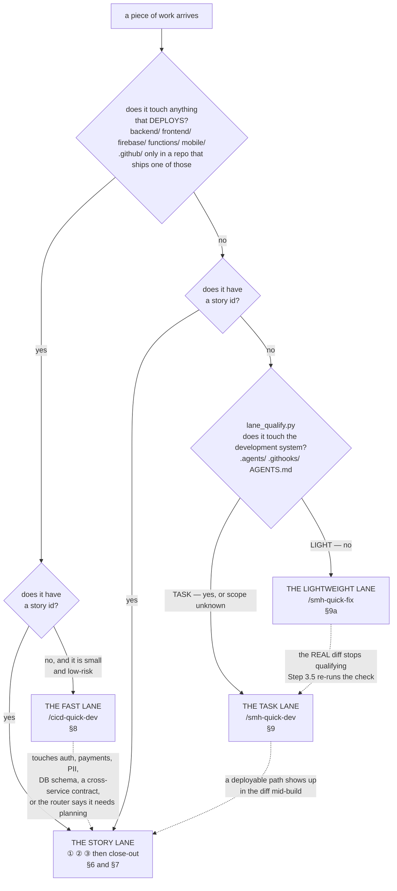

**Read the arrows, they matter more than the boxes.** Both dotted lines are **ejects** — tripwires
that fire mid-build and send the work back to the full loop. You do not get to argue with either one:

- The fast lane ejects on **risk, not size**. Login, permissions, payments, user data, DB schema, or
  a cross-service contract goes to the full loop no matter how small the change looks.
- The Task lane ejects the moment a **deployable path** appears in the diff. That is a product
  change whatever the ticket says, and the product has exactly one road to `main`. **There is no
  override flag, deliberately** — see [`task_preflight.py`](#the-checks-and-what-each-one-refuses).
- The lightweight lane ejects when the **real diff** stops qualifying. Step 0 judges what you said
  you would touch; Step 3.5 judges what you actually touched, so an under-declared scope is caught by
  `git diff` rather than by an agent's honesty.

### The four lanes side by side

| | Story lane | Fast lane | Task lane | ⭐ Lightweight lane |
|---|---|---|---|---|
| **For** | sprint features, bug stories | a small project fix, a docs/config change | the toolkit, rules, `/` commands, gates, docs | a guide, a reference fix, tidying source control — **nothing that can break** |
| **Build with** | ① `/cicd-write-story-tests` → ② `/cicd-dev-story-tests` | `/cicd-quick-dev` | `/smh-quick-dev` | `/smh-quick-fix` |
| **Review with** | ③ `/cicd-code-review` | built into `/cicd-quick-dev` Step 3 | `/smh-code-review` | **none** — the gates run, no verdict |
| **Plan + `approved`?** | yes | no — invoking it IS the skip | yes | **no** — invoking it IS the skip |
| **Branch** | `claude/<KEY>-<slug>`, off the epic branch | same, or `chore/<KEY>-<slug>` off `main` if ad-hoc | `chore/<KEY>-<slug>`, off `main` | `chore/<KEY>-<slug>`, off `main` |
| **Close with** | `/cicd-update-sprint-memory` (or `/cicd-merge-epic-workingtrees`) | **it does not close** — hands back to you | `/smh-close-task-merge-tree` | `/smh-close-task-merge-tree` — the same door, unchanged |
| **Code lands on** | the epic branch → `main` via `/cicd-push-e2e` | epic branch, via close-out | `main`, directly | `main`, directly |
| **Story file?** | yes | only on the story lane; never on the ad-hoc lane | no | no |

> ⓘ **Why the lightweight lane exists (2026-08-15, SCC-162).** Your ruling, during SCC-161: *"not
> everything is a full quick dev. sometimes I just want an agent to do something specific… this does
> not touch anything that can break. so we don't need to over engineer it."* SCC-161 was the proof — a
> doc-only edit that got a plan-first stop, a worktree, a self-audit and a failing assertion before you
> said *"we are editing a doc thats all."*
>
> The scope is yours too: *"only for the smh / commands, we need this for the command center not
> normal cicd work."* **No `cicd-*` flow gains a light mode**, and the check refuses outright in a
> project repo before it even reads the paths. The test is your sentence — ***things that do not
> affect our development system*** — and it is a script rather than a paragraph because the previous
> version of this rule was prose and agents talked themselves past it.

> ⓘ **Why the Task lane exists at all (2026-08-10, SCC-78).** Everything in the story lane is
> *BMAD-paired*: it needs a story file, a sprint board, an epic branch and a `review`→`done` flip,
> and it is barred from acting on the command centre at all. But a lot of real work is exactly that —
> move thirteen documents and rewrite thirty-two references, extend a commit gate, add a command to
> four platform menus. That work had **no story and no ceremony to hang it on**, and until SCC-78 the
> only thing it had was a close-out. You could *land* a Task properly; there was no defined way to
> *build* one. On SCC-74 that showed: the audit command had to be invoked knowing it did not apply.
>
> The prefix carries the permission and it is not cosmetic. Every `/cicd-*` command binds a rule
> saying *"operate on exactly one project — never the command centre."* Toolkit work lives **in** the
> command centre, so it needs the `smh-*` family, which is the one allowed to act on the repo you are
> standing in.

---
---

# Part III — The lanes

## 6. The story lane

Three commands — ①, ② and ③ — in order, each leaving behind what the next one needs.

*The same three steps as the map, but showing what each one leaves behind. The documents on the
right are how the next step knows what happened — they are the system's memory.*

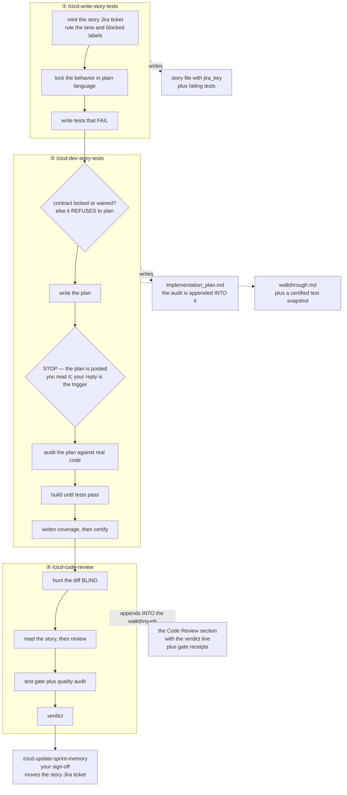

**Two documents, not ten.** Everything a story produces lives in exactly two files: the **plan** (the
pre-build audit gets appended into it) and the **walkthrough** (the review gets appended into it).

> ⓘ **Dense, not short — and no size limit (changed 2026-08-08, SCC-51).** Those two docs used to
> carry hard byte caps (8 KB / 10 KB). They are gone. The caps were set the same day the **audit**
> began appending into the plan, which quietly made it a two-author document — so the only way to
> stay under the cap was for the second author, the auditor, to cut findings. A plan that grew
> because the audit found eight real things is working correctly. **Length is never a reason to drop
> a finding, an acceptance criterion, or evidence.** What survives is the reason the caps existed:
> these files are re-read on every pass of the loop, so every line has to earn it — cut restatement
> and filler, never substance, and never split into a third file.

### Before the loop: `/cicd-create-epic-sprint` (once per epic)

Writes the epic and its stories, generates the sprint board, then risk-scores every story with you
P0–P3. That score decides how much testing each story earns ([§14](#14-how-we-test)). It mints the
epic's **Jira ticket** itself at kickoff — never an invented key: it reads the key from the ticket it
just created, and the branch is never cut unkeyed.

### ⭐ `/cicd-label-tasks <EPIC-KEY>` — run it once the stories are written

Tells you which stories you can run **side by side**, and which are small enough for the quick lane.
It reads every story file, works out what each will actually *change* (as opposed to merely
mention), and hands you the biggest group that touches no file in common — tagged `parallel-ok` on
the board so the group is one filter away, and `quick-dev` on the ones that do not need the full
loop. A story it could not assess keeps whatever labels it already had.

> **Renamed 2026-08-14 (SCC-155).** This was `/cicd-parallel-check`; that name is retired. It now
> has a twin for Task work — `/smh-label-tasks`, below in this section's Task-lane half.

**It never guesses.** A story with no file written yet gets "write the story first", not an opinion.
When two stories are ambiguous it locks them rather than approving — a wrong green puts two lanes on
the same file, a wrong lock only costs you running them one after the other. **The answer has a shelf
life and says so:** it stamps which stories it compared, so if you write another one afterwards the
old answer reads *"re-run me"* instead of quietly lying. **It only ever tells you — it never starts
anything.**

> ⓘ **Why it is its own command (2026-08-09, SCC-56).** ① used to decide this when it minted each
> ticket, and it could never have been right — it rules story 19.1 before 19.2 has even been written,
> so there is nothing to compare against, and it never looks again. Parallel-safety is a fact about a
> **group at a moment**, not about one story. A boolean also cannot express *"safe after AVCH-34"*.
> Proof it never worked: *zero* tickets ever carried the label.

### ① `/cicd-write-story-tests` — create the story, write the failing tests

▶ **Diagram:** [`/cicd-write-story-tests` in the command atlas](#cicd-write-story-tests) — every step, stop and refusal, checked against the live command.

**What it leaves you:** a story file carrying `jira_key:`, a locked behavior contract, and tests that
fail. Failing is the point — a test that has never failed proves nothing.

**⛔ It does not rule `parallel-ok`** — that moved to `/cicd-label-tasks` for the reason above.

### ② `/cicd-dev-story-tests` — plan, stop, build, widen, certify

▶ **Diagram:** [`/cicd-dev-story-tests` in the command atlas](#cicd-dev-story-tests) — every step, stop and refusal, checked against the live command.

**The stop at Step 2 is the whole point of this command.** It posts the plan link and waits: reply
`continue` to audit here and go on, `changed` after you have switched the model (it audits, then
stops again so you can switch back), or paste another team's audit path. It exists so you can switch
the model before the audit, or hand the plan to another team blind. **The agent can never switch the
model itself and must never offer to.** Step 0.7 refuses to plan at all without a BDD lock (with its
contract files actually on disk) or a recorded waiver.

**Step 4.5 is why ③ is fast.** The certification file records the exact SHA the full suite was green
on. If ③ finds that SHA still matches HEAD, it inherits the green instead of paying for the suite
again. Any code or test change after it voids the pair.

### ③ `/cicd-code-review` — hunt blind, then gate

▶ **Diagram:** [`/cicd-code-review` in the command atlas](#cicd-code-review) — every step, stop and refusal, checked against the live command.

**Why ③ hunts the diff before reading ②'s notes:** opening the builder's write-up first imports the
builder's framing — the exact blind spot the review exists to remove. Order is always *hunt cold,
then read the story.*

> ⓘ **Two steps the story lane was missing until SCC-166, and the one word that had to change
> when they were ported.** `/smh-code-review` had carried a **Step 0.7 blast-radius re-derivation**
> and a **Step 1.5 acceptance audit** since the Task lane was built; `/cicd-code-review` had neither.
> The hazard is not smaller here, it is the same hazard one branch further in: sibling **stories**
> land on the epic branch while you build, so the blast radius `/cicd-self-audit` traced that morning
> can describe a tree that no longer exists — every gate green, and a reference an epic-mate moved
> out from under you. Step 0.7 re-derives it and makes you answer three questions in writing
> (*did anything this diff references move · what is the true overlap and does `merge-tree` conflict ·
> which sibling lanes must land first*); **"nothing moved" is a reportable result**, not a reason to
> skip it. Step 1.5 audits the diff against the story's checkable list — an item with no evidence is
> **not satisfied**, and anything in the diff *beyond* the list is **drift**.
>
> ⛔ **The steps were adapted, not copied, and the difference is one ref.** A Task lane merges into
> `main`, so smh re-derives against `origin/main`. A story lane merges into `epic/<JIRA-KEY>-<slug>`.
> Pasting smh's step verbatim would have re-derived against a branch the story never meets — it
> reports "nothing moved" while the epic-mate that *did* move the file lands anyway, which is the
> exact stale-ref defect SCC-165 had just swept out of this command family. `tests/test_command_surfaces.py`
> now pins it both ways: cicd's step must name `origin/$EPIC` **and must not name `origin/main`**.
> *(SCC-166. Also on that ticket: `/cicd-push-e2e` stopped addressing one named human — six lines
> now read "the operator", so the instruction applies to whoever is actually reading it.)*

**The four verdicts, and what each one means for you:**

| Verdict | Means | Does close-out land it? |
|---|---|---|
| **PASS** | every required tier green, and the clean-code floor green on changed lines | yes |
| **CONCERNS** | soft issues only — bloat, duplication, an unowned TODO, a stale note, a review lens that never ran | yes, and they get recorded |
| **FAIL** | a new test regression, a required tier missing, a machine-floor error on a changed line, or a banned pattern shipped | **no — this is the only thing that blocks** |
| **WAIVED** | the project has no test baseline at all | yes |

> ⓘ **The split is deliberate: objective checks block a story, taste does not.** Taste gets recorded,
> argued, and fixed on its merits — never used to stall a story on a reviewer's preference.

> ⓘ **Where to read the findings, now that the engine runs the review (SCC-128).** The
> `## Code Review` table in the **walkthrough** is authoritative — it is the one with dispositions
> (`applied` / `deferred` / `dismissed`), and it is what close-out reads. The engine may *also* leave
> `[ ] [Review]…` checkboxes in the story file (or, on a Task, the plan) so the builder sees open work
> where they are already looking. That is a **worklist, not a second record**: it carries no
> dispositions, and where the two disagree the walkthrough table is right.

> ⓘ **Found ≠ owed — the triage decides what is actually worth implementing (SCC-160, your
> 2026-08-15 ruling).** The review's hunter agents are *pointed* at finding; volume is their
> success metric. For two landings running, every verified-true-but-unfixed finding was banked
> as a "deferred residue owed to ONE follow-on ticket" — 16 items and 9 items you were being
> asked to commission as tickets. That practice is retired. The triage step now owns a
> **relevance gate**: a true finding must show a realistic path to real damage, or undermine
> evidence the house cites as proof, or be something you asked for — otherwise it dies with a
> one-line reason in the findings table. **What survives is fixed in the lane, right there, before
> the verdict.** The first cut of this rule still allowed "rarely — proposed to you as one *decided*
> ticket", and SCC-160's own close-out handed you a "rule on Ticket A / Ticket B" row; you ruled
> that the same loop under a new name ("we need the fixes made in thread not a ticket made every
> story thats an endless loop that never finishes"). So: **a review never produces a ticket** —
> not residue, not proposed, not decided. The only thing that may leave a lane unfixed is a
> `defer` that names a structural blocker (another live lane owns the file · another repo · a
> decision only you can take), and it lives in `deferred-work.md`, not on the board. You should
> never again see a ticket-ruling row born from a review.

**Where the verdict lives:** a `## Code Review` section in the story's `walkthrough.md`. Stories
closed before 2026-08-02 keep it in the old standalone `sudo-code-review-<story>.md` file instead,
and that historic filename stays as it is on purpose — the files already exist on disk in the project
trees, so anything reading the fallback must name them as they are, not as the command is now called.

---

## 7. Landing and shipping — the close-out family

**This is the section people get lost in, so start with the one idea that resolves it.**

### There aren't four ways to close out — there are four *altitudes*

Each command below operates on a different thing. None can substitute for another.

| Altitude | The move | The command |
|---|---|---|
| **1. Lane → epic branch** | one finished story lands | `/cicd-update-sprint-memory` |
| **1. Lane → epic branch** | *several* finished stories of one epic land together | `/cicd-merge-epic-workingtrees` |
| **2. Disk cleanup** | verify merged, remove the worktree, delete the branch | `/cicd-close-workingtree` |
| **3. Epic branch → `main`** | the epic ships to production | `/cicd-push-e2e` |
| **3. Chore branch → `main`** | a Task ships | `/smh-close-task-merge-tree` |
| **3. Chore branch → `main`** | *several* finished Tasks land together | `/smh-merge-multiple-workingtrees` |

**Two facts dissolve most of the confusion:**

1. **Neither story close-out touches `main`.** They land on the **epic branch** and stop. Production
   is a separate, later, explicitly-gated act.
2. **You almost never type `/cicd-close-workingtree`.** Both story close-outs call it as their own
   last step. You type it by hand only when a cleanup was skipped or failed.

### Which close-out do I run?

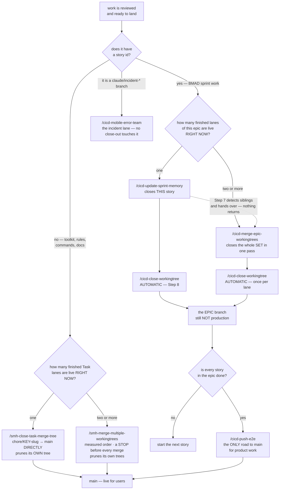

### What calls what

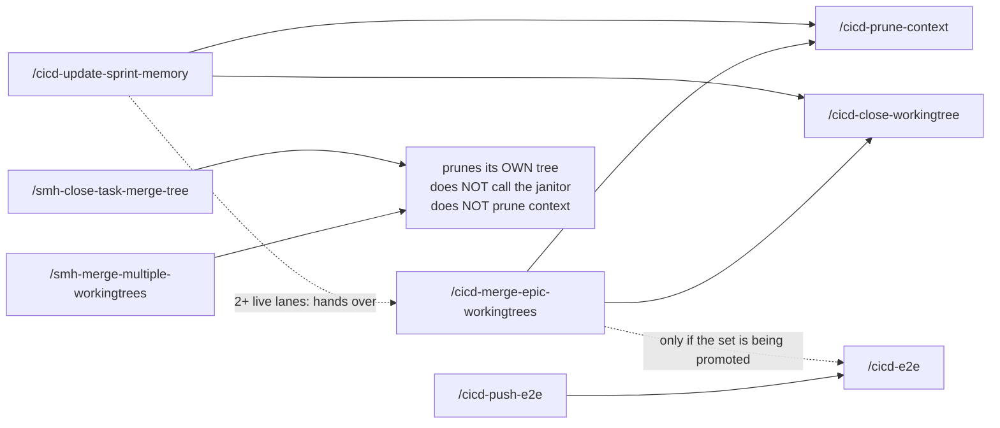

`/cicd-merge-epic-workingtrees` is **not a different close-out** — it *contains*
`/cicd-update-sprint-memory`'s per-story steps, wrapped in an overlap map and a combined gate the
solo version cannot do. The same holds on the Task side: `/smh-merge-multiple-workingtrees` runs
`/smh-close-task-merge-tree`'s ceremony once per lane, in a measured order, with a stop before each
merge and one combined gate on `main` at the end. Both Task doors prune their own worktrees and
deliberately do **not** call the janitor, which owns `claude/*` story trees only.

### `/cicd-update-sprint-memory` — close out ONE story

▶ **Diagram:** [`/cicd-update-sprint-memory` in the command atlas](#cicd-update-sprint-memory) — every step, stop and refusal, checked against the live command.

**Three things worth knowing before you run it:**

- **Only an objectively-red `FAIL` blocks the flip.** A pending live-test, live-QA or "stays review
  until X" note is **not** a blocker — your invocation resolves it. The command flips and records the
  note. There is deliberately **no "leave it at review and ask" branch**; punting the flip back to you
  is the failure this rule removes.
- **"Commit owed" is not a blocker either.** The agent commits its own work in the worktree, and
  Step 7 lands it.
- **It asks you for learnings only when it routed none itself (SCC-133).** If Step 3 found and filed
  the session's decisions and pitfalls, Step 6 prints the routed list and moves on; the "anything I
  missed?" question is reserved for a session that produced nothing to route.
- **A `claude/incident-*` branch is a STOP, not a landing (SCC-149).** That is the incident
  pipeline's lane; it lands through `/cicd-mobile-error-team`, never through a story close-out.
- **⛔ Do not push the `claude/*` branch to origin.** The landing pushes `HEAD:epic/...` only. A
  story branch reaches origin **only** via `/cicd-park` — that is park's whole purpose, and
  `/cicd-resume` reads the origin `claude/*` list to find in-flight work on a cold machine.

### `/cicd-merge-epic-workingtrees` — close out ALL of an epic's lanes at once

▶ **Diagram:** [`/cicd-merge-epic-workingtrees` in the command atlas](#cicd-merge-epic-workingtrees) — every step, stop and refusal, checked against the live command.

> ⓘ **Why this exists rather than closing lanes one at a time.** Up to four story lanes run at once,
> and lanes of one epic descend on the same surfaces. Closing them one-by-one without looking
> sideways ships what no single lane ever saw: two lanes editing one function, the same fix landed
> twice, board files colliding, and **semantic breaks git cannot see** — each lane green alone, red
> combined (a renamed fixture, a moved mount, a changed contract a sibling's test pins).
>
> **Expect exactly one conflict every time**, in `sprint-status.yaml`, spanning the set's story-status
> lines. Adjacent lines, different lanes, by construction. The resolution is mechanical, never
> judgment: keep the trunk's lines for already-landed siblings (their `done` is newer) plus this
> lane's own line.

**Invoking it — directly, or via `/cicd-update-sprint-memory` on the multiple-worktrees signal — IS
your sign-off** for landing AND flipping every story confirmed in Step 1. When it finishes there is
nothing left owed on the set: boards updated, stories `done`, trees and branches pruned.

### `/cicd-close-workingtree` — the janitor

**It moves no code.** It verifies a landing already happened, then cleans up. Both story close-outs
call it automatically; you type it only when cleanup was skipped or failed.

**Order is load-bearing and the numbering enforces it: SWEEP → PRESERVE → UNLINK → REMOVE → DELETE
BRANCH.** Every out-of-order variant of this command has destroyed something.

▶ **Diagram:** [`/cicd-close-workingtree` in the command atlas](#cicd-close-workingtree) — every step, stop and refusal, checked against the live command.

**Step 1.7 is the gate that stops the worst failure.** Step 1 proves the *code* landed; that is a
different question from whether *you finished the story*. Step 1.7 answers the second by reading the
story file's `Status:` — only a human close-out writes `done`.

> ⓘ **Why both checks exist.** `debug-2.2` sat merged-but-not-closed-out for five days while every
> planning surface recommended rebuilding it. Under the merge check alone its tree would have been
> pruned, erasing the last on-disk hint that the close-out never ran.
>
> **This gate has exactly two outcomes: AUTHORIZED, or a STOP with a named reason and the fix.**
> There is no third "the board looks ambiguous, checking with you" branch — that is the punt-hatch the
> gate exists to remove.
>
> **And why the sweep is wider than the slug you gave it.** On 2026-07-27 a single run found a dead
> husk still holding live junctions to the shared `.venv` and both `node_modules` (it had sat in the
> IDE side panel for a full day), and a **live tree holding 1,197 uncommitted lines** from a
> `/cicd-write-story-tests` run that never committed. The target slug's own tree was perfectly clean.

### `/cicd-push-e2e` — the one shipping command

▶ **Diagram:** [`/cicd-push-e2e` in the command atlas](#cicd-push-e2e) — every step, stop and refusal, checked against the live command.

**Invoking it IS your per-merge sign-off for the one epic it ships.** Since SCC-77 that sign-off is
also mechanical: the command mints a **single-use approval token** immediately before the final
push, and `.githooks/pre-push` refuses any push landing on `main` without one. The token is spent on
the way through, so one invocation ships exactly one epic. See the ⛔ block on the one-invocation
rule later in this section for what the gate checks and how to get past it when you need to.

`/cicd-e2e` also runs solo any time you want end-to-end confidence without shipping.

### `/smh-close-task-merge-tree` — the Task lane's close-out

**The half BMAD has no answer for.** A Task has no epic, no story file and often no sprint board at
all, so `/cicd-update-sprint-memory` has nothing to operate on and simply cannot close it.

▶ **Diagram:** [`/smh-close-task-merge-tree` in the command atlas](#smh-close-task-merge-tree) — every step, stop and refusal, checked against the live command.

**Typing it IS your merge sign-off** — the same contract `/cicd-push-e2e` carries for an epic. Since
SCC-118 the merge is a two-part act you never see: the merge commit goes to a throwaway `gate/main-<sha>`
ref, the command **waits** for GitHub's `main-write-gate` check to pass on that exact commit, and only
then mints the token (30-minute life, so it is minted *after* the wait) and pushes `main`. A red check
is a stop, never a `--no-verify`.

**⛔ But if an agent invoked it on its own (SCC-37, 2026-08-14), the invocation authorises
nothing:** the mint now refuses without your explicit, this-turn merge words passed verbatim
(`--operator-approval '…'`), or you typing the ticket key at a terminal. "You can move it to done"
is ticket permission, not merge permission — that exact misreading is what this closes. The words
you said are recorded in the token and printed back at mint and at push, so you can always see
what an agent claimed authorised a merge.

**⭐ You act in words; the agent does every board write (SCC-156, 2026-08-14).** `approved`, "its
done", or typing a command — that is your entire interface. Every Jira transition inside this
ceremony, riders included, is the agent's to run. **If a flow ever leaves you a ticket edit to do by
hand, the flow is broken** — the agent is required to stop and say so rather than hand it back. A
subtask whose work you ordered into the parent's lane is declared under `riders:` in the lane's
`task.yaml`; the preflight then warns (with the exact transition queued for the ceremony) instead
of blocking on it.

**⭐ A ticket can be merged and still not `Done` (SCC-155).** Step 4 no longer writes `Done`
unconditionally — it runs `jira_feed.py finish`, which reads the `## Your Actions` section of the
walkthrough it just filed. Anything left as an unchecked `- [ ]` there is something only **you** can
do, so the ticket is **HELD**: those items are posted to it as a *User tasks* comment, it gains the
`user-tasks` label, and it stops short of `Done`. The merge still landed — this is not a failure,
it is the board finally telling the truth about what is outstanding.

Before this, an operator action recorded in a walkthrough ("install the board column", "run the
memory audit") went `Done` along with everything else, and the record of what was owed died with
the lane. **Your exit is the checkbox:** finish the item, tick it to `- [x]`, commit that, and
re-run `finish`. There is deliberately no force flag — a gate with no legitimate exit gets worked
around, and this one's exit leaves a trail.

**⭐ And it now tells you when a row should never have been handed to you (SCC-163).** The rule was
already written: `## Your Actions` may leave you **three** things — a product decision, a main merge,
a ticket transition. A row asking you to *mint / file / rule on where a ticket goes* is the retired
defect, because an open box there holds the ticket on the review ladder forever. That was prose, and
it was broken the same day it was written (AVCH-58 shipped three such rows, none of them operator
calls). `finish` now prints a **⛔ BANNED ACTION ROW** banner naming the row and why.

**It is a WARNING, deliberately.** The hold is unchanged and the ticket still stops where it stopped;
what is new is that the close-out says the row should have been the agent's. A block here would fire
*after* the merge — trading a held ticket for an erroring close-out. `--strict-actions` turns it into
a refusal and **ships disarmed**; arming it is a separate decision. Two things you can run yourself:

```bash
python3 .agents/scripts/jira_feed.py check-actions --walkthrough <path>   # PC: `python`
```

no board, no network, exit 1 on hits — and it is what makes a sweep over every walkthrough in
`_artifacts/` reproducible. ⓘ **Status notes are deliberately NOT detected** ("X remains AVCH-55's,
still deferred"; "your local main is behind origin/main"). They are real defects — neither is an
action — but they read exactly like the context prose around a genuine item, and a detector that
guesses at them false-reds honest walkthroughs. Measured before the rule shipped: over the 101
walkthroughs in `_artifacts/` that carry the section, a naive phrase list flags 8 of 25 rows and at
most 4 are real, because *"Rule on A1"* is an acceptance dispute and *"Rule the landing order"* is
merge sequencing — both of which the rule **permits**.

It also **fails closed**: a missing walkthrough, or one with no `## Your Actions` section at all, is
a refusal rather than a clean close. An absent section is not evidence that nothing is owed. Write
the section even when it is empty. `finish` walks a ladder of holding statuses — `Review Required` →
`Awaiting Review` → `In Review`, first one the board carries. AVCH has `Review Required` today; SCC has
none of the three, so on SCC the `user-tasks` label is the at-a-glance signal. Adding a column in the
Jira UI is the whole install, and no code changes when you do.

**⭐ The close-out now leaves a flight event behind (SCC-133, under SCC-38).** Between the gate and
the merge, Step 2.5 runs `flight_recorder.py record`: one small file per lane under
`_artifacts/_main/workflow-events/<YYYY-MM>/`, keyed on the walkthrough's verdict sha, carrying the
changed files, the receipts, the walkthrough's decisions / pitfalls / follow-ons and three mechanical
fingerprints (a rules file rewritten · a receipt that **failed** — `warn` is advisory and does not
count · a script, command or rule that really exists, named in a pitfall). There is deliberately no
"verdict" fingerprint: CONCERNS merges and FAIL never reaches this step, so it could only propose
noise. The multi-lane door (`/smh-merge-multiple-workingtrees`, its 4b½) records the same event per
lane. Nothing reads across lanes today except this. When the same fingerprint shows up in
**three different lanes**, your next session start prints one `FLIGHT-RECORDER PROPOSAL` line for it —
phrased "this prose rule was rewritten in 3 lanes — commission the script that enforces it" — with
the tickets and shas as evidence. **What you should never see:** a ticket minted from it, a
walkthrough action row citing it, or a rule rewritten because of it. It is evidence for you (and for
the review's relevance triage); the operator's word decides. `flight_recorder.py candidates` shows
the whole ladder; a `record` failure never blocks a merge.

**⛔ The close-out never re-runs the LLM review (SCC-147).** One review per lane: the walkthrough's
`Verdict: … @ <sha>` stands, and Step 2's gate is the *mechanical* suite only. The review engine is
recall-first with no noise filter by design, so re-running it — on anything, including its own
fixes — always surfaces new findings, and "review until zero findings" is a loop that never ends.
New findings at close-out anyway? Triage by severity: `suggestion`/`nitpick` → record and merge
(a `defer` still names its blocker); only a `critical`/`important` in `decision_needed` or `patch`
stops it — and it gets fixed right there, never carried out of the lane.

**⭐ A cross-repo task can be blocked by the *other* repo's state (SCC-94).** If your `task.yaml`
declares `secondary_repos`, the preflight no longer treats it as a note — it goes and looks. It
refuses to clear unless that repo is reachable, its declared ticket key is one that repo's own
`jira.conf` answers to, it is clean and `0/0` with its origin, and its memory store passes the same
integrity contract the lobby's does. It also **warns when the other half has not landed yet**,
naming the ticket to merge first.

Write the row in **block** form and replace the `[]` — never leave an empty list above it:

```yaml
secondary_repos:
  - repo: AGY_AVIATIONCHAT
    landing: independent-task     # or retain-on-epic
    ticket: AVCH-53
```

> ⓘ **Why "unreadable" is an error and not a skip.** `secondary_repos` present but unparseable exits
> non-zero on purpose: *"I could not check"* must not share an exit code with *"there was nothing to
> check."* One is a question; the other is an answer.
>
> **And why the clean-and-pushed check has no substitute.** Submodules are configured `ignore = all`,
> so this repo's `git status` reads clean no matter what state the project half is in — nothing else
> in the toolkit looks. A detached HEAD is fine and expected (it is what `git submodule update
> --init` produces), so containment is checked against the remote rather than against a branch name.
>
> **The ordering warning is the load-bearing one.** A task that *deletes* what the other half
> receives depends on that order absolutely: land the deletion first and the received work is
> stranded against an unmerged branch in another repo. That is not hypothetical — it is exactly the
> AVCH-53 → SCC-88 dependency this section was written during.

> ⓘ **Why the E2E answer is mechanical.** The one thing making this command cheaper than
> `/cicd-push-e2e` is skipping the end-to-end suite, and the only honest justification is *nothing
> that deploys changed.* That is precisely the claim an agent is worst at auditing about its own work,
> so the script derives it from the repo instead of asking.
>
> **And why `--expect-key` is required (SCC-64).** On 2026-08-09 the preflight resolved a sibling's
> `chore/*` branch mid-close-out and returned a clean verdict. Merging on it would have put another
> lane's in-flight work on `main` under the wrong ticket. The script cannot catch that by itself — it
> has no way to know which ticket you meant. So now you have to tell it, and a mismatch is a hard
> exit 2 instead of a prose warning.

### The gate under all of it — how `main` is protected

*Everything above lands work. This subsection is about the one branch that is production, and the
four things that keep a merge to it honest: one typing = one merge; the merge must land where you
think; a single-use token carrying your words; and a server-side check for merges made on GitHub
itself. Read it once; the machinery holds the line afterwards.*

#### ⛔ One typing = ONE merge

Typing `/smh-close-task-merge-tree` authorises **the one task you typed it for**. It does not
authorise the next one, no matter how soon it follows. Same for `/cicd-update-sprint-memory`. Every
other merge to `main` needs you to say so directly.

#### ⛔ And the merge has to land where you think it does (SCC-97)

Two different things can go wrong with a merge, and the section above only covers the first:
**right branch, wrong authority** — and **right authority, wrong branch.**

Every guard in this system protects the branch you merge **from**: `--expect-key`, the preflight's
header line, and the "cwd is not intent" rule, which is written about which *tree you review*.
**Nothing checks the branch you merge onto.** On 2026-08-11 a `cd` in one step and a bare
`git merge` in a later one put a production merge commit on a **sibling lane's branch**, and
reported success — the output, the file list and the message all read correctly, because the message
says `-> main` only because someone typed that.

So: pass `-C "$REPO"` on every git call (a `cd` is not a lock across steps), and **assert the target
before merging**, so it stops you rather than informs you:

```bash
test "$(git -C "$REPO" rev-parse --abbrev-ref HEAD)" = "main" || { echo "NOT ON main — STOP"; exit 1; }
```

⭐ **Since SCC-144 a machine holds this line too, so you are no longer the only thing standing on
it.** The `commit-msg` hook refuses a merge whose target is not a legal destination for its source,
names the SCC-97 signature when it sees it, and prints `git merge --abort`. Two things worth knowing
before you rely on it: a **fast-forward** merge creates no commit, so no commit-time hook can see it
at all — that gap is covered separately at push time — and `git merge --no-verify` still goes
through, on purpose. The discipline above is what you type; the gate is what catches the day you
don't.

> ⓘ **If it happens anyway, do not reset and do not force.** The commit is usually correct in every
> way except which pointer moved. Check that its tree carries nothing from the wrong branch
> (`git diff --name-only <main-tip> <sha>`) and that its first parent is `main`'s tip
> (`git log -1 --format='%p' <sha>`), then `git merge --ff-only <sha>` from the tree holding `main`.
> The sibling branch keeps its uncommitted work untouched — which is what makes it recoverable, and
> why `reset --hard` would be the expensive move. Full detail in `.agents/rules/git-policy.md`.

> ⓘ **This got broken, and it is worth knowing how (2026-08-09, SCC-71).** In one long session the
> command was invoked **once** and then rode **six** merges (SCC-64 → SCC-69). Not defiance — the
> command's whole body stays sitting in the agent's context after you type it, and on task six it
> still looks exactly as valid as on task one. **A permission that arrives as a *document* doesn't
> expire when the task does.** Twice you typed the command to authorise the next merge and were told
> "already done": the sign-off was arriving *after* the merge it was meant to authorise.
>
> **What you should see instead.** When a task is merge-ready the agent stops with the branch pushed,
> gates green and preflight clear, and hands it back to you — then waits. If it reports a merge you
> did not authorise for *that* task, that is the bug, and the merge SHA's timestamp against your
> message is how you prove it.
>
> ⭐ **Now fixed mechanically (2026-08-10, SCC-77).** `.githooks/pre-push` refuses any push landing
> on `main` without a **single-use approval token**, and spends it on the way through. The two door
> commands — `/cicd-push-e2e` and `/smh-close-task-merge-tree` — mint it at their sign-off step,
> immediately before the push. One invocation, one merge, enforced by the machine rather than by
> reading.
>
> **What it checks**, in order — every refusal names its own reason:
>
> | Check | Refused when |
> |---|---|
> | armed | `MAIN-PUSH-ENFORCE` deleted or `DISABLE` present → passes through, deliberately |
> | destination | only `refs/heads/main`, whole-ref — so `epic/main-fix` never trips it |
> | exists | no token at all |
> | **⭐ approved** | **the token carries no operator-approval record (SCC-37)** — the mint refuses to write one without your verbatim words (non-interactive) or the key typed at a terminal, and the push prints the words back |
> | fresh | minted more than **30 minutes** ago |
> | same commit | the token names one sha and the push carries another |
> | **⭐ one merge** | **the push does not advance `main` by exactly one merge sitting on the remote tip** |
> | **⭐ named branch** | **the merge's second parent is not the branch the token authorised** |
> | delete / rewind | anything that would delete `main`, or force-push it backwards |
>
> ⭐ **The "one merge" check is the one that catches the six merges above — and the first cut of
> this gate did not have it.** Worth knowing, because the reasoning error is easy to repeat: a token
> authorises a **push**, and what needs authorising is a **merge**. Merge six branches into `main`
> locally, mint once, push once — the sha matches the whole way, and six merges land on one
> approval. That was reproduced during SCC-77's own review, against a real remote: one token, six
> merges, and the approval line cheerfully naming one of them.
>
> What actually holds the line is the shape of the history: `main` must advance by **exactly one
> merge commit sitting directly on top of what the remote already has**. Batching breaks it — the
> previous merge sits in between. Force-pushing a rewind breaks it too, which is why that is now
> refused rather than merely deleting being refused.
>
> Every refusal also **discards** the token, so a failed sign-off is spent rather than left lying
> around for a later push to match by accident.
>
> **Why it is a git hook and not a Claude hook.** The gate this replaced never ran once.
> `require-push-approval.py` was wired in `.claude/settings.json` as
> `powershell -Command "python …"`, and the Mac has **neither** binary — only `pwsh` and `python3`.
> It exited **127, silently**, on every push for weeks, along with all four SessionStart hooks. That
> silence is why six merges met no resistance. A git hook is the only layer both machines, all four
> agent platforms, and your own terminal share, so the replacement is **pure POSIX `sh`** with no
> interpreter anywhere in its path. The Claude-side hook is repaired too, but nothing depends on it.
>
> **What it does not do — worth knowing before you trust it.** An agent can write files, so an agent
> can write a token. This is not a security boundary against a determined agent and is not sold as
> one. It converts a *silent* violation into a *deliberate, traceable* one, and it closes the drift
> failure described above.
>
> ⭐ **The second half — merges made on GitHub itself (2026-08-12, SCC-118).** Everything above runs
> on a computer, at `git push`. A merge you perform in the **browser** — the green *Merge pull
> request* button — or that a web/mobile agent performs through the API happens on GitHub's servers
> and never touches your machine. The hook is not skipped there; it does not exist. That is how
> PR #2 landed on `main` on 2026-08-12: authorised, nothing bad in it, and no gate able to look.
>
> `main` now also requires a green GitHub check called **`main-write-gate`**, which runs the same
> enforcement suite plus a check that the merge came from an `epic/*` or `chore/*` branch with a
> real ticket key. **It is not a copy of the token gate.** The token proves *you said yes, once*;
> the check proves *the change is fit to land*. The token half genuinely cannot be moved to a
> server — it lives in `.git/`, and restricting *who* may merge does not work here because the web
> agent merges **as you**, on your own GitHub account. So the two halves guard different things and
> neither replaces the other.
>
> **What changes for you when you ship:** `/smh-close-task-merge-tree` now waits a couple of minutes
> for that check before it pushes `main`. It handles this itself — it sends the merge commit to a
> throwaway `gate/main-<sha>` branch, waits, then mints the token and pushes. Nothing new to type.
> If the check is red, **stop**; do not disable the ruleset to get past it.
>
> ⚠ **This covers THIS repo only.** `/cicd-push-e2e` ships project epics (AviationChat, etc.) and
> those repos publish no such check — adding it to one is that project's own ticket. It deliberately
> does **not** wait, or it would hang forever on a check that never runs.
>
> **If CI is down and `main` must move** — the server-side twin of deleting `MAIN-PUSH-ENFORCE`:
>
> ```bash
> gh api repos/{owner}/{repo}/rulesets                       # find the id
> gh api -X PUT repos/{owner}/{repo}/rulesets/<id> -f enforcement=disabled
> ```
>
> Re-arm it with `-f enforcement=active` the moment CI is back. `run_all.py` will fail on this
> machine for as long as it is disabled, which is the point — a disarmed gate should be loud.
>
> **If you are legitimately stuck:** `git push --no-verify` once, or delete
> `.agents/scripts/git-hooks/MAIN-PUSH-ENFORCE` to disarm it entirely. Both are loud and neither is
> hidden — going around the gate should be a decision, not an accident.
>
> ⛔ **On a NEW machine or a fresh clone, this gate is OFF until you arm it** — and so are the Jira,
> SOP and encoding gates. `core.hooksPath` is per-machine config; git never carries it, so a new
> checkout does not consult `.githooks/` at all. First command after cloning:
>
> ```bash
> git config core.hooksPath .githooks   # relative — an absolute path won't survive the next clone
> ```
>
> You will not have to remember: `run_all.py` asserts it is set and relative, so the enforcement
> suite is RED until you do. Off, but never quietly.

### The branch model underneath all of it

**`main` is what your users are running.** Everything else is short-lived by design.

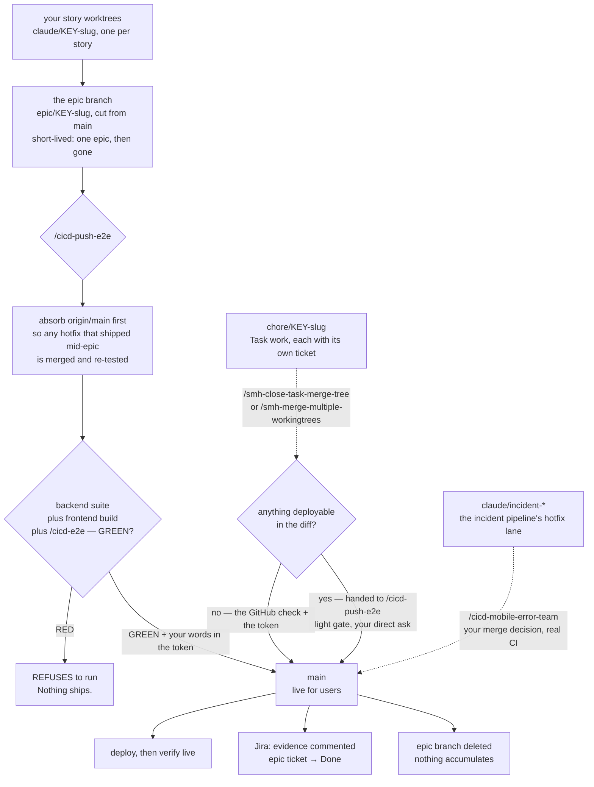

### ⭐ Every lane gets its own workspace — not just story lanes

**Changed 2026-08-09 (SCC-62). If a lane is going to commit anything, it gets its own worktree. No
classification, nothing to get wrong.**

Two things deliberately did **not** change:

- **Where a lane branches FROM is untouched** — a story still branches from its epic branch (never
  `main`), Task work still branches from `main`.
- **Each close-out still cleans up its own** — `/cicd-close-workingtree` for stories,
  `/smh-close-task-merge-tree` for Tasks.

> ⓘ **Why the old rule was backwards.** It decided who got an isolated workspace by asking *what kind
> of work this is*: a story lane got one, everything else was **forbidden** one and had to work in the
> shared checkout. But the thing that causes damage is **how many agents are in the repo at once**,
> and a small toolkit fix running next to a story collides just as hard — except it was the one told
> to sit where the collisions happen. The old wording also made the agent work out its own category
> and ended with *"unsure? you're not"*, which sent every ambiguous case into the shared checkout —
> the one place it must not go.
>
> On 2026-08-09 it went wrong twice in one afternoon: a close-out inspected a *different* lane's
> branch and reported it clear to merge (SCC-61), and the next Task opened onto a checkout still
> holding 11 of that lane's half-finished files (SCC-58).

**The one practical cost, solved.** A fresh workspace doesn't get the files git deliberately ignores
— `.env`, keys, `node_modules`. You can *see* them, but the test runner and dev server look for them
in the folder they're running in, so they fail. Run
`python3 .agents/scripts/link-worktree-assets.py <workspace>` (PC: `python`) and it points the new
workspace at the originals in seconds rather than copying gigabytes.

It warns you about the two cases that bite: a linked `.env` is **shared** — change it in one lane and
every lane sees it (`--copy-env` if that's not what you want) — and a shared `node_modules` is fine
day-to-day but the E2E suite needs its own. **Always `--unlink` before deleting a workspace**; both
close-outs do it automatically, because a delete that walks through a link destroys the *original*,
not the shortcut.

The linker also finds assets **one folder down** (`backend/.env`, `frontend/node_modules` — the real
AGY layout); before that fix it looked only at the repo root and would have quietly linked almost
nothing there.

### Where each check runs

| Gate | Where | When |
|---|---|---|
| Pull-request checks | GitHub Actions | every PR into `main` or an epic branch |
| **Jira key check** | local, armed git hook | **every commit** |
| Test-selection gate | local, before push | picks the affected tests; falls back to the full suite when unsure |
| **End-to-end gate** | local, via `/cicd-push-e2e` | **before anything reaches production** |
| Deploy | hosting CI/CD | on push to `main` |
| Incident pipeline | GitHub Action | when a real user hits an error ([§16](#16-incidents)) |

---

## 8. The fast lane — `/cicd-quick-dev`

For genuinely small project work: a fix, a docs/config change, a task that does not earn the full
pipeline.

**Accuracy over speed.** What it drops is the *pipeline* — the ATDD red phase, the full suite, the
three-reviewer panel. It does **not** drop the rigour.

▶ **Diagram:** [`/cicd-quick-dev` in the command atlas](#cicd-quick-dev) — every step, stop and refusal, checked against the live command.

**It never closes out.** On a story it advances the row to `review` on the way out and stops there.
On ad-hoc work with no epic it takes a `chore/<KEY>-<slug>` branch off `main` and **never creates a
story file** — hanging one off a finished epic silently reopens it. ① and `/cicd-label-tasks` mark
eligible stories with the `quick-dev` label, so the fast-lane pile is one board filter away.

---

## 9. The Task lane — work on the system itself

**The dev cycle for work that has no story, no sprint board and no epic branch.** Seven commands
— plan, label, build, audit, review, clean-code, close — and the prefix is the whole point: `smh-*`
is the family allowed to act on the repo you are standing in.

```mermaid
flowchart LR
    TICK["a Task ticket\nno story · no board · no epic"] --> PT["/smh-plan-task\nwhole Task, subtasks and all\nONE approval stop"]
    PT --> LT["/smh-label-tasks\nwhich subtasks run side by side"]
    LT --> QD["/smh-quick-dev\nworktree · checkable list · plan → approved"]
    TICK -.->|"a single lane"| QD
    QD --> SA["/smh-self-audit\nGO or NO-GO before a file is touched"]
    SA --> RED["write the assertion RED\na test, or a check a doc must pass"]
    RED --> GREEN["implement until GREEN\nmutants declared and killed"]
    GREEN --> EJ{"a deployable path\nin the diff?"}
    EJ -- "yes" --> OUT["⛔ eject → /cicd-push-e2e"]
    EJ -- "no" --> CR["/smh-code-review\nre-check main → blind hunt\n→ acceptance audit → the gate"]
    CR --> CCA["/smh-clean-code-audit"]
    CCA --> V["Verdict in the walkthrough"]
    V --> STOP["STOP — hand back"]
    STOP -.->|"your sign-off, ONE lane"| CLOSE["/smh-close-task-merge-tree"]
    STOP -.->|"your sign-off, SEVERAL lanes"| MULTI["/smh-merge-multiple-workingtrees"]
```

### One lane for a whole Task — the consolidated mode (SCC-164 · SCC-170)

**The problem it fixes:** every lane found real defects, every defect became its own Task, and the
queue grew faster than it drained — *"we are not developing 3 task for every 1 we try to fix."*

**The rule is `.agents/rules/work-consolidation.md`**, and it is **judgment, not a gate**. Six rules:
look for a home before you mint · when able, one worktree for the whole Task · verify the batch in one
block · artifact-first · two stops only · verify the outcome of a board write, never its exit code.

**Porting a file between the centre and a project — the plan answers six questions first (SCC-176).**
Every port so far (AVCH-54, AVCH-59) cost an afternoon and found the same class of defect: the
centre's copy is subtly wrong the moment it runs in a **submodule**, on **Windows**, in a
**worktree**, in a **thin** repo. `.agents/rules/port-checklist.md` turns that list into six checks,
each with the command that answers it — a git-given path used exactly as git gave it · `printf` not
`echo` · verify the FILE, not `$?` · no `.agents/rules/` path a thin repo lacks · `python3`-vs-`python`
and per-machine `core.hooksPath` · hooks stay repo-local and the port needs the target's **own** Jira
key. It runs in **both directions**: the port BACK to the centre is a port too.

The trigger is mechanical, never self-reported — `git diff --no-index -- <a>/<path> <b>/<path>`. 
`/smh-plan-task` MANDATORY RULE 5 makes the plan carry the section; `/smh-self-audit` Phase 1 and
`/cicd-self-audit` Phase 1 make its absence a **NO-GO** on differing copies. The one mechanical piece
is a `workflow_lint._RULE_POINTERS` row, which **warns** (exit 1) when a command describes a port and
cites nothing — the rest is prose an agent executes, and this page says so rather than implying a
gate that does not exist.

**What changes when you run a Task as ONE lane:**

| | Consolidated | Per-subtask |
|---|---|---|
| branch | ONE, keyed by the **parent** | one per subtask |
| plan | ONE, with a part section each | one each |
| `task.yaml` | `riders: [<every subtask key>]` | no riders |
| commits | **the subtask's key leads each commit** — its dev panel stays populated and a part reverts as a unit | the lane's key |
| gate | ONCE, at the tip, through the receipt writer | once per lane |
| close-out | ONE ceremony: riders flip first, parent last | one each |

`/smh-plan-task` **Step 2.5** picks the mode and says why. It cuts the tree from `origin/main` after a
fetch and immediately runs `git branch --unset-upstream` — branching from `origin/main` otherwise
points this lane's upstream at **main itself**.

**Shipping before every part is built — partial landing.** Write `landing_mode: partial` into `task.yaml`
and **trim `riders:` to the subset actually on the branch**. Then the trimmed riders flip, the
**parent stays open**, and the remainder becomes the next lane. `task_preflight.py` checks every
declared rider against the lane's commits and refuses one that leads no commit there; an unrecognised
`landing:` value fails CLOSED, so a typo blocks rather than relaxes.

**Adding a discovered part to the parent's index.** `acli edit --description` **replaces** the field,
and one such write silently deleted a part row from SCC-164 on 2026-08-15. Use:

```bash
python3 .agents/scripts/jira_feed.py index-row --key <PARENT> --line "  Part M  SCC-000  one line" --apply
```

It appends the row, reads the description back, and exits 2 naming any prior line that went missing.

### The lightweight lane — /smh-quick-fix

**Not everything on this side of the fence is a full Task.** Sometimes you want one specific thing
done — write me a guide, fix that reference, tidy this branch mess — and it touches nothing that can
break. Before SCC-162 an agent had two settings for that: the whole ceremony above, or improvisation.

▶ **Diagram:** [`/smh-quick-fix` in the command atlas](#smh-quick-fix) — every step, refusal and eject.

**What you type.** Either the command, or just say it — *"skip the plan, just do it"* names the same
lane, and the rule now points both at one definition instead of leaving the phrase dead-ending.

**What it does:** mints the ticket, cuts the `chore/<KEY>-<slug>` worktree, does the work, runs the
gates, pushes, writes a short walkthrough, hands back. **What it skips:** the plan, your `approved`,
the self-audit, the RED-first assertion, and the review verdict.

**What it will not do is ask your permission to start.** *"Shall I mint a ticket? Shall I open a
lane? Shall I write a plan?"* — that questioning is the over-engineering the ruling was against, and
it is now banned in the command body itself.

**The one thing it checks first is not a judgement.**

```bash
python3 .agents/scripts/lane_qualify.py --repo "$(git rev-parse --show-toplevel)" \
        --paths <the paths it will touch>                                   # PC: drop the 3
```

| It says | Meaning |
|---|---|
| `LIGHT` | do it |
| `LIGHT-VCS` | a declared source-control tidy that changes no files |
| `TASK` | it touches the development system → `/smh-quick-dev`, with a plan |
| `HANDOFF` | a deployable path → `/cicd-push-e2e` |
| `NOT-COMMAND-CENTRE` | you are in a project repo → the `cicd-*` lanes |

Two of those answers are there because of how this check could be gamed. **Naming no paths is
`TASK`, not "nothing to see"** — silence is unknown scope, and an agent that declares nothing would
otherwise be handed the lane. And the check is deliberately **blunter than the commit gate**: the
commit gate exempts the test suite (correctly — editing a test changes nothing *you* type), but
"needs a doc update" and "can break something" are different questions, and reusing one for the
other would have let this lane rewrite the enforcement suite.

**It still lands the normal way.** `/smh-close-task-merge-tree`, unchanged — there is no lighter door
to `main`, and there was never going to be one. A lane with no review verdict simply means that
close-out runs the whole gate itself instead of inheriting a green, which is the safe direction.

**And it can lose the lane it started in.** Step 3.5 re-runs the same check against the *real* diff
before the walkthrough is written. Anything but `LIGHT` and the work stops being lightweight then and
there: it continues on `/smh-quick-dev`, with a plan and your `approved`, keeping every commit
already made.

### ⭐ `/smh-plan-task <TASK-KEY>` — plan the whole Task, subtasks and all

**The Task lane's version of "write all the stories first."** The parallel question can only be
answered once every lane's plan exists — that is why the story side writes all the stories before
labelling. Task work had no equivalent step, so subtasks were planned one at a time and nothing
could compare them.

This plans the **whole** Task in one pass. It proposes the subtask breakdown and **stops** — it
never mints work you did not choose. On your go it creates each `Subtask`, and then for each one:
writes its implementation plan, audits that plan, cuts its worktree, pushes its branch, and points
its ticket at the plan. Then it labels the set and shows you the parallel table.

**It ends at ONE approval stop for everything.** You read every plan, every audit verdict and the
parallel table in one message, and your reply — **your actual words, quoted into each plan** —
is the approval. That batch is deliberately narrow: it covers exactly the plans that stop listed,
and if any plan is edited afterwards that lane stops for its own approval again. A lane that came
through a batch skips straight to writing its first failing check.

### ⭐ `/smh-label-tasks <TASK-KEY>` — which subtasks run side by side

The Task-lane twin of `/cicd-label-tasks`, and the same engine underneath. The difference is the
unit: it assesses the **Subtasks under one Task** rather than the stories under an epic. A subtask
is grounded by its branch diff, else the plan its `task.yaml` points at, else its ticket text — and
where the evidence is thin it locks rather than approves, the same way the story side does.

It stamps both labels: `parallel-ok` for the biggest group that shares no file, and `quick-dev` for
the lanes small enough to ship in one light pass. Run it any time; the answer carries the set it was
computed against, so a stale one reads *"re-run me"* rather than quietly lying. **It states, it
never starts.** Point it at an epic and it refuses and sends you to `/cicd-label-tasks`; point that
one at a Task and it sends you back here.

### `/smh-quick-dev` — assert-first development

**Its core discipline: something must be failing before anything is edited.** For a script that
means a real test. For a *document or a folder move* — which is most Task work — it means a
machine-verifiable assertion written first. That is as close to test-first as prose gets, and it is
the difference between "I moved the files" and "I can prove nothing broke."

▶ **Diagram:** [`/smh-quick-dev` in the command atlas](#smh-quick-dev) — every step, stop and refusal, checked against the live command.

### Mutation — how you prove the check you just wrote can actually fail

**A test you have never seen fail is a claim, not a check.** Step 2 gets you one honest RED; mutation
is what keeps it honest afterwards, and until SCC-145 the practice was **not named anywhere an
operator or an agent would look** — not in this page, and not in any command. It was one sub-bullet
under a rule headlined about certification SHAs, and the two Task-lane commands that *write* the
assertions never loaded that rule at all, so the doctrine arrived at review, one step after the
mutants had already been designed.

**The procedure, now a Step 3 obligation rather than advice.** Declare the table *before* you mutate
— each mutant, its file, and **the named case it must kill** — and run them as **one sweep**. A sweep
improvised one mutant at a time cannot check itself; a declared one can.

⭐ **And since SCC-179 you do not run it by hand — `.agents/scripts/mutation_sweep.py` does.** Every
rule in the table below used to be self-reported, and twice it was reported wrong: SCC-144's
timeout-killed sweep left a mutated gate on disk, and `8681d83` **committed and pushed a live mutant
into the gate** because the scoped `--case` re-runs never touched the mutated line. The script takes
the declared table as JSON and makes each rule mechanical — it refuses to start when a table file is
already dirty, restores in a `finally` and on SIGTERM, proves the end state twice (the pre-sweep bytes
*and* `git diff --quiet` against the pinned pre-sweep sha, never a moving HEAD), demands that a kill be
attributable to the **declared** case, and runs the full file unfiltered at the end. Running the sweep
by hand is now the defect, not the procedure.

```bash
python3 .agents/scripts/mutation_sweep.py --table _artifacts/_main/<folder>/sweep.json
```

Each row in the table names the mutant, its file, the **exact** text to replace (it must occur
exactly once — a non-unique anchor mutates a line you did not declare), the replacement, and **two
different labels**: `case`, the name that must appear on the runner's `FAILED:` line, and `block`,
the `c.block()` label passed to `--case`. Those are separate namespaces — the harness *selects* by
block and the sweep *attributes* by case — and conflating them produces a sweep that selects
nothing, exits 3, and correctly refuses to report a single kill. The script's own first sweep of
itself did exactly that on all eight mutants, then found three more defects in its cases once the
labels were right. It is worth reading that as the recommendation it is: **sweep the sweep's own
target file the moment you have one, and expect the first run to be about your tests.**

| The rule | Why it exists |
|---|---|
| A **surviving** mutant is a finding | the coverage hole you came to find |
| A mutant that **removes nothing** is **DEFECTIVE** — a SKIP that **counts as a survivor** | SCC-144's `M3` commented out one `echo` of a two-line message; the second line still printed the asserted word, so the case passed **correctly**. Read as a coverage gap it buys a test for a hole that does not exist |
| Mutants are **CODE-DERIVED**, never drawn from your own cases | case-derived mutants are circular — they prove only that the suite agrees with itself. Measured in SCC-144: its 14 case-derived mutants were all killed, and a later set drawn from the code left **24 of 25 surviving** — every survivor a hole the first sweep had reported as covered |
| **RESTORE** in a `finally`/trap; never start dirty; re-check `git status` after | a `timeout`-killed sweep left a **mutated gate on disk, uncommitted** — and a mutated gate is committable. **Enforced by `mutation_sweep.py` since SCC-179**, which also names the file it refuses to start on |
| A kill must be attributable to the **DECLARED** case | a non-zero exit only says *something* died. `--case "E"` once matched 40 blocks and the sweep recorded "killed by case E" for a case that never ran alone (SCC-156 #1), so a kill needs the declared label on the `FAILED:` line |
| The **FULL file runs unfiltered** before the next commit | `8681d83`: every scoped case green, the mutant still in the tree, and the bill was a red receipt, a diagnosis, a fix commit and another full suite run |

**Which technique fits which shape** — the part that used to be missing. *RELOCATE the guard* (never
delete it) is for a structural guard and a behavioral test in the same file. *INVERT the decision* is
for gates, hooks and shell checks, where there is nothing to relocate. *WIDTH* mutants — narrowings
rather than deletions — are what certifies a boundary; SCC-154 killed 17/17 existence mutants and its
review still found width unproven, so a second sweep of 7 narrowings had to run.

**How long a sweep takes, and why it no longer takes 21 minutes (SCC-156).** A mutant is a claim about
ONE case, so the sweep runs that case alone — `python3 <suite> --case "<block label>"` — instead of the
whole file. Read the three outcomes as distinct: **non-zero = killed**; **0 = re-run against the whole
file before calling it a survivor** (a mis-aimed label looks identical to a real hole); **3 = the filter
matched nothing, which is a sweep error, never a kill.** The mutant loop stays strictly sequential —
mutants edit shared files on disk. ⭐ **And the closing run is still the whole affected FILES, bare and
green**, after every restore is verified byte-identical: targeted kills prove each mutant died, only
that closing green proves the tree you hand back is the one you started with. Full doctrine:
`.agents/rules/tests-must-gate-for-real.md` **§ Mutation Testing**.

> ⓘ **Three sweep truths that landed with SCC-160 (fixed in-thread from the SCC-156 review).**
> A short `--case` label is a substring and can match many blocks — the transcript now prints
> `-- matched blocks: A | B | C --` whenever more than one ran, so a kill record reads the NAMES,
> never "killed by case P" when 22 blocks ran. **Ctrl-C now stops the suite** — queued files are
> cancelled and the children already running are terminated (before, an 88 s run could not be
> interrupted). And **an empty tests dir is exit 2, never `0/0 files passed`** — a checkout that
> lost its files cannot mint a PASS receipt.

### Subtasks — the ticket you were handed is the top-level one

**The rule, in one line: work your agent breaks out of a ticket goes UNDERNEATH it, not beside it.**
Flatten the pieces into more `Task`s under the grouping epic and you destroy the one fact that
mattered — *these are all one job*. Full law: `.agents/rules/jira.md` §Subtasks (SCC-119).

**What earns a subtask ticket: its own branch AND its own worktree.** Nothing smaller. A ticket with
no branch is a row nothing will ever write to — no commits, no Dev Record, no transitions — and that
is board noise. Three edits in one commit are not three subtasks.

**The two lanes differ, and the test is one question: does a durable breakdown already exist in the
tree?**

| Lane | What already holds the breakdown | Subtasks? |
|---|---|---|
| **BMAD story** (AVCH) | the story file's `Tasks / Subtasks` + its `sprint-status.yaml` row | ⛔ **NEVER** — mirroring it makes a second copy nothing syncs |
| **Command-centre Task** (SCC) | nothing — the ticket description **is** the spec | ✅ the only place it can live |

**What you will see:**

- **The agent proposes and stops.** It prints the set with the branch each would get, and writes
  nothing to the board until you say go. Placement stays yours.
- **Each subtask is its own lane** — own worktree, own branch, own review, own
  `/smh-close-task-merge-tree`. They land as they finish. **Unless you order otherwise (SCC-156):**
  say "do them in one working tree, one push" and the subtask becomes a **rider** — the parent
  lane's `task.yaml` declares it (`riders: [SCC-00]`), it ships no branch of its own, and the
  parent's close ceremony transitions it to `Done` first, parent last. You never touch the board
  for that: the preflight prints the exact transition as a warning instead of blocking, and the
  agent runs it inside the close you invoked.
- **The parent closes LAST.** `task_preflight.py` refuses to close it while any child is still open
  (a declared rider warns instead), and `/smh-close-task-merge-tree` re-checks with the board in
  hand before it writes `Done`. A child that is genuinely out of scope gets descoped to `Deferred`
  — that is the escape hatch, and it is deliberately not a `--force` flag.
- **A subtask is never labelled `Bug`.** If work under a parent turns out broken, the flag goes on
  the **parent** — the ticket that owns the job. `jira_feed.py flag` refuses a subtask and names its
  parent for you.
- **A subtask cannot have children.** Jira's floor. Needs its own breakdown → keep it as a checklist,
  or promote it to a `Task`.

### `/smh-code-review` — the Task lane's verdict

▶ **Diagram:** [`/smh-code-review` in the command atlas](#smh-code-review) — every step, stop and refusal, checked against the live command.

> ⓘ **Why the review re-checks `main` before it reviews anything (2026-08-10).** The audit you run
> *before* building traces its blast radius against the repo as it was that morning. Task lanes run
> several at a time, so by the time you finish, another lane may have landed and **moved a file your
> work points at.** Every test still passes — your code runs fine; it is the *references* that broke.
>
> That is not theoretical: it happened on the very task that built these commands. A sibling lane
> relocated this document mid-build, and two of the new commands still named its old address as the
> standard they load. Every gate was green before and after; only the re-check caught it.
>
> So the re-check is a **step**, not advice, and it lives inside `/smh-code-review` rather than being
> something you have to remember to run — an optional re-audit is one nobody runs, which is exactly
> how the memory cleanup sat unused inside the map command for weeks.

### `/smh-clean-code-audit` — the command centre's machine floor

**Why a separate command was needed at all:** `/cicd-clean-code-audit` checks `ruff`, `eslint`,
`pyrefly` and `tsc` — **none of which exist in this repo.** There is no venv here, no `backend/`, no
`frontend/`. Run the product version here and every check reports "skipped", which under its own rules
means *nothing was checked* — a floor made entirely of holes, reading as a pass.

So this one gates on what the command centre really has: the enforcement suite,
`workflow_lint.py --toolkit-only`, the SOP-currency check, "does this Python actually compile", the
link and anchor sweep, and **door parity** (does every new command exist on all four menus it
claims). Its judgment half checks the conventions **this page** defines.

> ⓘ **One limit, said out loud rather than papered over.** The product lane records each gate through
> `gate_receipt.py`, which writes a tamper-evident receipt proving a check really ran. **That tool
> cannot run in the command centre** — it looks for a BMAD sprint board and exits when it does not
> find one. So on this lane the evidence contract is pasted real output plus the commit it was
> measured on, recorded in the walkthrough. Same invariant, held by hand instead of by machine. If a
> code change lands after that commit, the verdict is void.

---
---

# Part IV — The machinery

*You almost never run any of this yourself. It matters because it's what makes the four claims in
[§1](#1-what-this-system-is) un-fakeable.*

## 10. The safety net — what checks your work

**A set of small programs plus four git hooks — three that block (`pre-commit`, `commit-msg` and
`pre-push`, carrying the encoding, lint, Jira-key, SOP-currency, merge-target and
`main`-push-approval checks) and one that records (`post-commit`, the map-drift journal)** — do the
checking that used to be a person holding eight rules in their head. The table below is the live list, and it outranks any count in
this sentence. What matters to you is *what they refuse to let happen.*

*Which safety check fires inside which command:*

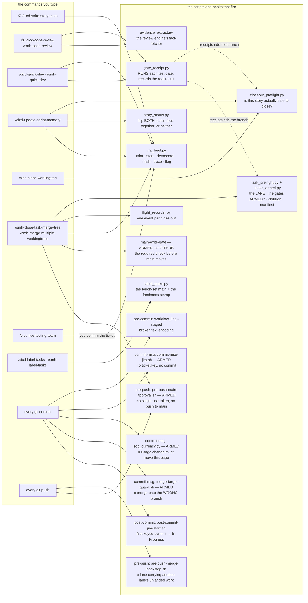

### The checks, and what each one refuses

| The check | What it refuses to let happen |
|---|---|
| `gate_receipt.py` | **A claimed test result that never ran.** It *executes* the gate and writes down the real exit code. There is deliberately **no way to hand it a verdict** — a receipt existing means the thing actually ran. It also separates *"the tool is missing"* from *"the tests failed"*, because a missing tool is a finding, not a free pass. It records whether the tree was **dirty** at the time, and **since SCC-178 it no longer counts its own receipt as that dirt** — the `<root>/gates/` directory it writes into is excluded from the measurement, so the second gate of a lane stops reading DIRTY off the first one's receipt and no lane pays a second full suite run to clear it. The exemption is that one directory: a sibling file, another lane's artifacts, and any code path all still record DIRTY. |
| `closeout_preflight.py` | **Closing out a story that didn't really land.** One command answers: did the code merge · is every repo clean and in sync · does the review verdict exist and does it still apply · do the files the story claims it changed actually exist. **Exit 2 means blocked.** A warning that says *"landing was NOT verified"* means exactly that — it is not a pass. |
| `story_status.py` | **A story marked done in one place and not the other.** Status lives in two files; this flips both together or neither. It refuses a downgrade, refuses an unknown status, and refuses outright if the two surfaces already disagree — that case needs `--reconcile`, which is a decision, not a default. |
| `workflow_lint.py` | **Broken characters quietly entering a document** — the `—` that turns into `â€"`. Runs on every commit, staged files only, so it stays fast enough that nobody disables it. Its `--toolkit-only` half also checks the toolkit against its own conventions, and **since 2026-08-11 (SCC-82) a clean run is `0 errors, 0 warnings` — exit 0.** |
| ⤷ `ap_reconciled:` | **Silencing the AP-twin check by touching the twin.** The `*-AP.md` robot-lane commands are headless adaptations of their primaries, and the linter warns when a primary was committed after its twin — *go and diff them.* The twin now writes `ap_reconciled: <primary-sha>` in its frontmatter — a claim you can audit — and the check goes quiet **only** while that sha is the primary's current one. |
| `commit-msg-jira.sh` | **A commit with no ticket.** Each repo declares its Jira project in `.agents/jira.conf`; a commit whose message carries no valid key for *that* repo — or the wrong project's key — is refused outright. A rejected commit is a no-op: your staged files are untouched, nothing to undo. Merges, reverts, and rebases are exempt (the branch name carries the key for them). ⛔ **That exemption was blind inside a worktree until SCC-144** — it probed for a MERGE_HEAD file under a hardcoded .git *directory*, and inside a worktree .git is a **file** pointing elsewhere — so that probe was always false there, and every lane in this system is a worktree. It asks git where its git dir actually is now. |
| `sop_currency.py` | **This page falling behind the system it describes.** Change a `/` command, a rule, a safety-net script, a commit gate, or the root `AGENTS.md`, and the commit is refused unless this file is staged with it. Say `[sop-ok]` in the message when a change genuinely alters no usage — that stays in the git log as the record of the call. It checks only that the two moved together; no program can judge whether the *edit* was right, and the point is to make you look while you still have the context. ⛔ **It shares the merge carve-out above, and shared the same worktree blindness until SCC-144** — which bit harder here: a merge cannot sanely be asked to stage the SOP doc, so an absorb-`main` merge inside a lane was being refused on a condition no author could satisfy, while the identical merge in the shared checkout sailed through. |
| `merge-target-guard.sh` | **A merge landing on a branch you did not mean.** Every other check on this page guards the branch you merge *from*; this is the only one that guards the branch you merge *into*. It refuses a merge whose target is not a legal destination for its source under the branch model — a `chore/*` lane landing on **another** `chore/*` lane is the SCC-97 signature and is named as such in the refusal, which also prints the target, the source, the rule and `git merge --abort`. — *and the history behind it, below.* |
| `jira_feed.py` | **A Jira ticket that is only a title.** ① mints the ticket with an outline rendered *from the story file*, and the close-out files a **Dev Record**: the decisions, the pitfalls, and what is still owed. Both write paths **read the ticket back** and fail if what they claimed to write is not there. **Exactly one Dev Record per ticket.** It also picks the ticket **type** for you ([§12](#12-the-board--what-runs-next)). Its `start` verb moves a ticket to `In Progress` and is **idempotent**, which is what lets three different seams call it without any of them double-moving a card. |
| `post-commit-jira-start.sh` | **A ticket that never shows as in flight.** Your first commit on a `chore/ · claude/ · epic/` branch moves that ticket to `In Progress` — see [§12](#12-the-board--what-runs-next). It reads the key from the **branch name** and never invents one; `main` and unkeyed branches are silent. It costs **one exchange per branch** on the normal path (a marker short-circuits the rest before any network call), it **can never block or fail a commit**, and an offline commit simply retries on the next one. A ticket that is not startable yet (`Blocking`, `In Review`, `Deferred`) deliberately writes no marker, so that branch re-reads once per commit until it is — the price of never silencing a ticket that might still start. |
| `task_preflight.py` | **A change to the product sneaking onto `main` labelled a "task".** It derives the lane from the repo rather than asking: does this repo **have** anything that deploys, and did **this diff** touch it? Touch one and it **stops dead and sends the work to `/cicd-push-e2e`. There is no override flag, on purpose.** It also checks the branch shape, the `--expect-key` match, the `task.yaml` manifest (a receipt already recorded blob-for-blob on `origin/main` is a **landed** lane's and no longer blocks follow-on lanes of the same ticket — SCC-113; an unlanded or edited-since-landing receipt still blocks hard), that the tree is clean and pushed, and that `origin/main` was absorbed. — *and the history behind it, below.* |
| `check_maps.py` | **The maps and INDEXes drifting from what is actually on disk.** Every level-2 folder must carry an `INDEX.md`, every backticked path in a **map's** table row must resolve, and the repo-map must still name every top-level folder. Ledgers under `_artifacts/` are exempt on purpose — their rows are history, and a row describing work that *deleted* something has to be able to name it. **That exemption is why a session-folder row is matched on its FIRST cell written with a trailing `/` (SCC-96):** anything else in the row is prose, and prose is where a ledger explains *why* — including by naming the memory a decision rests on. Matching prose instead made every memory slugged `story-`/`tea-`/`epic-`/`autopilot-` read as a folder gone missing, so the gate fired on exactly the behaviour the convention asks for. — *and the history behind it, below.* |
| `tests/test_command_surfaces.py` | **A `/` menu that lies — including a door that still reads last month's steps.** It holds the one-door-per-platform contract: every command has exactly one door on each platform its `platforms:` claims, none on a platform it doesn't, no ghosts, and the retired doors stay retired. Since SCC-166 it also holds the **review-twin contract** (`CS-11`): `/smh-code-review` and `/cicd-code-review` must each carry a blast-radius re-derivation *with all three written answers* and an acceptance audit *with its CONCERNS floor and the drift direction*, each Step 0 must echo `rev-parse` output rather than belief, and each twin must name **its own** integration ref — smh `origin/main`, cicd `origin/$EPIC` and never `origin/main`. The two files that part edited are also swept for a personal name (→ 0); the toolkit-wide sweep is a separate, confirm-scope task, because `rules/operator-profile.md` is a file where the name IS the subject. — *and the history behind it, below.* |
| `guard-cwd-escape.py` | **The agent quietly working on the wrong copy of the repo.** The Bash tool's directory persists between commands *until* one of them ends outside the workspace — `/tmp`, a scratch dir, another repo. The harness then puts it back to the MAIN checkout, and every path the agent writes from then on is relative to **main**, not the worktree it thinks it is in. ⛔ **Nothing errors**, because the same file exists in both copies — you get a well-formed answer about the wrong tree. It cost SCC-164 twice: a new script written into main, and main's stale 333-line copy of a test file read as the lane's 463-line one. This asks before any `cd` that leaves the workspace, and names the fix: wrap it in a subshell — `( cd /tmp && … )` runs the work in a child whose directory change dies with it, verified — or skip `cd` entirely and use `git -C <abs>` with absolute paths. It **fails open** on anything it cannot judge. *(SCC-182.)* |
| `tests/test_stale_base_refs.py` | **A command that diffs, counts or cuts against a `main` nobody refreshed.** `git fetch` moves `origin/main`; it does **not** move your local `main`. In a shared checkout that has sat for a week — or in any worktree, where `main` is whatever the main checkout last pulled — every `main...HEAD`, `merge-base HEAD main` and `worktree add … main` answers about a stale ref: the review reads the wrong diff, the "commits behind" count is wrong, and a lane cut from it is **born stale**. It scans every `.agents/commands/*.md` for `main` in operand position and fails naming `file:line`. ⛔ **Not every one is a defect, so a blanket `sed` is the wrong fix** — the `0 0` sync check `rev-list --left-right --count main...origin/main` deliberately asks about the LOCAL branch, and `origin/main...origin/main` would be a tautology that always passes. Those four live in an allowlist keyed on `(file, exact line text, reason)` — never a line **number**, which breaks on the next edit above it and lets a new hit inherit the old line's pass. The scan also asserts it read **≥ 10** files: an empty glob from the wrong CWD must FAIL, not count zero and pass. *(SCC-165: 25 operands found, 4 ruled correct-as-local, 21 fixed.)* |
| `tests/test_sops_prds_folder.py` | **The SOPs and PRDs going stale again.** Pins the 12-doc manifest in `docs/_scc_sops_prds/`, checks its `INDEX.md` against the directory in BOTH directions, verifies every markdown link resolves and every `/command` reference names a real command master, and asserts the SOP gate's two halves still point at the same file. — *and the history behind it, below.* |
| `pre-push-main-approval.sh` | **Anything reaching `main` without a fresh, single-use sign-off.** The `pre-push` hook refuses a push landing on `main` unless a token minted for that exact sha is present, and the token is spent on use — so one approval buys exactly one push. It closed the hole where six merges rode a single sign-off. *(Shipped 2026-08-10 by SCC-77; this row was owed and is added here.)* |
| `pre-push-merge-backstop.sh` | **A lane quietly carrying another lane's unlanded work.** The row above and the merge-target guard both act on a *commit*; a **fast-forward** merge creates no commit, so nothing at commit time can see it — and SCC-97's own recovery deliberately used `--ff-only`, so that path is not hypothetical. What a fast-forward cannot hide is the evidence: another lane's commits are now inside yours. So when you push a `chore/*` or `claude/*` lane, this refuses if any **other** lane branch is contained in it and is **not** reachable from `origin/main`. **Since SCC-163 an `epic/*` counts as one of those "other" branches — but only for a `chore/*` lane.** — *and the history behind it, below.* |
| `main_write_gate.py` | **A merge made on GitHub itself reaching `main` with no gate having run.** Everything in the row above happens on your computer, at `git push`; a merge performed in the browser or through the API happens on GitHub's servers and never touches your computer, so that hook is not bypassed — it is **absent**. This is the half that runs *there*, as a required check called `main-write-gate`: the real enforcement suite, the toolkit lint, and a check that the merge came from an `epic/*` or `chore/*` branch with a key this repo answers to (and, for a pre-flighted local merge, that `main` advances by exactly one merge of a genuinely pushed branch). — *and the history behind it, below.* |
| `tests/test_main_ruleset_armed.py` | **The GitHub half being switched off without leaving a trace in any commit.** The ruleset lives on the server and can be deleted or disabled from a browser; no file in this repo would change. This asks GitHub directly, on every suite run, and **fails hard** if the ruleset is missing, disabled, or has picked up a bypass actor — a bypass for "repository admin" would re-open the whole hole while still *looking* armed, because the agent merges as you. When it cannot reach GitHub at all (offline, no `gh`, no credentials) it prints `[SIGNAL]` and passes: that is refusing to claim knowledge it does not have, not a soft gate. |
| `hooks_armed.py` | **Every other check on this page reporting green while switched OFF.** **Five** ways a gate dies quietly, and it reports all five — the three below, plus the two SCC-140 added (an **orphaned flag**, tracked while the gate script it names is not; and an untracked **dispatcher**, so nothing calls the gate at all). — *and the history behind it, below.* |
| `evidence_extract.py` | **Nothing — and it is on this list on purpose.** It is the one entry here that is *not* a gate: it refuses nothing, no hook calls it, and you never type it. It is the review engine's fact-fetcher (SCC-123), and what it prevents is a reviewer reasoning about only the files it happened to open — it reads the changed files and their callers *first* and hands the lens a dossier. It is listed because this table calls itself the live list, and a script in `.agents/scripts/` missing from it would make that sentence false. |
| `split_sprint_status.py` | The one-time migration that shrank the board. |
| `wf_common.py` | Shared plumbing the others import. You'll never call it. |

### The incident history behind the checks

*Each check above earned its shape from something that went wrong. The table keeps the one-line refusal; this is the rest, verbatim, one aside per check — the review surface for anyone changing a gate.*

> ⓘ **`merge-target-guard.sh` — the rest of the story.** ⭐ **It runs from `commit-msg`, not from `pre-merge-commit`**, and that is measured rather than chosen: `pre-merge-commit` fires *before* git writes `MERGE_HEAD`, so it cannot name what is being merged in, and it never fires at all when the merge conflicts — the path a multi-lane landing hits constantly. `commit-msg` sees both. The two older gates on that hook **exempt** merges; this one runs on nothing else. ⚠ **It refuses only topologies it can positively judge:** an incident lane (`claude/incident-*` — the incident pipeline's only real shape; it MATCHES the `claude/*` glob, so it is positively classified by a carve-out ABOVE the story arm) is deliberately unjudged **with main or an epic** — the emergency hotfix onto `main` must never eat a refusal mid-incident (SCC-149) — but its four pairings with story and chore lanes are **positively refused** since SCC-154 (they previously fell to the unjudged default, which is where the SCC-149 review measured them), and the allow-note names the pipeline INSTEAD of the "outside the branch model" line it once contradicted itself with. **SCC-159 adds a fifth: `incident:incident`.** Two concurrent incidents plus a `cd` slip cross-landed one incident's hotfix onto the other's lane and BOTH gates waved it through with a friendly note; a sibling incident lane is not "the pipeline's business" but the SCC-97 wrong-target shape wearing a second incident name, and the pair is refused in both directions. The `incident:main` / `incident:epic` absorbs stay ALLOWED outright — that arm is what keeps an emergency absorb off the refusal path. An unclassified branch, or a source no branch name points at, is still allowed **with a line saying it declined to judge** — a gate that false-reds on the shipping path is one you learn to route around, and this repo has already shipped four of those. `git merge --no-verify` is the auditable override, deliberately, the same posture as `[sop-ok]`. *(SCC-144, 2026-08-13; incident pairs SCC-154, 2026-08-14.)*
>
> ⓘ **`task_preflight.py` — the rest of the story.** ⚠ **`.github/` counts only where something actually ships (SCC-118).** It holds machinery *about* a repo — CI, the gates — not a product, so in a repo with a `backend/`, `frontend/`, `firebase/`, `functions/` or `mobile/` a workflow edit can change *what* ships and still hands off, unchanged; in a repo with none of those it can deploy nothing. That distinction was invisible while the command centre had no `.github/` at all, and SCC-118 gave it its first one — after which the next close-out here was refused as "NOT task-lane work" and routed to `/cicd-push-e2e`, a command that binds a *project*, refuses the lobby, and gates on an E2E suite this repo does not have. A verdict nobody could comply with, so the two questions are now two lists. ⓘ **Its VERDICT line has two states, not three (SCC-140).** A `NOT CLEAR` verdict used to sit between `BLOCKED` and `clear to close out and merge`, and it was **unreachable**: getting there needed the gates to be off in a repo that claims them, but `hooks_armed.check()` files exactly that case as a blocking error, so `BLOCKED` always won. It also disagreed with itself — the text refused the merge while the exit code said *warnings only*. Deleted rather than pinned with a test: an assertion over unreachable code buys nothing and makes a dead branch look load-bearing. **The rule it was trying to state is unchanged and still enforced** — a repo that claims gates and is not running them never sees the word *clear*.
>
> ⓘ **`check_maps.py` — the rest of the story.** ⭐ **Since SCC-138 the Task lane's close-out RUNS it** — `check_maps.py --depth3-only --strict` is now a third line in the gate `task_preflight.py` prints, and a drifted INDEX **blocks the merge**. It had to be added because the gate could not fail on a linter it never ran: twice in one day the suite and the linter disagreed and only the linter was right — SCC-124 landed a session folder with no `INDEX.md` row and SCC-119 nearly did, both while `run_all.py` reported 21/21 PASS. ⛔ **Why the subset and not the whole linter.** A close-out runs from a **worktree**, and bare `check_maps.py` there exits 1 on two *guaranteed* false positives — `AUTO block is STALE` and `on disk but not in map: <lane-name>/` — because the repo-map comparison labels the workspace from the directory basename, and **its printed remedy would write your lane's name into the map bound for `main`.** `--depth3-only` runs the depth-3 INDEX reconciliation alone, which reads only the workspace root and never the CWD, so it is free of both. `--strict` is what makes it a gate at all: the bare `--depth3-only` exits 0 even when drifted, because SessionStart runs it as a nag and a nag that blocks would gate your boot. **So this gates INDEX rows only** — the AUTO block, level-2 INDEX presence and structure conformance are still yours to run with a bare `check_maps.py`.
>
> ⓘ **`tests/test_command_surfaces.py` — the rest of the story.** ⚠ That sentence was **true of the skill doors only** for *placement* until SCC-113's follow-on; the two *mirror* surfaces asserted the missing direction and never the misplaced one. For *ghosts* it was never true of any surface — `.agents/skills` and `.claude/skills` are unswept to this day. ⛔ **Two claims in this row were wrong and are corrected here (SCC-113):** it said opencode's sync *"keeps a door whose command was deleted, forever"* — it does not; `Invoke-ManifestPurge` (`sync-agents.ps1:822`) retires it on the next run, and the original claim came from reading `Sync-CommandDir` in isolation and stopping one line short of its caller. The true and narrower gap: `Invoke-ManifestPurge` (`sync-agents.ps1:365`) only removes **a name the last run recorded writing**, so a door that predates the manifest, was hand-dropped, or is genuinely this repo's own survives indefinitely and nothing else notices — which is exactly what the `project-own.txt` keep-list adjudicates, and the opencode ghost sweep honours it. That file is staged into `.agents/` by the first `sync-agents -Reconcile` **that finds orphans** (with none, it short-circuits and writes nothing) and **does not exist until then**; creating an empty one is not harmless, because an authored-but-empty list reads as "purge every unclaimed orphan" where an absent one blocks purging entirely. A hand-owned Antigravity workflow is exempt from placement only while the door **explicitly** declares that surface; since SCC-113 silence no longer counts as a declaration (absent `platforms:` used to parse as universal, so the exemption could be earned by saying nothing). **Since SCC-113 it also checks door CONTENT**, not just presence: a full mirror must be byte-identical to its command body, and a thin launcher is exempt only while it genuinely points at *that* body — the marker alone does not excuse drift. That gap shipped a live break. SCC-77 landed the armed `main` write gate without running `/smh-sync-agents`, so opencode and Antigravity kept the pre-token merge steps and would have walked into a push the gate refuses, with nothing telling them to mint one; SCC-94 had already recorded the same class of drift as *"noted, not fixed."* Claude and Codex never saw it, because their doors are launchers that read the brain live — which is exactly why a human spot-check missed it. The engine's hand-owned list is **read from `sync-agents.ps1`**, never restated, after a copied subset produced two false positives on its first run.
>
> ⓘ **`tests/test_sops_prds_folder.py` — the rest of the story.** ⚠ **One narrowing, added by SCC-118 and worth knowing before you trust a green:** its path check (T9) resolves backticked paths against what is actually on disk, and most of the docs' project-relative paths live inside the `Projects/` submodules. On **your machines** those are cloned, so it hard-fails on a dead link exactly as before — unchanged. On a **CI runner** they are not, and 4 of the 9 are private, so the runner has no way to clone them and its remedy (`git submodule update --init`) is not merely unrun but unavailable. There it prints `[SIGNAL] T9 cannot be answered on this runner` and asks nothing — inconclusive, not clean. So **doc links are gated by your local suite, not by CI**; a green CI check is not a claim about them.
>
> ⓘ **`pre-push-merge-backstop.sh` — the rest of the story.** ⭐ **Both halves of that sentence are load-bearing.** Without the `origin/main` half it would fire every time you absorb `main` after a sibling lands — the most ordinary thing a lane does. And it deliberately **never runs on `main` or `epic/*`**: landing `chore/X` on `main` means `chore/X` is contained and unlanded *by definition*, which is what landing *is*, so gating it would refuse the shipping path on every close-out. With no `origin/main` there is no reference point for "landed", and it says so rather than refusing. Since SCC-154 it also knows the **incident class**, and **SCC-159 narrowed that from a skip to a note**: a pushed `claude/incident-*` ref is the incident pipeline's business (`/cicd-mobile-error-team`), so its OWN commits are never judged — but the containment loop now runs for it too. Keyed on the pushed ref alone, the old skip waved an incident ref through carrying **anything**, while `merge-target-guard` refuses that same content at commit time as `story:incident` / `chore:incident`; a fast-forward makes no commit, so the ff variant of an already-refused merge escaped both gates — and escaped them hardest **during an incident**, when mistakes are likeliest. An incident ref carrying an unlanded chore, story or SIBLING INCIDENT lane is now refused; when an *unlanded incident branch* rides another lane the refusal stands as before, and either way the remedy names `main` via the incident pipeline, never "its epic/* branch" (the SCC-148 misroute the SCC-149 review caught this hook still prescribing). **⭐ SCC-163 closed the last gap in that loop: it enumerated only `chore` and `claude` branches, so an `epic/*` fast-forwarded into a `chore/*` lane rode to the remote with nothing looking** — `merge-target-guard` rules `chore:epic` a refusal, but a fast-forward writes no commit, so neither gate saw it. Reproduced against a real remote before the fix. **The widening is keyed on the lane class and that is the whole difficulty, not a detail:** three arms of the same judge table say an epic inside a lane is legitimate — `story:epic` (a story lane absorbing its own epic *is* `/cicd-park`, run daily), `incident:epic` (the everyday mid-incident absorb), and `epic:story` (a pushed epic is declined at the ref filter). A blanket widening false-reds all three, so only `chore/*` — the one class that integrates on `main` with an epic as genuinely foreign work — enumerates them. ⓘ **A pushed `epic/*` is still not judged at all, and that is a ruled omission rather than an oversight:** `epic:chore` and `epic:epic` remain escapable by fast-forward, because judging an epic push needs its own third candidate set (`claude/*` must be *excluded* for it, since stories landing on the epic is what an epic IS) and a false red there sits on the `/cicd-push-e2e` shipping path. Named in the script, pinned by case EP4. *(SCC-144, 2026-08-13; incident class SCC-154, 2026-08-14; epic class SCC-163, 2026-08-15.)*
>
> ⓘ **`main_write_gate.py` — the rest of the story.** ⛔ **It is not a copy of the token gate and must not be described as one** — the token proves *you said yes*, this proves *the change is fit*. The authorisation half cannot move to a server: the token lives in `.git/`, and restricting *who* may merge cannot work when the web agent merges under your own account. Covers **this repo only**; a project repo gaining the same check is its own ticket. *(SCC-118, 2026-08-12.)*
>
> ⓘ **`hooks_armed.py` — the rest of the story.** ⚠ Those last two are **flag-keyed**, so a gate with no flag — the encoding gate — is not covered by them; that gap is stated in the script's own docstring rather than papered over. `core.hooksPath` is per-machine and git never carries it, so a fresh clone reads an empty `.git/hooks` and *nothing* runs; every dispatcher in `.githooks/` ends `[ -x "$SCRIPT" ] || exit 0`, so a deleted or merely non-executable inner script makes the hook exit 0 with **no output at all**; and deleting a `<NAME>-ENFORCE` flag downgrades a gate from *reject* to *warn*, which reads as clean success because hook output is rendered nowhere you look. It asks **git** what is tracked rather than listing the directory — a listing cannot tell *"this gate was deleted"* from *"this repo never had it"*, and an early cut of this script reported ARMED on a repo whose three gate scripts had all been removed. It folds into `task_preflight.py`, which now prints `GATES: ARMED` or `NOT ARMED`; on a repo that **claims** gates and is not running them the words *"clear to close out and merge"* no longer appear at all. It **reports and never arms**: changing your git config for you would be worse than telling you, and the one-line remedy is printed. ⭐ **SCC-140 closed five ways it still said ARMED with the gates off.** The sharpest: it read the `<NAME>-ENFORCE` flags from the **index** while every consumer reads them from **disk** — `commit-msg-jira.sh` and `pre-push-main-approval.sh` both `[ -f … ]`, and `SOP-ENFORCE` is read by `sop_currency.py` as `.exists()` — so following this system's own documented disarm (*"delete `SOP-ENFORCE`"*) left the tool reporting ARMED while the gate had dropped to warn-only. It now asks **both**. A **tracked flag whose script is gone** is now the loudest finding rather than a silent skip (one `continue` was four separate defects: a script `git rm --cached`'d off the index while its flag stayed, a flag whose script was never tracked, a repo declaring a Jira project with **zero** gate scripts, and a flag whose declared dispatcher hook is untracked). Two **false reds** went with them: `git ls-files -- '.githooks/*'` crosses slashes, so a `README.md` or a nested helper became a *"required executable hook"* and hard-blocked close-out — the set is now direct, extensionless children only; and a `~` in `core.hooksPath` is expanded the way **git** expands it, instead of resolving under the repo and telling a correctly armed machine it was NOT ARMED. **Three things you will notice when you type it:** an unset `core.hooksPath` now prints **one** error instead of five (the four extras each said *"absent from the directory git actually reads (None)"* — noise wrapped around the one true line, on a fresh clone, which is the first time anyone reads this); the standalone CLI now **exits 1, not 2**, for a repo that never claimed gates, matching what `check()` already told the preflight — one state, one verdict; and a missing `git` binary is a sentence rather than a traceback.

**Run all their tests any time:** `python3 .agents/scripts/tests/run_all.py` (on the PC, `python …`) —
**28 test files, about 2,270 checks, measured 2026-08-15 — a minute and a half now that the files run in parallel (SCC-156)** — the suite prints its live totals, which outrank this sentence.

> ⚠ **This number had gone stale, and the gate was right not to catch it.** It read *"646 checks
> across 16 files"* until 2026-08-12. Adding a test file lands under `.agents/scripts/tests/`, which
> is an explicit exemption in `sop_currency.py` — so SCC-122's new test file moved the total from 16
> to 17 inside a commit that was correctly exempt from end to end. There was nothing for a blocking
> gate to block. A count like this one goes wrong through changes nobody should be stopped for,
> which is why the sentence above defers to what the suite prints. It then went stale **twice more
> on the same day it was corrected** — SCC-118 landed three test files mid-review, and SCC-123's
> review rebuild grew its own guard — which is the deferral proving itself, not a failure of it.

Full detail in
[`.agents/scripts/INDEX.md`](../../.agents/scripts/INDEX.md).

> ⓘ **Three design decisions that look like bugs until you know why.**
>
> - **"Did this change?" compares *content*, not commit IDs.** When a branch lands via a merge it gets
>   a brand-new commit ID but identical content. Calling that "stale" would make an honest gate cry
>   wolf until someone disabled it permanently.
> - **The encoding check can be told to stand down** on a file that legitimately contains those
>   broken-looking characters as data — the checker's own test fixtures, a doc quoting them. Without
>   that escape hatch, the gate would block every commit that touches the gate itself.
> - **Both new gates ship armed rather than warning first**, which breaks the usual advice. The reason
>   is specific to how you work: **hook output is invisible in VS Code.** A warn-only gate prints into
>   a pane nobody reads, so it looks exactly like a clean success — you'd have shipped the gate and
>   enforced nothing. Every one keeps a one-token exit instead (`[sop-ok]`, or `--no-verify`), because
>   a gate with no legitimate way out gets disabled permanently, and then nothing is checked at all.
>
> **And why a zero baseline matters.** Before SCC-82 two `workflow_lint` warnings had stood on `main`
> for weeks, and every close-out report carried *"2 pre-existing warnings"* as an excuse — which means
> nobody could read the next run without first holding a list of accepted noise in their head. **A
> gate with a non-zero baseline cannot tell you anything about your change.** If you see a warning
> now, it is yours.

> **⚠ Python is named differently on your two machines.** The **Mac** has **only `python3`** — no bare
> `python`, not in a script and not in your own shell. A python.org install on the **PC** has **only
> `python`** (Microsoft Store installs have both). So there is no single spelling that works
> everywhere: commands in these docs are written `python3`, and **on the PC you drop the `3`**. If a
> documented command answers *command not found*, try the other name before assuming anything is
> broken.
>
> **The gates themselves are immune to this** — every hook probes `python3 → python → py` and uses
> whichever exists, so the safety net works on either machine with nothing to configure. It is only
> the commands *you type* that differ. See [§13](#13-switching-machines).

### When another lane lands while you're mid-branch

Somebody else merging to `main` is normal and mostly free. What actually costs you a session is being
behind **on a file you also edited** — and "you are 7 commits behind" tells you nothing about which
case you're in, so a 30-second catch-up and a real hand-merge read exactly the same.

Both preflights now say which. When your branch hasn't absorbed the other side, they diff the two and
either tell you:

> `no file overlap: origin/main moved on 16 file(s), none of the 8 this branch touched — the merge should be clean`

or name the ones that collide:

> `2 file(s) changed on BOTH sides — resolve by keeping both sides' facts, never by picking a winner: docs/_scc_sops_prds/workflows_testing_SOP.md, .agents/rules/jira.md`

**"Keep both sides' facts" is the standing rule for these, not a suggestion** — parallel lanes record
*different true things*, so picking a winner silently deletes someone's work.

> ⓘ **Why it warns you at the gate and not the moment they merge.** A ping at merge time can't know
> whether it affects you — most merges don't — and interrupting a lane mid-flight is its own hazard:
> absorbing `main` early drags other people's changes into the diff your review is scoped on, and a
> `git merge` under a running dev server has wedged this system before. At the gate you've already
> stopped, so telling you costs nothing. And note the verb is always **merge**, never *rebase* —
> rewriting a branch that's been pushed is on the never list.

## 11. Is this review still valid?

A review is a statement about *specific code*. If the code changed afterward, the review describes
something that no longer exists. So every verdict is stamped with the exact version it examined.

*How the system decides whether a story marked "review" is genuinely ready:*

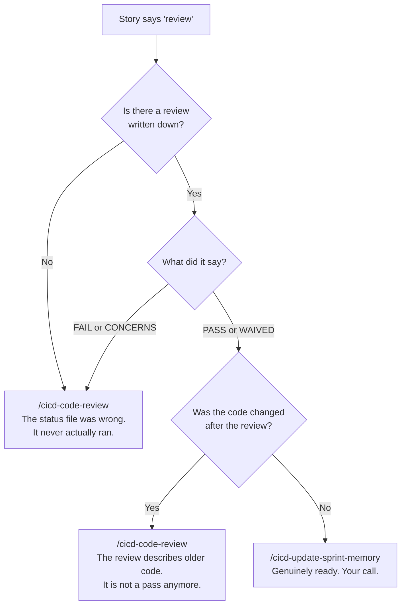

> ⓘ **Why this exists.** For a while the boot command answered "is this ready?" from the status file
> alone — which reads `review` whether the review passed, failed, or never happened. It cheerfully
> pointed at close-out for work nobody had reviewed. It now reads the actual verdict and checks the
> version stamp. Close-out still lets you land a stale verdict deliberately, because that call is
> yours — it just won't let you make it *unknowingly*.

## 12. The board — what runs next

The human-facing view of "what runs next" is the **Jira board** —
[SCC](https://sudo-command.atlassian.net/jira/software/projects/SCC/boards/2) for this command
center, [AVCH](https://sudo-command.atlassian.net/jira/software/projects/AVCH/boards/3) for
AviationChat. The sprint holds the current batch, the backlog holds everything else, and every ticket
links to its branches and commits through the key. How to drive it by hand:
[jira_manual.md](jira_manual.md); why it's built this way:
[jira_integration_guide.md](jira_integration_guide.md).

**Any agent can read and write the board — live.** There is no "export it for me" step: every
platform (Claude, Gemini, opencode, Codex, Antigravity) shells out to the authenticated `acli` CLI.
Ask "what's In Progress?" and the agent queries Jira and joins each ticket back to its story file
through `jira_key:`. The rule that teaches this: [`jira.md`](../../.agents/rules/jira.md).

**What did NOT retire: `sprint-status.yaml`.** It remains the machine-read sprint state — the story
loop, close-outs, `/cicd-boot-sprint-memory`, `/cicd-resume` and the autopilots all read it, and its
vocabulary (`descoped` vs `deferred-v3`, `ready-for-dev`) is richer than Jira's. The pairing between
the two worlds: the Jira summary carries the BMAD number (`21.4 — School code rotation`), the story
file carries `jira_key:` in frontmatter, and the branch carries the Jira key.

**Statuses are per board and they differ** — as of 2026-08-15 SCC runs `To Do · To Do Next ·
Blocking/Security Risk · In Progress · Done`, AVCH runs `To Do · To Do Next · In Progress · Review
Required · Deferred · Done`. There is no `Blocked` status on either board. ⚠ The SCC blocking status
was renamed from `Blocking` to **`Blocking/Security Risk`** on the board itself; `jira.md` still
writes the old name, so a JQL on `"Blocking"` returns nothing today — read the board, and expect
that rule to be corrected under its own ticket.

### The board moves itself — at both ends, since SCC-113

**You do not have to drag cards.** Until 2026-08-11 only *one* seam ever wrote `In Progress` (the
BMAD story lane, at ① pickup) while four wrote `Done`. Since every non-epic SCC ticket is a **Task**,
that meant work in this command center was *never* visible as in flight: a `chore/*` ticket sat in
`To Do` while you built it, then jumped to `Done` at the merge. Now:

| When | What moves it | To |
|---|---|---|
| **your first commit on a `chore/ · claude/ · epic/` branch** | the `post-commit` hook | **`In Progress`** |
| you run `/smh-quick-dev` (Task lane) | its Step 0.5, at worktree-open | `In Progress` |
| you run `/cicd-write-story-tests` ① (story lane) | its Step 1.6 | `In Progress` |
| you close a story / task / epic out | `/cicd-update-sprint-memory` · `/smh-close-task-merge-tree` · `/cicd-push-e2e` | `Done` |

**The commit is the trigger, and that is the point.** You don't always run `/smh-quick-dev`, so
hanging it on the command would have meant the board is only honest when you remember. Commit on a
keyed branch by any route — the command, a bare `git commit`, another agent — and the ticket moves.

**It costs one exchange per branch, ever.** A marker file short-circuits every later commit before
any network call, so this never slows your commits down. If you're offline the move is skipped
**silently** and retried on your next commit — same if the ticket isn't startable yet (it's sitting in
`Blocking`, say). Nothing is ever lost, a hook failure can never fail a commit, and each call is
capped at 10 seconds — three calls per move, so a dead uplink costs you at most ~30s on that one
commit, not a hang.

> ⚠️ **On the PC (or any fresh clone) this is OFF until you run `git config core.hooksPath .githooks`**
> — the same one-time arming every other hook here needs. That is exactly why `/smh-quick-dev` moves
> the ticket too: when the hook is dead, the command still works.

> ⛔ **If an agent tells you the board is unreachable, ask it to re-run outside its sandbox
> (2026-08-09).** A sandboxed tool call can't reach the OS credential store, so `acli` fails there
> while working perfectly in the same repo unsandboxed. Two agents hit this on one day and both read
> a fact about *their own shell* as a fact about *the board* — one reported a ticket didn't exist, the
> other declared the CLI "no longer authenticated" and proposed committing new work under **SCC-54**,
> a ticket that had already closed. `acli jira auth status`, unsandboxed, settles it in one line.
>
> **And a closed ticket's key is never free to borrow:** commits link to it through the branch name,
> and a close-out would overwrite the one Dev Record belonging to the work that earned it. Minting a
> fresh ticket is one command and always available.

### Where tickets come from, and what moves them

**Minting happens at exactly two seams:** `/cicd-create-epic-sprint` mints the **epic's** ticket at
kickoff, and ① mints each **story's** ticket at pickup — stamped with two rulings as labels:
`quick-dev` (fast lane allowed) and `blocked` (waiting on a linked blocker). The third label,
`parallel-ok`, has its own writer: `/cicd-label-tasks` ([§6](#6-the-story-lane)), which also
re-rules `quick-dev` for every story it assesses.

**Movement is automated at exactly three moments:** close-out moves the **story's** ticket,
`/smh-close-task-merge-tree` moves a **task's**, and `/cicd-push-e2e` moves the **epic's** to Done
with the evidence commented. Sprint and backlog *placement* stays yours; outside the two minting
seams, machinery only ever touches status.

### Two shapes of work on one board — and why it decides the command

Everything on the board is a **Story** or a **Task**, and that is not a label — **it decides which
command is able to close it.**

| | Story | Task |
|---|---|---|
| What it is | sprint work: a number (`19.2`), a story file, a BMAD epic, a `sprint-status.yaml` row | the toolkit, rules, `/` commands, IDE and skills work. No story file, no BMAD epic, in the command centre no sprint board at all |
| Branch | `claude/<KEY>-<slug>`, off the epic branch | `chore/<KEY>-<slug>`, off `main` |
| Closes with | `/cicd-update-sprint-memory` | **`/smh-close-task-merge-tree`** |
| The code lands on | the epic branch (then `main` via `/cicd-push-e2e`) | `main`, directly |
| Your sign-off | invoking the close-out | invoking the command |

A Task hangs under one of your grouping epics (`CI/CD Improvment`, `New Epic Feature or Fix`,
`Thin toolkit`) only because Jira offers no other container for it.

**The consequence worth knowing: `/cicd-update-sprint-memory` cannot close a Task, and never could.**
It reads a sprint board, flips a story status and lands on an epic branch — a Task has none of the
three. So Task work was being closed by hand, which is exactly why the tickets stayed empty.

You never pick the type by hand: `jira_feed.py` derives it when the ticket is minted, and
`jira_feed.py audit --jira-project <P>` re-checks a whole board at once.

### `Bug` is a flag, not a kind of work

It means *this ticket turned out to be broken.* Two things raise it: an audit that finds a live bug
and traces it back to the ticket that introduced it, or you, by hand. Either way the ticket comes
back out of Done wearing `Bug`, and the close-out puts it back to **Story or Task** — whichever it
actually is — once the fix lands, because the bug is gone.

**How a bug actually gets flagged, end to end.** `/cicd-live-testing-team` is where this lives,
because it is the one command that flies the running app: you click, it watches, and every symptom
becomes a researched bug doc that names *where the fix lives*. Those paths feed the trace.

```
you find a bug flying the app   ->  the agent traces the paths, shows you ranked candidates
                                    "SCC-31 · blame + log · last 2026-08-04"
you say yes                     ->  the ticket goes Story|Task -> Bug, comes out of Done,
                                    and carries a comment saying what broke and how you know
the fix lands, close-out        ->  back to Story or Task. The bug is gone.
```

> ⓘ **The agent stops in the middle of that on purpose.** It can find the ticket; it cannot know it is
> the right one. Git tells you who last *touched* a line, not who *broke* it — a typo fix a month
> later takes the blame, and flagging that ticket pulls finished work back into your queue for someone
> else's mistake. So the machine proposes and you confirm. **Raising a `Bug` is two commands**:
> `trace` reads git history and *proposes*; `flag` does the flip. If nothing is proposed, the bug has
> no ticket behind it: that is new work, not a reopen.
>
> A ticket already flagged is left alone rather than flagged twice, and a ticket that was still
> `In Progress` keeps its status — it was never finished, so there is nothing to reopen.

**One override worth knowing:** if a story has a live working folder on disk, it is in flight no
matter what the status file says. The status file lags by design — only close-out writes it.

> ⓘ **The scrum-board map is retired (2026-08-07, SCC-13 / AVCH-10).** `sprint_scrum_board_map.md` and
> its command are gone. **The command menu kept advertising it for two days after it was deleted** —
> the `/` index still listed `/sudo-update-scrum-board` under session ops with a full description,
> which is what sent you looking for a command that wasn't there. Removed 2026-08-09. The lesson is
> cheap and worth keeping: **deleting a command is only half of retiring it — the index that
> dispatches to it is the half people actually read.**

---
---

# Part V — Operations

## 13. Switching machines

You work one sprint across desktop, laptop, and phone. **Branches travel between machines; your local
working setup does not.** That gap is the entire reason this pair exists.

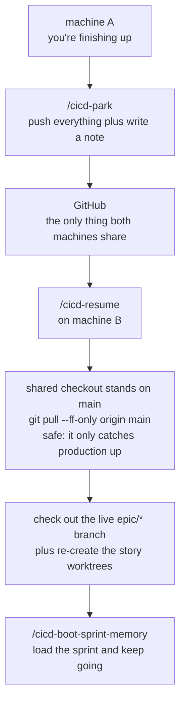

**Why the pull is boring now.** The shared checkout stands on `main` and stays there — always exactly
production. `git pull --ff-only origin main` from there can only catch it up to what already shipped;
it cannot promote anything. Story work never happens in the shared checkout anyway — it lives in
worktrees on the epic branch. Promotion to production happens through `/cicd-push-e2e` and nowhere
else, never as a side effect of picking your work back up.

> ⓘ Under the retired two-branch model this exact spot hid a trap: pulling the build branch while
> standing on `main` silently fast-forwarded production to 160+ unreviewed commits. With one
> long-lived branch, the trap has nothing left to spring on.

Two smaller things it handles: a fresh machine shows **no** work in progress even when plenty exists
(it's all on GitHub, not yet on disk), and resuming never deletes anything on your other machine.

### What does NOT travel between the machines

Git moves branches and files. It does **not** move your local git *settings*, your environment, or
your secrets. This is the category that produces "it works on the desktop but not the Mac" reports,
and every item below has already cost a debug cycle.

| | What breaks if it's missing | Fix — **once per machine** |
|---|---|---|
| **The commit gates** | `core.hooksPath` is *local* config and does **not** travel with a clone. Without it git reads `.git/hooks`, which is empty — so the Jira gate, the encoding gate, and the SOP gate are all **silently off** while the repo looks identical. | `bash docs/migrations/scripts/install-git-hooks.sh` (PC: `Install-GitHooks.ps1`) — arms the lobby and every project and **verifies** each gate (SCC-115). Or by hand: `git config --global core.hooksPath .githooks` — a **relative** value resolves against each repo's own root, so this one command arms every clone you have and every one you make later. |
| **Python's name** | The Mac has only `python3`; a python.org PC has only `python`. Typed commands differ; the gates don't (they probe). | Nothing to install — just use the name your box answers to. |
| **Secrets / `.env` / `auth_keys/`** | All gitignored, so a fresh clone has none of them and things fail in confusing ways rather than obviously. | Restore from the master bundle with `python3 docs/migrations/scripts/env_master.py --restore` (SCC-39; PC: `Restore-EnvMaster.ps1`) — start at the [migrations kit](../migrations/INDEX.md). Team-shared keys travel by **Keyway** (`keyway login` + `keyway init` per repo), never by chat: [sharing_keys_secrets_secure.md](sharing_keys_secrets_secure.md). |
| **Shell environment** | On the Mac, `.zshrc` is read **only** by interactive shells — anything an agent or script runs can't see it. | Put anything scripts need (e.g. `JAVA_HOME`) in `~/.zshenv`, not `.zshrc`. |
| **The Jira login** | `acli`'s API token lives in your **OS credential store**, not in the repo — and the binary isn't at the same path on both boxes either. An agent that trips over this concludes *"I have no Jira integration"* and starts improvising: inventing a key, or borrowing a closed ticket's. | `acli jira auth login`, once per machine. Then **any** agent can confirm it with `acli jira auth status`. Never hardcode the binary's path into a doc. |
| **The memory link** | The agent memory store lives **in the repo** (`_artifacts/_memory/`) — that part travels, and every model on every machine reads it at session start. What does **not** travel is the link that lets Claude's harness write into it: without it, Claude quietly writes memory to a machine-local folder and the shared store **stops growing** — no error, just lessons that never reach the other box or the other models. | `link-memory.ps1` (Windows) / `link-memory.sh` (Mac) — migrations kit §1, step 8. `/smh-memory-audit` checks the link on whatever machine it runs on and flags a missing one. |

**The rule underneath all six:** anything stored *outside* the repo is per-machine by definition. When
something works on one box and not the other, check this table before suspecting the code.

> **Setting up a machine?** The short version is
> [machine_setup_card.md](../migrations/install_guides/machine_setup_card.md) — arm
> the gates, check the Python name, restore what git doesn't carry. The full path for a genuinely
> fresh box is the [migrations kit](../migrations/INDEX.md).

## 14. How we test

Deterministic code — same input, same output — gets exact tests. AI-generated output gets **soft**
checks that look for meaning rather than exact wording, because demanding exact wording from a
language model produces a test that fails for no real reason. Anything critical is covered at more
than one level.

**Three things worth carrying in your head:**

- **Failing first is the point.** A test that has never failed hasn't proven it can detect anything.
- **Tests added to already-working code pass immediately** — that's correct. Don't manufacture a
  failure to feel better about it.
- **A test fed a value the real system never produces is a false green.** It passes and proves
  nothing.

**How much testing a story earns** is set by its risk score at epic kickoff — not by how the work
feels once you're in it.

### TEA tools — when to reach for one

You rarely call these directly; the ①②③ steps fire them in the right order. Reach for one solo only
when you want that single piece:

| Solo use | Why |
|---|---|
| `/tea` | Activates the Test Architect persona for a strategy conversation. |
| `/testarch-trace` | Shows which requirements have tests, without running a whole review. |
| `bmad-teach-me-testing` | Structured lessons, if you want to go deeper on method. |

One-time setup only: `/testarch-framework` (stand up a test bench) · `/testarch-ci` (scaffold the
automated pipeline).

## 15. The autopilot lane

*The robot running the same loop you'd run by hand — and how it picks back up if it dies halfway.*

▶ **Diagram:** [`/cicd-autopilot-claude` in the command atlas](#cicd-autopilot-claude-and-its-lanes) — every step, stop and refusal, checked against the live command.

| Command | Runs on | Notes |
|---|---|---|
| `/cicd-autopilot-claude` | the `claude` CLI | The canonical robot loop: Plan → Audit → Build → Review — four stages in **three** sessions (Build resumes the Dev chat on purpose). |
| `/cicd-autopilot-opencode` | the `opencode` binary | Port of the same loop. |
| `/cicd-autopilot-deepseek4` | `claude` CLI plus a flag | Runs the token-heavy building half on a cheaper model, keeps review on Claude. A *lane* of `/cicd-autopilot-claude`, not a third engine. |

The two QA stages run in **fresh sessions** so neither inherits the builder's assumptions — the same
reason ③ hunts blind in the human lane; the audit stage keeps the Dev model (a fresh *session*, not a
different model), and Build resumes the Dev chat so the plan is still in its head. **Done means
green (SCC-134, the spec's §6a):** a stage's gate is a script's exit code, never the agent's own
say-so; retries are engine-owned and bounded; a red gate parks with a receipt for you rather than
spawning a fix loop — that loop was *dropped, not deferred* on 2026-08-15, and reviving it would be a
design reversal, not a tuning knob.

**Stage 4 runs the house review engine (SCC-126).** The robot's reviewer no longer carries a review
of its own: `/cicd-code-review-AP` resolves the inputs — the diff alone first, then one batched
grounding pull — and hands them to `.agents/skills/code-review-engine/`, which runs its lenses in
parallel. **Since SCC-166 it also re-derives the blast radius against `origin/$EPIC`
before Ingest 1**, and echoes the branch and sha `rev-parse` returned rather than the ones the
launch context implied — the same two additions the human lane got, ported because the hazard is
*worse* unattended, not smaller: a sibling story lands on the epic branch and nobody is watching.
It costs no read budget (git output is not an ingest), and the twin's ban on a full-repo sweep is
about **reads**. The acceptance audit did **not** port as a step — the twin already runs that pass
through the engine's Acceptance Auditor — only its two verdict-binding clauses did. Nothing changes about what you type. Three things change underneath, and the first is the
one that actually moves the bill:

- **Stage 4 goes from one agent to an orchestrator plus five lenses.** It used to be a single
  reviewer asking three questions of context it already held. It is now five independent lenses,
  three of which are primed with the grounding pull — so the grounding material is read several
  times over rather than once. That is the real cost increase, and it is the price of the
  independence: lenses that cannot see each other cannot inherit each other's blind spots.
- **A fifth lens hunts literal correctness** — for every changed line it opens the real definition of
  each symbol that line leans on and checks the assumption actually holds. The other four lenses are
  high-altitude by design and glide over exactly this, which is where most missed defects live.
- **That fifth lens is the only one whose cost is unbounded by nature, so overnight it runs
  `lens_budget: capped`**: diff-scoped, 20 changed files, patch material spilled to a file past
  ~9,000 characters, and no top-up. Typed by hand it runs `standard` — the same caps, plus one
  top-up it has to earn by naming the file it wants and why. ⚠️ **`lens_budget` is not
  `review_mode`**: an autopilot review is normally `review_mode: full` *and* `lens_budget: capped`
  at once, and reading the first as permission to relax the second is the expensive mistake. **The
  caps live once, inside the engine's own step-01** — a caller names its budget and never restates
  the numbers, because a cap each caller repeats is a cap that drifts.

**It's resumable.** Re-run the launcher and it works out which stages finished by looking for their
*sections inside* those two documents, not for the files themselves. A half-written plan doesn't
count as a finished plan.

**The robot works in its own copy of the repo.** Every run opens the story's own worktree first, so
the robot is never typing into the same files as you or another lane. It looks like
`.claude/worktrees/<story>/`, on a branch named `claude/<TICKET>-<story>`.

**You launch it from the epic branch.** The robot cuts the story's branch from whatever the project
has checked out, and that has to be the epic branch — so switch to it first, or pass
`-EpicBranch epic/<KEY>-<slug>`. It refuses to start rather than guess, because a story branched off
`main` can't be landed.

**When it's green it commits, files the ticket, and stops.** It saves the work on the story branch
with an explicit list of files and a Jira-keyed message, moves the ticket to **In Review**, and writes
the Dev Record onto it. It still **never pushes**, never touches `main`, and never marks anything
`done`. Your end of it: read the walkthrough, the plan, and the ticket — then run
`/cicd-update-sprint-memory`.

> ✅ **Proven end to end.** The v2 engine has run a full four-stage pass on Story 14.2 (clean
> APPROVE, backend 1723 / frontend 270 passed, about $9). It is still Windows-hosted; on a new
> engine or a new project, start with `-DryRun`, then a small story with `-MaxStage 2`.

The engines live **per-project** and have drifted between projects — a behavior fix has to land in
each one. The claude and opencode engines are **twins by contract**: the worktree, commit and ticket
blocks are kept identical on purpose, so a `diff` shows drift straight away.

> The launchers are `/cicd-autopilot-claude`, `/cicd-autopilot-opencode` and
> `/cicd-autopilot-deepseek4` — hyphens, like every command since the SCC-63 naming law. **There is no
> separate mobile engine** (`/autopilot_mobile` was deleted 2026-08-07): from your phone you drive the
> desktop engines through Remote Control, which is strictly better — same code, same gates, one thing
> to fix when the loop changes.

> ⓘ **⛔ A green check can be telling you the truth about the wrong branch (2026-08-09).** When
> several lanes run at once, the checking scripts work out *which* repo and branch to look at by
> starting from wherever the agent happens to be standing and searching upward for the repo. **That
> starting point silently resets** — a `/compact`, a new slash command, a fresh tool call — back to
> the shared checkout. If a sibling lane has moved the shared checkout onto **its** branch, the check
> quietly points there instead.
>
> Nothing errors. The script has no way of knowing which ticket the agent meant, so it runs every
> check properly and reports a clean result — **about the wrong branch.** On 2026-08-09 a Task
> close-out printed *"clear to close out and merge"* for a different lane's unfinished branch.
>
> **What changed, so you can hold the agent to it:** every close-out command must say **which repo and
> which branch** it resolved — read out of `git`, not from memory — and **name the ticket it means to
> close** *before* it runs the check. If the check comes back pointing at a different ticket, it must
> **stop and tell you**, not retry. The same trap in miniature: piping a check into `tail` makes the
> computer report *`tail`'s* success instead of the check's, so a failed gate prints "passed". Gates
> now run unpiped.
>
> **The one thing to ask for:** if an agent reports a gate as green, ask which branch the gate named.
> A report that can't answer that hasn't been verified — it's been assumed.
>
> **Update (SCC-64): the machine now enforces this.** The Task-close-out check refuses to run at all
> unless told which ticket is meant (`--expect-key`), and blocks hard when the branch it resolved
> carries a different key. Each task can also carry a small `task.yaml` in its artifacts folder — the
> ticket, repo, and branch written down at task *start*, before anything can drift. Landed lanes leave
> their `task.yaml` in the tree, so a receipt already on `origin/main` blob-for-blob reads as history,
> not drift — a multi-lane ticket's next lane is not blocked by its finished siblings (SCC-113).
> Anything short of that positive evidence (unlanded, or edited since landing) still blocks hard. And toolkit
> close-outs run the lint scoped (`--toolkit-only`), so a red or green about some *product project's*
> sprint state can no longer leak into a decision about toolkit work. If an agent explains away a red
> gate as "pre-existing, different project", it is using the wrong flag.

## 16. Incidents

*Three layers, from fully automatic to fully yours.*

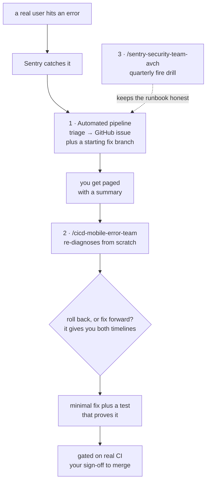

The responder **re-diagnoses independently** rather than trusting the automated triage — an automated
first guess is a lead, not a diagnosis. It stops twice for you and never merges on its own initiative.

`/cicd-live-testing-team` is the other half of this: it boots the app and watches the logs while
**you** click around, files researched bug reports, writes no code, and traces each bug back to the
ticket that shipped it ([§12](#12-the-board--what-runs-next)).

---
---

# Part VI — The command atlas

*Every command that matters to the dev process, one diagram each, and the maps that show how they
call, hand off to, and gate one another. Parts I–V explain **why**; this Part is where you look when
you are about to type something and want to see exactly what it will do, where it will stop for you,
and what it refuses. Every diagram here was checked against the live command file on 2026-08-15.*

**Reading the boxes:** a diamond is a decision the command makes; a box marked **STOP** is where it
waits for *you*; a box marked **⛔** is a refusal — it will not continue, whatever you say next; a
dotted arrow is a hand-off to another command; a shaded group is a set of steps that always run
together.

## 17. How the commands interact

Four views of one system. The first is the map you already saw in [§4](#4-the-lifecycle-map) — it
shows what hands **work** to what. The three below show what **calls** what, who **writes the board**,
and where each command **stops for you**.

### The call graph — what invokes what

*Solid: always. Dotted: only on a condition. The shaded engines are shared — one body, several callers
— which is why a fix in one lands in every caller at once.*

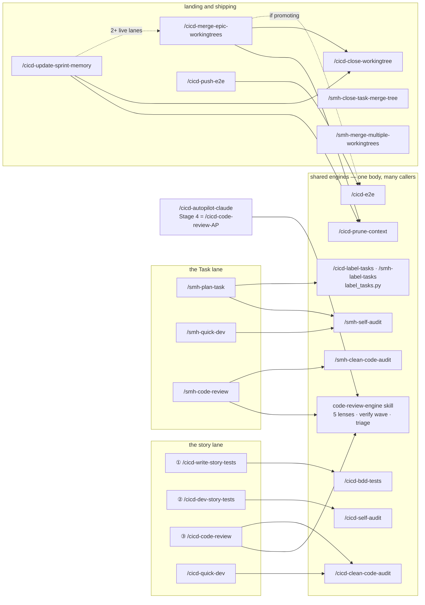

**Two things this graph settles.** First, `/cicd-code-review`, `/smh-code-review` and the autopilot's
Stage 4 are the **same reviewer** — the engine skill — fed different inputs; there is no "lighter"
review anywhere. Second, the two Task close-outs (`/smh-close-task-merge-tree`,
`/smh-merge-multiple-workingtrees`) call **nothing** — they prune their own trees and deliberately do
not use the story janitor, which owns `claude/*` trees only.

### Who writes the board

*You never drag a card. These are the only seams that move a ticket or change its labels; everything
else on the board is a comment.*

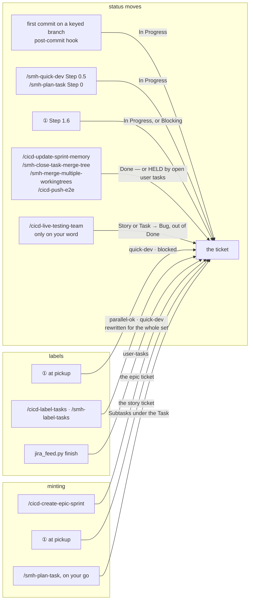

### Where each command stops for you

*The one table to read before an overnight run. "Stops" means the command will not proceed until you
speak; "refuses" means it will not proceed at all and names the fix.*

| Command | Stops for you at | Refuses when |
|---|---|---|
| `/cicd-boot-sprint-memory` | Step 0 if no project is named; Step 4 always (discovery only) | — |
| `/cicd-create-epic-sprint` | Step 3, **once per story**, for its P-level | never cuts an unkeyed epic branch |
| `/cicd-label-tasks` · `/smh-label-tasks` | never — it states and stops | pointed at the wrong unit (epic ↔ Task); a story with no file |
| `/smh-plan-task` | Step 2 (the breakdown) and Step 5 (**one** approval for every plan) | parent is an Epic or a Subtask; a NO-GO audit on any lane |
| ① `/cicd-write-story-tests` | Step 2 until the behavior contract is locked or waived | a "red" that is fiction (asserts something that does not exist) |
| ② `/cicd-dev-story-tests` | Step 2 (plan written — `continue` / `changed` / audit path); Step 2.5 only on real questions | no BDD lock and no waiver |
| ③ `/cicd-code-review` | never — it verdicts | an empty diff |
| `/cicd-quick-dev` | Step 1 (the acceptance list) and the end — it never closes out | the eject tripwire (risk, or ACs that will not fix) |
| `/smh-quick-dev` | Step 1 (the checkable list), Step 1.5 (`approved`), Step 1.6 (proposed subtasks), the end | a NO-GO audit; the eject tripwire (a deployable path) |
| ⭐ `/smh-quick-fix` | **the end only** — and never to ask whether to mint a ticket or open a lane; a `LIGHT-VCS` tidy still shows you what it will delete first | Step 0 qualification is not `LIGHT`: a project repo, a deployable path, a toolkit path, **or no paths declared at all**; Step 3.5 re-checks the real diff and ejects to `/smh-quick-dev` |
| `/smh-code-review` | never — it verdicts | an empty diff |
| `/cicd-update-sprint-memory` | Step 6 for learnings, only if none were auto-routed | preflight exit 2; a `FAIL` verdict; a red suite after absorbing the epic; an incident branch |
| `/cicd-merge-epic-workingtrees` | Step 1 to confirm the set; Step 5 learnings if none routed | a `FAIL` lane (skipped, the rest proceed); a red combined gate |
| `/cicd-close-workingtree` | never | branch not merged; story not finished (Step 1.7); a LOST tree |
| `/cicd-push-e2e` | Step 4 to summarize before the push | any gate red, `/cicd-e2e` included; stories still open |
| `/smh-close-task-merge-tree` | never — typing it *is* the sign-off | preflight exit 2; wrong `--expect-key`; a deployable path; the GitHub check red; an open child that is not a rider |
| `/smh-merge-multiple-workingtrees` | **before every merge**, once per lane | a stale lane (filtered); a conflict outside the overlap map; a red combined gate |
| `/cicd-park` · `/cicd-resume` | park: never; resume: never | park: a committable worktree; resume: a diverged `main` |
| `/cicd-autopilot-claude` | on `TESTS RED`, `PAUSED`, `COST CEILING`, `CRASHED` — parks with a receipt | a checkout not on the epic branch |
| `/cicd-live-testing-team` | Step 3.5 before any `Bug` flag; Step 4 keep-or-kill servers | — |
| `/cicd-mobile-error-team` | Step 4 (rollback vs fix) and Step 8 (the merge) | no incident runbook in the project |
| `/smh-memory-audit` | Step 4, **per item** | standing in a project (it binds the lobby store) |
| `/smh-sync-agents` | never | a project target (retired flag) |

## 18. Every command, one diagram

*Grouped the way you meet them: session and planning → the story lane → the fast lane → the Task
lane → landing and shipping → operations → toolkit upkeep. Each entry names what it calls, what calls
it, and where the longer explanation lives.*

### Session and planning

#### /cicd-boot-sprint-memory

*Start of a session on a project: where am I, what is next, which command does it need. Read-only —
it never writes the board and never starts work. Explained in [§12](#12-the-board--what-runs-next).
Hands to: whichever step the story is at, or `/cicd-resume` when the work is only on origin.*

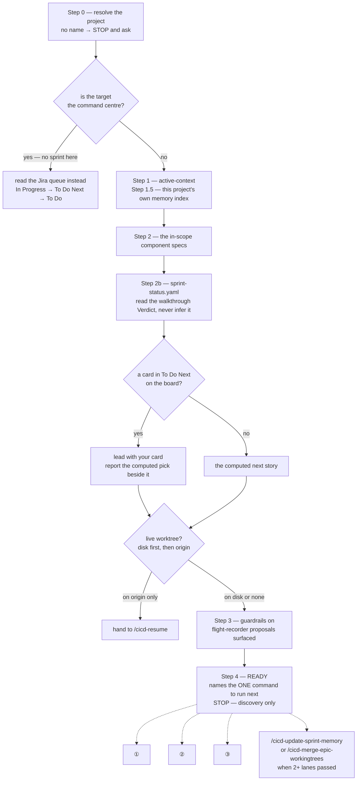

#### /cicd-create-epic-sprint

*Once per epic, with you in the room: write the epic and its stories, cut and push the epic branch,
mint the epic ticket, generate the board, then risk-score every story. Explained in
[§6](#6-the-story-lane) and [§14](#14-how-we-test). Calls: `bmad-create-epics-and-stories`,
`bmad-testarch-test-design`, `jira_feed.py`. Hands to: ① for the first story.*

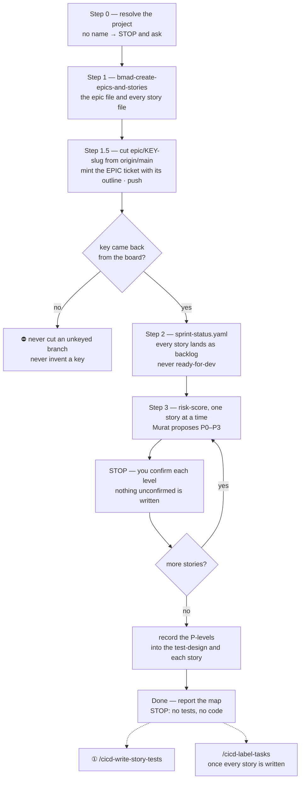

#### /cicd-label-tasks and /smh-label-tasks

*The same engine (`label_tasks.py`), two units of work: an epic's **stories**, or a Task's
**Subtasks**. Answers "which of these can run side by side, and which are small enough for the quick
lane" — stamps `parallel-ok` and `quick-dev` on the board, records what it compared so a stale answer
says so, and never starts anything. Explained in [§6](#6-the-story-lane) and
[§9](#9-the-task-lane--work-on-the-system-itself). Called by: you, and `/smh-plan-task` Step 4.*

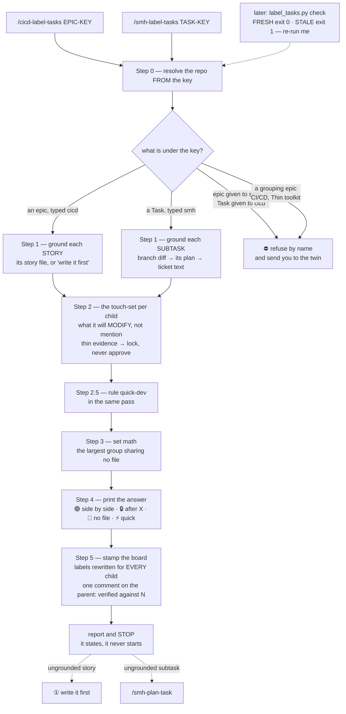

#### /smh-plan-task

*Plan a whole Task and its subtasks in one pass, so the parallel question can be answered before any
lane starts. Proposes the breakdown and stops; on your go, mints the Subtasks and, per lane, writes
the plan, audits it, cuts and pushes the worktree, points the ticket at the plan; labels the set;
then **one** approval stop for everything. Explained in
[§9](#9-the-task-lane--work-on-the-system-itself). Calls: `/smh-self-audit`, `/smh-label-tasks`,
`jira_feed.py`. Hands to: `/smh-quick-dev` per lane, which skips its own approval stop for a lane
that came through this batch.*

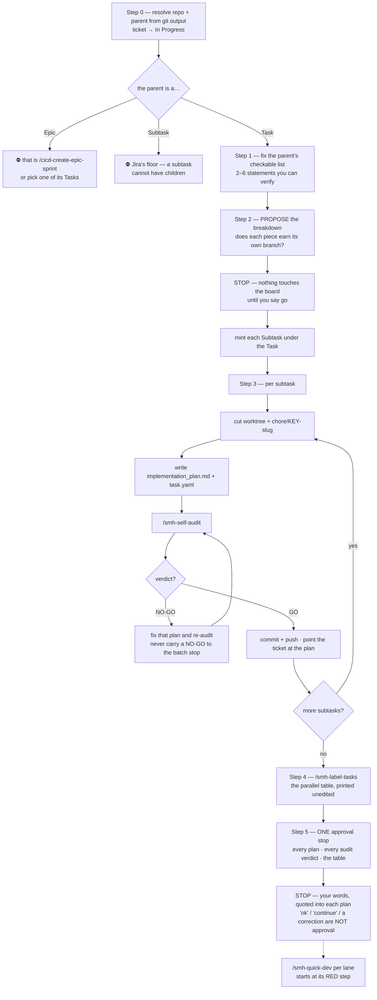

### The story lane

#### /cicd-write-story-tests

*① — create the story, mint its ticket, lock the behavior in plain language, write the tests that
FAIL. Explained in [§6](#6-the-story-lane). Calls: `bmad-create-story`, `jira_feed.py mint / start`,
`/cicd-bdd-tests`, `bmad-testarch-atdd`. Hands to: ②. Called by: you, or the boot's recommendation.*

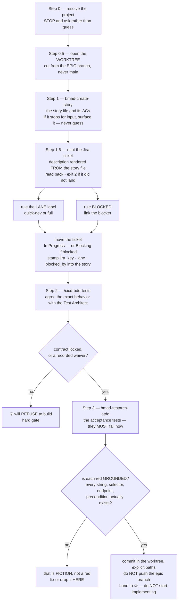

#### /cicd-bdd-tests

*The BDD Vision Lock — an interactive session that hashes out exact expected behavior until it is
100 % understood, then writes it as contracts **inside** the story's red tests, or records an
explicit waiver. ② hard-gates on its output. Explained in [§14](#14-how-we-test). Called by: ①
Step 2, or you.*

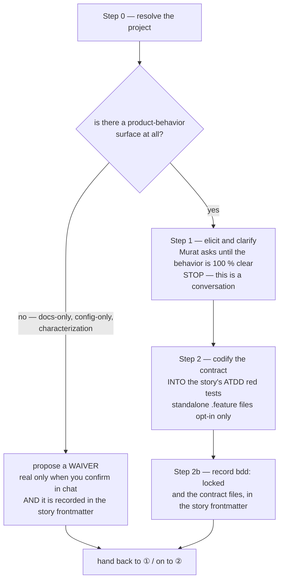

#### /cicd-dev-story-tests

*② — plan, stop, build, widen coverage, certify. The stop at Step 2 exists so you can switch the
model before the audit or hand the plan to another team blind. Explained in
[§6](#6-the-story-lane). Calls: `bmad-dev-story`, `/cicd-self-audit`, `bmad-testarch-automate`.
Hands to: ③.*

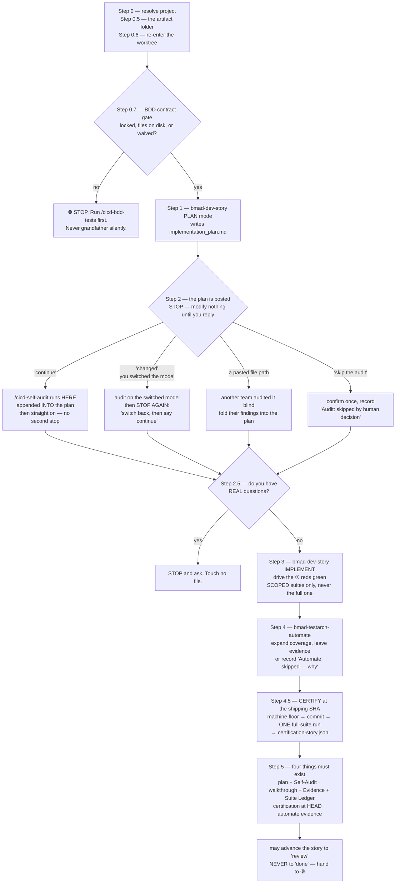

#### /cicd-self-audit

*The pre-build stress test of a plan against the real code — blast radius, over-engineering,
pre-mortem — ending in `GO` or `NO-GO` written **into** the plan. Explained in
[§6](#6-the-story-lane). Called by: ② Step 2 (automatically), or you.*

```mermaid
flowchart TD
    S0["Step 0 — resolve the project"] --> P0["Phase 0 — scope, right-size, AC coverage\nthe right-size gate is the point:\na trivial plan does not earn every phase"]
    P0 --> P1["Phase 1 — blast-radius trace\nwho else breaks if we change this?\nasks the code graph — stale-checked —\nand hand-checks a 'nothing breaks' answer"]
    P1 --> P2["Phase 2 — AI-drift and over-engineering gate\nSTRICT — default NO-GO"]
    P2 --> P3["Phase 3 — pre-mortem\nfull audits; light only when state is involved"]
    P3 --> P4{"Phase 4 — verdict"}
    P4 -- "GO" --> GO["append ## Self-Audit + Audit verdict: GO\nINTO the plan · findings baked inline"]
    P4 -- "NO-GO" --> NOGO["append the verdict and the fixes\nthe builder must not proceed until re-audited"]
```

#### /cicd-code-review

*③ — hunt the diff cold, then run the adversarial review through the shared engine, then the test
gate and the clean-code gate; write one verdict into the walkthrough. Explained in
[§6](#6-the-story-lane) and [§11](#11-is-this-review-still-valid). Calls: the `code-review-engine`
skill, `gate_receipt.py`, `bmad-testarch-trace / nfr / test-review`, `/cicd-clean-code-audit`. Hands
to: the close-out (on your word).*

```mermaid
flowchart TD
    S0["Step 0 — resolve project\nStep 0.5 — re-enter the story worktree\nthe built code often lives ONLY there"] --> EMPTY{"is the diff empty?"}
    EMPTY -- "yes" --> X["⛔ STOP — an empty diff\nis not a pass"]
    EMPTY -- "no" --> S1["Step 1 — the engine, clean-room\npass REPO · WORKTREE · DIFF · HEAD_SHA\nreview_mode · lens_budget: standard"]
    S1 --> ORD["⭐ hunt the diff FIRST\nopen ②'s plan and walkthrough ONLY AFTER"]
    ORD --> FLOOR["the engine returns lenses run,\nfindings by bucket, and a severity FLOOR\nthe verdict may be the floor or worse, never better"]
    FLOOR --> FIX["⭐ fix IN THREAD, now — every patch applied here\nevery decision walked with you here\nnothing survives as future work; never a ticket"]
    FIX --> S2{"Step 2 — a test baseline?\nsudo-tests.yaml"}
    S2 -- "absent" --> WAIV["verdict WAIVED\nStep 3.5 still runs"]
    S2 -- "present" --> S3["Step 3 — the checks\nEVERY gate through gate_receipt.py\nunrunnable is a finding, not a skip"]
    S3 --> INH{"②'s certification SHA\nequals HEAD, 0 failures?"}
    INH -- "yes" --> ADOPT["adopt it — cite the file"]
    INH -- "no" --> RUN["run the full suite yourself\nfail TOWARD running\nthis becomes the certifying run"]
    ADOPT --> TEA["testarch-trace coverage floor\ntestarch-nfr when required · test-review\nautomate evidence, else CONCERNS"]
    RUN --> TEA
    TEA --> S35["Step 3.5 — /cicd-clean-code-audit\nALWAYS, even on WAIVED"]
    WAIV --> S35
    S35 --> V["Step 4 — the VERDICT\nPASS · CONCERNS · FAIL · WAIVED @ sha\nappended to walkthrough.md as ## Code Review"]
    V --> S5["Step 5 — refresh the walkthrough body\nand clear ## Your Actions of anything\nthe agent can do itself"]
    S5 -.-> NO["never lands, never flips status\nthe close-out is yours"]
```

#### code-review-engine (the shared reviewer)

*A skill, not a command — you never type it. It is the one reviewer behind ③, `/smh-code-review`
and the autopilot's Stage 4: five independent lenses in parallel, a verify wave, a triage that
decides what is actually worth doing, and a record. It never verdicts, never writes the board, never
stops to ask; decisions come back as findings. Explained in [§6](#6-the-story-lane) (the
"found ≠ owed" aside) and [§15](#15-the-autopilot-lane).*

```mermaid
flowchart TD
    IN["the caller passes\nREPO · WORKTREE · DIFF · HEAD_SHA · review_mode\nlens_budget · optional evidence pack"] --> CHK{"invoked from a menu,\nor an input missing?"}
    CHK -- "yes" --> X["⛔ refuse — print the contract\nnever re-derive what a caller resolved"]
    CHK -- "no" --> L["Step 01 — the lens fan-out, in parallel"]
    L --> L1["Blind Hunter\nsees the DIFF only, starved on purpose"]
    L --> L2["Edge-Case Hunter"]
    L --> L3["Literal-Correctness Hunter\nopens the real definition behind each line\nthe one lens with a budget: standard or capped"]
    L --> L4["Acceptance Auditor\nreview_mode: full only"]
    L --> L5["Test-Adequacy Auditor"]
    L1 --> DEAD{"a lens could not run?"}
    L2 --> DEAD
    L3 --> DEAD
    L4 --> DEAD
    L5 --> DEAD
    DEAD -- "retry → inline rerun → still dead" --> CAP["floor rises to CONCERNS"]
    DEAD -- "all ran" --> V["Step 02 — the verify wave\nevidence dossier from the changed files and callers\nEvidence Verifier · Compound Synthesis"]
    CAP --> V
    V --> T["Step 03 — triage\nnormalize · dedupe · one bucket each\ndecision_needed · patch · defer · dismiss"]
    T --> REL{"⭐ the relevance gate\nTRUE is not WORTH DOING"}
    REL -- "a real path to damage today, or it\nundermines cited evidence, or you asked" --> KEEP["survives — FIXED IN THE LANE by the caller,\nbefore the verdict · a defer only against ONE named\nstructural blocker · a review NEVER produces a ticket"]
    REL -- "fails all three legs" --> KILL["dismissed with a one-line reason\ncounted AND named in the table"]
    KEEP --> F["score the severity floor\ncritical in decision/patch → FAIL\nimportant → CONCERNS · dead lens → CONCERNS"]
    KILL --> F
    F --> R["Step 04 — record the findings\nreturn lenses · counts · floor · notes"]
    R -.-> OUT["the caller turns the floor into a Verdict"]
```

#### /cicd-clean-code-audit and /smh-clean-code-audit

*The clean-code gate, one shape, two floors: the product lane checks with the tools the project has
(`ruff`, `eslint`, `pyrefly`, `tsc`); the command centre has none of those, so its floor is the
enforcement suite, the toolkit lint, SOP currency, `py_compile`, links and door parity. Machine
findings can FAIL; the judgment pass caps at CONCERNS. Explained in
[§9](#9-the-task-lane--work-on-the-system-itself). Called by: ③ Step 3.5 and `/cicd-quick-dev`
(the cicd one); `/smh-code-review` Step 3.5 (the smh one); or you.*

```mermaid
flowchart TD
    A["/cicd-clean-code-audit\nProduct repo"] --> S0["Step 0 — resolve the diff, worktree-aware\ndiff-scoped ALWAYS — legacy debt never red-walls a story\nload the standard, never audit from memory"]
    B["/smh-clean-code-audit\ncommand centre"] --> S0
    S0 --> FLOOR{"Step 1 — the machine floor\nwhich repo?"}
    FLOOR -- "product" --> P["ruff · eslint on the changed files\npyrefly · tsc counted on the changed set\na MISSING tool is a finding, not a skip"]
    FLOOR -- "command centre" --> C["run_all.py · workflow_lint --toolkit-only\nsop_currency · py_compile · links + anchors\ndoor parity when a command changed"]
    P --> SCAN["scan for what linters miss\nbare except · any · a committed secret\ndebug prints · commented-out code · bare python"]
    C --> SCAN
    SCAN --> J["Step 2 — the judgment pass\ncomment contract · AI-drift bans · toolkit conventions\ncaps at CONCERNS"]
    J --> F["Step 3 — findings by severity\nhand back to the caller's verdict"]
```

### The fast lane

#### /cicd-quick-dev

*Small, low-risk project work: fix the acceptance criteria before any code, build in one shot, then a
mandatory review gate. It never closes out — on a story it advances the row to `review` and stops.
Explained in [§8](#8-the-fast-lane--cicd-quick-dev). Calls: `bmad-quick-dev`, an independent
reviewer, `/cicd-clean-code-audit`, `jira_feed.py devrecord`. Ejects to: ①.*

```mermaid
flowchart TD
    S0["Step 0 — resolve project"] --> S05{"Step 0.5 — which lane?"}
    S05 -- "a story id" --> WT["worktree on claude/KEY-slug\noff the epic branch"]
    S05 -- "ad-hoc, no epic" --> CH["chore/KEY-slug off main\nno story file — ever"]
    WT --> S1["Step 1 — bmad-quick-dev clarifies and routes"]
    CH --> S1
    S1 --> AC["⊕ FIX 2–6 CHECKABLE ACs\nechoed in chat BEFORE any code\nSTOP until they are agreed"]
    AC --> S15{"Step 1.5 — ⛔ EJECT tripwire"}
    S15 -- "router says plan-code-review" --> EJ["STOP. Hand to ① /cicd-write-story-tests\nkeep the worktree, discard nothing"]
    S15 -- "auth · payments · PII · schema\nsecurity rules · cross-boundary contract" --> EJ
    S15 -- "the intent will not reduce to ACs" --> EJ
    S15 -- "a bug fix that will not reproduce" --> EJ
    S15 -- "clear" --> S2["Step 2 — one-shot implementation\ncommits in the worktree, explicit paths\na bug fix carries ONE pinning regression test"]
    S2 --> S3["Step 3 — ⭐ REVIEW GATE, mandatory"]
    S3 --> R1["every lane: an independent adversarial\nreviewer with NO conversation context"]
    S3 --> R2["code touched: acceptance auditor\n+ /cicd-clean-code-audit\n+ scoped tests, whole suite if a shared handler moved"]
    S3 --> R3["docs only: link + anchor check\n+ SOP-currency check"]
    R1 --> F{"any finding bigger\nthan a trivial patch?"}
    R2 --> F
    R3 --> F
    F -- "yes" --> EJ
    F -- "no — patches applied NOW; a defer names\nONE structural blocker, never a parking lot" --> S4["Step 4 — thin walkthrough with the Verdict line\nstory: advance the row to 'review'"]
    S4 --> S45["Step 4.5 — file the Dev Record now\nthis lane may END here"]
    S45 --> STOP2["⛔ STOP. No close-out. Never land on the epic\nbranch. 'done' is yours — /cicd-update-sprint-memory"]
```

### The Task lane

#### /smh-quick-fix

*The lightweight lane (SCC-162): command-centre work that touches nothing which can break. Invoking
it IS the "skip the plan" instruction, so there is no plan, no `approved`, no self-audit, no RED-first
assertion and no review verdict — but qualification is a script and it runs TWICE, on what you
intended and again on what you actually changed. Explained in
[§9a](#the-lightweight-lane--smh-quick-fix). Calls: `lane_qualify.py`, `link-worktree-assets.py`,
`jira_feed.py start`, `jira_feed.py devrecord`. Hands to: `/smh-close-task-merge-tree` on your word —
or to `/smh-quick-dev` if it ejects.*

```mermaid
flowchart TD
    S0["Step 0 — lane_qualify.py --paths\nBEFORE minting anything"] --> Q{"verdict?"}
    Q -- "NOT-COMMAND-CENTRE" --> OUTP["⛔ a project repo\n→ the cicd-* lanes"]
    Q -- "HANDOFF" --> OUTD["⛔ a deployable path\n→ /cicd-push-e2e"]
    Q -- "TASK — incl. NO paths given" --> OUTT["⛔ touches the dev system,\nor scope is unknown\n→ /smh-quick-dev, with a plan"]
    Q -- "LIGHT / LIGHT-VCS" --> S1["Step 1 — mint the ticket, cut\nchore/KEY-slug off main, link assets\nticket → In Progress"]
    S1 --> NOASK["⛔ never ask 'shall I mint /\nopen a lane / write a plan?'\nasking IS the over-engineering"]
    NOASK --> S2["Step 2 — do the work\nexplicit-path commits · push"]
    S2 --> S3["Step 3 — the gates that apply\nrun_all · workflow_lint --toolkit-only\ncheck_maps · the SOP folder test\nrun them BARE, never piped"]
    S3 --> VCS{"LIGHT-VCS?"}
    VCS -- "yes" --> RISK["delete only the refs the operator NAMED\nnever a swept set · -C on every call\nshow it, get the word, then delete"]
    VCS -- "no" --> S35
    RISK --> S35["Step 3.5 — ⛔ EJECT\nlane_qualify.py against the REAL diff\ngit diff --name-only main...HEAD"]
    S35 --> EJ{"still LIGHT?"}
    EJ -- "no" --> EJECT["⛔ the lane is over — keep every commit,\nthe plan-first gate RE-ARMS\n→ /smh-quick-dev"]
    EJ -- "yes" --> S4["Step 4 — lean walkthrough\n## What changed · ## Evidence\n## Your Actions (required, even if empty)\ntask.yaml · Dev Record"]
    S4 --> STOP["STOP — hand back\nnever merges, never closes its own ticket"]
    STOP -.->|"your sign-off"| CLOSE["/smh-close-task-merge-tree\nno verdict to inherit, so the FULL gate runs"]
```

#### /smh-quick-dev

*The Task lane's build step: fix a checkable list, plan, audit, wait for `approved`, then something
must be RED before anything is edited, then make it green with the mutant table declared first.
Explained in [§9](#9-the-task-lane--work-on-the-system-itself) — the mutation and subtask rules
live there. Calls: `/smh-self-audit`, `gate_receipt.py` (stamp-first), `link-worktree-assets.py`,
`jira_feed.py start`. Hands to: `/smh-code-review`, then `/smh-close-task-merge-tree` on your word.*

```mermaid
flowchart TD
    S0["Step 0 — resolve the repo FROM git output\npin EXPECTED_KEY · read the ticket's ACCEPTANCE\nno ticket → STOP and ask, never invent a key"] --> S05["Step 0.5 — worktree + chore/KEY-slug off main\nabsorb main · link assets · ticket → In Progress"]
    S05 --> SIB["⭐ read the SIBLING lanes now\ntheir uncommitted work is invisible to grep\nname the landing-order dependency"]
    SIB --> S1["Step 1 — FIX THE CHECKABLE LIST\nticket ACCEPTANCE → your intent → 2–6 items you confirm"]
    S1 --> CHK{"every item checkable by a\ncommand or an inspection?"}
    CHK -- "no" --> NOTHERE["not work for this lane — say so, stop"]
    CHK -- "yes" --> BATCH{"came through a\n/smh-plan-task batch?"}
    BATCH -- "yes — plan already approved" --> S2
    BATCH -- "no" --> S15["Step 1.5 — write the plan, then /smh-self-audit"]
    S15 --> AUD{"audit verdict?"}
    AUD -- "NO-GO" --> FIXPLAN["fix the plan, re-audit\nnever re-run hoping"]
    FIXPLAN --> S15
    AUD -- "GO" --> APPR["STOP — wait for the literal 'approved'"]
    APPR --> S16["Step 1.6 — SUBTASKS: does a piece earn its own\nbranch AND worktree? propose, then STOP"]
    S16 --> S2["Step 2 — ⭐ RED FIRST\nscript → a test · gate → refuses the bad case\ncommand → the lint error · doc → a checkable assertion"]
    S2 --> READ["run it, paste the RED, read WHICH LINE raised\n--case 'label' to run your cases only\nexit 3 = the filter matched nothing, never a result"]
    READ --> S3["Step 3 — GREEN, minimally\nexplicit paths · key in every subject\nSTAMP-FIRST: the receipt run IS the suite run"]
    S3 --> MUT["⭐ mutation — the declared table, ONE sweep\ncode-derived · targeted kills · restore in a trap\nclosing green on the whole files (§9 Mutation)"]
    MUT --> S35{"Step 3.5 — ⛔ EJECT tripwire"}
    S35 -- "a deployable path in the diff" --> EJ1["→ /cicd-push-e2e. No override."]
    S35 -- "it is BMAD story work" --> EJ2["→ ① /cicd-write-story-tests"]
    S35 -- "clear" --> S4["Step 4 — /smh-code-review, mandatory"]
    S4 --> S5["Step 5 — walkthrough + task.yaml + Dev Record\n## Your Actions is a contract: an open box HOLDS the ticket"]
    S5 --> STOPX["⛔ STOP. No merge, no transition, no prune.\n/smh-close-task-merge-tree is YOUR sign-off"]
```

#### /smh-self-audit

*The Task lane's plan audit, in two modes: PRE-WORK (the default — no plan means STOP, never invent
one) and POST-DEV / retroactive (audit the ticket's ACCEPTANCE block and the change set, and label
the run so it never reads as if a gate ran in time). Explained in
[§9](#9-the-task-lane--work-on-the-system-itself). Called by: `/smh-quick-dev` Step 1.5,
`/smh-plan-task` Step 3, or you. Its stale half re-runs by itself as `/smh-code-review` Step 0.7.*

```mermaid
flowchart TD
    S0["Step 0 — resolve the repo from git output\nthe lobby is a valid subject · name the plan and the key"] --> MODE{"declare the MODE out loud"}
    MODE -- "PRE-WORK, no plan file" --> X["⛔ STOP and say so\ninventing a plan to audit is the failure this catches"]
    MODE -- "PRE-WORK" --> P0["Phase 0 — scope, right-size, the checkable list"]
    MODE -- "POST-DEV" --> RETRO["audit the ticket's ACCEPTANCE + the change set\nlabel the run RETROACTIVE"]
    P0 --> P1["Phase 1 — blast-radius trace\nreads the SIBLING lanes, not just this tree\nnames what should land first"]
    RETRO --> P1
    P1 --> P2["Phase 2 — over-engineering and drift gate\nSTRICT, default NO-GO\n(skipped post-dev, with a one-line why)"]
    P2 --> P3["Phase 3 — pre-mortem\npost-dev: only external-state rows"]
    P3 --> P4{"Phase 4 — verdict"}
    P4 -- "GO" --> GO["## Self-Audit appended INTO the plan\nAudit verdict: GO"]
    P4 -- "NO-GO" --> NOGO["Audit verdict: NO-GO\nfixes baked inline · re-run only touched phases"]
    GO -.-> NOTOUCH["writes no implementation\ntransitions no ticket"]
    NOGO -.-> NOTOUCH
```

#### /smh-code-review

*The Task lane's verdict: re-derive the blast radius against **current** `main` (sibling lanes land
while you build), then the shared review engine on the diff, an acceptance audit against the
checkable list, the command-centre gate, and the clean-code gate; one `Verdict:` line the close-out
reads. Explained in [§9](#9-the-task-lane--work-on-the-system-itself). Calls: the
`code-review-engine` skill, `gate_receipt.py`, `/smh-clean-code-audit`. Hands to:
`/smh-close-task-merge-tree` on your word.*

```mermaid
flowchart TD
    S0["Step 0 — resolve repo, branch, HEAD from git\nStep 0.5 — the diff · EMPTY is a STOP, not a pass"] --> S07["Step 0.7 — ⭐ RE-DERIVE THE BLAST RADIUS\nagainst CURRENT main"]
    S07 --> Q1["did anything this diff REFERENCES\nmove, rename, or vanish?"]
    S07 --> Q2["the TRUE overlap —\ndoes merge-tree conflict?"]
    S07 --> Q3["which sibling lanes are live —\nmust one land first?"]
    Q1 --> ABS["absorb main NOW, before the verdict\nre-take DIFF and HEAD_SHA after"]
    Q2 --> ABS
    Q3 --> ABS
    ABS --> S1["Step 1 — the engine, clean-room\nthe SAME engine ③ runs · lens_budget: standard\nhunt the diff first, open the plan ONLY AFTER"]
    S1 --> FIX["⭐ fix IN THREAD before any gate\npatches applied now · decisions walked with you now\na defer names ONE structural blocker; never a ticket"]
    FIX --> S2["Step 2 — acceptance audit\nagainst the CHECKABLE LIST, not the code"]
    S2 --> EV{"each item names the\nassertion that proves it?"}
    EV -- "no" --> CONC["CONCERNS floor\n'I read it and it looks right' is not evidence"]
    EV -- "yes" --> S3["Step 3 — the command-centre gate"]
    CONC --> S3
    S3 --> G1["run_all.py — inherit quick-dev's receipt if\nclean-stamped and code-fresh, else run and RE-STAMP once"]
    S3 --> G2["workflow_lint --toolkit-only\nerrors FAIL · warnings CONCERNS"]
    S3 --> G3["the task's own RED assertions — GREEN now\ncite the named cases"]
    S3 --> G4["sop_currency · link + anchor · door parity"]
    G1 --> S35["Step 3.5 — /smh-clean-code-audit"]
    G2 --> S35
    G3 --> S35
    G4 --> S35
    S35 --> S4["Step 4 — Verdict appended to walkthrough.md\nwith Step 0.7's three lines —\n'nothing moved' is a result, silence is not"]
    S4 --> S5["Step 5 — refresh the walkthrough body\nclear ## Your Actions of what the agent can do"]
```

### Landing and shipping

#### /cicd-update-sprint-memory

*Close out ONE story: preflight mechanically, verify the work on disk, route the learnings, flip the
story to `done` on your word, move the ticket, prune the context, land on the **epic branch**, clean
up. Explained in [§7](#7-landing-and-shipping--the-close-out-family). Calls: `closeout_preflight.py`,
`story_status.py`, `jira_feed.py`, `/cicd-prune-context`, `/cicd-close-workingtree`. Hands over to:
`/cicd-merge-epic-workingtrees` when siblings are live.*

```mermaid
flowchart TD
    S0["Step 0 — resolve the project\nStep 0.5 — absorb the EPIC branch FIRST\nconflict → STOP and report"] --> S06["Step 0.6 — closeout_preflight.py\nAUTOMATIC, never ask"]
    S06 --> PF{"exit code?"}
    PF -- "2 — BLOCKED" --> STOP1["resolve it before flipping anything\n'landing was NOT verified' is not a pass"]
    PF -- "0 or 1" --> S1["Steps 1–2 — read state, then\nCODE-VERIFY the claimed work on disk"]
    S1 --> S3["Step 3 — route each learning to its home\nrule · component pitfall · open bug · memory"]
    S3 --> S4{"Step 4 — flip to done?\nread the Verdict line + gate receipts"}
    S4 -- "FAIL" --> NOFLIP["do NOT flip\nfix via ③, re-run"]
    S4 -- "PASS · CONCERNS · WAIVED\nmissing · stale" --> FLIP["story_status.py set id done\nBOTH surfaces or NEITHER"]
    FLIP --> EPICCLOSE["same pass: every child terminal?\n→ flip the EPIC too"]
    EPICCLOSE --> S45["Step 4.5 — ticket → Done · Dev Record filed\na Bug flag is cleared · READ IT BACK"]
    S45 --> S5["Step 5 — /cicd-prune-context\nAUTOMATIC, applies unconditionally"]
    S5 --> S6{"Step 6 — did Step 3\nroute any learnings?"}
    S6 -- "none" --> ASKL["ask you for manual learnings"]
    S6 -- "some" --> S7
    ASKL --> S7{"Step 7 — LAND IT\nsibling worktrees live?"}
    S7 -- "yes" --> HANDOVER["STOP this solo flow\nfollow /cicd-merge-epic-workingtrees\nnothing returns here"]
    S7 -- "no" --> PRE{"HEAD is on…"}
    PRE -- "claude/incident-*" --> INC["⛔ STOP — that is the incident lane\n/cicd-mobile-error-team"]
    PRE -- "not a claude/* branch" --> NOLAND["not worked in a worktree\ndo NOT land it — report and stop"]
    PRE -- "claude/KEY-slug" --> MG{"⭐ MERGE GATE — did the epic branch\nmove CODE since ③'s verdict sha?"}
    MG -- "no" --> INH["inherit ③'s green"]
    MG -- "yes" --> RERUN["the merged tree has NEVER been tested\nrun the full suite NOW"]
    RERUN --> RED{"green?"}
    RED -- "no" --> STOPALL["STOP — no push, nothing lands\nthe board flips ride this branch"]
    RED -- "yes" --> INH
    INH --> PUSH["git push origin HEAD:epic/KEY-slug\nTHE landing · main untouched"]
    PUSH --> S8["Step 8 — /cicd-close-workingtree\nAUTOMATIC"]
```

#### /cicd-merge-epic-workingtrees

*Close out ALL of an epic's finished lanes in one reviewed pass — inventory, per-lane preflight, the
overlap map, land in dependency order with a gate per lane, a combined gate on the epic branch, then
prune. Ends at the epic branch; it does not touch `main`. Explained in
[§7](#7-landing-and-shipping--the-close-out-family). Calls: `closeout_preflight.py`,
`/cicd-prune-context` (once), `/cicd-close-workingtree` (per lane), `/cicd-e2e` (only if promoting).
Invoked by: you, or `/cicd-update-sprint-memory` Step 7's hand-over.*

```mermaid
flowchart TD
    S0["Step 0 — resolve the project"] --> S1["Step 1 — INVENTORY every tree\nread BOTH listings: worktrees AND branches\nclaude/incident-* is NEVER in the set"]
    S1 --> CONF["map lane → story → board row → verdict\nSTOP — confirm the set with you"]
    CONF --> S2["Step 2 — pre-flight per lane\nclean tree · close-out eligibility"]
    S2 --> ELIG{"per lane"}
    ELIG -- "verdict FAIL" --> SKIP["BLOCKED — report it, keep it out\nof the order, close the rest"]
    ELIG -- "already done" --> PRUNEONLY["prune-only — nothing to land"]
    ELIG -- "eligible" --> S3["Step 3 — ⭐ THE OVERLAP MAP\npairwise diff every lane against every other"]
    S3 --> O1["CODE overlaps → owner + resolution NOW\ncreator lands before importer"]
    S3 --> O2["BOARD files → KEEP BOTH SIDES' FACTS\nnever pick a winner"]
    S3 --> O3["TEST surfaces → which suites re-run\nsiblings' tripwires must STAY green"]
    O1 --> S4["Step 4 — per lane, IN ORDER, inside its worktree"]
    O2 --> S4
    O3 --> S4
    S4 --> L1["a. merge the epic branch INTO the lane\nit carries every landed sibling"]
    L1 --> L2["b. post-merge gate, still in the worktree\nsuites SEQUENTIALLY, never several at once"]
    L2 --> L3["c. close the story out IN the worktree\nits board edits ride its own landing"]
    L3 --> L4["d. push HEAD:epic/KEY-slug"]
    L4 --> MORE{"more lanes?"}
    MORE -- "yes" --> L1
    MORE -- "no" --> S5["Step 5 — ⭐ COMBINED GATE on the epic branch\nthe union of every landed story's tests"]
    S5 --> INT{"an integration break\nno single lane caused?"}
    INT -- "yes" --> FIXHERE["fix it HERE on the epic branch\nno new story, no new worktree"]
    INT -- "no" --> S52["/cicd-prune-context ONCE for the set\nlearnings question only if none were routed"]
    FIXHERE --> S52
    S52 --> S6["Step 6 — /cicd-close-workingtree per lane\n--repo + --branch named, slug echoed back\nprune NOTHING before the combined gate is green"]
    S6 --> END["ENDS AT THE EPIC BRANCH\nit does NOT merge to main"]
```

#### /cicd-close-workingtree

*The janitor. Moves no code: verifies a landing already happened AND the story was finished, then
sweeps the disk, preserves anything unsaved, unlinks, removes, deletes branches, verifies. Both story
close-outs call it; you type it only when a cleanup was skipped or failed. Explained in
[§7](#7-landing-and-shipping--the-close-out-family). Calls: `closeout_preflight.py`,
`link-worktree-assets.py --unlink`.*

```mermaid
flowchart TD
    S0["Step 0 — resolve project + slug\nStep 0.6 — closeout_preflight.py --branch name\ncheck the target it ECHOES before reading the result"] --> S1{"Step 1 — SAFETY GATE\nis the branch an ancestor of the epic branch?"}
    S1 -- "no" --> REFUSE["⛔ REFUSE to delete\nland the story first"]
    S1 -- "yes" --> S17{"Step 1.7 — was the STORY finished?\nfrontmatter done → board key → CHANGE LOG"}
    S17 -- "no match" --> STOP17["⛔ STOP with the reason and the fix\nno 'looks ambiguous, checking' branch"]
    S17 -- "authorized" --> S16["Step 1.6 — ⭐ SWEEP EVERY TREE ON DISK\nthe slug is NOT the scope — the disk is"]
    S16 --> CLASS{"classify each directory"}
    CLASS -- "HUSK — no .git" --> H["dead folder → unlink, then delete"]
    CLASS -- "LOST — .git, unregistered" --> L["⛔ STOP and report. Never delete."]
    CLASS -- "LIVE, clean" --> LC["remove only if its branch passed Step 1"]
    CLASS -- "LIVE, uncommitted" --> S2["Step 2 — PRESERVE\ncommit to its own branch and PUSH\nnever --force past unsaved work"]
    S2 --> FLAG["a branch you just pushed work to\nis NOT deletable — flag it for Step 5"]
    H --> S3
    LC --> S3
    FLAG --> S3["Step 2.5 — leave the directory\nStep 3a — ⭐ UNLINK EVERY REPARSE POINT\na recursive delete FOLLOWS links into the shared assets"]
    S3 --> S3B["Step 3b — git worktree remove --force\nStep 3c — delete the leftover dir\nonly once 3a proved zero links remain"]
    S3B --> S4["Step 4 — PROBE the shared assets survived\nrun them, do not just Test-Path"]
    S4 --> S5{"Step 5 — delete the branch?\ncode landed AND story finished"}
    S5 -- "no" --> KEEP["keep it and say why\na tree is cheap — the branch recreates it\nthe branch is the only copy"]
    S5 -- "yes" --> DEL["remote first — only if it is on origin —\nthen local"]
    DEL --> S6["Step 6 — VERIFY, then report\nevery line from a command you actually ran"]
    KEEP --> S6
```

#### /cicd-e2e

*The real end-to-end suite — emulator-backed, seeded users, hermetic — reporting GREEN or RED. The
gate `/cicd-push-e2e` requires; also runnable solo. Explained in
[§7](#7-landing-and-shipping--the-close-out-family). Called by: `/cicd-push-e2e` Step 3,
`/cicd-merge-epic-workingtrees` when promoting, or you.*

```mermaid
flowchart TD
    S0["Step 0 — resolve the project"] --> S1{"Step 1 — does the harness exist?\nfrontend/e2e/run-e2e.mjs"}
    S1 -- "no" --> X["⛔ no E2E harness — /testarch-framework first\nnever improvise a substitute and call it the gate"]
    S1 -- "yes" --> S2["Step 2 — npm run test:e2e, in the background\nthe harness owns emulators, port, seeding, mocks"]
    S2 --> S3{"Step 3 — verdict"}
    S3 -- "N/N journeys" --> G["E2E GATE: GREEN"]
    S3 -- "any failure, harness or env included" --> R["E2E GATE: RED\neach failing spec + one line why\nan env failure is STILL red"]
    G -.-> PE["/cicd-push-e2e continues"]
    R -.-> FIX["solo: /cicd-quick-dev or the ①②③ loop\noffer to file bug docs"]
```

#### /cicd-push-e2e

*The one shipping command: absorb `origin/main` into the epic branch, run the full gate on it,
merge to `main` with `--no-ff`, mint the single-use approval token with your words, push, watch the
deploy, verify live, prune the epic branch, close the epic ticket. Explained in
[§7](#7-landing-and-shipping--the-close-out-family). Calls: `/cicd-e2e`, `mint-push-token.sh`,
`jira_feed.py`.*

```mermaid
flowchart TD
    S0["Step 0 — resolve the project"] --> S1{"Step 1 — what branch?"}
    S1 -- "epic/KEY-slug\nstories still open → STOP and name them" --> S2["Step 2 — ⭐ ABSORB origin/main INTO the epic\nBEFORE gating — conflicts surface HERE, never on production"]
    S1 -- "chore/KEY-slug handed off\nby the Task lane" --> LIGHT["light gate only\nyour direct ask IS the approval"]
    S2 --> S3["Step 3 — the gate, on the epic branch"]
    S3 --> G1["backend pytest via the canonical venv"]
    S3 --> G2["frontend production build, zero errors"]
    S3 --> G3["CI/CD credentials actually referenced"]
    S3 --> G4["⭐ /cicd-e2e must finish GREEN"]
    G1 --> V{"all green?"}
    G2 --> V
    G3 --> V
    G4 --> V
    LIGHT --> V
    V -- "RED" --> STOP["REFUSES — nothing ships\nsummarize failures, suggest the lane"]
    V -- "GREEN" --> S4["Step 4 — merge to main --no-ff\nSTOP: summarize commits + files for you\nthen mint the token with your words — LAST — and push"]
    S4 --> S5["Step 5 — watch every workflow run to success\nverify LIVE: /health · the prod URL · the release track"]
    S5 --> S6["Step 6 — prune the epic branch\nledger row · active-context · 0 0 clean"]
    S6 --> S65["Step 6.5 — evidence commented\nepic ticket → Done"]
```

#### /smh-close-task-merge-tree

*The Task lane's close-out and its merge sign-off: pin the key, preflight mechanically, run the gate
the preflight selected, record the flight event, wait for GitHub's `main-write-gate` on the exact
merge commit, mint the token with your words, push `main`, file the Dev Record, move the ticket
(riders first, then the Task — or HELD by open user tasks), prune. Explained in
[§7](#7-landing-and-shipping--the-close-out-family). Calls: `task_preflight.py`, `flight_recorder.py`,
`mint-push-token.sh`, `jira_feed.py devrecord / finish`.*

```mermaid
flowchart TD
    S0["Step 0 — resolve the repo FROM git output\npin EXPECTED_KEY before any tool answers\nauthor task.yaml if the task lacks one"] --> S1["Step 1 — task_preflight.py --expect-key\n⭐ REQUIRED — the script refuses without it"]
    S1 --> HDR{"the header line — is the branch\nit resolved the one you meant?"}
    HDR -- "no, or epic/ · claude/ · incident" --> WRONG["⛔ STOP — wrong lane, or another\ncommand's branch, named for you"]
    HDR -- "yes" --> CHECKS["shape · manifest · clean and pushed · main absorbed\nwalkthrough · open child → STOP, rider → warn\nSTALLED LANDING: local main ahead of origin?"]
    CHECKS --> LANE{"⭐ THE LANE — derived, not asked"}
    LANE -- "a deployable path in the diff" --> HAND["⛔ STOP — a product change\nwhatever the ticket says → /cicd-push-e2e\nNO OVERRIDE FLAG"]
    LANE -- "nothing that deploys" --> S2{"Step 2 — did the preflight\nprint gate: SKIP?"}
    S2 -- "yes — verdict PASS/CONCERNS,\ncode-fresh, receipts valid" --> G0["the SKIP spares the SUITE only\nstill run lint · check_maps --depth3-only --strict\ncite the review's link + SOP sweeps"]
    S2 -- "no" --> G["run_all.py · workflow_lint --toolkit-only\ncheck_maps --depth3-only --strict\nlink + anchor · SOP currency — PASTE the output"]
    G0 --> S25["Step 2.5 — flight_recorder.py record\npre-merge, artifacts-only commit, keyed on the verdict sha"]
    G --> S25
    S25 --> S3["Step 3 — merge to main --no-ff\nassert HEAD is main first · -C REPO on every call"]
    S3 --> CI["push the merge commit to gate/main-sha\nWAIT for the main-write-gate check"]
    CI --> CIQ{"check result?"}
    CIQ -- "red" --> CISTOP["⛔ STOP — never --no-verify\nnever disable the ruleset"]
    CIQ -- "green" --> MINT["mint the token NOW, with your verbatim words\n30-min TTL — commit nothing after it\npush main · delete the gate ref"]
    MINT --> S4["Step 4 — AFTER the merge, never before\ntick the merge row · riders → Done FIRST · one Dev Record\njira_feed.py finish → Done, or HELD on open user tasks"]
    S4 --> S5["Step 5 — UNLINK → remove tree → delete branch\nin that order · a claude/* tree is not yours to prune"]
    S5 --> S6["Step 6 — verify, THEN report"]
```

#### /smh-merge-multiple-workingtrees

*Land a SET of finished Task lanes on `main`, one merge at a time, in an order derived from
measurement: inventory, preflight, staleness, the overlap map (lanes that change commit or push
machinery go LAST), then per lane — absorb, re-gate, **STOP for your sign-off**, merge, record,
prune — and a combined gate on `main` that is the only run to see the whole set. Explained in
[§7](#7-landing-and-shipping--the-close-out-family). Calls: `task_preflight.py`,
`flight_recorder.py`, `mint-push-token.sh`, `jira_feed.py`.*

```mermaid
flowchart TD
    S0["Step 0 — resolve the repo, pin EVERY key\nfrom command output · git -C REPO on every call"] --> S1["Step 1 — INVENTORY every lane\nbranch · key · commits · task.yaml · walkthrough Verdict"]
    S1 --> S2["Step 2 — preflight each eligible lane\n--expect-key, one per lane"]
    S2 --> S25["Step 2.5 — staleness against CURRENT main\nstale lanes leave the set"]
    S25 --> S3["Step 3 — ⭐ THE OVERLAP MAP before ANY merge\nledger · rewrite-vs-edit · modify-delete · gate-or-script\ncommit/push machinery lands LAST"]
    S3 --> L["Step 4 — the landing loop, per lane, in order"]
    L --> A["4a — absorb origin/main into the lane's tree\nconflict outside the map → STOP and re-derive"]
    A --> B["4b — re-gate bare: run_all · lint · its own tests\nrecord the flight event\na change during absorb voids the verdict → re-measure"]
    B --> C["4c — 🛑 STOP — your sign-off for THIS lane\nkey · tip · verdict · gate output"]
    C --> D["4d — merge --no-ff · HEAD is main, said out loud\nmain-write-gate wait · token with your words · push"]
    D --> E["4e — Dev Record → finish\nDone, or HELD on open user tasks — never a bare transition"]
    E --> F["4f — prune: unlink → tree → branch\nnever a claude/* tree"]
    F --> MORE{"more lanes?"}
    MORE -- "yes" --> A
    MORE -- "no" --> S5["Step 5 — ⭐ COMBINED GATE on main\nrun_all · lint · check_maps · sop_currency"]
    S5 --> R{"green?"}
    R -- "no" --> FWD["fix FORWARD on a new chore/* lane\nwith its own ticket — never rewrite history"]
    R -- "yes" --> S6["Step 6 — verify 0 0 · clean · trees · branches\nthen report ✅ landed @ sha / ⏸ held"]
```

### Operations

#### /cicd-park and /cicd-resume

*The machine-switch pair. Park pushes every in-flight branch (story worktrees, the epic branch, both
`main` checkouts — lobby AND project) and writes one resume card; resume fetches, finds the live work
on **origin** (a fresh machine's worktree list lies), rebuilds the surface, and hands to the boot.
Neither touches `main`. Explained in [§13](#13-switching-machines).*

```mermaid
flowchart TD
    subgraph PARK ["/cicd-park — machine A"]
        P0["Step 0 — scope: lobby + the active project"] --> P1{"Step 1 — GUARD before any git add\nis a worktree committable?"}
        P1 -- "yes" --> PX["⛔ STOP — a committed worktree entry\nbreaks re-creation on machine B"]
        P1 -- "no" --> P2["Step 2 — per story worktree\ncommit explicit paths · absorb the epic INSIDE the tree\npush -u origin claude/KEY-slug"]
        P2 --> P3["Step 3 — push the epic branch and both mains\nunpushed main work → a chore/* branch first\nnever push main, never force, never land a story"]
        P3 --> P4["Step 4 — ONE resume card\ncommitted inside a story worktree so it rides the branch"]
        P4 --> P5["Step 5 — report every branch, sha, on-origin?\nANY failed push is said out loud"]
    end
    subgraph RESUME ["/cicd-resume — machine B"]
        R0["Step 0 — scope: lobby + project"] --> R1["Step 1 — fetch both repos\nshared checkout stays on main · pull --ff-only\ndiverged → STOP"]
        R1 --> R2["Step 2 — read the resume card"]
        R2 --> R3["Step 3 — find in-flight work on ORIGIN\nnever from git worktree list here"]
        R3 --> R4["Step 4 — re-create the story worktrees\non their claude/* branches · CREATES only, never deletes"]
        R4 --> R5["Step 5 — hand to /cicd-boot-sprint-memory"]
    end
    P5 -.->|"GitHub — the only thing both machines share"| R0
```

#### /cicd-prune-context

*Keeps a project's `active-context.md` under the ≤20 KB (~5,000-token) budget: still-live state
becomes a ≤3-line pointer, everything else is DELETED (git is the undo), stale pitfalls are swept, and
it reports `active-context: ~X / 5,000 tokens`. No stops, no board writes, never touches story
status. Explained in [§7](#7-landing-and-shipping--the-close-out-family). Called by:
`/cicd-update-sprint-memory` Step 5 and `/cicd-merge-epic-workingtrees` Step 5 (automatically), or
you.*

```mermaid
flowchart LR
    S0["Step 0 — resolve the project"] --> B{"bytes ÷ 4 over 5,000?"}
    B -- "either way" --> M["route every fact to its ONE home\nactive-context only POINTS"]
    M --> K["still-live state → ≤3-line pointer\noutcome · STILL-OWED · pointer"]
    M --> D["everything else → DELETE\nthe normal outcome"]
    B -- "over budget" --> SW["full pitfall sweep\ndep done · degraded-until done · pattern gone → remove\npermanent invariant → keep"]
    K --> A["completed tasks > 5 → oldest to _archive/\nspec size caps · normalize encoding"]
    D --> A
    SW --> A
    A --> R["report the token line\ncompacted · deleted · archived · STILL-OWED"]
```

#### /cicd-autopilot-claude (and its lanes)

*The robot running the ①②③ loop for one story across four stages and three sessions: Dev plans
(Stage 1) and later **resumes the same chat** to implement (Stage 3); QA audits the plan in a fresh
session (Stage 2, same model) and reviews + fixes the finished code in another (Stage 4, the shared
review engine). Done means a script's exit code was green — never the agent's say-so. Explained in
[§15](#15-the-autopilot-lane). Lanes: `/cicd-autopilot-opencode` (opencode engine),
`/cicd-autopilot-deepseek4` (cheaper Dev model, same QA).*

> **Stage 2's twin inherits the phases rather than copying them.** `/cicd-self-audit-AP` names no
> phases of its own — it runs *"the pre-dev adversarial audit defined in `@.agents/commands/`*
> `cicd-self-audit.md`", overriding only its I/O, its lane boundaries and the blocker token. So the
> cross-repo **port-checklist** paragraph added to the primary's Phase 1 (SCC-176) reaches the
> autopilot lane through that reference, and was deliberately **not** copied into the twin: the AP
> stamp exists to stop exactly that kind of second copy from drifting.

```mermaid
flowchart TD
    L["launch from the EPIC branch\nelse it refuses to start"] --> W["open the story's own worktree\nclaude/TICKET-story"]
    W --> S1["1 · Plan — Dev session\nwrites the plan"]
    S1 --> S2["2 · Audit the plan — fresh QA session\nsame model, no inherited assumptions\nappends INTO the plan"]
    S2 --> S3["3 · Build — RESUMES the Dev session\nleaves the walkthrough"]
    S3 --> BASE["baseline snapshot of the suite\nbefore any code"]
    BASE --> S4["4 · Review + fix — fresh QA session\n/cicd-code-review-AP → the shared engine, capped budget\nappends INTO the walkthrough"]
    S4 --> GATE{"the orchestrator's OWN suite run\ngreen vs the baseline?"}
    GATE -- "regression this run introduced" --> RED["TESTS RED — parks with a receipt\nno auto-fix loop, by design"]
    GATE -- "green, but no ## Code Review written" --> INC["REVIEW INCOMPLETE — story NOT flipped"]
    GATE -- "green + review present" --> OK["commit its own branch, explicit paths\nstory → review · ticket → In Review · Dev Record"]
    OK --> YOU(["you: read the plan, the walkthrough, the ticket\nthen /cicd-update-sprint-memory"])
    STOPS["parks for you on:\nPAUSED · CRASHED · COST CEILING · COMMIT REJECTED\nretries engine-owned, bounded · resume by (stage, sha)"] -.-> S1
```

#### /cicd-live-testing-team

*You fly the running app; the agent boots the dev env, watches the backend log live, coaches the
DevTools check, files researched bug docs, and traces each bug back to the ticket that shipped it —
flagging `Bug` only on your word. Writes no product code. Explained in
[§12](#12-the-board--what-runs-next) and [§16](#16-incidents). Calls: `jira_feed.py trace / flag`.
Hands to: `/cicd-quick-dev` or ① for the fix.*

```mermaid
flowchart TD
    S0["Step 0 — resolve the project"] --> S1["Step 1 — boot the dev env\nreap stale processes (each kill prompt-gated)\nboth servers in the background"]
    S1 --> S2["Step 2 — the co-pilot loop, until you end it\nre-read the backend log every turn\nit cannot see your browser: ONE DevTools ask at a time"]
    S2 --> S3["Step 3 — per confirmed symptom, a bug doc\nsymptom · evidence · ranked causes (verified vs docs-say)\nfix direction · suggested lane"]
    S3 --> S35["Step 3.5 — jira_feed.py trace\ngit history only — proposes the shipping ticket"]
    S35 --> STOP["🛑 STOP — show you the ranked candidates\nnever pass a traced key to flag itself"]
    STOP -- "you say yes" --> FLAG["jira_feed.py flag --apply\nStory or Task → Bug, out of Done, reason posted"]
    STOP -- "no ticket proposed" --> NEW["new work, not a reopen"]
    FLAG --> S4
    NEW --> S4["Step 4 — close out\nsummary table · keep or kill the servers?\nremove every temp debug log"]
    S4 -.-> FIX["fixes happen in /cicd-quick-dev\nor the ①②③ loop — never here"]
```

#### /cicd-mobile-error-team

*The live incident responder — phone-first. Re-diagnoses from scratch rather than trusting the
automated triage, stops twice for you (rollback vs fix-forward; the merge), gates on real CI, and
never merges on its own initiative or pushes `main`. Explained in [§16](#16-incidents).*

```mermaid
flowchart TD
    S0{"Step 0 — the project's incident runbook exists?"} -- "no" --> X["⛔ STOP — never improvise triage"]
    S0 -- "yes" --> S1["Step 1 — resolve the incident\nresume ladder: finished stages auto-detect"]
    S1 --> S2["Step 2 — the triage card, before any diagnosis"]
    S2 --> E{"early exits?"}
    E -- "not a fire" --> S9
    E -- "bleeding NOW, deploy-correlated" --> S4
    E -- "neither" --> S3["Step 3 — independent diagnosis\nthe Sentry event id IS the reproduction\nno repro → say so, do not fix blind"]
    S3 --> S4["Step 4 — 🛑 STOP 1: the decision card\nroll back, or fix forward — both timelines"]
    S4 -- "rollback" --> S5["Step 5 — roll back"]
    S4 -- "fix forward" --> S6["Step 6 — the minimal fix + a regression test\nrevert the hunk, watch it go red, restore"]
    S6 --> S7["Step 7 — the gate: real CI, not a claim"]
    S7 --> S8["Step 8 — 🛑 STOP 2: the merge decision\nnever merges on its own, never pushes main"]
    S5 --> S9
    S8 --> S9["Step 9 — close the loop\nSentry resolved · issue closed · incident report + INDEX row\nfollow-up story if owed"]
```

### Toolkit upkeep

#### /smh-sync-agents

*Publishes the toolkit to all four platforms — one door each — from the lobby's masters: generates
the Claude/Codex launcher skill per command (a hand-authored skill always wins), mirrors opencode and
Antigravity (thin launchers over ~11.5 KB), retires what the manifest says it wrote and the master
no longer owns, and purges the two retired doors. Explained in
[§19](#19-where-the-depth-lives). Called by: you, after any command change; the door-parity test
tells you when it is owed.*

```mermaid
flowchart TD
    G{"did the / menu change?\nadded · renamed · retired"} -- "yes" --> SOP["update this page in the same commit\nor the SOP gate rejects it"]
    G -- "no" --> T
    SOP --> T{"a project target?"}
    T -- "yes" --> X["⛔ retired — projects stay thin\nrun from the home base, no target"]
    T -- "no" --> L["generate launcher skills\none door per platform · hand-authored wins\nstale generated launchers pruned"]
    L --> LOCAL["write the local dirs\n.claude/skills · .opencode/ — .claude/commands is retired"]
    LOCAL --> CACHE["refresh the machine caches\nopencode · Antigravity workflows (thin launcher over the cap)\nCodex bmad-* mirror"]
    CACHE --> M["manifest retirement — deletes only what IT wrote\nmissing or corrupt manifest → purges nothing"]
    M --> R["report per-surface counts\nrestart opencode · start a NEW Codex chat\nrun it once per machine"]
    ST["-Status: read-only diff\n-WhatIf: preview, touches nothing\n-Reconcile: two runs — stage a keep-list, then purge"] -.-> L
```

#### /smh-memory-audit

*Audits and compacts the shared memory store: ground-truths every candidate against the live repo,
proposes retire · merge · compress · **relocate** (a fact true only inside one project moves to that
project's own store) with the bytes each frees, and applies only what you approve **per item**. Never
auto-deletes. Explained in [§19](#19-where-the-depth-lives). Triggered by: the memory gate at 90 % of
the 25 KB index cap, or you.*

```mermaid
flowchart TD
    S0{"Step 0 — standing in the lobby?"} -- "no" --> X["⛔ say so and stop\nit binds the LOBBY store"]
    S0 -- "yes" --> S1["Step 1 — run the floor: test_memory_store.py"]
    S1 --> S2["Step 2 — widen the candidate set"]
    S2 --> S3["Step 3 — ⭐ ground-truth each one against the live repo\ndoes the rule, script, flag it names still exist?"]
    S3 --> S4["Step 4 — PROPOSE, one block\n🔧 repair · 🗑️ retire · 🔀 merge · 🗜️ compress\n📦 relocate · ✅ keep · 🚩 not mine (dirty in git)"]
    S4 --> STOP["STOP — your yes, PER ITEM\n'approve the retirements but keep #3' is honored exactly"]
    STOP --> S5["Step 5 — apply only what was approved\ngit rm so deletes are staged · repoint dangling links\na relocation is TWO repos, TWO keys"]
    S5 --> S6["Step 6 — verify this machine's harness link"]
    S6 --> S7["Step 7 — re-run the gate, THEN report"]
```

#### /smh-update-maps-indexes

*Reconciles the repo maps, every `INDEX.md`, and the cross-references across the lobby and the
maintained projects; it no longer touches the memory store (that is `/smh-memory-audit`). Runs the
linter first, shows you the findings, and waits at its approval gate before editing. Explained in
[§19](#19-where-the-depth-lives).*

```mermaid
flowchart TD
    S0["Step 0 — preflight + run the drift linter\ncheck_maps.py bare, from the workspace root"] --> S05["Step 0.5 — fan-out: the lobby + the maintained list\ninside a project: just that workspace"]
    S05 --> S1["Step 1 — regenerate the repo-map AUTO block\nmode-preserving"]
    S1 --> S2["Step 2 — drift-check the CURATED block\nand the SessionStart hook's view"]
    S2 --> S3["Step 3 — audit each INDEX.md against reality\n3.5 context hygiene · 3.6 open-tasks · 3.7 folder law\n3.8 AGENTS/README pointers · 3.9 memory: NOT here"]
    S3 --> S4["Step 4 — ONE findings report, grouped by workspace"]
    S4 --> STOP["STOP — the approval gate\nread-mostly until here, never commits"]
    STOP --> S5["Step 5 — apply the approved edits"]
    S5 --> S6["Step 6 — close out: re-run the linter, report"]
```

---
---

# Part VII — Reference

## 19. Where the depth lives

### Every command, by family

**The story loop** — [§6](#6-the-story-lane)

| Command | What it does for you |
|---|---|
| `/cicd-boot-sprint-memory` | Start of session. Reads the sprint, tells you the next story and exactly which command it needs. It **reads the review verdict from the artifact** rather than trusting the status file. **Also reads that project's own memory index** — the memory store is two-tier, so facts true only inside one project live in that project's store and are not in the lobby index your session already loaded. No memories yet is a normal answer, not a fault. |
| `/cicd-create-epic-sprint` | **Once per epic.** Writes the epic and its stories, then risk-scores every story with you. Mints the epic's Jira ticket itself at kickoff. |
| ① `/cicd-write-story-tests` | Creates the story, locks the intended behavior in plain language, then writes the **failing** tests. Also mints the story's Jira ticket and rules `quick-dev` and `blocked` onto the board as labels. |
| ⭐ `/cicd-label-tasks <EPIC-KEY>` | Run once an epic's stories are all written: tells you which ones you can run **side by side**, and which are quick-lane sized. States, never starts. Was `/cicd-parallel-check` until 2026-08-14. |
| ② `/cicd-dev-story-tests` | Plans, **stops for your `approved`**, builds until the tests pass, widens coverage, then records a signed-off snapshot of the results. |
| ③ `/cicd-code-review` | Hunts the diff cold, runs an adversarial review, audits code quality, runs the test gate, issues a verdict into the walkthrough. |
| `/cicd-clean-code-audit` | Dead code, duplication, drift. Runs inside ③; also runs solo across a whole area. |
| `/cicd-bdd-tests` | Locks behavior in plain language, standalone (① does this for you). |
| `/cicd-self-audit` | Pressure-tests a plan against the real code before anyone writes anything (② does this for you). **Fixed 2026-08-09 (SCC-58):** the step where it asks the code graph "who else breaks if we change this?" had never once run — it decided whether the graph was available by looking for a section title inside `AGENTS.md`, and that title lives in `docs/gitnexus.md`, so the answer was always "not available". It now asks the tool itself which projects are indexed. Three guards came with it: it names the project on every question, it **checks the map is not stale before trusting it**, and it treats a **"nothing breaks" answer as the one to double-check by hand** — the graph is blind to one common calling style. |
| `/cicd-prune-context` | Trims the running session notes back under budget so sessions start fast. |

**Landing and shipping** — [§7](#7-landing-and-shipping--the-close-out-family)

| Command | What it does for you |
|---|---|
| `/cicd-update-sprint-memory` | Close-out for **one story**. Pre-flights everything mechanically, marks the story done on **your** word, saves what was learned, lands the code on the **epic branch** — and moves the story's Jira ticket to match, with the evidence attached. |
| `/cicd-merge-epic-workingtrees` | Lands **all** of one epic's finished lanes in a single reviewed pass. Ends at the epic branch. |
| `/smh-merge-multiple-workingtrees` | The Task-lane sibling: lands **several** finished `chore/*` lanes on `main`, one merge at a time. Derives the order from measured overlap, classifies every shared file (ledger · rewrite-vs-edit · modify-delete · gate-or-script), forces lanes that change commit or push machinery LAST, honours cross-repo dependencies, and ends with a **combined gate on `main`** — the only run that sees the whole set together. **Stops before every merge:** a Task lane lands on production directly, so N lanes are N sign-offs. |
| `/cicd-close-workingtree` | The janitor. Confirms the branch really merged, then removes the workspace and deletes the branch. Both close-outs call it automatically. |
| `/cicd-e2e` | Runs the real end-to-end suite — a complete stand-in for the live app, with test users. Green means safe to ship. |
| `/cicd-push-e2e` | The one shipping command — the only road an epic takes to `main`. **Refuses to run** until the end-to-end suite is green. After the merge it comments the evidence on the epic's Jira ticket and moves it to **Done**. |
| `/smh-close-task-merge-tree` | **The Task lane's close-out.** Gate, merge to `main` with `--no-ff`, one Dev Record, ticket → Done, prune. **Typing it IS your merge sign-off.** Refuses the moment a deployable path is in the diff and hands the work to `/cicd-push-e2e`, with no override flag. Since SCC-94 it also refuses on a **secondary repo's** state — unreachable, dirty, unpushed, wrong ticket project, or a rotted memory store — and warns when the other half has not landed yet ([§7](#7-landing-and-shipping--the-close-out-family)). |

**The fast lane** — [§8](#8-the-fast-lane--cicd-quick-dev)

| Command | What it does for you |
|---|---|
| `/cicd-quick-dev` | Fast lane for genuinely small project work. Drops the *pipeline*, never the rigour: a worktree, ACs fixed before any code, an eject tripwire, and a mandatory review gate. **Low-risk only.** On a story it advances the row to `review` and **stops there — it never closes out**. |

**The Task lane** — [§9](#9-the-task-lane--work-on-the-system-itself)

| Command | What it does for you |
|---|---|
| ⭐ `/smh-plan-task <TASK-KEY>` | Plans a **whole** Task in one pass — proposes the subtask breakdown and stops; on your go mints the Subtasks, and per lane writes the plan, audits it, cuts and pushes the worktree, points the ticket at the plan; labels the set; then **one** approval stop for everything. |
| ⭐ `/smh-label-tasks <TASK-KEY>` | The Task-lane twin of `/cicd-label-tasks`: which **Subtasks** of one Task can run side by side (`parallel-ok`) and which are quick-lane sized (`quick-dev`). States, never starts; a stale answer says "re-run me". |
| `/smh-quick-dev` | The Task lane's build step. Fixes a checkable acceptance list before anything is written, plans, audits, waits for `approved`, then builds — with something failing first, always. Ends at the review gate and **stops**; it never merges. |
| ⭐ `/smh-quick-fix` | **The lightweight lane** ([§9a](#the-lightweight-lane--smh-quick-fix)). One specific thing that touches nothing which can break — a guide, a reference fix, a source-control tidy. Mints the ticket, cuts the lane, does it, runs the gates, pushes, hands back. No plan, no `approved`, no self-audit, no failing-check-first, no review verdict — and it **does not ask whether to start**. Qualification is `lane_qualify.py`, not a judgement, and it runs again on the real diff at the end: stop qualifying and the lane ejects to `/smh-quick-dev` with the plan gate re-armed. Lands through `/smh-close-task-merge-tree` like everything else. |
| `/smh-self-audit` | Pressure-tests the plan before anyone writes anything, pointed at the blast radius toolkit work actually has. Also **reads the other live lanes** and tells you which should land first. Ends in `GO` or `NO-GO`. Has a **retroactive mode** for when the work already exists and no plan was written — it audits the ticket's ACCEPTANCE block instead and stamps the result `retroactive`, so the record never reads as though a gate ran in time when it did not. |
| `/smh-code-review` | The Task lane's verdict. Re-checks `main` (Step 0.7), hunts the diff cold, audits against the acceptance list, runs the command-centre gate, folds in the clean-code gate, and writes the one `Verdict:` line `/smh-close-task-merge-tree` reads before it will merge. |
| `/smh-clean-code-audit` | The command centre's machine floor — the enforcement suite, toolkit lint, SOP currency, py_compile, links, door parity. |

**Machine handoff** — [§13](#13-switching-machines)

| Command | What it does for you |
|---|---|
| `/cicd-park` | Before you close the laptop: commits and pushes everything in flight, and writes a note to your other machine about where you left off. |
| `/cicd-resume` | On the machine you just opened: pulls everything back down and rebuilds your working setup. |

**Debugging, incidents and thinking** — [§16](#16-incidents)

| Command | What it does for you |
|---|---|
| `/cicd-live-testing-team` | Boots the app and watches the logs while **you** click around. Files researched bug reports. Writes no code. Traces each bug back to the ticket that shipped it — never flags one without your word. |
| `/cicd-mobile-error-team` | Live incident responder, works from your phone. Re-diagnoses independently, gives you a rollback-vs-fix decision, writes the fix and a test that proves it. |
| `/smh-adviser-board` | Convene historical minds in 5 challenge teams (+ a Real-World marketing squad) to flip assumptions and surface what people *need*. Runs Brainstorm → Plan → Market → Brief; advances only on your word. Saves the brief to `_my_resources/board_sessions/`. |

**Toolkit upkeep**

| Command | What it does for you |
|---|---|
| `/smh-update-maps-indexes` | Reconciles the repo maps, every index, and every cross-reference across the lobby and the maintained projects. It **no longer touches the memory store** — that moved to `/smh-memory-audit` (SCC-68). ⚠ **Its Antigravity door was broken until SCC-135** and the failure was invisible: this was the one command whose body lived in `.agents/workflows/` instead of `.agents/commands/`, which exempted it from the thin-launcher rule, so Antigravity truncated it at 12,000 chars and the agent ran on the first 30% with no approval gate. If you ran it in Antigravity before 2026-08-12, **re-check what it edited** — a run could reconcile partially and never show you a findings report. It is a normal launcher now. |
| `/smh-memory-audit` | Cleans up the shared memory store (`_artifacts/_memory/`) — the one document every model on every machine loads *before* doing any work, which is why letting it fill costs you on every session everywhere. It checks each memory's claim against the live repo, then shows you *retire · merge · compress · relocate* with the bytes each frees, and waits. **Nothing is deleted without your yes on that specific item**; git is the undo either way. See the box below. |
| `/smh-sync-agents` | Publishes the toolkit to all four platforms — one door each. It reaches **the lobby and this machine's caches only**; projects read from the center, so there is nothing to push. It *generates* the Claude/Codex skill door for every command instead of publishing a second command copy beside it, and purges the two retired doors. Hand-written skills are never overwritten. What a command *declares* decides where it publishes — nothing is inferred from its filename any more (SCC-56 fixed five commands that were invisible in Antigravity). |
| `/smh-slash-command-updating` | A thin alias for the globals-only half of `/smh-sync-agents`. Plain `/smh-sync-agents` does this *and* the local dirs, so prefer it. |
| `/smh-review` | Reviews the working diff outside the story loop — the quick read when there's no story to hang ③ on. |
| `/smh-new-project` | Scaffold a new workspace. |
| `webm-alpha-video` | **Skill only — not a slash command (retired SCC-63).** Green-screen video to transparent WebM; load it by intent. |

> ⓘ **The memory store is two-tier, and `/smh-memory-audit` is what moves things between tiers
> (SCC-73).** The lobby store is the **inbox**: every model still writes there, always, and *nothing
> about how you write changes*. What changed is that a memory true only inside one project can be
> **relocated** into that project's own store (`Projects/<name>/_artifacts/_memory/`) — a fourth
> disposition beside retire/merge/compress, offered per item and applied only on your yes. It leads
> the list because compaction is spent: a full audit of 145 memories freed 633 bytes, while roughly a
> third of the index is true only inside one project.
>
> Two things keep the move safe: the lobby index keeps a `## Project stores` signpost naming every
> project (a memory moved out with no pointer left behind is indistinguishable from a deleted one),
> and `/cicd-boot-sprint-memory` reads the bound project's index at Step 1.5.
>
> ⛔ **A relocation is two repos, two commits, two ticket keys** — the project is a separate repo whose
> hook rejects `SCC` keys — and because `ignore = all` is set on the submodule, the lobby's
> `git status` will not show the project half dirty.
>
> **Two rules worth knowing before you touch any of this.** *First:* the memory store is read-only
> outside its own flows, and that still holds for what a memory **says**. Three **structural** acts are
> allowed — changing the index's section layout, the `## Project stores` pointers, and relocating a
> file between tiers — and **all three need your explicit yes**. The enumeration is deliberate: an
> undefined word there would be an exemption an agent grants itself by writing a ticket title.
> *Second:* the two obligations are enforced **differently on purpose.** The lobby's signpost section
> is a **hard failure** (this repo owns it). A project's missing back-pointer is a **`[SIGNAL]`** (that
> repo owns it, and its hook rejects this repo's keys) — a gate that reds for something nobody standing
> here may fix would block every unrelated lane instead. ⚠ Adding a project to
> `.agents/maintained-projects.txt` is therefore a **two-file edit**: add its row to the
> `## Project stores` section in the same change, or `run_all` goes red in every checkout.
>
> **You don't have to remember to run it.** The test gate that runs on every close-out watches the
> index and, at 90% of the 25 KB ceiling, prints `MEMORY AUDIT DUE` and requires whichever agent sees
> it to stop and ask you. That trigger sits *below* the ceiling on purpose — it's there to prevent a
> red gate, not to be one. It also surfaces **rotted path pointers** — a memory whose lesson is still
> true while the file it names has moved or gone. It stays a *signal*, never a failure.

### How the doors work

> ### ⭐ One door per command, on every tool (SCC-66)
>
> **Nothing you type changes.** Each command has exactly **one** way in per tool, and the sync builds
> them all from the same command file:
>
> | Tool | How you invoke it |
> |---|---|
> | **Claude Code** | `/<name>` (the entry comes from a *skill*, not a command copy — same name, same behavior) |
> | **Codex** | `/skills` → `<name>`, or `$<name>`. **Codex cannot have top-level `/name` commands at all** — that limit is Codex's, not ours, and it is why the skill is the door everywhere. |
> | **opencode** | `/<name>` |
> | **Antigravity** | `/<name>` |
>
> Two old doors are **retired and swept**: Claude's duplicate command copies and Codex's deprecated
> `/prompts:<name>`. They published the *same* command twice on those tools, which is how the menus
> drifted apart without anyone noticing.
>
> **The one thing to know:** after a `/smh-sync-agents`, **start a new Codex chat** — Codex takes its
> skill list when a chat opens, so a sync mid-chat is invisible until you open a fresh one. Restart
> opencode for the same reason. And each machine has its own caches, so a sync on the Mac does not
> reach the PC — run it once on each.
>
> ### ⛔ Antigravity has a size cap, and going over it does NOT fail loudly (SCC-135)
>
> Antigravity reads its `/` menu from `.agents/workflows/`, and a workflow file over **12,000
> characters** is **truncated at the cap — not rejected**. That distinction is the whole hazard: a
> rejected file is an obvious failure, a truncated one *runs* and looks like it worked, because the
> agent gets a clean-looking opening and no indication anything is missing.
>
> **You never have to think about this.** `/smh-sync-agents` measures every command and, over ~11.5 KB,
> publishes a **thin launcher** to Antigravity instead of a copy — a stub that just says "read the real
> command and follow it end to end." The command itself can be any size. **Never trim a command to fit
> the cap**; the sync handles it.
>
> **What it looked like when one command escaped that rule.** `/smh-update-maps-indexes` was the only
> command whose body lived in `workflows/` rather than `commands/`, which exempted it from the launcher
> rule. At 39,594 characters, Antigravity delivered the header, the target list, Step 0 and half of
> Step 0.5, cut mid-sentence — 70% of the steps gone, **including the Step 4 approval gate**. It ran the
> linter, then improvised a partial reconcile and edited files with no findings report and no approval.
> Fixed by moving the body to `commands/` so it gets a launcher like everything else.
>
> **The tell, if you ever see it again:** a command that starts correctly, does the first mechanical
> thing right, then goes vague, skips its stop-and-ask, and produces a thinner result than it should.

### Not in your menu, on purpose

| Name | Why |
|---|---|
| `cicd-*-AP` | **Robot-only.** The autopilot engines call these. Never typed by a human, deliberately kept out of your menus. |
| `/sentry-security-team-avch` | A fire-drill harness that rehearses the incident runbook. The *live* responder is `/cicd-mobile-error-team`. |

### Longer reading

This page is the how-to. Everything longer lives elsewhere.

| Want | Go to |
|---|---|
| What a command does, step by step | [`.agents/commands/`](../../.agents/commands/) — one file per `/command` |
| The rules themselves — the authority for everything above | [`.agents/rules/`](../../.agents/rules/) |
| Jira from an agent's seat — the cheat-sheet + guardrails | [`.agents/rules/jira.md`](../../.agents/rules/jira.md) |
| **Why this page can't go stale** — the trigger, the surfaces, the opt-out | [`.agents/rules/sop-currency.md`](../../.agents/rules/sop-currency.md) |
| What a project owns vs. what it reads from the center | [`.agents/rules/project-law.md`](../../.agents/rules/project-law.md) |
| The safety-net scripts in detail | [`.agents/scripts/INDEX.md`](../../.agents/scripts/INDEX.md) |
| Testing method in depth | [tea_deep_reference.md](tea_deep_reference.md) |
| The long-form testing field guide | [tea_testing_guide.md](tea_testing_guide.md) |
| The incident system in full, with diagrams | [sentry_error_response_team.md](sentry_error_response_team.md) |
| The Adviser Board in full | [smh-adviser-board-REFERENCE.md](smh-adviser-board-REFERENCE.md) |
| The autopilot, stage by stage — and §6a, the law every engine must keep | [autopilot_bmad_dev_loop.md](autopilot_bmad_dev_loop.md) |
| Sharing keys and secrets without them ever touching a chat (Keyway) | [sharing_keys_secrets_secure.md](sharing_keys_secrets_secure.md) |
| Jira by hand — everything *you* do on the board without an agent | [jira_manual.md](jira_manual.md) |
| Why the board is built this way — the two channels, the type rule, the join | [jira_integration_guide.md](jira_integration_guide.md) |
| The git config, explained from scratch | [git_walkthrough_settings.md](git_walkthrough_settings.md) |
| The home base's folders, and how they are kept healthy | [file_folder_structure+maintaining.md](file_folder_structure+maintaining.md) |
| A new machine in sixty seconds — arm the gates, restore what git does not carry | [machine_setup_card.md](../migrations/install_guides/machine_setup_card.md) |
| Workspace layout plus artifact rules | [docs/workspace-standard.md](../../docs/workspace-standard.md) |
| The toolkit's front door | [AGENTS.md](../../AGENTS.md) |
